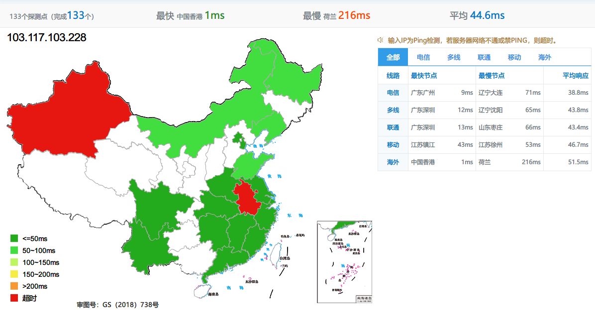

## DMIT介绍

[DMIT](https://www.dmit.io/)是一家 2018 年成立的美国主机商，在成立之初推出的香港机房云主机，其大带宽和基于 kvm 虚拟化掀起了一波热潮。目前 DMIT 已有两家数据中心分别是香港和洛杉矶，主要产品包括云主机和独立服务器租用。DMIT 推出的云主机基于 KVM 虚拟化和 SSD 存储，并提供 DDoS 防护。根据 DMIT 官网介绍其 vps 云主机直连联通、电信 CN2、ntt、pccw 等线路，网络质量应该是有保障的，适合建站用途及一些对带宽质量要求高的用户。


## VPS信息

本次测评的对象是DMIT成立之初推出的**PVM.HKG.MINI**，价格是$14.9/mo，现在已经绝版了，持有的还可以继续续费，此评测仅作为对比参考

测评机器配置如下：

- 2 vCPU
- 1 GB RAM
- 21G SSD Storage
- 1200GB Bandwidth @200Mbps
- 1 IPv4 & 1 IPv6 /64
- 价格：$14.90每月
- 虚拟化架构：KVM

## 总结

这款VPS无论线路还是时延都是相当极品的，价格稍微有点贵，但是随着CN2国际网络价格飙升，香港CN2这种极品很难买到了，而且DMIT关闭了主机Transfer功能，给二手交易造成了一定的阻碍，所以手里有的老铁可当传家宝使了，且用且珍惜吧。

## 全国时延测试



虽然有红的，但是绿的也是一大片

## `superbench`脚本测试


```properties
----------------------------------------------------------------------
 CPU Model            : AMD EPYC 7402P 24-Core Processor
 CPU Cores            : 2 Cores 2794.748 MHz x86_64
 CPU Cache            : 512 KB
 OS                   : CentOS 7.9.2009 (64 Bit) KVM
 Kernel               : 4.9.215-36.el7.x86_64
 Total Space          : 8.2 GB / 21.0 GB
 Total RAM            : 275 MB / 989 MB (238 MB Buff)
 Total SWAP           : 1 MB / 59 MB
 Uptime               : 15 days 2 hour 30 min
 Load Average         : 0.13, 0.29, 0.18
 TCP CC               : bbr
 ASN & ISP            : AS54574, DMIT Inc
 Organization         :
 Location             : Tseung Kwan O, Hong Kong / HK
 Region               : Sai Kung District
----------------------------------------------------------------------
 I/O Speed( 1.0GB )   : 621 MB/s
 I/O Speed( 1.0GB )   : 706 MB/s
 I/O Speed( 1.0GB )   : 638 MB/s
 Average I/O Speed    : 655.0 MB/s
----------------------------------------------------------------------
 Node Name        Upload Speed      Download Speed      Latency
 Speedtest.net    203.22 Mbit/s     191.51 Mbit/s       0.77 ms
 Fast.com         0.00 Mbit/s       86.2 Mbit/s         -
 Nanjing 5G   CT  204.87 Mbit/s     195.53 Mbit/s       33.39 ms
 Hefei 5G     CT  195.43 Mbit/s     198.54 Mbit/s       36.44 ms
 TianJin 5G   CU  202.39 Mbit/s     196.51 Mbit/s       44.05 ms
 Shanghai 5G  CU  208.95 Mbit/s     203.17 Mbit/s       35.69 ms
 Guangzhou 5G CU  207.57 Mbit/s     199.29 Mbit/s       6.83 ms
 Tianjin 5G   CM  176.29 Mbit/s     196.48 Mbit/s       56.04 ms
 Wuxi 5G      CM  206.28 Mbit/s     112.05 Mbit/s       40.71 ms
 Nanjing 5G   CM  0.05 Mbit/s       149.80 Mbit/s       46.44 ms
 Hefei 5G     CM  198.79 Mbit/s     210.10 Mbit/s       40.94 ms
 Changsha 5G  CM  203.32 Mbit/s     195.50 Mbit/s       37.38 ms
----------------------------------------------------------------------
 Finished in  : 4 min 55 sec
 Timestamp    : 2021-08-01 10:04:43 GMT+8
----------------------------------------------------------------------

```

IO 和 网络还是很优秀的

## `LemonBenchIntl`脚本测试结果

```properties
 -> System Information

 OS Release:            CentOS Linux 7.9.2009 (x86_64)
 CPU Model:             AMD EPYC 7402P 24-Core Processor  2.79 GHz
 CPU Cache Size:        512 KB
 CPU Number:            2 vCPU
 Virt Type:             KVM
 Memory Usage:          312.04 MB / 989.56 MB
 Swap Usage:            4.17 MB / 60.00 MB
 Disk Usage:            8.56 GB / 21.55 GB
 Boot Device:           /dev/vda2
 Load (1/5/15min):      0.46 0.19 0.10
 CPU Usage:             6.0% used, 0.0% iowait, 0.0% steal
 Kernel Version:        4.9.215-36.el7.x86_64
 Network CC Method:     bbr + fq

 -> Network Information

 IPV4 - IP Address:     [HK] 此处隐藏
 IPV4 - ASN Info:       54574 (DMIT - DMIT Cloud Services, US)
 IPV4 - Region:          Hong Kong SAR
 IPV6 - IP Address:     [HK] 2403:18c0:2:26d::
 IPV6 - ASN Info:       54574 (DMIT - DMIT Cloud Services, US)
 IPV6 - Region:          Hong Kong SAR

 -> Media Unlock Test

 HBO Now:                               No
 Bahamut Anime:                         No
 Abema.TV:                              No
 Princess Connect Re:Dive Japan:        No
 BBC:                                   No
 Bilibili China Mainland Only:          No
 Bilibili Hongkong/Macau/Taiwan:        Yes
 Bilibili Taiwan Only:                  No

 -> CPU Performance Test (Fast Mode, 1-Pass @ 5sec)

 1 Thread Test:                 1643 Scores
 2 Threads Test:                3193 Scores

 -> Memory Performance Test (Fast Mode, 1-Pass @ 5sec)

 1 Thread - Read Test :         41581.39 MB/s
 1 Thread - Write Test:         18133.38 MB/s

 -> Disk Speed Test (4K Block/1M Block, Direct Mode)

 Test Name              Write Speed                             Read Speed
 100MB-4K Block         16.0 MB/s (3917 IOPS, 6.54 s)           13.1 MB/s (3190 IOPS, 8.02 s)
 1GB-1M Block           929 MB/s (886 IOPS, 1.13 s)             236 MB/s (224 IOPS, 4.45 s)

 -> Speedtest.net Network Speed Test

 Node Name                      Upload Speed    Download Speed  Ping Latency    Server Name
 Speedtest Default              24.72 MB/s      23.74 MB/s      0.78 ms         i3D.net (Hong Kong Hong Kong)
 China, Beijing CU              Fail: Timeout Exceeded after 60 seconds
 China, Shanghai CT             24.66 MB/s      23.53 MB/s      30.15 ms        China Telecom (China Shanghai)
 China, Hangzhou CM             24.90 MB/s      25.13 MB/s      54.03 ms        China Mobile Group Zhejiang Co.,Ltd (China Hangzhou)

 -> Traceroute Test (IPV4)


Traceroute to China, Beijing CU (TCP Mode, Max 30 Hop)
============================================================
traceroute to 123.125.99.1 (123.125.99.1), 30 hops max, 32 byte packets
 1  103.117.101.254  0.27 ms  AS54574  China, Hong Kong, dmit.io
 2  *
 3  104.254.112.26  0.64 ms  *  United States, California, Los Angeles, zenlayer.com
 4  47.246.61.53  1.26 ms  AS24429  China, Hong Kong, ALIYUN
 5  61.14.203.37  3.02 ms  *  China, Hong Kong, ChinaUnicom
 6  202.77.18.194  9.85 ms  AS10099  China, Hong Kong, ChinaUnicom
 7  43.252.86.129  6.26 ms  AS10099  China, Hong Kong, ChinaUnicom
 8  219.158.10.53  8.53 ms  AS4837  China, Guangdong, Guangzhou, ChinaUnicom
 9  219.158.8.141  38.41 ms  AS4837  China, Shanghai, ChinaUnicom
10  219.158.113.138  35.40 ms  AS4837  China, Shanghai, ChinaUnicom
11  219.158.113.105  35.22 ms  AS4837  China, Shanghai, ChinaUnicom
12  219.158.6.189  47.20 ms  AS4837  China, Beijing, ChinaUnicom
13  *
14  124.65.63.46  46.96 ms  AS4808  China, Beijing, ChinaUnicom
15  61.148.158.106  50.98 ms  AS4808  China, Beijing, ChinaUnicom
16  61.135.113.158  49.30 ms  AS4808  China, Beijing, ChinaUnicom
17  *
18  123.125.99.1  48.94 ms  AS4808  China, Beijing, ChinaUnicom


Traceroute to China, Beijing CT (TCP Mode, Max 30 Hop)
============================================================
traceroute to 180.149.128.9 (180.149.128.9), 30 hops max, 32 byte packets
 1  103.117.101.254  5.05 ms  AS54574  China, Hong Kong, dmit.io
 2  *
 3  104.254.112.26  0.53 ms  *  United States, California, Los Angeles, zenlayer.com
 4  47.246.60.169  1.48 ms  AS24429  China, Hong Kong, ALIYUN
 5  203.100.49.33  3.00 ms  *  China, Hong Kong, ChinaTelecom
 6  59.43.247.17  3.00 ms  *  China, Hong Kong, ChinaTelecom
 7  59.43.250.173  40.38 ms  *  China, Beijing, ChinaTelecom
 8  59.43.246.142  42.67 ms  *  China, Beijing, ChinaTelecom
 9  *
10  *
11  218.30.104.30  50.69 ms  AS23724  China, Beijing, ChinaTelecom
12  *
13  180.149.128.9  50.73 ms  AS23724  China, Beijing, ChinaTelecom


Traceroute to China, Beijing CM (TCP Mode, Max 30 Hop)
============================================================
traceroute to 211.136.25.153 (211.136.25.153), 30 hops max, 32 byte packets
 1  103.117.101.254  1.92 ms  AS54574  China, Hong Kong, dmit.io
 2  *
 3  104.254.117.84  9.31 ms  *  United States, California, Los Angeles, zenlayer.com
 4  47.246.60.173  3.20 ms  AS24429  China, Hong Kong, ALIYUN
 5  223.119.7.165  2.13 ms  AS58453  China, Hong Kong, ChinaMobile
 6  223.120.2.29  1.92 ms  AS58453  China, ChinaMobile
 7  *
 8  *
 9  *
10  111.24.2.245  40.83 ms  AS9808  China, Beijing, ChinaMobile
11  111.24.14.46  40.65 ms  AS9808  China, Beijing, ChinaMobile
12  *
13  111.24.2.134  43.13 ms  AS9808  China, Beijing, ChinaMobile
14  *
15  *
16  *
17  211.136.25.153  48.86 ms  AS56048  China, Beijing, ChinaMobile


Traceroute to China, Shanghai CU (TCP Mode, Max 30 Hop)
============================================================
traceroute to 58.247.8.158 (58.247.8.158), 30 hops max, 32 byte packets
 1  103.117.101.254  0.29 ms  AS54574  China, Hong Kong, dmit.io
 2  *
 3  104.254.117.84  8.27 ms  *  United States, California, Los Angeles, zenlayer.com
 4  47.246.61.53  1.14 ms  AS24429  China, Hong Kong, ALIYUN
 5  61.14.203.37  3.15 ms  *  China, Hong Kong, ChinaUnicom
 6  202.77.18.194  6.35 ms  AS10099  China, Hong Kong, ChinaUnicom
 7  43.252.86.129  9.30 ms  AS10099  China, Hong Kong, ChinaUnicom
 8  219.158.10.49  11.33 ms  AS4837  China, Guangdong, Guangzhou, ChinaUnicom
 9  219.158.115.125  32.41 ms  AS4837  China, ChinaUnicom
10  219.158.113.126  35.83 ms  AS4837  China, Shanghai, ChinaUnicom
11  *
12  *
13  58.247.221.178  87.79 ms  AS17621  China, Shanghai, ChinaUnicom
14  139.226.225.22  33.96 ms  AS17621  China, Shanghai, ChinaUnicom
15  58.247.8.153  48.30 ms  AS17621  China, Shanghai, ChinaUnicom
16  *
17  *
18  *
19  *
20  *
21  *
22  *
23  *
24  *
25  *
26  *
27  *
28  *
29  *
30  *


Traceroute to China, Shanghai CT (TCP Mode, Max 30 Hop)
============================================================
traceroute to 180.153.28.5 (180.153.28.5), 30 hops max, 32 byte packets
 1  103.117.101.254  3.50 ms  AS54574  China, Hong Kong, dmit.io
 2  *
 3  104.254.112.26  0.51 ms  *  United States, California, Los Angeles, zenlayer.com
 4  47.246.60.169  1.04 ms  AS24429  China, Hong Kong, ALIYUN
 5  203.12.205.133  2.42 ms  AS4809  China, Hong Kong, ChinaTelecom
 6  59.43.186.125  3.00 ms  *  China, Hong Kong, ChinaTelecom
 7  59.43.183.77  29.10 ms  *  China, Shanghai, ChinaTelecom
 8  59.43.244.122  31.56 ms  *  China, Shanghai, ChinaTelecom
 9  *
10  *
11  101.95.120.81  32.67 ms  AS4812  China, Shanghai, ChinaTelecom
12  101.95.207.230  29.66 ms  AS4812  China, Shanghai, ChinaTelecom
13  124.74.232.54  35.43 ms  AS4811  China, Shanghai, ChinaTelecom
14  101.227.255.46  29.50 ms  AS4812  China, Shanghai, ChinaTelecom
15  180.153.28.5  29.82 ms  AS4812  China, Shanghai, ChinaTelecom


Traceroute to China, Shanghai CM (TCP Mode, Max 30 Hop)
============================================================
traceroute to 221.183.55.22 (221.183.55.22), 30 hops max, 32 byte packets
 1  103.117.101.254  0.32 ms  AS54574  China, Hong Kong, dmit.io
 2  *
 3  104.254.112.26  0.60 ms  *  United States, California, Los Angeles, zenlayer.com
 4  47.246.60.165  1.16 ms  AS24429  China, Hong Kong, ALIYUN
 5  223.119.7.221  6.34 ms  AS58453  China, Hong Kong, ChinaMobile
 6  223.120.2.29  2.02 ms  AS58453  China, ChinaMobile
 7  *
 8  *
 9  221.183.55.22  39.37 ms  AS9808  China, Shanghai, ChinaMobile


Traceroute to China, Guangzhou CU (TCP Mode, Max 30 Hop)
============================================================
traceroute to 210.21.4.130 (210.21.4.130), 30 hops max, 32 byte packets
 1  103.117.101.254  0.27 ms  AS54574  China, Hong Kong, dmit.io
 2  *
 3  104.254.112.26  13.02 ms  *  United States, California, Los Angeles, zenlayer.com
 4  47.246.61.53  1.13 ms  AS24429  China, Hong Kong, ALIYUN
 5  61.14.203.37  3.14 ms  *  China, Hong Kong, ChinaUnicom
 6  61.14.201.93  3.66 ms  *  China, Hong Kong, ChinaUnicom
 7  43.252.86.129  6.89 ms  AS10099  China, Hong Kong, ChinaUnicom
 8  219.158.20.97  12.76 ms  AS4837  China, Beijing, ChinaUnicom
 9  219.158.24.137  12.78 ms  AS4837  China, Guangdong, Guangzhou, ChinaUnicom
10  219.158.24.125  15.08 ms  AS4837  China, Guangdong, Guangzhou, ChinaUnicom
11  120.86.0.182  15.26 ms  AS17816  China, Guangdong, Guangzhou, ChinaUnicom
12  120.80.79.194  7.85 ms  AS17622  China, Guangdong, Guangzhou, ChinaUnicom
13  *
14  *
15  *
16  *
17  *
18  *
19  *
20  *
21  *
22  *
23  *
24  *
25  *
26  *
27  *
28  *
29  *
30  *


Traceroute to China, Guangzhou CT (TCP Mode, Max 30 Hop)
============================================================
traceroute to 113.108.209.1 (113.108.209.1), 30 hops max, 32 byte packets
 1  103.117.101.254  3.65 ms  AS54574  China, Hong Kong, dmit.io
 2  *
 3  104.254.117.84  5.71 ms  *  United States, California, Los Angeles, zenlayer.com
 4  47.246.60.169  1.20 ms  AS24429  China, Hong Kong, ALIYUN
 5  203.12.205.133  2.40 ms  AS4809  China, Hong Kong, ChinaTelecom
 6  59.43.247.21  1.67 ms  *  China, Hong Kong, ChinaTelecom
 7  59.43.248.201  7.81 ms  *  China, Guangdong, Guangzhou, ChinaTelecom
 8  *
 9  59.43.130.113  8.43 ms  *  China, Guangdong, Guangzhou, ChinaTelecom
10  202.97.82.34  13.68 ms  AS4134  China, Guangdong, Guangzhou, ChinaTelecom
11  113.108.209.1  7.67 ms  AS58466  China, Guangdong, Guangzhou, ChinaTelecom


Traceroute to China, Guangzhou CM (TCP Mode, Max 30 Hop)
============================================================
traceroute to 120.196.212.25 (120.196.212.25), 30 hops max, 32 byte packets
 1  103.117.101.254  0.35 ms  AS54574  China, Hong Kong, dmit.io
 2  *
 3  104.254.117.84  9.09 ms  *  United States, California, Los Angeles, zenlayer.com
 4  47.246.60.165  1.14 ms  AS24429  China, Hong Kong, ALIYUN
 5  223.119.7.165  2.03 ms  AS58453  China, Hong Kong, ChinaMobile
 6  *
 7  *
 8  *
 9  221.176.24.61  9.26 ms  AS9808  China, Guangdong, Guangzhou, ChinaMobile
10  111.24.14.149  12.36 ms  AS9808  China, Guangdong, Guangzhou, ChinaMobile
11  111.24.5.30  11.03 ms  AS9808  China, Guangdong, Guangzhou, ChinaMobile
12  211.136.249.101  11.76 ms  AS56040  China, Guangdong, Guangzhou, ChinaMobile
13  211.136.208.81  12.55 ms  AS56040  China, Guangdong, Guangzhou, ChinaMobile
14  211.139.180.106  14.16 ms  AS56040  China, Guangdong, Guangzhou, ChinaMobile
15  *
16  *
17  120.196.212.25  10.58 ms  AS56040  China, Guangdong, Guangzhou, ChinaMobile


Traceroute to China, Shanghai CU AS9929 (TCP Mode, Max 30 Hop)
============================================================
traceroute to 210.13.66.238 (210.13.66.238), 30 hops max, 32 byte packets
 1  103.117.101.254  0.30 ms  AS54574  China, Hong Kong, dmit.io
 2  *
 3  63.223.17.94  2.59 ms  AS3491,AS31713  China, Hong Kong, pccw.com
 4  63.223.15.190  2.14 ms  AS3491,AS31713  China, Hong Kong, pccw.com
 5  *
 6  218.105.11.85  9.06 ms  AS9929  China, Guangdong, Guangzhou, ChinaUnicom
 7  218.105.2.109  6.38 ms  AS9929  China, Guangdong, Guangzhou, ChinaUnicom
 8  *
 9  218.105.2.198  54.10 ms  AS9929  China, Shanghai, ChinaUnicom
10  210.13.112.254  60.29 ms  Limit Exceeded! (sales@ipip.net)
11  210.13.66.237  60.62 ms  Limit Exceeded! (sales@ipip.net)
12  210.13.66.238  66.77 ms  Limit Exceeded! (sales@ipip.net)


Traceroute to China, Shanghai CT CN2 (TCP Mode, Max 30 Hop)
============================================================
traceroute to 58.32.0.1 (58.32.0.1), 30 hops max, 32 byte packets
 1  103.117.101.254  10.65 ms  Limit Exceeded! (sales@ipip.net)
 2  *
 3  129.250.5.10  32.62 ms  Limit Exceeded! (sales@ipip.net)
 4  129.250.5.161  1.93 ms  Limit Exceeded! (sales@ipip.net)
 5  203.131.241.66  1.92 ms  Limit Exceeded! (sales@ipip.net)
 6  59.43.248.109  29.71 ms  Limit Exceeded! (sales@ipip.net)
 7  *
 8  59.43.138.65  27.45 ms  Limit Exceeded! (sales@ipip.net)
 9  101.95.88.46  33.54 ms  Limit Exceeded! (sales@ipip.net)
10  101.95.95.78  30.64 ms  Limit Exceeded! (sales@ipip.net)
11  58.32.0.1  30.95 ms  Limit Exceeded! (sales@ipip.net)


Traceroute to China, Guangzhou CT CN2 Gaming Broadband (TCP Mode, Max 30 Hop)
============================================================
traceroute to 119.121.0.1 (119.121.0.1), 30 hops max, 32 byte packets
 1  103.117.101.254  0.45 ms  Limit Exceeded! (sales@ipip.net)
 2  *
 3  104.254.117.84  6.89 ms  Limit Exceeded! (sales@ipip.net)
 4  47.246.61.53  1.15 ms  Limit Exceeded! (sales@ipip.net)
 5  162.245.125.225  2.09 ms  Limit Exceeded! (sales@ipip.net)
 6  162.245.124.13  1.85 ms  Limit Exceeded! (sales@ipip.net)
 7  43.252.86.141  8.75 ms  Limit Exceeded! (sales@ipip.net)
 8  219.158.10.61  13.39 ms  Limit Exceeded! (sales@ipip.net)
 9  219.158.97.26  13.61 ms  Limit Exceeded! (sales@ipip.net)
10  *
11  219.158.24.6  9.32 ms  Limit Exceeded! (sales@ipip.net)
12  202.97.17.149  7.40 ms  Limit Exceeded! (sales@ipip.net)
13  *
14  183.56.34.26  15.60 ms  Limit Exceeded! (sales@ipip.net)
15  *
16  119.121.0.1  9.44 ms  Limit Exceeded! (sales@ipip.net)


Traceroute to China, Beijing Dr.Peng Home Network (TCP Mode, Max 30 Hop)
============================================================
traceroute to 14.131.128.1 (14.131.128.1), 30 hops max, 32 byte packets
 1  *
 2  *
 3  *
 4  *
 5  *
 6  *
 7  *
 8  *
 9  *
10  *
11  *
12  *
13  *
14  *
15  *
16  *
17  *
18  *
19  *
20  *
21  *
22  *
23  *
24  *
25  *
26  *
27  *
28  *
29  *
30  *


Traceroute to China, Beijing Dr.Peng Network IDC Network (TCP Mode, Max 30 Hop)
============================================================
traceroute to 211.167.230.100 (211.167.230.100), 30 hops max, 32 byte packets
 1  103.117.101.254  0.36 ms  Limit Exceeded! (sales@ipip.net)
 2  *
 3  104.254.112.26  0.60 ms  Limit Exceeded! (sales@ipip.net)
 4  47.246.61.53  1.26 ms  Limit Exceeded! (sales@ipip.net)
 5  162.245.125.225  2.10 ms  Limit Exceeded! (sales@ipip.net)
 6  61.14.201.93  2.91 ms  Limit Exceeded! (sales@ipip.net)
 7  202.77.23.25  10.28 ms  Limit Exceeded! (sales@ipip.net)
 8  219.158.20.97  12.10 ms  Limit Exceeded! (sales@ipip.net)
 9  219.158.115.125  38.29 ms  Limit Exceeded! (sales@ipip.net)
10  219.158.113.118  33.88 ms  Limit Exceeded! (sales@ipip.net)
11  *
12  219.158.8.241  53.41 ms  Limit Exceeded! (sales@ipip.net)
13  202.96.12.90  52.79 ms  Limit Exceeded! (sales@ipip.net)
14  202.96.13.102  51.62 ms  Limit Exceeded! (sales@ipip.net)
15  *
16  218.241.244.10  48.37 ms  Limit Exceeded! (sales@ipip.net)
17  218.241.255.86  49.88 ms  Limit Exceeded! (sales@ipip.net)
18  218.241.245.102  52.41 ms  Limit Exceeded! (sales@ipip.net)
19  218.241.245.54  51.50 ms  Limit Exceeded! (sales@ipip.net)
20  *
21  211.167.230.100  48.01 ms  Limit Exceeded! (sales@ipip.net)


Traceroute to China, Beijing CERNET (TCP Mode, Max 30 Hop)
============================================================
traceroute to 202.205.109.205 (202.205.109.205), 30 hops max, 32 byte packets
 1  103.117.101.254  0.33 ms  Limit Exceeded! (sales@ipip.net)
 2  *
 3  104.254.112.26  0.71 ms  Limit Exceeded! (sales@ipip.net)
 4  47.246.60.177  4.69 ms  Limit Exceeded! (sales@ipip.net)
 5  203.12.205.133  2.73 ms  Limit Exceeded! (sales@ipip.net)
 6  59.43.249.9  1.89 ms  Limit Exceeded! (sales@ipip.net)
 7  59.43.250.77  6.33 ms  Limit Exceeded! (sales@ipip.net)
 8  59.43.245.30  10.01 ms  Limit Exceeded! (sales@ipip.net)
 9  202.97.91.193  8.99 ms  Limit Exceeded! (sales@ipip.net)
10  202.97.90.169  36.12 ms  Limit Exceeded! (sales@ipip.net)
11  202.97.63.194  7.93 ms  Limit Exceeded! (sales@ipip.net)
12  *
13  101.4.117.33  22.46 ms  Limit Exceeded! (sales@ipip.net)
14  101.4.112.38  23.96 ms  Limit Exceeded! (sales@ipip.net)
15  101.4.117.38  33.54 ms  Limit Exceeded! (sales@ipip.net)
16  *
17  101.4.113.110  44.09 ms  Limit Exceeded! (sales@ipip.net)
18  219.224.102.230  43.93 ms  Limit Exceeded! (sales@ipip.net)
19  *
20  202.205.109.205  47.95 ms  Limit Exceeded! (sales@ipip.net)


Traceroute to China, Beijing CSTNET (TCP Mode, Max 30 Hop)
============================================================
traceroute to 159.226.254.1 (159.226.254.1), 30 hops max, 32 byte packets
 1  103.117.101.254  1.97 ms  Limit Exceeded! (sales@ipip.net)
 2  *
 3  159.226.254.217  2.90 ms  Limit Exceeded! (sales@ipip.net)
 4  159.226.254.9  36.85 ms  Limit Exceeded! (sales@ipip.net)
 5  159.226.254.1  37.63 ms  Limit Exceeded! (sales@ipip.net)


Traceroute to China, Beijing GCable (TCP Mode, Max 30 Hop)
============================================================
traceroute to 211.156.140.17 (211.156.140.17), 30 hops max, 32 byte packets
 1  103.117.101.254  0.31 ms  Limit Exceeded! (sales@ipip.net)
 2  *
 3  104.254.117.84  1.41 ms  Limit Exceeded! (sales@ipip.net)
 4  47.246.60.177  3.27 ms  Limit Exceeded! (sales@ipip.net)
 5  203.12.205.133  2.35 ms  Limit Exceeded! (sales@ipip.net)
 6  59.43.247.17  3.54 ms  Limit Exceeded! (sales@ipip.net)
 7  59.43.246.209  39.86 ms  Limit Exceeded! (sales@ipip.net)
 8  59.43.246.154  44.53 ms  Limit Exceeded! (sales@ipip.net)
 9  202.97.14.253  43.76 ms  Limit Exceeded! (sales@ipip.net)
10  202.97.53.17  62.64 ms  Limit Exceeded! (sales@ipip.net)
11  219.141.142.121  48.53 ms  Limit Exceeded! (sales@ipip.net)
12  *
13  106.120.252.154  44.96 ms  Limit Exceeded! (sales@ipip.net)
14  60.247.93.254  49.16 ms  Limit Exceeded! (sales@ipip.net)
15  211.156.128.249  45.52 ms  Limit Exceeded! (sales@ipip.net)
16  211.156.140.17  61.51 ms  Limit Exceeded! (sales@ipip.net)

```

回程看上去也还行

## 去程路由测试

| 跳数 |                              IP                              |                        主机名                        |                   地区（仅供参考）                    |                       AS号（仅供参考）                       |    时间（毫秒）    |
| :--: | :----------------------------------------------------------: | :--------------------------------------------------: | :---------------------------------------------------: | :----------------------------------------------------------: | :----------------: |
|  1   | [112.19.161.1](https://whois.ipip.net/cidr/112.19.161.1/32)  |                     112.19.161.1                     |           中国四川成都 chinamobile.com 移动           |           [AS9808](https://whois.ipip.net/AS9808)            |   2.6 / 7.7 / 2    |
|  2   | [221.182.42.125](https://whois.ipip.net/cidr/221.182.42.125/32) |                    221.182.42.125                    |           中国四川成都 chinamobile.com 移动           |           [AS9808](https://whois.ipip.net/AS9808)            |  8.9 / 2.9 / 1.9   |
|  3   | [223.87.26.29](https://whois.ipip.net/cidr/223.87.26.29/32)  |                     223.87.26.29                     |           中国四川成都 chinamobile.com 移动           |           [AS9808](https://whois.ipip.net/AS9808)            |    2 / 2.1 / 2     |
|  4   | [223.87.26.45](https://whois.ipip.net/cidr/223.87.26.45/32)  |                     223.87.26.45                     |           中国四川成都 chinamobile.com 移动           |           [AS9808](https://whois.ipip.net/AS9808)            |  2.8 / 2.5 / 3.1   |
|  5   |  [111.24.8.57](https://whois.ipip.net/cidr/111.24.8.57/32)   |                     111.24.8.57                      |           中国四川成都 chinamobile.com 移动           |           [AS9808](https://whois.ipip.net/AS9808)            |  3.7 / 2.9 / 2.4   |
|  6   | [111.24.4.129](https://whois.ipip.net/cidr/111.24.4.129/32)  |                     111.24.4.129                     |           中国广东广州 chinamobile.com 移动           |           [AS9808](https://whois.ipip.net/AS9808)            | 37.4 / 37.2 / 38.1 |
|  7   | [111.24.4.230](https://whois.ipip.net/cidr/111.24.4.230/32)  |                     111.24.4.230                     |           中国广东广州 chinamobile.com 移动           |           [AS9808](https://whois.ipip.net/AS9808)            | 38.6 / 34.2 / 33.5 |
|  8   | [221.183.68.137](https://whois.ipip.net/cidr/221.183.68.137/32) |                    221.183.68.137                    |           中国广东广州 chinamobile.com 移动           |           [AS9808](https://whois.ipip.net/AS9808)            | 36.5 / 36.7 / 36.7 |
|  9   | [221.176.19.242](https://whois.ipip.net/cidr/221.176.19.242/32) |                    221.176.19.242                    |           中国广东广州 chinamobile.com 移动           |           [AS9808](https://whois.ipip.net/AS9808)            | 43.5 / 42.6 / 41.6 |
|  10  | [221.183.55.77](https://whois.ipip.net/cidr/221.183.55.77/32) |                    221.183.55.77                     |           中国广东广州 chinamobile.com 移动           |           [AS9808](https://whois.ipip.net/AS9808)            | 43.1 / 43.6 / 43.5 |
|  11  | * [223.120.2.85](https://whois.ipip.net/cidr/223.120.2.85/32) |             * 223.120.2.85 223.120.2.85              |            * 中国香港 chinamobile.com 移动            | * [AS58453](https://whois.ipip.net/AS58453) / [AS9808](https://whois.ipip.net/AS9808) [AS58453](https://whois.ipip.net/AS58453) / [AS9808](https://whois.ipip.net/AS9808) |    * 48.5 45.7     |
|  12  |                              *                               |                          *                           |                           *                           |                              *                               |         *          |
|  13  | [123.255.90.233](https://whois.ipip.net/cidr/123.255.90.233/32) | 123.255.90.233 dmit1-10g.hkix.net dmit1-10g.hkix.net | 中国香港 hkix.net 中国香港 hkix.net 中国香港 hkix.net |                                                              |   42.6 42.5 42.6   |
|  14  |                       xxx.xxx.xxx.xxx                        |           Host-By.DMIT.io Host-By.DMIT.io            |               中国香港 dmit.io 中国香港               | [AS54574](https://whois.ipip.net/AS54574) [AS54574](https://whois.ipip.net/AS54574) [AS54574](https://whois.ipip.net/AS54574) |   45.4 45.6 45.2   |

选择成都移动作为监测点，可以看到BGP从成都经过广州直通香港，这种情况我们叫做**直连**，这是相当优秀的线路啊，不绕路

