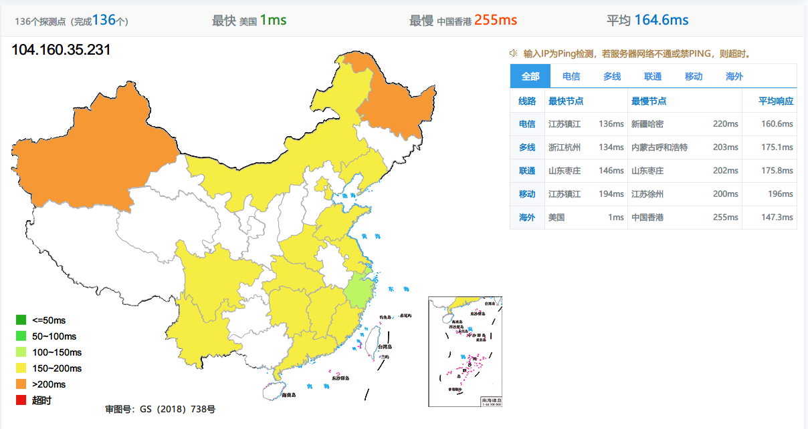

## 搬瓦工介绍

搬瓦工是属于加拿大IT7公司旗下的一家VPS服务商，其注册商标为BandwagonHost，因为读音似BanWaGong，因此国内称其为搬瓦工。 搬瓦工以提供价格低廉且稳定性好的性价比高的VPS作为卖点，付款方式支持信用卡，PayPal，支付宝，是新手站长用来搭建初级网站或者学习Linux技术的不二选择。


## VPS信息

本次评测的对象是搬瓦工Basic VPS：**SPECIAL 20G KVM PROMO V3 - LOS ANGELES - CN2**

看名字就知道是洛杉矶的CN2（单程）

测评机器配置如下：

- CPU 1x Intel Xeon 
- RAM  1024 MB
- 20 GB RAID-10
- 1000GB Bandwidth @1 Gigabit
- 1 IPv4
- 价格：$49.9每年
- 虚拟化架构：KVM

这款一直有货，是**年付版**，链接如下，机房只能选择DC3 CN2

0 https://bwh81.net/cart.php?a=confproduct&i=0

## 总结

中规中矩的配置，单程CN2比非CN2还是好一些，只能说能用，而且是年费，没有月付版了；这款对**电信**线路比较友好，电信用户可考虑。

## 全国时延测试




ping值人性本色比较黄，对延迟不敏感的可以考虑

## `superbench`脚本测试


```properties
----------------------------------------------------------------------
 CPU Model            : QEMU Virtual CPU version (cpu64-rhel6)
 CPU Cores            : 2 Cores 2599.998 MHz x86_64
 CPU Cache            : 16384 KB
 OS                   : CentOS 7.7.1908 (64 Bit) KVM
 Kernel               : 5.3.9-1.el7.elrepo.x86_64
 Total Space          : 9.0 GB / 20.4 GB
 Total RAM            : 257 MB / 998 MB (580 MB Buff)
 Total SWAP           : 0 MB / 259 MB
 Uptime               : 0 days 13 hour 8 min
 Load Average         : 0.12, 0.13, 0.09
 TCP CC               : bbr
 ASN & ISP            : AS25820, IT7 Networks Inc
 Organization         : IT7 Networks Inc
 Location             : Los Angeles, United States / US
 Region               : California
----------------------------------------------------------------------
 I/O Speed( 1.0GB )   : 475 MB/s
 I/O Speed( 1.0GB )   : 578 MB/s
 I/O Speed( 1.0GB )   : 648 MB/s
 Average I/O Speed    : 567.0 MB/s
----------------------------------------------------------------------
 Node Name        Upload Speed      Download Speed      Latency
 Speedtest.net    935.84 Mbit/s     932.62 Mbit/s       0.54 ms
 Fast.com         0.00 Mbit/s       208.3 Mbit/s        -
 Nanjing 5G   CT  553.03 Mbit/s     646.49 Mbit/s       133.95 ms
 Hefei 5G     CT  528.75 Mbit/s     686.20 Mbit/s       159.38 ms
 Guangzhou 5G CT  407.61 Mbit/s     238.07 Mbit/s       164.45 ms
 TianJin 5G   CU  409.28 Mbit/s     762.43 Mbit/s       194.14 ms
 Shanghai 5G  CU  439.78 Mbit/s     845.46 Mbit/s       181.28 ms
 Guangzhou 5G CU  534.80 Mbit/s     670.53 Mbit/s       155.26 ms
 Tianjin 5G   CM  381.12 Mbit/s     471.41 Mbit/s       205.35 ms
 Wuxi 5G      CM  199.96 Mbit/s     16.33 Mbit/s        190.81 ms
 Nanjing 5G   CM  391.97 Mbit/s     89.19 Mbit/s        206.02 ms
 Changsha 5G  CM  407.91 Mbit/s     726.57 Mbit/s       189.99 ms
----------------------------------------------------------------------
 Finished in  : 5 min 59 sec
 Timestamp    : 2021-08-07 09:59:50 GMT+8
 Results      : ./superbench.log
----------------------------------------------------------------------

```

IO 和 网络看起来是相当优秀啊，就是延迟有点高

## `LemonBenchIntl`脚本测试结果

```properties


 [Info] Bench Start Time: 2021-08-07 10:01:43
 [Info] Test Mode: Fast Mode


 -> System Information

 OS Release:            CentOS Linux 7.7.1908 (x86_64)
 CPU Model:             QEMU Virtual CPU version (cpu64-rhel6)  2.60 GHz
 CPU Cache Size:        16384 KB
 CPU Number:            2 vCPU
 Virt Type:             KVM
 Memory Usage:          278.27 MB / 998.02 MB
 Swap Usage:            27.50 MB / 260.00 MB
 Boot Device:           /dev/sda2
 Disk Usage:            9.23 GB / 20.17 GB
 CPU Usage:             6.2% used, 0.0% iowait, 0.0% steal
 Load (1/5/15min):      0.46 0.25 0.16
 Uptime:                0 Days, 13 Hours, 16 Minutes, 25 Seconds
 Kernel Version:        5.3.9-1.el7.elrepo.x86_64
 Network CC Method:     bbr + fq

 -> Network Infomation


 IPV4 - ASN Info:       AS25820 (IT7NET - IT7 Networks Inc, CA)
 IPV4 - Region:         United States California Los Angeles

 -> Media Unlock Test

 HBO Now:                               Yes
 Bahamut Anime:                         No
 Abema.TV:                              No
 Princess Connect Re:Dive Japan:        No
 BBC:                                   No
 BiliBili China Mainland Only:          No
 BiliBili Hongkong/Macau/Taiwan:        No
 Bilibili Taiwan Only:                  No

 -> CPU Performance Test (Fast Mode, 1-Pass @ 5sec)

 1 Thread Test:                 671 Scores
 2 Threads Test:                1340 Scores

 -> Memory Performance Test (Fast Mode, 1-Pass @ 5sec)

 1 Thread - Read Test :         14819.40 MB/s
 1 Thread - Write Test:         11665.07 MB/s

 -> Disk Speed Test (4K Block/1M Block, Direct Mode)

 Test Name              Write Speed                             Read Speed
 100MB-4K Block         17.5 MB/s (4260 IOPS, 6.01s)            21.4 MB/s (5219 IOPS, 4.90s)
 1GB-1M Block           333 MB/s (317 IOPS, 3.15s)              890 MB/s (848 IOPS, 1.18s)

 -> Speedtest.net Network Speed Test

 Node Name                      Upload Speed    Download Speed  Ping Latency    Server Name
 Speedtest Default              111.11 MB/s     110.21 MB/s     0.60 ms         Nitel (United States Los Angeles, CA)
 China, Beijing CU              Fail: Timeout Exceeded after 60 seconds
 China, Shanghai CT             40.73 MB/s      75.38 MB/s      137.35 ms       China Telecom (China Shanghai)
 China, Hangzhou CM             38.49 MB/s      65.83 MB/s      202.93 ms       China Mobile Group Zhejiang Co.,Ltd (China Hangzhou)

 -> Traceroute Test (IPV4)

Traceroute to China, Beijing CU (TCP Mode, Max 30 Hop)
============================================================
traceroute to 123.125.99.1 (123.125.99.1), 30 hops max, 32 byte packets
 1  *
 2  128.14.158.80  6.62 ms  AS21859  United States, California, Los Angeles, zenlayer.com
 3  *
 4  192.254.81.31  0.78 ms  AS21859  United States, California, Los Angeles, zenlayer.com
 5  219.158.45.181  0.89 ms  AS4837  United States, California, Los Angeles, ChinaUnicom
 6  219.158.97.209  158.13 ms  AS4837  China, Guangdong, Guangzhou, ChinaUnicom
 7  219.158.8.141  184.29 ms  AS4837  China, Shanghai, ChinaUnicom
 8  219.158.8.173  185.30 ms  AS4837  China, Guangdong, Guangzhou, ChinaUnicom
 9  219.158.7.129  190.57 ms  AS4837  China, Shanghai, ChinaUnicom
10  *
11  61.49.214.10  202.15 ms  AS4808  China, Beijing, ChinaUnicom
12  219.232.11.130  205.30 ms  AS4808  China, Beijing, ChinaUnicom
13  124.65.194.138  196.34 ms  AS4808  China, Beijing, ChinaUnicom
14  61.135.113.158  198.37 ms  AS4808  China, Beijing, ChinaUnicom
15  *
16  123.125.99.1  210.37 ms  AS4808  China, Beijing, ChinaUnicom

Traceroute to China, Beijing CT (TCP Mode, Max 30 Hop)
============================================================
traceroute to 180.149.128.9 (180.149.128.9), 30 hops max, 32 byte packets
 1  *
 2  128.14.158.80  5.75 ms  AS21859  United States, California, Los Angeles, zenlayer.com
 3  *
 4  192.254.84.19  0.54 ms  AS21859  United States, California, Los Angeles, zenlayer.com
 5  218.30.53.133  7.14 ms  AS4134  United States, California, Los Angeles, ChinaTelecom
 6  202.97.93.165  1.68 ms  AS4134  United States, California, Los Angeles, ChinaTelecom
 7  202.97.93.137  151.70 ms  AS4134  China, ChinaTelecom
 8  202.97.12.89  152.85 ms  AS4134  China, Beijing, ChinaTelecom
 9  180.149.128.9  164.53 ms  AS23724  China, Beijing, ChinaTelecom

Traceroute to China, Beijing CM (TCP Mode, Max 30 Hop)
============================================================
traceroute to 211.136.25.153 (211.136.25.153), 30 hops max, 32 byte packets
 1  *
 2  128.14.158.80  5.83 ms  AS21859  United States, California, Los Angeles, zenlayer.com
 3  *
 4  223.119.66.113  11.08 ms  AS58453  ChinaMobile
 5  223.120.6.17  11.04 ms  AS58453  United States, California, Los Angeles, ChinaMobile
 6  *
 7  *
 8  *
 9  *
10  111.24.2.237  193.55 ms  AS9808  China, Beijing, ChinaMobile
11  111.24.2.241  195.47 ms  AS9808  China, Beijing, ChinaMobile
12  211.136.66.121  195.68 ms  AS56048  China, Beijing, ChinaMobile
13  *
14  211.136.67.166  196.62 ms  AS56048  China, Beijing, ChinaMobile
15  *
16  *
17  *
18  211.136.25.153  196.34 ms  AS56048  China, Beijing, ChinaMobile

Traceroute to China, Shanghai CU (TCP Mode, Max 30 Hop)
============================================================
traceroute to 58.247.8.158 (58.247.8.158), 30 hops max, 32 byte packets
 1  *
 2  128.14.158.80  7.43 ms  AS21859  United States, California, Los Angeles, zenlayer.com
 3  *
 4  *
 5  219.158.45.181  2.98 ms  AS4837  United States, California, Los Angeles, ChinaUnicom
 6  219.158.97.205  165.63 ms  AS4837  China, Guangdong, Guangzhou, ChinaUnicom
 7  219.158.115.125  188.87 ms  AS4837  China, ChinaUnicom
 8  219.158.19.74  189.41 ms  AS4837  China, Shanghai, ChinaUnicom
 9  219.158.19.69  190.04 ms  AS4837  China, Shanghai, ChinaUnicom
10  *
11  58.247.221.178  189.63 ms  AS17621  China, Shanghai, ChinaUnicom
12  139.226.225.22  183.70 ms  AS17621  China, Shanghai, ChinaUnicom
13  58.247.8.153  197.33 ms  AS17621  China, Shanghai, ChinaUnicom
14  *
15  *
16  *
17  *
18  *
19  *
20  *
21  *
22  *
23  *
24  *
25  *
26  *
27  *
28  *
29  *
30  *

Traceroute to China, Shanghai CT (TCP Mode, Max 30 Hop)
============================================================
traceroute to 180.153.28.5 (180.153.28.5), 30 hops max, 32 byte packets
 1  *
 2  128.14.158.80  7.53 ms  AS21859  United States, California, Los Angeles, zenlayer.com
 3  *
 4  192.254.81.3  0.48 ms  AS21859  United States, California, Los Angeles, zenlayer.com
 5  218.30.53.133  2.03 ms  AS4134  United States, California, Los Angeles, ChinaTelecom
 6  202.97.90.117  0.91 ms  AS4134  United States, California, Los Angeles, ChinaTelecom
 7  202.97.42.165  132.05 ms  AS4134  China, Shanghai, ChinaTelecom
 8  202.97.12.193  138.52 ms  AS4134  China, Shanghai, ChinaTelecom
 9  202.97.57.26  146.58 ms  AS4134  China, Shanghai, ChinaTelecom
10  61.152.25.165  137.72 ms  AS4812  China, Shanghai, ChinaTelecom
11  *
12  101.95.225.206  149.42 ms  AS4811  China, Shanghai, ChinaTelecom
13  101.227.255.46  134.45 ms  AS4812  China, Shanghai, ChinaTelecom
14  180.153.28.5  134.00 ms  AS4812  China, Shanghai, ChinaTelecom

Traceroute to China, Shanghai CM (TCP Mode, Max 30 Hop)
============================================================
traceroute to 221.183.55.22 (221.183.55.22), 30 hops max, 32 byte packets
 1  *
 2  128.14.158.80  5.82 ms  AS21859  United States, California, Los Angeles, zenlayer.com
 3  *
 4  223.119.66.113  11.15 ms  AS58453  ChinaMobile
 5  223.120.6.17  11.46 ms  AS58453  United States, California, Los Angeles, ChinaMobile
 6  *
 7  221.183.55.22  190.75 ms  AS9808  China, Shanghai, ChinaMobile

Traceroute to China, Guangzhou CU (TCP Mode, Max 30 Hop)
============================================================
traceroute to 210.21.4.130 (210.21.4.130), 30 hops max, 32 byte packets
 1  *
 2  128.14.158.80  5.91 ms  AS21859  United States, California, Los Angeles, zenlayer.com
 3  *
 4  *
 5  219.158.45.181  4.83 ms  AS4837  United States, California, Los Angeles, ChinaUnicom
 6  219.158.96.33  152.55 ms  AS4837  China, Guangdong, Guangzhou, ChinaUnicom
 7  219.158.96.206  161.16 ms  AS4837  China, Guangdong, Guangzhou, ChinaUnicom
 8  219.158.103.217  150.34 ms  AS4837  China, Guangdong, Guangzhou, ChinaUnicom
 9  120.83.0.62  161.23 ms  AS17816  China, Guangdong, Guangzhou, ChinaUnicom
10  120.80.175.78  155.04 ms  AS17622  China, Guangdong, Guangzhou, ChinaUnicom
11  *
12  *
13  *
14  *
15  *
16  *
17  *
18  *
19  *
20  *
21  *
22  *
23  *
24  *
25  *
26  *
27  *
28  *
29  *
30  *

Traceroute to China, Guangzhou CT (TCP Mode, Max 30 Hop)
============================================================
traceroute to 113.108.209.1 (113.108.209.1), 30 hops max, 32 byte packets
 1  *
 2  128.14.158.80  5.51 ms  AS21859  United States, California, Los Angeles, zenlayer.com
 3  *
 4  192.254.84.19  0.50 ms  AS21859  United States, California, Los Angeles, zenlayer.com
 5  218.30.53.133  8.09 ms  AS4134  United States, California, Los Angeles, ChinaTelecom
 6  202.97.83.241  1.75 ms  AS4134  United States, California, Los Angeles, ChinaTelecom
 7  202.97.49.137  166.45 ms  AS4134  China, Guangdong, Guangzhou, ChinaTelecom
 8  *
 9  202.97.94.133  158.81 ms  AS4134  China, Guangdong, Guangzhou, ChinaTelecom
10  113.108.209.1  158.69 ms  AS58466  China, Guangdong, Guangzhou, ChinaTelecom

Traceroute to China, Guangzhou CM (TCP Mode, Max 30 Hop)
============================================================
traceroute to 120.196.212.25 (120.196.212.25), 30 hops max, 32 byte packets
 1  *
 2  128.14.158.80  6.00 ms  AS21859  United States, California, Los Angeles, zenlayer.com
 3  *
 4  *
 5  223.120.6.17  11.30 ms  AS58453  United States, California, Los Angeles, ChinaMobile
 6  223.120.6.17  11.36 ms  AS58453  United States, California, Los Angeles, ChinaMobile
 7  *
 8  *
 9  221.183.68.142  153.72 ms  AS9808  China, Guangdong, Guangzhou, ChinaMobile
10  111.24.4.233  155.36 ms  AS9808  China, Guangdong, Guangzhou, ChinaMobile
11  111.24.4.253  154.24 ms  AS9808  China, Guangdong, Guangzhou, ChinaMobile
12  211.136.203.14  155.92 ms  AS56040  China, Guangdong, Guangzhou, ChinaMobile
13  211.136.196.222  156.40 ms  AS56040  China, Guangdong, Guangzhou, ChinaMobile
14  211.139.180.110  159.13 ms  AS56040  China, Guangdong, Guangzhou, ChinaMobile
15  211.139.180.106  158.98 ms  AS56040  China, Guangdong, Guangzhou, ChinaMobile
16  120.196.212.25  156.33 ms  AS56040  China, Guangdong, Guangzhou, ChinaMobile

Traceroute to China, Shanghai CU AS9929 (TCP Mode, Max 30 Hop)
============================================================
traceroute to 210.13.66.238 (210.13.66.238), 30 hops max, 32 byte packets
 1  *
 2  128.14.158.80  5.51 ms  AS21859  United States, California, Los Angeles, zenlayer.com
 3  *
 4  192.254.84.19  0.51 ms  AS21859  United States, California, Los Angeles, zenlayer.com
 5  38.104.230.81  0.97 ms  AS174  United States, California, Los Angeles, cogentco.com
 6  154.54.0.165  1.21 ms  AS174  United States, California, Los Angeles, cogentco.com
 7  154.54.25.150  1.36 ms  AS174  United States, California, Los Angeles, cogentco.com
 8  38.142.239.114  123.32 ms  AS174  China, Guangdong, Guangzhou, cogentco.com
 9  210.14.186.133  123.23 ms  *  China, ChinaUnicom
10  218.105.2.198  172.14 ms  AS9929  China, Shanghai, ChinaUnicom
11  210.13.116.86  124.95 ms  AS9929  China, Shanghai, ChinaUnicom
12  210.13.66.237  133.44 ms  AS9929  China, Shanghai, ChinaUnicom
13  210.13.66.238  132.58 ms  AS9929  China, Shanghai, ChinaUnicom

Traceroute to China, Shanghai CT CN2 (TCP Mode, Max 30 Hop)
============================================================
traceroute to 58.32.0.1 (58.32.0.1), 30 hops max, 32 byte packets
 1  *
 2  128.14.158.80  6.55 ms  AS21859  United States, California, Los Angeles, zenlayer.com
 3  *
 4  192.254.81.27  1.23 ms  AS21859  United States, California, Los Angeles, zenlayer.com
 5  *
 6  *
 7  4.71.136.202  2.05 ms  AS3356  United States, California, Los Angeles, level3.com
 8  59.43.182.89  128.59 ms  *  United States, California, Los Angeles, ChinaTelecom
 9  *
10  59.43.138.45  137.86 ms  *  China, Shanghai, ChinaTelecom
11  101.95.88.34  134.96 ms  AS4812  China, Shanghai, ChinaTelecom
12  58.32.0.1  138.39 ms  AS4812  China, Shanghai, ChinaTelecom

Traceroute to China, Guangzhou CT CN2 Gaming Broadband (TCP Mode, Max 30 Hop)
============================================================
traceroute to 119.121.0.1 (119.121.0.1), 30 hops max, 32 byte packets
 1  *
 2  128.14.158.80  6.76 ms  AS21859  United States, California, Los Angeles, zenlayer.com
 3  *
 4  192.254.81.31  1.48 ms  AS21859  United States, California, Los Angeles, zenlayer.com
 5  *
 6  *
 7  217.163.44.234  148.89 ms  AS3356  United Kingdom, London, level3.com
 8  59.43.187.37  238.05 ms  *  Singapore, ChinaTelecom
 9  *
10  59.43.132.17  225.08 ms  *  China, Beijing, ChinaTelecom
11  59.43.46.70  238.72 ms  *  China, Guangdong, Guangzhou, ChinaTelecom
12  183.57.161.10  237.23 ms  AS134773  China, Guangdong, Guangzhou, ChinaTelecom
13  *
14  *
15  *
16  *
17  *
18  *
19  *
20  *
21  *
22  *
23  *
24  *
25  *
26  *
27  *
28  *
29  *
30  *

Traceroute to China, Beijing Dr.Peng Home Network (TCP Mode, Max 30 Hop)
============================================================
traceroute to 14.131.128.1 (14.131.128.1), 30 hops max, 32 byte packets
 1  *
 2  128.14.158.80  5.49 ms  Limit Exceeded! (sales@ipip.net)
 3  *
 4  *
 5  *
 6  *
 7  *
 8  *
 9  *
10  *
11  *
12  *
13  *
14  *
15  *
16  *
17  *
18  *
19  *
20  *
21  *
22  *
23  *
24  *
25  *
26  *
27  *
28  *
29  *
30  *

Traceroute to China, Beijing Dr.Peng Network IDC Network (TCP Mode, Max 30 Hop)
============================================================
traceroute to 211.167.230.100 (211.167.230.100), 30 hops max, 32 byte packets
 1  *
 2  128.14.158.80  6.28 ms  Limit Exceeded! (sales@ipip.net)
 3  *
 4  *
 5  219.158.45.181  4.21 ms  Limit Exceeded! (sales@ipip.net)
 6  219.158.97.205  168.34 ms  Limit Exceeded! (sales@ipip.net)
 7  219.158.115.125  183.80 ms  Limit Exceeded! (sales@ipip.net)
 8  219.158.6.157  191.05 ms  Limit Exceeded! (sales@ipip.net)
 9  219.158.8.245  184.85 ms  Limit Exceeded! (sales@ipip.net)
10  219.158.16.89  204.22 ms  Limit Exceeded! (sales@ipip.net)
11  *
12  202.96.13.86  199.47 ms  Limit Exceeded! (sales@ipip.net)
13  61.51.37.206  202.46 ms  Limit Exceeded! (sales@ipip.net)
14  218.241.244.22  197.20 ms  Limit Exceeded! (sales@ipip.net)
15  218.241.255.86  204.72 ms  Limit Exceeded! (sales@ipip.net)
16  218.241.255.174  208.93 ms  Limit Exceeded! (sales@ipip.net)
17  218.241.245.54  196.91 ms  Limit Exceeded! (sales@ipip.net)
18  *
19  211.167.230.100  204.50 ms  Limit Exceeded! (sales@ipip.net)

Traceroute to China, Beijing CERNET (TCP Mode, Max 30 Hop)
============================================================
traceroute to 202.205.109.205 (202.205.109.205), 30 hops max, 32 byte packets
 1  *
 2  128.14.158.80  5.75 ms  Limit Exceeded! (sales@ipip.net)
 3  *
 4  192.254.81.27  1.21 ms  Limit Exceeded! (sales@ipip.net)
 5  64.86.197.200  0.93 ms  Limit Exceeded! (sales@ipip.net)
 6  64.86.197.56  1.08 ms  Limit Exceeded! (sales@ipip.net)
 7  66.110.59.182  2.27 ms  Limit Exceeded! (sales@ipip.net)
 8  101.4.117.213  145.75 ms  Limit Exceeded! (sales@ipip.net)
 9  101.4.117.97  146.16 ms  Limit Exceeded! (sales@ipip.net)
10  101.4.116.81  144.02 ms  Limit Exceeded! (sales@ipip.net)
11  219.224.102.230  144.60 ms  Limit Exceeded! (sales@ipip.net)
12  *
13  202.205.109.205  144.34 ms  Limit Exceeded! (sales@ipip.net)

Traceroute to China, Beijing CSTNET (TCP Mode, Max 30 Hop)
============================================================
traceroute to 159.226.254.1 (159.226.254.1), 30 hops max, 32 byte packets
 1  *
 2  128.14.158.80  5.85 ms  Limit Exceeded! (sales@ipip.net)
 3  *
 4  192.254.81.3  0.58 ms  Limit Exceeded! (sales@ipip.net)
 5  38.104.230.81  0.84 ms  Limit Exceeded! (sales@ipip.net)
 6  154.54.0.165  0.90 ms  Limit Exceeded! (sales@ipip.net)
 7  154.54.0.6  145.93 ms  Limit Exceeded! (sales@ipip.net)
 8  154.18.4.2  146.40 ms  Limit Exceeded! (sales@ipip.net)
 9  159.226.254.9  180.49 ms  Limit Exceeded! (sales@ipip.net)
10  159.226.254.1  180.86 ms  Limit Exceeded! (sales@ipip.net)

Traceroute to China, Beijing GCable (TCP Mode, Max 30 Hop)
============================================================
traceroute to 211.156.140.17 (211.156.140.17), 30 hops max, 32 byte packets
 1  *
 2  128.14.158.80  6.36 ms  Limit Exceeded! (sales@ipip.net)
 3  *
 4  192.254.84.19  0.50 ms  Limit Exceeded! (sales@ipip.net)
 5  218.30.53.133  1.79 ms  Limit Exceeded! (sales@ipip.net)
 6  202.97.90.117  3.15 ms  Limit Exceeded! (sales@ipip.net)
 7  202.97.52.5  153.18 ms  Limit Exceeded! (sales@ipip.net)
 8  202.97.12.109  147.32 ms  Limit Exceeded! (sales@ipip.net)
 9  *
10  219.141.147.233  178.39 ms  Limit Exceeded! (sales@ipip.net)
11  *
12  106.120.252.154  186.33 ms  Limit Exceeded! (sales@ipip.net)
13  60.247.93.254  170.82 ms  Limit Exceeded! (sales@ipip.net)
14  211.156.128.85  166.53 ms  Limit Exceeded! (sales@ipip.net)
15  211.156.128.85  165.24 ms  Limit Exceeded! (sales@ipip.net)
16  211.156.140.17  166.19 ms  Limit Exceeded! (sales@ipip.net)


==========================================================================================

 [Info] Bench Finish Time: 2021-08-07 10:06:24
 [Info] Time Elapsed: 281 seconds


```

回程大部分经过了AS4134，这个AS号是中文资源互联网络 ChinaNet，也叫 163 骨干网

## 去程路由测试

- 移动，移动去程经AS9808](https://whois.ipip.net/AS9808)到洛杉矶，这是移动骨干网

| 跳数 |                              IP                              |                  主机名                   |                       地区（仅供参考）                       |                       AS号（仅供参考）                       |     时间（毫秒）      |
| :--: | :----------------------------------------------------------: | :---------------------------------------: | :----------------------------------------------------------: | :----------------------------------------------------------: | :-------------------: |
|  1   | [112.19.161.1](https://whois.ipip.net/cidr/112.19.161.1/32)  |               112.19.161.1                |              中国四川成都 chinamobile.com 移动               |           [AS9808](https://whois.ipip.net/AS9808)            |     2.1 / 5.6 / 2     |
|  2   | [221.182.42.125](https://whois.ipip.net/cidr/221.182.42.125/32) |              221.182.42.125               |              中国四川成都 chinamobile.com 移动               |           [AS9808](https://whois.ipip.net/AS9808)            |    3.1 / 2.4 / 2.4    |
|  3   | [223.87.26.29](https://whois.ipip.net/cidr/223.87.26.29/32)  |               223.87.26.29                |              中国四川成都 chinamobile.com 移动               |           [AS9808](https://whois.ipip.net/AS9808)            |     2 / 2.2 / 3.2     |
|  4   | * [223.87.26.45](https://whois.ipip.net/cidr/223.87.26.45/32) * |             * 223.87.26.45 *              |            * 中国四川成都 chinamobile.com 移动 *             |         * [AS9808](https://whois.ipip.net/AS9808) *          |        * 3.1 *        |
|  5   |  [111.24.8.57](https://whois.ipip.net/cidr/111.24.8.57/32)   |                111.24.8.57                |              中国四川成都 chinamobile.com 移动               |           [AS9808](https://whois.ipip.net/AS9808)            |    3.2 / 2.6 / 3.3    |
|  6   | [111.24.4.129](https://whois.ipip.net/cidr/111.24.4.129/32)  |               111.24.4.129                |              中国广东广州 chinamobile.com 移动               |           [AS9808](https://whois.ipip.net/AS9808)            |   39 / 38.4 / 52.9    |
|  7   | [111.24.4.254](https://whois.ipip.net/cidr/111.24.4.254/32)  |               111.24.4.254                |              中国广东广州 chinamobile.com 移动               |           [AS9808](https://whois.ipip.net/AS9808)            |   34 / 33.6 / 34.1    |
|  8   | [221.176.22.106](https://whois.ipip.net/cidr/221.176.22.106/32) |              221.176.22.106               |              中国广东广州 chinamobile.com 移动               |           [AS9808](https://whois.ipip.net/AS9808)            |   40.2 / 41 / 54.7    |
|  9   | [221.183.25.121](https://whois.ipip.net/cidr/221.183.25.121/32) |              221.183.25.121               |              中国广东广州 chinamobile.com 移动               |           [AS9808](https://whois.ipip.net/AS9808)            |  47.8 / 42.9 / 42.4   |
|  10  | [221.183.55.57](https://whois.ipip.net/cidr/221.183.55.57/32) |               221.183.55.57               |              中国广东广州 chinamobile.com 移动               |           [AS9808](https://whois.ipip.net/AS9808)            |  43.8 / 42.9 / 48.6   |
|  11  | [223.120.2.13](https://whois.ipip.net/cidr/223.120.2.13/32) * [223.120.2.13](https://whois.ipip.net/cidr/223.120.2.13/32) |        223.120.2.13 * 223.120.2.13        | 中国香港 chinamobile.com 移动 * 中国香港 chinamobile.com 移动 | [AS58453](https://whois.ipip.net/AS58453) / [AS9808](https://whois.ipip.net/AS9808) * [AS58453](https://whois.ipip.net/AS58453) / [AS9808](https://whois.ipip.net/AS9808) |      45.2 * 46.1      |
|  12  | * [223.120.2.58](https://whois.ipip.net/cidr/223.120.2.58/32) [223.120.2.58](https://whois.ipip.net/cidr/223.120.2.58/32) |        * 223.120.2.58 223.120.2.58        | * 中国香港 chinamobile.com 移动 中国香港 chinamobile.com 移动 | * [AS58453](https://whois.ipip.net/AS58453) / [AS9808](https://whois.ipip.net/AS9808) [AS58453](https://whois.ipip.net/AS58453) / [AS9808](https://whois.ipip.net/AS9808) |      * 45.7 45.8      |
|  13  | [203.131.241.81](https://whois.ipip.net/cidr/203.131.241.81/32) | ce-0-4-0-0.r02.tkokhk01.hk.bb.gin.ntt.net |                       中国香港 ntt.com                       |           [AS2914](https://whois.ipip.net/AS2914)            |  47.4 / 47.8 / 48.1   |
|  14  |   [4.68.75.93](https://whois.ipip.net/cidr/4.68.75.93/32)    |                4.68.75.93                 |                     中国香港 level3.com                      |           [AS3356](https://whois.ipip.net/AS3356)            |   41 / 41.8 / 42.3    |
|  15  |                              *                               |                     *                     |                              *                               |                              *                               |           *           |
|  16  | [4.15.163.234](https://whois.ipip.net/cidr/4.15.163.234/32)  |  ZENLAYER-IN.ear3.LosAngeles1.Level3.net  |              美国加利福尼亚州洛杉矶 level3.com               |           [AS3356](https://whois.ipip.net/AS3356)            | 201.7 / 202.2 / 202.4 |
|  17  | [192.254.81.26](https://whois.ipip.net/cidr/192.254.81.26/32) |               192.254.81.26               |             美国加利福尼亚州洛杉矶 zenlayer.com              |          [AS21859](https://whois.ipip.net/AS21859)           | 203.5 / 200.9 / 201.7 |
|  18  | [192.254.84.245](https://whois.ipip.net/cidr/192.254.84.245/32) |              192.254.84.245               |             美国加利福尼亚州洛杉矶 zenlayer.com              |          [AS21859](https://whois.ipip.net/AS21859)           | 209.2 / 205.4 / 205.3 |
|  19  |                              *                               |                     *                     |                              *                               |                              *                               |           *           |
|  20  |                                                              |        16clouds.com 116clouds.com         | 美国加利福尼亚州洛杉矶 it7.net 美国加利福尼亚州洛杉矶 it7.net 美国加利福尼亚州洛杉矶 it7.net | [AS25820](https://whois.ipip.net/AS25820) [AS25820](https://whois.ipip.net/AS25820) [AS25820](https://whois.ipip.net/AS25820) |   203.2 202.6 202.8   |

- 电信经AS4134到洛杉矶，这也是163骨干网，说好的CN2呢。。。

| 跳数 |                              IP                              |         主机名          |                地区（仅供参考）                 |                       AS号（仅供参考）                       |     时间（毫秒）      |
| :--: | :----------------------------------------------------------: | :---------------------: | :---------------------------------------------: | :----------------------------------------------------------: | :-------------------: |
|  1   | [211.149.164.1](https://whois.ipip.net/cidr/211.149.164.1/32) |      211.149.164.1      |            中国四川成都 west.cn 电信            |          [AS38283](https://whois.ipip.net/AS38283)           |    6.7 / 1.3 / 3.7    |
|  2   | * [172.18.1.1](https://whois.ipip.net/cidr/172.18.1.1/32) [172.18.1.1](https://whois.ipip.net/cidr/172.18.1.1/32) | * 172.18.1.1 172.18.1.1 |                 * 局域网 局域网                 |                              *                               |       * 4.5 2.9       |
|  3   | [118.123.230.25](https://whois.ipip.net/cidr/118.123.230.25/32) * * |   118.123.230.25 * *    |    中国四川成都 chinatelecom.com.cn 电信 * *    | [AS38283](https://whois.ipip.net/AS38283) / [AS4134](https://whois.ipip.net/AS4134) * * |        1.5 * *        |
|  4   | [182.140.220.169](https://whois.ipip.net/cidr/182.140.220.169/32) |     182.140.220.169     |      中国四川成都 chinatelecom.com.cn 电信      | [AS38283](https://whois.ipip.net/AS38283) / [AS4134](https://whois.ipip.net/AS4134) |    2.1 / 1.5 / 1.8    |
|  5   |                              *                               |            *            |                        *                        |                              *                               |           *           |
|  6   | * [202.97.89.202](https://whois.ipip.net/cidr/202.97.89.202/32) * |    * 202.97.89.202 *    |    * 中国广东广州 chinatelecom.com.cn 电信 *    |         * [AS4134](https://whois.ipip.net/AS4134) *          |       * 37.1 *        |
|  7   | [202.97.94.94](https://whois.ipip.net/cidr/202.97.94.94/32)  |      202.97.94.94       |      中国广东广州 chinatelecom.com.cn 电信      |           [AS4134](https://whois.ipip.net/AS4134)            |   40.7 / 43.3 / 38    |
|  8   | [202.97.99.218](https://whois.ipip.net/cidr/202.97.99.218/32) |      202.97.99.218      | 美国加利福尼亚州洛杉矶 chinatelecom.com.cn 电信 |           [AS4134](https://whois.ipip.net/AS4134)            |  194.3 / 194 / 194.7  |
|  9   | [202.97.90.118](https://whois.ipip.net/cidr/202.97.90.118/32) |      202.97.90.118      | 美国加利福尼亚州洛杉矶 chinatelecom.com.cn 电信 |           [AS4134](https://whois.ipip.net/AS4134)            | 191.1 / 194.4 / 189.5 |
|  10  | [218.30.53.134](https://whois.ipip.net/cidr/218.30.53.134/32) |      218.30.53.134      | 美国加利福尼亚州洛杉矶 chinatelecom.com.cn 电信 |           [AS4134](https://whois.ipip.net/AS4134)            | 198.1 / 198.3 / 197.9 |
|  11  | [192.254.84.18](https://whois.ipip.net/cidr/192.254.84.18/32) |      192.254.84.18      |       美国加利福尼亚州洛杉矶 zenlayer.com       |          [AS21859](https://whois.ipip.net/AS21859)           | 190.6 / 190.5 / 190.6 |
|  12  | [192.254.84.245](https://whois.ipip.net/cidr/192.254.84.245/32) |     192.254.84.245      |       美国加利福尼亚州洛杉矶 zenlayer.com       |          [AS21859](https://whois.ipip.net/AS21859)           | 199.7 / 196.7 / 196.4 |
|  13  |                              *                               |            *            |                        *                        |                              *                               |           *           |
|  14  |                                                              |      16clouds.com       |         美国加利福尼亚州洛杉矶 it7.net          |          [AS25820](https://whois.ipip.net/AS25820)           | 200.3 / 200.2 / 201.1 |

- 联通经AS4837到洛杉矶，这是联通的普通民用网。。

| 跳数 |                              IP                              |     主机名      |              地区（仅供参考）               |             AS号（仅供参考）              |     时间（毫秒）      |
| :--: | :----------------------------------------------------------: | :-------------: | :-----------------------------------------: | :---------------------------------------: | :-------------------: |
|  1   |                              *                               |        *        |                      *                      |                     *                     |           *           |
|  2   | [11.204.252.97](https://whois.ipip.net/cidr/11.204.252.97/32) |  11.204.252.97  |              美国 defense.gov               |  [AS8003](https://whois.ipip.net/AS8003)  |   42.7 / 51.6 / 4.1   |
|  3   | [11.204.252.42](https://whois.ipip.net/cidr/11.204.252.42/32) |  11.204.252.42  |              美国 defense.gov               |  [AS8003](https://whois.ipip.net/AS8003)  |    4.9 / 2.1 / 2.3    |
|  4   | [11.142.211.10](https://whois.ipip.net/cidr/11.142.211.10/32) |  11.142.211.10  |              美国 defense.gov               |  [AS8003](https://whois.ipip.net/AS8003)  |    7.1 / 0.5 / 0.5    |
|  5   | [116.251.118.146](https://whois.ipip.net/cidr/116.251.118.146/32) | 116.251.118.146 |       中国四川成都 aliyun.com 阿里云        | [AS45102](https://whois.ipip.net/AS45102) |    1.1 / 2.2 / 1.3    |
|  6   | [116.251.119.174](https://whois.ipip.net/cidr/116.251.119.174/32) | 116.251.119.174 |       中国四川成都 aliyun.com 阿里云        | [AS45102](https://whois.ipip.net/AS45102) |    1.4 / 1.3 / 2.1    |
|  7   | [101.207.253.225](https://whois.ipip.net/cidr/101.207.253.225/32) | 101.207.253.225 |      中国四川成都 chinaunicom.com 联通      |  [AS4837](https://whois.ipip.net/AS4837)  |      2 / 2.4 / 2      |
|  8   | [119.6.197.65](https://whois.ipip.net/cidr/119.6.197.65/32)  |  119.6.197.65   |      中国四川成都 chinaunicom.com 联通      |  [AS4837](https://whois.ipip.net/AS4837)  |     7.4 / 3.1 / 6     |
|  9   | [219.158.100.221](https://whois.ipip.net/cidr/219.158.100.221/32) | 219.158.100.221 |      中国广东广州 chinaunicom.com 联通      |  [AS4837](https://whois.ipip.net/AS4837)  |  33.4 / 36.8 / 32.5   |
|  10  | [219.158.24.126](https://whois.ipip.net/cidr/219.158.24.126/32) | 219.158.24.126  |      中国广东广州 chinaunicom.com 联通      |  [AS4837](https://whois.ipip.net/AS4837)  |  39.7 / 35.1 / 37.9   |
|  11  | [219.158.24.138](https://whois.ipip.net/cidr/219.158.24.138/32) | 219.158.24.138  |      中国广东广州 chinaunicom.com 联通      |  [AS4837](https://whois.ipip.net/AS4837)  |  39.1 / 42.2 / 37.8   |
|  12  | [219.158.102.158](https://whois.ipip.net/cidr/219.158.102.158/32) | 219.158.102.158 | 美国加利福尼亚州洛杉矶 chinaunicom.com 联通 |  [AS4837](https://whois.ipip.net/AS4837)  |  185.4 / 188.6 / 188  |
|  13  | [219.158.45.182](https://whois.ipip.net/cidr/219.158.45.182/32) | 219.158.45.182  | 美国加利福尼亚州洛杉矶 chinaunicom.com 联通 |  [AS4837](https://whois.ipip.net/AS4837)  | 187.6 / 187.6 / 187.6 |
|  14  | [192.254.81.26](https://whois.ipip.net/cidr/192.254.81.26/32) |  192.254.81.26  |     美国加利福尼亚州洛杉矶 zenlayer.com     | [AS21859](https://whois.ipip.net/AS21859) |  187 / 189.2 / 186.8  |
|  15  | [192.254.84.245](https://whois.ipip.net/cidr/192.254.84.245/32) | 192.254.84.245  |     美国加利福尼亚州洛杉矶 zenlayer.com     | [AS21859](https://whois.ipip.net/AS21859) | 191.5 / 187.5 / 187.2 |
|  16  |                              *                               |        *        |                      *                      |                     *                     |           *           |
|  17  |                                                              |  16clouds.com   |       美国加利福尼亚州洛杉矶 it7.net        | [AS25820](https://whois.ipip.net/AS25820) |  189.1 / 189 / 188.9  |

综上，去程路由和回程路由都很普通。。我没测出有CN2。。