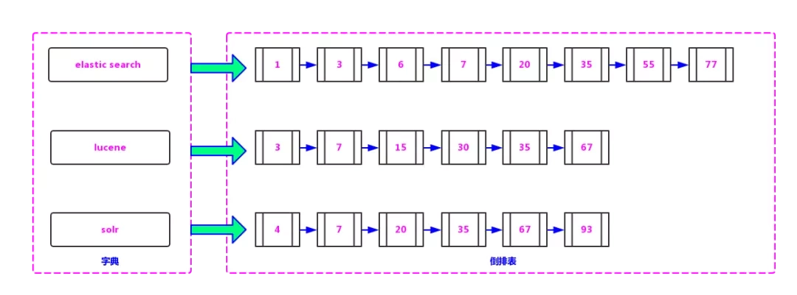
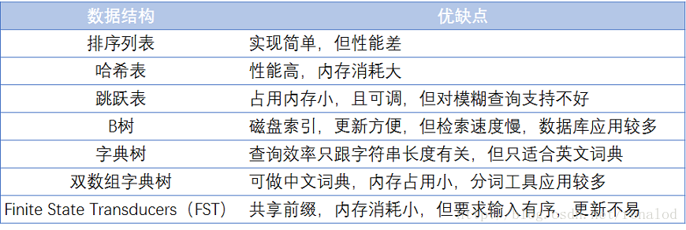
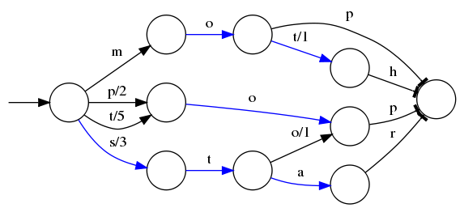
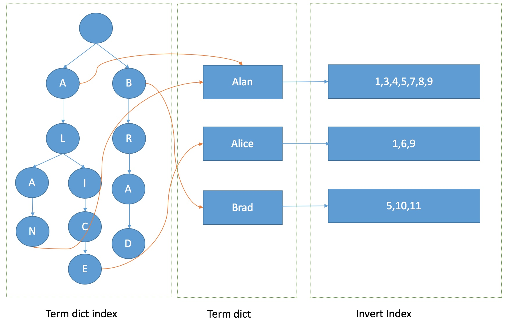
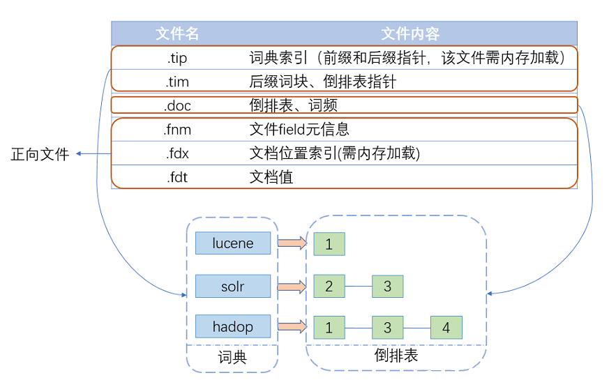
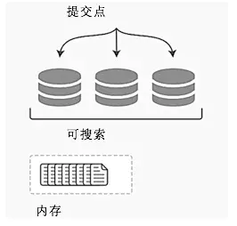
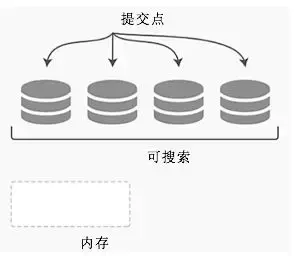

# 5分钟了解搜索引擎Lucene的原理

## 场景

假设现在有10W+份word文档，让你做个web页面，给出关键词能快速搜索结果，你会怎么做？那至少有3种方案，

1. 顺序扫描，每次检测文档中是否包含关键词，包含则加入结果列表，不包含继续查找下一个，直到找完为止。
2. 将文档内容导入数据库，用SQL的`like`关键词搜索。
3. 用Lucene做全文检索。

你会选哪种？首先顺序扫描在数据量大的时候太慢，数据量比较少的话可行；导入数据库数据量太大用`like`会引起全表扫描也会很慢，那当然是第三种，因为搜索引擎Lucene就是专门为这种场景设计的：**大量的，分结构化数据的快速搜索**

看看[官网](https://lucene.apache.org/core/)怎么对Lucene的介绍

**可扩展，高性能的索引过程**

- [在现代化的硬件上面索引超过150G/小时](http://home.apache.org/~mikemccand/lucenebench/indexing.html)
- 只需要1M的堆
- 增量索引和批量索引一样快
- 索引大小大约是文本索引大小的20-30%

**强大，准确和高效的搜索算法**

- 排名搜索——最好的结果优先返回
- 许多强大的查询类型:短语查询，通配符查询，接近查询，范围查询等
- 针对不同的域搜索(例如标题、作者、内容)
- 对任何域进行排序
- 具有合并结果的多索引搜索
- 允许同步更新和搜索
- 插拔式的排名模型, 包括 [Vector Space Model](http://en.wikipedia.org/wiki/Vector_Space_Model) 和 [Okapi BM25](http://en.wikipedia.org/wiki/Okapi_BM25)
- 可配置的存储引擎

## 全文检索原理

全文检索原理很简单，就拿新华字典做比喻，假设字典没有索引页，你要找一个字的解释你就得一页一页翻，直到找到为止，这效率可想而知

现在有了索引页，就可以根据拼音首字母或偏旁部首快速定位到目标字在哪一页，这个索引页，就是全文检索核心。

简而言之：在非结构化数据中，将一部分结构化信息抽取出来，重新组织，然后针对这部分有结构的数据进行索引建立，从而达到加速查询的目的。那么

1. 索引存啥？怎么存？（对应字典的索引页部分）

2. 数据怎么存？（对应字典非索引页部分）

## 反向索引

在Lucene 中，关键词就是**Term**(比如英文里面的一个单词，中文的词语)，**字典**就是Term的集合。下图是Lucene 的索引的底层存储结构，左边是字典，右边保存的是包含左边字符串的文档编码链表，称之为**倒排表**

上面这种就叫做反向索引，是相对正向索引而言的：

- 正向索引：从文档中查找关键词，关系型数据库使用的是正向索引

- 反向索引：从关键词查找文档，搜索引擎lucene使用的是反向索引

比如上图中包含"lucene"这个关键词的文档编码有3,7,15,30,35,67，其他同理

### 单个词查询

查询的时候直接根据关键词返回与之对应的倒排表即可。

### 多个词查询

将要查询的字符串分词，分成多个关键词，根据关键词返回倒排表，再根据逻辑条件(且或非)整合倒排表 

1. 且：很简单，多个倒排表直接做交集运算
2. 或：并集运算
3. 非：差集运算

### 字典

当数据量很大时候，字典的数据就会很多，想想就知道一篇文章关键词是很多的，字典要放到内存里面随时读取才快，那么字典的数据结构就显得十分重要了，既不能太大太占空间，效率也不能太低，下图列了一些常见词典的优缺点：

FST是Lucene现在使用的索引结构

理论基础:   《Direct construction of minimal acyclic subsequential transducers》，通过输入有序字符串构建最小有向无环图。

优点：内存占用率低，压缩率一般在3倍~20倍之间、模糊查询支持好、查询快 

缺点：结构复杂、输入要求有序、更新不易 Lucene里有个FST的实现，从对外接口上看，它跟Map结构很相似，有查找，有迭代

100万数据性能测试：

| 数据结构        | HashMap | TreeMap | FST  |
| --------------- | ------- | ------- | ---- |
| 构建时间(ms)    | 185     | 500     | 1512 |
| 查询所有key(ms) | 106     | 218     | 890  |

可以看出，FST性能基本跟HaspMap差距不大，但FST有个不可比拟的优势就是占用内存小，只有HashMap10分之一左右，这对大数据规模检索是至关重要的，毕竟速度再快放不进内存也是没用的。因此一个合格的词典结构要求有：

　　1. 查询速度。
　　2. 内存占用。
        　　3. 内存+磁盘结合。

所以最终的样子如下，Term dict index以FST的结构存缓存在内存中，从Term dict index查到关键词对应的term dic的块位置之后，再去磁盘上找term，大大减少了磁盘的IO次数。

## 数据分段

搞定了索引之后，再来看看数据是怎么存储的，试想一下如果所有数据(新华字典中所有的字)都存在一个文件中，如果数据有更新或者删除(比如新增加一个字或者删除一个字)，那么所有的索引都需要全量重新创建，这种方式在数据量很大时效率很低，并且由于创建一次索引的成本很高，所以对数据的更新不能过于频繁，也就不能保证时效性。

Lucene在搜索中引入了段(Segment)的概念（将一个索引文件拆分为多个子文件，每个子文件叫作段），每个段都是一个独立的可被搜索的数据集，并且段具有**不变性**，一旦索引的数据被写入硬盘，就不可再修改。

在分段的思想下，对数据写操作的过程如下。

- 新增。当有新的数据需要创建索引时，由于段的不变性，所以选择新建一个段来存储新增的数据。
- 删除。当需要删除数据时，由于数据所在的段只可读，不可写，所以Lucene在索引文件下新增了一个.del的文件，用来专门存储被删除的数据id。当查询时，被删除的数据还是可以被查到的，只是在进行文档链表合并时，才把已经删除的数据过滤掉。**被删除的数据在进行段合并时才会真正被移除**。
- 更新。更新的操作其实就是删除和新增的组合，先在.del文件中记录旧数据，再在新段中添加一条更新后的数据。

### 段不可变的优点

段不变性的优点如下：

- **不需要锁**。因为数据不会更新，所以不用考虑多线程下的读写不一致情况。
- **可以常驻内存**。段在被加载到内存后，由于具有不变性，所以只要内存的空间足够大，就可以长时间驻存，大部分查询请求会直接访问内存，而不需要访问磁盘，使得查询的性能有很大的提升。
- **缓存友好**。在段的生命周期内始终有效，不需要在每次数据更新时被重建。
- **增量创建**。分段可以做到增量创建索引，可以轻量级地对数据进行更新，由于每次创建的成本很低，所以可以频繁地更新数据，使系统接近实时更新。

### 段不可变的缺点

- 当对数据进行删除时，旧数据不会被马上删除，而是在.del文件中被标记为删除。而旧数据只能等到段更新时才能真正被移除，这样会有大量的**空间浪费**。
- 更新。更新数据由删除和新增这两个动作组成。若有一条数据频繁更新，则会有大量的**空间浪费**。
- 由于索引具有不变性，所以每次新增数据时，都需要新增一个段来存储数据。当段的数量太多时，对服务器的资源（如文件句柄）的消耗会非常大，查询的性能也会受到影响。
- 在查询后需要对已经删除的旧数据进行过滤，**这增加了查询的负担**。

### 延迟写策略

为了提升写的性能，Lucene并没有每新增一条数据就增加一个段，而是采用**延迟写**的策略，每当有新增的数据时，就将其先写入内存中，然后批量写入磁盘中。若有一个段被写到硬盘，就会生成一个提交点，提交点就是一个用来记录所有提交后的段信息的文件。**一个段一旦拥有了提交点，就说明这个段只有读的权限，失去了写的权限**

**相反，当段在内存中时，就只有写数据的权限，而不具备读数据的权限，所以也就不能被检索了。从严格意义上来说，Lucene或者Elasticsearch并不能被称为实时的搜索引擎，只能被称为准实时的搜索引擎。**

写索引的流程如下：

新数据被写入时，并没有被直接写到硬盘中，而是被暂时写到内存中。Lucene默认是**一秒钟**，或者当内存中的数据量达到一定阶段时，再批量提交到磁盘中，当然，默认的时间和数据量的大小是可以通过参数控制的。通过延时写的策略，**可以减少数据往磁盘上写的次数**，从而提升整体的写入性能。如下图所示。

在达到触发条件以后，会将内存中缓存的数据一次性写入磁盘中，并生成提交点。清空内存，等待新的数据写入。如图8所示。

### 分段合并

合并原因：虽然分段比每次都全量创建索引有更高的效率，但由于在每次新增数据时都会新增一个段，所以经过长时间的积累，会导致在索引中存在大量的段，当索引中段的数量太多时，不仅会严重消耗服务器的资源，还会影响检索的性能。

因为索引检索的过程是：查询所有段中满足查询条件的数据，然后对每个段里查询的结果集进行合并，所以为了控制索引里段的数量，我们必须定期进行段合并操作。但是如果每次合并全部的段，则将造成很大的资源浪费，特别是"大段"的合并。

所以Lucene现在的段合并思路是：根据段的大小先将段进行分组，再将属于同一组的段进行合并。但是由于对超级大的段的合并需要消耗更多的资源，所以Lucene会在段的大小达到一定规模，或者段里面的数据量达到一定条数时，不会再进行合并。所以Lucene的段合并主要集中在对**中小段的合并上**，这样既可以避免对大段进行合并时消耗过多的服务器资源，也可以很好地控制索引中段的数量。

# 总结

**反向索引**：Lucene 采用了基于**反向索引**的设计原理，可以非常高效地实现文本查找

**数据分段**：在底层采用了**数据分段**的存储模式，分段是只读的，使它在读写时几乎完全避免了锁的出现，大大提升了读写性能。

# 参考

- [Apache Lucene Core](https://lucene.apache.org/core/)
- [5分钟了解lucene全文索引](https://zhuanlan.zhihu.com/p/80434211)
- [Lucene段概念](https://www.jianshu.com/p/4d33705f37e5)
- [lucene搜索原理](https://itx-man.github.io/2019/03/14/lucene/)
- [ElasticSearch底层搜索引擎Lucene原理剖析](https://juejin.cn/post/6844903697642848263)
- [Lucene底层原理和优化经验分享(1)-Lucene简介和索引原理](https://blog.csdn.net/njpjsoftdev/article/details/54015485)
- [掌握它才说明你真正懂 Elasticsearch - Lucene (一)](https://learnku.com/articles/40398#a9c8f7)
- [使用Lucene在知识图谱上构建索引](http://motuhulian.com/7/)
