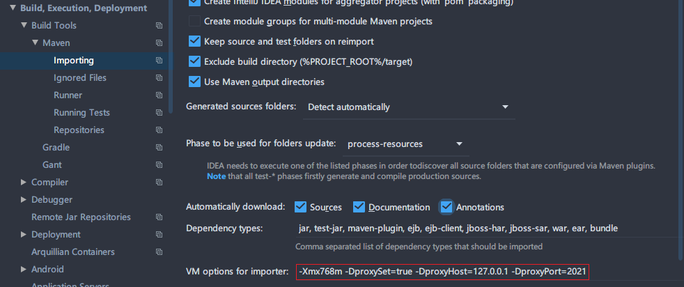

# IDEA构建工具必设置项！Maven+Gradle

试想一下这个场景，当你辛辛苦苦从github上面把源码clone到本地，然后导入IDEA，pom.xml上右键Import as maven project，接下来就是漫长的等待，够你喝上半天的咖啡，因为众所周知的原因，国内访问maven中心仓库的速度不尽如人意，那怎么办？

两个办法

- 设置代理
- 国内镜像

下面是一些SEO优化关键词，不用理会

IDEA Maven代理设置 Gradle代理设置 Maven国内镜像 Gradle国内镜像

# Maven

## 设置代理

很多文章上来就是在`~/.m2/setting.xml`中加入代理配置，例如https://www.jianshu.com/p/efa81250682d，核心配置如下

```xml
<proxies>
    <proxy>
      <id>ss</id>
      <active>true</active>
      <protocol>http</protocol>
     <!-- <protocol>socks</protocol> -->
      <!-- <username>代理账号</username> -->
      <!-- <password>代理密码</password> -->
      <host>127.0.0.1</host>
      <port>1080</port>
      <!-- <nonProxyHosts>local.net|some.host.com</nonProxyHosts> -->
    </proxy>
  </proxies>
```

- active 标签，true表示当前是激活状态，因为proxoies   标签下面可设置多个proxy标签。
- 如果你的代理需要账号密码，就要设置。我使用shadowsockts的http代理，所以不用设置。
- nonProxyHosts标签，用于指定不走代理的地址。使用“|”符号，可以分隔多个地址。例如: www.google.com  |  www.baidu.com

但是不幸的是，我试了很次依然没有效果，如果上面的可以你就直接用上面的就好，如果不行，试试下面的方法：

找到Settings  > Build Tools > Maven > Importing的VM参数，加上如下参数，如下图所示

```
-DproxySet=true -DproxyHost=127.0.0.1 -DproxyPort=1080
```



## 国内镜像

国内镜像就不多解释了，直接配置(修改`~/.m2/setting.xml`)，参考如下配置，`<mirrors>`之间的部分就是镜像地址

```xml
<settings xmlns="http://maven.apache.org/SETTINGS/1.0.0"
  xmlns:xsi="http://www.w3.org/2001/XMLSchema-instance"
  xsi:schemaLocation="http://maven.apache.org/SETTINGS/1.0.0
                      http://maven.apache.org/xsd/settings-1.0.0.xsd">
  <localRepository/>
  <interactiveMode/>
  <usePluginRegistry/>
  <offline/>
  <pluginGroups/>
  <servers/>
  <mirrors>
    <mirror>
     <id>aliyunmaven</id>
     <mirrorOf>central</mirrorOf>
     <name>阿里云公共仓库</name>
     <url>https://maven.aliyun.com/repository/central</url>
    </mirror>
    <mirror>
      <id>repo1</id>
      <mirrorOf>central</mirrorOf>
      <name>central repo</name>
      <url>http://repo1.maven.org/maven2/</url>
    </mirror>
    <mirror>
     <id>aliyunmaven</id>
     <mirrorOf>apache snapshots</mirrorOf>
     <name>阿里云阿帕奇仓库</name>
     <url>https://maven.aliyun.com/repository/apache-snapshots</url>
    </mirror>
  </mirrors>
  <proxies/>
  <activeProfiles/>
  <profiles>
    <profile>  
        <repositories>
           <repository>
                <id>aliyunmaven</id>
                <name>aliyunmaven</name>
                <url>https://maven.aliyun.com/repository/public</url>
                <layout>default</layout>
                <releases>
                        <enabled>true</enabled>
                </releases>
                <snapshots>
                        <enabled>true</enabled>
                </snapshots>
            </repository>
            <repository>
                <id>MavenCentral</id>
                <url>http://repo1.maven.org/maven2/</url>
            </repository>
            <repository>
                <id>aliyunmavenApache</id>
                <url>https://maven.aliyun.com/repository/apache-snapshots</url>
            </repository>
        </repositories>             
     </profile>
  </profiles>
</settings>
```

# Gradle

## 设置代理

单个项目设置代理，直接在项目根目录中新建`gradle.properties`配置文件，内容如下

HTTP还是HTTPS看实际情况选择

```properties
# HTTP
systemProp.http.proxyHost=127.0.0.1
systemProp.http.proxyPort=8080
systemProp.http.proxyUser=userid
systemProp.http.proxyPassword=password
systemProp.http.nonProxyHosts=*.nonproxyrepos.com|localhost

# HTTPS
systemProp.https.proxyHost=127.0.0.1
systemProp.https.proxyPort=8080
systemProp.https.proxyUser=userid
systemProp.https.proxyPassword=password
systemProp.https.nonProxyHosts=*.nonproxyrepos.com|localhost
```

全局代理设置在`${USER_HOME}/.gradle/`目录下创建上面文件即可，`${USER_HOME}/.gradle/` 目录默认在用户目录下(区别window/linux)

## 国内镜像

针对单个项目，直接在项目的`build.gradle`中写入如下内容

```groovy
buildscript {
    repositories {
        maven { url 'https://maven.aliyun.com/repository/google/' }
        maven { url 'https://maven.aliyun.com/repository/jcenter/'}
    }
    dependencies {
        classpath 'com.android.tools.build:gradle:2.2.3'

        // NOTE: Do not place your application dependencies here; they belong
        // in the individual module build.gradle files
    }        
}

allprojects {
    repositories {
        maven { url 'https://maven.aliyun.com/repository/google/' }
        maven { url 'https://maven.aliyun.com/repository/jcenter/'}
    }
}
```

针对全局，在`${USER_HOME}/.gradle/`下创建`init.gradle`文件

```groovy
allprojects{
    repositories {
        def ALIYUN_REPOSITORY_URL = 'https://maven.aliyun.com/repository/public/'
        def ALIYUN_JCENTER_URL = 'https://maven.aliyun.com/repository/jcenter/'
        def ALIYUN_GOOGLE_URL = 'https://maven.aliyun.com/repository/google/'
        def ALIYUN_GRADLE_PLUGIN_URL = 'https://maven.aliyun.com/repository/gradle-plugin/'
        all { ArtifactRepository repo ->
            if(repo instanceof MavenArtifactRepository){
                def url = repo.url.toString()
                if (url.startsWith('https://repo1.maven.org/maven2/')) {
                    project.logger.lifecycle "Repository ${repo.url} replaced by $ALIYUN_REPOSITORY_URL."
                    remove repo
                }
                if (url.startsWith('https://jcenter.bintray.com/')) {
                    project.logger.lifecycle "Repository ${repo.url} replaced by $ALIYUN_JCENTER_URL."
                    remove repo
                }
                if (url.startsWith('https://dl.google.com/dl/android/maven2/')) {
                    project.logger.lifecycle "Repository ${repo.url} replaced by $ALIYUN_GOOGLE_URL."
                    remove repo
                }
                if (url.startsWith('https://plugins.gradle.org/m2/')) {
                    project.logger.lifecycle "Repository ${repo.url} replaced by $ALIYUN_GRADLE_PLUGIN_URL."
                    remove repo
                }
            }
        }
        maven { url ALIYUN_REPOSITORY_URL }
        maven { url ALIYUN_JCENTER_URL }
        maven { url ALIYUN_GOOGLE_URL }
        maven { url ALIYUN_GRADLE_PLUGIN_URL }
    }
}
```

# 其他构建工具

目前常用的就是Maven Gradle，用到了其他的再来添加吧...

# 参考

- [将maven源改为国内阿里云镜像](https://zhuanlan.zhihu.com/p/71998219)

  

