# 工欲善其事必先利其器，IDEA必装插件！

## 代码缩略图 CodeGlance

推荐指数：★★★★★

用过sublime Text的都知道它第一印象就是编辑器最右边有一个缩略图，可以很好的对代码进行导航

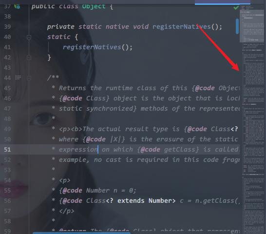

## setter生成器 GenerateAllSetter

推荐指数：★★★★★

遇到这种情况你会怎么办

```java
Person p = new Person();
//假设Person的属性很多...
```

小白一个一个敲，老白可能会用正则表达式批量生成setter，老司机一般都是安装GenerateAllSetter，然后在alt+enter直接调出来所有setter，还带有默认值，如下图所示

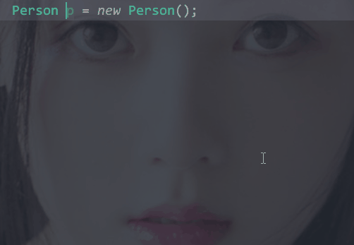


## 彩虹括号 Rainbow Brackets

推荐指数：★★★★

彩虹括号，一图胜千言，在层级很深的时候很管用


## Mybatis SQL查看 Mybatis-log-plugin

推荐指数：★★★★★

看名字就能猜个七七八八，它最核心的作用就是将下面这种

```
==>  Preparing: INSERT INTO user ( id, name, age, email, u_sex, createtime ) VALUES ( ?, ?, ?, ?, ?, ? ) 
==> Parameters: 0(Long), demoData(String), 0(Integer), demoData(String), demoData(String), 2020-12-22 20:34:26(String)
```

转换成下面这种

```sql
INSERT 
INTO
    user
    ( id, name, age, email, u_sex, createtime ) 
VALUES
    ( 0, 'demoData', 0, 'demoData', 'demoData', '2020-12-22 20:34:26' ) 
```

聪明人一眼就能看懂

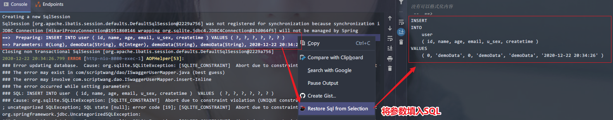

可惜IDEA2020需要收费了，但是有 [开心版](files/plugin.intellij.assistant.mybaitslog-1.0.9.jar)可用，在IDEA插件界面，右上角小齿轮，install from disk，懂我的意思吧

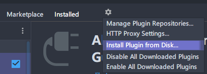


## 热部署 JRebel

推荐指数：★★★★★

这个插件的神奇之处在于不用重启项目就能热部署，虽然spring boot自带热部署插件，但是仍然需要重启项目，JRebel直接重新加载修改过的类，无论是你新增加了方法还是新增加了类。当然插件是收费的，下面来看一下如何使(po)用(jie)

1. 安装，到插件安装处搜索JRebel，全名为Jrebel And Xrebel for IntelliJ

2. 生成GUID https://www.guidgen.com/

3. 用https://jrebel.qekang.com/ 拼接上刚才生成的GUID，如 https://jrebel.qekang.com/5d01a8cc-9f04-497c-91de，如下图所示

   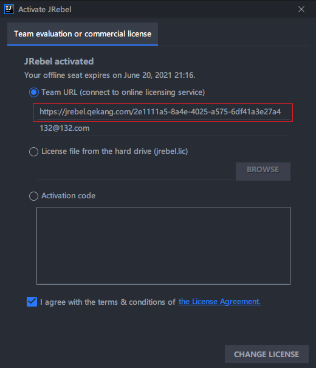

   

4. 安装完成后一定要点一下WORK OFFLINE

   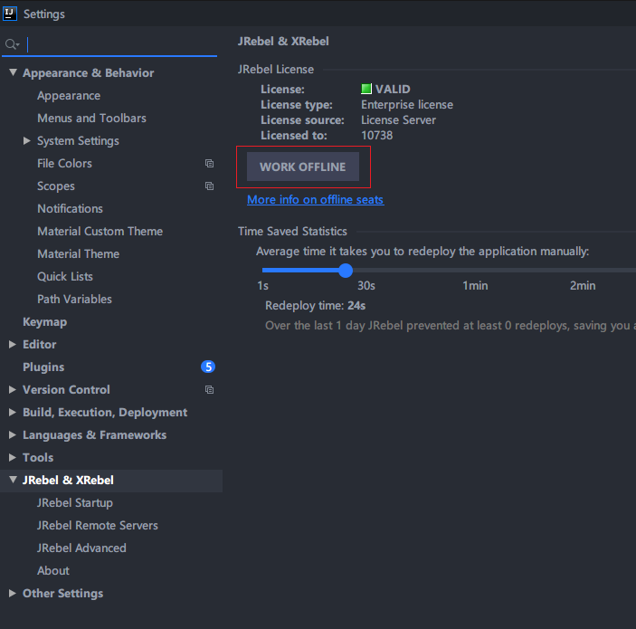

   

5. 使用的时候注意勾上下图中的两个框，然后点击上面的用Rebel启动项目

   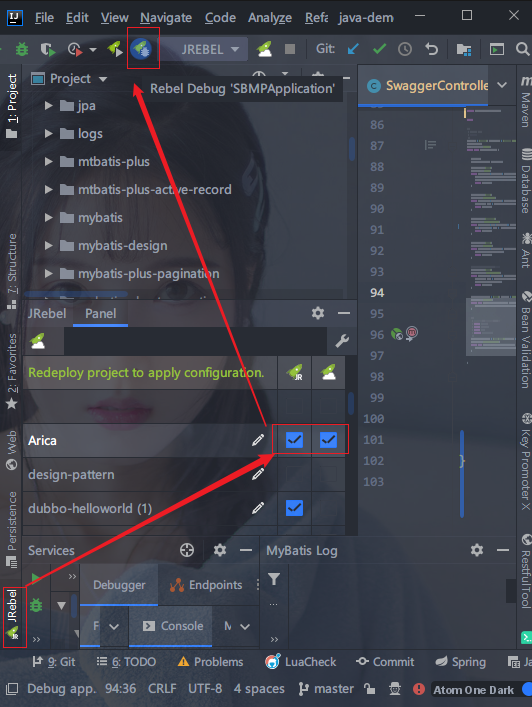

   

如果不想给钱又想用正版呢？送一个白嫖的方法，：Google一下myJrebel，按照流程走，申请一个Facebook account 然后关注他们，就会送你一个免费的社区license，亲测好用，前提是有梯子。

## 简单接口调用工具 RestfulTool

推荐指数：★★★★★

需要临时测试一下接口怎么办？用postman然后挨个复制请求参数？No，你可以有更简便的办法，RestfulTool会自动扫描项目中所有的接口，然后自动生成接口的请求参数，点击右边发送按钮即可测试接口

这个插件暂时不能保存参数，想要保存参数之类的建议用postman

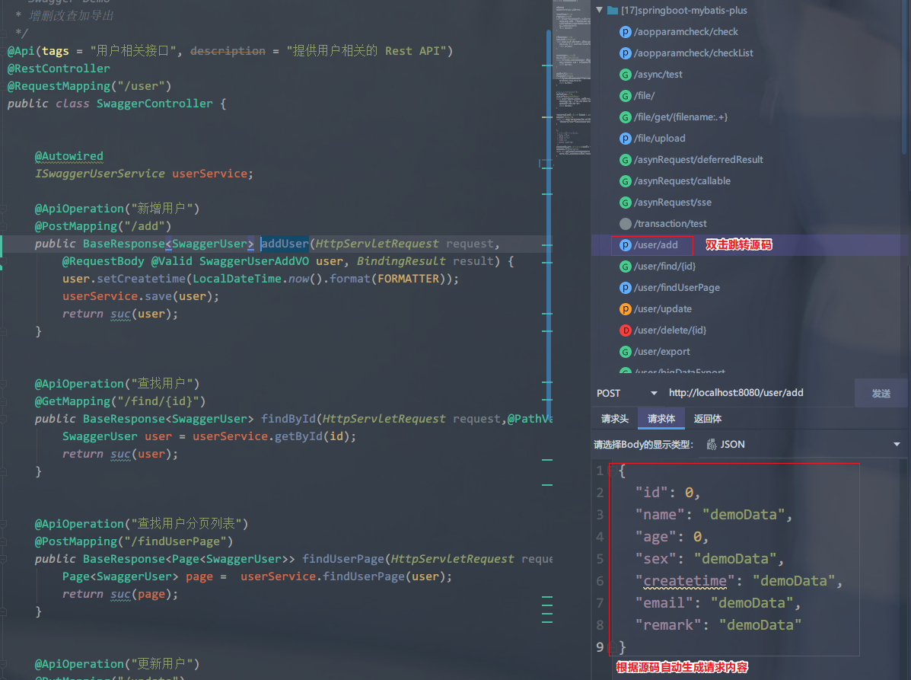

## 依赖分析 Maven Helper

推荐指数：★★★★★

Maven的依赖机制会导致Jar包的冲突。举个例子，现在你的项目中，使用了两个Jar包，分别是A和B。现在A需要依赖另一个Jar包C，B也需要依赖C。但是A依赖的C的版本是1.0，B依赖的C的版本是2.0。这时候，Maven会将这1.0的C和2.0的C都下载到你的项目中，这样你的项目中就存在了不同版本的C，这时Maven会依据依赖路径最短优先原则，来决定使用哪个版本的Jar包，而另一个无用的Jar包则未被使用，这就是所谓的依赖冲突。

幸运的是什么呢？

在大多数时候，依赖冲突可能并不会对系统造成什么异常，因为Maven始终选择了一个Jar包来使用。

但是不幸的却是，不排除在某些特定条件下，会出现类似找不到类的异常，所以，只要存在依赖冲突，在我看来，最好还是解决掉，不要给系统留下隐患。

而要介绍的这个Maven Helper 插件就可以解决这个问题。怎么用呢？

安装之后打开pom.xml文件，底部有个Dependency Analyzer选项，点击

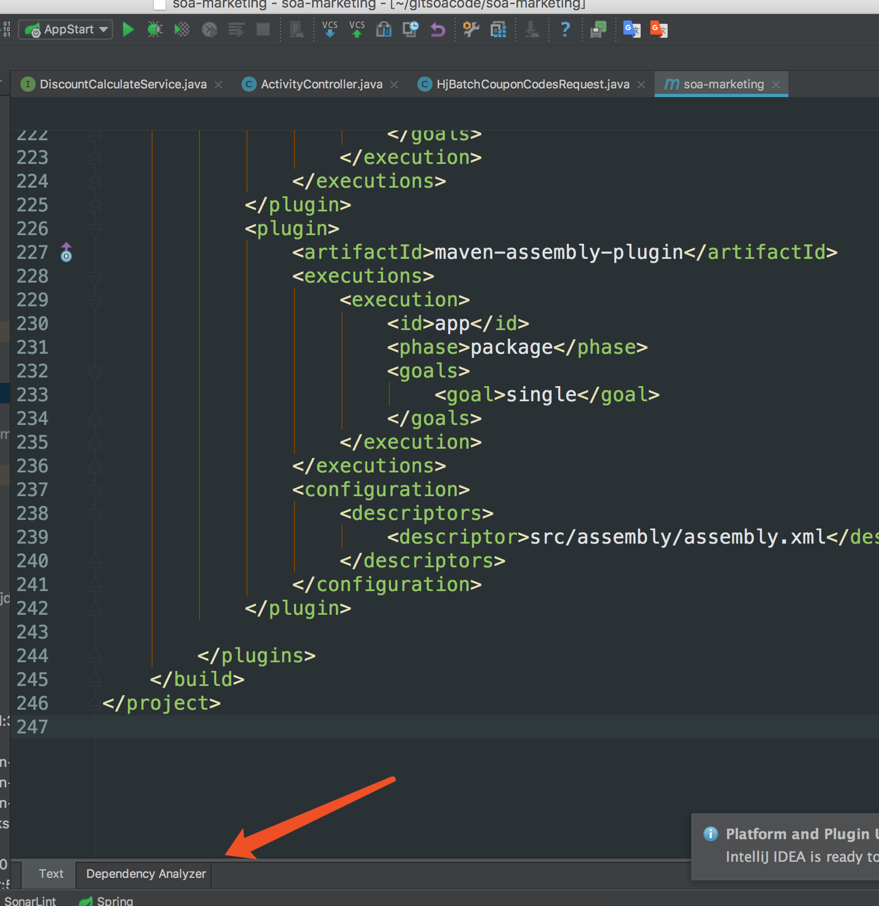


## 按键提示 Key Promoter X

推荐指数：★★★★

这是一个快捷键提示的插件，当你点击界面上任意图标时，就会在右下角提示你可用快捷键代替，如图

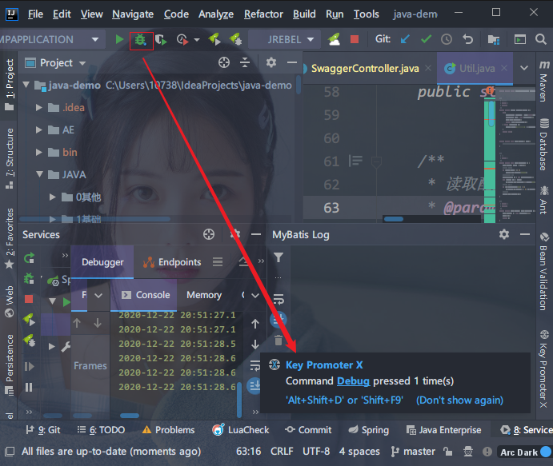

它有一个统计功能，可以清楚的知道你最常用的功能是啥

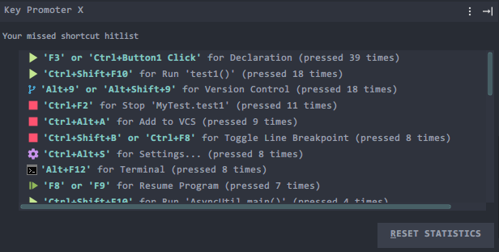

## JSON转换对象 GsonFormatPlus

推荐指数：★★★

个插件在IDEA2020上叫GsonFormatPlus，以前叫GsonFormat，顾名思义，将json字符串生成Java对象，这种需求其实有很多在线工具站也可以生成，看需求安装

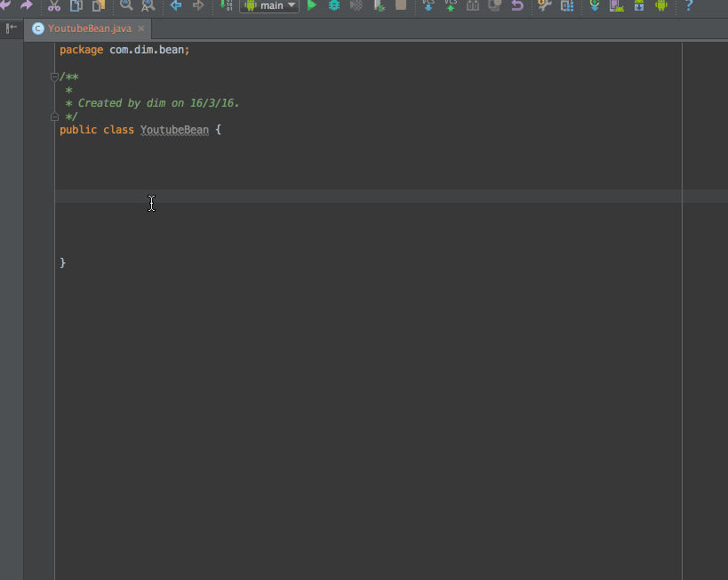

## Java字节码查看 jclasslib bytecode viewer

推荐指数：★★★★

当你学习到JVM的时候，可能需要用到字节码查看器，虽然java自带了字节码查看工具javap，但是总感觉不是很方便

- [github地址](https://github.com/ingokegel/jclasslib)
- 详细介绍：[IDEA字节码学习查看神器jclasslib bytecode viewer介绍](https://blog.csdn.net/w605283073/article/details/103209221)

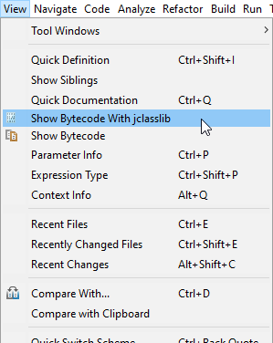

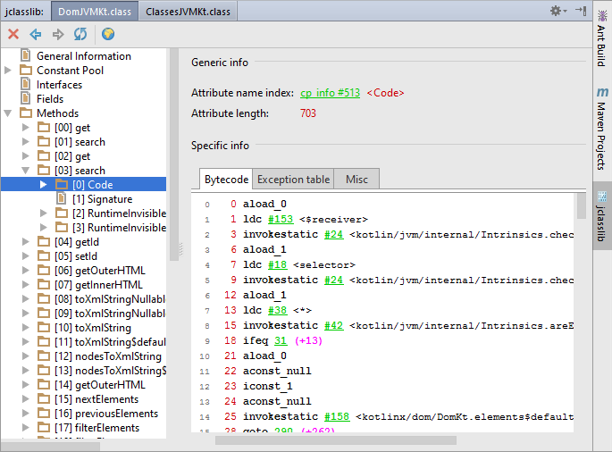

## 主题美化 Material Theme UI

推荐指数：★★★★

这是一个美化插件，大致效果如下，个人比较喜欢，按需安装吧

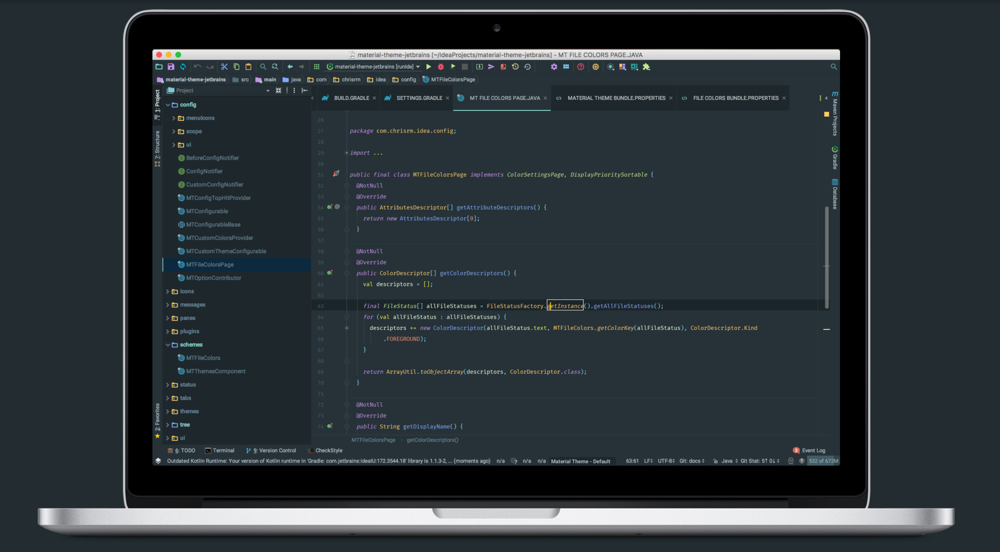

部分主题效果

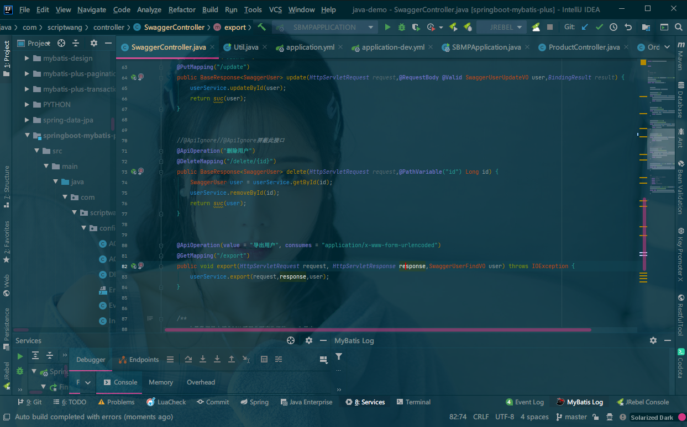

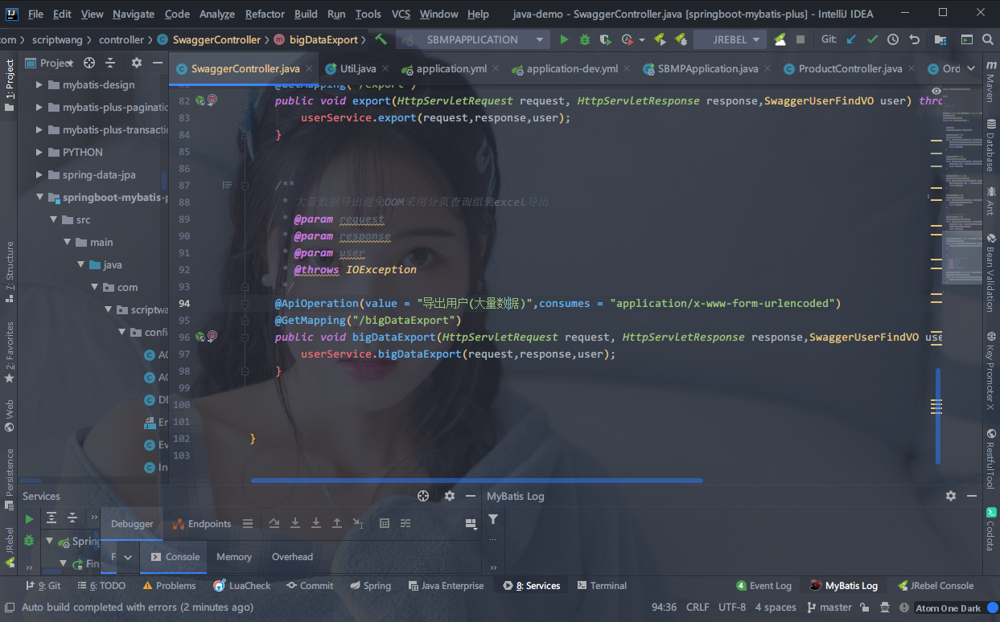

可选主题如下

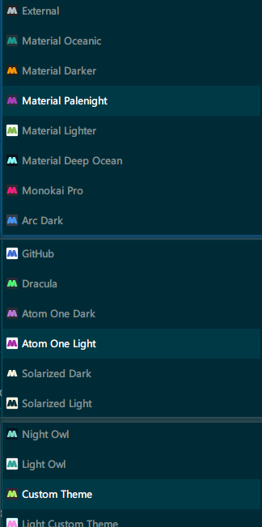

更多信息参考插件官网：https://plugins.jetbrains.com/plugin/8006-material-theme-ui

## 番外篇

IDEA 装好的常用设置，更符合自己的习惯，提高效率

### 键盘映射

我习惯用Eclipse的键盘映射，所以设置成Eclipse，FIle > Settings > Keymap选择Eclipse即可

DEBUG我习惯按键和Chrome控制台一致，F10是Step Over，F11是Step Into，如下图设置

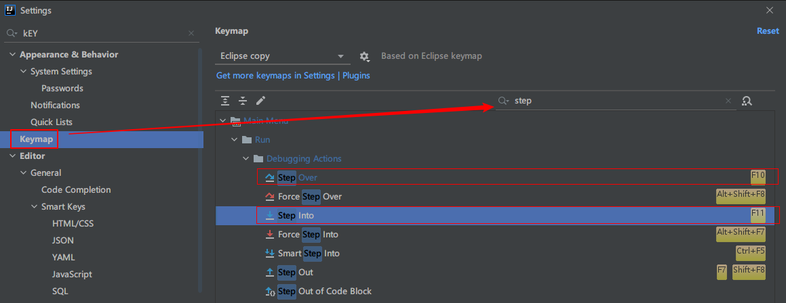

### 字体更改

我喜欢Consolas，FIle > Settings > Editor > Font，将字体选择为Consolas

### 开启滚轮缩放字体

FIle > Settings > Editor > General，勾选上**Change font size with Ctrl+Mouse Wheel**

### pojie

这里推荐一种pojie思路：[无限试用插件：IDE Eval Reset](https://gitee.com/pengzhile/ide-eval-resetter)，[避免失效地址](files/ide-eval-resetter-2.1.10.zip)

