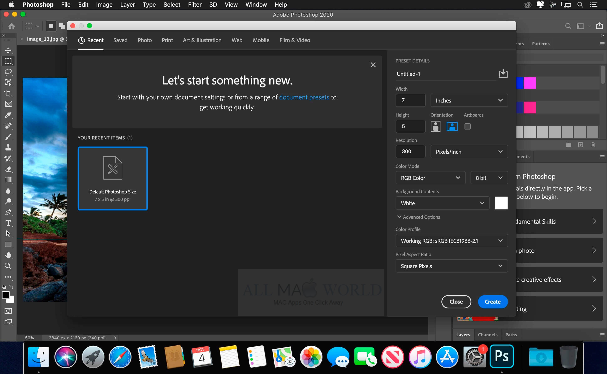

# 2021年Windows10装机必做的五件事

# 系统安装

1. 下载ISO光盘镜像

   - 官网下载，[下载 Windows 10 (microsoft.com)](https://www.microsoft.com/zh-cn/software-download/windows10)
   - [MSDN](https://msdn.itellyou.cn/)，有各种版本的操作系统
2. WIN PE下安装ISO，注意安装前先格式化目标盘，参考[进入PE怎么安装iso系统](https://jingyan.baidu.com/article/9158e000f3ff67a25512284c.html)
3. [数字权利激活](https://github.com/TGSAN/CMWTAT_Digital_Edition)

# 关闭自动更新
如果你不想某天打开电脑需要等待电脑更新完毕，请关闭它，它那些漏洞修复或许并不能对你的生产力有所提高，如果你觉得你的电脑不安全了或者想体验一些最新的特性，请直接重装个最新系统
1. Win+R，输入`gpedit.msc`，打开组策略窗口
2. 管理模板 > Windows组件 > Windows 更新
3. 在右侧点击**配置自动更新**，选择【已禁用】，确定！

# 关闭Windows Defender
windows defender很多你懂的软件会误报，隔离导致软件不能使用，一般我的做法是暴力关掉，良好的电脑使用习惯比这些安全软件管用。
1. Win+R，输入`gpedit.msc`，打开组策略窗口
2. 管理模板 > Windows组件 > Windows Defender 防病毒
3. 在右侧点击**关闭windows defender防病毒程序**，选择【已启用】，确定！

# 显示**我的电脑**图标

桌面右键 > 个性化 > 主题 > 桌面图标设置 > 左上角勾选**计算机**


# 干掉"仍要关闭"
工作完很累了关机，Win10还要问我仍要关机？多此一举？直接干掉懒得解释

1. Win+R，输入`gpedit.msc`，打开组策略窗口
2. 管理模板 > Windows组件 > 系统 > 关机选项
3. 在右侧点击**关闭会阻止或取消关机的应用程序的自动终止功能**，选择【已禁用】，确定！

# 软件推荐

下面是一些常用的软件工具，软件选择一定要注意下软件是否会收集用户信息，可参考回形针的这期视频：[Vol.118 你的 App 对你的隐私做了什么？](https://www.youtube.com/watch?v=Qyhww9IIJQU)

1. 尽量用开源替代闭源（开源大家都盯着，不太会干坏事，闭源就鬼知道了，现在的软件都爱**收集用户信息**）
2. 尽量用大公司闭源替代小公司或个人闭源（小公司闭源收集的用户信息或许转眼就被转手卖了，大公司即使收集了也不太敢卖，那么多人盯着呢）
3. 尽量用小而精替代大而臃肿（能解决用户痛点需求的软件才是好软件）

# 总览


# 国产软件

这些软件有些十分的流氓，比如QQ就一聊天工具还要安装驱动，权限之高任意乱来，比如最近（2021-01-19）爆出的QQ收集用户浏览器历史记录：[QQ 正在尝试读取你的浏览记录](https://www.v2ex.com/t/745030)，但是你还不得不用，这些软件两种处理办法，一种是找网上可信任的绿色版（不推荐），另外一种是隔离在虚拟机，相当于关进小黑屋里面，我的做法是关虚拟机里面，虚拟机只装这些软件，常见的虚拟机有：Win10的Hyper-V、Vmware Workstation、Virtual Box，如下图，是虚拟机的配置信息，不要太高，最好有SSD硬盘，系统最好选择LTSC，小巧精简，安装完成后不到10GB


安装的时候记得**不要勾选**开机启动(要用的时候才启动，一股脑开机启动干啥？)和加入用户体验计划(信息收集)

- [微信](https://pc.weixin.qq.com/)
- 微信多开：
1. 新建一个文件"微信多开.bat"
2. 输入内容，路径是微信安装的默认位置，自行更换，多开几个就输入几行
```bat
start "" "C:\Program Files (x86)\Tencent\WeChat\WeChat.exe"
start "" "C:\Program Files (x86)\Tencent\WeChat\WeChat.exe"
```
3. 保存双击


- 聊天专用QQ：[QQ](https://im.qq.com/pcqq/)
- 办公专用QQ：[TIM](https://tim.qq.com/)
- [网易云](https://music.163.com/#/download)
- [有道词典](http://cidian.youdao.com/)
- [WPS](https://pc.wps.cn/)，按需勾选**修改相关系统配置使WPS Office兼容第三方系统和软件...**
- [百度网盘](https://pan.baidu.com/download)
- 360唯一的一款良心软件：[360压缩](https://yasuo.360.cn/)
- [迅雷](https://www.xunlei.com/)
- [搜狗输入法纯净版](https://www.423down.com/587.html)


# 工具
## 空格预览Seer

文件空格预览：[Seer](http://1218.io/)，可以预览文本、图片、视频、pdf、excel、doc、obj等格式文件，类似于Mac系统上的空格预览，最新版开始收费了，不过有免费低版本


## 文件分布SpaceSniffer

小巧好用的文件大小分布查看器，用最简单的方式找磁盘里的大文件：[SpaceSniffer](http://www.uderzo.it/main_products/space_sniffer/)，实时刷新，比如用PS打开一个超大的文件你会看到你的C盘有一打开空间被PS产生的临时文件吞噬


## 任务栏流量查看TrafficMonitor

小巧好用的任务栏网速查看器/流量统计器，属于个人开发软件：[TrafficMonitor](https://github.com/zhongyang219/TrafficMonitor/releases/tag/V1.79.1)


## 多线程下载神器IDM

强大的多线程下载工具IDM，听说百度网盘的破解限速的原理之一就是用IDM的多线程，不过一些限制了IP的就不行，大多数下载是可以起到加速作用的，需pojie：[IDM](https://www.ypojie.com/1212.html)


## 拖机工具Aster

吐血推荐，Win10别无选择的拖机软件，所谓拖机就是一台主机，多套键鼠显示器能同时使用互不影响，来自毛子，需要注册码，刚需的淘宝看看吧：[ASTER](http://www.ibik.cn/)


## GIF录制ScreenToGif

小巧轻便的GIF录屏工具：[ScreenToGif](https://github.com/NickeManarin/ScreenToGif/releases)


## 截图+贴图Snipaste

强烈推荐，贴图工具，截图按F1，贴图再按F3：[Snipaste](https://zh.snipaste.com/)


## 滚动截图FSCapture

小巧的截图/录屏工具，最具特色的功能是滚动截图，需pojie，[FSCapture](https://www.weidown.com/tuxiangbuzhuo/4634.html)


## PDF阅读器Sumatra PDF

专一的PDF阅读器：[Sumatra PDF](https://www.sumatrapdfreader.org/free-pdf-reader.html)


## 远程工具向日葵

远程工具向日葵，唯一不好的地方是限速（免费）：[向日葵](https://sunlogin.oray.com/download/)


## 远程工具ToDesk

远程工具ToDesk，后起之秀，目前还不收费不限速：[ToDesk](https://www.todesk.com/)


## 搜索工具Everything

强大的搜索工具，比Windows自带的快很多：[Everything](https://www.voidtools.com/zh-cn/)


## 双击搜索Listary

强大的综合搜索增强工具（建议开机启动），双击Ctrl键输入任意关键词：[Listary](https://www.listary.com/)


## 剪贴板管理Ditto

强大的剪贴板管理工具：[Ditto](https://ditto-cp.sourceforge.io/)


## 小飞机

小飞机Shadow_socks，强大的代理工具，这里不多说了，懂得自然懂


## 字体美化MacType

字体美化，不要喷我高分屏下WIndows 10的字体已经很完美了，存在即合理，总有人需要，对我来说这是必装软件：[MacType](https://www.mactype.net/)


## 文本编辑器notepad++

强大的文本编辑器，作者是反华台湾人，选择性安装：[notepad++](https://notepad-plus-plus.org/downloads/)


## 文本编辑器Sublime Text

强大的文本编辑器：[Sublime Text](http://www.sublimetext.com/3)


## 谷歌浏览器Chrome

谷歌浏览器，最新版已经不能用MacType渲染了，字体太糟心：[Chrome](https://www.google.cn/chrome/)


常用的浏览器还有

- 火狐浏览器：[Firefox](https://www.mozilla.org/zh-CN/firefox/new/)
- 小众安全浏览器，启动快：[Vivaldi](https://vivaldi.com/zh-hans/download/)
- 主打安全的浏览器，反Cookies：[Brave](https://brave.com/zh/)

- 百分浏览器，主打浏览器，实际是Chrome套了一层壳，使用体验和Chrome无异，但是可以用Mactype渲染，所以选择了它：[CentBrowser](http://www.centbrowser.cn/)

1. 启动MacType渲染字体，第一步是在地址栏输入`chrome://flags`
2. 顶部输入`DirectWrite`进行搜索，关掉**DirectWrite**并重启浏览器即可使用MacType渲染

## 思维导图Xmind

思维导图：[Xmind](https://www.ghpym.com/xmindzen.html)


## 安全的聊天工具Telegram

安全的聊天工具：[Telegram](https://telegram.org/)


## 媒体转码MediaCoder

强大的视频音频编码解码格式转换工具：[MediaCoder](https://www.mediacoderhq.com/dlfull.htm)


## MarkDown文本编辑Typora

[Typora](https://typora.io/)：它的一大特点之一就是输入md标签回车之后会自动渲染效果，不像传统的md编辑器左边源码，右边渲染效果，此文就是在Typora下撰写的


# 媒体娱乐

## 图片查看Honeyview

强大的图像查看器，可以查看PSD：[Honeyview](https://www.bandisoft.com/honeyview/)


## 家庭影院Jellyfin

强大的家庭影院媒体服务器，参考教程[点播、直播一条龙，使用Jellyfin打造最强媒体中心](https://post.smzdm.com/p/adwlg0pz/)：[Jellyfin](https://jellyfin.org/)


## 本地视频播放器potplayer

最强大的本地播放器，小巧功能丰富多字幕多音轨全格式支持无广告快进快退缩放位移旋转你能想到的都有，自从有了电脑，一直没换过别的本地播放器：[potplayer](https://potplayer.daum.net/)


## 壁纸引擎Wallpaper Engine

Wallpaper Engine，这是Steam上的一个软件，售价19元，听名字就知道，壁纸引擎，可设置动态壁纸，NB的地方在于它的创意工坊，老司机懂的，唯一不多的花钱买的软件/斜眼笑


# 编程
## 路由追踪BestTrace

路由追踪，查看VPS线路必备：[BestTrace](https://www.ipip.net/download.html)


## Java开发工具包JDK


JDK，Oracle太麻烦，下载个JDK还让登录，这里推荐个镜像站，各种版本都有：[嗖嗖下载java jdk镜像](http://java.sousou88.com/spec/oraclejdk.html)
JDK装好后第一件事情是设置环境变量，环境变量的作用是让你在任何目录下都可以调用Java命令：[参考](https://jingyan.baidu.com/article/75ab0bcb91c6ead6874db279.html)

1. 打开环境变量设置窗口：右键此电脑 > 属性 > 高级系统设置 > 环境变量 > 关注点在于下面的**系统变量**
2. 新建JAVA_HOME：变量名为`JAVA_HOME`，变量值为你的JDK安装目录，类似于：`C:\Program Files\Java\jdk1.8.0_31`
3. 找到系统变量里面的Path，点击编辑，新增两条：`%JAVA_HOME%\bin`，`%JAVA_HOME%\jre\bin`
4. 新建CLASSPATH：变量名为`CLASSPATH`，变量值为：`.;%JAVA_HOME%\lib;%JAVA_HOME%\lib\tools.jar`，注意最前面的一个点表示当前目录，不要遗漏
5. 验证：WIN+R打开CMD窗口，输入`java`、`java -version`、`javac`均有回显说明环境变量设置成功！ 

## 综合SSH工具FinalShell

强大的SSH客户管综合工具：[FinalShell](http://www.hostbuf.com/)，可惜不开源


## 快捷键编程AutoHotKey

Windows下强大的快捷键编程工具：[AutoHotKey](https://www.autohotkey.com/)


## 全能数据库可视化工具dbeaver

基于JDBC的全能数据库管理工具：[dbeaver](https://dbeaver.io/download/)


##  全能IDE IntelliJ IDEA

强大的Java编程 IDE：[IntelliJ IDEA](https://www.jetbrains.com/idea/)，pojie思路，[无限重置试用](https://www.ferock.net/jetbrains%E5%85%A8%E5%AE%B6%E6%A1%B6%E6%9C%80%E6%96%B0%E7%89%88%E6%9C%AC%E6%97%A0%E9%99%90%E8%AF%95%E7%94%A8%E6%96%B9%E6%B3%95/)，[开源地址](https://gitee.com/pengzhile/ide-eval-resetter)，插件安装可以参考[工欲善其事必先利其器，IDEA必装插件！](2020-12-20_工欲善其事必先利其器，IDEA必装插件！.md)


## 虚拟机Vmware Workstatio

强大的虚拟机软件，需序列号：

[Vmware Workstation 15](https://www.cnblogs.com/mr-xiong/p/12468280.html)、[Vmware Workstation 16](https://www.weidown.com/yingyongqita/12160.html)

需要注意的是从VMware 15.5开始，可以和WIndows10的Hyper-V共存！


## 分布式版本控制系统Git 

世界上最流行的分布式源代码版本管理工具：[Git ](https://git-scm.com/)


## Java构建工具Maven

Java的包管理/构建工具，用xml编写项目配置文件：[Maven](https://maven.apache.org/download.cgi)


## Java构建工具Gradle

Java的包管理/构建工具，用groovy编写项目配置文件：[Gradle](https://gradle.org/)


## JSP容器Tomcat

Java Web容器，用来跑JSP：[Tomcat](http://tomcat.apache.org/)，写Java必备容器，开源免费


## 服务端的Javascript Node.js

服务端的Javascript：[Node.js](https://nodejs.org/zh-cn/)，如果你对Javascript最熟悉，那么这是你首选的后端语言


## 强大的脚本语言Python

强大的脚本语言：[Python](https://www.python.org/)，当你用shell脚本实现比较复杂功能的时候可以试试用Python，说不定简单一些


## 全文检索引擎Elasticsearch

分布式全文检索引擎：[Elasticsearch](https://www.elastic.co/cn/elasticsearch/)，可以做为搜索引擎也可以作为日志存储检索引擎(ELK技术栈)


## 接口调试工具PostMan

接口调试工具：[PostMan](https://www.postman.com/)，有点是功能全面，要啥有啥，可以同步数据，缺点是要梯，略臃肿，所以有了`PostWoman`，感兴趣的自己谷歌下


## 大日志查看LogViewer

大日志文件查看器：[LogViewer](http://www.uvviewsoft.com/logviewer/)，当你有一个`5GB`的日志文件，`notepad++`直接给你说不支持打开，`Sublime Text`可以打开，但是这货把所有内容全加载到内存，你电脑就已经卡爆了，所以你需要`LogViewer`，原理也很简单，看哪加载哪，不至于打不开也不至于卡爆内存。


# 设计
设计一般是Adobe系软件

## Adobe PhotoShop

强大的图片编辑软件Adobe PhotoShop，注意不是PS(笑)，需pojie：[PhotoShop](https://www.weidown.com/xiazai/6658.html)，如果失效了，直接谷歌搜索[PS 2020 绿色版下载](https://www.google.com/search?q=PS+2020+%E7%BB%BF%E8%89%B2%E7%89%88%E4%B8%8B%E8%BD%BD&ei=tRrnX_6yGbKTr7wPnYu1-A0&start=10&sa=N&ved=2ahUKEwi-4ar6wevtAhWyyYsBHZ1FDd8Q8NMDegQIBxBN&biw=2560&bih=1339)



类似的还是矢量图设计工具

- 矢量图设计工具：[Adobe Illustrator](https://www.weidown.com/tuxiangchuli/12690.html)

## Adobe After Effects

强大的后期特效软件Adobe After Effects，需pojie：[After Effects](https://www.weidown.com/shipinchuli/5605.html)


## Adobe Premiere

非线性视频剪辑软件：[Adobe Premiere](https://www.weidown.com/shipinchuli/5608.html)


## Adobe Character Animator

角色制作工具，可以根据摄像头捕捉运动轨迹，比如唇形：[Adobe Character Animator](https://www.weidown.com/donghuazhizuo/5603.html)


## Adobe Media Encoder

编码解码：[Adobe Media Encoder](https://www.weidown.com/shipinchuli/5604.html)，用于配合其他Adobe工具使用


# 开机启动

### 关闭不必要的开机启

1. WIN+R输入`msconfig`回车
2. 点击顶部**服务**tab页，勾选下面隐藏所有 Microsoft 服务
3. 此时你会看到一些比如浏览器更新服务之类的你不需要的勾选掉即可，注意安装了QQ不要勾选掉`QPCore Service`，否则启动不了QQ，俺就是这么流氓，不让我开机启动俺就不让你用！
4. 点击确认，重启

任务管理器也可以管理开启启动项，在任务栏右键，点击任务管理器，点击左侧详细信息，选择顶部的**启动**tab页，在启动项上右键即可启用或者禁用

### 开启必要的开机启动

1. 一些软件自带了开机启动选项，那么你勾上就可以了，下面是我开机启动的软件清单

   - Snipaste
   - Ditto
   - Listary
   - Everything
   - 小飞机Shadow_socks
   - TrafficMonitor
   - Seer

2. 一些小工具没有开机启动项的，可以将软件快捷方式放入目录`%USERPROFILE%\AppData\Roaming\Microsoft\Windows\Start Menu\Programs\Startup `（在资源管理器路径除输入）即可添加开机启动项，添加的启动项可以在任务管理器**启动**tab页看到

   - 一般我将[AutoHotKey](https://www.autohotkey.com/)脚本放到这里，下面的[AutoHotKey](https://www.autohotkey.com/)脚本提供的一些快捷输入方式，比如输入`td`显示今天的日期，输入`tdn`显示日期时间，大小写转换等，可参考

     ```
     
     ;------------------------------时间和日期------------------------------
     :*:]d::  ; 此热字串通过后面的命令把 "]d" 替换成当前日期和时间.
         FormatTime, CurrentDateTime,, yyyy-MM-dd HH:mm:ss
         SendInput %CurrentDateTime%
     return
     
     ;当前日期 td = today   tdn = todayNow
     ::td::
     	SendInput %A_YYYY%-%A_MM%-%A_DD%
     return
     ::tdn:: 
     	SendInput %A_YYYY%-%A_MM%-%A_DD% %A_Hour%:%A_Min%:%A_Sec%
     return
     
     ;------------------------------大小写转换------------------------------
     ^+L::SwitchSelCase("L") ; 选中文字切换为小写 CTRL + SHIFT + L
     ^+U::SwitchSelCase("U") ; 选中文字切换为大写 CTRL + SHIFT + U
     ;^+T::SwitchSelCase("T") ; 选中文字切换为首字母大写
     ```
     就像下面这样的效果，当然还可以控住鼠标之类的功能，具体看AHK的[API文档](https://www.autohotkey.com/docs/AutoHotkey.htm)
     

# 快速启动

快速启动的意义在于当你全屏幕工作需要另外软件配合的时候你并不想显示桌面图标，然后再去点击想要打开的软件，最后再切换回当前的工作窗口，这是一件很麻烦的事情，有几个小技巧可以解决它

1. 将需要协作的多个软件固定到任务栏，需要的时候点击任务栏即可，不需要显示桌面图标，但是需要动鼠标
2. 利用Listary的快捷功能，双击Ctrl键，输入软件名字比如QQ回车即可打开，当你懒得动鼠标的时候可以用
3. 在`C:\Windows`下创建一个文件夹，里面放软件的快捷方式，命名尽量短小精悍比如`qq`，然后将这个文件夹的全路径加入Windows环境变量，（右键我的电脑>属性>高级设置>环境变量>找到Path>新建），然后，你只需要WIN+R键入`qq`即可打开QQ

# 最后一件事，备份！

备份的重要性我就不提了，辛辛苦苦搞了半天结果一不小心装个流氓软件驱动搞坏了启动不了，那得多郁闷...

思路：所有软件安装在C盘，用SSD整个分区做系统盘，不要怕系统盘不够，随便找个Ghost备份软件或者直接在PE里面的Ghost备份软件里面备份，将整个C盘备份成GHO文件，恢复时逆向操作即可，实测120G左右的分区可以压缩成48G左右的gho文件（快速压缩，若选择高压缩或者极限压缩，理论上会更小，但是打开或恢复镜像时也会更慢）

可以用到的工具：
- [一键工作室WIN PE](http://www.upanok.com/knowledge/427.html)
- 不需要PE的备份还原：[映像总裁](https://www.sysceo.com/forum/forum-108-1.html)
- GHO文件浏览器，当你需要拷贝备份系统里面的文件时可以使用它：[GhostExp64](https://api.256file.com/ghostexp64.exe/m-download-559602.html)


