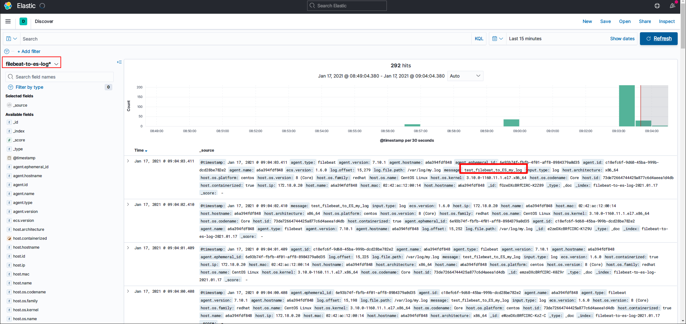

# 背景

试想这么一种场景：Nginx负载了2个Tomcat，那么日志查看就很麻烦了，每次查看日志都要登录2台服务器，挨个搜索，2台还好，如果5台呢？10台呢？那查看日志就可费劲了，所以需要一款日志收集系统，集中管理日志，一个完整的集中式日志系统，是离不开以下几个主要特点的。

- 收集－能够采集多种来源的日志数据
- 传输－能够稳定的把日志数据传输到中央系统
- 存储－如何存储日志数据
- 分析－可以支持 UI 分析
- 警告－能够提供错误报告，监控机制

最好还是免费开源的，所以ELK技术栈登场了，ELK 不是一款软件，而是 Elasticsearch、Logstash 和 Kibana 三种软件产品的首字母缩写。这三者都是开源软件，通常配合使用，而且又先后归于 Elastic.co 公司名下，所以被简称为 ELK

- Elasticsearch：分布式搜索和分析引擎，具有高可伸缩、高可靠和易管理等特点。基于 Apache Lucene 构建，能对大容量的数据进行接近实时的存储、搜索和分析操作。通常被用作某些应用的基础搜索引擎，使其具有复杂的搜索功能；
- Logstash：数据收集引擎。它支持动态的从各种数据源搜集数据，并对数据进行过滤、分析、丰富、统一格式等操作，然后存储到用户指定的位置；
- Kibana：数据分析和可视化平台。通常与 Elasticsearch 配合使用，对其中数据进行搜索、分析和以统计图表的方式展示；
- Filebeat：ELK 协议栈的新成员，一个轻量级开源日志文件数据搜集器，基于 Logstash-Forwarder 源代码开发，是对它的替代。在需要采集日志数据的 server 上安装 Filebeat，并指定日志目录或日志文件后，Filebeat 就能读取数据，迅速发送到 Logstash 进行解析，亦或直接发送到 Elasticsearch 进行集中式存储和分析。


本教程说明了下面三种架构的实战操作以及选择此种架构的原因，由简单到复杂，组件由少到多，由浅入深，建议先看简单的架构，在简单架构的基础之上逐步深入

- **最简单架构搭建(Logstash作为日志收集器)**
- **轻量级日志收集架构搭建(Beats作为日志收集器)**
- **在Beat的基础上引入消息队列机制的架构** 


本教程的搭建基于docker，在docker中运行CentOS容器进行搭建，目的是演示搭建过程，如果不熟悉docker你可以简单理解为下面这条命令创建了一个独立的系统用于专门安装ElasticSearch：

```bash
docker run -dit --name es --privileged centos /usr/sbin/init
```

选择docker的原因：

- 不用创建很多虚拟机，只用一个docker容器就可以模拟一个独立完整的系统环境，方便快捷
- 模拟出来的系统环境都是最干净的，干净的系统安装软件可以更清楚的梳理依赖关系

# 版本对照关系表

参考：https://www.elastic.co/cn/support/matrix#matrix_compatibility

| Elasticsearch | Kibana |   Beats^*    |  Logstash^*  |
| :-----------: | :----: | :----------: | :----------: |
|     5.0.x     | 5.0.x  | 1.3.x-5.6.x  | 2.4.x-5.6.x  |
|     5.1.x     | 5.1.x  | 1.3.x-5.6.x  | 2.4.x-5.6.x  |
|     5.2.x     | 5.2.x  | 1.3.x-5.6.x  | 2.4.x-5.6.x  |
|     5.3.x     | 5.3.x  | 1.3.x-5.6.x  | 2.4.x-5.6.x  |
|     5.4.x     | 5.4.x  | 1.3.x-5.6.x  | 2.4.x-5.6.x  |
|     5.5.x     | 5.5.x  | 1.3.x-5.6.x  | 2.4.x-5.6.x  |
|     5.6.x     | 5.6.x  | 1.3.x-6.0.x  | 2.4.x-6.0.x  |
|     6.0.x     | 6.0.x  | 5.6.x-6.8.x  | 5.6.x-6.8.x  |
|     6.1.x     | 6.1.x  | 5.6.x-6.8.x  | 5.6.x-6.8.x  |
|     6.2.x     | 6.2.x  | 5.6.x-6.8.x  | 5.6.x-6.8.x  |
|     6.3.x     | 6.3.x  | 5.6.x-6.8.x  | 5.6.x-6.8.x  |
|     6.4.x     | 6.4.x  | 5.6.x-6.8.x  | 5.6.x-6.8.x  |
|     6.5.x     | 6.5.x  | 5.6.x-6.8.x  | 5.6.x-6.8.x  |
|     6.6.x     | 6.6.x  | 5.6.x-6.8.x  | 5.6.x-6.8.x  |
|     6.7.x     | 6.7.x  | 5.6.x-6.8.x  | 5.6.x-6.8.x  |
|     6.8.x     | 6.8.x  | 5.6.x-6.8.x  | 5.6.x-6.8.x  |
|     7.0.x     | 7.0.x  | 6.8.x-7.10.x | 6.8.x-7.10.x |
|     7.1.x     | 7.1.x  | 6.8.x-7.10.x | 6.8.x-7.10.x |
|     7.2.x     | 7.2.x  | 6.8.x-7.10.x | 6.8.x-7.10.x |
|     7.3.x     | 7.3.x  | 6.8.x-7.10.x | 6.8.x-7.10.x |
|     7.4.x     | 7.4.x  | 6.8.x-7.10.x | 6.8.x-7.10.x |
|     7.5.x     | 7.5.x  | 6.8.x-7.10.x | 6.8.x-7.10.x |
|     7.6.x     | 7.6.x  | 6.8.x-7.10.x | 6.8.x-7.10.x |
|     7.7.x     | 7.7.x  | 6.8.x-7.10.x | 6.8.x-7.10.x |
|     7.8.x     | 7.8.x  | 6.8.x-7.10.x | 6.8.x-7.10.x |
|     7.9.x     | 7.9.x  | 6.8.x-7.10.x | 6.8.x-7.10.x |
|    7.10.x     | 7.10.x | 6.8.x-7.10.x | 6.8.x-7.10.x |

在此(2021-01-14)我们都用最新版的ELK，即ELK的版本都为7.10.1

# 最简单架构搭建(Logstash作为日志收集器)


首先创建网络，如果已经创建了则不管，注意docker不允许默认网络指定ip，所以要手动创建网络

```bash
docker network create --subnet=172.18.0.0/16 mynet
```

然后准备四个容器，两个专门安装Logstash，一个安装ES，另外一个安装Kibana

```bash
# Logstash容器
docker run -dit --net mynet --ip 172.18.0.10 --name log1 --privileged centos /usr/sbin/init
docker run -dit --net mynet --ip 172.18.0.11 --name log2 --privileged centos /usr/sbin/init

# elasticsearch容器
docker run -dit --net mynet --ip 172.18.0.12 --name es --privileged centos /usr/sbin/init

# kibana容器，映射一个外网端口用于宿主机访问
docker run -dit --net mynet --ip 172.18.0.13 -p 5601:5601 --name kb --privileged centos /usr/sbin/init
```

各个组件IP如下

172.18.0.10 > Logstash 
172.18.0.12 > ElasticSearch
172.18.0.13 > Kibana

## 安装Java环境

因为Logstash和ElasticSearch都是基于Java平台的，所以先安装Java环境，进入容器安装，进入容器命令`docker exec -it log1 bash `，其他容器同理

```bash
# 安装java
yum -y install java-1.8.0-openjdk java-1.8.0-openjdk-devel which

# 环境变量设置
cat > /etc/profile.d/java8.sh <<EOF
export JAVA_HOME=$(dirname $(dirname $(readlink $(readlink $(which javac)))))
export PATH=\$PATH:\$JAVA_HOME/bin
export CLASSPATH=.:\$JAVA_HOME/jre/lib:\$JAVA_HOME/lib:\$JAVA_HOME/lib/tools.jar
EOF
source /etc/profile.d/java8.sh

```

## 安装ElasticSearch

参考： [安装并运行 Elasticsearch](https://www.elastic.co/guide/cn/elasticsearch/guide/current/running-elasticsearch.html)

首先进入容器

```bash
docker exec -it es bash
```

常用工具安装

```
yum install -y wget
```

在[Download Elasticsearch](https://www.elastic.co/cn/downloads/elasticsearch)选择合适的平台下载好包，我下载的是`elasticsearch-7.10.1-linux-x86_64.tar.gz`

```bash
# 下载
cd ~ && wget https://artifacts.elastic.co/downloads/elasticsearch/elasticsearch-7.10.1-linux-x86_64.tar.gz

# 解压
tar -zxvf elasticsearch-7.10.1-linux-x86_64.tar.gz

# 拷贝
cp -r elasticsearch-7.10.1 /usr/local/

# 运行
/usr/local/elasticsearch-7.10.1/bin/elasticsearch
```

运行后此时你会得到一个报错：`java.lang.RuntimeException: can not run elasticsearch as root`

原因很明显，不能用root运行，那么新建用户再运行

```bash
# 新建用户
adduser elasticsearch

# 赋权
chown -R elasticsearch /usr/local/elasticsearch-7.10.1

# 切换用户再执行
su elasticsearch
/usr/local/elasticsearch-7.10.1/bin/elasticsearch

# 后台执行
/usr/local/elasticsearch-7.10.1/bin/elasticsearch -d
```

测试，如果`curl 127.0.0.1:9200`有类似以下回显说明成功

```json
{
  "name" : "74e37036a2ee",
  "cluster_name" : "elasticsearch",
  "cluster_uuid" : "L8xK0ZqZSUKn3dZ05NJfcg",
  "version" : {
    "number" : "7.10.1",
    "build_flavor" : "default",
    "build_type" : "tar",
    "build_hash" : "1c34507e66d7db1211f66f3513706fdf548736aa",
    "build_date" : "2020-12-05T01:00:33.671820Z",
    "build_snapshot" : false,
    "lucene_version" : "8.7.0",
    "minimum_wire_compatibility_version" : "6.8.0",
    "minimum_index_compatibility_version" : "6.0.0-beta1"
  },
  "tagline" : "You Know, for Search"
}
```

### 修改配置文件及问题排查

此时发现只能用127.0.0.1访问，不能用 `curl 172.18.0.12:9200`访问，因为没设置`network.host`，下面设置一下，顺便加上允许跨域的设置`http.cors.enabled`、`http.cors.allow-origin`，`sed -i '$a内容' file` 是在文件末尾追加

```bash
sed -i '$ahttp.cors.enabled: true' /usr/local/elasticsearch-7.10.1/config/elasticsearch.yml
sed -i '$ahttp.cors.allow-origin: "*"' /usr/local/elasticsearch-7.10.1/config/elasticsearch.yml
sed -i '$anetwork.host: 172.18.0.12' /usr/local/elasticsearch-7.10.1/config/elasticsearch.yml
```

此时启动es，发现启动失败，报错如下：

```
[2021-01-13T13:46:30,780][INFO ][o.e.t.TransportService   ] [a622d8352de5] publish_address {172.18.0.12:9300}, bound_addresses {172.18.0.12:9300}
[2021-01-13T13:46:31,039][INFO ][o.e.b.BootstrapChecks    ] [a622d8352de5] bound or publishing to a non-loopback address, enforcing bootstrap checks
[2021-01-13T13:46:31,066][ERROR][o.e.b.Bootstrap          ] [a622d8352de5] node validation exception
[2] bootstrap checks failed
[1]: max virtual memory areas vm.max_map_count [65530] is too low, increase to at least [262144]
[2]: the default discovery settings are unsuitable for production use; at least one of [discovery.seed_hosts, discovery.seed_providers, cluster.initial_master_nodes] must be configured
[2021-01-13T13:46:31,069][INFO ][o.e.n.Node               ] [a622d8352de5] stopping ...
[2021-01-13T13:46:31,094][INFO ][o.e.n.Node               ] [a622d8352de5] stopped
[2021-01-13T13:46:31,095][INFO ][o.e.n.Node               ] [a622d8352de5] closing ...
[2021-01-13T13:46:31,116][INFO ][o.e.n.Node               ] [a622d8352de5] closed
[2021-01-13T13:46:31,119][INFO ][o.e.x.m.p.NativeController] [a622d8352de5] Native controller process has stopped - no new native processes can be started

```

注意看这句话：bound or publishing to a non-loopback address, enforcing bootstrap checks，绑定的不是本地回环接口，强制进行启动检查，es认为绑定的不是127.0.0.1就是要用于生产环境，所以要启动一下适用于生产环境的强制性检查，检查出不适合的条件就不让启动！所需需要修改如下错误：

```
[1]: max virtual memory areas vm.max_map_count [65530] is too low, increase to at least [262144]
[2]: the default discovery settings are unsuitable for production use; at least one of [discovery.seed_hosts, discovery.seed_providers, cluster.initial_master_nodes] must be configured
```

- [1]

```bash
# 切换到root用户执行
sed -i '$avm.max_map_count=262144' /etc/sysctl.conf
sysctl -p
```

- [2]

```bash
# 追加这句配置
sed -i '$adiscovery.seed_hosts: ["172.18.0.12"]' /usr/local/elasticsearch-7.10.1/config/elasticsearch.yml
```

此时再次启动就不会报错了，如果还是报错，请根据es的报错提示进行更改

试一下用本机IP能访问不：`curl 172.18.0.12:9200`

## 安装Logstash

先安装好Java环境，然后下载源码安装，本例用的是7.10.1，其他版本参考：https://www.elastic.co/cn/downloads/logstash

```bash
cd ~
wget https://artifacts.elastic.co/downloads/logstash/logstash-7.10.1-linux-x86_64.tar.gz
tar xf logstash-7.10.1-linux-x86_64.tar.gz -C /usr/local
mv /usr/local/logstash-7.10.1 /usr/local/logstash

# 看一下版本
/usr/local/logstash/bin/logstash -V
```

测试一下

```bash
/usr/local/logstash/bin/logstash -e 'input{stdin{}}output{stdout{codec=>rubydebug}}'
```

稍等几秒钟，因为JVM启动有延迟，然后随便输入东西，然后有类似于如下输出说明成功运行，如果不知道Logstash安装在哪里，可以全局搜索一下`find  / -name logstash`

```bash
{
       "message" => "Hello world",
      "@version" => "1",
          "host" => "1964ebd516a7",
    "@timestamp" => 2021-01-14T04:42:35.054Z
}

```

Logstash原理为：input > filter > putput，日志输入，过滤，然后再输出，此处我们的目的是为了保存到es，方便起见，input为从网络输入（当然也可以设置为从文件输入，参考：[读取文件](http://doc.yonyoucloud.com/doc/logstash-best-practice-cn/input/file.html)），output设置为ES，暂时不设置过滤器

```bash
# 生成配置文件，注意es的ip要设置成上面配置的ip
cat > ~/log.conf <<EOF
input {
    tcp {
        port => 8888
        mode => "server"
        ssl_enable => false
    }
}
filter {

}
output {
    elasticsearch {
       hosts => ["172.18.0.12:9200"]
       index => "log1_log"
    }
	stdout {codec => rubydebug}
}
EOF
# 启动
/usr/local/logstash/bin/logstash -f ~/log.conf
```

测试，新开一个终端，键入如下命令

```bash
# 用nc命令连接到Logstash的input上并输入test
echo 'test' | nc 127.0.0.1 8888 

# 后面测试的时候，可以多生成测试数据，便于观察
while true;do echo 'test' | nc 127.0.0.1 8888; sleep 1;done
```

如果发现es控制台有如下输出，说明保存es成功

```
[2021-01-14T12:58:23,336][INFO ][o.e.c.m.MetadataCreateIndexService] [a622d8352de5] [log1_log] creating index, cause [auto(bulk api)], templates [], shards [1]/[1]
[2021-01-14T12:58:23,751][INFO ][o.e.c.m.MetadataMappingService] [a622d8352de5] [log1_log/eAhjtb_sQGONcTPdOv__oQ] create_mapping [_doc]
```

## 安装Kibana

下载安装，如果需要其他版本请参考https://www.elastic.co/cn/downloads/kibana

```bash
cd ~
wget https://artifacts.elastic.co/downloads/kibana/kibana-7.10.1-linux-x86_64.tar.gz
tar xf kibana-7.10.1-linux-x86_64.tar.gz -C /usr/local
mv /usr/local/kibana-7.10.1-linux-x86_64 /usr/local/kibana
```

执行

```bash
/usr/local/kibana/bin/kibana

# 发现报错 
# Kibana should not be run as root.  Use --allow-root to continue.
```

新建用户并执行

```bash
# 新建用户
adduser kibana

# 赋权
chown -R kibana /usr/local/kibana 

# 切换用户再执行
su kibana
/usr/local/kibana/bin/kibana

# 发现报错，连不上es，因为默认连的是本地的es
# log   [13:18:02.226] [error][data][elasticsearch] [ConnectionError]: connect ECONNREFUSED 127.0.0.1:9200

```

配置kibana

```bash
# 配置es
sed -i '$aelasticsearch.hosts: ["http://172.18.0.12:9200"]' /usr/local/kibana/config/kibana.yml

# 允许所有访问
sed -i '$aserver.host: "0.0.0.0"' /usr/local/kibana/config/kibana.yml

# 端口server.port 默认是5601，不用管
# elasticsearch.username 和 elasticsearch.password是es的用户名和密码，没有就不用配置
```

重新启动，发现报错

```
FATAL  Error: EACCES: permission denied, stat '*/.i18nrc.json'
```

赋权一下，再启动

```bash
chmod 755 /usr/local/kibana/.i18nrc.json
```

在宿主机访问http://192.168.108.100:5601，之前我们映射过端口5601到宿主机，192.168.108.100换成你自己的ip，如下为访问成功的页面


### Kibana操作

发现最新版的Kibana有变化了，首先它要求我们根据已有的所有来创建一个视图，如下图所示


然后点击Discover就会发现有日志数据了


# 轻量级日志收集架构搭建(Beats作为日志收集器)

## 为什么使用 Filebeat

Logstash 是一个 Java 程序，当作为收集日志的 Agent 时，显得太臃肿了。启动的时候都要等几秒才能看到输出，之前听过一个公司(斗鱼)使用 Logstash 作为日志收集 Agent 时，资源占用好像比业务进程占用还多！这已经本末倒置了！

其实有这么一个工具：Filebeat，官方给 Filebeat 的定义就是轻量级的日志收集工具。

> Filebeat 是基于原先 logstash-forwarder 的源码改造出来的。换句话说：Filebeat 就是新版的 logstash-forwarder，也会是 ELK Stack 在 shipper 端的第一选择。

这种架构引入 [Beats](https://github.com/elastic/beats) 作为日志搜集器。目前 (2021-01-15)Beats 包括：

| Beat                                                         | Description                                                  |
| ------------------------------------------------------------ | ------------------------------------------------------------ |
| [Auditbeat](https://github.com/elastic/beats/tree/master/auditbeat) | Collect your Linux audit framework data and monitor the integrity of your files：Linux审计日志收集 |
| [Filebeat](https://github.com/elastic/beats/tree/master/filebeat) | Tails and ships log files：搜集文件数据                      |
| [Functionbeat](https://github.com/elastic/beats/tree/master/x-pack/functionbeat) | Read and ships events from serverless infrastructure：面向云端数据的收集 |
| [Heartbeat](https://github.com/elastic/beats/tree/master/heartbeat) | Ping remote services for availability：远程服务是否可用，心跳检测 |
| [Journalbeat](https://github.com/elastic/beats/tree/master/journalbeat) | Read and ships event from Journald：收集Linux中journald的日志 |
| [Metricbeat](https://github.com/elastic/beats/tree/master/metricbeat) | Fetches sets of metrics from the operating system and services：进行指标采集，监控性能 |
| [Packetbeat](https://github.com/elastic/beats/tree/master/packetbeat) | Monitors the network and applications by sniffing packets：搜集网络流量数据 |
| [Winlogbeat](https://github.com/elastic/beats/tree/master/winlogbeat) | Fetches and ships Windows Event logs：收集WIndows事件日志数据 |

Beats 将搜集到的数据发送到 Logstash，经 Logstash 解析、过滤后，将其发送到 Elasticsearch 存储，并由 Kibana 呈现给用户。

这种架构解决了 Logstash 在各服务器节点上占用系统资源高的问题。相比 Logstash，Beats 所占系统的 CPU 和内存几乎可以忽略不计。另外，Beats 和 Logstash 之间支持 SSL/TLS 加密传输，客户端和服务器双向认证，保证了通信安全。如下图所示


## 搭建

搭建之前需要先熟悉**最简单架构搭建(Logstash作为日志收集器)**，也是在其基础之上进行搭建的，各个组件IP如下

172.18.0.10 > Logstash 
172.18.0.12 > ElasticSearch
172.18.0.13 > Kibana
172.18.0.20 > Filebeat

## 安装Filebeat

我们就以最常见的文件日志收集为例，首先创建一个容器

```bash
docker run -dit --net mynet --ip 172.18.0.20 --name fb --privileged centos /usr/sbin/init
```

下载filebeat，此处使用的版本是7.10.1，需要其他版本请参考https://www.elastic.co/cn/downloads/beats/filebeat

```bash
cd ~
wget https://artifacts.elastic.co/downloads/beats/filebeat/filebeat-7.10.1-linux-x86_64.tar.gz
tar xf  filebeat-7.10.1-linux-x86_64.tar.gz -C /usr/local
mv /usr/local/filebeat-7.10.1-linux-x86_64 /usr/local/filebeat
```

## Filebeat输出到ElasticSearch

```bash
# 备份
cp /usr/local/filebeat/filebeat.yml  /usr/local/filebeat/filebeat.yml.bak

# 编辑配置
vi /usr/local/filebeat/filebeat.yml
```

1. 配置输出到ES的配置

```properties
# ---------------------------- Elasticsearch Output ----------------------------
output.elasticsearch:
  # 开启了elasticsearch的输出
  enabled: true
  # Array of hosts to connect to.
  hosts: ["172.18.0.12:9200"]
```

2. 关闭输出到Logstash的配置，因为默认是关闭的，所以不用管

3. 输入配置

```properties
# ============================== Filebeat inputs ===============================

filebeat.inputs:
- type: log
  # 此处一定要改成true，否则不生效
  enabled: true
  # 路径可以写多个
  paths:
    - /var/log/*.log
```

4. 修改索引名字，filebeat 7 默认索引名字为`filebeat-7.10.1-2021.01.16-000001`，ElasticStack从2019年1月29日的6.6.0版本的开始，引入了索引生命周期管理的功能，新版本的Filebeat则默认的配置开启了ILM，导致索引的命名规则被ILM策略控制。所以要先关闭在修改索引

```properties
# ======================= Elasticsearch template setting =======================
# 关闭ilm
setup.ilm.enabled: false 
# 索引模板名字
setup.template.name: "filebeat-to-es-log"
# 索引模板匹配
setup.template.pattern: "filebeat-to-es-log-*"

# ---------------------------- Elasticsearch Output ----------------------------
output.elasticsearch:
  hosts: ["172.18.0.12:9200"]
  # 这里定义索引名字
  index: "filebeat-to-es-log-%{+yyyy.MM.dd}"

```

5. 保存退出并且以配置文件启动

```bash
/usr/local/filebeat/filebeat -c  /usr/local/filebeat/filebeat.yml -e
```

6. 测试

```bash
# 创建文件
touch /var/log/my.log

# 循环写入到测试文件
while true;do echo 'test_filebeat_to_ES_my_log' >> /var/log/my.log;sleep 1;done

```

打开Kibana观察，可以看到已经收集到日志了



如果你左上角没找到新建的pattern，需要新建一个Kibana的索引pattern，如下图


## Filebeat输出到Logstash

为什么要设置filebeat输出到Logstash？因为Logstash可以对输入的日志信息进行二次处理！

### Logstash配置

注意索引名字换成`filebeat-to-logstash-log`，好和最开始的索引名字作区分，否则的话会因为fields不一样导致存储不成功！

```bash
# 生成配置文件，监听5044端口让filebeat输入，输出到es，并打印到控制台
cat > ~/log.conf <<EOF
input {    
   beats {port => "5044"}
}
filter {

}
output {
    elasticsearch {
       hosts => ["172.18.0.12:9200"]
       index => "filebeat-to-logstash-log"
    }
    stdout {codec => rubydebug}
}
EOF
# 启动
/usr/local/logstash/bin/logstash -f ~/log.conf
```

### Filebeat配置

```bash
# 备份
cp /usr/local/filebeat/filebeat.yml  /usr/local/filebeat/filebeat.yml.bak

# 编辑配置
vi /usr/local/filebeat/filebeat.yml
```

1. 关闭输出到ES的配置

```properties
# ---------------------------- Elasticsearch Output ----------------------------
output.elasticsearch:
  # 关闭了elasticsearch的输出
  enabled: false
  # Array of hosts to connect to.
  hosts: ["172.18.0.12:9200"]

  # Protocol - either `http` (default) or `https`.
  #protocol: "https"

  # Authentication credentials - either API key or username/password.
  #api_key: "id:api_key"
  #username: "elastic"
  #password: "changeme"
```

2. 打开输出到Logstash的配置

```properties
# ------------------------------ Logstash Output -------------------------------
output.logstash:
  # 打开logstash的输出
  enabled: true
  # The Logstash hosts
  hosts: ["172.18.0.10:5044"]
```
3. 输入配置

```properties
# ============================== Filebeat inputs ===============================

filebeat.inputs:
- type: log
  # 此处一定要改成true，否则不生效
  enabled: true
  # 路径可以写多个
  paths:
    - /var/log/*.log
```

4. 保存退出并且以配置文件启动

```bash
/usr/local/filebeat/filebeat -c  /usr/local/filebeat/filebeat.yml -e
```

### 测试

```bash
# 创建文件
touch /var/log/my.log

# 循环写入到测试文件
while true;do echo 'test_filebeat_to_logstash_my_log' >> /var/log/my.log;sleep 1;done

```

打开Kibana观察，可以看到已经收集到日志了


# 在Beat的基础上引入消息队列机制的架构

这种架构适合于日志规模比较庞大的情况。但由于 Logstash 日志解析节点和 Elasticsearch 的负荷比较重，可将他们配置为集群模式，以分担负荷。引入消息队列，均衡了网络传输，从而降低了网络闭塞，尤其是丢失数据的可能性，但依然存在 Logstash 占用系统资源过多的问题。架构图如下


这里使用Kafka而不是用Redis的原因如下：

- Redis是内存型，而Kafka是硬盘型，日志毕竟是很大的数据，所以作为缓冲，放到Kafka里更合适；
- kafka中已经被处理的日志也是会继续保存的，直到超过自己设定的过期时间，而redis不是；
- kafka生态比较好，可以方便的和流处理工具集成

综上：redis适合日质量比较小的系统，而kafka适用于比较大的日志。因为都需要保证高可用，推荐搭建Kafka集群。

## 搭建

搭建之前需要先熟悉**最简单架构搭建(Logstash作为日志收集器)**和**轻量级日志收集架构搭建(Beats作为日志收集器)**，是在其基础之上进行搭建的，各个组件IP如下

172.18.0.10 > Logstash 
172.18.0.12 > ElasticSearch
172.18.0.13 > Kibana
172.18.0.20 > Filebeat
172.18.0.21 > Kafka

## 安装kafka

首先创建一个容器

```bash
docker run -dit --net mynet --ip 172.18.0.21 --name kafka --privileged centos /usr/sbin/init
```

安装java环境，参考**最简单架构搭建(Logstash作为日志收集器)**中的安装Java环境

下载源码，可参考官网：[APACHE KAFKA QUICKSTART](https://kafka.apache.org/quickstart)，安装

```bash
# 安装
cd ~
wget https://mirror.bit.edu.cn/apache/kafka/2.7.0/kafka_2.12-2.7.0.tgz
tar xf kafka_2.12-2.7.0.tgz -C /usr/local
mv /usr/local/kafka_2.12-2.7.0 /usr/local/kafka
```

启动，两个ssh，一个跑zookeeper，一个跑kafka

```bash
# 启动
cd /usr/local/kafka
# kafka依赖zookeeper，所以先启动zookeeper，官网有下面一段话，意思是说说很快就不会依赖zookeeper了
# Note: Soon, ZooKeeper will no longer be required by Apache Kafka.
bin/zookeeper-server-start.sh config/zookeeper.properties
# 新开一个ssh，启动kafka
bin/kafka-server-start.sh config/server.properties
```

测试，新开两个ssh，创建主题，一个跑生产者，一个跑消费者，在生产者键入任意消息在消费者能看得到说明成功！

```bash
cd /usr/local/kafka
# 创建主题quickstart-events
bin/kafka-topics.sh --create --topic quickstart-events --bootstrap-server localhost:9092

# 第一个ssh启动生产者
cd /usr/local/kafka && bin/kafka-console-producer.sh --topic quickstart-events --bootstrap-server localhost:9092

# 第二个ssh启动消费者
cd /usr/local/kafka && bin/kafka-console-consumer.sh --topic quickstart-events --from-beginning --bootstrap-server localhost:9092
```

Kafka另外一些常用命令

```bash
# 查看topic列表
bin/kafka-topics.sh --zookeeper localhost:2181 --list

# 删除某个topic
bin/kafka-topics.sh --zookeeper localhost:2181 --delete -topic spring-kafka-demo

# 查看有哪些消费组
bin/kafka-consumer-groups.sh --bootstrap-server 127.0.0.1:9092 --list
# 老版本是指定zk的地址，类似这样：
bin/kafka-consumer-groups.sh --zookeeper 127.0.0.1:2181 --list

# 查看某个消费组的详情
bin/kafka-consumer-groups.sh --new-consumer --bootstrap-server 127.0.0.1:9092  --group test-consumer-group --describe
```


## Filebeat配置

```bash
# 备份
cp /usr/local/filebeat/filebeat.yml  /usr/local/filebeat/filebeat.yml.bak

# 编辑配置
vi /usr/local/filebeat/filebeat.yml
```

增加Filebeat输出到Kafka的配置，更多参考官网说明[配置Filebeat](https://www.elastic.co/guide/en/beats/filebeat/current/configuring-howto-filebeat.html)

```properties
# ============================== Filebeat inputs ===============================
# 输入还是和之前一样
filebeat.inputs:
- type: log
  # 此处一定要改成true，否则不生效
  enabled: true
  # 路径可以写多个
  paths:
    - /var/log/*.log

# ============================== Filebeat inputs ===============================
# 增加输出到kafka
output.kafka:
  enabled: true
  hosts: ["172.18.0.21:9092"]
  topic: filebeat_to_kafka
```

启动Filebeat

```bash
/usr/local/filebeat/filebeat -c  /usr/local/filebeat/filebeat.yml -e
```

### 测试

在Filebeat容器上新开ssh产生测试数据

```bash
while true;do echo 'test_filebeat_to_kafka' >> /var/log/my.log;sleep 1;done
```

在Kafka容器里面新开ssh消费上面配置的主题`filebeat_to_kafka`

```bash
cd /usr/local/kafka && bin/kafka-console-consumer.sh --topic filebeat_to_kafka --from-beginning --bootstrap-server localhost:9092
```

如果能看到输出，说明Filebeat > Kafka的部分配置成功！需要注意是测试成功后一定要`Ctrl+c`停止消费，否则这里消费了下面的配置的Logstash就消费不了。

## Logstash配置

需要注意消费的Topic的设置要和上面的Filebeat一致，ES索引也需要新建一个，下面为`filebeat-to-kafka-to-logstash-to-es-my-log`

如果kafka是集群，有多个ip可以这样写`    bootstrap_servers => ["172.**.**.92:9092,172.16.**.**:9092"]`，此处测试只是单机，所以写了一个

```bash
# 生成配置文件，从kafka输入
cat > ~/log.conf <<EOF
input {    
	kafka {
        bootstrap_servers => ["172.18.0.21:9092"]
        # logstash集群消费kafka集群的身份标识，必须集群相同且唯一
        group_id => "LogstashGroup"
        # 消费的主题，对应上面Filebeat设置的主题filebeat_to_kafka
        topics => ["filebeat_to_kafka"] 
        codec => json
	}
}
filter {

}
output {
    elasticsearch {
       hosts => ["172.18.0.12:9200"]
       index => "filebeat-to-kafka-to-logstash-to-es-my-log"
    }
    stdout {codec => rubydebug}
}
EOF
# 启动
/usr/local/logstash/bin/logstash -f ~/log.conf
```

观察Logstash控制台，看有没有消息输出，有输出说明成功！如果没有，检查下上一步中测试消费的命令是否关闭，一定要关闭了才能让Logstash去消费

最后打开Kibana，日志记录详情如下


## 资源占用

最后看一下各个组件工作时资源占用，发现Logstash确实占用较多资源，其次是ElasticSearch，FIlebeat占用资源最少

```
CONTAINER ID   NAME      CPU %     MEM USAGE / LIMIT     MEM %     NET I/O           BLOCK I/O         PIDS
d5dfb4523572   kafka     0.85%     172.2MiB / 1.777GiB   9.47%     2.56MB / 1.35MB   8.77GB / 35MB     110
a6a394fdf848   fb        0.23%     41.04MiB / 1.777GiB   2.26%     422kB / 1.99MB    10.6GB / 3.35MB   17
b4e435665993   kb        1.03%     173.1MiB / 1.777GiB   9.51%     10.9MB / 14.6MB   7.56GB / 16.4kB   18
a622d8352de5   es        0.86%     417.9MiB / 1.777GiB   22.97%    12.5MB / 11.1MB   11.1GB / 169MB    77
1964ebd516a7   log1      6.28%     433.1MiB / 1.777GiB   23.80%    1.47MB / 1.48MB   6.88GB / 174kB    41
```


# 参考

- [ELK 架构和 Filebeat 工作原理详解](https://developer.ibm.com/zh/articles/os-cn-elk-filebeat/)
- [集中式日志系统 ELK 协议栈详解](https://developer.ibm.com/zh/articles/os-cn-elk/)
- [安装| Logstash 最佳实践](http://doc.yonyoucloud.com/doc/logstash-best-practice-cn/get_start/install.html)
- [说说 ELK 火热的原因？](https://zhuanlan.zhihu.com/p/79011122)
- [Elasticsearch Top5典型应用场景](https://blog.csdn.net/laoyang360/article/details/82728797)
- [ELK教程](http://docs.flycloud.me/docs/ELKStack/)
- [ELK想说爱你不容易](https://zhuanlan.zhihu.com/p/288604686)
- [ELK 架构之 Logstash 和 Filebeat 安装配置](https://www.cnblogs.com/xishuai/p/elk-logstash-filebeat.html)
- [elastic 現代化的 ELK/EFK Log 架構大補帖](https://shazi.info/elastic-%E7%8F%BE%E4%BB%A3%E5%8C%96%E7%9A%84-elk-efk-log-%E6%9E%B6%E6%A7%8B%E5%A4%A7%E8%A3%9C%E5%B8%96/)
- [ELK-配置使用 Filebeat](https://jaminzhang.github.io/elk/ELK-config-and-use-Filebeat/)
- [整理了Kafka的一些常用工具，建议收藏备用！](https://zhuanlan.zhihu.com/p/112674260)


