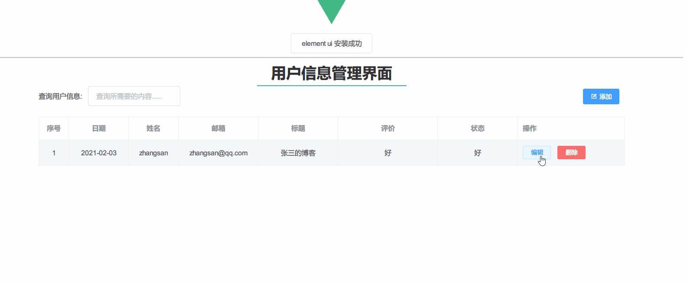
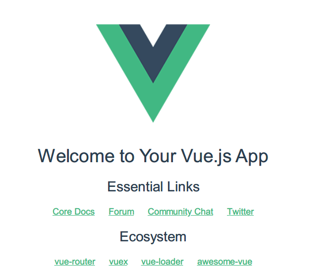
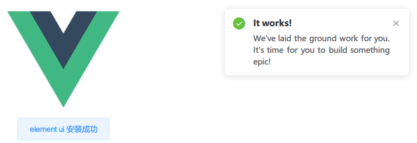
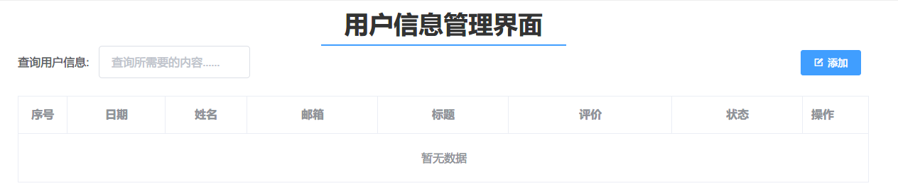
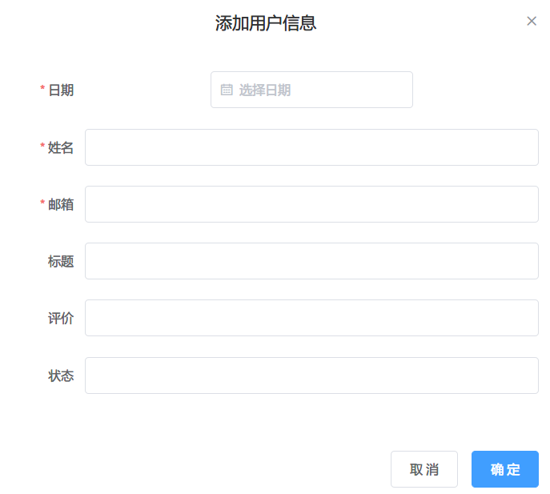
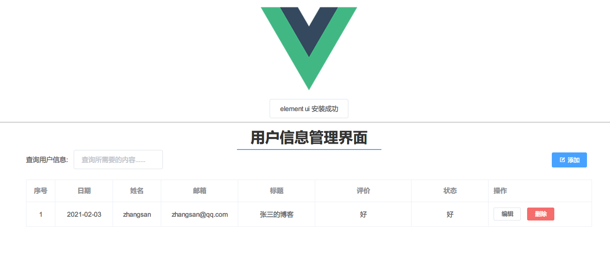
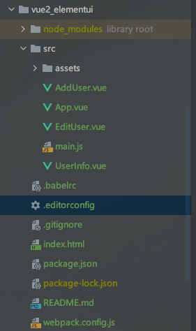

# 前言
2021了，VUE都出3.0了，还不开始学习VUE？那不是一个全栈攻城狮的自我修养，虽然VUE出3.0了，但是入门还是建议VUE2.0 + Element UI，毕竟3.0还要等养肥了在学，现在教程太少，学习2.0之后在学3.0也能更加理解为什么要这么去改进

VUE是啥？简单来说就是一个JS框架
> Vue (读音 /vjuː/，类似于 view) 是一套用于构建用户界面的渐进式框架。与其它大型框架不同的是，Vue 被设计为可以自底向上逐层应用。Vue 的核心库只关注视图层，不仅易于上手，还便于与第三方库或既有项目整合。另一方面，当与现代化的工具链以及各种支持类库结合使用时，Vue 也完全能够为复杂的单页应用提供驱动。

此处可以看VUE入门视频：https://learning.dcloud.io/#/?vid=0

本教程是给有一点基础的人进行VUE的快速入门，搭建一个单页面的增删改查。

# 效果演示



# Nodejs

现在的前端都是模块化开发了，需要Nodejs的支持，到官网下载Nodejs一路Next即可安装，官网地址：https://nodejs.org/en/

安装好后打开cmd命令行窗口，输出`node -v`，如果有版本号说明安装成功，同样输入`npm -V`如果有版本号说明npm安装成功(npm为nodejs的包管理器)
# json-server
在实战VUE之前先了解下json-server，顾名思义json服务器，在我们的入门实战中，不想引入太过于复杂的后端环境但是又想体验模块化的前端整个HTTP请求的完整过程，所幸Nodejs提供了json-server工具，方便快速的搭建简易服务器。

## 安装json-server

```bash
npm i json-server -g
```

- `i`表示`install`，即安装
- `-g`表示`global`，即全局安装

## 运行json-server

随便找个目录，创建一个`db.json`文件，内容如下

```json
{
  "data": []
}
```

然后在该目录下打开命令行窗口，执行

```bash
json-server --watch db.json
```

回显如下说明成功

```
  \{^_^}/ hi!

  Loading db.json
  Done

  Resources
  http://localhost:3000/data

  Home
  http://localhost:3000

  Type s + enter at any time to create a snapshot of the database
  Watching...

```

## 测试json-server

  http://localhost:3000/data是接口地址，直接用curl发送POST,DELETE,PATCH,GET请求模拟增删改查，只要测试一个通过了即可，其他的感兴趣可以测试下。

### 增(POST)

```bash
curl "http://127.0.0.1:3000/data" -H "Content-Type: application/json" -d "{\"name\":\"zhangsan\"}" -X POST
```

- `-H`表示增加请求头
- `-d`后面是数据
- `-X POST`表示用POST请求

返回值如下

```json
{
  "name": "zhangsan",
  "id": 2
}
```

再看一下我们刚才创建的db.json文件，里面多了我们刚才POST的数据。实际上就是存在了这个文件里面。

### 改(PATCH)

注意改的时候url后面跟上id

```bash
curl "http://127.0.0.1:3000/data/2"  -H "Content-Type: application/json" -d "{\"name\":\"lisi\"}"  -X PATCH
```

返回如下

```json
{
  "name": "lisi",
  "id": 2
}
```

说明修改成功

### 查(GET)

```bash
curl "http://127.0.0.1:3000/data"  -X GET
```

直接查全部

```json
[
  {
    "name": "lisi",
    "id": 2
  }
]
```

### 删(DELETE)

删除id为2的数据

```bash
curl "http://127.0.0.1:3000/data/2" -X DELETE
```

返回如下

```json
{}
```


# VUE实战

## 全局安装vue-cli

vue-cli是vue的脚手架，所谓脚手架说白了就是快速创建模板化的项目，不用每次创建项目都去重复那些固定化的操作，注意我们安装的是vue2.0的脚手架

```bash
npm install -g vue-cli
```

不要和vue3.0的混淆，vue3.0是`npm install -g @vue/cli`，此处不需要安装3.0，否则会冲突

## 全局安装webpack

webpack可以将vue项目打包成静态文件

```bash
npm install webpack -g
```


## vue 2.0 + Element UI 项目搭建 

### 基础版本搭建

随便找个目录输入如下命令

```bash
# 初始化一个叫做vue2_elementui的项目，使用webpack模板
vue init webpack-simple vue2_elementui

# 进入项目目录
cd vue2_elementui

# 构建
npm install

# 运行
npm run dev
```

经过上面的操作，打开http://localhost:8080/如果能看到下面的页面说明搭建成功了



### 引入Element UI

上面的先CTRL + C退出，下面安装Element UI依赖

```bash
# 安装Element UI
npm install element-ui -S

# 顺便安装vue-router 和 vue-resource，前者是路由，后者是执行Ajax请求用到的依赖
npm install vue-router vue-resource --S

# 安装moment，事件选择组件
npm install moment -S
```

- `-S`表示只在该项目下安装，不是全局安装

打开`main.js`，引入上面安装的组件

```js
import Vue from 'vue'
import App from './App.vue'

import ElementUI from 'element-ui'
import 'element-ui/lib/theme-chalk/index.css'
Vue.use(ElementUI)


import axios from 'axios'
import moment  from 'moment'


Vue.filter('moment', function (value, formatString) {
  formatString = formatString || 'YYYY-MM-DD HH:mm:ss';
  return moment(value).format("YYYY-MM-DD"); // value可以是普通日期 20170723
});

Vue.prototype.$axios = axios


new Vue({
  el: '#app',
  render: h => h(App)
})

```


打开`APP.vue`，修改如下

```vue
<template>
  <div id="app">
     
    <div>
      <el-button @click="startHacking">element ui 安装成功</el-button>
    </div>
  </div>
</template>
<script>
export default {
  methods: {
    startHacking () {
      this.$notify({
        title: 'It works!',
        type: 'success',
        message: 'We\'ve laid the ground work for you. It\'s time for you to build something epic!',
        duration: 5000
      })
    }
  },
  components:{
    UserInfo
  }
}
</script>

<style>
#app {
  font-family: Helvetica, sans-serif;
  text-align: center;
}
</style>

```

最后再次运行

```
npm run dev
```

如果出现下面的页面，而且点击页面会出现右边的提示框，说明Element UI安装成功



## 简单增删改查页面

#### 用户信息组件UserInfo.vue

```vue
<template>
  <div class="info">
    <h1>用户信息管理界面</h1>
    <el-row>
      <el-col :span="20" :push='2'>
        <div>
          <el-form :inline="true">
            <el-form-item style="float: left" label="查询用户信息:">
              <el-input v-model="keyUser" placeholder="查询所需要的内容......"></el-input>
            </el-form-item>
            <el-form-item style="float: right">
              <el-button type="primary" size="small" icon="el-icon-edit-outline" @click="hanldeAdd()">添加</el-button>
            </el-form-item>
          </el-form>
        </div>
        <div class="table">
          <el-table
            :data="searchUserinfo(keyUser)"
            border
            style="width: 100%">
            <el-table-column
              type="index"
              label="序号"
              align="center"
              width="60">
            </el-table-column>
            <el-table-column
              label="日期"
              align="center"
              width="120">
              <template slot-scope="scope">
                <span>{{ scope.row.date | moment}}</span>
              </template>
            </el-table-column>
            <el-table-column
              label="姓名"
              align="center"
              width="100">
              <template slot-scope="scope">
                <span>{{ scope.row.name }}</span>
              </template>
            </el-table-column>
            <el-table-column
              label="邮箱"
              align="center"
              width="160">
              <template slot-scope="scope">
                <span>{{ scope.row.email }}</span>
              </template>
            </el-table-column>
            <el-table-column
              label="标题"
              align="center"
              width="160">
              <template slot-scope="scope">
                <span>{{ scope.row.title }}</span>
              </template>
            </el-table-column>
            <el-table-column
              label="评价"
              align="center"
              width="200">
              <template slot-scope="scope">
                <span>{{ scope.row.evaluate }}</span>
              </template>
            </el-table-column>
            <el-table-column
              label="状态"
              align="center"
              width="160">
              <template slot-scope="scope">
                <span>{{ scope.row.state }}</span>
              </template>
            </el-table-column>
            <el-table-column label="操作" fixed="right">
              <template slot-scope="scope">
                <el-button
                  size="mini"
                  @click="handleEdit(scope.$index, scope.row)">编辑</el-button>
                <el-button
                  size="mini"
                  type="danger"
                  @click="handleDelete(scope.$index, scope.row)">删除</el-button>
              </template>
            </el-table-column>
          </el-table>
        </div>
      </el-col>
    </el-row>
    <AddUser :dialogAdd="dialogAdd" @update="getUserInfo"></AddUser>
    <EditUser :dialogEdit="dialogEdit" :form="form" @updateEdit="getUserInfo"></EditUser>
  </div>
</template>

<script>
import AddUser from './AddUser'
import EditUser from './EditUser'
export default {
  name: 'info',
  data () {
    return {
      tableData:[],
      dialogEdit:{
        show:false,
      },
      dialogAdd:{
        show:false
      },
      keyUser:"",
      form:{    //编辑信息
        date:'',
        name:'',
        email:'',
        title:'',
        evaluate:'',
        state:''
      },
    }
  },
  methods:{
    getUserInfo() {
      this.$axios.get('http://localhost:3000/data').then(res => {
        console.log(res)
        this.tableData = res.data
      })
    },
    hanldeAdd(){  //添加
      this.dialogAdd.show = true;
    },
    handleEdit(index,row){  //编辑
      this.dialogEdit.show = true; //显示弹
      this.form = {
        date:row.date,
        name:row.name,
        email:row.email,
        title:row.title,
        evaluate:row.evaluate,
        state:row.state,
        id:row.id
      }
      console.log(row)
    },
    handleDelete(index,row) {
      // 删除用户信息
      this.$axios.delete(`http://localhost:3000/data/${row.id}`).then(res =>{
        this.$message({
          type:"success",
          message:"删除信息成功"
        })
        this.getUserInfo()    //删除数据，更新视图
      })
    },
    searchUserinfo(keyUser) {
      return this.tableData.filter((user) => {
        if(user.name.includes(keyUser)) {
          return user
        }
      })
    }
  },
  created(){
    this.getUserInfo()
  },
  components:{
    AddUser,
    EditUser
  }
}
</script>

<!-- Add "scoped" attribute to limit CSS to this component only -->
<style scoped>
h1{
  font-size: 30px;
  color: #333;
  text-align: center;
  margin: 0 auto;
  padding-bottom: 5px;
  border-bottom: 2px solid #409EFF;
  width: 300px
}
</style>

```

这是列表主组件，查询和展示用的，长下面这样



其中引入了AddUser组件和EditUser组件

#### 添加用户组件AddUser.vue

```vue
<template>
  <div class="hello">
    <el-dialog title="添加用户信息" :visible.sync="dialogAdd.show">
      <el-form :model="formDate" ref="formdong" label-width="100px" :rules="formrules">
        <el-form-item label="日期" prop="date">
          <el-date-picker
            v-model="formDate.date"
            type="date"
            placeholder="选择日期">
          </el-date-picker>
        </el-form-item>
        <el-form-item label="姓名" prop="name">
          <el-input v-model="formDate.name"></el-input>
        </el-form-item>
        <el-form-item label="邮箱" prop="email">
          <el-input v-model="formDate.email"></el-input>
        </el-form-item>
        <el-form-item label="标题" prop="title">
          <el-input v-model="formDate.title"></el-input>
        </el-form-item>
        <el-form-item label="评价" prop="evaluate">
          <el-input v-model="formDate.evaluate"></el-input>
        </el-form-item>
        <el-form-item label="状态" prop="state">
          <el-input v-model="formDate.state"></el-input>
        </el-form-item>
      </el-form>
      <div slot="footer" class="dialog-footer">
        <el-button @click="dialogAdd.show = false">取 消</el-button>
        <el-button type="primary" @click="dialogFormAdd('formdong')">确 定</el-button>
      </div>
    </el-dialog>
  </div>
</template>

<script>
export default {
  name: 'AddUser',
  props:{
    dialogAdd:Object
  },
  data () {
    return {
      formDate:{
        date:'',
        name:'',
        email:'',
        title:'',
        evaluate:'',
        state:''
      },
      formrules:{
        date:[{required:true,message:"日期不能为空",trigger:"blur"}],
        name:[{required:true,message:"用户名不能为空",trigger:"blur"}],
        email:[{required:true,message:"邮箱不能为空",trigger:"blur"}],
      }
    }
  },
  methods:{
    dialogFormAdd(formdong) {
      this.$refs[formdong].validate((valid) => {
        if (valid) {
          this.$axios.post('http://localhost:3000/data',this.formDate).then(res => {
            this.$message({
              type:"success",
              message:"添加信息成功"
            })
            this.dialogAdd.show = false;
            this.$emit('update');

          })
          this.formDate  = ""
        } else {
          console.log('error submit!!');
          return false;
        }
      })
    }
  }
}
</script>

<!-- Add "scoped" attribute to limit CSS to this component only -->
<style scoped>

</style>

```

这是添加用户信息组件



#### 编辑用户组件EditUser.vue

```vue
<template>
  <div class="hello">
    <el-dialog title="编辑用户信息" :visible.sync="dialogEdit.show">
      <el-form :model="form" ref="formEdit" label-width="100px" :rules="formrules">
        <el-form-item label="日期" prop="date">
          <el-date-picker
            v-model="form.date"
            type="date"
            placeholder="选择日期">
          </el-date-picker>
        </el-form-item>
        <el-form-item label="姓名" prop="name">
          <el-input v-model="form.name"></el-input>
        </el-form-item>
        <el-form-item label="邮箱" prop="email">
          <el-input v-model="form.email"></el-input>
        </el-form-item>
        <el-form-item label="标题" prop="title">
          <el-input v-model="form.title"></el-input>
        </el-form-item>
        <el-form-item label="评价" prop="evaluate">
          <el-input v-model="form.evaluate"></el-input>
        </el-form-item>
        <el-form-item label="状态" prop="state">
          <el-input v-model="form.state"></el-input>
        </el-form-item>
      </el-form>
      <div slot="footer" class="dialog-footer">
        <el-button @click="dialogEdit.show = false">取 消</el-button>
        <el-button type="primary" @click="dialogFormEdit('formEdit')">确 定</el-button>
      </div>
    </el-dialog>
  </div>
</template>

<script>
export default {
  name: 'HelloWorld',
  props:{
    dialogEdit:Object,
    form:Object
  },
  data () {
    return {
      formrules:{
        date:[{required:true,message:"日期不能为空",trigger:"blur"}],
        name:[{required:true,message:"用户名不能为空",trigger:"blur"}],
        email:[{required:true,message:"邮箱不能为空",trigger:"blur"}],
      }
    }
  },
  methods:{
    dialogFormEdit(formEdit) {
      this.$refs[formEdit].validate((valid) => {
        if (valid) {
          this.$axios.put(`http://localhost:3000/data/${this.form.id}`,this.form).then(res => {
            this.$message({
              type:"success",
              message:"编辑信息成功"
            })
            console.log(res)
            this.dialogEdit.show = false;
            this.$emit('updateEdit')
          })
        } else {
          console.log('error submit!!');
          return false;
        }
      })
    }
  }
}
</script>

<!-- Add "scoped" attribute to limit CSS to this component only -->
<style scoped>

</style>

```

编辑和新增类似

#### 在APP.vue中引入组件

APP.vue修改如下，其中`import UserInfo from './UserInfo'`表示引入组件

`<UserInfo></UserInfo>`表示调用该组件

```vue
<template>
  <div id="app">
     
    <div>
      <el-button @click="startHacking">element ui 安装成功</el-button>
    </div>
    <hr>
    <UserInfo></UserInfo>
  </div>
</template>

<script>
import UserInfo from './UserInfo'
export default {
  methods: {
    startHacking () {
      this.$notify({
        title: 'It works!',
        type: 'success',
        message: 'We\'ve laid the ground work for you. It\'s time for you to build something epic!',
        duration: 5000
      })
    }
  },
  components:{
    UserInfo
  }
}
</script>

<style>
#app {
  font-family: Helvetica, sans-serif;
  text-align: center;
}
</style>

```

最后打开页面，看看是否能增删改查




此时，项目结构如下图所示



# 总结

此处假设你已经看过VUE基础视频了：https://learning.dcloud.io/#/?vid=0

## main.js

main.js很重要，里面定义了入口组件`APP.vue`；引入了项目所需要的包

## 组件三件套

分别是template，script，style，新组件就这样来定义

```vue
<template>
 //定义该组件的模板
</template>

<script>
import com1 from 'XXX'
import com2 from 'XXX'
export default {
  name: '组件名字',
  data () {
    return {
        //定义组件数据
      },
    }
  },
  methods:{
    //定义组件方法
  },
  created(){
    this.getUserInfo()
  },
  components:{
    com1,com2//定义改组件引用的其他组件
  }
}
</script>

<style>
//定义该组件用到的样式
</style>

```

## 组件的属性

在AddUser.vue组件中，有一个键叫props，里面有一个dialogAdd

```js
<script>
export default {
  name: 'AddUser',
  props:{
    dialogAdd:Object
  }
}
</script>
```

这表示该组件可以用到的属性，在UserInfo.vue里面这么引用AddUser组件的

```vue
<AddUser :dialogAdd="dialogAdd" @update="getUserInfo"></AddUser>
```

在AddUser上面绑定了一个dialogAdd属性，这会传到AddUser.vue组件里面控制AddUser的显示与隐藏，有点像父子组件之前的通信

## $emit触发自定义事件

在AddUser.vue组件中，有一个自定义事件

```javascript
this.$emit('update');
```

这会给父组件UserInfo触发一个update事件，父组件自然会调用`@update`中定义的方法`getUserInfo`重新查询数据并加载页面，总结两句话就是：

- 父组件可以使用 props 把数据传给子组件
- 子组件可以使用 $emit 触发父组件的自定义事件

## Element UI

ElementUI相关问题可以参考官方文档：https://element.eleme.cn/#/zh-CN/component/installation

# 推荐

推荐一个通用后端项目：https://panjiachen.github.io/vue-element-admin-site/zh/guide/

> [vue-element-admin](http://panjiachen.github.io/vue-element-admin) 是一个后台前端解决方案，它基于 [vue](https://github.com/vuejs/vue) 和 [element-ui](https://github.com/ElemeFE/element)实现。它使用了最新的前端技术栈，内置了 i18 国际化解决方案，动态路由，权限验证，提炼了典型的业务模型，提供了丰富的功能组件，它可以帮助你快速搭建企业级中后台产品原型。相信不管你的需求是什么，本项目都能帮助到你。

