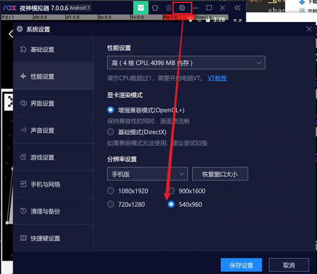
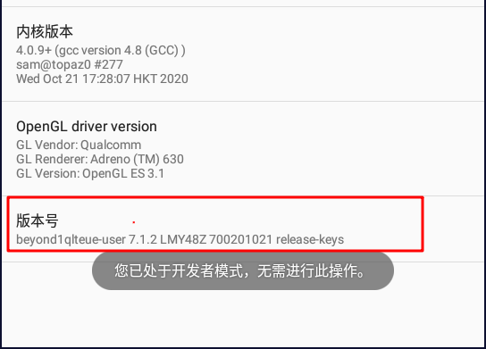
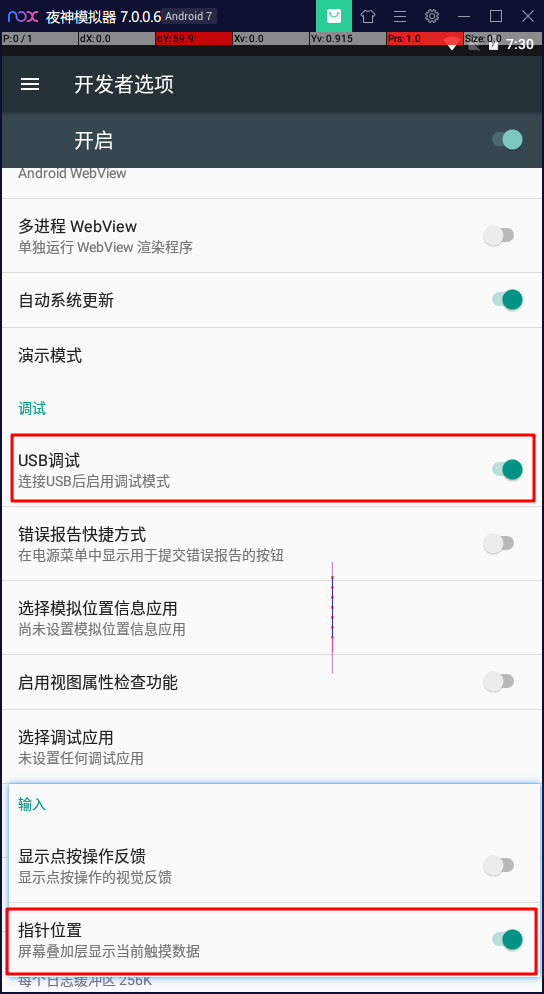
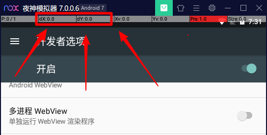
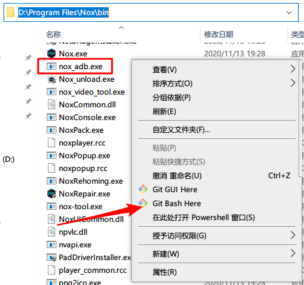
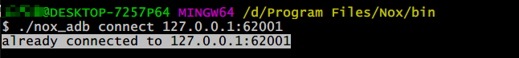
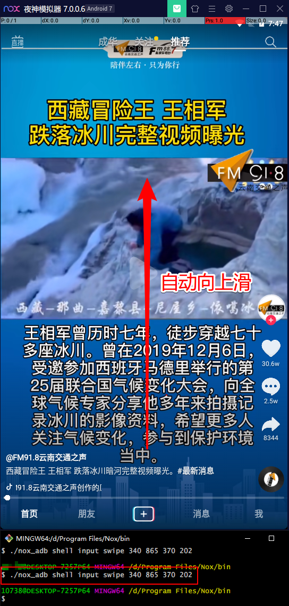
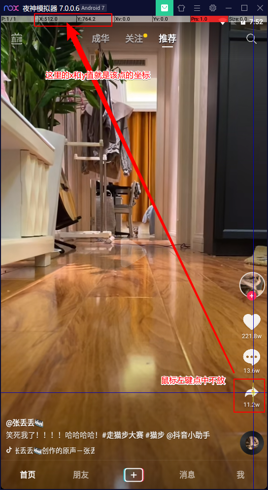
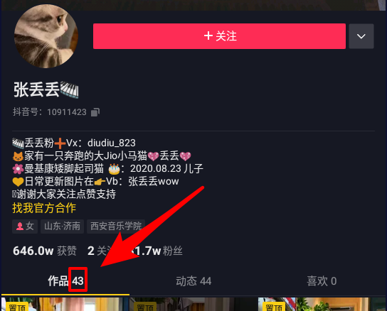
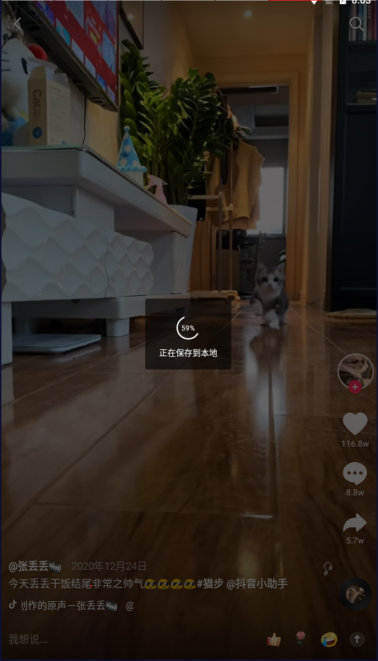

# 5分钟三句代码实现抖音自动下载

免责声明：本文所涉及资源均来源互联网，仅供个人分享学习，严谨用于非法用途，否则后果自负，且与本文无关！

最新可用时间：2021-01-22

最近发现抖音的网页链接https://www.douyin.com/share/user/65413595875?share_type=link失效了，而且加了很多防反爬参数，即使从官网分项的连接跳转过来，多刷新几次都不一定能看到作者发布的视频，只能看到发布了多少个视频，通过网页爬取数据难度很大了

但是换一种思路，直接从抖音APP上下载数据，用命令模拟滑动，点击分享按钮，点击下载按钮这三个动作，优点是不怕被封，缺点是环境准备较为复杂繁琐，对抖音版本要求比较严格，但是不用真机用虚拟机还是简单许多(也可以用真机，只要能连上adb)

# 效果演示


# 工具准备

- 一台Windows系统的电脑
- [安卓模拟器](https://www.yeshen.com/)（此处我用的是夜神，其他模拟器理论上也可以）
- 抖音版本为 v13.5.0
- [Git](https://git-scm.com/)（因为要写运行shell脚本，所以需要Git Bash）

注意抖音版本号一定要对，因为我们是模拟真实用户操作，所以界面UI不同可能会造成实现代码差异较大

# 原理
安卓开发中有一个工具叫ADB（Android 调试桥 (adb)），通过ADB可以给安卓设备发送指令，我们只需要在抖音APP的视频界面，发送**点击分享**，**点击下载**，**滑动**这三个动作即可
## ADB
参考：https://developer.android.com/studio/command-line/adb，本次我们用到的指令有tap(点击)，swipe(滑动)，screencap(截屏)

# ADB连接安卓设备
## 安装模拟器
这里记住安装的位置，后面要用，我的是`/d/Program Files/Nox/bin/`
## 打开模拟器
打开就不用说了，双击即可，记得先安装抖音APP
## 设置分辨率
设置为540*960，先把分辨率定死，这样后面代码写起来简单些，如下图



## 打开安卓设备调试模式
安卓 > 设置 > 最底部关于平板(手机) > 一直点击版本号直到出现已处于开发者模式的提示



返回，找到开发者选项，打开USB调试模式和指针位置



打开指针位置顶部会显示当前点击位置的坐标值(x,y)，方便我们定位位置



## ADB连接安卓设备

这才到了最后一步，在Git Bash里面打开adb，查看我们安装模拟器的位置里面是否有nox_adb.exe，这是夜神自带的adb，别的模拟器可能不一样，只是个名字而已，无所谓，然后此处右键，点击Git Bash Here



在Git Bash里面输入` ./nox_adb connect 127.0.0.1:62001`，如下图，如果出现下面回显说明成功

```
already connected to 127.0.0.1:62001
```



# 极简版本

上面我们已经通过adb连上安卓了，直接使用adb命令操作，先打开抖音APP，然后在bash窗口输入

```bash
./nox_adb shell input swipe 340 865 370 202
```

然后回车，你会惊奇的发现视频自动往上滚动！这就是我们要的效果，用代码来控制APP！



另外两个动作也是如出一辙：

- 点击右边分享按钮：`/nox_adb shell input tap 509 761`
- 点击下面下载按钮：`/nox_adb shell input tap 112 845`

这里有个难点在于定位按钮位置，比如分享按钮中的509和761就是分享按钮在屏幕中的坐标，怎么定位呢？如下图所示，直接点击定位取值即可，注意取个大概就行，不必要太精确



所以最后我们的版本就是，这就是我们的三句代码版本

```bash
# 滑动
./nox_adb shell input swipe 340 865 370 202
# 点击分享
./nox_adb shell input tap 509 761
# 点击下载
./nox_adb shell input tap 112 845
```

三行代码搞定一个视频的下载，下面再加一个循环，再加个下载延时，就可以不停的下滑并下载

```bash
# 定义adb路径
adb_exe='/d/Program Files/Nox/bin/nox_adb.exe'
while true;do
	"$adb_exe"/nox_adb shell input swipe 340 865 370 202
	sleep 1
	"$adb_exe"/nox_adb shell input tap 509 761
	sleep 1
	"$adb_exe"/nox_adb shell input tap 112 845
	# 睡两秒用于下载
	sleep 2
	echo "next"
done 
```

# 可定义下载数量版本

上面的脚本很简单，一直循环不停下滑就行，但是我们要下载一个up主的所有视频，到最后一个的时候怎么办呢？上面的脚本会一直不停的去下载最后一个，其实后面已经没有视频了，所以我们的思路是定义一个数量，如下图，作者的旁边有一个作品数量，我们把这个写到代码里面



再优化一下代码，封装成函数，所以最后代码如下

```bash
adb_exe='/d/Program Files/Nox/bin/nox_adb.exe'
# 定义一下作品数量
sum=$1
echo "sum is $sum"

# 封装滑动函数
function swipe(){
	"$adb_exe" shell input swipe 340 865 370 202
	sleep 1
}

# 封装下载函数
function download(){
	"$adb_exe" shell input tap 509 761
	sleep 1
	"$adb_exe" shell input tap 112 845
	sleep 2	
}

# 第一个视频下载
download
i=1
# 其他视频下载
while [ $i -le $sum ];do
	((i++))
	time=$(date "+%Y-%m-%d %H:%M:%S")
	echo "$time next is $i"
	swipe
	download
done 
# 下载完成提示
echo 'all $sum has download'
 
```

把上面代码保存成一个文件douyinDownloader.sh，然后再Git Bash中执行

```bash
./douyinDownloader.sh 43
```

后面的43就是数量，当然也可以直接在代码写死

# 检测下载完成版本

上面的版本已经可以定义下载数量了，但是还有一个问题是我怎么知道下载完成了？？现在代码定义的是下载2秒就算完成，但是万一视频很大呢？网络卡住了？所以写死2秒不是一个好办法，针对这个问题有两个思路

第一个是随机等待2~10秒，这个思路简单，但是还是有效果，因为抖音视频大多都很小

第二个思路就是检测屏幕颜色值，因为视频在下载的时候与播放的时候视频像素值是大不相同的，如下图，下载的时候整个就是灰色的，所以下载的时候我们一直检测像素值是不是下载之前的像素值，如果是则下载完成，否在还在下载



这里就有一个问题了，adb怎么检测像素值？经过我的研究发现，可以通过截屏成二进制数据，然后读取二进制数据，指定偏移的像素点即可知道像素的值，注意，我们关注的不是像素的具体值，而是这个像素到底发生变化没有！adb取像素值参考：https://stackoverflow.com/questions/24185005/how-can-i-get-the-color-of-a-screen-pixel-through-adb，原文如下，做个备份，看不懂略过

>How can I get the color of a screen pixel THROUGH ADB？
>
>I will post an answer to my own question. The answer maybe device-specified (nexus7 2013), and you can adjust it to your own devices.
>
>1.Firstly, I find out that the command `screencap screen.png` is quite slow because it take most of its time converting to png file type. So, to save time, the first step is dump screen to a raw data file. ` adb shell screencap screen.dump `
>
>2.Check the file size. My screen resolution is 1920*1200, and the file size is 9216012 byte. Noticing that 9216012=1920*1200*4+12, I guess the data file use 4 byte to store every pixel information, and use another 12 byte to do some mystery staff. Just do some more screencaps and I find the 12 byte at the head of each file are the same. So, the additional 12 byte is at the head of the data file.
>
>3.Now, things are simple by using `dd` and `hd`. Assuming that I want to get the color at (x,y): ` let offset=1200*$y+$x+3 dd if='screen.dump' bs=4 count=1 skip=$offset 2>/dev/null | hd `
>
>I get output like ` 00000000: 4b 73 61 ff s 21e sum 21e `The `4b 73 61 ff` is my answer.

但是我并没有找到hd命令，但是hd就是hexdump，所以我用的命令如下

```bash
./nox_adb shell "dd if='/screen.dump' bs=4 count=1 skip=$offset 2>/dev/null | hexdump"`
```

所以，最终的代码如下，效果就是文章开头演示的GIF图

```bash
# 定义adb路径
adb_exe='/d/Program Files/Nox/bin/nox_adb.exe'
# 定义要下载的视频总数，可以从命令行读取(第一个参数)
sum=$1
# 定义分享按钮的位置，执行之前最好手动取一下位置坐标
# 因为发现每次打开抖音分享按钮的位置不尽相同
sharePosX=506
sharePosY=723
echo "total videos is $sum"


# 定义滑动函数
function swipe(){
	"$adb_exe" shell input swipe 340 865 370 202
	sleep 0.4
}

# 随便点击屏幕停止播放
function stopPlay(){
	"$adb_exe" shell input tap 300 300
	sleep 0.2
}

# /root目录挂载为可读写，否则下面生成dump文件可能会遇到Read Only File System的问题
"$adb_exe" shell "mount -o rw,remount /"
"$adb_exe" remount
# 获取颜色值，参考：https://stackoverflow.com/questions/24185005/how-can-i-get-the-color-of-a-screen-pixel-through-adb
function getColor(){
    x=$1
	y=$2
	"$adb_exe" shell "screencap /screen.dump"
	sleep 0.2
	let offset=960*$y+$x+3
	res=`"$adb_exe" shell "dd if='/screen.dump' bs=4 count=1 skip=$offset 2>/dev/null | hexdump"`
	sleep 0.2
	echo $res
}


# 点击分享按钮，点击下载按钮，检测是否下载完成
function download(){
    # 停止播放
    stopPlay
	echo 'stop play'
	# 此时取色A
	colorA=`getColor 300 300`
	# 点击分享
	"$adb_exe" shell input tap $sharePosX $sharePosY
	echo 'share taped'
	sleep 1
	# 点击下载
	"$adb_exe" shell input tap 112 845
	echo 'download taped'
	sleep 0.5 # 等0.5秒让界面蒙版出现，颜色值会发生变化
	# 再次取色
	colorB=`getColor 300 300`
	# 如果两个颜色相同说明下载完成，因为点击了下载按钮后界面会有一层蒙版
	# 下载完成蒙版消失，颜色和下载之前一样
	while [ "$colorA" != "$colorB" ];do
		echo 'waiting for downloading...'
		sleep 1
		colorB=`getColor 300 300`
	done		
}


# 第一个视频先下载
download

# 其他的视频下载
i=1
while [ $i -le $sum ];do
	((i++))
	time=$(date "+%Y-%m-%d %H:%M:%S")
	echo "$time next is $i"
	swipe
	download
done 

echo 'all $sum has download'

```

脚本运行输出

```
$ ./douyinDownload3.sh 11
total videos is 11
remount succeeded
stop play
share taped
download taped
2021-01-23 10:28:13 next is 2
stop play
share taped
download taped
```


# 支持多设备版本

在模拟器多开的时候，adb会提示错误：`error: more than one device/emulator`，先查看有哪些设备：`./nox_adb devices`，回显如下

```bash
List of devices attached
127.0.0.1:62025 device
127.0.0.1:62001 device
```

此时adb命令需要指定一个设备，例：

```bash
./nox_adb -s 127.0.0.1:62001 shell input swipe 340 865 370 202
```

所以优化一下我们的脚本，只有一个设备的时候直接使用，有多个设备的时候给出选项，选择一个后再继续

```bash
# 定义adb路径
adb_exe='/d/Program Files/Nox/bin/nox_adb.exe'
# 定义要下载的视频总数，可以从命令行读取(第一个参数)
sum=$1
# 定义分享按钮的位置，执行之前最好手动取一下位置坐标
# 因为发现每次打开抖音分享按钮的位置不尽相同
if [ "$2" != "" ];then
	sharePosX=$2
else 
	sharePosX=512
fi

if [ "$3" != "" ];then
	sharePosY=$3
else 
	sharePosY=761
fi


# 选择设备
function choose_dev(){
	dev_cnt=`devices_cnt`
	if   [ $dev_cnt -eq 1 ];then
		# 只有一个设备取第二行
		device=`sed -n '2p' /tmp/adbDevices | awk '{print $1}'`
		echo "Found only one device:$device"
	elif [ $dev_cnt -gt 1 ]; then
 		option_str=`sed  -n '2,$p' /tmp/adbDevices | awk '{ print $1 }' | xargs`
 		IFS=' ' read -r -a options <<< "$option_str"
 		let len=${#options[@]}-1
 		echo 'All devices list here:'
 		for i in "${!options[@]}"; do
  			echo "$i > ${options[i]}"
		done
		read -p 'Please input this number of device:' index
		while [ $index -gt $len ] || [ $index -lt 0 ];do
			read -p 'No device selected,please choose again:' index
		done
		device=${options[$index]}
		echo "Your device is：$device" 
	else
		echo 'No devices found,script exit!'
		exit 0
	fi
}

# 获取设备个数
function devices_cnt(){
	# 注意此处为-2，因为adb devices输出加了换行
	let dev_cnt=`cat /tmp/adbDevices| wc -l`-2
	echo $dev_cnt
}

# 定义滑动函数
function swipe(){
	"$adb_exe" -s $device shell input swipe 340 865 370 202
	sleep 0.4
}

# 随便点击屏幕停止播放
function stopPlay(){
	"$adb_exe" -s $device shell input tap 300 300
	sleep 0.2
}


# 获取颜色值，参考：https://stackoverflow.com/questions/24185005/how-can-i-get-the-color-of-a-screen-pixel-through-adb
function getColor(){
    x=$1
	y=$2
	"$adb_exe" -s $device shell "screencap /screen.dump"
	sleep 0.2
	let offset=960*$y+$x+3
	res=`"$adb_exe" -s $device shell "dd if='/screen.dump' bs=4 count=1 skip=$offset 2>/dev/null | hexdump"`
	sleep 0.2
	echo $res
}


# 点击分享按钮，点击下载按钮，检测是否下载完成
function download(){
    # 停止播放
    stopPlay
	echo 'stop play'
	# 此时取色A
	colorA=`getColor 300 300`
	# 点击分享
	"$adb_exe" -s $device shell input tap $sharePosX $sharePosY
	echo 'share taped'
	sleep 1
	# 点击下载
	"$adb_exe" -s $device shell input tap 112 845
	echo 'download taped'
	sleep 0.5 # 等0.5秒让界面蒙版出现，颜色值会发生变化
	# 再次取色
	colorB=`getColor 300 300`
	# 如果两个颜色相同说明下载完成，因为点击了下载按钮后界面会有一层蒙版
	# 下载完成蒙版消失，颜色和下载之前一样
	while [ "$colorA" != "$colorB" ];do
		echo 'waiting for downloading...'
		sleep 1
		colorB=`getColor 300 300`
	done		
}

#将设备信息保存到临时文件，输出类似于
#List of devices attached
#127.0.0.1:62025 device
#127.0.0.1:62001 device
#
#
"$adb_exe" devices >/tmp/adbDevices

# 初始化device变量
choose_dev
sleep 1

# /root目录挂载为可读写，否则下面生成dump文件可能会遇到Read Only File System的问题
"$adb_exe" -s $device shell "mount -o rw,remount /"
"$adb_exe" -s $device remount
sleep 1


echo "total videos is $sum and starting downloading..."
echo "sharePosX:$sharePosX, sharePosY:$sharePosY"
sleep 1

# 第一个视频先下载
download

# 其他的视频下载
i=1
while [ $i -le $sum ];do
	((i++))
	time=$(date "+%Y-%m-%d %H:%M:%S")
	echo "$time next is $i"
	swipe
	download
done 

echo 'all $sum has download'

```

脚本运行输出，多设备

```
$ ./douyinDownload4.sh 230 509 726
All devices list here:
0 > 127.0.0.1:62025
1 > 127.0.0.1:62001
Please input this number of device:2
No device selected,please choose again:2
No device selected,please choose again:3
No device selected,please choose again:00
Your device is：127.0.0.1:62025
remount succeeded
total videos is 11 and starting downloading...
sharePosX:509, sharePosY:726
stop play
share taped
download taped
2021-01-23 10:18:49 next is 2
stop play
share taped
```

单设备

```
$ ./douyinDownload4.sh 230 509 726
Found only one device:127.0.0.1:62001
remount succeeded
total videos is 230 and starting downloading...
sharePosX:509, sharePosY:726
stop play
share taped
download taped
waiting for downloading...
2021-01-23 10:53:08 next is 2

```


# 最后

上面的几个版本都只是一简陋的脚本，不能实现太多功能，目的是为了抛砖引玉。初衷是为了自动下载某个UP主的所有视频，不需要太复杂的逻辑，shell脚本写太复杂的逻辑也不好维护

脚本不足之处：

- 素读取那一块其实很耗IO，因为每次都去截屏生成文件读取文件，这并不是一个好办法，但是局限于adb，需要更多功能来控制安卓设备的话需要借助其他语言或框架实现，比如Python，Lua等
- 分辨率定死的，不能适配多分辨率，这个adb其实可以实现适配设备，不过这样脚本就复杂了，可自行研究
- 抖音分享按钮位置不准，这个需要自己测量位置，同样adb实现检测按钮位置不方便，需要其他语言或框架辅助