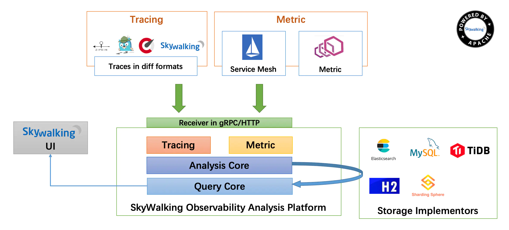
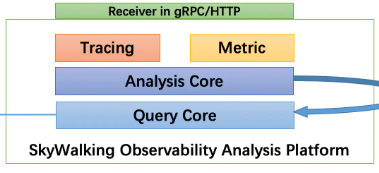
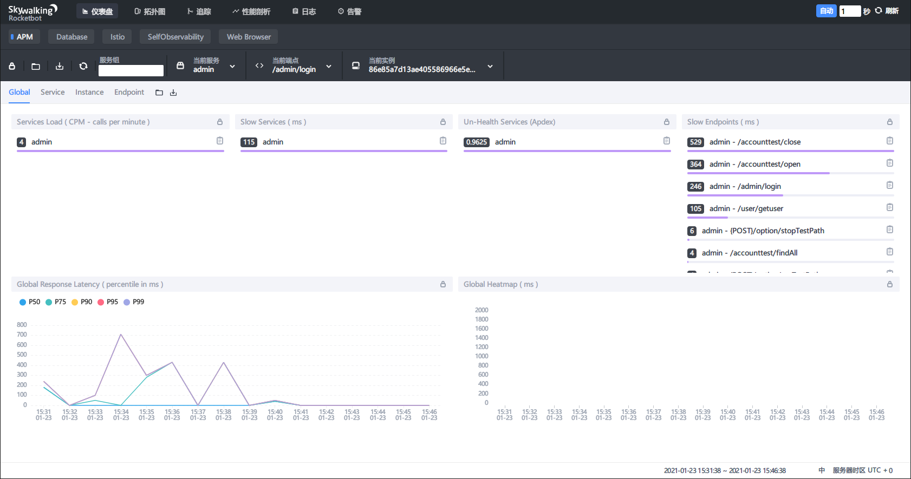
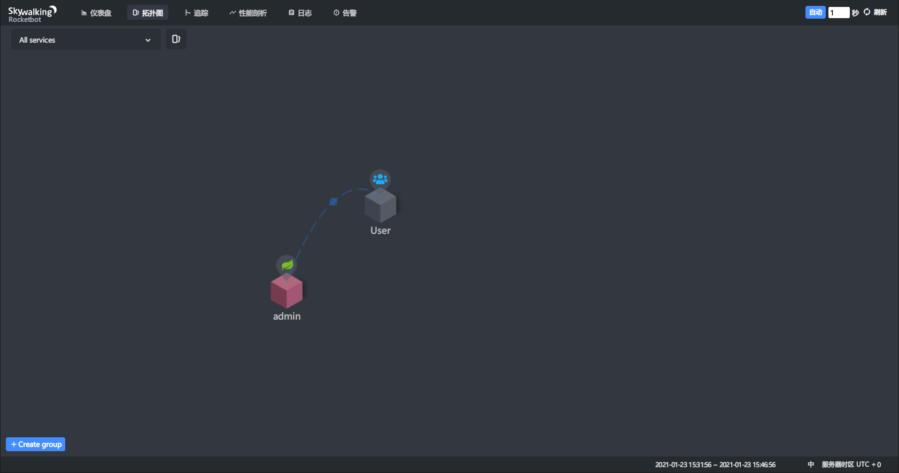
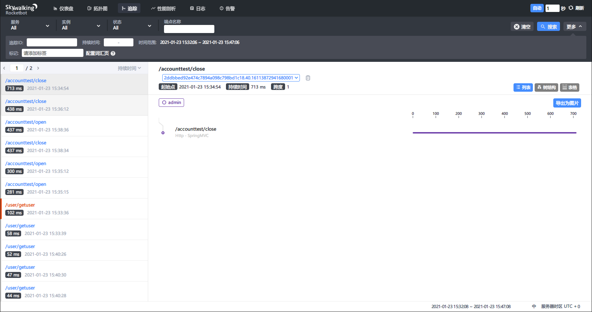

# 5分钟搭建Skywalking监控系统

# 背景

​    公司项目采用微服务的架构，服务很多，人工监控是不可能的，项目的访问量很大，想通过日志查找某个方法中性能的问题也是非常困难的。但是系统的性能问题是不能忽视的。目前有几个比较好的开源APM（Application Performance Management）检测工具。

# 常见的监控工具对比

- SkyWalking：中国人吴晟（华为）开源的一款分布式追踪，分析，告警的工具，现在是Apache旗下开源项目，对云原生支持，目前增长势头强劲，社区活跃，中文文档没有语言障碍。
- Zipkin：Twitter公司开源的一个分布式追踪工具，被Spring Cloud Sleuth集成，使用广泛而稳定，需要在应用程序中埋点，对代码侵入性强
- Pinpoint：一个韩国团队开源的产品，探针收集的数据粒度非常细，但性能损耗大，因其出现的时间较长，完成度很高。
- Cat：美团大众点评开源的一款分布式链路追踪工具。需要在应用程序中埋点，对代码侵入性强。

​    项目不想侵入其他的代码，工具尽量损耗性能低，工具的社区活越，文档完善也是考虑的必要条件，经过以下表格部分参数对比，相对来说，SkyWalking更占优，因此团队采用SkyWalking作为APM工具。

| 工具名称       | 代码入侵方式 | 性能   | UI       | 使用人数 | 粒度       | 告警   | 依赖分析 | traceID查询 |
| -------------- | ------------ | ------ | -------- | -------- | ---------- | ------ | -------- | ----------- |
| SkyWalking | 无侵入   | 高 | 丰富 | 多   | 方法级 | 有 | 有   | 有      |
| Pinpoint   | 无侵入   | 低 | 丰富 | 多   | 方法级 | 有 | 有   | 有      |
| Zipkin     | 侵入低   | 中 | 一般 | 多   | 接口级 | 无 | 有   | 有      |
| Cat        | 侵入高   | 中 | 丰富 | 较多 | 代码级 | 有 | 无   | 无      |

# SkyWalking架构



# 搭建

本次搭建用ES作为存储，最开始用H2作内存存储，最后再接入ES，避免环节过多产生不可预知的错误

环境介绍：

本教程采用虚拟机(CentOS7) + docker的方式搭建，这样的好处是用docker容器分离各个容器，快速方便的模拟生产环境。

- 创建网络

```
docker network create --subnet=172.18.0.0/16 mynet
```

- 创建容器，有三个角色，一个是SkyWalking AOP(监控数据收集)，另一个和是ES(数据存储)，还有一个是Java WEB(被监控)

```bash
# SkyWalking APM
docker run -dit --net mynet --ip 172.18.0.30 -p 8090:8090 --name sw --privileged centos /usr/sbin/init

# Java App
docker run -dit --net mynet --ip 172.18.0.31 -p 8080:8080 --name javaApp --privileged centos /usr/sbin/init

# ES
docker run -dit --net mynet --ip 172.18.0.32 --name es1 --privileged centos /usr/sbin/init
```


## 安装Java环境

由于ES和SkyWalking 都需要Java环境，所以安装Java提出来放到最前面

```bash
# 安装java
yum -y install java-1.8.0-openjdk java-1.8.0-openjdk-devel which

# 环境变量设置
cat > /etc/profile.d/java8.sh <<EOF
export JAVA_HOME=$(dirname $(dirname $(readlink $(readlink $(which javac)))))
export PATH=\$PATH:\$JAVA_HOME/bin
export CLASSPATH=.:\$JAVA_HOME/jre/lib:\$JAVA_HOME/lib:\$JAVA_HOME/lib/tools.jar
EOF
source /etc/profile.d/java8.sh

```


## 安装SkyWalking OAP

SkyWalking OAP 即架构图中的下部分**SkyWalking Observability Analysis Platform**，如下图所示



本次下载安装的是`apache-skywalking-apm-es7-8.3.0.tar.gz`，其他版本请参考：http://skywalking.apache.org/downloads/

注意安装之前一点要先安装Java环境，否则启动不成功但是启动脚本还是会显示启动成功。

```bash
yum install -y wget vim telnet

cd ~
# 下载
wget https://downloads.apache.org/skywalking/8.3.0/apache-skywalking-apm-es7-8.3.0.tar.gz
# 解压
tar xf apache-skywalking-apm-es7-8.3.0.tar.gz -C /usr/local
mv /usr/local/apache-skywalking-apm-bin-es7 /usr/local/skywalking-8.3.0
```

### 启动OAP

```bash
# 启动OAP
/usr/local/skywalking-8.3.0/bin/oapService.sh

# 查看日志
tail -f /usr/local/skywalking-8.3.0/logs/skywalking-oap-server.log
```

查看OAP监听端口

```bash
grep 'gRPCPort:' /usr/local/skywalking-8.3.0/config/application.yml 
gRPCPort: ${SW_CORE_GRPC_PORT:11800}
gRPCPort: ${SW_RECEIVER_GRPC_PORT:0}
gRPCPort: ${SW_RECEIVER_JAEGER_PORT:14250}

```

可以看到SkyWalking OAP默认监听端口为11800，测试下端口是否通

```bash
telnet 127.0.0.1 11800
# 出现下面回显说明端口通
Trying 127.0.0.1...
Connected to 127.0.0.1.
Escape character is '^]'.
```

### 启动SkyWalking UI

```bash
vim /usr/local/skywalking-8.3.0/webapp/webapp.yml
```

SkyWalking UI默认端口为8080与很多中间件有冲突，改成其他的，本例为8090

```yml

server:
  port: 8090

```

启动

```bash
# 启动UI
/usr/local/skywalking-8.3.0/bin/webappService.sh
```

访问一下http://192.168.108.100:8090，如果能访问，说明启动成功


## 开启SkyWalking Agent

所谓Agent是指SkyWalking从各个平台(Java Python等)收集监控数据的代理，此处我们以为Java应用(Spring boot)为例，收集Java应用产生的各种监控数据

### 准备一个Jar包

随便准备个Jar包能跑的就行，此处我的jar名字为`admin-2.0.1.RELEASE.jar `

### 配置SkyWalking Java端的Agent

Agent需要拷贝一份到收集的机器上，有多少台机器就要拷贝多少次，此处我们用的docker容器所以需要拷贝到宿主机再拷贝到跑javaWeb的机器

```bash
# 拷贝agent到宿主机
docker cp sw:/usr/local/skywalking-8.3.0/agent  /tmp
# 再从宿主机拷贝到目标容器
docker cp /tmp/agent/ javaApp:/root/javaApp/agent
```

配置Agent

```bash
vim /root/javaApp/agent/config/agent.config
```

- backend_service设置成OAP的ip和端口

- sample_n_per_3_secs表示每3秒采样一样，配置说明：在访问量较少时，链路全量收集不会对系统带来太大负担，能够完整的观测到系统的运行状况。但是在访问量较大时，全量的链路收集，对链路收集的客户端（agent探针）、服务端（SkyWalking OAP）、存储器（例如说 Elastcsearch）都会带来较大的性能开销，甚至会影响应用的正常运行。在访问量级较大的情况下，往往会选择抽样采样，只收集部分链路信息。SkyWalking Agent 在 agent/config/agent.config 配置文件中，定义了 agent.sample_n_per_3_secs 配置项，设置每 3 秒可收集的链路数据的数量。

```

collector.backend_service=${SW_AGENT_COLLECTOR_BACKEND_SERVICES:172.18.0.30:11800}
agent.sample_n_per_3_secs=${SW_AGENT_SAMPLE:1}
```

运行jar包，指定`-javaagent`与`skywalking.agent.service_name`，后者就是SkyWalking UI上显示的名字

```bash
nohup java -javaagent:/root/javaApp/agent/skywalking-agent.jar -Dskywalking.agent.service_name=admin  -jar admin-2.0.1.RELEASE.jar > admin.log 2>&1 &
```

## 效果查看

- 仪表盘



- 拓扑图



- 链路追踪



## 安装ES

h2只是一个内存存储系统，其目的是为了让你能够快速验证快速响应，它还没有强大到足以支撑线上系统运行。所以，线上一定得选用某个更可靠存储。

一般地，ES会是个不错的选择，一来它以搜索速度著称而这正好符合后台查询的需求，二来es是分布式存储，可以避免一定的大数据量问题。

参考： [安装并运行 Elasticsearch](https://www.elastic.co/guide/cn/elasticsearch/guide/current/running-elasticsearch.html)

首先进入容器

```bash
docker exec -it es1 bash
```

常用工具安装

```
yum install -y wget
```

在[Download Elasticsearch](https://www.elastic.co/cn/downloads/elasticsearch)选择合适的平台下载好包，我下载的是`elasticsearch-7.10.1-linux-x86_64.tar.gz`

```bash
# 下载
cd ~ && wget https://artifacts.elastic.co/downloads/elasticsearch/elasticsearch-7.10.1-linux-x86_64.tar.gz

# 解压
tar -zxvf elasticsearch-7.10.1-linux-x86_64.tar.gz

# 拷贝
cp -r elasticsearch-7.10.1 /usr/local/

# 运行
/usr/local/elasticsearch-7.10.1/bin/elasticsearch
```

运行后此时你会得到一个报错：`java.lang.RuntimeException: can not run elasticsearch as root`

原因很明显，不能用root运行，那么新建用户再运行

```bash
# 新建用户
adduser elasticsearch

# 赋权
chown -R elasticsearch /usr/local/elasticsearch-7.10.1

# 切换用户再执行
su elasticsearch
/usr/local/elasticsearch-7.10.1/bin/elasticsearch

# 后台执行
/usr/local/elasticsearch-7.10.1/bin/elasticsearch -d
```

测试，如果`curl 127.0.0.1:9200`有类似以下回显说明成功

```json
{
  "name" : "74e37036a2ee",
  "cluster_name" : "elasticsearch",
  "cluster_uuid" : "L8xK0ZqZSUKn3dZ05NJfcg",
  "version" : {
    "number" : "7.10.1",
    "build_flavor" : "default",
    "build_type" : "tar",
    "build_hash" : "1c34507e66d7db1211f66f3513706fdf548736aa",
    "build_date" : "2020-12-05T01:00:33.671820Z",
    "build_snapshot" : false,
    "lucene_version" : "8.7.0",
    "minimum_wire_compatibility_version" : "6.8.0",
    "minimum_index_compatibility_version" : "6.0.0-beta1"
  },
  "tagline" : "You Know, for Search"
}
```

### 修改配置文件及问题排查

此时发现只能用127.0.0.1访问，不能用 `curl 172.18.0.32:9200`访问，因为没设置`network.host`，下面设置一下，顺便加上允许跨域的设置`http.cors.enabled`、`http.cors.allow-origin`，`sed -i '$a内容' file` 是在文件末尾追加

```bash
sed -i '$ahttp.cors.enabled: true' /usr/local/elasticsearch-7.10.1/config/elasticsearch.yml
sed -i '$ahttp.cors.allow-origin: "*"' /usr/local/elasticsearch-7.10.1/config/elasticsearch.yml
sed -i '$anetwork.host: 172.18.0.32' /usr/local/elasticsearch-7.10.1/config/elasticsearch.yml
```

此时启动es，发现启动失败，报错如下：

```
[2021-01-13T13:46:30,780][INFO ][o.e.t.TransportService   ] [a622d8352de5] publish_address {172.18.0.12:9300}, bound_addresses {172.18.0.12:9300}
[2021-01-13T13:46:31,039][INFO ][o.e.b.BootstrapChecks    ] [a622d8352de5] bound or publishing to a non-loopback address, enforcing bootstrap checks
[2021-01-13T13:46:31,066][ERROR][o.e.b.Bootstrap          ] [a622d8352de5] node validation exception
[2] bootstrap checks failed
[1]: max virtual memory areas vm.max_map_count [65530] is too low, increase to at least [262144]
[2]: the default discovery settings are unsuitable for production use; at least one of [discovery.seed_hosts, discovery.seed_providers, cluster.initial_master_nodes] must be configured
[2021-01-13T13:46:31,069][INFO ][o.e.n.Node               ] [a622d8352de5] stopping ...
[2021-01-13T13:46:31,094][INFO ][o.e.n.Node               ] [a622d8352de5] stopped
[2021-01-13T13:46:31,095][INFO ][o.e.n.Node               ] [a622d8352de5] closing ...
[2021-01-13T13:46:31,116][INFO ][o.e.n.Node               ] [a622d8352de5] closed
[2021-01-13T13:46:31,119][INFO ][o.e.x.m.p.NativeController] [a622d8352de5] Native controller process has stopped - no new native processes can be started

```

注意看这句话：bound or publishing to a non-loopback address, enforcing bootstrap checks，绑定的不是本地回环接口，强制进行启动检查，es认为绑定的不是127.0.0.1就是要用于生产环境，所以要启动一下适用于生产环境的强制性检查，检查出不适合的条件就不让启动！所需需要修改如下错误：

```
[1]: max virtual memory areas vm.max_map_count [65530] is too low, increase to at least [262144]
[2]: the default discovery settings are unsuitable for production use; at least one of [discovery.seed_hosts, discovery.seed_providers, cluster.initial_master_nodes] must be configured
```

- [1]

```bash
# 切换到root用户执行
sed -i '$avm.max_map_count=262144' /etc/sysctl.conf
sysctl -p
```

- [2]

```bash
# 追加这句配置
sed -i '$adiscovery.seed_hosts: ["172.18.0.32"]' /usr/local/elasticsearch-7.10.1/config/elasticsearch.yml
```

- [3]

```bash
# 配置集群名称，后面OAP要用
sed -i '$acluster.name: my-application' /usr/local/elasticsearch-7.10.1/config/elasticsearch.yml

```

此时再次启动就不会报错了，如果还是报错，请根据es的报错提示进行更改

试一下用本机IP能访问不：`curl 172.18.0.32:9200`

### 配置SkyWalking OAP接入ES

```
vim /usr/local/skywalking-8.3.0/config/application.yml 
```

主要配置storage，selector可以选择，配置了要选定才生效，主要配置nameSpace和clusterNodes这两个选项

- nameSpace就是ES中配置的cluster.name，一定要一致
- clusterNodes即为ES集群的IP端口

```yml
storage:
  selector: ${SW_STORAGE:elasticsearch7}
  elasticsearch7:
    nameSpace: ${SW_NAMESPACE:"my-application"}
    clusterNodes: ${SW_STORAGE_ES_CLUSTER_NODES:172.18.0.32:9200}
    indexShardsNumber: ${SW_STORAGE_ES_INDEX_SHARDS_NUMBER:1} # Shard number of new indexes
    indexReplicasNumber: ${SW_STORAGE_ES_INDEX_REPLICAS_NUMBER:1} # Replicas number of new indexes

```

启动OAP

```bash
# 启动OAP
/usr/local/skywalking-8.3.0/bin/oapService.sh

# 查看日志
tail -f /usr/local/skywalking-8.3.0/logs/skywalking-oap-server.log
```


### SkyWalking OAP接入ES 问题排查

启动后发现SkyWalking OAP报错如下：

```
2021-01-23 08:12:58,935 - org.apache.skywalking.oap.server.starter.OAPServerBootstrap - 57 [main] ERROR [] - method [HEAD], host [http://172.18.0.32:9200], URI [/_template/my-application_alarm_record?master_timeout=30s], status line [HTTP/1.1 503 Service Unavailable]
org.elasticsearch.ElasticsearchStatusException: method [HEAD], host [http://172.18.0.32:9200], URI [/_template/my-application_alarm_record?master_timeout=30s], status line [HTTP/1.1 503 Service Unavailable]
        at org.elasticsearch.client.RestHighLevelClient.parseResponseException(RestHighLevelClient.java:1767) ~[elasticsearch-rest-high-level-client-7.5.0.jar:7.5.0]

```

去看了下ES后台，也报错了

```
org.elasticsearch.discovery.MasterNotDiscoveredException: null
        at org.elasticsearch.action.support.master.TransportMasterNodeAction$AsyncSingleAction$2.onTimeout(TransportMasterNodeAction.java:230) [elasticsearch-7.10.1.jar:7.10.1]
        at org.elasticsearch.cluster.ClusterStateObserver$ContextPreservingListener.onTimeout(ClusterStateObserver.java:335) [elasticsearch-7.10.1.jar:7.10.1]

```

而且ES一直在提醒如下内容

```
[2021-01-23T08:25:07,993][WARN ][o.e.c.c.ClusterFormationFailureHelper] [3546a7854be2] master not discovered yet, this node has not previously joined a bootstrapped (v7+) cluster, and this node must discover master-eligible nodes [master] to bootstrap a cluster: have discovered 
```

这是ES主节点配置有问题，现在我们就一台ES，所以配置这台为主节点，加入如下配置

```bash
vi  /usr/local/elasticsearch-7.10.1/config/elasticsearch.yml

node.name: node-1
cluster.initial_master_nodes: ["node-1"]
```

再次依次重新启动ES和OAP就没有问题了

# 参考

- https://blog.csdn.net/u013066244/article/details/105574495
- https://blog.csdn.net/JavaDestiny/article/details/90704974
- https://blog.csdn.net/wudinaniya/article/details/103956256
- https://www.cnblogs.com/diShuiZhiYi/p/13451254.html
- [监控系统比较 Skywalking Pinpoint Cat zipkin](https://zhuanlan.zhihu.com/p/60436915)
- [全链路追踪工具SkyWalking使用入门](https://blog.csdn.net/m0_38001814/article/details/104061708)
- [Zipkin之外的选择：Skywalking vs Pinpoint](https://didispace-wx.blog.csdn.net/article/details/88677526)