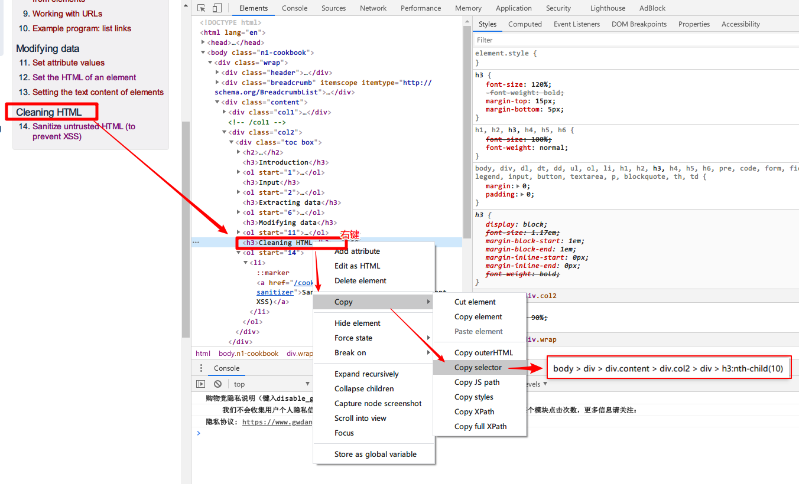

# Java中解析HTML框架之Jsoup

场景是这样的，本来是想申请一个第三方支付接口判断用户支付是否成功，后来发现不需要申请接口也可以通过订单号查询页面获取支付结果，这样就可以直接解析html来判断支付结果了，这就引入了本文的主题，Jsoup解析html

当然jsoup不只有上面的应用场景，它还有一个应用场景，就是爬虫！

题外话：上面场景中，使用支付接口其实才是最稳当的办法，但是支付接口申请周期长，而且一些情况下并不是免费的，再者一些支付接口只支持一种语言，可能和本项目不是一个语言（比如项目是Java的，但是人家提供的支付接口只支持PHP），这样增加了系统复杂度，如果业务量大且要求准确的场景下应当使用支付接口，否则可以取巧解析html，解析html有一个不好的地方就是如果html结构变化了，那么接口就得重写，都有优缺点，看场景选择。

# Jsoup简介与使用

官网：https://jsoup.org/

**jsoup** 提供了简便的API，使用了HTML5 DOM方法和CSS选择器用来解析HTML。其实现了[WHATWG HTML5](https://whatwg.org/html) 规范，像浏览器一样解析HTML。

- 从文件，URL，字符串抓取和[解析](https://jsoup.org/cookbook/input/parse-document-from-string)HTML
- 使用DOM遍历或者CSS选择器来[查找](https://jsoup.org/cookbook/extracting-data/selector-syntax)和提取数据
- [操作](https://jsoup.org/cookbook/modifying-data/set-html)HTML元素，属性和文字
- [清除](https://jsoup.org/cookbook/cleaning-html/whitelist-sanitizer)用户提交的安全白名单以外的内容，以防止XSS攻击
- [美化](https://jsoup.org/apidocs/org/jsoup/select/Elements.html#html--)HTML

## 引入依赖

```xml
<dependency>
    <groupId>org.jsoup</groupId>
    <artifactId>jsoup</artifactId>
    <version>1.11.2</version>
</dependency>
```


## 解析HTML

1. 从字符串解析

```java
String html = "<html><head><title>First parse</title></head>"
  + "<body><p>Parsed HTML into a doc.</p></body></html>";
Document doc = Jsoup.parse(html);
```

2. 从URL解析

```java
// 简洁版
Document doc = Jsoup.connect("http://example.com/").get();
String title = doc.title();

//完整版
doc = Jsoup.connect("http://example.com")
  .data("query", "Java")
  .userAgent("Mozilla/5.0 (Windows NT 10.0; WOW64) AppleWebKit/537.36 (KHTML, like Gecko) Chrome/86.0.4240.198 Safari/537.36")
  .cookie("auth", "token")
  .timeout(3000)
  .post();

```

3. 从文件解析

```java
File input = new File("/tmp/input.html");
Document doc = Jsoup.parse(input, "UTF-8", "http://example.com/");
```


## 提取HTML

- 遍历HTML

```java
File input = new File("/tmp/input.html");
Document doc = Jsoup.parse(input, "UTF-8", "http://example.com/");

Element content = doc.getElementById("content");
Elements links = content.getElementsByTag("a");
for (Element link : links) {
  String linkHref = link.attr("href");
  String linkText = link.text();
}
```

- 提取数据

```java
String html = "<p>An <a href='http://example.com/'><b>example</b></a> link.</p>";
Document doc = Jsoup.parse(html);
Element link = doc.select("a").first();

String text = doc.body().text(); // "An example link"
String linkHref = link.attr("href"); // "http://example.com/"
String linkText = link.text(); // "example""

String linkOuterH = link.outerHtml(); 
    // "<a href="http://example.com"><b>example</b></a>"
String linkInnerH = link.html(); // "<b>example</b>"
```

- 相对路径转换成绝对路径，一些a标签使用的是相对路径，下面的代码可以将其转换成绝对路径

```java
Document doc = Jsoup.connect("http://jsoup.org").get();

Element link = doc.select("a").first();
String relHref = link.attr("href"); // == "/"
String absHref = link.attr("abs:href"); // "http://jsoup.org/"
```

### CSS选择器

Jsoup支持CSS选择器，用的是 `Element.select(String selector)`方法

```java
File input = new File("/tmp/input.html");
Document doc = Jsoup.parse(input, "UTF-8", "http://example.com/");

Elements links = doc.select("a[href]"); // a with href
Elements pngs = doc.select("img[src$=.png]");
  // img with src ending .png

Element masthead = doc.select("div.masthead").first();
  // div with class=masthead

Elements resultLinks = doc.select("h3.r > a"); // direct a after h3
```

如何快速定位页面上元素的内容？答案是打开Chrome，按F12打开开发者工具，定位到想要的DOM节点，右键，copy，选择Copy selector，即可生成CSS选择器，类似于`body > div > div.content > div.col2 > div > h3:nth-child(10)`



遗憾的是Jsoup不支持Xpath选择器，但是早就有人意识到这个问题了，所以诞生了**JsoupXpath**

> **JsoupXpath** 是一款纯Java开发的使用xpath解析提取html数据的解析器，针对html解析完全重新实现了W3C XPATH 1.0标准语法，xpath的Lexer和Parser基于Antlr4构建，html的DOM树生成采用Jsoup，故命名为JsoupXpath.
> 为了在java里也享受xpath的强大与方便但又苦于找不到一款足够好用的xpath解析器，故开发了JsoupXpath。JsoupXpath的实现逻辑清晰，扩展方便，
> 支持完备的W3C XPATH 1.0标准语法，W3C规范：http://www.w3.org/TR/1999/REC-xpath-19991116 ，JsoupXpath语法描述文件[Xpath.g4](https://github.com/zhegexiaohuozi/JsoupXpath/blob/master/src/main/resources/Xpath.g4)

项目地址：https://github.com/zhegexiaohuozi/JsoupXpath

感兴趣的可以看一下测试用例：里面包含了大量的使用场景：https://github.com/zhegexiaohuozi/JsoupXpath/blob/master/src/test/java/org/seimicrawler/xpath/JXDocumentTest.java

## 操作HTML

jsoup可以在插入、删除、提取HTML，直接看例子代码

- 设置属性

```java
//设置属性
doc.select("div.comments a").attr("rel", "nofollow");
doc.select("div.masthead").attr("title", "jsoup").addClass("round-box");
```

- 插入html

```java
//插入html
Element div = doc.select("div").first(); // <div></div>
div.html("<p>lorem ipsum</p>"); // <div><p>lorem ipsum</p></div>
div.prepend("<p>First</p>");
div.append("<p>Last</p>");
// now: <div><p>First</p><p>lorem ipsum</p><p>Last</p></div>

Element span = doc.select("span").first(); // <span>One</span>
span.wrap("<li><a href='http://example.com/'></a></li>");
// now: <li><a href="http://example.com"><span>One</span></a></li>
```

- 设置文本

```java
//设置文本
Element div = doc.select("div").first(); // <div></div>
div.text("five > four"); // <div>five &gt; four</div>
div.prepend("First ");
div.append(" Last");
// now: <div>First five &gt; four Last</div>
```

## 避免XSS攻击( [cross-site scripting](https://en.wikipedia.org/wiki/Cross-site_scripting) )

```java
String unsafe = 
  "<p><a href='http://example.com/' onclick='stealCookies()'>Link</a></p>";
String safe = Jsoup.clean(unsafe, Whitelist.basic());
// now: <p><a href="http://example.com/" rel="nofollow">Link</a></p>
```

# 参考

- https://jsoup.org/
- http://www.wanghaomiao.cn/archives/25/
- https://github.com/zhegexiaohuozi/JsoupXpath