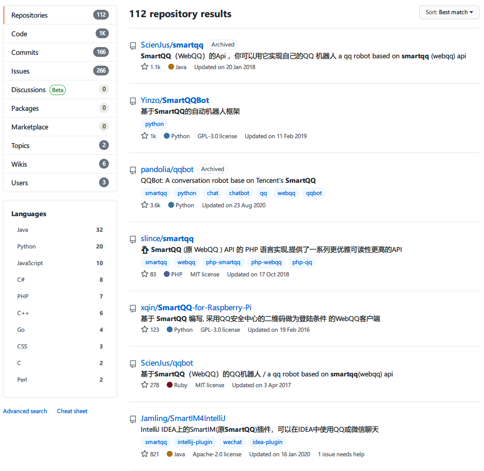
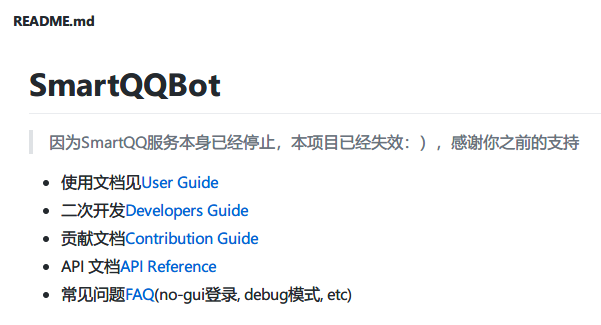

# 5分钟实战QQ机器人教程(保姆级)

免责声明：本文所涉及资源均来源互联网，仅供个人分享学习，严谨用于非法用途，否则后果自负，且与本文无关！

实战在后面，先来理顺一下QQ机器人这个乱七八糟的东西，简直太乱，各种框架各种项目满天飞，所以诞生了下面的QQ机器人的前世今生。想看实战的直接跳到下面的实战目录

# QQ机器人的前世今生

## Smart QQ

QQ机器人最早可以追溯到Smart QQ，也就是**WebQQ**，参考：https://zh.wikipedia.org/wiki/Smart_QQ

> **WebQQ**是[腾讯](https://zh.wikipedia.org/wiki/腾讯)于2009年9月15日正式推出的一项服务，该服务可以使用户在不安装[QQ](https://zh.wikipedia.org/wiki/QQ)软件的情况下使用QQ的部分服务。该功能已于2019年1月1日停止运营[[1\]](https://zh.wikipedia.org/wiki/Smart_QQ#cite_note-1)。

Web QQ顾名思义也就是网页上运行的QQ，这要做机器人那就太简单了，分析HTTP协议就行了，由此诞生了一些列的Web QQ机器人框架，说白了就是封装的HTTP协议而已

> 2019年1月1日，Smart QQ正式停止服务。[[3\]](https://zh.wikipedia.org/wiki/Smart_QQ#cite_note-3)

目前(2021-01-31)在Github上还存在大量SmartQQ的项目，但是大多数都是归档或者失效的。





## 酷Q等各种框架

大概2011年左右，有了一个叫做的酷Q的项目，酷Q最开始也是用的Smart QQ的Web协议，Smart QQ关闭之后开始用安卓手机QQ的协议，具体是酷Q Air（免费）用的是手Q国际版，酷Q Pro（付费）用的是安卓Q，所谓实现安卓手机QQ协议就是把QQ.apk大卸八块，反编译找到关键源代码，比如登录之类，数据传输协议抓包查看，通过这些手段自己实现一个QQ客户端的意思，那么自己实现的客户端就可以进行功能扩展，算是制作QQ机器人的基础。

因为能用反编译+抓包的方式实现自己的QQ客户端，所以QQ机器人框架雨后春笋般涌现，由此诞生了一些优秀的机器人，比如：

| 项目地址                                                     | 简介                                                         |
| ------------------------------------------------------------ | ------------------------------------------------------------ |
| [milkice233/efb-qq-slave](https://github.com/milkice233/efb-qq-slave) | 基于 ehForwarderBot 框架的 QQ 从端                           |
| [projectriri/bot-gateway](https://projectriri.github.io/bot-gateway/) | 提供跨聊天平台的通用机器人 API 的机器人消息网关              |
| [jqqqqqqqqqq/UnifiedMessageRelay](https://github.com/jqqqqqqqqqq/UnifiedMessageRelay) | QQ <-> Telegram Bot Framework & Forwarder                    |
| [Mother-Ship/cabbageWeb](https://github.com/Mother-Ship/cabbageWeb) | 基于 Java Web 的 osu! 游戏数据查询机器人                     |
| [bdbai/Kobirt](https://github.com/bdbai/Kobirt)              | Ingress 游戏辅助机器人                                       |
| [JRT-FOREVER/hub2coolq](https://github.com/JRT-FOREVER/hub2coolq) | GitHub webhook 消息转发至 QQ 群                              |
| [Kurarion/Bangumi-for-QQ](https://github.com/Kurarion/Bangumi-for-QQ) | 用于在 QQ 平台便捷地使用 Bangumi 部分功能（查寻条目、更新条目进度等） |
| [rikakomoe/cqhttp-twitter-bot](https://github.com/rikakomoe/cqhttp-twitter-bot) | 自动订阅 Twitter 发送到 QQ                                   |
| [XiaoLin0815/QQ2TG](https://github.com/XiaoLin0815/QQ2TG)    | 帮助 QQ 与 Telegram 互联的小程序                             |
| [spacemeowx2/splatoon2-qqbot](https://github.com/spacemeowx2/splatoon2-qqbot) | 宇宙第一的 Splatoon2 的地图机器人                            |
| [OYMiss/forward-bot](https://github.com/OYMiss/forward-bot)  | 用 Telegram 和 QQ 好友聊天的转发机器人                       |
| [mrthanlon/SICNUBOT](https://github.com/mrthanlon/SICNUBOT)  | 专为四川师范大学设计用于审核发布消息用的 QQ 机器人           |
| [billjyc/pocket48](https://github.com/billjyc/pocket48/tree/coolq) | 监控成员口袋 48 聚聚房间、微博和摩点项目                     |
| [chinshin/CQBot_hzx](https://github.com/chinshin/CQBot_hzx)  | 摩点 & 微博 & 口袋 48 机器人（BEJ48-黄子璇）                 |
| [Ice-Hazymoon/grnd_bot](https://github.com/Ice-Hazymoon/grnd_bot) | 订阅 RSSHub 更新并推送到 QQ 群                               |
| [Ray-Eldath/Avalon](https://github.com/Ray-Eldath/Avalon)    | 多功能、可扩展的群机器人，支持 QQ 和 Discord                 |
| [Bluefissure/FFXIVBOT](https://github.com/Bluefissure/FFXIVBOT) | 基于 Django Channels 的最终幻想 14 游戏数据查询机器人        |
| [Milkitic/Daylily](https://github.com/Milkitic/Daylily)      | 基于 ASP.NET Core 的跨平台机器人（含快速开发插件框架）       |
| [cczu-osa/aki](https://github.com/cczu-osa/aki)              | 基于 NoneBot 的多功能 QQ 机器人                              |
| [cleoold/sendo-erika](https://github.com/cleoold/sendo-erika) | 基于 cqhttp 和 NoneBot 的，主要通过私聊摇控的 QQ 机器人      |
| [duan602728596/qqtools](https://github.com/duan602728596/qqtools) | 基于 Nwjs 的 QQ 群工具（摩点、口袋 48、微博提醒、入群欢迎、定时喊话、自定义命令和回复信息等） |
| [Tsuk1ko/CQ-picfinder-robot](https://github.com/Tsuk1ko/CQ-picfinder-robot) | 基于 Saucenao 的搜图机器人                                   |
| [kasora/dice](https://github.com/kasora/dice)                | COC7 骰子 QQ 机器人                                          |
| [shidenggui/tuishujun-for-qq](https://github.com/shidenggui/tuishujun-for-qq) | 基于推书君的小说查询推荐 QQ 机器人                           |
| [JuerGenie/cn.juerwhang.jgbot](https://github.com/JuerGenie/cn.juerwhang.jgbot) | 基于 [JuerGenie/juerobot](https://github.com/JuerGenie/juerobot) 的娱乐用 QQ 机器人 |
| [drsanwujiang/DiceRobot](https://github.com/drsanwujiang/DiceRobot) | 一个基于 coolq-http-api 插件的 TRPG 骰子机器人               |
| [UltraSoundX/SDFMU-Library](https://github.com/UltraSoundX/SDFMU-Library) | 山东第一医科大图书馆预约机器人                               |
| [Quan666/ELF_RSS](https://github.com/Quan666/ELF_RSS)        | 基于 NoneBot 的，交互式 RSS 订阅、转发机器人                 |
| [lz1998/Spring-CQ-web](https://github.com/lz1998/Spring-CQ-web) | 基于 SpringCQ 的机器人 web 控制台                            |
| [suisei-cn/stargazer-qq](https://github.com/suisei-cn/stargazer-qq) | 一个灵活的 vtuber 发推/直播动态监控机器人                    |
| [Ninzore/Wecab](https://github.com/Ninzore/Wecab)            | 网络内容聚合机器人，支持微博、B站、Twitter 等                |

但是，好景不长，在2020年8月，腾讯突然封杀这些机器人框架：

> 截至2020.8.2凌晨2:00
> 晨风框架死(腾讯律师函，作者进局子)
> 酷q框架停运(用户 违规非法行为，网站关闭，框架正常，Air一旦重启不可使用 Pro用到授权完为止)暂时可以使用
> 契约框架部分问题，服务器被踹(官方公告即将跑路)暂时可以使用
> oq机器人停运(消息不明)
> qr机器人停运(消息不明)
> mypc框架论坛关闭(消息不明)
> 乾坤框架停运(消息不明)
> 华景机器人(跑路拜拜)
> ono机器人(作者亲自强调跑路拜拜)
> mirai框架(群验证消息:已跑路)
> nanbot框架论坛上不去(不明)
> 轻语机器人（消息不明）
> 柠檬机器人（消息不明）
> 暂时已知部分正常框架
> QQlight框架
> 小栗子机器人框架
> qqmax lite CoCo (某些手机robot)
>
> 目前未知消息机器人软件（不出名）
> 大神机器人（来自百度，目前未知消息）
> 星空机器人（来自百度，目前未知消息）

晨风机器人作者被跨省传唤

> ### 晨风QQ机器人作者被跨省传唤，腾讯的起诉让群管理人人自危
>
> 
>

## Mirai 框架(Java + Kotlin)

Mirai 也是一个上面跑路的机器人框架，实现的也是安卓QQ协议，项目地址：https://github.com/mamoe/mirai

> 
>
> mirai 是一个在全平台下运行，提供 QQ Android 协议支持的高效率机器人库
>
> 这个项目的名字来源于
>
> [京都动画](http://www.kyotoanimation.co.jp/)作品[《境界的彼方》](https://zh.moegirl.org.cn/zh-hans/境界的彼方)的[栗山未来(Kuriyama **mirai**)](https://zh.moegirl.org.cn/zh-hans/栗山未来)
>
> [CRYPTON](https://www.crypton.co.jp/)以[初音未来](https://www.crypton.co.jp/miku_eng)为代表的创作与活动[(Magical **mirai**)](https://magicalmirai.com/2019/index_en.html)
>
> 图标以及形象由画师[DazeCake](https://github.com/DazeCake)绘制

看来这个框架的开发者是老二次元了，现在也只剩下开源的mirai了，虽然之前说说mirai作者也跑路了，但还真没看出来哪里跑了，mirai强调并且切实实行了**“一切开发旨在学习，请勿用于非法用途**”的准则，我估计是这个确保了mirai能安心地继续存在。

> ### 一切开发旨在学习，请勿用于非法用途
>
> - mirai 是完全免费且开放源代码的软件，仅供学习和娱乐用途使用
> - mirai 不会通过任何方式强制收取费用，或对使用者提出物质条件
> - mirai 由整个开源社区维护，并不是属于某个个体的作品，所有贡献者都享有其作品的著作权。

所以只要不是用于非法盈利之类的用途，是不会收到腾讯的律师函的。

## 机器人标准OneBot 

上面所说的各种框架都只是机器人的各种实现，每个框架之间接口都不通用，编程语言也不尽相同，想要开发一个自己的机器人，换一套框架所有的代码都要推到重来，所以亟需一个规范统一各个框架，所以OneBot 诞生了，先来看看OneBot 是啥：

> # OneBot 标准
>
> 一个聊天机器人应用接口标准
>
> ### 简单
>
> 接口简单易懂，可轻松接入。
>
> ### 兼容性
>
> 兼容原 CQHTTP 插件，零负担迁移。

兼容原 CQHTTP 插件，这个标准和CQHTTP有啥关系？CQHTTP是酷Q的一个插件，这个插件可以提供HTTP协议的接口供第三方系统调用，这样就和具体语言无关，什么语言都可以调用机器人接口实现自己的逻辑，而且基于CQHTTP 已经实现了很多功能的机器人了，详情见上面优秀机器人框架，为了不让以前所有的优秀代码都要推倒重来，所以OneBot 干脆直接在CQHTTP 的基础之上指定标准，这就是典型的**先有实现，后有标准**的例子。

在这个标准的基础之上，有了各种编程语言的实现，我们称之为生态，如下

> 理论上，基于 OneBot 标准开发的**任何** SDK、框架和机器人应用，都可以无缝地在下面的不同实现中切换。当然，在一小部分细节上各实现可能有一些不同，这也是本项目希望推动解决的问题。
>
> | 项目地址                                                     | 平台                                          | 核心作者       | 备注                                                         |
> | ------------------------------------------------------------ | --------------------------------------------- | -------------- | ------------------------------------------------------------ |
> | [richardchien/coolq-http-api](https://github.com/richardchien/coolq-http-api) | CKYU                                          | richardchien   | 可在 Mirai 平台使用 [mirai-native](https://github.com/iTXTech/mirai-native) 加载 |
> | [Mrs4s/go-cqhttp](https://github.com/Mrs4s/go-cqhttp)        | [MiraiGo](https://github.com/Mrs4s/MiraiGo)   | Mrs4s          |                                                              |
> | [yyuueexxiinngg/cqhttp-mirai](https://github.com/yyuueexxiinngg/cqhttp-mirai) | [Mirai](https://github.com/mamoe/mirai)       | yyuueexxiinngg |                                                              |
> | [takayama-lily/onebot](https://github.com/takayama-lily/onebot) | [OICQ](https://github.com/takayama-lily/oicq) | takayama       |                                                              |
> | [Yiwen-Chan/OneBot-YaYa](https://github.com/Yiwen-Chan/OneBot-YaYa) | [先驱](https://www.xianqubot.com/)            | Kanri          |                                                              |

MiraiGo就是GO语言实现的安卓QQ协议，API很原始，相当于一个类库，go-cqhttp是在MiraiGo的基础之上封装的HTTP协议和Websocket协议接口的框架，得益于GO语言先天的优势（资源占用少，运行简单，协程并发高），总之就是性能高，引用项目原话

> 在关闭数据库的情况下, 加载 25 个好友 128 个群运行 24 小时后内存使用为 10MB 左右. 开启数据库后内存使用将根据消息量增加 10-20MB, 如果系统内存小于 128M 建议关闭数据库使用.

本文选择go-cqhttp作为实战框架

# 实战

来到了最激动人心的实战环节，先看一下OneBot 标准的接口列表，参考https://github.com/howmanybots/onebot/blob/master/v11/specs/api/public.md

- [`send_private_msg` 发送私聊消息](https://github.com/howmanybots/onebot/blob/master/v11/specs/api/public.md#send_private_msg-发送私聊消息)
- [`send_group_msg` 发送群消息](https://github.com/howmanybots/onebot/blob/master/v11/specs/api/public.md#send_group_msg-发送群消息)
- [`send_msg` 发送消息](https://github.com/howmanybots/onebot/blob/master/v11/specs/api/public.md#send_msg-发送消息)
- [`delete_msg` 撤回消息](https://github.com/howmanybots/onebot/blob/master/v11/specs/api/public.md#delete_msg-撤回消息)
- [`get_msg` 获取消息](https://github.com/howmanybots/onebot/blob/master/v11/specs/api/public.md#get_msg-获取消息)
- [`get_forward_msg` 获取合并转发消息](https://github.com/howmanybots/onebot/blob/master/v11/specs/api/public.md#get_forward_msg-获取合并转发消息)
- [`send_like` 发送好友赞](https://github.com/howmanybots/onebot/blob/master/v11/specs/api/public.md#send_like-发送好友赞)
- [`set_group_kick` 群组踢人](https://github.com/howmanybots/onebot/blob/master/v11/specs/api/public.md#set_group_kick-群组踢人)
- [`set_group_ban` 群组单人禁言](https://github.com/howmanybots/onebot/blob/master/v11/specs/api/public.md#set_group_ban-群组单人禁言)
- [`set_group_anonymous_ban` 群组匿名用户禁言](https://github.com/howmanybots/onebot/blob/master/v11/specs/api/public.md#set_group_anonymous_ban-群组匿名用户禁言)
- [`set_group_whole_ban` 群组全员禁言](https://github.com/howmanybots/onebot/blob/master/v11/specs/api/public.md#set_group_whole_ban-群组全员禁言)
- [`set_group_admin` 群组设置管理员](https://github.com/howmanybots/onebot/blob/master/v11/specs/api/public.md#set_group_admin-群组设置管理员)
- [`set_group_anonymous` 群组匿名](https://github.com/howmanybots/onebot/blob/master/v11/specs/api/public.md#set_group_anonymous-群组匿名)
- [`set_group_card` 设置群名片（群备注）](https://github.com/howmanybots/onebot/blob/master/v11/specs/api/public.md#set_group_card-设置群名片群备注)
- [`set_group_name` 设置群名](https://github.com/howmanybots/onebot/blob/master/v11/specs/api/public.md#set_group_name-设置群名)
- [`set_group_leave` 退出群组](https://github.com/howmanybots/onebot/blob/master/v11/specs/api/public.md#set_group_leave-退出群组)
- [`set_group_special_title` 设置群组专属头衔](https://github.com/howmanybots/onebot/blob/master/v11/specs/api/public.md#set_group_special_title-设置群组专属头衔)
- [`set_friend_add_request` 处理加好友请求](https://github.com/howmanybots/onebot/blob/master/v11/specs/api/public.md#set_friend_add_request-处理加好友请求)
- [`set_group_add_request` 处理加群请求／邀请](https://github.com/howmanybots/onebot/blob/master/v11/specs/api/public.md#set_group_add_request-处理加群请求邀请)
- [`get_login_info` 获取登录号信息](https://github.com/howmanybots/onebot/blob/master/v11/specs/api/public.md#get_login_info-获取登录号信息)
- [`get_stranger_info` 获取陌生人信息](https://github.com/howmanybots/onebot/blob/master/v11/specs/api/public.md#get_stranger_info-获取陌生人信息)
- [`get_friend_list` 获取好友列表](https://github.com/howmanybots/onebot/blob/master/v11/specs/api/public.md#get_friend_list-获取好友列表)
- [`get_group_info` 获取群信息](https://github.com/howmanybots/onebot/blob/master/v11/specs/api/public.md#get_group_info-获取群信息)
- [`get_group_list` 获取群列表](https://github.com/howmanybots/onebot/blob/master/v11/specs/api/public.md#get_group_list-获取群列表)
- [`get_group_member_info` 获取群成员信息](https://github.com/howmanybots/onebot/blob/master/v11/specs/api/public.md#get_group_member_info-获取群成员信息)
- [`get_group_member_list` 获取群成员列表](https://github.com/howmanybots/onebot/blob/master/v11/specs/api/public.md#get_group_member_list-获取群成员列表)
- [`get_group_honor_info` 获取群荣誉信息](https://github.com/howmanybots/onebot/blob/master/v11/specs/api/public.md#get_group_honor_info-获取群荣誉信息)
- [`get_cookies` 获取 Cookies](https://github.com/howmanybots/onebot/blob/master/v11/specs/api/public.md#get_cookies-获取-cookies)
- [`get_csrf_token` 获取 CSRF Token](https://github.com/howmanybots/onebot/blob/master/v11/specs/api/public.md#get_csrf_token-获取-csrf-token)
- [`get_credentials` 获取 QQ 相关接口凭证](https://github.com/howmanybots/onebot/blob/master/v11/specs/api/public.md#get_credentials-获取-qq-相关接口凭证)
- [`get_record` 获取语音](https://github.com/howmanybots/onebot/blob/master/v11/specs/api/public.md#get_record-获取语音)
- [`get_image` 获取图片](https://github.com/howmanybots/onebot/blob/master/v11/specs/api/public.md#get_image-获取图片)
- [`can_send_image` 检查是否可以发送图片](https://github.com/howmanybots/onebot/blob/master/v11/specs/api/public.md#can_send_image-检查是否可以发送图片)
- [`can_send_record` 检查是否可以发送语音](https://github.com/howmanybots/onebot/blob/master/v11/specs/api/public.md#can_send_record-检查是否可以发送语音)
- [`get_status` 获取运行状态](https://github.com/howmanybots/onebot/blob/master/v11/specs/api/public.md#get_status-获取运行状态)
- [`get_version_info` 获取版本信息](https://github.com/howmanybots/onebot/blob/master/v11/specs/api/public.md#get_version_info-获取版本信息)
- [`set_restart` 重启 OneBot 实现](https://github.com/howmanybots/onebot/blob/master/v11/specs/api/public.md#set_restart-重启-onebot-实现)
- [`clean_cache` 清理缓存](https://github.com/howmanybots/onebot/blob/master/v11/specs/api/public.md#clean_cache-清理缓存)

快速浏览一遍然后头脑风暴一下你觉得通过这些接口可以干什么：

点歌机器人、天气预报机器人、成绩查询机器人、群管理机器人、群聊天敏感词检测机器人、邮件发送机器人......、可玩性足够高了吧

## 实战环境

CentOS 7 64位 + [go-cqhttp-v0.9.39](https://github.com/Mrs4s/go-cqhttp/releases/tag/v0.9.39)

服务器可以是本地虚拟机也可以是VPS，为什么选Linux，因为更适合生产环境

## 基础配置

如果需要其他版本的go-cqhttp版本，请访问发布页：https://github.com/Mrs4s/go-cqhttp/releases

### 下载安装

```bash
mkdir ~/QQBOT && cd ~/QQBOT
# 下载
wget https://github.com/Mrs4s/go-cqhttp/releases/download/v0.9.39/go-cqhttp-v0.9.39-linux-amd64
# 改名
mv go-cqhttp-v0.9.39-linux-amd64 go-cqhttp
# 赋权
chmod +x go-cqhttp
```

### 配置文件

这是一份最全的配置文档，需要修改的字段uin为QQ号，password为QQ密码，其他的按需修改，每个字段都有注释的，要改自己先看看这个字段干嘛用的

web_ui，不知道干嘛的先关掉，HTTP端口为5700，WS端口为6700（此例用HTTP不用WS，所以先把WS的关掉），这些都是默认的不用改，还有个上报端口后面再说，此处先不做解释

```json
{
    // QQ号
    uin: 
    // QQ密码
    password: ""
    // 是否启用密码加密
    encrypt_password: false
    // 加密后的密码, 如未启用密码加密将为空, 请勿随意修改.
    password_encrypted: ""
    // 是否启用内置数据库
    // 启用将会增加10-20MB的内存占用和一定的磁盘空间
    // 关闭将无法使用 撤回 回复 get_msg 等上下文相关功能
    enable_db: true
    // 访问密钥, 强烈推荐在公网的服务器设置
    access_token: ""
    // 重连设置
    relogin: {
        // 是否启用自动重连
        // 如不启用掉线后将不会自动重连
        enabled: true
        // 重连延迟, 单位秒
        relogin_delay: 3
        // 最大重连次数, 0为无限制
        max_relogin_times: 0
    }
    // API限速设置
    // 该设置为全局生效
    // 原 cqhttp 虽然启用了 rate_limit 后缀, 但是基本没插件适配
    // 目前该限速设置为令牌桶算法, 请参考: 
    // https://baike.baidu.com/item/%E4%BB%A4%E7%89%8C%E6%A1%B6%E7%AE%97%E6%B3%95/6597000?fr=aladdin
    _rate_limit: {
        // 是否启用限速
        enabled: false
        // 令牌回复频率, 单位秒
        frequency: 1
        // 令牌桶大小
        bucket_size: 1
    }
    // 是否忽略无效的CQ码
    // 如果为假将原样发送
    ignore_invalid_cqcode: false
    // 是否强制分片发送消息
    // 分片发送将会带来更快的速度
    // 但是兼容性会有些问题
    force_fragmented: false
    // 心跳频率, 单位秒
    // -1 为关闭心跳
    heartbeat_interval: 0
    // HTTP设置
    http_config: {
        // 是否启用正向HTTP服务器
        enabled: true
        // 服务端监听地址
        host: 0.0.0.0
        // 服务端监听端口
        port: 5700
        // 反向HTTP超时时间, 单位秒
        // 最小值为5，小于5将会忽略本项设置
        timeout: 0
        // 反向HTTP POST地址列表
        // 格式: 
        // {
        //    地址: secret
        // }
        post_urls: {
        }
    }
    // 正向WS设置
    ws_config: {
        // 是否启用正向WS服务器
        enabled: false
        // 正向WS服务器监听地址
        host: 0.0.0.0
        // 正向WS服务器监听端口
        port: 6700
    }
    // 反向WS设置
    ws_reverse_servers: [
        // 可以添加多个反向WS推送
        {
            // 是否启用该推送
            enabled: false
            // 反向WS Universal 地址
            // 注意 设置了此项地址后下面两项将会被忽略
            // 留空请使用 ""
            reverse_url: ws://you_websocket_universal.server
            // 反向WS API 地址
            reverse_api_url: ws://you_websocket_api.server
            // 反向WS Event 地址
            reverse_event_url: ws://you_websocket_event.server
            // 重连间隔 单位毫秒
            reverse_reconnect_interval: 3000
        }
    ]
    // 上报数据类型
    // 可选: string array
    post_message_format: string
    // 是否使用服务器下发的新地址进行重连
    // 注意, 此设置可能导致在海外服务器上连接情况更差
    use_sso_address: false
    // 是否启用 DEBUG
    debug: false
    // 日志等级
    log_level: ""
    // WebUi 设置
    web_ui: {
        // 是否启用 WebUi
        enabled: false
        // 监听地址
        host: 127.0.0.1
        // 监听端口
        web_ui_port: 9999
        // 是否接收来自web的输入
        web_input: false
    }
}

```

上面文件内容保存到`~/QQBOT/config.json`文件中

### 启动

```bash
# 普通启动（调试用）
./go-cqhttp

# 后台启动(稳定后用)
nohup ~/QQBOT/go-cqhttp &
```

### 登录验证

恭喜你来到了验证环节，此处可以分为常用IP登录和不常用IP登录，前者可以选择手机号接受验证码验证或者扫码验证，后者就比较麻烦了，需要进行滑块验证

#### 扫码或验证码验证

```
                                                                                                                                1.发送短信验证码
[2021-01-31 15:40:26] [WARNING]: 2. 使用手机QQ扫码验证.
[2021-01-31 15:40:26] [WARNING]: 请输入(1 - 2):
2
[2021-01-31 15:40:46] [WARNING]: 请前往 -> https://ti.qq.com/safe/verify?_wv=2&_wwv=128&uin=745998763&sig=ns1DNOaJCRd04PfSC7GtvCJ79Qaeb1%eApJ8Y031rrrwJx0ODzAhpJ1fz6ybWiRj%2BBUn <- 验证并重启Bot.
[2021-01-31 15:40:46] [INFO]: 按 Enter 继续....

```

将url拷贝到浏览器选择验证方式验证即可，比较简单

#### 滑块验证

```
: 登录需要滑条验证码, 请选择解决方案:  
[2021-01-31 19:33:30] [WARNING]: 1. 自行抓包. (推荐) 
[2021-01-31 19:33:30] [WARNING]: 2. 使用Cef自动处理. 
[2021-01-31 19:33:30] [WARNING]: 3. 不提交滑块并继续.(可能会导致上网环境异常错误) 
[2021-01-31 19:33:30] [WARNING]: 详细信息请参考文档 -> https://github.com/Mrs4s/go-cqhttp/blob/master/docs/slider.md <- 
[2021-01-31 19:33:30] [WARNING]: 请输入(1 - 3):  

```

滑块验证就比较烦人了，建议参考作者给出的方案：https://github.com/Mrs4s/go-cqhttp/blob/master/docs/slider.md

此处我使用的是方案B: 使用专用工具，这个比较简单，方案A是抓包

需要注意的是使用专用工具手动完成滑块验证需要快速完成，否则会失败，每次验证的时间只有30s，有时候滑块点不动，需要重来，笔者反复了三次才完成滑块验证。

完成滑块验证别高兴太早，还要再次进行上面的**扫码或验证码验证**，相当于一个二次验证。

最后再次启动，如果出现类似下面输出，则说明登录成功

```
[2021-01-31 15:41:37] [INFO]: 当前版本:v0.9.39
[2021-01-31 15:41:37] [INFO]: 用户交流群: 721829413
[2021-01-31 15:41:37] [INFO]: 将使用 device.json 内的设备信息运行Bot.
[2021-01-31 15:41:37] [INFO]: Bot将在5秒后登录并开始信息处理, 按 Ctrl+C 取消.
[2021-01-31 15:41:42] [INFO]: 开始尝试登录并同步消息...
[2021-01-31 15:41:42] [INFO]: 使用协议: iPad
[2021-01-31 15:41:42] [INFO]: Protocol -> connect to server: 157.255.13.77:8080
[2021-01-31 15:41:43] [INFO]: 登录成功 欢迎使用: 尾巴掉了
[2021-01-31 15:41:44] [INFO]: 开始加载好友列表...
[2021-01-31 15:41:44] [INFO]: 共加载 1074 个好友.
[2021-01-31 15:41:44] [INFO]: 开始加载群列表...
[2021-01-31 15:41:45] [INFO]: 收到服务器地址更新通知, 根据配置文件已忽略.
[2021-01-31 15:41:47] [INFO]: 共加载 31 个群.
[2021-01-31 15:41:47] [INFO]: 信息数据库初始化完成.
[2021-01-31 15:41:47] [INFO]: 正在加载事件过滤器.
[2021-01-31 15:41:47] [WARNING]: 事件过滤器启动失败: open filter.json: The system cannot find the file specified.
[2021-01-31 15:41:47] [INFO]: 正在加载silk编码器...
[2021-01-31 15:41:47] [INFO]: 资源初始化完成, 开始处理信息.
[2021-01-31 15:41:47] [INFO]: アトリは、高性能ですから!
[2021-01-31 15:41:47] [INFO]: 正在检查更新.
[2021-01-31 15:41:47] [INFO]: CQ HTTP 服务器已启动: 0.0.0.0:5700
```


## 检查监听

此时检测一下服务器5700端口是否在起监听

```bash
telnet 你的服务器IP 5700
```

如果不通，则可能是要开防火墙端口，下面两者选其一

```bash
# 如果是iptables
iptables -A INPUT -p tcp --dport 5700 -j ACCEPT

# 如果是firewall
firewall-cmd --zone=public --add-port=5700/tcp --permanent
```

如果不需要在外网暴露接口则不用开防火墙端口

## API调用

API参考https://github.com/howmanybots/onebot/blob/master/v11/specs/api/public.md

建议直接在服务器本地用`curl`命令调用，下面随便演示几个

### 发送私聊消息

user_id填写对方QQ号，message填写消息内容

```bash
curl 'http://127.0.0.1:5700/send_private_msg?user_id=1073850525&message=你好~'
```

返回的json如下，retcode为0表示成功，赶快看一下对方收到消息没！如果收到了说明搭建成功！

```json
{"data":{"message_id":1902493390},"retcode":0,"status":"ok"}
```

### 获取所有好友信息

```bash
curl http://127.0.0.1:5700/get_friend_list
```

返回内容如下

```bash
{
    "data": [
        {
            "nickname": "a'ゞ Qq31107",
            "remark": "a'ゞ Qq31107",
            "user_id": 31107
        },
        {
            "nickname": "⁢",
            "remark": "⁢",
            "user_id": 237970
        },
        {
            "nickname": "倘若           ❶",
            "remark": "倘若           ❶",
            "user_id": 923323
        }...
    ],
    "retcode": 0,
    "status": "ok"
}
```

其他的接口请参考上面的API文档，笔者试过了大多数读数据接口(get打头)的速度很快，一些写数据接口(set打头)会失败，比如点赞、退出群啥的，其他感兴趣的可自行测试

## 事件上报

什么是事件？比如一个好友给你发消息，这就是一个消息事件，上面实现了给别人发消息，那么别人给自己发消息自己怎么知道？答案就是事件上报，机器人会将收到的消息异步发送到指定的端口，由业务逻辑系统处理

比如好友给我发一个：**听《一千年以后》**，机器人将消息事件上报给指定端口，该端口在监听的系统去网易云搜索《一千年以后》的资源，然后调用上面的发消息API发送给好友，这样才能形成一个业务闭环。

一个事件必须的字段比如事件发生时间、事件类型、事件内容等等，可以参考OneBot 标准：https://github.com/howmanybots/onebot/blob/master/v11/specs/event/README.md

有哪些事件呢？下面列举了所有的事件类型

- [消息事件](https://github.com/howmanybots/onebot/blob/master/v11/specs/event/message.md)
- [通知事件](https://github.com/howmanybots/onebot/blob/master/v11/specs/event/notice.md)
- [请求事件](https://github.com/howmanybots/onebot/blob/master/v11/specs/event/request.md)
- [元事件](https://github.com/howmanybots/onebot/blob/master/v11/specs/event/meta.md)

来看一下我们最关心的消息事件

- [私聊消息](https://github.com/howmanybots/onebot/blob/master/v11/specs/event/message.md#私聊消息)
- [群消息](https://github.com/howmanybots/onebot/blob/master/v11/specs/event/message.md#群消息)

和通知事件

- [群文件上传](https://github.com/howmanybots/onebot/blob/master/v11/specs/event/notice.md#群文件上传)
- [群管理员变动](https://github.com/howmanybots/onebot/blob/master/v11/specs/event/notice.md#群管理员变动)
- [群成员减少](https://github.com/howmanybots/onebot/blob/master/v11/specs/event/notice.md#群成员减少)
- [群成员增加](https://github.com/howmanybots/onebot/blob/master/v11/specs/event/notice.md#群成员增加)
- [群禁言](https://github.com/howmanybots/onebot/blob/master/v11/specs/event/notice.md#群禁言)
- [好友添加](https://github.com/howmanybots/onebot/blob/master/v11/specs/event/notice.md#好友添加)
- [群消息撤回](https://github.com/howmanybots/onebot/blob/master/v11/specs/event/notice.md#群消息撤回)
- [好友消息撤回](https://github.com/howmanybots/onebot/blob/master/v11/specs/event/notice.md#好友消息撤回)
- [群内戳一戳](https://github.com/howmanybots/onebot/blob/master/v11/specs/event/notice.md#群内戳一戳)
- [群红包运气王](https://github.com/howmanybots/onebot/blob/master/v11/specs/event/notice.md#群红包运气王)
- [群成员荣誉变更](https://github.com/howmanybots/onebot/blob/master/v11/specs/event/notice.md#群成员荣誉变更)

群成员增加可以干什么？自己细想吧，这里不过多透露了

### 配置业务系统

此处简单起见，用nc监听一个端口接收来自机器人的事件上报，在9000端口起一个监听

```bash
[root@linux-centos-7 ~]# nc -lvvp 9000
Ncat: Version 7.50 ( https://nmap.org/ncat )
Ncat: Listening on :::9000
Ncat: Listening on 0.0.0.0:9000

```

### 修改上报配置

上面机器人的配置文件config.json中，主要配置post_urls，配置成上面我们配置的9000端口：`"127.0.0.1:9000":secret`

```json
// HTTP设置
http_config: {
    // 是否启用正向HTTP服务器
    enabled: true
    // 服务端监听地址
    host: 0.0.0.0
    // 服务端监听端口
    port: 5700
    // 反向HTTP超时时间, 单位秒
    // 最小值为5，小于5将会忽略本项设置
    timeout: 0
    // 反向HTTP POST地址列表
    // 格式: 
    // {
    //    地址: secret
    // }
    post_urls: {
	    "127.0.0.1:9000":secret
	}
}
```

重新启动机器人，会发现nc监听的9000端口有如下输出，说明上报配置生效

```json
POST / HTTP/1.1
Host: 127.0.0.1:9000
User-Agent: CQHttp/4.15.0
Content-Length: 395
Content-Type: application/json
X-Self-Id: QQ号码
X-Signature: sha1=d62d42e08276b6486031ee4389e742585d9877778
Accept-Encoding: gzip

{"interval":5000,"meta_event_type":"heartbeat","post_type":"meta_event","self_id":745998763,"status":{"app_enabled":true,"app_good":true,"app_initialized":true,"good":true,"online":true,"plugins_good":null,"stat":{"packet_received":146,"packet_sent":138,"packet_lost":0,"message_received":2,"message_sent":0,"disconnect_times":0,"lost_times":0,"last_message_time":1612096769}},"time":1612096774}NCAT DEBUG: Closing fd 5.

```

## 注意事项

Q: 为什么挂一段时间后就会出现 消息发送失败，账号可能被风控?
A: 如果你刚开始使用 go-cqhttp 建议挂机3-7天，即可解除风控

除了上面提到的功能，还有事件过滤器之类的可以设置，感兴趣的可以参考https://github.com/Mrs4s/go-cqhttp/tree/master/docs

# 参考

- [酷Q是怎样获取QQ聊天消息的？](https://www.zhihu.com/question/55241147)
- [我与酷Q的故事——纪念QQ机器人业黑暗的一天](https://www.bilibili.com/read/cv7009209/)
- https://www.moerats.com/archives/802/
- [开源安卓QQ协议库 mirai 使用教程](https://uint128.com/2020/04/18/开源安卓QQ协议库-mirai-使用教程/)
- https://github.com/Mrs4s/go-cqhttp

