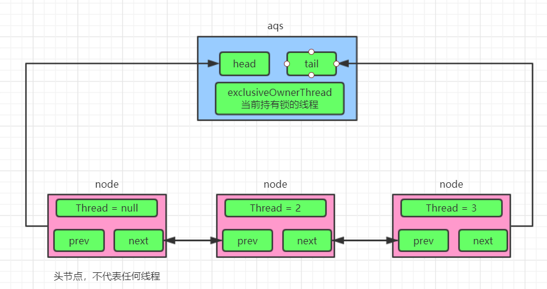

> 时势造英雄：聪明和勤奋是成功的前置条件，世上聪明和勤奋的人多的去了，真正重要的是顺势而为！

# 背景

网上一大票文章都在说Java中的`synchronized`锁是重量级锁，因为使用了系统调用，会从用户态陷入内核态，开销很大， 性能影响大，而`ReentrantLock`使用的是`CAS`轻量级操作，性能开销小，虽然JDK1.6后对`synchronized`进行了锁升级的优化，但是还是避免不了人们`synchronized`性能比不上`ReentrantLock`的刻板映像！

究其原因就是`synchronized`很重！有系统调用，会从用户态陷入内核态，那`ReentrantLock`有没有系统调用呢？那么本文就从系统调用的角度分析一下两者

长文预警！！！

# 前置知识

## ReentrantLock原理

一图胜前言，`ReentrantLock`从大局上看原理如下（注意`ReentrantLock`继承自`AbstractQueuedSynchronizer`）



1. 一个数字`state`表示资源，一个线程尝试CAS地去+1，操作成功即上锁，那么可以欢快的执行锁内的代码
2. 另一个哥们(线程)也来尝试CAS地+1，不好意思锁别人占着，你乖乖排队去（双向的CLH队列）阻塞，后面的线程来抢锁，抢不到都排队去就完事
3. 第一个线程执行完释放锁资源，此时只有它自己在执行，欢快的将`state`置0（不用CAS），然后叫醒排在它后面的哥们（即队列中第二个节点）执行。

大体逻辑如上，其中涉及到很多对共享变量CAS自旋的细节操作，比如CAS入队、CAS操作`state`，不是文本重点，此处不细表

## synchronized原理

`synchronized`由于是JDK自带的锁，是JVM层面去实现的（因为JDK1.6后`synchronized`有锁升级的过程，此处只分析`synchronized`重量级锁），具体是用`ObjectMonitor`来实现，开局一张原理图


`ObjectMonitor`主要数据结构如下

```c++
 ObjectMonitor() {
    _count        = 0;   // 记录个数
    ...
    _owner        = NULL;//持有锁线程
    _WaitSet      = NULL;// 处于wait状态的线程，会被加入到_WaitSet
    ...
    _EntryList    = NULL;// 处于等待锁block状态的线程，会被加入到该列表
  }
```

1. 想要获取monitor（即锁）的线程，首先会进入`_EntryList`队列。
2. 当某个线程获取到对象的monitor后，进入`_Owner`区域，设置为当前线程，同时计数器`_count+1`
3. 如果线程调用了`Object#wait()`方法，则会进入`_WaitSet`队列。它会释放monitor锁，即将`_owner`赋值为null，并且`_count-1`，进入`_WaitSet`队列阻塞等待。
4. 如果其他线程调用 `Object#notify() / notifyAll()` ，会唤醒`_WaitSet`中的某个线程，该线程再次尝试获取monitor锁，成功即进入`_Owner`区域。
4. 同步方法执行完毕了，线程退出临界区，会将monitor的`_owner`设为null，并释放监视锁。

## 系统调用

> 在[电脑](https://zh.wikipedia.org/wiki/電腦)中，**系统调用**（英语：system call），指运行在[用户空间](https://zh.wikipedia.org/wiki/使用者空間)的[程序](https://zh.wikipedia.org/wiki/程序)向[操作系统](https://zh.wikipedia.org/wiki/操作系統)[内核](https://zh.wikipedia.org/wiki/内核)请求需要更高权限运行的服务。系统调用提供用户程序与[操作系统](https://zh.wikipedia.org/wiki/操作系統)之间的接口。大多数系统交互式操作需求在内核态运行。如设备IO操作或者进程间通信。

说人话就是操作系统像一个黑盒子，运行在计算机硬件之上，你自己写的软件需要调用硬件的某些功能比如从磁盘打开一部电影，你的软件没法和硬盘直接交互的，必须告诉这个黑盒子，让黑盒子去硬盘里面去取，为啥要这样设计？

- **安全性与稳定性**：操作系统的东西你一个应用层软件不能乱碰，碰坏了宕机谁负责？这个能靠应用层软件自觉遵守？那肯定不行，否则就没有那么多病毒程序了，因此操作系统干脆直接不让你碰，只开放了安全的接口（**系统调用**）提供给你调用。
- **屏蔽硬件的复杂性**：硬件千奇百怪，各种型号，需要各种匹配的驱动才能运行，一个应用层软件想从硬盘读取数据，如果没有操作系统这个黑盒子给你提供便利（**系统调用**），那你要从硬盘驱动开始写？等你写好了塑料花儿都谢了。

所以，系统调用开销是很大的，因此在程序中尽量减少系统调用的次数，并且让每次系统调用完成尽可能多的工作，例如每次读写大量的数据而不是每次仅读写一个字符。

那么Linux有哪些系统调用？这里可以查(系统调用表)：http://blog.rchapman.org/posts/Linux_System_Call_Table_for_x86_64

# 从系统调用的角度分析


就一个锁而言，那么关键的东西我认为是**如何上锁**以及如何让线程**阻塞**以及**唤醒线程**，那么就从这三个方面分析

## ReentrantLock

### 如何上锁

所谓上锁在`ReentrantLock`就是给`state`变量+1，`state`声明如下，注意是`volatile`的，也就是在多线程环境下对每个线程都是可见的

```java
private volatile int state;
```

那么很多线程都在抢这把锁，只有一个线程能抢到（即能执行`state+1`成功），怎么保证线程安全？答案是CAS，CAS是啥？简单来说就是Compare And Swap，即**比较并替换**：给一个预期值E和一个更新值U，如果当前值A和预期值E相等，则更新A为U。感觉是不是有点像乐观锁？

```java
int c = getState();//c是state
if (c == 0) {//锁还没被别人抢
        if (compareAndSetState(0, acquires)) {//重点是这句，CAS方式设置state
        setExclusiveOwnerThread(current);
        return true;
	}
}
```

继续跟下去，调用了unsafe的`compareAndSwapInt`，在往下就是native方法了

```java
protected final boolean compareAndSetState(int expect, int update) {
    // See below for intrinsics setup to support this
    return unsafe.compareAndSwapInt(this, stateOffset, expect, update);
}
 
/**
* 源码在http://hg.openjdk.java.net/jdk8/jdk8/jdk/file/687fd7c7986d/src/share/classes/sun/misc/Unsafe.java
* Unsafe.compareAndSwapInt
* Atomically update Java variable to x if it is currently
* holding expected
* @return true if successful
*/
public final native boolean compareAndSwapInt(Object o, long offset,
                                              int expected,
                                              int x);
```

继续跟踪在JVM中的实现，源码位置：http://hg.openjdk.java.net/jdk8/jdk8/hotspot/file/tip/src/share/vm/prims/unsafe.cpp

```c++
UNSAFE_ENTRY(jboolean, Unsafe_CompareAndSwapInt(JNIEnv *env, jobject unsafe, jobject obj, jlong offset, jint e, jint x))
  UnsafeWrapper("Unsafe_CompareAndSwapInt");
  oop p = JNIHandles::resolve(obj);
  jint* addr = (jint *) index_oop_from_field_offset_long(p, offset);
  return (jint)(Atomic::cmpxchg(x, addr, e)) == e;//此处调用了Atomic::cmpxchg
UNSAFE_END
```

里面又调用了`Atomic::cmpxchg`，源码位置：http://hg.openjdk.java.net/jdk8/jdk8/hotspot/file/87ee5ee27509/src/os_cpu/linux_x86/vm/atomic_linux_x86.inline.hpp

```c++
inline jint     Atomic::cmpxchg    (jint     exchange_value, volatile jint*     dest, jint     compare_value) {
  int mp = os::is_MP();
  __asm__ volatile (LOCK_IF_MP(%4) "cmpxchgl %1,(%3)"
                    : "=a" (exchange_value)
                    : "r" (exchange_value), "a" (compare_value), "r" (dest), "r" (mp)
                    : "cc", "memory");
  return exchange_value;
}
```

- `__asm__`表示是汇编指令
- `LOCK_IF_MP`，是否是多核处理器，如果是加上`lock`指令
- `lock` 和`cmpxchgl`是CPU指令，`lock`指令是个前缀，可以修饰其他指令，`cmpxchgl`即为CAS指令

这个`lock`才是主角，它才是实现CAS的原子性的关键（因为现在基本都是多核处理器了，那么肯定会存在多个核心争抢资源的情况），在**Intel® 64 and IA-32 Architectures Software Developer’s Manual** 中的章节**LOCK—Assert LOCK# Signal Prefix** 中给出LOCK指令的详细解释


- 总线锁

LOCK#信号就是我们经常说到的**总线锁**，处理器使用**LOCK#**信号达到锁定总线，来解决原子性问题，当一个处理器往总线上输出LOCK#信号时，其它处理器的请求将被阻塞，此时该处理器此时独占共享内存；总线锁这种做法锁定的范围太大了，导致CPU利用率急剧下降，因为使用LOCK#是把CPU和内存之间的通信锁住了，这使得锁定时期间，其它处理器不能操作其内存地址的数据 ，所以总线锁的**开销比较大**。

- 缓存锁

如果访问的内存区域已经缓存在处理器的缓存行中，P6系统和之后系列的处理器则不会声明LOCK#信号，它会对CPU的缓存中的缓存行进行锁定，在锁定期间，其它 CPU 不能同时缓存此数据，在修改之后，通过缓存一致性协议（在Intel CPU中，则体现为MESI协议）来保证修改的原子性，这个操作被称为**缓存锁**

`lock`指令会产生总线锁也可能会产生缓存锁，看具体的条件，有下面几种情况只能使用总线锁

- 当操作的数据不能被缓存在处理器内部，这个必须得使用总线锁了
- 操作的数据跨多个缓存行（`cache line`），缓存锁的前置条件是多个数据在一个缓存行里面
- 有些处理器不支持缓存锁定。对于Intel 486和奔腾处理器，就算锁定的内存区域在处理器的缓存行中也会调用总线锁定。

无论是总线锁还是缓存锁这都是CPU在硬件层面上提供的锁，肯定效率比软件层面的锁要高

再来总结一下`ReentrantLock`如何上锁？

```
compareAndSetState -> Unsafe.compareAndSwapInt -> JNI(JVM) -> Atomic::cmpxchg -> lock cmpxchg(CPU指令)
```

绕了一大圈，上锁过程使用了系统调用吗？答案是没有（**会在文末证明**），在系统调用表里面都搜不到，总体说来上锁过程还算是非常高效的！

### 如何阻塞

线程抢不到锁会进入队列阻塞，那么到底是什么阻塞的？下面一步一步来看

首先是调用了`LockSupport.park()`，`park`直译为停车，线程停车即阻塞，线程就阻塞在这里一动不动了，不会网下执行， `LockSupport.park`调用了`Unsafe.park`，这又是一个native方法

```java
private final boolean parkAndCheckInterrupt() {
    LockSupport.park(this);//阻塞
    return Thread.interrupted();
}


/**
 * 源码在http://hg.openjdk.java.net/jdk8/jdk8/jdk/file/687fd7c7986d/src/share/classes/sun/misc/Unsafe.java
 * Block current thread, returning when a balancing
 * <tt>unpark</tt> occurs, or a balancing <tt>unpark</tt> has
 * already occurred, or the thread is interrupted, or, if not
 * absolute and time is not zero, the given time nanoseconds have
 * elapsed, or if absolute, the given deadline in milliseconds
 * since Epoch has passed, or spuriously (i.e., returning for no
 * "reason"). Note: This operation is in the Unsafe class only
 * because <tt>unpark</tt> is, so it would be strange to place it
 * elsewhere.
 */
public native void park(boolean isAbsolute, long time);

```

看JVM中`Unsafe.park`的实现，源码在http://hg.openjdk.java.net/jdk8/jdk8/hotspot/file/tip/src/share/vm/prims/unsafe.cpp

```c++
UNSAFE_ENTRY(void, Unsafe_Park(JNIEnv *env, jobject unsafe, jboolean isAbsolute, jlong time))
  ...省略
  thread->parker()->park(isAbsolute != 0, time);
  ...省略
UNSAFE_END

```

调用了`parker()->park()`，即`Parker::park`，看一下`Parker`的定义，源码在http://hg.openjdk.java.net/jdk7/jdk7/hotspot/file/81d815b05abb/src/share/vm/runtime/park.hpp

```c++
class Parker : public os::PlatformParker {
    public:
      // For simplicity of interface with Java, all forms of park (indefinite,
      // relative, and absolute) are multiplexed into one call.
      void park(bool isAbsolute, jlong time);
      void unpark();
}
```

继承自`PlatformParker`，而`PlatformParker`是与平台相关的实现，屏蔽了平台的区别，park具体的实现和平台相关，下面是Linux中的实现，windows的实现可以参考`hotspot\src\os\windows\vm\os_windows.cpp`

```c++
void Parker::park(bool isAbsolute, jlong time) {
    //  如果别的线程已经unblock了我.  
    //  这里并没有拿到mutex的锁, 需要Atomic::xchg和barrier保证lock-free代码的正确。
    // We depend on Atomic::xchg() having full barrier semantics
    // since we are doing a lock-free update to _counter.
    // 通过原子操作来提升性能，可以跳过 mutex 加锁
    if (Atomic::xchg(0, &_counter) > 0) return;
    // safepoint region相关
    ThreadBlockInVM tbivm(jt);
    // 如果别的线程正在unblock我, 而持有了mutex, 我先返回了,没有必要在_mutex上等
    if (Thread::is_interrupted(thread, false) || pthread_mutex_trylock(_mutex) != 0) {
        return;
    }
    // 如果别的线程已经unblock了我, no wait needed
    // 已经拿到了mutex, 检查 _counter 大于 0 说明其他线程执行过 unpark，这里就可以跳过等待过程
    int status;
    if (_counter > 0)  {
        _counter = 0;
        status = pthread_mutex_unlock(_mutex);
        OrderAccess::fence();
        return;
    }
    // 记录线程的状态
    OSThreadWaitState osts(thread->osthread(), false /* not Object.wait() */);
    jt->set_suspend_equivalent();
    // cleared by handle_special_suspend_equivalent_condition() or java_suspend_self()
    if (time == 0) {
        _cur_index = REL_INDEX; // arbitrary choice when not timed
        // 进入等待并自动释放 mutex 锁，这里没有通过 while 包裹 wait 过程，所以会出现伪唤醒问题
        status = pthread_cond_wait(&_cond[_cur_index], _mutex);
    } else {
        _cur_index = isAbsolute ? ABS_INDEX : REL_INDEX;
        // 进入等待并自动释放 mutex 锁，这里没有通过 while 包裹 wait 过程，所以会出现伪唤醒问题
        status = pthread_cond_timedwait(&_cond[_cur_index], _mutex, &absTime);
    }
    _cur_index = -1;
    // 已经从block住状态中恢复返回了, 把_counter设0.
    _counter = 0;
    status = pthread_mutex_unlock(_mutex);
    // 要保证多线程的正确性要十二分小心
    // 这里的memory fence 是一个lock addl 指令, 加上compiler_barrier
    // 保证_counter = 0 是对其他线程是可见的.
    // Paranoia to ensure our locked and lock-free paths interact
    // correctly with each other and Java-level accesses.
    OrderAccess::fence();
    // 已经醒过来, 但如果有别人在suspend我,那么继续suspend自己.
    // If externally suspended while waiting, re-suspend
    if (jt->handle_special_suspend_equivalent_condition()) {
        jt->java_suspend_self();
    }
}
```

其实`park`方法内部也用了CAS！重点关注一下此调用：`pthread_cond_wait`，就是调用此函数让线程阻塞的，这是POSIX线程(pthread)函数库中一个函数，感兴趣的可以看下它的源码：https://code.woboq.org/userspace/glibc/nptl/pthread_cond_wait.c.html

`pthread_cond_wait`内部调用了`futex`，而`futex`里面进行了系统调用`sys_futex`！那么`futex`是啥？参考下`man 2 futex`

> 在Linux中，为了挂起线程，使用 **futex**，futex 即 **Fast user space mutex**
>
> futex 通过用户态和内核配合，可以减小开销，并且线程灵活可控是否要进入睡眠等待还是spin等待。
>
> ### futex 构成
>
> futex 由一个32bit的futex word和一个系统调用sys_futex组成，futex word是进行互斥的变量，sys_futex 是通知内核对线程进行挂起和唤醒。
>
> ### futex的使用模式
>
> 1. 用户线程 通过 CAS 类原子指令尝试获取锁，如果成功，则获取锁成功。这种情况下无需调用系统调用，不需要进入内核。开销很小。
> 2. 如果CAS失败，可以选择spin重试，也可以选择挂起自己等待唤醒。这里即调用系统调用，让内核操作挂起，为了保证锁原语，调用者将futex word的当前状态（锁定状态）作为参数传入内核，内核进行检查如果与futex word的当前一致，则挂起线程。否则返回失败。
> 3. 为了唤醒等待线程，获取锁的线程在释放锁后，需要调用系统调用，来通知锁释放，内核会唤醒等待者进行竞争锁。

介绍说明`futex`不一定会进行系统调用，但是调用`LockSupport.park()`的时候线程确实阻塞了，没有在自旋（spin重试），因为自旋会消耗很多CPU资源，但是阻塞不会消耗，文末会证明`LockSupport.park()`确实进行了系统调用。

总结：

```
LockSupport.park -> Unsafe.park -> JNI(JVM) -> Parker::park -> pthread_cond_wait -> futex -> sys_futex(系统调用)
```


### 如何唤醒

`ReentrantLock`中调用了`LockSupport.unpark`，同样unpark也是一个native实现

```java
Node s = node.next;
...
if (s != null)
	LockSupport.unpark(s.thread);//叫醒后面一个


/**
 * 源码在：http://hg.openjdk.java.net/jdk8/jdk8/jdk/file/687fd7c7986d/src/share/classes/sun/misc/Unsafe.java
 * Unblock the given thread blocked on <tt>park</tt>, or, if it is
 * not blocked, cause the subsequent call to <tt>park</tt> not to
 * block.  Note: this operation is "unsafe" solely because the
 * caller must somehow ensure that the thread has not been
 * destroyed. Nothing special is usually required to ensure this
 * when called from Java (in which there will ordinarily be a live
 * reference to the thread) but this is not nearly-automatically
 * so when calling from native code.
 * @param thread the thread to unpark.
 *
 */
public native void unpark(Object thread);
```

JVM中unpark的实现，调用了`Parker::unpark`

```c++

UNSAFE_ENTRY(void, Unsafe_Unpark(JNIEnv *env, jobject unsafe, jobject jthread))
  UnsafeWrapper("Unsafe_Unpark");
  Parker* p = NULL;
  if (jthread != NULL) {
     ...初始化p
  }
  if (p != NULL) {
      ...省略
    p->unpark();
  }
UNSAFE_END
```

`Parker::unpark`的实现

```c++
void Parker::unpark() {
    int s, status ;
    // 其实 unpark 这里也可以先通过一个 cas 判断是否 _counter 已经大于0，如果是就可以跳过 mutex 加锁过程，效率更高，稍后你会发现 ParkEvent 就是类似的做法
    status = pthread_mutex_lock(_mutex);
    assert (status == 0, "invariant") ;
    s = _counter;
    _counter = 1;
    if (s < 1) {
        // thread might be parked
        if (_cur_index != -1) {
            // thread is definitely parked
            if (WorkAroundNPTLTimedWaitHang) {
                status = pthread_cond_signal (&_cond[_cur_index]);
                assert (status == 0, "invariant");
                status = pthread_mutex_unlock(_mutex);
                assert (status == 0, "invariant");
            } else {
            // must capture correct index before unlocking
                int index = _cur_index;
                status = pthread_mutex_unlock(_mutex);
                assert (status == 0, "invariant");
                status = pthread_cond_signal (&_cond[index]);
                assert (status == 0, "invariant");
            }
        } else {
            pthread_mutex_unlock(_mutex);
            assert (status == 0, "invariant") ;
        }
    } else {
        pthread_mutex_unlock(_mutex);
        assert (status == 0, "invariant") ;
    }
}
```

调用了`pthread_cond_signal`，`pthread_cond_signal`和`pthread_cond_wait`是一对，都调用了系统调用`sys_futex`，不过传参不一样而已，看看`sys_futex`的定义

```c
int futex(int *uaddr, int op, int val, const struct timespec *timeout,
          int *uaddr2, int val3);
```

第二个参数op即`operation`有下面可选，参考：https://linux.die.net/man/2/futex

`pthread_cond_wait`传参为`FUTEX_WAIT`，而`pthread_cond_signal`传参为`FUTEX_WAKE`

```
FUTEX_WAIT
FUTEX_WAKE
FUTEX_FD (present up to and including Linux 2.6.25)
FUTEX_REQUEUE (since Linux 2.5.70)
FUTEX_CMP_REQUEUE (since Linux 2.6.7)
```

相应的，文末也会给出证明

总结

```
LockSupport.unpark -> Unsafe.unpark -> JNI(JVM) -> Parker::unpark -> pthread_cond_signal -> futex -> sys_futex(系统调用)
```


## synchronized

从系统底层啃完了`ReentrantLock`这块骨头，`synchronized`就简单多了，无非`CAS`、队列、`futex`几大法宝，此处的`synchronized`我们只分析重量级锁

### 前置知识

java中每个对象都有个markword，里面包含了锁信息，当为重量级锁的时候markword的一部分会指向一个`ObjectMonitor`的数据结构，这个`ObjectMonitor`就是JVM用来实现重量级锁的，图示如下


`ObjectMonitor`结构如下

```c++
ObjectMonitor::ObjectMonitor() {  
  _header       = NULL;  
  _count       = 0;  
  _waiters      = 0,  
  _recursions   = 0;       //线程的重入次数
  _object       = NULL;  
  _owner        = NULL;    //标识拥有该monitor的线程
  _WaitSet      = NULL;    //等待线程组成的双向循环链表，_WaitSet是第一个节点
  _WaitSetLock  = 0 ;  
  _Responsible  = NULL ;  
  _succ         = NULL ;  
  _cxq          = NULL ;    //多线程竞争锁进入时的单向链表
  FreeNext      = NULL ;  
  _EntryList    = NULL ;    //_owner从该双向循环链表中唤醒线程结点，_EntryList是第一个节点
  _SpinFreq     = 0 ;  
  _SpinClock    = 0 ;  
  OwnerIsThread = 0 ;  
} 
```

由于`synchronized`是JVM来实现的，所以下面代码都是`c/c++`的

### 如何上锁

由于我们省略了锁升级的过程，直接看重量级锁的进入，代码在https://github.com/JetBrains/jdk8u_hotspot/blob/master/src/share/vm/runtime/objectMonitor.cpp

注意看源码的方法，看源码顺着一条线索去看，比如如何上锁，不要在乎细节，因为看了也看不懂(笑)，反而导致丧失了继续看下去的耐心，当以后能力提升了再来看这些细节

```c++
void ATTR ObjectMonitor::enter(TRAPS) {
  /*
  *省略部分代码
  */
    for (;;) {
      EnterI (THREAD) ;
      /**
      *省略了部分代码
      **/
  }
}
```

直接来看`EnterI`

```c++
void ATTR ObjectMonitor::EnterI (TRAPS) {
    Thread * Self = THREAD ;
    if (TryLock (Self) > 0) {
        //这下不自旋了，我就默默的TryLock一下
        return ;
    }
 
    DeferredInitialize () ;
    //此处又有自旋获取锁的操作
    if (TrySpin (Self) > 0) {
        return ;
    }
    /**
    *到此，自旋终于全失败了，要入队挂起了
    **/
    ObjectWaiter node(Self) ; //将Thread封装成ObjectWaiter结点
    Self->_ParkEvent->reset() ;
    node._prev   = (ObjectWaiter *) 0xBAD ; 
    node.TState  = ObjectWaiter::TS_CXQ ; 
    ObjectWaiter * nxt ;
    for (;;) { //循环，保证将node插入队列
        node._next = nxt = _cxq ;//将node插入到_cxq队列的首部
        //CAS修改_cxq指向node
        if (Atomic::cmpxchg_ptr (&node, &_cxq, nxt) == nxt) break ;
        if (TryLock (Self) > 0) {//我再默默的TryLock一下，真的是不想挂起呀！
            return ;
        }
    }
    if ((SyncFlags & 16) == 0 && nxt == NULL && _EntryList == NULL) {
        // Try to assume the role of responsible thread for the monitor.
        // CONSIDER:  ST vs CAS vs { if (Responsible==null) Responsible=Self }
        Atomic::cmpxchg_ptr (Self, &_Responsible, NULL) ;
    }
    TEVENT (Inflated enter - Contention) ;
    int nWakeups = 0 ;
    int RecheckInterval = 1 ;
 
    for (;;) {
        if (TryLock (Self) > 0) break ;//临死之前，我再TryLock下
 
        if ((SyncFlags & 2) && _Responsible == NULL) {
           Atomic::cmpxchg_ptr (Self, &_Responsible, NULL) ;
        }
        if (_Responsible == Self || (SyncFlags & 1)) {
            TEVENT (Inflated enter - park TIMED) ;
            Self->_ParkEvent->park ((jlong) RecheckInterval) ;
            RecheckInterval *= 8 ;
            if (RecheckInterval > 1000) RecheckInterval = 1000 ;
        } else {
            TEVENT (Inflated enter - park UNTIMED) ;
            Self->_ParkEvent->park() ; //终于挂起了
        }
 
        if (TryLock(Self) > 0) break ;
        /**
        *后面代码省略
        **/
}
```

看`TryLock`

```c++

int ObjectMonitor::TryLock (Thread * Self) {
   for (;;) {
      void * own = _owner ;
      if (own != NULL) return 0 ;//如果有线程还拥有着重量级锁，退出
      //CAS操作将_owner修改为当前线程，操作成功return>0
      if (Atomic::cmpxchg_ptr (Self, &_owner, NULL) == NULL) {
         return 1 ;
      }
      //CAS更新失败return<0
      if (true) return -1 ;
   }
}
```

看`Atomic::cmpxchg_ptr`，看这名像啥？这不就是CAS么，所以又来到了熟悉的`Atomic::cmpxchg`，不明白的可以看上面`ReentrantLock`如何上锁

```c++
inline intptr_t Atomic::cmpxchg_ptr(intptr_t exchange_value, volatile intptr_t* dest, intptr_t compare_value) {
  return (intptr_t)cmpxchg((jlong)exchange_value, (volatile jlong*)dest, (jlong)compare_value);
}

inline jint     Atomic::cmpxchg    (jint     exchange_value, volatile jint*     dest, jint     compare_value) {
  int mp = os::is_MP();
  __asm__ volatile (LOCK_IF_MP(%4) "cmpxchgl %1,(%3)"
                    : "=a" (exchange_value)
                    : "r" (exchange_value), "a" (compare_value), "r" (dest), "r" (mp)
                    : "cc", "memory");
  return exchange_value;
}
```

总结：

所谓上锁就是给`ObjectMonitor._owner`设置为指向获得锁的线程

### 如何阻塞

看上面的`ObjectMonitor::EnterI`方法，获取不到锁的时候调用了`ParkEvent::park()`方法，看到这是不是想到`Parker::park()`？那么到底有啥区别，看一下ParkEvent的定义，源码在https://github.com/JetBrains/jdk8u_hotspot/blob/master/src/share/vm/runtime/park.hpp

```c++

class ParkEvent : public os::PlatformEvent {
  public:
    // MCS-CLH list linkage and Native Mutex/Monitor
    ParkEvent * volatile ListNext ;
    ParkEvent * volatile ListPrev ;
    volatile intptr_t OnList ;
    volatile int TState ;
    volatile int Notified ;             // for native monitor construct
    volatile int IsWaiting ;            // Enqueued on WaitSet
  public:
    static ParkEvent * Allocate (Thread * t) ;
    static void Release (ParkEvent * e) ;
} ;
```

发现没有park方法，因为`ParkEvent`继承自`PlatformEvent`，所以去父类找

```c++
int os::PlatformEvent::park(jlong millis) {
  ...
  while (_Event < 0) {  // 当令牌不足时，会循环进入等待状态
    status = os::Linux::safe_cond_timedwait(_cond, _mutex, &abst);
  ... 
}
```

继续看`os::Linux::safe_cond_timedwait`

```c++
int os::Linux::safe_cond_timedwait(pthread_cond_t *_cond, pthread_mutex_t *_mutex, const struct timespec *_abstime)
{
   if (is_NPTL()) {
      return pthread_cond_timedwait(_cond, _mutex, _abstime);
   } else {
      // 6292965: LinuxThreads pthread_cond_timedwait() resets FPU control
      // word back to default 64bit precision if condvar is signaled. Java
      // wants 53bit precision.  Save and restore current value.
      int fpu = get_fpu_control_word();
      int status = pthread_cond_timedwait(_cond, _mutex, _abstime);
      set_fpu_control_word(fpu);
      return status;
   }
}
```

看到没有，调用了`pthread_cond_timedwait`，`pthread_cond_timedwait`和`pthread_cond_wait`的区别一个是有超时设置，一个没有

总结：

```
ObjectMonitor::enter -> os::PlatformEvent::park -> pthread_cond_timedwait -> futex -> sys_futex(系统调用)
```


### 如何唤醒

首先释放重量级锁

```c++
void ATTR ObjectMonitor::exit(TRAPS) {
   Thread * Self = THREAD ;
   //省略很多代码
   //省略很多代码
  ...  
      w = _EntryList  ;
      if (w != NULL) {
          ExitEpilog (Self, w) ; //从_EntryList中唤醒线程
          return ;
      }
   }
}
```

看`ExitEpilog`

```c++
void ObjectMonitor::ExitEpilog (Thread * Self, ObjectWaiter * Wakee) {
   _succ = Knob_SuccEnabled ? Wakee->_thread : NULL ;
   ParkEvent * Trigger = Wakee->_event ;
   ...
   Trigger->unpark() ; //唤醒线程
   ... 
}
```

继续看`ParkEvent::unpark()`，找不到这个方法，找父类`os::PlatformEvent::unpark`

```c++
void os::PlatformEvent::unpark() {
  ...
  if (AnyWaiters != 0 && WorkAroundNPTLTimedWaitHang) {
    AnyWaiters = 0;
    pthread_cond_signal(_cond);
  }
  ...  
}
```

`pthread_cond_signal`这啥？上文已经分析过了

总结

```
ObjectMonitor::exit -> os::PlatformEvent::unpark -> pthread_cond_signal -> futex -> sys_futex(系统调用)
```


## 总结

经过上面的分析，有没有感觉`ReentrantLock`和`synchronized`本质上就是一个东西？不过一个是在Java层面实现的，一个是JVM层面实现的，但在具体用法上又有些不同，比如

- `ReentrantLock`用`LockSupport.park`阻塞和`LockSupport.unpark`唤醒
- `synchronized`用`Object.wait`阻塞和`Object.notify/notifyAll`唤醒
- `ReentrantLock`支持更多自定义条件队列，将不同的线程分组放到不同的队列，这样可以更好的控制线程
- `synchronized`队列是在JVM层面实现的，无法自定义

相同

- 上锁都用CAS操作
- 底层都用了相同的系统调用，不能单纯的说`synchronized`就比`ReentrantLock`更重，`ReentrantLock`就比`synchronized`更轻

不能简单的比较孰优孰劣，视场景而定，它们都有自己的用途。


# 证明

到了最后的证明环节，这里需要先了解一下在Linux中追踪系统调用的命令`strace`，测试环境为`CentOS 7`，没有该命令先安装

```bash
yum install -y strace
```

安装java环境，已安装则忽略

```bash
# 安装java
yum -y install java-1.8.0-openjdk java-1.8.0-openjdk-devel which

# 环境变量设置
cat > /etc/profile.d/java8.sh <<EOF
export JAVA_HOME=$(dirname $(dirname $(readlink $(readlink $(which javac)))))
export PATH=\$PATH:\$JAVA_HOME/bin
export CLASSPATH=.:\$JAVA_HOME/jre/lib:\$JAVA_HOME/lib:\$JAVA_HOME/lib/tools.jar
EOF
source /etc/profile.d/java8.sh
```


## 证明CAS没有系统调用

### 程序准备

随便找个目录，新建测试程序`CASTest.java`，并编译`javac CASTest.java`

程序很简单，就是一直循环CAS，注意不要调用`Thread.sleep()`，因为该方法会产生系统调用，影响我们观察结果

```java
import sun.misc.Unsafe;

import java.lang.reflect.Field;

/**
 * 证明cas操作没有调用系统调用
 * strace -ff -o out java CASTest
 * 然后观察输出
 */
public class CASTest {

    int i = 0;

    public static CASTest t = new CASTest();

    public static void main(String[] args) throws Exception {
        Unsafe unsafe = getUnsafe();

        Field f = CASTest.class.getDeclaredField("i");
        long offset = unsafe.objectFieldOffset(f);


        //CAS一定会失败
        while (!unsafe.compareAndSwapInt(t, offset, 1, 1)){
            System.out.println(System.currentTimeMillis() + " failed-------------------------");
        }
    }


    /**
     * 获取unsafe
     * @return
     * @throws IllegalAccessException
     */
    public static Unsafe getUnsafe() throws IllegalAccessException {
        //Unsafe unsafe = Unsafe.getUnsafe();

        /**
         * 为什么不直接通过Unsafe unsafe = Unsafe.getUnsafe();拿到unsafe实例 ?
         * 因为直接拿要抛异常，不信你可以试试看，原因在于直接拿Unsafe会检查当前类加载器是不是Bootstrap加载器
         * 如果不是就抛异常，当前类加载器是AppClassLoader，当然不是Bootstrap ClassLoader，
         * 也就是说，Unsafe只允许JVM的某些系统来拿，但是你非要用，也可以自己通过下面的骚操作拿
         * 参考：https://blog.csdn.net/a7980718/article/details/83279728
         */
        Field unsafeField = Unsafe.class.getDeclaredFields()[0];
        unsafeField.setAccessible(true);
        Unsafe unsafe = (Unsafe) unsafeField.get(null);
        return unsafe;
    }
}

```

### 追踪系统调用

-o 表示输出到当前文件夹的out文件中，后面的`java CASTest`表示运行该程序

```bash
strace -ff -o out java CASTest
```

此时程序疯狂输出，快速打开另外一个shell窗口，在该目录下查看文件`ls -lh`

```
-rw-r--r-- 1 root root 1.6K 2月  28 13:53 CASTest.class
-rw-r--r-- 1 root root 1.6K 2月  28 13:50 CASTest.java
-rw-r--r-- 1 root root  14K 2月  28 13:53 out.5278
-rw-r--r-- 1 root root 3.6M 2月  28 13:53 out.5279
-rw-r--r-- 1 root root  13K 2月  28 13:53 out.5280
...
```

发现一堆out.*，因为java本来就是多线程程序，JVM一启动就会产生很多线程，每一个out文件都是一个线程的系统调用输出，此处要找到主线程，最大的那个out.5279就是主线程，因为它最大而且一直在变大，看一眼内容，全是write...，这正是我们程序中输出的字符串，看一眼时间戳，和程序里面的是不是一样？这也能佐证这就是主线程的输出！

```
write(1, "\n", 1)                       = 1
write(1, "1614491601624 failed------------"..., 45) = 45
write(1, "\n", 1)                       = 1
write(1, "1614491601624 failed------------"..., 45) = 45
write(1, "\n", 1)                       = 1
write(1, "1614491601625 failed------------"..., 45) = 45
write(1, "\n", 1)                       = 1
write(1, "1614491601625 failed------------"..., 45) = 45
write(1, "\n", 1)                       = 1

```

`write`就是系统调用，但是这不是CAS产生的！而是`System.out.println`这句话产生的，所以证明了CAS本身并没有任何系统调用！

## 证明pthread_cond_wait和pthread_cond_signal有系统调用

### 程序准备

和上面证明CAS一样，先准备程序`LockSupportTest.java`，代码很简单，就是两个线程不停地去park然后unpark对方。

```java
import java.io.IOException;
import java.util.concurrent.locks.LockSupport;

/**
 * 证明park和unpark都调用了系统调用sys_futex
 * strace -ff -o out java LockSupportTest
 * 然后观察输出
 */
public class LockSupportTest {


    static Thread t1 = null,t2 = null;
    public static void main(String[] args) throws IOException, InterruptedException {


        t1 = new Thread(()->{
            while(true){
                String name = Thread.currentThread().getName();
                System.out.println(System.currentTimeMillis()+ " "+name+" prepare park!");
                //底层调用glibc函数库pthread_cond_wait
                LockSupport.park();
                //底层调用glibc函数库pthread_cond_signal
                LockSupport.unpark(t2);
            }
        },"thread 1");

        t2 = new Thread(()->{
            while(true){
                String name = Thread.currentThread().getName();
                System.out.println(System.currentTimeMillis()+ " "+name+" prepare park!");
                //底层调用glibc函数库pthread_cond_signal
                LockSupport.unpark(t1);
                //底层调用glibc函数库pthread_cond_wait
                LockSupport.park();
            }
        },"thread 2");

        t1.start();
        //此处睡确保线程1先启动
        Thread.sleep(10);
        t2.start();

        //阻塞主线程不退出
        System.in.read();

    }


}

```

### 追踪系统调用

```bash
strace -ff -o out java LockSupportTest
```

此时新开shell窗口看文件输出

```
-rw-r--r-- 1 root root 2.2K 2月  28 16:16 LockSupportTest.class
-rw-r--r-- 1 root root 1.1K 2月  28 16:16 LockSupportTest.java
-rw-r--r-- 1 root root  15K 2月  28 16:16 out.6398
-rw-r--r-- 1 root root 223K 2月  28 16:16 out.6399
-rw-r--r-- 1 root root  15K 2月  28 16:16 out.6400
-rw-r--r-- 1 root root 1.5K 2月  28 16:16 out.6401
-rw-r--r-- 1 root root 1.3K 2月  28 16:16 out.6402
-rw-r--r-- 1 root root 2.3K 2月  28 16:16 out.6403
-rw-r--r-- 1 root root  31K 2月  28 16:16 out.6404
-rw-r--r-- 1 root root  30K 2月  28 16:16 out.6405
-rw-r--r-- 1 root root 1.1K 2月  28 16:16 out.6406
-rw-r--r-- 1 root root  90K 2月  28 16:16 out.6407
-rw-r--r-- 1 root root 5.0M 2月  28 16:16 out.6408
-rw-r--r-- 1 root root 5.4M 2月  28 16:16 out.6409
-rw-r--r-- 1 root root 2.1K 2月  28 16:16 out.6416

```

这次我们不找主线程，找线程1和线程2，发现out.6409和out.6416在疯狂的变大，说明这是线程1或线程2的输出，打开out.6409看一眼

```
futex(0x7fdee81c0354, FUTEX_WAIT_BITSET_PRIVATE, 303, {tv_sec=9170827, tv_nsec=944125191}, 0xffffffff) = 0
futex(0x7fdee81c0328, FUTEX_WAKE_PRIVATE, 1) = 0
write(1, "1614501167372 thread 2 prepare p"..., 36) = 36
write(1, "\n", 1)                       = 1
futex(0x7fdee81bef54, FUTEX_WAKE_OP_PRIVATE, 1, 1, 0x7fdee81bef50, FUTEX_OP_SET<<28|0<<12|FUTEX_OP_CMP_GT<<24|0x1) = 1
futex(0x7fdee81c0c04, FUTEX_WAIT_PRIVATE, 541, NULL) = ?
+++ exited with 130 +++

```

这信息就很丰富了，看输出`write(1, "1614501167372 thread 2 prepare p"..., 36) = 36`可以知道这是线程2的系统调用，具体来解释一下

```
# 打印了输出
write(1, "1614501167372 thread 2 prepare p"..., 36) = 36
# 打印一个换行符，所以System.out.println其实调用了两次系统调用
write(1, "\n", 1)                       = 1

# 打印完开始叫醒线程1，这里就是系统调用sys_futex！！！
# 打印完开始叫醒线程1，这里就是系统调用sys_futex！！！
# 打印完开始叫醒线程1，这里就是系统调用sys_futex！！！
futex(0x7fdee81bef54, FUTEX_WAKE_OP_PRIVATE, 1, 1, 0x7fdee81bef50, FUTEX_OP_SET<<28|0<<12|FUTEX_OP_CMP_GT<<24|0x1) = 1

# 然后开始自己阻塞住，这里也就是系统调用sys_futex！！！
# 然后开始自己阻塞住，这里也就是系统调用sys_futex！！！
# 然后开始自己阻塞住，这里也就是系统调用sys_futex！！！
futex(0x7fdee81c0c04, FUTEX_WAIT_PRIVATE, 541, NULL) = ?
```

所以证明了`pthread_cond_wait`和`pthread_cond_signal`都调用了系统调用`sys_futex`

由于个人水平有限，有些细节难免有疏漏或错误，敬请指正。

# 参考

- https://juejin.cn/post/6844903918653145102#heading-15
- https://albk.tech/%E8%81%8A%E8%81%8ACPU%E7%9A%84LOCK%E6%8C%87%E4%BB%A4.html
- https://www.beikejiedeliulangmao.top/java/concurrent/thread-park/
- https://blog.csdn.net/zwjyyy1203/article/details/106217887
- https://zhuanlan.zhihu.com/p/151271009