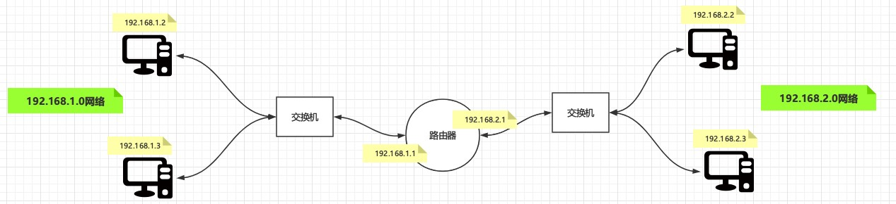

# TCP/IP五层模型


我就想访问个百度，为啥还要搞五层模型？每层有每层的用处，下面细细道来

下面所有演示的命令均在CentOS 7，shell环境为bash

# 应用层
对应网络协议：HTTP、TFTP、FTP、NFS、WAIS、SMTP

不要把协议想象得太神秘，所谓协议，就是一些成文的规定而已，比如HTTP请求头最后必须跟一个换行`GET / HTTP/1.0\n`

应用层只管传输数据，指定协议（比如HTTP协议就是应用层的协议），底层数据怎么去握手怎么去建立连接不用管，现象：执行下面命令，查看输出
```bash
# 建立和百度的socket连接，文件描述符为8，这里也体现了Linux一切皆文件的思想
exec 8<> /dev/tcp/www.baidu.com/80
# 给8写HTTP请求头，也就是给百度写
echo -e 'GET / HTTP/1.0\n' 1>& 8
# 从8里面读，也就是从百度读
cat <& 8
```
输出结果，可以看到百度的首页被读取到了
```html
HTTP/1.0 200 OK
...省略...
X-Ua-Compatible: IE=Edge,chrome=1

<!DOCTYPE html><!--STATUS OK-->
<html>
<head>
    <meta http-equiv="content-type" content="text/html;charset=utf-8">
    <meta http-equiv="X-UA-Compatible" content="IE=Edge">
    ...省略...
</head>
<body link="#0000cc">
...省略...
</body></html>
```
- 详细解释上面三个命令：
1. `exec 8<> /dev/tcp/www.baidu.com/80` Linux中的一个特殊文件（Bash的特性）： /dev/tcp  打开这个文件就类似于发出了一个socket调用，建立一个socket连接，读写这个文件就相当于在这个socket连接中传输数据。`<>`表示对8开启输入输出
2. `echo -e 'GET / HTTP/1.0\n' 1>& 8` Linux中0表示标准输入、1表示标准输出、2表示错误输出，`1>& 8`表示将标准输出重定向到8
3. `cat <& 8`  `<& 8`表示将8的输出重定向到cat

- 查看网络状态，当和百度的连接建立好后，可以通过netstat查看和百度的连接状态

参考[【TCP】TCP连接的三次握手和“四次”挥手小结.md](./参考文章/【TCP】TCP连接的三次握手和“四次”挥手小结.md)
```bash
# 建立连接并且查看连接状态
exec 8<> /dev/tcp/www.baidu.com/80 && netstat -antp | grep `ping www.baidu.com -c 1 | sed '1{s/[^(]*(//;s/).*//;q}'`
# 可以看到和百度的连接状态是ESTABLISHED
tcp        0      0 103.117.103.228:38554   103.235.46.39:80        ESTABLISHED 9852/-bash


# 如果一直不发消息，过一会儿再看连接状态
netstat -antp | grep `ping www.baidu.com -c 1 | sed '1{s/[^(]*(//;s/).*//;q}'`
# 可以看到连接状态变成了CLOSE_WAIT
tcp        1      0 103.117.103.228:38554   103.235.46.39:80        CLOSE_WAIT  9852/-bash          
```

## curl
`curl www.baidu.com`也可以看到同样的效果，但是curl隐藏了发送HTTP的底层细节，执行`curl -v www.baidu.com`查看输出
```bash
[root@linux-centos-7 fd]# curl -v www.baidu.com 
* About to connect() to www.baidu.com port 80 (#0)
*   Trying 103.235.46.39...
* Connected to www.baidu.com (103.235.46.39) port 80 (#0)
# 这部分就是curl发送给百度的HTTP请求
> GET / HTTP/1.1
> User-Agent: curl/7.29.0
> Host: www.baidu.com
> Accept: */*
> 

# 这部分是百度返回的
< HTTP/1.1 200 OK
< Accept-Ranges: bytes
< Cache-Control: private, no-cache, no-store, proxy-revalidate, no-transform
< Connection: keep-alive
< Content-Length: 2381
< Content-Type: text/html
< Date: Tue, 21 Jul 2020 02:37:01 GMT
< Etag: "588604ec-94d"
< Last-Modified: Mon, 23 Jan 2017 13:28:12 GMT
< Pragma: no-cache
< Server: bfe/1.0.8.18
< Set-Cookie: BDORZ=27315; max-age=86400; domain=.baidu.com; path=/
< 
<!DOCTYPE html>
...省略...

```

## 问题抛出
`exec 8<> /dev/tcp/www.baidu.com/80`对应用层而言已经建立好连接了，TCP三次握手已经OK了，但是是怎么握手是谁去握手的呢？我们自己的应用程序里面并没有写过要三次握手的代码，答案就是位于传输控制层的TCP协议规定了要怎么去握手，是内核协议栈来实现来做这个握手的事情的，下面轮到传输控制层表演。


# 传输控制层
对应网络协议：TCP、UDP

命令：`netstat -antp`

这层我们要研究的是怎么进行三次握手，怎么建立连接的。

## Socket
了解TCP之前先来看一下什么是socket（套接字），socket是内核对底层协议封装给上层调用的函数，Linux中的解释
>socket() creates an endpoint for communication and returns a descriptor.

socket是四元组，四元组中只要有一个元素不一样那么就能通信，抛出问题：客户端C理论上1~65535个端口都连了服务端S，所有端口都用完了，现在还能连服务端S1吗？答案是可以的，因为**四元组**不一样！
```
# 源IP:源端口  ->  目标IP:目标端口
LocalIp:LocalPort -> RemoteIp:RemotePort
```

## TCP
TCP就在这一层
>传输控制协议（TCP，Transmission Control Protocol）是一种面向连接的、可靠的、基于字节流的传输层通信协议

传输控制是怎么让TCP可靠的？答案就是三次握手四次挥手，同样是用`curl www.baidu.com`来演示，同时用`tcpdump -nn -i ens33 port 80`来监听网卡的数据，下面对监听到的数据进行分析

## 三次握手、建立连接（准备资源）

三次握手的重点是**建立连接资源**，三次握手之后**连接**建立，这个连接是逻辑上的，并没有一根网线从我的机器上直接接到百度的机器上，这个连接存在的目的在于表示经过三次握手之后表明我的机器和百度的机器网络是通的，可以互相发送数据

但是，资源，也就是Socket是**物理**的，内核要在内存中开辟内存存储这个Socket表示此连接，所以要经过三次握手表明网络是通的后才建立起资源！
```
IP 192.168.108.100.52032 > 103.235.46.39.80: Flags [S], seq 3029092861, win 29200, options [mss 1460,sackOK,TS val 4294834100 ecr 0,nop,wscale 7], length 0
IP 103.235.46.39.80 > 192.168.108.100.52032: Flags [S.], seq 1346707522, ack 3029092862, win 64240, options [mss 1460], length 0
IP 192.168.108.100.52032 > 103.235.46.39.80: Flags [.], ack 1, win 29200, length 0
```

## 传输数据
可以看到，传输数据的过程之中，每次收到百度发送的数据包，本机都会发送一个长度为0的**确认包**，这也是TCP的可靠机制，每次都要给百度说一声：哥，我收到了！

```
IP 192.168.108.100.52032 > 103.235.46.39.80: Flags [P.], seq 1:78, ack 1, win 29200, length 77: HTTP: GET / HTTP/1.1
IP 103.235.46.39.80 > 192.168.108.100.52032: Flags [.], ack 78, win 64240, length 0
# 百度发的数据包
IP 103.235.46.39.80 > 192.168.108.100.52032: Flags [P.], seq 1:1441, ack 78, win 64240, length 1440: HTTP: HTTP/1.1 200 OK
# 本机发的确认包
IP 192.168.108.100.52032 > 103.235.46.39.80: Flags [.], ack 1441, win 31680, length 0
# 百度发的数据包
IP 103.235.46.39.80 > 192.168.108.100.52032: Flags [P.], seq 1441:2782, ack 78, win 64240, length 1341: HTTP
# 本机发的确认包
IP 192.168.108.100.52032 > 103.235.46.39.80: Flags [.], ack 2782, win 34560, length 0

```


## 四次挥手、断开连接（释放资源）

四次挥手可以是服务端或客户端任意一端先发起，四次挥手的重点是断开连接，同时**释放资源**

```
IP 192.168.108.100.52032 > 103.235.46.39.80: Flags [F.], seq 78, ack 2782, win 34560, length 0
IP 103.235.46.39.80 > 192.168.108.100.52032: Flags [.], ack 79, win 64239, length 0
IP 103.235.46.39.80 > 192.168.108.100.52032: Flags [FP.], seq 2782, ack 79, win 64239, length 0
IP 192.168.108.100.52032 > 103.235.46.39.80: Flags [.], ack 2783, win 34560, length 0
```

## 问题抛出
这层做的事情就是传输控制，是通过逻辑来保证TCP**可靠**的特性，那么一个数据包，比如三次握手的第一个包，是怎么从自己的主机到达百度的主机的？来看这个四元组

`192.168.108.100:52032 > 103.235.46.39.80`

我们只是指定了自己的IP端口和百度的IP端口就能和百度通信了，但是底层具体是怎么做的，发生了什么？下面轮到网络层表演了


# 网络层 
对应网络协议：IP、ICMP、ARP、RARP、AKP、UUCP

这层我们要研究的是一个数据包怎么通过我自己的机器到达百度的。先来看看我们的数据包长啥样`192.168.108.100.52032 > 103.235.46.39.80`，我们的数据包要走什么路才能到达百度，答案是有一张路由表：

## 路由表
命令：`route -n`

```
Kernel IP routing table
Destination     Gateway         Genmask         Flags Metric Ref    Use Iface
192.168.108.0   0.0.0.0         255.255.255.0   U     0      0        0 ens33
0.0.0.0         192.168.108.1   0.0.0.0         UG    0      0        0 ens33
```
`192.168.108.0`这是一个网络号，`192.168.108.100`表示这个网络号里面的第一百台主机。网关为`0.0.0.0 `表示不需要网关

Flags中U表示Up、G表示GateWay，H表示Host

## 下一跳
我们的目标地址是`103.235.46.39`，与路由表里面每一条路由的掩码（Genmask）做按位与（全1为1，有0则0）运算，得到如下
```
103.235.46.39 & 255.255.255.0 = 103.235.46.0
103.235.46.39 & 0.0.0.0       = 0.0.0.0
```
在和路由表里面的目标地址（Destination）比较，发现第二条满足要求，就直接把数据包扔给网关（Gateway）192.168.108.1，也就是我们家里的那个路由器，然后就不管了，这个过程我们叫**下一跳**

那么后面也是，路由器通过自己的路由表找到自己的下一跳，扔给它就不管了，直到扔百度`103.235.46.39`所在局域网的路由器，最后在扔给百度主机，数据包从百度返回来也是一样的道理。

思考：如果ping局域网的主机，数据包是怎么走的？比如`ping 192.168.108.101`
```
192.168.108.101 & 255.255.255.0 = 192.168.108.0 
```
发现第一条正好满足，刚好就是网络号，说明是局域网，则数据包不需要经过网关直接走**交换机**到达目标主机（一般我们家里面的那种光猫既是交换机又是路由器）

## 问题抛出
上面的下一跳都是从逻辑角度来说的，这没什么问题，但是数据包是物理的，它是你网线里面的电信号或者光信号，他要**实实在在**的知道下一跳该往哪个设备上传输，IP都是逻辑划分的，你给他一个IP，他也不知道这个IP代表哪个设备

就像小明是谁一样，只是知道名字，全中国那么多小明，你怎么知道是谁，但是你给我小明的身份证我就知道小明是谁了，这个身份证就是设备的MAC地址，所以轮到链路层表演了，它才实实在在的知道数据包该往哪个设备传输！


# 链路层
对应网络协议：FDDL、Ethernet（以太网）、Arpanet、PDN、SLIP、PPP

## MAC地址

MAC地址也叫物理地址、硬件地址，由网络设备制造商生产时烧录在网卡的EPROM，很多人都在疑惑为什么有了IP地址还要有MAC地址，可以参考一下，
https://www.zhihu.com/question/21546408/answer/1331586216

>服务器：没有MAC地址，我怎么知道把IP分配给谁了……

>别比喻来比喻去了，都没说到点上，实话告诉你吧，IP可以没有，但是MAC一定要有，为啥？
>
>比如局域网内你有一个数据包要发给路由器，谁是路由器？哦，你知道IP为192.168.1.1的设备是路由器，你准备发给他，但是问题又来了，IP为192.168.1.1的设备它究竟是谁？
>
>你肯定会说，你这不放屁么，就是IP为192.168.1.1的设备啊！
>
>关键就在这里了，ip这是一个逻辑划分的东西，今天我高兴192.168.1.1是华为路由器，明天可能是小米路由器。
>
>而数据包/帧是实实在在的光信号或者电信号，是物理的，要往哪发你肯定得给我设备的地址，你给我一个逻辑划分的东西，我咋知道往哪发？得有点有什么东西和硬件绑在一起是吧？
>
>这个东西就是mac地址，说白了就是硬件的地址。
>
>你要知道，IP是人逻辑划分的，每家都有192.168.1.1，你说的是哪家的？你去网吧看看那插满线狂闪着灯的交换机，那玩意是不需要IP的
>
>话说回来，如果没有mac地址，局域网内，你咋知道哪个设备分配的哪个ip？哦，这个东西有根天线，看起来像路由器，那它就是192.168.1.1吧。。。。
>
>最后如果你把IP烧进路由器，那你就可以说我不需要mac，我用ip也能上网！无所谓ip与mac，这就是一个区分谁是谁的问题
>
>以上。

命令：`arp -n`

```
Address                  HWtype  HWaddress           Flags Mask            Iface
192.168.108.1            ether   00:50:56:ed:af:7c   C                     ens33
```

现在已经知道路由器的MAC地址了，数据包就往自己身上贴上标签`00:50:56:ed:af:7c`，说你的下一跳就是它了，当数据包到达路由器的时候，路由器也会找到自己的下一跳，然后撕掉上面的MAC地址标签，贴上下一跳的MAC地址，MAC地址在每一跳中是不断变化的。如下图：


如果不知道下一跳的MAC地址，那怎么办？ARP协议会发广播包给所有局域网的机器得知MAC地址，发现没有，下一层的事情下一层自己来干，不需要上一层的干预，反正我给你发过去，你不管我怎么去发的，就像TCP三次握手一样，传输控制层把三次握手完成建立连接，应用层就用连接就完事了，底层怎么来做的你不用管。下面来演示一下如果不知道路由器MAC地址的时候请求百度是什么情况：

1. 监听网络数据包`tcpdump -nn -i ens33 port 80 or arp`

2. 先删除arp记录在请求百度`arp -d 192.168.108.1 && curl www.baidu.com`

结果如下

```bash
listening on ens33, link-type EN10MB (Ethernet), capture size 262144 bytes
# 三次握手之前先请求ARP得到网关的MAC地址
09:57:27.080587 ARP, Request who-has 192.168.108.1 tell 192.168.108.100, length 28
09:57:27.080685 ARP, Reply 192.168.108.1 is-at 00:50:56:ed:af:7c, length 46
# 三次握手
09:57:27.340812 IP 192.168.108.100.48424 > 103.235.46.39.80: Flags [S], seq 2982402438, win 29200, options [mss 1460,sackOK,TS val 1302388 ecr 0,nop,wscale 7], length 0
09:57:27.770846 IP 103.235.46.39.80 > 192.168.108.100.48424: Flags [S.], seq 1496870293, ack 2982402439, win 64240, options [mss 1460], length 0
09:57:27.770896 IP 192.168.108.100.48424 > 103.235.46.39.80: Flags [.], ack 1, win 29200, length 0
# 数据交互
09:57:27.771083 IP 192.168.108.100.48424 > 103.235.46.39.80: Flags [P.], seq 1:78, ack 1, win 29200, length 77: HTTP: GET / HTTP/1.1
09:57:27.771249 IP 103.235.46.39.80 > 192.168.108.100.48424: Flags [.], ack 78, win 64240, length 0
09:57:28.209279 IP 103.235.46.39.80 > 192.168.108.100.48424: Flags [P.], seq 1:1441, ack 78, win 64240, length 1440: HTTP: HTTP/1.1 200 OK
09:57:28.209317 IP 192.168.108.100.48424 > 103.235.46.39.80: Flags [.], ack 1441, win 31680, length 0
09:57:28.209967 IP 103.235.46.39.80 > 192.168.108.100.48424: Flags [P.], seq 1441:2782, ack 78, win 64240, length 1341: HTTP
09:57:28.209982 IP 192.168.108.100.48424 > 103.235.46.39.80: Flags [.], ack 2782, win 34560, length 0
# 四次挥手
09:57:28.210111 IP 192.168.108.100.48424 > 103.235.46.39.80: Flags [F.], seq 78, ack 2782, win 34560, length 0
09:57:28.210935 IP 103.235.46.39.80 > 192.168.108.100.48424: Flags [.], ack 79, win 64239, length 0
09:57:28.637147 IP 103.235.46.39.80 > 192.168.108.100.48424: Flags [FP.], seq 2782, ack 79, win 64239, length 0
09:57:28.637190 IP 192.168.108.100.48424 > 103.235.46.39.80: Flags [.], ack 2783, win 34560, length 0

```

   可以看到，在请求之前确实是先发送了ARP请求！

## ARP局域网广播寻址

如果删掉该条arp记录`arp -d 192.168.108.1`，再`arp -n`发现又回来了，这就是arp的广播寻址，它会在局域网内给所有主机发送arp请求包，网关一看是在询问自己就把自己的mac地址返回回去。下面来做一个实验：

新开一个窗口监听网卡上面的arp数据包：`tcpdump -nn -i ens33 arp`，然后删除arp记录再重新请求`arp -d 192.168.108.1 && arp -n`观察抓包结果：

```bash
# 谁有网关192.168.108.1的mac地址请告诉192.168.108.100一下
09:32:22.329288 ARP, Request who-has 192.168.108.1 tell 192.168.108.100, length 28
# 有回答了，说192.168.108.1的mac地址为00:50:56:ed:af:7c
09:32:22.329355 ARP, Reply 192.168.108.1 is-at 00:50:56:ed:af:7c, length 46
```

# 物理层
对应网络协议：IEEE802.1A、IEEE 802.2到IEEE 802.11

这层就涉及硬件了，不再本文讨论范围


# 总结
- 一个数据包的整体流程为：应用程序需要发起连接请求后开始阻塞-->>传数控制层发起握手包后开始阻塞-->>网络层寻找下一跳后开始阻塞-->>链路层一看有没有目标下一跳的mac地址，没有mac地址则先发ARP广播请求MAC，得到MAC后开始阻塞-->>物理层实际来发送
- 每个层都有自己的表：
    - 传输控制层（查看Socket表）：`netstat -antp`
    - 网络层（查看路由表）：`route -n`
    - 链路层（查看Mac地址表）：`arp -n`
    

# 例1：路由器寻址过程


数据包格式[源IP-->>目标IP;源MAC-->>目标MAC ]，例：192.168.1.2 要发数据包给 192.168.2.3
## ARP解析过程（没有MAC地址的情况下）
0. 根据192.168.1.2的路由表找到下一跳192.168.1.1（路由器）
1. 192.168.1.2 发送数据包给交换机，MAC地址为全f，交换机广播给192.168.1.3和192.168.1.1，封数据包[192.168.1.2-->>192.168.2.3;下一跳192.168.1.1;MAC@192.168.1.2-->>全f ]
2. 192.168.1.3一看下一跳IP为192.168.1.1，不是自己的，丢弃此包
3. 192.168.1.1一看下一跳IP为192.168.1.1，是自己的，封包返回自己的mac地址，封数据包[192.168.1.1-->>192.168.1.2;MAC@192.168.1.1-->>MAC@192.168.1.2 ]
4. 192.168.1.2得知路由器192.168.1.1的mac地址

实际上以上过程在网线刚插上电脑的时候就会发生（设备加入网络的时候就会发生，无论通过网线还是WIFI），相当于告诉局域网里内的所有主机：**俺上线了！请记住我的MAC地址！**

### 注意力聚焦到交换机
交换机是有很多端口的（插网线的物理的端口），一个端口对应一台主机，当第一个ARP包从主机192.168.1.2发出来的时候交换机就记住了该端口的MAC地址，ARP从路由器192.168.1.1返回的时候其实直接从交换机的该端口返回给了192.168.1.2

其实TCP/IP协议中所谓的端口是逻辑上的，你的主机65536个端口并没有65536个网线接口，而是在协议上面逻辑划分的，用来区分不同的进程！端口的概念或许也是从交换机的物理的端口来的...

## 数据包发送过程
通过ARP协议得到了MAC地址之后才能进行实际的数据包发送：
1. 根据192.168.1.2的路由表找到下一跳192.168.1.1（路由器）
2. 192.168.1.2 发送数据包给交换机，交换机发给路由器，封数据包[192.168.1.2-->>192.168.2.3;下一跳192.168.1.1;MAC@192.168.1.2-->>MAC@192.168.1.1 ]
3. 路由器上面连着俩网卡，一边是192.168.1.0网络，另外一边是192.168.2.0这个网络，那么它的路由表里面就一定有一条记录能找到192.168.2.0这个网络
4. 路由器一看是192.168.2.3，把数据包交给交换机，交换机在根据MAC地址找到192.168.2.3并把数据包交给它

## 总结
1. 交换机不需要IP，**只需要MAC地址**，是连着同一局域网的
2. 路由器需要**IP和MAC**，是连接着不同局域网的
3. 192.167.1.0和192.168.2.0是**网络号**，表示两个不同的网络（子网）

# 例2：路由表的作用
现在有两台局域网主机192.168.108.77和192.168.108.228，在192.168.108.228上`ping 192.168.108.77`理所当然是能ping通的，因为228上有如下路由表
```bash
[root@linux-centos-7 ~]# route -n
Kernel IP routing table
Destination     Gateway         Genmask         Flags Metric Ref    Use Iface
192.168.108.0   0.0.0.0         255.255.255.0   U     0      0        0 eth0
0.0.0.0         192.168.108.1   0.0.0.0         UG    0      0        0 eth0

```
数据包直接扔给交换机，让它去发给77，假如现在在77的eth0网卡上新增一个ip地址`ifconfig eth0:1 192.168.88.88`，查看一下新增结果
```bash
[root@linux-centos-7 ~]# ifconfig eth0:1
eth0:1: flags=4163<UP,BROADCAST,RUNNING,MULTICAST>  mtu 1500
        inet 192.168.88.88  netmask 255.255.255.0  broadcast 192.168.88.255
        ether 22:d0:e4:c8:e2:98  txqueuelen 1000  (Ethernet)
```
现在在228上`ping 192.168.88.88`肯定是不通的，因为路由表没有该条记录，它直接把数据包扔给网关了，肯定到不了192.168.88.88，现在如果在228上新增一条静态路由`route add -host 192.168.88.88 gw 192.168.108.77`，查看添加结果
```bash
[root@linux-centos-7 ~]# route -n
Kernel IP routing table
Destination     Gateway         Genmask         Flags Metric Ref    Use Iface
192.168.108.0   0.0.0.0         255.255.255.0   U     0      0        0 eth0
192.168.88.88   192.168.108.77  255.255.255.255 UGH   0      0        0 eth0
0.0.0.0         192.168.108.1   0.0.0.0         UG    0      0        0 eth0
```
然后在`ping 192.168.88.88`就通了，删除上面新增的虚拟网卡`ifocnfig eth0:1 down`，删除静态路由`route del -host 192.168.88.88`

### 总结
要看网络通不通，很简单，就看路由表，与掩码做二进制做按位与，匹配上就了把数据交给它!

