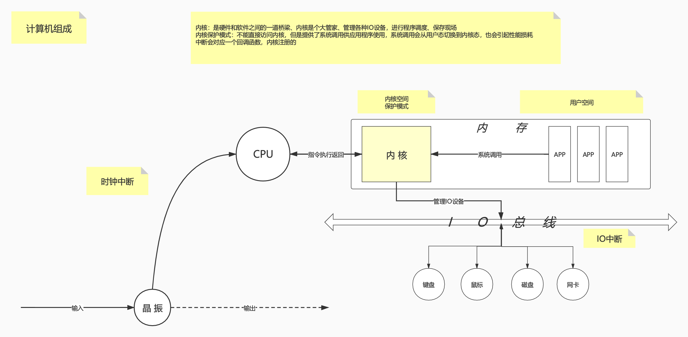

# 计算机组成

首先大概了解一下计算机的组成



## 内核
内核是硬件和软件之间的一道桥梁、内核是个大管家、管理各种IO设备，进行程序调度、保存现场

内核保护模式：不能直接访问内核，但是提供了系统调用供应用程序使用，系统调用会从用户态切换到内核态，也会引起性能损耗

参考：[Java离Linux内核有多远](参考文章/Java离Linux内核有多远.md)，原始连接：https://www.oschina.net/question/2918182_2317611

Java → JVM → glibc → 内核

## 中断

- 中断分类 [【Linux中断】中断的分类](./参考文章/[Linux中断]中断的分类.md)，原文链接：https://blog.csdn.net/yusiguyuan/article/details/23517819
- IO中断 [【Linux中断】IO中断原理](./参考文章/[Linux中断]IO中断原理.md)，原文链接：https://www.cnblogs.com/Jack-Blog/p/12038716.html
- 时钟中断 [【Linux中断】linux时钟浅析-kouu](./参考文章/[Linux中断]linux时钟浅析-kouu.md)，原文链接：https://kouucocu.lofter.com/post/1cdb8c4b_50f6328

## 系统调用
系统调用一共有313个，参考[【Syscall】Searchable Linux Syscall Table for x86 and x86_64 _ PyTux](./参考文章/[Syscall]Searchable Linux Syscall Table for x86 and x86_64 _ PyTux.md)，原文链接：https://filippo.io/linux-syscall-table/

系统调用是内核对外暴露的API，因为内核存在保护模式，是不能直接被调用的，那么应用程序怎么去调用系统调用的呢？（比如Java程序需要读取来自网卡的数据包）

答案就是通过软中断，应用程序代码在被编译时会被**编译器**加入软中断的相关指令，当要进行系统调用时，实际上是调用了软中断，陷入内核态执行，内核态执行完后返回，在切换回用户态，所以这里有一个**用户态到内核态的切换**


# 网络IO的演变
总体发展历程图，总体历程就是从`BIO -> NIO -> NIO+多路复用(select,poll,epoll) -> AIO`，当然Linux下目前还没有真正成熟的AIO，Windows的IOCP是真正成熟的AIO
- NIO(Blocking IO)：阻塞IO
- NIO(Nonblocking IO)：非阻塞IO
    - select：多路复用选择器
    - poll：轮询
    - epoll：基于事件的轮询
- AIO(Asynchronous IO)：异步IO

就是这张图，下文分开说明


# BIO (Blocking IO) 同步阻塞
BIO也就是阻塞IO，参考代码：[Server](./参考代码/bio/Server.java)
```java
package bio;

import java.io.*;
import java.net.ServerSocket;
import java.net.Socket;


/**
 * BIO 测试，在Linux 使用JDK1.4编译运行
 * 阻塞
 */
public class Server {

    public static void main(String[] args) throws IOException {
        System.out.println("bio server starting...");
        server(8081);
    }

    public static void server(int port) throws IOException {
        /**
         * 前三步
         * socket = xxx
         * bind(xxx,8081)
         * listen(xxx)
         */
        ServerSocket ss = new ServerSocket(port);

        while (true){
            /*会阻塞*/
            Socket client = ss.accept();
            System.out.println("client:" + client.getInetAddress() + " port:" + client.getPort());
            //新开线程进行处理
            new Thread(new Runnable() {
                private Socket socket;
                public Runnable setSocket(Socket socket) {
                    this.socket = socket;
                    return this;
                }

                public void run() {
                    try {
                        BufferedReader reader = new BufferedReader(
                            new InputStreamReader(socket.getInputStream()));
                        String line = null;
                        /*会阻塞*/
                        while ( (line = reader.readLine()) != null){
                            System.out.println(line);
                        }
                    } catch (IOException e) {
                        e.printStackTrace();
                    }
                }
            }.setSocket(client)).start();
        }
    }
}

```


因为需要老版本的JDK才使用的BIO，所以这里需要安装JDK1.4，然后用strace来追踪系统调用，阻塞说白了就是挂起线程

## 安装JDK1.4

由于版本比较老，在比较新的系统下安装过程略显繁琐

1. 登陆https://www.oracle.com/java/technologies/java-archive-javase-v14-downloads.html下载JDK1.4，类似于`j2sdk-1_4_2_15-linux-i586.bin`
2. 解压bin文件，参考[Linux下解压bin文件](./参考文章/Linux下解压bin文件.md) 原文链接：https://iminto.github.io/post/linux%E4%B8%8B%E8%A7%A3%E5%8E%8Bbin%E6%96%87%E4%BB%B6/
    ```bash
    tail -n +541 j2sdk-1_4_2_16-linux-ia64.bin  > install.sfx
    7za x install.sfx # 如果没有7z则安装  yum install -y p7zip
    ```
3. 执行`$JAVA_HOME/bin/java -version`
    - 如果报错：`/lib/ld-linux.so.2: bad ELF interpreter 解决`，这是因为因为64位系统中安装了32位程序，解决：
    ```bash
    yum install -y glibc.i686
    # 重新安装以后还有如下类系错误 再继续安装包
    # error while loading shared libraries: libstdc++.so.6: cannot open shared object file: No such file or directory
    yum install -y libstdc++.so.6

    ```
    - 如果报错`Error occurred during initialization of VM java/lang/NoClassDefFoundError: java/lang/Object`，需要解压`rt.pack` 和 `tools.pack`
    ```bash
    cd $JAVA_HOME/lib
    unpack tools.pack tools.jar
    cd ../jre/lib
    ../../unpack rt.pack rt.jar
    ```
4. 执行`$JAVA_HOME/bin/java -version`
   
## 追踪系统调用
1. 如果没有该命令，先安装 `yum -y install strace`
2. 编译 `$JAVA_HOME/bin/javac Server.java`
3. 执行 `strace -ff -o out $JAVA_HOME/bin/java Server`

此时查看目录下多了很多out.XXX的文件，XXX是进程id，最大的那个文件就是主线程，此例是out.26768，这里面都是系统调用，比如execve、mmap2

查看系统调用有专门的手册，比如想了解execve，直接`man 2 execve`，2表示2类的，即为系统调用，如果提示`在第 2 节中没有关于 listen 的手册页条目。`则需要安装一下`yum -y install man-pages`

`man man`可以查看manual手册的分类

```
1   Executable programs or shell commands
2   System calls (functions provided by the kernel)
3   Library calls (functions within program libraries)
4   Special files (usually found in /dev)
5   File formats and conventions eg /etc/passwd
6   Games
7   Miscellaneous (including macro packages and conventions), e.g. man(7), groff(7)
8   System administration commands (usually only for root)
9   Kernel routines [Non standard]
```

查看out.26768文件，可以看到如下输出

```c
socket(AF_UNIX, SOCK_STREAM|SOCK_CLOEXEC|SOCK_NONBLOCK, 0) = 3
...
bind(3, {sa_family=AF_INET6, sin6_port=htons(8081), inet_pton(AF_INET6, "::", &sin6_addr), sin6_flowinfo=htonl(0)}, 24) = 0
listen(3, 50)                           = 0
...
accept(3,
```
解释：先调用`socket`返回文件描述符3，然后调用`bind`在3上面绑定8081端口，之后调用`listen`监听3，最后调用`accept`阻塞等待客户端链接

如果此时用nc，（如果没有先安装`yum install -y nc`，更多关于nc的使用请参考[【nc】使用nc读写TCP、UDP连接](./参考文章/【nc】使用nc读写TCP、UDP连接.md) ），来链接8081端口，`nc localhost 8081`，可以看到clone了进程，线程id为27531，如下
```c
...
clone(child_stack=0xea916424, flags=CLONE_VM|CLONE_FS|CLONE_FILES|CLONE_SIGHAND|CLONE_THREAD|CLONE_SYSVSEM|CLONE_SETTLS|CLONE_PARENT_SETTID|CLONE_CHILD_CLEARTID, parent_tidptr=0xea916ba8, tls={entry_number=12, base_addr=0xea916b40, limit=0x0fffff, seg_32bit=1, contents=0, read_exec_only=0, limit_in_pages=1, seg_not_present=0, useable=1}, child_tidptr=0xea916ba8) = 27531
...
```
继续追踪out.27531，可以看到阻塞在了`recv`这里，这里的5就是客户端（即nc）
```c
...
recv(5,

```
用nc发个消息hello，再观察该文件，发现如下输出，打印了之后又阻塞在了`recv`
```c
recv(5, "hello\n", 8192, 0)             = 6
ioctl(5, FIONREAD, [0])                 = 0
write(1, "hello", 5)                    = 5
write(1, "\n", 1)                       = 1
recv(5,

```

整个过程如下图所示


## 优势和弊端

- 优势
    - 一个连接对应一个线程，可以接收很多连接
- 弊端：如果客户端太多，导致线程太多，从而导致频繁线程调度、切换上下文使用得
    - **线程内存浪费**
    - **CPU调度消耗**
- 根源
    - 因为系统提供的系统调用（accpet recv）是Blocking阻塞的
    

上层系统都是受制于内核发展的，所以内核有没有提供非阻塞的系统调用？答案是有的：`man 2 socket`已经说明了
```c
int socket(int domain, int type, int protocol);
Since Linux 2.6.27, the type argument serves a second purpose: in addition to specifying a
socket type, it may include the bitwise OR of any of the following values, to  modify  the
behavior of socket():

SOCK_NONBLOCK   Set  the  O_NONBLOCK  file  status  flag on the new open file description.
               Using this flag saves extra calls to fcntl(2) to achieve the same result.
```
从Linux 2.6.27起，type参数SOCK_NONBLOCK支持非阻塞，所以来看看非阻塞


# NIO (NonBlocking IO) 同步非阻塞

NIO就是非阻塞IO，也就是说线程不挂起，有就返回，没有就返回-1(java中返回null)，那为什么说是同步的，因为整个Server一直在通过系统调用问内核有没有数据到来，一直在轮询，这就是一种同步机制，就此例而言，如果要实现真正的异步，应该是有数据来了，内核来调用Server提前注册好的回调函数

参考代码：[Server](./参考代码/nio/Server.java)，使用jdk1.8，用strace追踪调用

```java
package nio;

import java.io.IOException;
import java.net.InetSocketAddress;
import java.nio.ByteBuffer;
import java.nio.channels.ServerSocketChannel;
import java.nio.channels.SocketChannel;
import java.text.SimpleDateFormat;
import java.util.Date;
import java.util.LinkedList;
import java.util.List;

/**
 * NIO 测试，在Linux 使用JDK1.8编译运行
 * 同步非阻塞
 */
public class Server {


    static List<SocketChannel> clients = new LinkedList<>();


    public static void main(String[] args) throws IOException, InterruptedException {
        System.out.println("nio server starting...");
        server(8081);
    }


    public static void server(int port) throws IOException, InterruptedException {
        /**
         * 前三步
         * socket = xxx
         * bind(xxx,8081)
         * listen(xxx)
         */
        ServerSocketChannel ss = ServerSocketChannel.open();
        ss.bind(new InetSocketAddress(port));

        /**
         * fcntl(xxx, O_NONBLOCK) //设置非阻塞
         */
        ss.configureBlocking(false); //设置服务器为不阻塞

        while (true){
            Thread.sleep(1000);
            SocketChannel client = ss.accept();

            if (client == null){
                System.out.println(getTime() + " no client found");
            } else {
                client.configureBlocking(false);//设置客户端为不阻塞
                clients.add(client);
                System.out.println(String.format(getTime() +" client %s has added!", client.socket().getInetAddress() + ":" + client.socket().getPort()));
            }

            /**
             * 这个buffer，一般一个client配一个buffer
             * 但是此处是所有的client是串行化的，所以所有client共用一个buffer
             */
            //堆外，效率更高，效率接近于Native IO，也就是所谓的0拷贝
            ByteBuffer buffer = ByteBuffer.allocateDirect(4096); 

            //堆内，数据需要从内核拷贝到堆内，有一次拷贝的过程
            //ByteBuffer buffer = ByteBuffer.allocate(1024); 
            System.out.print(getTime() +  String.format(" 此时共有 %s 个客户端：", clients.size()));
            for (SocketChannel curClient : clients){
                String cInfo = curClient.socket().getInetAddress() + ":" + curClient.socket().getPort();
                int num = 0;

                /*读取异常处理*/
                try{
                    //读取发生异常直接关闭socket，因为如果客户端强制关闭服务器端还在读取的话会造成异常：
                    //" 远程主机强迫关闭了一个现有的连接 "
                    num = curClient.read(buffer); // >0 -1 0 不会阻塞
                } catch (Exception e){
                    e.printStackTrace();
                    curClient.socket().close();
                    curClient.close();
                    clients.remove(curClient);
                    continue;
                }
                if (num > 0){
                    buffer.flip();
                    byte[] bytes = new byte[buffer.limit()];
                    buffer.get(bytes);
                    String s = new String(bytes);
                    System.out.println("\n-----------------------------");
                    System.out.print(getTime() + " " + cInfo  + " -> " + s);
                    System.out.println("-----------------------------");
                    buffer.clear();
                } else if (num == -1){
                    System.out.println(cInfo+"强制断开连接，连接关闭！");
                    curClient.socket().close();
                    curClient.close();
                    clients.remove(curClient);
                    continue;
                }
            }
            System.out.println();
        }
    }

    /**
     * 读取异常处理
     * @param curClient
     * @param buffer
     * @return
     * @throws IOException
     */
    public static int read(SocketChannel curClient,ByteBuffer buffer) throws IOException {
        /*读取异常处理*/
        try{
            //读取发生异常直接关闭socket，因为如果客户端强制关闭服务器端还在读取的话会造成异常 " 远程主机强迫关闭了一个现有的连接 "
            return curClient.read(buffer); // >0 -1 0 不会阻塞
        } catch (Exception e){
            e.printStackTrace();
            curClient.socket().close();
            curClient.close();
            clients.remove(curClient);
            throw e;
        }
    }


    public static String getTime(){
        return new SimpleDateFormat("yyyy-MM-dd HH:mm:ss").format(new Date());
    }
}

```

## 追踪系统调用
1. 编译`javac Server.java`
2. 执行`strace -ff -o out java Server`

查看out.2838文件，可以看到如下输出
```c
socket(AF_INET6, SOCK_STREAM, IPPROTO_IP) = 4
...
bind(4, {sa_family=AF_INET6, sin6_port=htons(8081), inet_pton(AF_INET6, "::", &sin6_addr), sin6_flowinfo=htonl(0), sin6_scope_id=0}, 28) = 0
listen(4, 50)                           = 0
fcntl(4, F_SETFL, O_RDWR|O_NONBLOCK)    = 0 # O_NONBLOCK 此处就是设置非阻塞
...
accept(4, 0x7f8a3c166330, [28])         = -1 EAGAIN (资源暂时不可用)
...
```
可以看到accept一直在空转，返回-1表示没有，并不会阻塞，当执行`nc localhost 8081`时，可以看到accept接收到新客户端了
```c
...
accept(4, {sa_family=AF_INET6, sin6_port=htons(49742), inet_pton(AF_INET6, "::1", &sin6_addr), sin6_flowinfo=htonl(0), sin6_scope_id=0}, [28]) = 8
fcntl(8, F_GETFL)                       = 0x2 (flags O_RDWR)
...
```
最后总结一下，说白了NIO就是用-1表示没有连接，不会阻塞，这个系统目前最大的问题就是空转，由于不会阻塞，死循环玩命的进行**系统调用**，给系统发**软中断**，浪费系统资源，这就有点像主动去轮询，不停的问系统有没有客户端连进来，不停的挨个问连进来的客户端有没有数据发送过...

整个过程如下

(NIO有两层含义：就Java来说表示NEW IO，新的IO API，对比老IO API；就Linux而言，是指NonBlocking IO ，非阻塞IO)


## 优势和弊端

- 优势
    - 很少的线程就可以处理很多的连接
- 弊端：
    - 不停的进行系统调用，**不停的在用户态和内核态之间切换**，**CPU空转**

其实就普通的阻塞变成非阻塞而言，实现是很简单的，就是从没数据线程挂起到没数据返回一个标识，如果仅仅是将这种非阻塞的特性从内核传递到应用层，那么实现非阻塞意义不大，还增加了编程的复杂度

有没有办法减少用户态和内核态的切换呢，让应用程序处理真正的数据交互，有没有数据拿给内核去做，答案是有的，这就是多路复用器，将很多客户端拿给内核，内核告诉我们哪些数据可以读取了，将用户空间的循环转换到内核上


# NIO (NonBlocking IO) **多路复用器**
本质上是将轮询从用户态转移到内核态；多路复用器解决的是IO状态的问题

参考代码：[ServerWithSelector](./参考代码/nio/multiplexing/ServerMultiplexingV1.java)，使用jdk1.8，用strace追踪调用

```java
package nio.multiplexing;

import java.io.IOException;
import java.net.InetSocketAddress;
import java.nio.ByteBuffer;
import java.nio.channels.SelectionKey;
import java.nio.channels.Selector;
import java.nio.channels.ServerSocketChannel;
import java.nio.channels.SocketChannel;
import java.nio.charset.Charset;
import java.text.SimpleDateFormat;
import java.util.Date;
import java.util.Iterator;
import java.util.Set;

/**
 * NIO 测试多路复用器（只是客户端注册多路复用器），在Linux 使用JDK1.8编译运行
 * 同步非阻塞
 */
public class ServerMultiplexingV1 {


    private static Charset charset = Charset.forName("utf8");

    /**
     * java中的多路复用器
     * 对应底层的可能是select poll 或者是 epoll
     */
    private static Selector selector;

    static {
        try {
            selector = Selector.open();
        } catch (IOException e) {
            e.printStackTrace();
        }
    }


    public static void main(String[] args) throws IOException, InterruptedException {
        System.out.println("nio server starting...");
        server(8081);
    }


    public static void server(int port) throws IOException, InterruptedException {
        /**
         * 前三步
         * socket = xxx
         * bind(xxx,8081)
         * listen(xxx)
         */
        ServerSocketChannel ss = ServerSocketChannel.open();
        ss.bind(new InetSocketAddress(port));

        /**
         * fcntl(xxx, O_NONBLOCK) //设置非阻塞
         */
        ss.configureBlocking(false); //设置服务器为不阻塞

        while (true){
            Thread.sleep(1000);
            /**
             *  accpet(xxx,  = ccc //非阻塞，-1 EAGAIN表示没有
             */
            SocketChannel client = ss.accept();
            if (client == null){
                System.out.println(getTime() + " no client found");
            } else {
                /**
                 * fcntl(ccc, O_NONBLOCK) //设置客户端非阻塞
                 */
                //设置客户端为不阻塞
                client.configureBlocking(false);
                /**
                 * 注册到多路复用器上，监听可以读写的客户端
                 * 在系统底层如果是用的epoll则是epoll_ctl将当前文件描述符添加到epoll实例中
                 */
                /**
                 *  epoll_ctl(ccc,EPOLL_CTL_ADD,xxx,EPOLLIN)//将9添加进入epoll实例，监听读事件
                 */
                client.register(selector, SelectionKey.OP_READ | SelectionKey.OP_WRITE);
                System.out.println(String.format(getTime() +" client %s has registed!", client.socket().getInetAddress() + ":" + client.socket().getPort()));
            }
            select();
        }
    }


    /**
     * 多路复用器
     * @throws IOException
     */
    public static void select() throws IOException {
        int timeout = 500;//多路复用器超时（单位ms），0表示会阻塞
        /**
         * 多路复用器返回有客户端可以读写的时候
         * 以前如果有一万个客户端，那么就要挨个轮询一万次，就要在用户态和内核态切换一万次
         * 现在只需要多路复用器在内核轮询一次，切换一次内核态，就能知道有多少个客户端可以读写了
         * 相当于将轮查询这个操作转移到内核来做，提高效率，这就是多路复用
         */
        /**
         *  epoll_wait(ccc, = 1//表示有1个客户端可读写（阻塞）、可设置超时
         */
        while (selector.select(timeout) > 0){
            Set<SelectionKey> keys = selector.selectedKeys();
            Iterator<SelectionKey> it = keys.iterator();
            while (it.hasNext()){
                SelectionKey key = it.next();
                it.remove();
                if (key.isWritable()){
                    write(key);
                } else if (key.isReadable()){
                    read(key);
                }
            }
        }
    }

    /**
     * 读数据
     * @param key
     * @throws IOException
     */
    private static void read(SelectionKey key) throws IOException {
        SocketChannel curClient = (SocketChannel) key.channel();
        ByteBuffer buffer = ByteBuffer.allocateDirect(4096); //堆外，效率更高，效率接近于Native IO
        String cInfo = curClient.socket().getInetAddress() + ":" + curClient.socket().getPort();
        int num = 0;

        /*读取异常处理*/
        try{
            //读取发生异常直接关闭socket，因为如果客户端强制关闭服务器端还在读取的话会造成异常 " 远程主机强迫关闭了一个现有的连接 "
            num = curClient.read(buffer); // >0 -1 0 不会阻塞
        } catch (IOException e){
            e.printStackTrace();
            key.channel();
            curClient.socket().close();
            curClient.close();
            return;
        }

        if (num > 0){
            buffer.flip();
            byte[] bytes = new byte[buffer.limit()];
            buffer.get(bytes);
            String s = new String(bytes);
            System.out.println("\n-----------------------------");
            System.out.print(getTime() + " " + cInfo  + " -> " + s);
            System.out.println("-----------------------------");
            buffer.clear();

            /*读完之后设置成可写状态，否则将一直读*/
            key.interestOps(SelectionKey.OP_WRITE);
        } else {
            System.out.print(cInfo + " 没有读取到数据; " );
        }
    }

    /**
     *
     * @param key
     * @throws IOException
     */
    private static void write(SelectionKey key) throws IOException {
        SocketChannel curClient = (SocketChannel)key.channel();
        try{
            curClient.write(charset.encode("HTTP/1.1 200 OK\r\n"));
        } catch (IOException e){
            e.printStackTrace();
            key.channel();
            curClient.socket().close();
            curClient.close();
            return;
        }

        /*写完之后设置成可读状态，否则将一直写*/
        key.interestOps(SelectionKey.OP_READ);
    }


    public static String getTime(){
        return new SimpleDateFormat("yyyy-MM-dd HH:mm:ss").format(new Date());
    }
}

```


## 追踪系统调用
1. 编译`javac ServerMultiplexingV1.java`
2. 执行`strace -ff -o out java ServerMultiplexingV1`

```c
...
epoll_create(256)                       = 6
...
```
可以看到一上来就在内核中开辟了一块epoll的空间，为fd 6

```c
...
socket(AF_INET6, SOCK_STREAM, IPPROTO_IP) = 7
...
bind(7, {sa_family=AF_INET6, sin6_port=htons(8081), inet_pton(AF_INET6, "::", &sin6_addr), sin6_flowinfo=htonl(0), sin6_scope_id=0}, 28) = 0
listen(7, 50)                           = 0
...
accept(7, 0x7f0284186fa0, [28])         = -1 EAGAIN (资源暂时不可用)
...
epoll_wait(6, [], 4096, 500)            = 0
```
在accept处一直尝试接收客户端，在epoll_wait处内核一直轮询客户端的事件状态，每次都在6上来操作的，`man 2 epoll_wait`查看定义
```c
int epoll_wait(int epfd, struct epoll_event *events,int maxevents, int timeout);
```
对比一下`epoll_wait(6, [], 4096, 500)`可以看到和java里面设置的超时时间500ms一样，间接证明java底层在调用epoll

当执行`nc localhost 8081`时，可以看到accept接收到新客户端了
```c
...
accept(7, {sa_family=AF_INET6, sin6_port=htons(58494), inet_pton(AF_INET6, "::1", &sin6_addr), sin6_flowinfo=htonl(0), sin6_scope_id=0}, [28]) = 9
fcntl(9, F_GETFL)                       = 0x2 (flags O_RDWR)
...

```
下面可以看到epoll_wait返回了1，表示现在有一个客户端可以读写了（为什么是读写，因为ServerWithSelector在epoll上注册的事件就是读写）
```c
epoll_wait(6, [{EPOLLOUT, {u32=9, u64=10161691342988640265}}], 4096, 500) = 1

```

总结：
select、poll、epoll都是多路复用器，select和poll是一类的，select限制文件描述符个数为1024，poll限制为ulimit（即为系统的限制），现在用的最多的是epoll

所谓多路复用器，**本质上是将轮询从用户态转移到了内核态**

如下图所示


## 优势和弊端

- 优势
    - 通过一次系统调用，把fds(文件描述符)传递给内核，内核进行遍历(轮询)，减少了系统调用的次数
- 弊端
    - 重复传递fd，解决方案：内核开辟空间保留fd
    - 每次select，poll都要重新遍历全量的fd，解决方案：中断、callback、增强


## 改进版ServerMultiplexingV2
参考代码：[ServerMultiplexingV2](./参考代码/nio/multiplexing/ServerMultiplexingV2.java)，使用jdk1.8，用strace追踪调用

```java
package nio.multiplexing;

import java.io.IOException;
import java.net.InetSocketAddress;
import java.nio.ByteBuffer;
import java.nio.channels.SelectionKey;
import java.nio.channels.Selector;
import java.nio.channels.ServerSocketChannel;
import java.nio.channels.SocketChannel;
import java.nio.charset.Charset;
import java.text.SimpleDateFormat;
import java.util.Date;
import java.util.Iterator;
import java.util.Set;

/**
 * NIO 测试多路复用器（监听端和客户端都注册多路复用器），在Linux 使用JDK1.8编译运行
 * 同步非阻塞
 */
public class ServerMultiplexingV2 {


    private static Charset charset = Charset.forName("utf8");

    /**
     * java中的多路复用器
     * 对应底层的可能是select poll 或者是 epoll
     */
    private static Selector selector;

    static {
        try {
            /**
             * epoll_create = eee//创建epoll空间
             */
            selector = Selector.open();
        } catch (IOException e) {
            e.printStackTrace();
        }
    }


    public static void main(String[] args) throws IOException, InterruptedException {
        System.out.println("nio server starting...");
        server(8081);
    }


    public static void server(int port) throws IOException, InterruptedException {
        /**
         * 前三步
         * socket = xxx
         * bind(xxx,8081)
         * listen(xxx)
         */
        ServerSocketChannel ss = ServerSocketChannel.open();
        ss.bind(new InetSocketAddress(port));

        /**
         * fcntl(xxx, O_NONBLOCK) //设置非阻塞
         */
        ss.configureBlocking(false); //设置服务器为不阻塞
        /**
         * epoll_ctl(eee,EPOLL_CTL_ADD,xxx,EPOLLIN)//将"服务端"添加进入epoll实例，监听接收事件，
         * epoll_ctl中 EPOLLIN既可以表示接收事件，也可以表示读事件
         */
        ss.register(selector,SelectionKey.OP_ACCEPT);
        while (true){
            /**
             * 多路复用器返回有客户端可以读写的时候
             * 以前如果有一万个客户端，那么就要挨个轮询一万次，就要在用户态和内核态切换一万次
             * 现在只需要多路复用器在内核轮询一次，切换一次内核态，就能知道有多少个客户端可以读写了
             * 相当于将轮查询这个操作转移到内核来做，提高效率，这就是多路复用
             */
            /**
             *  epoll_wait(ccc, = 1//表示有1个客户端可读写（阻塞）、可设置超时
             */
            int i = 0;
            while ( ( i = selector.select(0) ) > 0){ //此处阻塞，如果没有新客户端可接收或可读写，就阻塞，避免CPU空转
                System.out.println(getTime() + " 多路复用器读取到" +i+"个可用channel！");
                Set<SelectionKey> keys = selector.selectedKeys();
                Iterator<SelectionKey> it = keys.iterator();
                while (it.hasNext()){
                    SelectionKey key = it.next();
                    it.remove();
                    //处理添加客户端事件
                    if (key.isAcceptable()){
                        accpet(key);
                    } else if (key.isWritable()){
                        write(key);
                    } else if (key.isReadable()){
                        read(key);
                    }
                }
            }
        }
    }


    /**
     * 接受客户端
     * @param key
     * @throws IOException
     */
    private static void accpet(SelectionKey key) throws IOException {
        ServerSocketChannel ss = (ServerSocketChannel) key.channel();
        /**
         * accpet(xxx,  = ccc //非阻塞，-1 EAGAIN表示没有
         */
        SocketChannel client = ss.accept();
        if (client == null){
            System.out.println(getTime() + " 此处是不可能执行的，因为epoll已经告诉你可以接受新客户端了，所以客户端不可能为空！");
            throw new IOException(getTime() + " 读取客户端不应该为空！");
        }
        /**
         * fcntl(ccc, O_NONBLOCK) //设置客户端非阻塞
         */
        //设置客户端为不阻塞
        client.configureBlocking(false);
        /**
         * 注册到多路复用器上，监听可以读写的客户端
         * 在系统底层如果是用的epoll则是epoll_ctl将当前文件描述符添加到epoll实例中
         */
        /**
         *  epoll_ctl(eee,EPOLL_CTL_ADD,ccc,EPOLLIN)//将9添加进入epoll实例，监听读事件
         */
        client.register(selector, SelectionKey.OP_READ | SelectionKey.OP_WRITE);
        System.out.println(String.format(getTime() +" client %s has registed!", client.socket().getInetAddress() + ":" + client.socket().getPort()));
    }


    /**
     * 读数据
     * @param key
     * @throws IOException
     */
    private static void read(SelectionKey key) throws IOException {
        SocketChannel curClient = (SocketChannel) key.channel();
        ByteBuffer buffer = ByteBuffer.allocateDirect(4096); //堆外，效率更高，效率接近于Native IO
        String cInfo = curClient.socket().getInetAddress() + ":" + curClient.socket().getPort();
        int num = 0;
        /*读取异常处理*/
        try{
            //读取发生异常直接关闭socket，因为如果客户端强制关闭服务器端还在读取的话会造成异常 " 远程主机强迫关闭了一个现有的连接 "
            num = curClient.read(buffer); // >0 -1 0 不会阻塞
        } catch (IOException e){
            e.printStackTrace();
            key.channel();
            curClient.socket().close();
            curClient.close();
            return;
        }
        if (num > 0){
            buffer.flip();
            byte[] bytes = new byte[buffer.limit()];
            buffer.get(bytes);
            String s = new String(bytes);
            System.out.println("\n-----------------------------");
            System.out.print(getTime() + " " + cInfo  + " -> " + s);
            System.out.println("-----------------------------");
            buffer.clear();

            /*读完之后设置成可写状态，否则将一直读*/
            key.interestOps(SelectionKey.OP_WRITE);
        } else {
            System.out.print(cInfo + " 没有读取到数据; " );
        }
    }

    /**
     *
     * @param key
     * @throws IOException
     */
    private static void write(SelectionKey key) throws IOException {
        SocketChannel curClient = (SocketChannel)key.channel();
        curClient.write(charset.encode("HTTP/1.1 200 OK\r\n"));

        /*写完之后设置成可读状态，否则将一直写*/
        key.interestOps(SelectionKey.OP_READ);
    }


    public static String getTime(){
        return new SimpleDateFormat("yyyy-MM-dd HH:mm:ss").format(new Date());
    }
}

```


- 改进点：

在之前的[ServerWithSelector](./参考代码/nio/multiplexing/ServerMultiplexingV1.java)中，只是把客户端放到了多路复用器中，没有把ServerSocketChannel放到多路复用器中，所以还是需要轮询挨个问内核有没有客户端连上来

现在的[ServerMultiplexingV2](./参考代码/nio/multiplexing/ServerMultiplexingV2.java)把ServerSocketChannel也放到了多路复用器中，通过`selector.select(0)`阻塞来避免轮询，有了可以接收的新客户端就调用`accpet`接收

- 追踪系统调用看一下
1. 编译`javac ServerMultiplexingV2.java`
2. 执行`strace -ff -o out java ServerMultiplexingV2`
输出如下
```c
epoll_create(256)                       = 6

//起监听
socket(AF_INET6, SOCK_STREAM, IPPROTO_IP) = 7
bind(7, {sa_family=AF_INET6, sin6_port=htons(8081), inet_pton(AF_INET6, "::", &sin6_addr), sin6_flowinfo=htonl(0), sin6_scope_id=0}, 28) = 0
listen(7, 50)                           = 0
fcntl(7, F_SETFL, O_RDWR|O_NONBLOCK)    = 0
epoll_ctl(6, EPOLL_CTL_ADD, 7, {EPOLLIN, {u32=7, u64=158913789959}}) = 0

//下面是接收客户端，会不断重复这个过程
epoll_wait(6, [{EPOLLIN, {u32=7, u64=158913789959}}], 4096, -1) = 1
accept(7, {sa_family=AF_INET6, sin6_port=htons(40988), inet_pton(AF_INET6, "::1", &sin6_addr), sin6_flowinfo=htonl(0), sin6_scope_id=0}, [28]) = 9
fcntl(9, F_SETFL, O_RDWR|O_NONBLOCK)    = 0
epoll_ctl(6, EPOLL_CTL_ADD, 9, {EPOLLIN|EPOLLOUT, {u32=9, u64=6562841316848304137}}) = 0
epoll_wait(6, [{EPOLLOUT, {u32=9, u64=6562841316848304137}}], 4096, -1) = 1
write(9, "HTTP/1.1 200 OK\r\n", 17)     = 17


//在这里阻塞
epoll_wait(6,  
```

## 再谈epoll

这里单独讲一下epoll，epoll其实要比poll高级，select和poll是一类，本质都是将**轮询从用户态转移到了内核态**，这个上面已经说过了，那么epoll高级在什么地方？epoll中的event到底指的是什么？

>  `epoll()` 中内核则维护一个链表， `epoll_wait` **直接检查链表是不是空就知道是否有文件描述符准备好了**，能达到这种效果，是因为在内核实现中 `epoll` 是根据每个 `sockfd` 上面的与**设备驱动**程序建立起来的**回调函数**实现的。那么，当网卡有数据来临时，就会给操作系统发中断，对应的回调函数就会被调用，对应的`sockfd`就会进入目标链表

epoll就像一个大管家，有数据来临时候调用`ep_poll_callback`挂在就绪链表上，应用程序调用`epoll_wait`直接就可以得到对应数据的处理，这两步是没有关系的，并不是说调用者调用了`epoll_wait` epoll才去检查是否有数据来临，有数据来临的时候网卡驱动程序已经告诉了epoll，这就是epoll和poll/select本质上的区别，这也是event所代表的含义！

看一下数据怎么从网卡调用epoll注册的回调函数的

网络分组到来的内核路径，网卡发起中断后调用`netif_rx`将事件挂入CPU的等待队列，并唤起软中断(`soft_irq`)，再通过linux的软中断机制调用`net_rx_action`，如下图所示:


step2:
紧接着跟踪next_rx_action

```
next_rx_action
    |-process_backlog
        ......
            |->packet_type->func 在这里我们考虑ip_rcv
                    |->ipprot->handler 在这里ipprot重载为tcp_protocol
                        (handler 即为tcp_v4_rcv)
```

我们再看下对应的`tcp_v4_rcv`

```
tcp_v4_rcv
      |->tcp_v4_do_rcv
            |->tcp_rcv_state_process
                  |->tcp_data_queue
                        |-> sk->sk_data_ready(sock_def_readable)
                              |->wake_up_interruptible_sync_poll(sk->sleep,...)
                                    |->__wake_up
                                          |->__wake_up_common
                                                |->curr->func
                                                     /*这里已经被ep_insert添加为ep_poll_callback*/
                                                     /*而且设定了排它标识WQ_FLAG_EXCLUSIVE*/
                                                      |->ep_poll_callback
```

可以看到，最终调用的就是epoll注册的回调函数`ep_poll_callback`，看下此函数干了啥

```c
static int ep_poll_callback(wait_queue_t *wait, unsigned mode, int sync, void *key)
{
    // 获取wait对应的epitem  
    struct epitem *epi = ep_item_from_wait(wait);
    // epitem对应的eventpoll结构体
    struct eventpoll *ep = epi->ep;
    // 获取自旋锁，保护ready_list等结构
    spin_lock_irqsave(&ep->lock, flags);
    // 如果当前epi没有被链入ep的ready list,则链入
    // 这样，就把当前的可用事件加入到epoll的可用列表了
    if (!ep_is_linked(&epi->rdllink))
        // 重点！！！！此处将有数据的客户端放入了就绪队列
        list_add_tail(&epi->rdllink, &ep->rdllist);
    // 如果有epoll_wait在等待的话，则唤醒这个epoll_wait进程
    // 对应的&ep->wq是在epoll_wait调用的时候通过init_waitqueue_entry(&wait, current)而生成的
    // 其中的current即是对应调用epoll_wait的进程信息task_struct
    if (waitqueue_active(&ep->wq))
        wake_up_locked(&ep->wq);
}
```

到这里已经明白了：其实epoll的底层实现是**异步**（执行在中断上下文回调函数`ep_poll_callback`）的，暴露给使用者的函数是**同步**（系统调用`epoll_wait`）的！

那event是什么？event就是事件，啥事件？网卡有数据来临的事件！

# 参考

- https://www.linuxidc.com/Linux/2019-02/157109.htm


