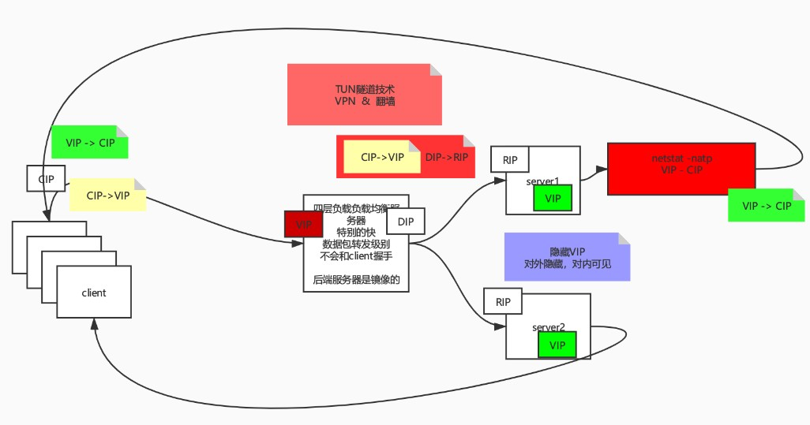

# 负载均衡产生背景

不要因为技术而技术！技术服务于业务，一定是当前的技术满足不了业务的发展才会产生新的技术来解决业务问题，负载均衡为什么能产生？那是因为有业务需求。

> 中国人口14亿，移动网络用户7亿，固网用户4亿，根据二八原则保守估计独立用户为2.4亿，他们具有消费能力。
>
> 假设你有一个idea，我一无是处只有钱，我当你的天使投资人给你第一笔投资，你会拿去干什么？毫无疑问是营销，营销谁？营销这2.4亿人，假设有2%的人（480万）看到了你的广告，有20%的人（96W）感兴趣下载了你的APP，你什么都不用做，光APP开屏广告就可以大赚一笔，当然96W人在用你的服务，这必然会造成高并发，说明高并发是真的！
>
> 高并发产生的日志，有一个字段表示来源站点（比如用户是通过百度点过来的还是微博点过来的），这就可以分析渠道流量，再通过和订单表一关联，就可以分析出渠道流量转化率，这有什么用？这直接明示你下一次该往哪个渠道营销！这说明高并发是有好处的！

有了高并发所以产生了负载均衡！

# LVS简介

LVS(Linux Virtual Server) Linux虚拟服务器

> **LVS**是**Linux Virtual Server**的简写，意即**Linux虚拟服务器**，是一个虚拟的服务器集群系统。本项目在1998年5月由[章文嵩](https://baike.baidu.com/item/章文嵩/6689425)博士成立，是中国国内最早出现的自由软件项目之一。

- https://baike.baidu.com/item/LVS/17738

# 网络基础
参考之前写的[不得不看的网络基础](../6Netty/2021-03-07_不得不看的网络基础.md)，很多基础的内容需要先阅读此文


# 总览


# 学习手册

更多细节查看

- LVS手册`man ipvsadm`
- keepalived手册`man keepalived`
- keepalived配置文件手册`man keepalived.conf`

# LVS调度算法

既然是负载均衡，那么后端肯定不止一台服务器，怎么去调度？LVS提供了下面的调度算法

## 静态调度
1. rr(Round Robin): 轮询
2. wrr(weight)：加权
3. sh(source hashing): 源地址散列
4. dh(Destination Hashing): 目标地址散列

## 动态调度
1. lc(Least-Connection): 最少连接
2. wlc(Weighted Least-Connection): 加权最少连接
3. sed(Shortest Expected Delay): 最短期望延迟
4. nq(never queue): 永不排队
5. LBLC(Locality-Based Least Connection): 基于本地的最少连接
7. LBLCR(Locality-Based Least Connections withReplication): 基于本地的带复制功能的最少连接

# LVS三种工作模式
名词定义：
- CIP: Client IP 客户端的IP
- VIP: Virtual IP LVS实例IP，一般是暴露在公网中的地址；向外部直接面向用户请求，作为用户请求的目标的IP地址
- DIP: Director IP，主要用于和内部主机通讯的IP地址
- RIP: Real IP 后端服务器的真实IP
- DS: Director Server 指的是前端负载均衡器节点
- RS: Real Server 后端真实的工作服务器

## NAT模式

NAT(Net Address Transition)即网络地址转换模式


图中黄色数据包是从客户端到LVS集群的，绿色数据包是从LVS集群到客户端的，大概过程如下：

1. 数据包CIP->VIP，如果直接将数据包塞给RS，RS会丢弃，因此LVS修改目标地址VIP为RIP（D-NAT），此时数据包变成CIP->RIP发给RS

2. RS处理完成后发送数据包RIP->CIP，这个数据包直接塞给客户端，客户端是不会收的，因为客户端是发给VIP的，但是回来就变成RIP给客户端的了，客户端也会丢弃，因此LVS修改源地址为VIP（S-NAT），此时数据包变成VIP->CIP发给客户端

整个过程保证一个原则：怎么来的就怎么回去，按照Socket四元组IP反向发回去！比如就客户端和LVS而言发来的是CIP->VIP，发回去就得是VIP->CIP，LVS和RS之间也是同样的道理

### 特点
- RS应该使用私有地址，DIP和RIP必须在同一个网段内，**RS的网关必须指向DIP**（因为最终给CIP的数据包要扔回给LVS）
- 请求和响应报文都需要经过Director Server，高负载场景中，LVS易成为性能瓶颈
- 支持端口映射
- RS可以使用任意操作系统

### 缺陷
- 对LVS压力会比较大，请求和响应都需经过LVS（一般来说流量是非对称/倾斜的，请求报文小，响应报文大）
- 不断得进行网络地址转换，消耗算力

既然响应报文太大，有没有办法让响应报文直接返回给CIP，不经过LVS？当然有，这就是DR模式

## DR模式

DR(Direct Router)即直接路由模式


数据包流向依然是黄色是去向的，绿色是回向的；RS有一个对内可见，对外隐藏的VIP

1. 数据包CIP->VIP发送给LVS
2. LVS通过修改MAC地址把数据包直接扔给RS，由于RS也有VIP，所以收下数据包
3. RS处理完成后，直接封数据包VIP->CIP，返回给客户端，不经过LVS


### 特征
- 保证前端路由将目标地址为VIP报文统统发给LVS，而不是RS（因为RS的VIP是隐藏的）
- RS可以使用私有地址；也可以是公网地址，如果使用**公网地址**，此时可以通过互联网对RIP进行直接访问
- RS跟LVS必须在同一个物理网络中（因为MAC地址欺骗/ARP欺骗就**只能发生在局域网中**）
- 所有的请求报文经由LVS，但响应报文必须**不能经过**LVS
- 不支持地址转换，也不支持端口映射（因为这是**链路层**/2层的处理，不涉及到IP）
- RS可以是大多数常见的操作系统
- RS的网关绝不允许指向DIP(因为我们不允许他经过LVS)
- RS上的lo接口配置VIP的IP地址（对外隐藏，对内可见）


### VIP对内可见，对外隐藏
参考[【ARP】Linux内核参数之arp_ignore和arp_announce](./参考文章/[ARP]Linux内核参数之arp_ignore和arp_announce.md)
内核参数(kernel parameter)定义了收到arp请求时的动作(`arp_ignore`)和主机通电时arp发起的动作(`arp_announce`)，比如针对`eth0`网卡的修改，文件路径如下：`/proc/sys/net/ipv4/conf/eth0/arp_ignore`

`/proc/`下面的文件都是进程虚拟文件，Linux中一切皆文件，内核中运行时的变量`arp_ignore`映射成了文件`/proc/sys/net/ipv4/conf/eth0/arp_ignore`，所以修改该文件是即时生效的！

#### arp_ignore
定义接收到ARP请求时的响应级别：
- 0：**只要**本地配置的有相应地址，就给予响应；（只要有ARP请求，就把本机所有网卡的MAC地址都给出去，主动型，不管你是否需要都给你）
- 1：**仅**在请求的目标(MAC)地址配置请求到达的接口上的时候，**才**给予响应；（有ARP请求，并且ARP请求的IP是本机某块网卡的IP时，才响应，被动型，问哪个IP就给哪个IP，不全给）；
#### arp_announce
定义将自己地址向外通告时的通告级别：
- 0：允许使用**任意网卡**上的IP地址作为arp请求的源IP，通常就是使用数据包的源IP；（发ARP请求时，本机上多块网卡的IP都可以作为源IP，可混用）
- 1：**尽量避免**使用不属于该发送网卡子网的本地地址作为发送arp请求的源IP地址；（发ARP请求时，尽量用自己的IP作为请求的源IP，注意尽量二字，万不得已还是可以借用别人的IP用一下，发生的情况可能是路由表的限制）
- 2：忽略IP数据包的源IP地址，选择该发送网卡上**最合适**的本地地址作为arp请求的源IP地址；（发ARP请求时，哪块网卡发的ARP请求，就用该网卡的IP地址，不能混用）

那么作为RS的VIP要达到对内隐藏，对外可见，需要怎么配置？

arp_ignore无疑应该配置成1，要隐藏，不问就不说

arp_announce应该配置成2，要隐藏，其他网卡发ARP请求时，肯定不能借用我的VIP，你这一借，不就把VIP暴露了么

### 缺陷
RS和LVS必须在同一机房中，很显然，ARP欺骗条件要求LVS和DS要在同一个物理局域网内，那有没有不需要再同一个局域网内的？但是是有，那就是隧道模式

## TUN模式

TUN(Tunnel)即隧道模式


所谓隧道，最简单的理解就是数据包套数据包，一个数据包背上另一个数据包，到了目的地再放下来，整个流程如下：

1. 数据包CIP->VIP发送给LVS
2. LVS在源数据包外面套一层形成[DIP->RIP[CIP->VIP]]，通过DIP->RIP将数据包发送给RS（DIP和RIP可以是不同的物理网络）
3. RS拆包接收到CIP->VIP的请求处理完成之后直接封数据包VIP->CIP，返回给客户端，不经过LVS


### 特征
- RIP、VIP、DIP全是公网地址
- RS的网关不会也不可能指向DIP
- 所有的请求报文经由LVS，但响应报文必须不能进过LVS
- 不支持端口映射
- RS的系统必须支持隧道  

# 总结
其实企业中最常用的是DR实现方式，而NAT配置上比较简单和方便，TUN模式则是综合了DR和NAT的优点


# LVS实验手册

本次实验以最常用的DR模式作为目标

## 实验环境准备

以下实验均基于CentOS7.5，docker 19.03.6，以下命令均在宿主机执行

为什么要在docker中实验？因为LVS涉及到的角色太多，需要很多台不同IP的服务器，而在docker中可以创建很多独立的容器来模拟，足够轻巧和方便，降低整个实验的成本！

- 宿主机CentOS开启ipvs内核模块

    ipvs虽然是Linux内核模块，但是默认是没有开启的，需要手动开启，因为docker和宿主机是公用内核，所以宿主机开启了docker里面自动开启，否则docker内即使装上ipvsadm也会报错：`Can't initialize ipvs: Protocol not available`
    1. 开启ipvs模块
    
    ```bash
    modprobe ip_vs
    modprobe ip_vs_wrr
    ```
    
    2. 查看是否开启成功：`lsmod | grep ip_vs`，回显如下说明开启成功
    
    ```
    ip_vs_wrr              12697  0 
    ip_vs                 145458  2 ip_vs_wrr
    ...
    ```


- 准备docker容器
  
    node1到node4分别为LVS、RS1、RS2、LVS备用(为啥需要个备用？后面用来做主备高可用)，注意要加上参数`--privileged`运行，因为我们的目的是把docker当虚拟机用，要在里面安装服务，并不是有现成的服务已经在虚拟机里面了，详情参考：搜索关键词`docker使用centos的systemctl`
    ```bash
    docker run -dit --name node1 --privileged centos /usr/sbin/init
    docker run -dit --name node2 --privileged centos /usr/sbin/init
    docker run -dit --name node3 --privileged centos /usr/sbin/init
    docker run -dit --name node4 --privileged centos /usr/sbin/init
    ```
 - 准备IP
    ```bash
    node1IP=`docker inspect -f '{{range .NetworkSettings.Networks}}{{.IPAddress}}{{end}}' node1`
    node2IP=`docker inspect -f '{{range .NetworkSettings.Networks}}{{.IPAddress}}{{end}}' node2`
    node3IP=`docker inspect -f '{{range .NetworkSettings.Networks}}{{.IPAddress}}{{end}}' node3`
    node4IP=`docker inspect -f '{{range .NetworkSettings.Networks}}{{.IPAddress}}{{end}}' node4`
    nodeVIP='172.17.0.100'
    ```
 - 给所有容器添加IP环境变量，后面的命令就可以直接用上面提到的几个IP了，免得每次都要去定义
    ```bash
    docker exec -it node1 bash -c "echo node1IP=$node1IP >> ~/.bashrc && echo node2IP=$node2IP >> ~/.bashrc && echo node3IP=$node3IP >> ~/.bashrc && echo node4IP=$node4IP >> ~/.bashrc && echo nodeVIP=$nodeVIP >> ~/.bashrc" && \
    docker exec -it node2 bash -c "echo node1IP=$node1IP >> ~/.bashrc && echo node2IP=$node2IP >> ~/.bashrc && echo node3IP=$node3IP >> ~/.bashrc && echo node4IP=$node4IP >> ~/.bashrc && echo nodeVIP=$nodeVIP >> ~/.bashrc" && \
    docker exec -it node3 bash -c "echo node1IP=$node1IP >> ~/.bashrc && echo node2IP=$node2IP >> ~/.bashrc && echo node3IP=$node3IP >> ~/.bashrc && echo node4IP=$node4IP >> ~/.bashrc && echo nodeVIP=$nodeVIP >> ~/.bashrc" && \
    docker exec -it node4 bash -c "echo node1IP=$node1IP >> ~/.bashrc && echo node2IP=$node2IP >> ~/.bashrc && echo node3IP=$node3IP >> ~/.bashrc && echo node4IP=$node4IP >> ~/.bashrc && echo nodeVIP=$nodeVIP >> ~/.bashrc"
    ```
- 测试结束后销毁所有容器
    ```bash
    docker stop node1 node2 node3 node4 && docker rm node1 node2 node3 node4
    ```

## DR
参考

分别登陆node1(LVS)、node2(RS1)、node3(RS2)

### RS配置

​	进入node2和node3配置

```bash
# 安装ifconfig nginx
yum install -y  net-tools nginx 

# 修改内核参数（实现对内可见、对外隐藏）
echo 1 > /proc/sys/net/ipv4/conf/eth0/arp_ignore
echo 1 > /proc/sys/net/ipv4/conf/all/arp_ignore
echo 2 > /proc/sys/net/ipv4/conf/eth0/arp_announce
echo 2 > /proc/sys/net/ipv4/conf/all/arp_announce

# 添加VIP（对内可见、对外隐藏） 注意掩码必须是255.255.255.255
# 因为VIP是绑在环回网卡上（回环网卡离内核更近，数据包优先匹配）的，如果掩码不是4个255，则数据包在返回的时候匹配上了回环网卡，匹配不上真实网关，数据包发送不出去
ifconfig lo:vip ${nodeVIP} netmask 255.255.255.255

# 启动nginx
systemctl start nginx

# 给不同RS添加各自IP用于区分 
echo `ifconfig $name | grep "inet.*broadcast.*" | cut -d' ' -f10` > /usr/share/nginx/html/index.html

```
### LVS配置

​	进入node1配置

```bash
# 安装ifconfig ipvsadm命令
yum install -y net-tools ipvsadm

# 添加VIP 这里掩码是16还是24根据具体情况而定
ifconfig eth0:vip ${nodeVIP}/16

# 清空所有规则
ipvsadm -C

# -A添加流量进入规则
ipvsadm -A  -t ${nodeVIP}:80  -s rr

# 在上面的进入规则下面添加流量出去（分发给RS）的规则
ipvsadm -a  -t ${nodeVIP}:80  -r  ${node2IP} -g -w 1
ipvsadm -a  -t ${nodeVIP}:80  -r  ${node3IP} -g -w 1

```

查看规则`ipvsadm -ln`，输出如下，说明成功负载到了node2和node3

```bash
IP Virtual Server version 1.2.1 (size=4096)
Prot LocalAddress:Port Scheduler Flags
  -> RemoteAddress:Port           Forward Weight ActiveConn InActConn
TCP  172.17.0.100:80 rr
  -> 172.17.0.4:80                Route   1      0          0         
  -> 172.17.0.5:80                Route   1      0          0      
```

### 测试

在宿主机下面执行循环访问

```bash
while true; do curl ${nodeVIP}; sleep 1 ;done
```

- node1中：
    1. `netstat -natp`看不到很多socket链接 
    2. `ipvsadm -lnc`查看偷窥小本本
       
        ``` 
        TCP 01:42  FIN_WAIT    172.17.0.1:55416   172.17.0.100:80    172.17.0.4:80
        FIN_WAIT： 连接过，偷窥了所有的包
        SYN_RECV： 基本上lvs都记录了，证明lvs没事，一定是后边网络层出问题
        ```
- node2和node3中：
  
    1. `netstat -natp`看到很多socket链接

## DR模式 + Keepalived

LVS可以实现高并发，但是也存在**单点故障**的问题，LVS挂了就不能响应请求，要实现高可用【HA(High Available)高可用】怎么办，很简单，一变多，一变多分为

- 主备
- 主从
- 主主

此处肯定是用主备，主备健康监测又分为两种
- 每个备轮询主是否挂了，挂了就顶上去，备发给主，主没挂就返回，数据包一去一回总共跑两次
- 主主动给所有备广播健康包，当备一段时间没收到主发的健康包就认为主挂了，自己顶上去，这样数据包只用跑一次

很显然是第二种好，`Keepalived`也是采用的这种方式

### RS配置
进入node2和node3配置（和DR模式配置一样）

### Keepalived配置

通过查看手册`man keepalived.conf`了解更多配置文件的细节

进入node1和node4配置

```bash
# 安装ifconfig ipvsadm keepalived命令
yum install -y net-tools ipvsadm keepalived

# 备份keepalived原配置文件
cp /etc/keepalived/keepalived.conf /etc/keepalived/keepalived.conf.bak

# 修改配置文件，本例而言如下，不需要的东西去掉
# 主机备机设置的选项不同，主要是state和priority不同
cat > /etc/keepalived/keepalived.conf <<EOF
vrrp_instance VI_1 {
    state MASTER  # 如果是备机的话使用 BACKUP
    interface eth0
    virtual_router_id 51
    priority 100  # 优先级，主机优先级肯定要比备机高
    advert_int 1
    authentication {
        auth_type PASS
        auth_pass 1111
    }
    virtual_ipaddress {
        ${nodeVIP}/16 dev eth0 label eth0:vip # VIP的设置
    }
}

# 虚拟主机设置
virtual_server ${nodeVIP} 80 {
    delay_loop 6
    lb_algo rr  # 轮询
    lb_kind DR  # DR模式
    # 持久化时间超时，避免三次握手打散在不同的RS上，根据具体情况设置，本例实验所以设置为0
    persistence_timeout 0 
    protocol TCP

    # RS1
    real_server ${node2IP} 80 {
        weight 1
        HTTP_GET {
            url {
              path /
              status_code 200  # 健康检查状态码为200
            }
            connect_timeout 3
            retry 3
            delay_before_retry 3
        }
    }
    
    # RS2
    real_server ${node3IP} 80 {
        weight 1
        HTTP_GET {
            url {
              path /
              status_code 200
            }
            connect_timeout 3
            retry 3
            delay_before_retry 3
        }
    }
}
EOF

# 启动keepalived
systemctl start keepalived

```
查看VIP是否生效`ifconfig`，查看ipvs规则是否生效`ipvsadm -ln`

正常的情况应该是node1 VIP生效，node4没有生效，等node1挂掉之后自己顶上去！

### 测试

- node1挂掉，检测node4是否生效（node4生效）

1. node1上执行`systemctl stop keepalived`
2. 在宿主机查看服务是否还能访问`curl ${nodeVIP}`，发现能访问，说明node4顶上去了！
3. 在node4上执行`ifocnfig`查看vip网卡是否生效，发现生效！
4. 启动node1：`systemctl start keepalived`
5. 继续访问，发现能访问，并且在node4上的vip网卡自动失效！


- node2挂掉，检测请求是否还继续打在node2上

1. 在node2上执行`systemctl stop nginx`
2. 在宿主机查看服务是否还能访问`curl ${nodeVIP}`，发现能访问，且没有访问到node2上
3. 启动node2：`systemctl start nginx `
4. 继续访问多次，发现访问到了node2

### 总结

keepalived在主机挂掉之后备机自动顶上去，在主机恢复之后备机自动下线，并且还具有对后端服务器的健康检查


