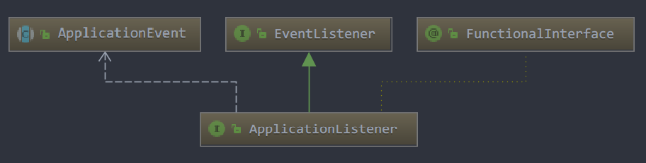

# 看现象

## maven依赖

我们只测试IOC容器，因此只需要引入`spring-context`即可

```xml
    <dependencies>
        <!--测试框架-->
        <dependency>
            <groupId>junit</groupId>
            <artifactId>junit</artifactId>
            <version>RELEASE</version>
            <scope>test</scope>
        </dependency>
        <!--假数据声场-->
        <dependency>
            <groupId>com.github.javafaker</groupId>
            <artifactId>javafaker</artifactId>
            <version>1.0.2</version>
        </dependency>

        <!--IOC-->
        <dependency>
            <groupId>org.springframework</groupId>
            <artifactId>spring-context</artifactId>
            <version>RELEASE</version>
        </dependency>
        
    </dependencies>
  
```

## 测试用例

```java

/**
 * 测试spring的ioc容器
 */
public class TestSpringIOC {

    @Test
    public void test(){
        // create and configure beans
        ApplicationContext context = new ClassPathXmlApplicationContext("ioc/services.xml","ioc/daos.xml");

        // retrieve configured instance
        UserService service = context.getBean("userService", UserService.class);

        // use configured instance
        System.out.println();
        System.out.println("测试注入-------------------------------------------------");
        List<User> userList = service.findUsers(20);
        userList.stream().forEach(System.out::println);


        AwareTestService awareTestService = (AwareTestService)context.getBean("awareTestService");
        System.out.println();
        System.out.println("测试Aware-------------------------------------------------");
        awareTestService.test();


        AwareTestService awareTestServiceAlias = (AwareTestService)context.getBean("awareTestServiceAlias");
        System.out.println();
        System.out.println("测试bean别名---------------------------------------------------");
        System.out.println(awareTestServiceAlias == awareTestService);//true
    }
}

```

测试用例里面引入了两个配置文件：`services.xml`和`daos.xml`，看看里面写了啥（引用到的类文末有代码清单）

- `services.xml`

```xml
<?xml version="1.0" encoding="UTF-8"?>
<beans xmlns="http://www.springframework.org/schema/beans"
       xmlns:xsi="http://www.w3.org/2001/XMLSchema-instance"
       xsi:schemaLocation="http://www.springframework.org/schema/beans
        https://www.springframework.org/schema/beans/spring-beans.xsd">

    <!-- services -->
    <bean id="userService" class="com.spring.service.impl.UserServiceImpl">
        <property name="userDao" ref="userDao"/><!--此处没定义但是在daos.xml里面定义了-->
        <!-- additional collaborators and configuration for this bean go here -->
    </bean>

    <bean id="awareTestService" class="com.spring.service.impl.AwareTestServiceImpl">
    </bean>

    <!--Bean可以定义别名 如果使用注解@Bean，也可以使用别名，详细见@Bean这个注解源码的注释-->
    <alias name="awareTestService" alias="awareTestServiceAlias"/>
    <!-- more bean definitions for services go here -->

    <!--beanProcessor定义-->
    <bean class="com.spring.config.MyBeanPostProcessor"></bean>

</beans>
```

- `daos.xml`

```xml
<?xml version="1.0" encoding="UTF-8"?>
<beans xmlns="http://www.springframework.org/schema/beans"
       xmlns:xsi="http://www.w3.org/2001/XMLSchema-instance"
       xsi:schemaLocation="http://www.springframework.org/schema/beans
        https://www.springframework.org/schema/beans/spring-beans.xsd">

    <!-- daos -->
    <bean id="userDao" class="com.spring.dao.impl.UserDaoImpl">
    </bean>

    <!-- more bean definitions for daos go here -->

</beans>
```

## 运行结果

```
初始化 before--实例化的bean对象之前:com.spring.dao.impl.UserDaoImpl@3cb1ffe6	userDao
初始化 after...实例化的bean对象之后:com.spring.dao.impl.UserDaoImpl@3cb1ffe6	userDao
初始化 before--实例化的bean对象之前:com.spring.service.impl.UserServiceImpl@43bd930a	userService
初始化 after...实例化的bean对象之后:com.spring.service.impl.UserServiceImpl@43bd930a	userService
初始化 before--实例化的bean对象之前:com.spring.service.impl.AwareTestServiceImpl@33723e30	awareTestService
初始化 after...实例化的bean对象之后:com.spring.service.impl.AwareTestServiceImpl@33723e30	awareTestService

测试注入-------------------------------------------------
User{name='范烨霖', age=17, phone='17647798623', location='瓦房店'}
User{name='尹擎苍', age=56, phone='17314101961', location='泸州'}
...

测试Aware-------------------------------------------------
Spring中的6大自动注入aware接口
true
...

测试bean别名---------------------------------------------------
true

```

## 思考

xml文件里面配置了bean，那么Spring是怎么将这些bean初始化到IOC容器的呢？IOC容器具体是什么呢？

# IOC容器初始化流程

开局一张图


# 几大主要的类
## AbstractBeanDefinitionReader
抽象的bean定义reader，不管你是从哪里读取，是从XML，还是注解读取，都提供统一的接口对外暴露读取bean定义的接口，单独抽象了这一层出来屏蔽掉XML或者注解读取


## AbstractApplicationContext
抽象应用上下文，应用了模板方法模式，下面简称应用上下文或上下文


## AbstractBeanFactory
抽象Bean工厂，运用模板方法模式，下面简称bean工厂或工厂


## ConfigurableEnvironment
当前容器运行的环境，里面包含了一些JDK的系统属性等等，可以通过实现`EnvironmentAware`接口拿到当前的容器环境


## BeanFactoryPostProcessor
里面有一方法`postProcessBeanFactory`，顾名思义这是在工厂生产bean之前对工厂本身调用的回调函数，千万要和`BeanPostProcessor`区分开来

## BeanPostProcessor
里面有俩方法`postProcessBeforeInitialization`和`postProcessAfterInitialization`，大腿想一想这应该是在bean初始化之前和初始化之后要调用的回调函数

## ApplicationListener
用大腿想一下这玩意儿应该是注册事件用的，在容器初始化的不同阶段调回调函数


# IOC容器执行流程

```java
ApplicationContext context = new ClassPathXmlApplicationContext("services.xml");
```

就这么一句话就初始化了Spring的IOC容器，怎么初始化的？

## 1.初始化顶层对象AbstractApplicationContext

这方法

```java
public ClassPathXmlApplicationContext(String[] configLocations, boolean refresh, @Nullable ApplicationContext parent)throws BeansException {
    super(parent);
    setConfigLocations(configLocations);
    if (refresh) {
        refresh();
    }
}
```
`ClassPathXmlApplicationContext`一看就是`AbstractApplicationContext`的子类，这里用了模板方法，其他的各种`ApplicationContext`公用`AbstractApplicationContext`中的通用方法，其他要自己实现的子类去实现即可 ，```super(parent)```这句话不断往父类调，调到`AbstractApplicationContext`为止，此时加载`AbstractApplicationContext`并且初始化其中的一些成员变量，比如容器ID，一些`Map`，一些锁之类的东西

题外话：
`AbstractApplicationContext`中的一些锁是这么定义的，取名叫`XXXmonitor`，实际上就是个空对象，拿给容器启动关闭的时候配合`syncronized`使用，这也说明了java中的`syncronized`，锁的就是对象

```java
/** Synchronization monitor for the "refresh" and "destroy". */
private final Object startupShutdownMonitor = new Object();
```

## 2.引入配置文件
引入配置就这句话，接收`classpath`下面的xml文件路径
```java
setConfigLocations(configLocations);
```
这句话没啥好说的就赋个值，需要注意的是里面初始化了容器环境，就下面这句话，是在`AbstractApplicationContext`定义的
```java
public ConfigurableEnvironment getEnvironment() {
    if (this.environment == null) {
        this.environment = createEnvironment();
    }
    return this.environment;
}
```

## 3.refresh
重点来了，`refresh`是在`AbstractApplicationContext`中定义的，字面叫刷新，刷新啥？人家源码里面注释都说了：加载或者刷新可能从XML文件，`properties`文件，数据库等文件的配置并持久化，说白了就是根据配置实例化bean，这里面又有很多步骤，不是简简单单实例化三个字可以表述清楚的

源码在此，别人每句话都写上了注释，我们挨个来看
```java
synchronized (this.startupShutdownMonitor) {
    // 3.1 Prepare this context for refreshing.
    prepareRefresh();

    // 3.2 Tell the subclass to refresh the internal bean factory.
    ConfigurableListableBeanFactory beanFactory = obtainFreshBeanFactory();

    // 3.3 Prepare the bean factory for use in this context.
    prepareBeanFactory(beanFactory);

    try {
        // 3.4 Allows post-processing of the bean factory in context subclasses.
        postProcessBeanFactory(beanFactory);

        // 3.5 Invoke factory processors registered as beans in the context.
        invokeBeanFactoryPostProcessors(beanFactory);

        // 3.6 Register bean processors that intercept bean creation.
        registerBeanPostProcessors(beanFactory);

        // 3.7 Initialize message source for this context.
        initMessageSource();

        // 3.8 Initialize event multicaster for this context.
        initApplicationEventMulticaster();

        // 3.9 Initialize other special beans in specific context subclasses.
        onRefresh();

        // 3.10 Check for listener beans and register them.
        registerListeners();

        // 3.11 Instantiate all remaining (non-lazy-init) singletons.
        finishBeanFactoryInitialization(beanFactory);

        // 3.12 Last step: publish corresponding event.
        finishRefresh();
    }

    catch (BeansException ex) {
        if (logger.isWarnEnabled()) {
            logger.warn("Exception encountered during context initialization - " +
                    "cancelling refresh attempt: " + ex);
        }

        // Destroy already created singletons to avoid dangling resources.
        destroyBeans();

        // Reset 'active' flag.
        cancelRefresh(ex);

        // Propagate exception to caller.
        throw ex;
    }

    finally {
        // Reset common introspection caches in Spring's core, since we
        // might not ever need metadata for singleton beans anymore...
        resetCommonCaches();
    }
}
```
### 3.1 刷新前的准备工作：prepareRefresh
刷新之前的准备工作，准备啥？准备了容器启动时间，容器状态标志位的设置，初始化一些装事件监听器的容器，这些没啥说的，看源码就知道

注意：此处有一个回调函数，说的很清楚，准备的时候子类可以干点事情，干子类自己的事情，当然我们这个子类`ClassPathXmlApplicationContext`比较懒，它啥也没干
```java
protected void initPropertySources() {
    // For subclasses: do nothing by default.
}
```

### 3.2 初始化bean工厂 obtainFreshBeanFactory
这个是重点，重量级角色`BeanFactory`登上历史舞台，看注释：告诉子类让子类刷新内部的`BeanFactory`，啥意思？就是说这个`BeanFactory`你子类去实现，我（容器上下文）不管你子类new的啥工厂，反正你给我new好了，用的时候我调用模板方法你子类返回给我，我做一些公共的方法即可，这也是面向接口编程的好处，我不持有具体的引用

具体是那个类在new工厂？看下面

`AbstractRefreshableApplicationContext.refreshBeanFactory()`在`new`这个工厂，这个`AbstractRefreshableApplicationContext`是`ClassPathXmlApplicationContext`的父类，看到了吧，它就是一层包一层，一层实现一点点功能，然后组合嵌套起来实现大功能

```java
...
DefaultListableBeanFactory beanFactory = createBeanFactory(); //new一工厂
beanFactory.setSerializationId(getId());//工厂的序列化id和上下文的id是一样的，getId()就是上下文的id
customizeBeanFactory(beanFactory);//
loadBeanDefinitions(beanFactory);//重点来了，此处才在通过XML文件读取成bean的定义
synchronized (this.beanFactoryMonitor) {
    this.beanFactory = beanFactory;
}
...
    
    
AbstractRefreshableApplicationContext#createBeanFactory()方法
protected DefaultListableBeanFactory createBeanFactory() {
    return new DefaultListableBeanFactory(getInternalParentBeanFactory());
}
```
我们可以看到`new`了一个`DefaultListableBeanFactory`工厂，`loadBeanDefinitions`将XML文件读取成bean定义，此时才真正开始读取XML文件，真正的读取是在`XmlBeanDefinitionReader#doLoadBeanDefinitions`和`doRegisterBeanDefinitions`方法中进行的，`Spring`中，凡是`doXXX`都是真正干活的方法，怎么读取的具体请看源码，大多都是一些很繁琐的细节，只要知道在这里读取就OK


### 3.3 为当前上下文准备一下bean工厂 prepareBeanFactory
配置工厂的标准上下文特征，例如上下文的类加载器和后处理器。这啥意思，就是说这个工厂我现在要准备在上下文用了，你给我初始化一些东西，初始化啥？就是把`spring`的一些内部对象给放到了bean工厂里面，可见，上下文需要的一些bean也是放在bean工厂里面的

- 注意此处注册了俩`BeanPostProcessor`，分别是`ApplicationContextAwareProcessor`和`ApplicationListenerDetector`
    - `ApplicationContextAwareProcessor`：在bean初始化之前注入一些实现了特殊的Aware的接口的bean
        - 如果你的bean实现了下面六个Aware接口，分别是`ApplicationContext`、ApplicationEventPublisher、`StringValueResolver`、`Environment`、`MessageSource`、`ResourceLoader`
        - 这些都是spring内部对象，如果使用了他们，将和spring框架耦合，如非特殊情况不建议使用，具体使用方法见```AwareTestServiceImpl.java```，设置`setter`即可注入
    
    - `ApplicationListenerDetector`：在bean初始化完成之后检测此bean是否是`ApplicationListener`，如果是的话在上下文里面注册一下
- 忽略一些bean工厂接口，上面那六个Aware接口是bean工厂自己用的，那实例化bean的时候就不管他们了，具体看代码
```java
beanFactory.ignoreDependencyInterface(EnvironmentAware.class);
beanFactory.ignoreDependencyInterface(EmbeddedValueResolverAware.class);
beanFactory.ignoreDependencyInterface(ResourceLoaderAware.class);
beanFactory.ignoreDependencyInterface(ApplicationEventPublisherAware.class);
beanFactory.ignoreDependencyInterface(MessageSourceAware.class);
beanFactory.ignoreDependencyInterface(ApplicationContextAware.class);
```
- 向bean工厂注册一些依赖，像容器上下文、事件发布器之类的东西注册给bean工厂，怎么注册？就是放到向bean工厂里面的map而已
- 还注册了一些系统需要的单例bean，名字都是写死的，比如`environment`、`systemProperties`、`systemEnvironment`

看一下`DefaultListableBeanFactory`这个bean工厂的源码，里面一堆一堆的map，map用来干啥？用来注册一堆一堆不同类型的bean，具体你看每个map上面的注释，大概就能猜到它是干啥用的

总之，这个方法完善了bean工厂，给bean工厂放入了一些自己需要的资源，我们来看下`DefaultListableBeanFactory`里面都有些啥成员变量
```java
//TODO
```
### 3.4 预处理bean工厂 postProcessBeanFactory
预处理什么？谁来预处理？，这就是个空方法，留给具体的上下文实现，注释写的很清楚，这是留给具体上下文即子类来实现的，代码运行到这里

说明bean工厂已经初始化好了，但是还没有实例化bean，子类可以在这里注册一些特殊的BeanPostProcessors

所以预处理什么？ 抽象上下文的子类想对bean工厂做点什么你可以做，做啥你子类自己应该知道

谁来预处理？当然是抽象上下文的子类来做，当然`ClassPathXmlApplicationContext`比较懒，他啥也没做


### 3.5 调用bean工厂的预处理 invokeBeanFactoryPostProcessors
什么叫调用bean工厂的处理？就是说在bean工厂配置好后，bean实例化之前对bean工厂本身要做的一些配置，就在这里进行，你可以看到一堆一堆的`Processors`，`Processors`顾名思义就是处理器嘛

看下抽象上下文的```addBeanFactoryPostProcessor```方法，就是往抽象上下文里面不断装```BeanFactoryPostProcessor```，当然你也可以拿到抽象上下文实例去往里面装自己的```BeanFactoryPostProcessor```，明白了么。框架的东西就是到处给提供了很多扩展，你可以往里面加自己的逻辑处理

这是抽象上下文里面进行处理的，看看具体处理了啥，目标方法为```PostProcessorRegistrationDelegate.invokeBeanFactoryPostProcessors(beanFactory, getBeanFactoryPostProcessors());```，这就是个静态方法嘛，你可以理解成工具方法
```java
// Invoke BeanDefinitionRegistryPostProcessors first, if any.
//对BeanDefinitionRegistry做了个特殊处理
if (beanFactory instanceof BeanDefinitionRegistry) {
    ...
} else {
    // Invoke factory processors registered with the context instance.
    //对于已经注册了的BeanFactoryPostProcessors，挨个开始应用
    invokeBeanFactoryPostProcessors(beanFactoryPostProcessors, beanFactory);
}

// Do not initialize FactoryBeans here: We need to leave all regular beans
// uninitialized to let the bean factory post-processors apply to them!
String[] postProcessorNames =
        beanFactory.getBeanNamesForType(BeanFactoryPostProcessor.class, true, false);

// Separate between BeanFactoryPostProcessors that implement PriorityOrdered,
// Ordered, and the rest.
List<BeanFactoryPostProcessor> priorityOrderedPostProcessors = new ArrayList<>();
List<String> orderedPostProcessorNames = new ArrayList<>();
List<String> nonOrderedPostProcessorNames = new ArrayList<>();
for (String ppName : postProcessorNames) {
    if (processedBeans.contains(ppName)) {
        // skip - already processed in first phase above
    }
    else if (beanFactory.isTypeMatch(ppName, PriorityOrdered.class)) {
        priorityOrderedPostProcessors.add(beanFactory.getBean(ppName, BeanFactoryPostProcessor.class));
    }
    else if (beanFactory.isTypeMatch(ppName, Ordered.class)) {
        orderedPostProcessorNames.add(ppName);
    }
    else {
        nonOrderedPostProcessorNames.add(ppName);
    }
}

// First, invoke the BeanFactoryPostProcessors that implement PriorityOrdered.
sortPostProcessors(priorityOrderedPostProcessors, beanFactory);
invokeBeanFactoryPostProcessors(priorityOrderedPostProcessors, beanFactory);

// Next, invoke the BeanFactoryPostProcessors that implement Ordered.
List<BeanFactoryPostProcessor> orderedPostProcessors = new ArrayList<>(orderedPostProcessorNames.size());
for (String postProcessorName : orderedPostProcessorNames) {
    orderedPostProcessors.add(beanFactory.getBean(postProcessorName, BeanFactoryPostProcessor.class));
}
sortPostProcessors(orderedPostProcessors, beanFactory);
invokeBeanFactoryPostProcessors(orderedPostProcessors, beanFactory);

// Finally, invoke all other BeanFactoryPostProcessors.
List<BeanFactoryPostProcessor> nonOrderedPostProcessors = new ArrayList<>(nonOrderedPostProcessorNames.size());
for (String postProcessorName : nonOrderedPostProcessorNames) {
    nonOrderedPostProcessors.add(beanFactory.getBean(postProcessorName, BeanFactoryPostProcessor.class));
}
invokeBeanFactoryPostProcessors(nonOrderedPostProcessors, beanFactory);

// Clear cached merged bean definitions since the post-processors might have
// modified the original metadata, e.g. replacing placeholders in values...
beanFactory.clearMetadataCache();
```
仔细看看上面的源码，都有注释的，沉下心去看是个人肯定能看懂的：

- 最开始，初始化一个`processedBeans`的`list`，装已经执行过的`processors`，避免重复执行
- 首先，对`BeanDefinitionRegistry`这种特殊的工厂特殊处理，这个先略过，咱们这个不是`BeanDefinitionRegistry`
- 走`else`逻辑，挨个把从上下文传进来的`beanFactoryPostProcessors`执行了一遍，这样不就完了吗？还没完，继续看下面
- ```beanFactory.getBeanNamesForType```从bean工厂里面拿出```BeanFactoryPostProcessor```！除了上下文传进来的Processor，bean工厂里面可能还有！
- 下面就比较有趣了，创建了仨list，看名字就知道和优先级有关系，就是说执行是有优先级的，优先级高的先执行，优先级低的后执行，没有优先级的最后执行
- 所以就这么个东西。把所有的`processors`，bean工厂里面的，上下文里面的拿出来执行一遍，虽然代码看起来多，但就干了这么个事


### 3.6 注册BeanPostProcessors registerBeanPostProcessors
顾名思义，注册`BeanPostProcessors`，大胆猜想一些，就是把`BeanPostProcessors`放到bean工厂的map里面去，注意这里是在注册，而不是执行，看方法前面都有个`register`

`BeanPostProcessors`是啥，看它接口的定义，俩方法：```postProcessBeforeInitialization```、```postProcessAfterInitialization```，一个是在bean被初始化之前调用，一个是在bean初始化之后调用，说白了就是回调函数，一定要和`BeanFactoryPostProcessors`区分开来，前者是针对bean的，后者是针对bean工厂的，名字里面都有个Factory嘛，已经很明显了

就一句话```PostProcessorRegistrationDelegate.registerBeanPostProcessors(beanFactory, this);```，里面的逻辑和`invokeBeanFactoryPostProcessors`差不多，也是把`processors`分为了带优先级的，带顺序的和不带顺序的，还有一种叫做内部的，把这几种放入bean工厂的map里面，再次强调，此时只是注册，还没有开始执行！！！

其实，`BeanPostProcessors`运用了责任链的设计模式。重写自己的`processors`参考代码`MyBeanPostProcessor`，然后在xml文件里面注册这个bean，当然不注册也可以手动在context里面添加，不管怎么样只要能放到bean工厂里面的map就行了

多说一句：
- 在xml里面定义的`processor`会成为bean定义读取到bean工厂中，注册`processor`的时候有这样一段代码，从bean工厂的bean定义里面拿`processor`对应的就是xml注册的方式
    ```java
    String[] postProcessorNames = beanFactory.getBeanNamesForType(BeanPostProcessor.class, true, false);
    ```
- 直接调用`addBeanPostProcessor`，这就没啥好说的，直接放到bean工厂map里面，上面xml的方式最终其实也是调用了该方法而已


### 3.7 为当前上下文初始化消息源 initMessageSource
啥消息源？这是spring为了支持国际化，具体参考https://blog.csdn.net/SLN2432713617/article/details/94592813

### 3.8 初始化事件广播 initApplicationEventMulticaster
怎么去初始化？有就不管，没有就创建一个嘛，刚开始明显没有，所以创建了一个```SimpleApplicationEventMulticaster```，```SimpleApplicationEventMulticaster```是个啥？就是一个事件广播器，啥叫广播器？就是广播一个事件，所有的监听器都去响应这个事件，监听器就是`ApplicationListener`，注册监听器就是`registerListeners`做的事情
1. 思考一下：为什么要去检查此时有没有事件广播器？
    - 去哪里检查？去bean工厂检查
    - 为什么要检查？因为我们可以在xml文件中自定义```SimpleApplicationEventMulticaster```，向下面这样，这样定义的广播器在bean工厂里面，所以要去检查一下
    ```xml
    <!-- 定义applicationEventMulticaster，注入线程池和errorHandler,此处使用系统自带的广播器，也可以注入其他广播器， -->
    <bean name="applicationEventMulticaster" class="org.springframework.context.event.SimpleApplicationEventMulticaster">
      <property name="taskExecutor" ref="executor"></property>
      <property name="errorHandler" ref="errorHandler"></property>
    </bean>
    ```
    - 其实我们可以在xml中定义很多spring自己的需要的对象，比如上面的广播器，定义的都在bean工厂里面，所以你会看到很多地方都会在bean工厂里面先检查一下有没有已经定义好的
2. 事件广播器的最佳实践是用线程池进行异步调用，看下```SimpleApplicationEventMulticaster```的```multicastEvent```方法，里面判断了如果有线程池就放到线程池里执行
    - xml里面类似于这样
        ```xml
        <!-- 定义applicationEventMulticaster，注入线程池和errorHandler,此处使用系统自带的广播器，也可以注入其他广播器， -->
        <bean name="applicationEventMulticaster" class="org.springframework.context.event.SimpleApplicationEventMulticaster">
            <property name="taskExecutor" ref="executor"></property>
            <property name="errorHandler" ref="errorHandler"></property>
        </bean>
        ```
    - 注解类似于这样（springboot）
        ```xml
        <!-- 定义applicationEventMulticaster，注入线程池和errorHandler,此处使用系统自带的广播器，也可以注入其他广播器， -->
        <bean name="applicationEventMulticaster" class="org.springframework.context.event.SimpleApplicationEventMulticaster">
            <property name="taskExecutor" ref="executor"></property>
            <property name="errorHandler" ref="errorHandler"></property>
        </bean>
        ```
3. springboor广播器的使用请参考模块```springboot-mybatis-plus```里面的```TestEvent.java```

### 3.9 再刷新上下文中调用 onRefresh
这又是一个回调方法，前面有一个`postProcessBeanFactory`也是拿给子类回调的，不细说了


### 3.10 注册事件监听器 registerListeners
注册监听器，不是注册给上下文，是注册给广播器，```getApplicationEventMulticaster```拿到的就是事件广播器，是在```initApplicationEventMulticaster```中初始化的，说白了就是放在了事件广播器的map里面

也就是说，有事件产生的时候，广播器挨个通知所有的监听器，让他们执行相应的动作，怎么通知？一个for循环挨个执行下就好了


### 3.11 重点来了：初始化所有非懒加载的bean finishBeanFactoryInitialization
上面铺垫了这么久，现在终于可以开始初始化所有bean了，再次强调，是初始化所有非懒加载！！的bean，用递归的来初始化bean以及bean里面的依赖！

核心是反射，里面有一堆一堆的判断条件，还有条件很深的递归，跟代码很容易就晕了，下面演示了空构造方法，里面依赖有一个bean的实例化，即userService，userService里面依赖了userDao

- ```DefaultListableBeanFactory.preInstantiateSingletons```：开始挨个实例化bean，是bean工厂在干这事
    ```java
    for (String beanName : beanNames) {
        //这里就在挨个循环处理
        ...
        else {
            getBean(beanName);
        }    
    }
    ```
    - ```AbstractBeanFactory.doGetBean```：凡是带do的方法都是实际干活儿的方法，```doGetBean```也不例外，注意这里藏着条件很深的递归，用大腿想想都知道，我要实例化的bean里面依赖另外未实例化的bean，那么我是不是得实例化到最深处？答案是肯定的
      
        - ```AbstractBeanFactory.createBean```：是定义在`AbstractBeanFactory`的空方法，子类自己去实现
          
            - ```AbstractAutowireCapableBeanFactory.doCreateBean```：这才是真正干活的方法，和下面的```populateBean```是平级的
              
                ```java
                instanceWrapper = createBeanInstance(beanName, mbd, args);
                ```
                - ```AbstractAutowireCapableBeanFactory.createBeanInstance```：返回的是```BeanWrapper```，是实例化bean外面又包装了一层，这里主要是检查了构造方法
                  
                    ```java
                    // No special handling: simply use no-arg constructor.
                    return instantiateBean(beanName, mbd);
                    ```
                    - ```AbstractAutowireCapableBeanFactory.instantiateBean```：用空构造方法实例化bean
                        - ```InstantiationStrategy.instantiate```：顾名思义，用这种实例化策略来实例化bean，具体调用的是```SimpleInstantiationStrategy.instantiate```
                          
                            - ```BeanUtils.instantiateClass```：最终调到了这里，这只是一个工具方法，重点就在这里，这里在用反射！！
                              
                                ```java
                                return ctor.newInstance(argsWithDefaultValues);
                                ```
                        ```
                            方法定义是这样的，这一看就是用构造方法来实例化bean，这不就是反射么
                            ```java
                                public static <T> T instantiateClass(Constructor<T> ctor, Object... args);
                        ```
                                当然这并没有完，这才是构建了它自己，也就是说到这里userService才构建完毕，它里面还有依赖的bean，难道你不初始化？？答案是肯定要
                
            - ```AbstractAutowireCapableBeanFactory.populateBean```：这里和上面的```doCreateBean```是平级的
                - ```AbstractAutowireCapableBeanFactory.applyPropertyValues```：将解析到的userDao应用到userService
                    - ```BeanDefinitionValueResolver.resolveValueIfNecessary```：bean定义的解析器开始解析userDao了
                        - ```BeanDefinitionValueResolver.resolveReference```： 重点来了，它又在调bean工厂的```getBean```方法，里面其实调用了```doGetBean```！！！开始形成递归了，这一步其实是在初始化userDao！
                            ```java
                            bean = this.beanFactory.getBean(resolvedName);
                            ```
                
### 3.12 完成刷新 finishRefresh
完成刷新，此处有处理器回调和事件回调
```java
protected void finishRefresh() {
    // Clear context-level resource caches (such as ASM metadata from scanning).
    clearResourceCaches();

    // Initialize lifecycle processor for this context.
    initLifecycleProcessor();

    // Propagate refresh to lifecycle processor first.
    getLifecycleProcessor().onRefresh();

    // Publish the final event.
    publishEvent(new ContextRefreshedEvent(this));

    // Participate in LiveBeansView MBean, if active.
    LiveBeansView.registerApplicationContext(this);
}
```
比如，可以做一些在容器刷新完成后的事件：参考```ContextRefreshApplicationListener.java```


### 3.13 清掉缓存 resetCommonCaches
这个就没啥好说的，不用的东西清理掉而已
```java
protected void resetCommonCaches() {
    ReflectionUtils.clearCache();
    AnnotationUtils.clearCache();
    ResolvableType.clearCache();
    CachedIntrospectionResults.clearClassLoader(getClassLoader());
}
```

# Spring IOC BeanPostProcessor是在哪里进行回调的？
最简单的办法就是写一个`BeanPostProcessor`打断点观察调用堆栈，参考```com.spring.config.MyBeanPostProcessor```

## postProcessBeforeInitialization的调用堆栈
```
postProcessBeforeInitialization:10, MyBeanPostProcessor
applyBeanPostProcessorsBeforeInitialization:416, AbstractAutowireCapableBeanFactory
initializeBean:1788, AbstractAutowireCapableBeanFactory
doCreateBean:595, AbstractAutowireCapableBeanFactory
createBean:517, AbstractAutowireCapableBeanFactory
lambda$doGetBean$0:323, AbstractBeanFactory
getObject:-1, 690339675
getSingleton:226, DefaultSingletonBeanRegistry
doGetBean:321, AbstractBeanFactory
getBean:202, AbstractBeanFactory
preInstantiateSingletons:895, DefaultListableBeanFactory
finishBeanFactoryInitialization:878, AbstractApplicationContext
refresh:550, AbstractApplicationContext
```

## postProcessAfterInitialization调用堆栈
```
postProcessAfterInitialization:17, MyBeanPostProcessor
applyBeanPostProcessorsAfterInitialization:431, AbstractAutowireCapableBeanFactory
initializeBean:1800, AbstractAutowireCapableBeanFactory
doCreateBean:595, AbstractAutowireCapableBeanFactory
createBean:517, AbstractAutowireCapableBeanFactory
lambda$doGetBean$0:323, AbstractBeanFactory
getObject:-1, 690339675
getSingleton:226, DefaultSingletonBeanRegistry
doGetBean:321, AbstractBeanFactory
getBean:202, AbstractBeanFactory
preInstantiateSingletons:895, DefaultListableBeanFactory
finishBeanFactoryInitialization:878, AbstractApplicationContext
refresh:550, AbstractApplicationContext
```

## 重点方法
通过观察堆栈，最后的公共调用堆栈为```AbstractAutowireCapableBeanFactory.initializeBean```，拿出来看看长啥样

看到了吧，在调用`invokeInitMethods`之前调用`applyBeanPostProcessorsBeforeInitialization`，之后调用`applyBeanPostProcessorsAfterInitialization`
```java
protected Object initializeBean(final String beanName, final Object bean, @Nullable RootBeanDefinition mbd) {
    ...
    if (mbd == null || !mbd.isSynthetic()) {
        wrappedBean = applyBeanPostProcessorsBeforeInitialization(wrappedBean, beanName);
    }
    try {
        invokeInitMethods(beanName, wrappedBean, mbd);
    } catch (Throwable ex) {...}

    if (mbd == null || !mbd.isSynthetic()) {
        wrappedBean = applyBeanPostProcessorsAfterInitialization(wrappedBean, beanName);
    }
    ...
    return wrappedBean;
}
```
需要注意的是，如果A依赖B，那么B的`postProcessBeforeInitialization`和`postProcessAfterInitialization`会先调用，然后B创建并返回，此时A的`Before...`和`After...`才会调用，也就是说，从最深层开始调用

# 总结

- Spring是怎么将这些bean初始化到IOC容器的呢？

初始化bean工厂 > 通过`BeanDefinitionReader`从不同的来源读取配置文件 > 执行针对bean工厂本身的`BeanFactoryPostProcessor` > 通过反射递归实例化bean(过程中调用`BeanPostProcessor`) > 建立整个应用上下文 > 一些后续工作(清除缓存，发布事件之类)

- IOC容器具体是什么呢？

所谓IOC容器，其实就是一个`Map<String，Object>`的数据结构，如下

```java
/** Cache of singleton objects: bean name --> bean instance */
private final Map<String, Object> singletonObjects = new ConcurrentHashMap<String, Object>(64);
```

# 代码清单

- `UserDao`与`UserDaoImpl`

```java

public interface UserDao {

    List<User> findUsers(int howMany);
}


public class UserDaoImpl implements UserDao {
    @Override
    public List<User> findUsers(int howMany) {
        List<User> list = new ArrayList<>();
        Faker faker = new Faker(new Locale("zh-CN"));
        for (int i = 0; i < howMany; i++) {
            User user = new User();
            user.setName(faker.name().fullName());
            user.setAge(faker.number().numberBetween(0,100));
            user.setPhone(faker.phoneNumber().cellPhone());
            user.setLocation(faker.address().city());
            list.add(user);
        }
        return list;
    }
}

```

- `UserService`与`UserServiceImpl`

```java

public interface UserService {

    List<User> findUsers();

    List<User> findUsers(int howMany);
}


public class UserServiceImpl implements UserService {

    private UserDao userDao;

    /*如果是配置文件注入要使用setter*/
    public void setUserDao(UserDao userDao) {
        this.userDao = userDao;
    }


    @Override
    public List<User> findUsers() {
        return userDao.findUsers(10);
    }

    @Override
    public List<User> findUsers(int howMany) {
        return userDao.findUsers(howMany);
    }

}

```

- `AwareTestService`与`AwareTestServiceImpl`

```java

public interface AwareTestService extends EnvironmentAware, EmbeddedValueResolverAware,ResourceLoaderAware,ApplicationEventPublisherAware,MessageSourceAware,ApplicationContextAware {
    void test();
}


/**
 * spring框架提供了多个*Aware接口，用于辅助Spring Bean编程访问Spring容器。
 * 通过实现这些接口，可以增强Spring Bean的功能，将一些特殊的spring内部bean暴露给业务应用。
 *
 */
public class AwareTestServiceImpl implements AwareTestService {

    ApplicationContext applicationContext;

    ApplicationEventPublisher applicationEventPublisher;

    StringValueResolver stringValueResolver;

    Environment environment;

    MessageSource messageSource;

    ResourceLoader resourceLoader;

    public void test(){
        System.out.println("Spring中的6大自动注入aware接口");
        System.out.println(this.applicationContext.containsBean("awareTestService"));
        System.out.println(this.environment.getProperty("java.home"));
        System.out.println(this.stringValueResolver.resolveStringValue("${java.runtime.version}"));
        System.out.println(this.resourceLoader.getResource("classpath:src/main/resources/ioc/services.xml"));
        System.out.println(this.applicationEventPublisher);
        System.out.println(this.messageSource.getMessage("Message", null, "not exist", Locale.JAPAN));
    }

    @Override
    public void setApplicationContext(ApplicationContext applicationContext) throws BeansException {
        this.applicationContext = applicationContext;
    }

    @Override
    public void setApplicationEventPublisher(ApplicationEventPublisher applicationEventPublisher) {
        this.applicationEventPublisher = applicationEventPublisher;
    }

    @Override
    public void setEmbeddedValueResolver(StringValueResolver resolver) {
        this.stringValueResolver = resolver;
    }

    @Override
    public void setEnvironment(Environment environment) {
        this.environment = environment;
    }

    @Override
    public void setMessageSource(MessageSource messageSource) {
        this.messageSource = messageSource;
    }

    @Override
    public void setResourceLoader(ResourceLoader resourceLoader) {
        this.resourceLoader = resourceLoader;
    }
}


```

- `MyBeanPostProcessor`

```java

public class MyBeanPostProcessor implements BeanPostProcessor {

    @Override
    public Object postProcessBeforeInitialization(Object bean, String beanName) throws BeansException {
        System.out.println("初始化 before--实例化的bean对象之前:"+bean+"\t"+beanName);
        return bean;
    }


    @Override
    public Object postProcessAfterInitialization(Object bean, String beanName) throws BeansException {
        System.out.println("初始化 after...实例化的bean对象之后:"+bean+"\t"+beanName);
        return bean;
    }
}

```

- `User`

```java

public class User {
    private String name;
    private int age;
    private String phone;
    private String location;
    ...
}

```

