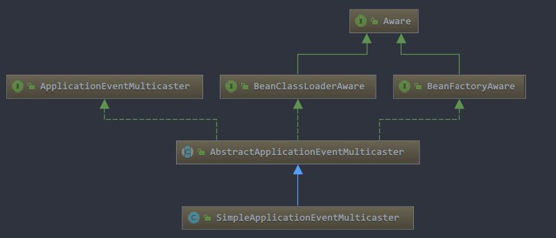

# 看现象

## maven依赖

我们只测试IOC容器，因此只需要引入`spring-context`即可

```xml
    <dependencies>
        <!--测试框架-->
        <dependency>
            <groupId>junit</groupId>
            <artifactId>junit</artifactId>
            <version>RELEASE</version>
            <scope>test</scope>
        </dependency>
        <!--假数据生成-->
        <dependency>
            <groupId>com.github.javafaker</groupId>
            <artifactId>javafaker</artifactId>
            <version>1.0.2</version>
        </dependency>

        <!--IOC-->
        <dependency>
            <groupId>org.springframework</groupId>
            <artifactId>spring-context</artifactId>
            <version>RELEASE</version>
        </dependency>
        
    </dependencies>
  
```

## 测试用例

```java

/**
 * 测试spring的事件发布，参考：
 * https://www.jianshu.com/p/97aed52f1d10
 * https://www.cnblogs.com/wuzhenzhao/p/12859876.html
 * 一般采用线程池处理事件发布，这样避免阻塞主线程
 *
 */
public class TestSpringEvent {

    @Test
    public void test(){
        // create and configure beans
        ClassPathXmlApplicationContext context = new ClassPathXmlApplicationContext("ioc/event.xml");

        /*当然也可以手动添加事件*/
        //context.addApplicationListener(new TomApplicationListener());
        //context.addApplicationListener(new JerryApplicationListener());

        //广播事件
        context.publishEvent(new MyEvent("我的事件"));
        System.out.println(Thread.currentThread().getName()+" has finish!");

    }
}

```

测试用例里面引入了配置文件：`event.xml`，看看里面写了啥

- `event.xml`

```xml
<?xml version="1.0" encoding="UTF-8"?>
<beans xmlns="http://www.springframework.org/schema/beans"
       xmlns:xsi="http://www.w3.org/2001/XMLSchema-instance"
       xsi:schemaLocation="http://www.springframework.org/schema/beans
        https://www.springframework.org/schema/beans/spring-beans.xsd">


    <!--定义事件监听器-->
    <bean name="jerryApplicationListener" class="com.spring.event.JerryApplicationListener"/>
    <bean name="tomApplicationListener" class="com.spring.event.TomApplicationListener"/>
    <bean name="contextRefreshApplicationListener" class="com.spring.event.ContextRefreshApplicationListener"/>

    <!-- 定义一个固定大小的线程，采用factory-method和静态方法的形式，参数注入使用构造函数注入 -->
    <bean name="executor" class="java.util.concurrent.Executors" factory-method="newFixedThreadPool">
        <constructor-arg index="0"><value>5</value></constructor-arg>
    </bean>

    <!-- 定义一个errorHandler，统一处理异常信息 -->
    <bean name="errorHandler" class="com.spring.event.MyEventErrorHandler"></bean>

    <!-- 定义applicationEventMulticaster，注入线程池和errorHandler,此处使用系统自带的广播器，也可以注入其他广播器， -->
    <bean name="applicationEventMulticaster" class="org.springframework.context.event.SimpleApplicationEventMulticaster">
        <property name="taskExecutor" ref="executor"></property>
        <property name="errorHandler" ref="errorHandler"></property>
    </bean>

</beans>
```

- `JerryApplicationListener`

```java

public class JerryApplicationListener implements ApplicationListener<MyEvent> {
    @Override
    public void onApplicationEvent(MyEvent event) {
        String name = Thread.currentThread().getName();
        System.out.println("(线程"+name+")我是Jerry监听器，我监听到了事件：" + event);
        throw new RuntimeException("Jerry发出异常...");
    }
}

```

- `TomApplicationListener`

```java

public class TomApplicationListener implements ApplicationListener<MyEvent> {
    @Override
    public void onApplicationEvent(MyEvent event) {
        String name = Thread.currentThread().getName();
        System.out.println("(线程"+name+")我是Tom监听器，我监听到了事件：" + event);
    }
}

```

- `MyEvent`

```java

public class MyEvent extends ApplicationEvent {
   
    public MyEvent(Object source) {
        super(source);
    }
}

```


## 运行结果

```
(线程pool-1-thread-1)我是上下文完成refresh的监听器，我监听到了事件：org.springframework.context.event....
main has finish!
(线程pool-1-thread-2)我是Jerry监听器，我监听到了事件：com.spring.event.MyEvent[source=我的事件]
(线程pool-1-thread-2)捕获到了异常：Jerry发出异常...
(线程pool-1-thread-3)我是Tom监听器，我监听到了事件：com.spring.event.MyEvent[source=我的事件]
```

## 思考

自定义事件监听器是怎么添加到容器中的呢？为什么发布事件就会被事件监听器调用？为什么会调用自定义的线程池执行？

如果你是设计者，你会怎么来设计事件监听？最简单的就是创建事件监听器，监听指定事件，放到一个Set里面，当有指定事件发生时，调用线程池里面的线程去异步执行事件监听器里面定义好的方法，这就是所谓的观察者模式。

# 事件监听器怎么添加到容器？

我们是这么定义事件广播器的

```xml
<bean name="applicationEventMulticaster" class="org.springframework.context.event.SimpleApplicationEventMulticaster">
        <property name="taskExecutor" ref="executor"></property>
        <property name="errorHandler" ref="errorHandler"></property>
</bean>
```

看一眼继承关系



它的父类有一个有一个方法：`AbstractApplicationEventMulticaster#addApplicationListener`

```java
@Override
	public void addApplicationListener(ApplicationListener<?> listener) {
		synchronized (this.defaultRetriever) {
			// Explicitly remove target for a proxy, if registered already,
			// in order to avoid double invocations of the same listener.
			Object singletonTarget = AopProxyUtils.getSingletonTarget(listener);
			if (singletonTarget instanceof ApplicationListener) {
				this.defaultRetriever.applicationListeners.remove(singletonTarget);
			}
             //重点就是这句话，添加监听器到applicationListeners里面
			this.defaultRetriever.applicationListeners.add(listener);
			this.retrieverCache.clear();
		}
	}
```

看下`this.defaultRetriever.applicationListeners`是个啥？就是一个Set，和我们预想的一样

```java
public final Set<ApplicationListener<?>> applicationListeners = new LinkedHashSet<>();
```

在Spring IOC容器初始化的时候就会将我们自己定义的Tom和Jerry事件监听器放入到这个Set里面，那么具体是哪个环节的时候调用的呢？看一眼调用堆栈（DEBUG的时候看线程栈可以看到）

```
addApplicationListener
applyBeanPostProcessorsAfterInitialization
initializeBean
doCreateBean
createBean
getSingleton
doGetBean
getBean
preInstantiateSingletons
finishBeanFactoryInitialization
refresh
```

又看到了熟悉的调用堆栈，这不是bean的创建过程么？是的，没错，事件监听器也是一种bean，是一种特殊的bean，`ApplicationListenerDetector`会检测如果当前bean是事件监听器的话，就将它加入上面的Set里面

```java
//在bean初始化完成之后调用
@Override
public Object postProcessAfterInitialization(Object bean, String beanName) {
    if (bean instanceof ApplicationListener) {
        // potentially not detected as a listener by getBeanNamesForType retrieval
        Boolean flag = this.singletonNames.get(beanName);
        if (Boolean.TRUE.equals(flag)) {
            // singleton bean (top-level or inner): register on the fly
		   //重点是这句，如果是事件监听器，则放到对应的Set里面
            this.applicationContext
                .addApplicationListener((ApplicationListener<?>) bean);
        }
        ...
    }
    return bean;
}
```

# 为什么发布事件就会被调用？

我们在广播事件之后，发现我们自定义的事件监听器都监听到了该事件

```java
context.publishEvent(new MyEvent("我的事件"));
```

直接追踪`publishEvent`方法源码

```java
protected void publishEvent(Object event, @Nullable ResolvableType eventType) {
    Assert.notNull(event, "Event must not be null");

    // Decorate event as an ApplicationEvent if necessary
    // 强制转换
    ApplicationEvent applicationEvent;
    if (event instanceof ApplicationEvent) {
        applicationEvent = (ApplicationEvent) event;
    }...


        // Multicast right now if possible - or lazily once the multicaster is initialized
        if (this.earlyApplicationEvents != null) {
            this.earlyApplicationEvents.add(applicationEvent);
        }
    else {
        //重点关注这句，或得事件广播器并且调用它的multicastEvent
        getApplicationEventMulticaster().multicastEvent(applicationEvent, eventType);
    }
}
```

- `getApplicationEventMulticaster`：这个方法很简单，直接返回了我们上文配置的`SimpleApplicationEventMulticaster`实例（被上下文引用）

```java
/**
* Return the internal ApplicationEventMulticaster used by the context.
* @return the internal ApplicationEventMulticaster (never {@code null})
* @throws IllegalStateException if the context has not been initialized yet
*/
ApplicationEventMulticaster getApplicationEventMulticaster() throws IllegalStateException {
    if (this.applicationEventMulticaster == null) {
    throw new IllegalStateException("ApplicationEventMulticaster not initialized - " +
    "call 'refresh' before multicasting events via the context: " + this);
    }
	return this.applicationEventMulticaster;
}
```

- `SimpleApplicationEventMulticaster#multicastEvent`

```java
@Override
public void multicastEvent(final ApplicationEvent event, @Nullable ResolvableType eventType) {
    ResolvableType type = (eventType != null ? eventType : resolveDefaultEventType(event));
    //获取线程池
    Executor executor = getTaskExecutor();
    //获取我们自定义的事件监听器
    for (ApplicationListener<?> listener : getApplicationListeners(event, type)) {
        if (executor != null) {
            //有线程池直接用
            executor.execute(() -> invokeListener(listener, event));
        }
        else {
            //没有线程池的话就自己调用
            invokeListener(listener, event);
        }
    }
}
```

这个方法就是重点了，`getApplicationListeners`就是去上文提到的`applicationListeners`去取事件监听器了，如果有我们自定义线程池就直接用线程池调用，相当于异步调用，否则的话就是当前线程来调用，相当于同步调用！