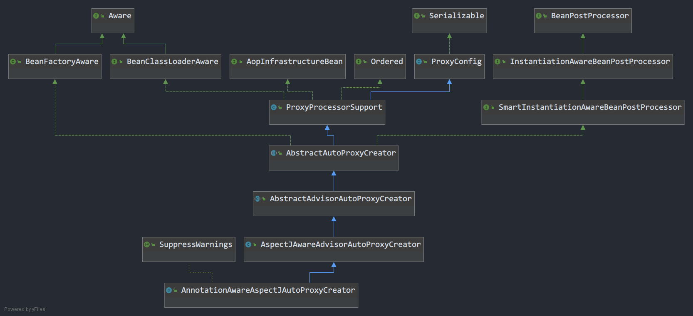
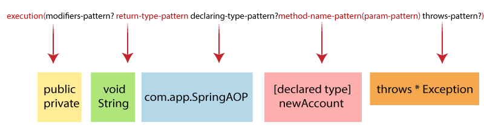
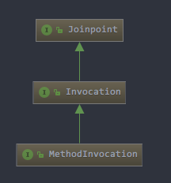
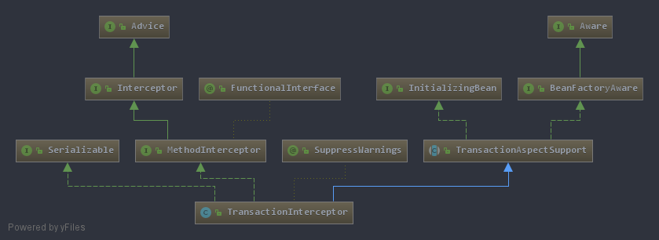
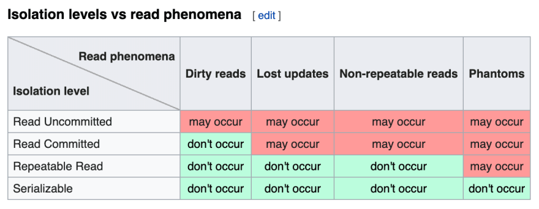
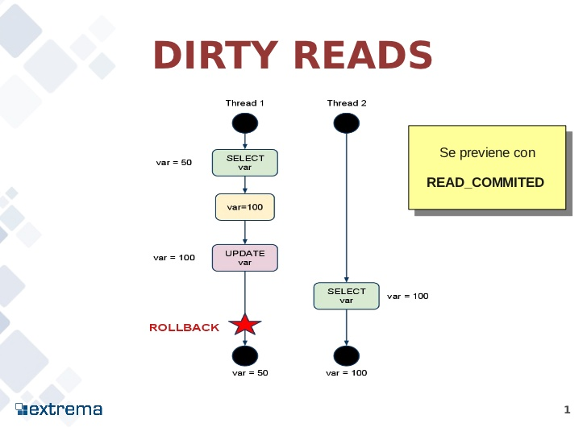
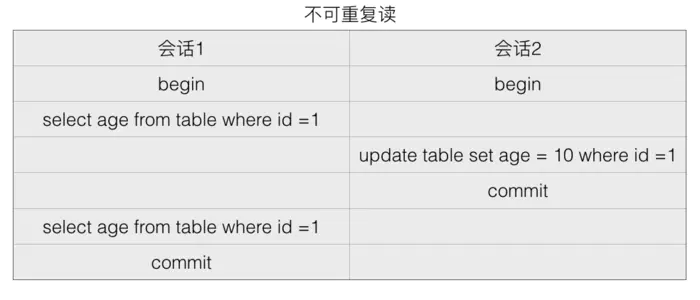
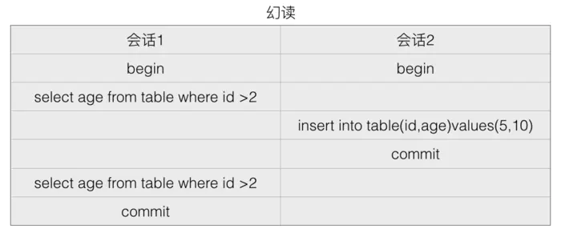

# 看现象

AOP是在Spring IOC的基础之上的功能，所以需要先了解一下IOC，如果不了解IOC，请看之前的Spring源码系列之IOC初始化过程的文章

## maven依赖

本文是要在IOC容器的基础之上测试AOP与事务，所以需要`spring-aspects`的支持与`sqlite`的支持

```xml
<dependencies>
        <dependency>
            <groupId>junit</groupId>
            <artifactId>junit</artifactId>
            <version>RELEASE</version>
            <scope>test</scope>
        </dependency>
        <dependency>
            <groupId>com.github.javafaker</groupId>
            <artifactId>javafaker</artifactId>
            <version>1.0.2</version>
        </dependency>

        <!--IOC-->
        <dependency>
            <groupId>org.springframework</groupId>
            <artifactId>spring-context</artifactId>
            <version>RELEASE</version>
        </dependency>

        <!--AOP-->
        <dependency>
            <groupId>org.springframework</groupId>
            <artifactId>spring-aspects</artifactId>
            <version>3.2.0.RELEASE</version>
        </dependency>

        <!--连接池-->
        <dependency>
            <groupId>org.springframework</groupId>
            <artifactId>spring-jdbc</artifactId>
            <version>RELEASE</version>
        </dependency>

        <!--sqlite驱动-->
        <dependency>
            <groupId>org.xerial</groupId>
            <artifactId>sqlite-jdbc</artifactId>
            <version>3.28.0</version>
        </dependency>


    </dependencies>
```

## 测试用例

```java
/**
 * 测试AOP代理
 */
public class TestSpringAOP {

    @Test
    public void test(){
        // create and configure beans
        ApplicationContext context = new ClassPathXmlApplicationContext("aop/aop.xml");

        AopInterfaceUserDao aopUserDao = context.getBean("aopUserDao", AopInterfaceUserDao.class);
        List<User> users =  aopUserDao.findUsers(10);
        System.out.println("aopUserDao 是一个JDK动态代理：" + aopUserDao.getClass());

        System.out.println("---------------------------------");
        AopClassUserDao aopClassUserDao = context.getBean("aopClassUserDao", AopClassUserDao.class);
        List<User> users1 =  aopClassUserDao.aopClassUserDaoFindUsers(10);
        System.out.println("aopClassUserDao 是一个CGLIB动态代理：" + aopClassUserDao.getClass());

    }
}
```

测试用例里面引入了配置文件：`aop.xml`，看看里面写了啥

- `aop.xml`

```xml
<?xml version="1.0" encoding="UTF-8"?>
<beans xmlns="http://www.springframework.org/schema/beans"
       xmlns:xsi="http://www.w3.org/2001/XMLSchema-instance"
       xmlns:aop="http://www.springframework.org/schema/aop"
       xsi:schemaLocation="http://www.springframework.org/schema/beans
	http://www.springframework.org/schema/beans/spring-beans-3.0.xsd
	http://www.springframework.org/schema/aop
	http://www.springframework.org/schema/aop/spring-aop-3.0.xsd ">


    <!--开启切面代理-->
    <aop:aspectj-autoproxy />

    <!--开启后强制只用CGLIB代理，不管有没有实现接口-->
    <!--<aop:config proxy-target-class="true"/>-->

    <!--被代理对象-->
    <bean id="aopUserDao" class="com.spring.dao.impl.AopInterfaceUserDaoImpl"/><!--实现了接口的AOP代理-->
    <bean id="aopClassUserDao" class="com.spring.dao.AopClassUserDao"/><!--没实现接口的AOP代理-->

    <!--切面bean-->
    <bean id="loggingAspect" class="com.spring.aop.LoggingAspect"/>

    <aop:config>
        <aop:aspect ref="loggingAspect">

            <!-- @Around 环绕切面-->
            <aop:pointcut id="pointCutAround" expression="within(com.spring.dao.*) || within(com.spring.dao.impl.*)" />
            <aop:around method="logAround" pointcut-ref="pointCutAround" />

        </aop:aspect>
    </aop:config>


</beans>
```


- `AopInterfaceUserDao`与`AopInterfaceUserDaoImpl`

```java
/**
 * 实现接口的AOP代理
 */
public interface AopInterfaceUserDao {

    List<User> findUsers(int howMany);
}

public class AopInterfaceUserDaoImpl implements AopInterfaceUserDao {
    @Override
    public List<User> findUsers(int howMany) {
        System.out.println("findUsers调用中...");
        List<User> list = new ArrayList<>();
        Faker faker = new Faker(new Locale("zh-CN"));
        for (int i = 0; i < howMany; i++) {
            User user = new User();
            user.setName(faker.name().fullName());
            user.setAge(faker.number().numberBetween(0,100));
            user.setPhone(faker.phoneNumber().cellPhone());
            user.setLocation(faker.address().city());
            list.add(user);
        }
        return list;
    }
}
```

- `AopClassUserDao`

```java
/**
 * 不实现接口，直接是类的AOP代理
 */
public class AopClassUserDao {

    public List<User> aopClassUserDaoFindUsers(int howMany) {
        System.out.println("AopClassUserDaoFindUsers调用中...");
        List<User> list = new ArrayList<>();
        Faker faker = new Faker(new Locale("zh-CN"));
        for (int i = 0; i < howMany; i++) {
            User user = new User();
            user.setName(faker.name().fullName());
            user.setAge(faker.number().numberBetween(0,100));
            user.setPhone(faker.phoneNumber().cellPhone());
            user.setLocation(faker.address().city());
            list.add(user);
        }
        return list;
    }
}
```

- `LoggingAspect`

```java
public class LoggingAspect {
    /**
     * 环绕切面
     * @param joinPoint
     * @return
     * @throws Throwable
     */
    public Object logAround(ProceedingJoinPoint joinPoint) throws Throwable {
        String name = joinPoint.getSignature().getName();
        System.out.println(name + "调用之前....");
        Object original = joinPoint.proceed();//调用原始方法
        System.out.println(name + "调用之后....");
        return original;
    }
}
```

## 运行结果

```
findUsers调用之前....
findUsers调用中...
findUsers调用之后....
aopUserDao 是一个JDK动态代理：class com.sun.proxy.$Proxy7
---------------------------------
aopClassUserDaoFindUsers调用之前....
AopClassUserDaoFindUsers调用中...
aopClassUserDaoFindUsers调用之后....
aopClassUserDao 是一个CGLIB动态代理：class com.spring.dao.AopClassUserDao$$EnhancerBySpringCGLIB$$df386aef
```

## 思考

为什么可以在一个方法前后动态的调用别的代码呢？我们创建的`AopInterfaceUserDao`到了最后发现实际创建的并不是它自己，而是一个`com.sun.proxy.$Proxy7`，这又是个啥？

我们知道Java是要编译成字节码然后才能被JVM执行，JVM执行只看字节码，与具体语言无关，只要能生成合法的字节码，那么JVM就可以运行之，那有没有可能我们自己的类编译成的字节码已经被修改了呢？答案是肯定的，Spring这招偷天换日真是高，那么是怎么实现操作字节码的？答案就是JDK动态代理与CGLIB，CGLIB的底层又是ASM，字节码操纵器

- asm：https://asm.ow2.io/

扯远了，我们还是回到Spring，看下它的AOP机制是怎么动态地去创建代理的。

# Spring AOP的创建过程

xml文件中配置的```<aop:aspectj-autoproxy />```表示开启aop代理，此时会向bean工厂中注册一个名为```AnnotationAwareAspectAutoProxyCreator```的```BeanPostProcessor```

继承关系如下图


找到父类`AbstractAutoProxyCreator`的`postProcessAfterInitialization`方法，发现了吗？切面本质上就是bean工厂里面初始化的一个代理创建器，这个创建器是一个`BeanPostProcessors`，在bean被创建完成后执行代理添加，在原始bean的外面包一层

具体是怎么创建代理的，请看调用堆栈
```
createAopProxy:51, DefaultAopProxyFactory
createAopProxy:105, ProxyCreatorSupport
getProxy:110, ProxyFactory
createProxy:471, AbstractAutoProxyCreator
wrapIfNecessary:350, AbstractAutoProxyCreator
postProcessAfterInitialization:299, AbstractAutoProxyCreator
applyBeanPostProcessorsAfterInitialization:431, AbstractAutowireCapableBeanFactory
initializeBean:1800, AbstractAutowireCapableBeanFactory
doCreateBean:595, AbstractAutowireCapableBeanFactory
createBean:517, AbstractAutowireCapableBeanFactory
lambda$doGetBean$0:323, AbstractBeanFactory
getObject:-1, 726379593
getSingleton:226, DefaultSingletonBeanRegistry
doGetBean:321, AbstractBeanFactory
getBean:202, AbstractBeanFactory
preInstantiateSingletons:895, DefaultListableBeanFactory
finishBeanFactoryInitialization:878, AbstractApplicationContext
refresh:550, AbstractApplicationContext
```

`DefaultAopProxyFactory.createAopProxy`为重点！来看一下源码，里面详细判断了什么时候用JDK动态代理什么时候用CGLIB代理

```java
public AopProxy createAopProxy(AdvisedSupport config) throws AopConfigException {
    //如果是isOptimize 或者 isProxyTargetClass 或者 没有实现接口 则满足条件
    if (config.isOptimize() || config.isProxyTargetClass() || hasNoUserSuppliedProxyInterfaces(config)) {
        Class<?> targetClass = config.getTargetClass();
        if (targetClass == null) {
            throw new AopConfigException("TargetSource cannot determine target class: " +
                    "Either an interface or a target is required for proxy creation.");
        }
        //如果目标对象是个接口
        if (targetClass.isInterface() || Proxy.isProxyClass(targetClass)) {
            return new JdkDynamicAopProxy(config);
        }
        //否则用CGLIB实现代理
        return new ObjenesisCglibAopProxy(config);
    }
    else {
        //不满足上面条件用JDK动态代理
        return new JdkDynamicAopProxy(config);
    }
}
```
如果实现了接口并且配置了（默认就是false）```proxyTargetClass=flase``` 与 ```optimize=false```，则用JDK动态代理，其他情况使用CGLIB动态代理

```proxyTargetClass=true```就是在xml配置文件中常常见到的`<aop:config proxy-target-class="true"/>`

我们重点来看下这三个条件：`isOptimize`、`isProxyTargetClass`、`hasNoUserSuppliedProxyInterfaces`

- `isOptimize`和`isProxyTargetClass`这两个都是从配置文件配置的，默认为`false`

- `hasNoUserSuppliedProxyInterfaces`可以理解为判断被代理类是否有实现接口
```java
private boolean hasNoUserSuppliedProxyInterfaces(AdvisedSupport config) {
    Class<?>[] ifcs = config.getProxiedInterfaces();
    return (ifcs.length == 0 || (ifcs.length == 1 && SpringProxy.class.isAssignableFrom(ifcs[0])));
}
```

关于更底层的信息，那就要看JDK动态代理与CGLIB的实现了，此处不再深入

# 关于切面表达式

参考：https://www.baeldung.com/spring-aop-pointcut-tutorial

切面表达式具有很强的描述性，举几个例子
```java
//切入包下面所有方法
@Pointcut("within(com.test.controller.*)")

/**
 * 切入TestServiceImpl所有qry开头的方法
 * execution表示在方法执行时触发
 * * 代表任意返回类型
 * com.test.service.TestServiceImpl.qry*表示该类下所有qry开头的方法
 * (..)表示任意参数
 */
@Pointcut("execution(* com.test.service.TestServiceImpl.qry*(..))")

/**
 * 在执行表达式的时候，我们可以通过逻辑运算符&&(and) , ||(or) , !(not)对表达式进行搭配
 * 切入在com.test.service包下面TestServiceImpl所有qry开头的方法
 */
@Pointcut("execution(* com.test.service.TestServiceImpl.qry(..) && within(com.test.service.*))")

/**
 * 切入在com.test.service包下面所有public开头的方法
 * 第一个*表示所有返回值类型
 * 第二个*表示所有方法名称
 * (..)表示任意参数
 */
@Pointcut("execution(public * *(..)) && within(com.test.service.*))")


/**
 * 切入在com.test.service包下面所有以To结尾的方法
 * 第一个*表示所有返回值类型
 * *To表示所有以To结尾的方法
 * (..)表示任意参数
 */
@Pointcut("execution(* *To(..)) && within(com.test.service.*))")


/**
 * 切入在com.test包下面所有方法（除了类Login下面的login方法）
 * 第一个*表示所有返回值类型
 * (..)表示任意参数
 */
@Pointcut("within(com.test.*) && !execution(* com.test.Login.login(..))")
```

## 切面表达式语法


## execution
**execution**是最主要的切面表达式，用来匹配方法
```java
//匹配方法com.baeldung.pointcutadvice.dao.FooDao.findById，参数只有一个Long类型
@Pointcut("execution(public String com.baeldung.pointcutadvice.dao.FooDao.findById(Long))")
```
当然上面不够灵活，下面演示匹配FooDao的所有方法
```java
//第一个*用来匹配所有返回值
//第二个*用来匹配所有方法名
//(..)用来匹配所有参数，也包括没有参数
@Pointcut("execution(* com.baeldung.pointcutadvice.dao.FooDao.*(..))")
```

## within
下面同样也是匹配FooDao的所有方法
```java
@Pointcut("within(com.baeldung.pointcutadvice.dao.FooDao)")
```
匹配`com.baeldung`包及其子包下的所有类
```java
@Pointcut("within(com.baeldung..*)")
```

## this and target
this表示被切入的是一个类，target表示被切入的实现了接口，比如如下类定义
```java
public class FooDao implements BarDao {}
```
FooDao实现了接口BarDao，所以当Spring 创建切面的时候会用JDK动态代理，此时要切入FooDao类可以这样写
```java
//target指定切入的接口即可切入其接口的实例
@Pointcut("target(com.baeldung.pointcutadvice.dao.BarDao)")
```
如果FooDao没有从任何接口继承，只是一个单独的类，Spring会创建CGLIB动态代理，切面应该写成下面这样
```java
//this 直接指定切面类即可
@Pointcut("this(com.baeldung.pointcutadvice.dao.FooDao)")
```


## args
args即指定参数，如下
```java
//匹配所有方法名包含find的方法并且入参为一个Long类型
@Pointcut("execution(* *..find*(Long))")

//匹配所有方法名包含find的方法并且第一个入参为Long类型
@Pointcut("execution(* *..find*(Long,..))")
```

## @target
@target不要和target混淆，@target表示切入注解，如下
```java
//匹配所有使用了Repository注解的类
@Pointcut("@target(org.springframework.stereotype.Repository)")
```

## @args
@args表示切入所有入参中含有某注解的方法
```java
//指定Entity注解
@Pointcut("@args(com.baeldung.pointcutadvice.annotations.Entity)")
public void methodsAcceptingEntities() {}

//切入入参中含有Entity注解的方法
@Before("methodsAcceptingEntities()")
public void logMethodAcceptionEntityAnnotatedBean(JoinPoint jp) {
    logger.info("Accepting beans with @Entity annotation: " + jp.getArgs()[0]);
}
```

## 组合切面表达式
切面表达式可以用逻辑运算符`&&`(与)、`||`(或)、`!`(非)
```java
@Pointcut("@target(org.springframework.stereotype.Repository)")
public void repositoryMethods() {}
 
@Pointcut("execution(* *..create*(Long,..))")
public void firstLongParamMethods() {}
 
@Pointcut("repositoryMethods() && firstLongParamMethods()")
public void entityCreationMethods() {}
```

# AOP与注解@Transactional

## 看现象

### maven依赖

开头已经给出了，此处就不再赘述

### 测试用例

```java

/**
 * 测试AOP 事务
 */
public class TestSpringTransaction {

    //测试事务是经过AOP代理的
    @Test
    public void test(){
        // create and configure beans
        ApplicationContext context = new ClassPathXmlApplicationContext("aop/transaction.xml");

        //JDK
        TransactionInterfaceUserDao transactionInterfaceUserDao = context.getBean("transactionInterfaceUserDaoImpl", TransactionInterfaceUserDao.class);
        System.out.println("实际上我是一个JDK动态代理对象，被事务管理：" + transactionInterfaceUserDao.getClass().getName());

        try{
            transactionInterfaceUserDao.insert();
        }catch (Exception e){
            System.out.println(String.format("transactionInterfaceUserDao.insert() catch 到了异常%s，事物回滚", e.getMessage()));
        }


        //CGLIB
        TransactionUserDao transactionUserDao = context.getBean("transactionUserDao", TransactionUserDao.class);
        System.out.println("实际上我是一个CGLIB代理对象，被事务管理：" + transactionUserDao.getClass().getName());

        try{
            //transactionUserDao.insert();
        }catch (Exception e){
            System.out.println(String.format("transactionUserDao.insert() catch 到了异常%s，事物回滚", e.getMessage()));
        }

    }

    //测试事物失效的场景
    @Test
    public void testExpiry() throws IOException {
        // create and configure beans
        ApplicationContext context = new ClassPathXmlApplicationContext("aop/transaction.xml");
        TransactionExpiryUserDao txDao = context.getBean("transactionExpiryUserDao", TransactionExpiryUserDao.class);


        /*1. @Transactional 应用在非 public 修饰的方法上*/
        //txDao.nonPublic();//编译报错


        /*2. @Transactional 注解属性 rollbackFor 设置错误 rollBackFor默认属性在发生Error或RuntimeException的时候才回滚*/
        //txDao.rollbackForErrorAndRuntimeException();


        /*3. 同一个类中方法调用，导致@Transactional失效*/
        //事务不会生效，原因是事务配置没被Spring获取到，也就是说异常被AOP感知到了，但是@Transactional在inner方法上，没被AOP感知到，事务生效，要让异常和事务配置同时被AOP感知到
        //如果反过来，在outer上加@Transactional，inner去掉，事务会生效，因为此时异常和事务配置都被感知到了
        //txDao.outer();


        /*4. 异常被你的 catch"吃了"导致@Transactional失效*/
        //txDao.exceptionCatched();


        /*5. 数据库引擎不支持事务  这个就不说了，无论你怎么配置Spring都不会生效*/
    }


}

```

测试用例里面引入了配置文件：`transaction.xml`，看看里面写了啥

- `transaction.xml`

```xml
<?xml version="1.0" encoding="UTF-8"?>
<beans xmlns="http://www.springframework.org/schema/beans"
       xmlns:xsi="http://www.w3.org/2001/XMLSchema-instance"
       xmlns:aop="http://www.springframework.org/schema/aop"
       xmlns:tx="http://www.springframework.org/schema/tx"
       xsi:schemaLocation="
        http://www.springframework.org/schema/beans
        http://www.springframework.org/schema/beans/spring-beans.xsd
        http://www.springframework.org/schema/tx
        http://www.springframework.org/schema/tx/spring-tx.xsd
        http://www.springframework.org/schema/aop
        http://www.springframework.org/schema/aop/spring-aop.xsd">

    <!--数据库配置-->
    <bean name="dataSource" class="org.springframework.jdbc.datasource.DriverManagerDataSource">
        <property name="driverClassName" value="org.sqlite.JDBC" />
        <property name="url" value="jdbc:sqlite:/your/path/to/transaction.db" />
    </bean>
    <bean id="jdbcTemplate" class="org.springframework.jdbc.core.JdbcTemplate">
        <property name="dataSource" ref="dataSource"/>
    </bean>


    <!-- enable the configuration of transactional behavior based on annotations -->
    <!-- a PlatformTransactionManager is still required -->
    <tx:annotation-driven transaction-manager="txManager"/>
    <bean id="txManager" class="org.springframework.jdbc.datasource.DataSourceTransactionManager">
        <!-- (this dependency is defined somewhere else) -->
        <property name="dataSource" ref="dataSource"/>
    </bean>


    <!--开启事务对象-->
    <bean id="transactionUserDao" class="com.spring.dao.TransactionUserDao">
        <property name="jdbcTemplate" ref="jdbcTemplate"/>
    </bean>
    <bean id="transactionInterfaceUserDaoImpl" class="com.spring.dao.impl.TransactionInterfaceUserDaoImpl">
        <property name="jdbcTemplate" ref="jdbcTemplate"/>
    </bean>
    <bean id="transactionExpiryUserDao" class="com.spring.dao.TransactionExpiryUserDao">
        <property name="jdbcTemplate" ref="jdbcTemplate"/>
    </bean>

</beans>
```


- `TransactionInterfaceUserDao`与`TransactionInterfaceUserDaoImpl`

```java
/**
 * 事务测试接口
 */
public interface TransactionInterfaceUserDao {
    void insert();
}

/**
 * 事务测试
 */
public class TransactionInterfaceUserDaoImpl implements TransactionInterfaceUserDao {

    /*注入jdbcTemplate*/
    private JdbcTemplate jdbcTemplate;
    public void setJdbcTemplate(JdbcTemplate jdbcTemplate) {
        this.jdbcTemplate = jdbcTemplate;
    }

    @Transactional//加上注解表示这是一个包含事务的方法
    public void insert()  {
        //你得先往transaction.db里面建个user表
        String sql = "INSERT INTO user(name,age,email,u_sex) values ('Jerry',20,'jerry@jerry.com','男')";
        int i = jdbcTemplate.update(sql);
        System.out.println("SQL has executed! but record does not inserted!");
        int a = 1 / 0; //RuntimeException
    }
}


```

- `TransactionUserDao`

```java

/**
 * 事务测试
 */
public class TransactionUserDao {
    /*注入jdbcTemplate*/
    private JdbcTemplate jdbcTemplate;
    public void setJdbcTemplate(JdbcTemplate jdbcTemplate) {
        this.jdbcTemplate = jdbcTemplate;
    }

    @Transactional//加上注解表示这是一个包含事务的方法
    public void insert()  {
        String sql = "INSERT INTO user(name,age,email,u_sex) values ('Tom',20,'tom@tom.com','男')";
        int i = jdbcTemplate.update(sql);
        System.out.println("SQL has executed! but record does not inserted!");
        int a = 1 / 0; //RuntimeException
    }
}
```

- `TransactionExpiryUserDao`

```java

/**
 * 测试事务的各种失效场景
 */
public class TransactionExpiryUserDao {

    /*注入jdbcTemplate*/
    private JdbcTemplate jdbcTemplate;
    public void setJdbcTemplate(JdbcTemplate jdbcTemplate) {
        this.jdbcTemplate = jdbcTemplate;
    }

    @Transactional//事务不生效
    void nonPublic()  {
        String sql = "INSERT INTO user(name,age,email,u_sex) values ('Tom',20,'tom@tom.com','男')";
        int i = jdbcTemplate.update(sql);
        System.out.println("sql has executed");
        int a = 1 / 0; //RuntimeException
    }


    @Transactional
    public void rollbackForErrorAndRuntimeException() throws IOException {
        String sql = "INSERT INTO user(name,age,email,u_sex) values ('Tom',20,'tom@tom.com','男')";
        int i = jdbcTemplate.update(sql);
        System.out.println("sql has executed");
        throw new IOException("IO 异常");
    }


    //调用此处事务会失效
    public void outer(){
        inner();
    }


    @Transactional(value = "transactionManager",propagation=Propagation.REQUIRED,isolation=Isolation.DEFAULT,timeout=TransactionDefinition.TIMEOUT_DEFAULT,readOnly=true,rollbackFor={RuntimeException.class,Error.class},noRollbackFor={})
    public void inner(){
        String sql = "INSERT INTO user(name,age,email,u_sex) values ('Tom',20,'tom@tom.com','男')";
        int i = jdbcTemplate.update(sql);
        System.out.println("sql has executed");
        int a = 1 / 0; //RuntimeException
    }


    @Transactional
    public void exceptionCatched(){
        try{
            String sql = "INSERT INTO user(name,age,email,u_sex) values ('Tom',20,'tom@tom.com','男')";
            int i = jdbcTemplate.update(sql);
            System.out.println("sql has executed");
            int a = 1 / 0; //RuntimeException
        } catch (Exception e){
            System.out.println("自己处理了异常，并且没有抛出，Spring没有感知到，事务失效!");
        }

    }

}
```

### 运行结果

- `test`运行结果

```
实际上我是一个JDK动态代理对象，被事务管理：com.sun.proxy.$Proxy11
SQL has executed! but record does not inserted!
transactionInterfaceUserDao.insert() catch 到了异常/ by zero，事物回滚
实际上我是一个CGLIB代理对象，被事务管理：com.spring.dao.TransactionUserDao$$EnhancerBySpringCGLIB$$dcca7098
```

- `testExpiry`运行结果

2. @Transactional 注解属性 rollbackFor 设置错误 rollBackFor默认属性在发生Error或RuntimeException的时候才回滚

```
sql has executed

java.io.IOException: IO 异常
...
```

3. 同一个类中方法调用，导致`@Transactional`失效，事务不会生效，原因是事务配置没被Spring获取到，也就是说异常被AOP感知到了，但是`@Transactional`在inner方法上，没被AOP感知到，事务生效，要让异常和事务配置同时被AOP感知到

```
sql has executed

java.lang.ArithmeticException: / by zero
```

4. 异常被你的 catch"吃了"导致`@Transactional`失效

```
sql has executed
自己处理了异常，并且没有抛出，Spring没有感知到，事务失效!
```

### 思考

AOP是怎么实现在目标代码前后织入事务代码的呢？

实际上，Spring中的事务也用了AOP，在数据库操作的前后织入了事务管理的代码

```aop/transaction.xml```文件中的如下配置指定了事务管理器，意思是用下面这个类来进行事务管理
```xml
<bean id="txManager" class="org.springframework.jdbc.datasource.DataSourceTransactionManager">
    <property name="dataSource" ref="dataSource"/>
</bean>
```
抛错就用事务管理器进行回滚，在哪回滚？点进`DataSourceTransactionManager`找到一个`doRollback`方法，好家伙，就是它了，在这方法体内随便找个地方打个断点

参考`TransactionInterfaceUserDaoImpl`的`insert`方法，它肯定会抛错回滚，然后停到`doRollback`方法处，debug运行`TestSpringTransaction`，果然停到了`doRollback`，查看堆栈如下

```java
AbstractPlatformTransactionManager.processRollback
AbstractPlatformTransactionManager.rollback
TransactionAspectSupport.completeTransactionAfterThrowing
TransactionAspectSupport.invokeWithinTransaction
TransactionInterceptor.invoke
ReflectiveMethodInvocation.proceed
JdkDynamicAopProxy.invoke
$Proxy11.insert //这是我们自己的方法
TestSpringTransaction.test
```
根据调用堆栈信息，下面我们重点看一下这几个方法：

- `JdkDynamicAopProxy.invoke`
- `ReflectiveMethodInvocation.proceed`
- `TransactionInterceptor.invoke`
- `TransactionAspectSupport.invokeWithinTransaction`
- `TransactionAspectSupport.completeTransactionAfterThrowing`

## JdkDynamicAopProxy.invoke

我们用的JDK动态代理，那么一定有个`InvocationHandler`，那么谁是呢？我们看下`JdkDynamicAopProxy`是怎么定义的
```java
final class JdkDynamicAopProxy implements AopProxy, InvocationHandler, Serializable;
```
好家伙，它就是那个`InvocationHandler`，所以调到了它的`invoke`方法里面，它并没有直接去调被代理类的方法，而是封装成了一个`MethodInvocation`来调用
```java
//// We need to create a method invocation...
MethodInvocation invocation = new ReflectiveMethodInvocation(proxy, target, method, args, targetClass, chain);
// Proceed to the joinpoint through the interceptor chain.
retVal = invocation.proceed();
```

## ReflectiveMethodInvocation.proceed

`MethodInvocation`是个啥，打开IDEA看类图你就知道那是一个`Joinpoint`，它有一个`proceed`方法，查看下接口上面的定义



```java
/**
 * 处理下一个在链条中的拦截器
 * Proceed to the next interceptor in the chain.
 * <p>The implementation and the semantics of this method depends
 * on the actual joinpoint type (see the children interfaces).
 * @return see the children interfaces' proceed definition
 * @throws Throwable if the joinpoint throws an exception
 */
Object proceed() throws Throwable;
```
拦截器？链条？你是不是想到了责任链模式？上面`ReflectiveMethodInvocation`的构建参数中最后一个参数`chain`就是这个链条，查看堆栈中下一步果然调到了`ReflectiveMethodInvocation.proceed`方法，看下这个方法咋写的
```java
@Override
@Nullable
public Object proceed() throws Throwable {
    
    //链条到头了，调用真正的业务方法
    // We start with an index of -1 and increment early.
    if (this.currentInterceptorIndex == this.interceptorsAndDynamicMethodMatchers.size() - 1) {
        return invokeJoinpoint();//此处才开始调用被代理类的业务方法
    }

    //从链条中拿到下一个拦截器
    Object interceptorOrInterceptionAdvice = this.interceptorsAndDynamicMethodMatchers.get(++this.currentInterceptorIndex);
    if (interceptorOrInterceptionAdvice instanceof InterceptorAndDynamicMethodMatcher) {
       ....
    }
    else {
        // It's an interceptor, so we just invoke it: The pointcut will have
        // been evaluated statically before this object was constructed.
        //调用该拦截器的invoke方法，最后还吧this传了进去！！
        return ((MethodInterceptor) interceptorOrInterceptionAdvice).invoke(this);
    }
}
```
看到了吗？这里就是责任链，链条中放了很多拦截器，每个拦截器都有一个`invoke`方法，当然事务拦截器也有一个`invoke`方法


## TransactionInterceptor.invoke
下面自然而然就调用到了事务拦截器，来看一下`TransactionInterceptor`到底是个啥


```java
public Object invoke(MethodInvocation invocation) throws Throwable {
    Class<?> targetClass = (invocation.getThis() != null ? AopUtils.getTargetClass(invocation.getThis()) : null);
    return invokeWithinTransaction(invocation.getMethod(), targetClass, invocation::proceed);
}
```
`invocation::proceed`是关键，`invocation`是啥？它就是上一步中的`ReflectiveMethodInvocation`，最后把`this`传进去了！这样通过这个`ReflectiveMethodInvocation`来驱动整个链条的调用

## TransactionAspectSupport.invokeWithinTransaction

`TransactionInterceptor` 是从 `TransactionAspectSupport`继承的，所以是调用到了父类的方法里面

```java
protected Object invokeWithinTransaction(Method method, @Nullable Class<?> targetClass,
			final InvocationCallback invocation) throws Throwable {
    try {
            // This is an around advice: Invoke the next interceptor in the chain.
            // This will normally result in a target object being invoked.
            retVal = invocation.proceedWithInvocation();
        }
        catch (Throwable ex) {
            // target invocation exception
            completeTransactionAfterThrowing(txInfo, ex);
            throw ex;
        }
}
```
`retVal = invocation.proceedWithInvocation();`这句话是关键，`invocation`是个啥？`invocation`就是上一步中的`invocation::proceed`，而`invocation::proceed`中的`invocation`就是`ReflectiveMethodInvocation`！

说白了，调用这个方法会调用到`ReflectiveMethodInvocation.invoke`里面，最终调用到`invokeJoinpoint`
```java
if (this.currentInterceptorIndex == this.interceptorsAndDynamicMethodMatchers.size() - 1) {
    return invokeJoinpoint();//此处才开始调用被代理类的业务方法
}
```
`return invokeJoinpoint();`调用到这里才会调用你写的业务方法，当然，不信看下面的堆栈信息，抛异常之前的

```java
TransactionInterfaceUserDaoImpl.insert //我们的业务方法
NativeMethodAccessorImpl.invoke0
NativeMethodAccessorImpl.invoke
DelegatingMethodAccessorImpl.invoke
Method.invoke
AopUtils.invokeJoinpointUsingReflection
ReflectiveMethodInvocation.invokeJoinpoint//invokeJoinpoint在这里
ReflectiveMethodInvocation.proceed
TransactionInterceptor$1.proceedWithInvocation
...

```

## TransactionAspectSupport.completeTransactionAfterThrowing
```java
/**
 * Handle a throwable, completing the transaction.
 * We may commit or roll back, depending on the configuration.
 * @param txInfo information about the current transaction
 * @param ex throwable encountered
 */
protected void completeTransactionAfterThrowing(@Nullable TransactionInfo txInfo, Throwable ex) {
    if (txInfo != null && txInfo.getTransactionStatus() != null) {
        if (txInfo.transactionAttribute != null && txInfo.transactionAttribute.rollbackOn(ex)) {
            try {
                txInfo.getTransactionManager().rollback(txInfo.getTransactionStatus());
            }
            catch (TransactionSystemException ex2) {...}
        }
        else {
            // We don't roll back on this exception.
            // Will still roll back if TransactionStatus.isRollbackOnly() is true.
            try {
                txInfo.getTransactionManager().commit(txInfo.getTransactionStatus());
            }
            catch (TransactionSystemException ex2) {...}
        }
    }
}
```
可以看到在这里决定了是否回滚和提交，它依赖于传进来的`TransactionInfo txInfo`，那么这个`txInfo`又是在哪里初始化的呢？

看上一步`invokeWithinTransaction`方法中初始化了`txInfo`，
```java
PlatformTransactionManager ptm = asPlatformTransactionManager(tm);
final TransactionAttribute txAttr = (tas != null ? tas.getTransactionAttribute(method, targetClass) : null);
final String joinpointIdentification = methodIdentification(method, targetClass, txAttr);

TransactionInfo txInfo = createTransactionIfNecessary(ptm, txAttr, joinpointIdentification);
```
再看看一下`TransactionInfo`的定义，`TransactionInfo`实际上是`TransactionAspectSupport`的一个内部类，它只是聚合了一些事物相关对象方便`TransactionAspectSupport`操作
```java
protected static final class TransactionInfo {
		@Nullable
		private final PlatformTransactionManager transactionManager;

		@Nullable
		private final TransactionAttribute transactionAttribute;

		private final String joinpointIdentification;

		@Nullable
		private TransactionStatus transactionStatus;

		@Nullable
		private TransactionInfo oldTransactionInfo;
}
```
所以重点应该看`PlatformTransactionManager`、`TransactionAttribute`、`TransactionStatus`、`TransactionInfo`这几个接口

当然话题扯远了，在这里抛出了异常所以肯定是回滚操作，下面这个操作就是回滚操作
```java
txInfo.getTransactionManager().rollback(txInfo.getTransactionStatus());
```

# @Transactional事务失效
失效的几种情况见`TestSpringTransaction.testExpiry`

1. `@Transactional` 应用在非 `public` 修饰的方法上
2. `@Transactional` 注解属性 `rollbackFor` 设置错误 `rollBackFor`默认属性在发生`Error`或`RuntimeException`的时候才回滚
3. 同一个类中方法调用，导致`@Transactional`失效
4. 异常被你的 `catch`"吃了"导致`@Transactional`失效
5. 数据库引擎不支持事务  这个就不说了，无论你怎么配置`Spring`都不会生效

总而言之，言而总之，**只有让异常和事务配置都被`Spring`的`AOP`感知到了，事务才会生效**

# @Transactional属性
`@Transactional`注解包含很多属性，一个完整的注解如下

```java
@Transactional(value = "transactionManager",propagation=Propagation.REQUIRED,isolation=Isolation.DEFAULT,timeout=TransactionDefinition.TIMEOUT_DEFAULT,readOnly=true,rollbackFor={RuntimeException.class,Error.class},noRollbackFor={})
```
它的属性是相当多的，直接点到`@Transactional`源码看注释就可以，下面只是一些记录

## propagation（传播模式）
看英文含义就知道意思
- REQUIRED：需要事务，默认传播模式，没有就创建一个
- SUPPORTS：支持事务，当前有事务就加入，没有就没有事务
- MANDATORY：强制事务，没有事务**抛异常**
- REQUIRES_NEW：需要个新事务，不管当前有没有事务都创建个新事务
- NOT_SUPPORTED：不支持事务，有事务就挂起
- NEVER：从不需要事务，有事务就**抛异常**

## isolation（隔离级别）
- DEFAULT：默认的，底层数据库默认是啥级别就是啥级别
- READ_UNCOMMITTED：可以读取到没提交的，就是说**脏读**，**不可重复读**、**幻读**可以发生，也就是说一个事务可以读取到另外一个事务没有提交的数据
- READ_COMMITTED：可以读取提交了的，就是说不能**脏读**，但是**不可重复读**、**幻读**可以发生，
- REPEATABLE_READ：重复读，就是说不能**脏读**，**不可重复读**不会发生，但是**幻读**可以发生
- SERIALIZABLE：串行化，就是说不能**脏读**，**不可重复读**不会发生和**幻读**

直接看下表



- 脏读
读取到其他事务没有提交的数据并且其他事务回滚了，这就是脏读，脏读读到的数据是错误的！


- 不可重复读（对应更新操作，用行锁解决）
一个事务当中读取记录，两次读取到的**数据不一致**，不可重复读读取到的数据是正确的，但是违反了事务一致性。

这有什么危害？例子来源于https://www.nowcoder.com/discuss/204259?type=1&order=3&pos=551&page=1

例子：银行做活动 事务a查询某地区余额1000以下送一包餐巾纸 生成名单 事务b小明余额500，存了1000，变成1500 事务a查询1000到2000送一桶油 生成名单 这样小明收到了2个礼品

解决：不可重复读加入行锁;查出1000以下的名单锁住，小明存1000的操作就得等送油的名单生成，这就保证了小明不会收到两个礼品；

- 幻读（对应插入操作，用表锁解决）
一个事务当中读取记录，两次读取到的事务**记录条数**不一致


例子：银行做活动 事务a查询某地区余额1000以下送一包餐巾纸 生成名单 事务b新增了一个新用户小明，并存款500，事务a查询1000到2000送一桶油 生成名单 这样小明没有收到礼物，而同时注册的小李存了1500却收到了一桶油

解决：幻读行锁无法解决，就得表锁，让新增用户等事务a结束才执行


