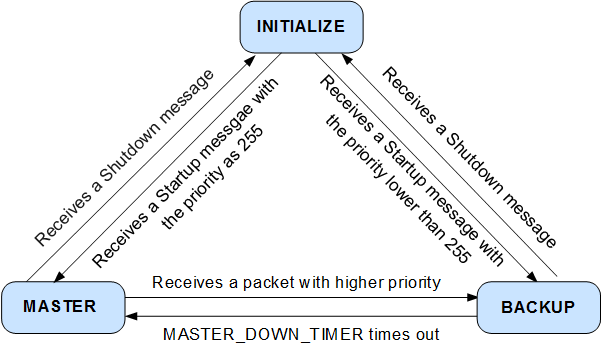

# 深入浅出keepalived+nginx实现网关主备高可用
## 背景

当用Nginx作网关的时候，如果网关宕机了，整个服务将会变得不可用，那么如何保证网关的高可用呢？我们可以用Keepalived来做主备，实现网关的高可用，主机宕机了，备机选举出一个来IP自动漂移顶上去，主机恢复了，IP再飘回主机，备机自动下线！

思考一下，代理可以实现高可用不呢？在两台网关前面加一台代理，轮询将请求分别打给两台网关，当一台网关宕机了，代理就不会往这台网关上分发流量，这样也能实现高可用，但是代理自身也只有一个，自己宕机了那么整个服务就不可用，也就是代理自己存在单点故障，那么在代理前面在加一层代理？会发现无论前置多少层代理，无论怎么无限套娃总会存在代理自身单点故障，所以代理是不能实现自身的高可用的，它只能实现自己后层的服务的高可用。

## keepalived原理

研究东西首先研究官网，官网说：keepalive是一个用c语言编写的路由软件。这个项目的主要目标是为Linux系统和基于Linux的基础设施提供简单、健壮的负载平衡和高可用性工具，通过VRRP协议实现高可用性。VRRP是路由器故障切换的基础...

- https://www.keepalived.org/

那么我们可以提炼出关键词：VRRP协议，那么这个协议是个啥？

我们首先思考一下：网关要实现主备，那么IP地址怎么设？不能主备都设置同一个IP吧，这样就冲突了，所以一定得有一个虚拟的IP用于接入网络，主备各自得有一个自己的IP用于主备自己的通信吧，不然备机怎么知道主宕机了，要么是备机不断的去请求主机看主机有没有返回数据包，一定时间没有返回就说明主机宕机了，要么是主机主动给备机发数据包，备机检测到一定时间内没有返回数据包则说明主宕机了，那么这个通知的过程得有一个通信协议吧，所谓协议，就是主备之间通信的方式，它定义了通信的内容，所以整个过程我们可以提炼出下面的概念

- VIP：虚拟IP（Virtual IP），即接入网络用于客户端访问的那个IP
- MASTER：主机，任何时候主机只有一台
- BACKUP：备机/备机组，备机可能不止一台
- VRRP：这就是我们所说的协议，VRRP全称为Virtual Router Redundancy Protocol，即**虚拟路由器冗余协议**

所以直接过过一遍VRRP协议内容

### VRRP协议

VRRP协议有两个版本

-  VRRPv2报文结构


- VRRPv3报文结构


| 报文字段                       | 含义                                                         |                                                              |
| ------------------------------ | ------------------------------------------------------------ | ------------------------------------------------------------ |
|                                | VRRPv2                                                       | VRRPv3                                                       |
| Version                        | VRRP协议版本号，取值为2。                                    | VRRP协议版本号，取值为3。                                    |
| Type                           | VRRP通告报文的类型，取值为1，表示Advertisement。             | VRRP通告报文的类型，取值为1，表示Advertisement。             |
| Virtual Rtr ID（VRID）         | 虚拟路由器ID，取值范围是1～255。                             | 虚拟路由器ID，取值范围是1～255。                             |
| Priority                       | Master设备在备份组中的优先级，取值范围是0～255。0表示设备停止参与VRRP备份组，用来使备份设备尽快成为Master设备，而不必等到计时器超时；255则保留给IP地址拥有者。缺省值是100。 | Master设备在备份组中的优先级，取值范围是0～255。0表示设备停止参与VRRP备份组，用来使备份设备尽快成为Master设备，而不必等到计时器超时；255则保留给IP地址拥有者。缺省值是100。 |
| Count IP Addrs/Count IPvX Addr | 备份组中虚拟IPv4地址的个数。                                 | 备份组中虚拟IPv4或虚拟IPv6地址的个数。                       |
| Auth Type                      | VRRP报文的认证类型。协议中指定了3种类型：0：Non Authentication，表示无认证。1：Simple Text Password，表示明文认证方式。2：IP Authentication Header，表示MD5认证方式。 | -                                                            |
| Adver Int/Max Adver Int        | VRRP通告报文的发送时间间隔，单位是秒，缺省值为1秒。          | VRRP通告报文的发送时间间隔，单位是厘秒，缺省值为100厘秒（1秒）。 |
| Checksum                       | 16位校验和，用于检测VRRP报文中的数据破坏情况。               | 16位校验和，用于检测VRRP报文中的数据破坏情况。               |
| IP Address/IPvX Address(es)    | VRRP备份组的虚拟IPv4地址，所包含的地址数定义在Count IP Addrs字段。 | VRRP备份组的虚拟IPv4地址或者虚拟IPv6地址，所包含的地址数定义在Count IPvX Addrs字段。 |
| Authentication Data            | VRRP报文的认证字。目前只有明文认证和MD5认证才用到该部分，对于其它认证方式，一律填0。 | -                                                            |
| rsvd                           | -                                                            | VRRP报文的保留字段，必须设置为0。                            |

### 状态机

VRRP用状态机来完成了主备之间的切换，所谓状态机，一言以蔽之

> 状态机是有限状态自动机的简称，是现实事物运行规则抽象而成的一个数学模型

注意两个特征：有限和自动，有限即状态是**有限**的，每个状态带有一系列的动作，当处于某状态下，这些动作会**自动**执行，在某个**事件**下，会触发一个状态到另外一个状态的**切换**，比如自动售卖机可能有三个状态

- 未付款状态：什么也不做
- 付款中状态：检查是否足额付款
- 已足额付款状态：弹出汽水；余额清零；销售额累加等等

那么此例中状态是**有限**的，跟随状态的**动作**会在该状态下自动执行，投币的动作会触发状态的切换，因此引出状态机的四个概念

- State：状态，一个状态机至少要包含两个状态
- Action：动作，事件发生以后要执行动作
- Event：事件，变换到某个状态的触发条件
- Transition：变换，也就是从一个状态变化为另一个状态

VRRP协议定义了一台机器的三种状态：

- 初始状态（Initialize）
- 活动状态（Master）：只有处于Master状态的设备才可以转发那些发送到虚拟IP地址的报文
- 备份状态（Backup）

以下是他们的切换关系



那么在不同状态下的动作又是什么呢？

#### Initialize

- 该状态为VRRP不可用状态，在此状态时设备不会对VRRP报文做任何处理。
- 通常刚配置VRRP时或设备检测到故障时会进Initialize状态。
- 收到接口Up的消息后，如果设备的优先级为255，则直接成为Master设备；如果设备的优先级小于255，则会先切换至Backup状态。

#### Masster

- 定时（Advertisement Interval）发送VRRP通告报文。
- 以虚拟MAC地址响应对虚拟IP地址的ARP请求。
- 转发目的MAC地址为虚拟MAC地址的IP报文。
- 如果它是这个虚拟IP地址的拥有者，则接收目的IP地址为这个虚拟IP地址的IP报文。否则，丢弃这个IP报文。
- 如果收到比自己优先级大的报文，立即成为Backup。
- 如果收到与自己优先级相等的VRRP报文且本地接口IP地址小于对端接口IP，立即成为Backup。

#### Backup

- 接收Master设备发送的VRRP通告报文，判断Master设备的状态是否正常。
- 对虚拟IP地址的ARP请求，不做响应。
- 丢弃目的IP地址为虚拟IP地址的IP报文。
- 如果收到优先级和自己相同或者比自己大的报文，则重置Master_Down_Interval定时器，不进一步比较IP地址。
- Master_Down_Interval定时器：Backup设备在该定时器超时后仍未收到通告报文，则会转换为Master状态。计算公式如下：Master_Down_Interval=(3*Advertisement_Interval) + Skew_time。其中，Skew_Time=(256–Priority)/256。
- 如果收到比自己优先级小的报文且该报文优先级是0时，定时器时间设置为Skew_time（偏移时间），如果该报文优先级不是0，丢弃报文，立刻成为Master。

## 实战环境准备

利用docker创建两个`CentOS`容器`ngt1`与`ngt2`，用docker的原因是降低实战的成本与复杂度

```shell
docker run -dit  --name ngt1 --privileged centos /usr/sbin/init
docker run -dit  --name ngt2 --privileged centos /usr/sbin/init
```
`ngt1`的ip是 `172.17.0.2`

`ngt2`的ip是 `172.17.0.3`

## nginx安装

上面的两个容器`ngt1`和`ngt2`都需要安装

编译安装脚本如下

```shell
# 定义路径、定义版本
NGINX_HOME=/usr/local/nginx
NGINX_VERSION=1.16.0

mkdir -p $NGINX_HOME
O_PATH=`pwd`
# 安装依赖wget 下载  gcc gcc-c++ 为编译环境  pcre pcre-devel使nginx支持rewrite模块
# openssl openssl-devel 使nginx支持ssl  zlib zlib-devel gd gd-devel 使nginx支持压缩 gd用于支持图像压缩
yum install -y wget net-tools make cmake gcc gcc-c++  pcre pcre-devel openssl openssl-devel zlib zlib-devel gd gd-devel
# 创建用户
useradd -s /sbin/nologin nginx
# 下载并解压
cd $NGINX_HOME && wget wget http://nginx.org/download/nginx-$NGINX_VERSION.tar.gz 
tar -zxf nginx-$NGINX_VERSION.tar.gz
# 编译安装
cd nginx-$NGINX_VERSION
./configure --prefix=$NGINX_HOME \
--user=nginx \
--group=nginx \
--with-pcre \
--with-http_ssl_module \
--with-http_v2_module \
--with-http_realip_module \
--with-http_addition_module \
--with-http_sub_module \
--with-http_dav_module \
--with-http_flv_module \
--with-http_mp4_module \
--with-http_gunzip_module \
--with-http_gzip_static_module \
--with-http_random_index_module \
--with-http_secure_link_module \
--with-http_stub_status_module \
--with-http_auth_request_module \
--with-http_image_filter_module \
--with-http_slice_module \
--with-mail \
--with-threads \
--with-file-aio \
--with-stream \
--with-mail_ssl_module \
--with-stream_ssl_module 
make && make install
# 软链
ln -s $NGINX_HOME/sbin/nginx /sbin/

# 添加环境变量
echo "export NGINX_HOME=$NGINX_HOME" >> ~/.bashrc
. ~/.bashrc
cd $O_PATH
# 查看版本
nginx -V
```
配置文件位置：`cat /usr/local/nginx/conf/nginx.conf`
### 修改HTML
将`index.html`修改成容器ip方便观察
```shell
# 备份
\cp /usr/local/nginx/html/index.html /usr/local/nginx/html/index.html.bak
# 设置IP
echo `ifconfig $name | grep "inet.*broadcast.*" | cut -d' ' -f10` > /usr/local/nginx/html/index.html
```
### 启动
```shell
nginx 
```
检测是否启动成功
```shell
curl 127.0.0.1
```

如果回显刚才设置的ip说明成功

### nginx编译参数解释

```bash
--with-cc-opt='-g -O2 -fPIE -fstack-protector'   # 设置额外的参数将被添加到CFLAGS变量。（FreeBSD或者ubuntu使用）
--param=ssp-buffer-size=4 -Wformat -Werror=format-security -D_FORTIFY_SOURCE=2' 
--with-ld-opt='-Wl,-Bsymbolic-functions -fPIE -pie -Wl,-z,relro -Wl,-z,now' 

--prefix=/usr/share/nginx                        # 指向安装目录
--conf-path=/etc/nginx/nginx.conf                # 指定配置文件
--http-log-path=/var/log/nginx/access.log        # 指定访问日志
--error-log-path=/var/log/nginx/error.log        # 指定错误日志
--lock-path=/var/lock/nginx.lock                 # 指定lock文件
--pid-path=/run/nginx.pid                        # 指定pid文件

--http-client-body-temp-path=/var/lib/nginx/body    # 设定http客户端请求临时文件路径
--http-fastcgi-temp-path=/var/lib/nginx/fastcgi     # 设定http fastcgi临时文件路径
--http-proxy-temp-path=/var/lib/nginx/proxy         # 设定http代理临时文件路径
--http-scgi-temp-path=/var/lib/nginx/scgi           # 设定http scgi临时文件路径
--http-uwsgi-temp-path=/var/lib/nginx/uwsgi         # 设定http uwsgi临时文件路径

--with-debug                                        # 启用debug日志
--with-pcre-jit                                     # 编译PCRE包含“just-in-time compilation”
--with-ipv6                                         # 启用ipv6支持
--with-http_ssl_module                              # 启用ssl支持
--with-http_stub_status_module                      # 获取nginx自上次启动以来的状态
--with-http_realip_module                 # 允许从请求标头更改客户端的IP地址值，默认为关
--with-http_auth_request_module           # 实现基于一个子请求的结果的客户端授权。如果该子请求返回的2xx响应代码，所述接入是允许的。如果它返回401或403中，访问被拒绝与相应的错误代码。由子请求返回的任何其他响应代码被认为是一个错误。
--with-http_addition_module               # 作为一个输出过滤器，支持不完全缓冲，分部分响应请求
--with-http_dav_module                    # 增加PUT,DELETE,MKCOL：创建集合,COPY和MOVE方法 默认关闭，需编译开启
--with-http_geoip_module                  # 使用预编译的MaxMind数据库解析客户端IP地址，得到变量值
--with-http_gunzip_module                 # 它为不支持“gzip”编码方法的客户端解压具有“Content-Encoding: gzip”头的响应。
--with-http_gzip_static_module            # 在线实时压缩输出数据流
--with-http_image_filter_module           # 传输JPEG/GIF/PNG 图片的一个过滤器）（默认为不启用。gd库要用到）
--with-http_spdy_module                   # SPDY可以缩短网页的加载时间
--with-http_sub_module                    # 允许用一些其他文本替换nginx响应中的一些文本
--with-http_xslt_module                   # 过滤转换XML请求
--with-mail                               # 启用POP3/IMAP4/SMTP代理模块支持
--with-mail_ssl_module                    # 启用ngx_mail_ssl_module支持启用外部模块支持
```


### nginx常用命令

```bash
nginx -c /path/to/nginx.conf     # 以特定目录下的配置文件启动nginx:
nginx -s reload                  # 修改配置后重新加载生效
nginx -s reopen                  # 重新打开日志文件
nginx -s stop                    # 快速停止nginx
nginx -s quit                    # 完整有序的停止nginx
nginx -t                         # 测试当前配置文件是否正确
nginx -t -c /path/to/nginx.conf  # 测试特定的nginx配置文件是否正确
```

## keepalived安装

编译安装脚本如下：

```shell
# 定义路径、定义版本
KEEPALIVED_HOME=/usr/local/keepalived
KEEPALIVED_VERSION=2.1.5

mkdir -p $KEEPALIVED_HOME
O_PATH=`pwd`
# 安装依赖
yum install -y wget make cmake gcc gcc-c++ openssl-devel net-tools
# 下载并解压
cd $KEEPALIVED_HOME && \
wget https://www.keepalived.org/software/keepalived-$KEEPALIVED_VERSION.tar.gz && \
tar -zxf keepalived-$KEEPALIVED_VERSION.tar.gz
# 编译安装
cd keepalived-$KEEPALIVED_VERSION
./configure --prefix=$KEEPALIVED_HOME
make && make install
# 软连
ln -s $KEEPALIVED_HOME/sbin/keepalived /sbin/
# 拷贝配置文件，默认路径为/etc/keepalived
mkdir /etc/keepalived
\cp -rf $KEEPALIVED_HOME/etc/keepalived/keepalived.conf /etc/keepalived/
# 添加环境变量
echo "export KEEPALIVED_HOME=$KEEPALIVED_HOME" >> ~/.bashrc
. ~/.bashrc
cd $O_PATH
```

### 配置检测脚本

思考一下，我们的目的是要实现nginx的高可用，那么一定要保证keepalived在运行的时候nginx也在运行，否在备机成为Master但是nginx都没运行呢那服务也是不可用的，简而言之，要用脚本来保证keepalived和nginx处于同时运行的状态，要么同时运行，要么同时不运行

脚本如下：在所有主备上都执行下面脚本

```bash
# 定义检测脚本文件
CHECK_SCRIPT=/etc/keepalived/nginx_check.sh
# 确保目录存在
mkdir -p $CHECK_SCRIPT 
rm -rf $CHECK_SCRIPT
yum install -y psmisc

# 生成检测脚本
cat > $CHECK_SCRIPT <<EOF
#!/bin/bash 
A=\`ps -C nginx --no-header | wc -l\` 
if [ \$A -eq 0 ];then 
    nginx 
    sleep 2
    if [ \`ps -C nginx --no-header |wc -l\` -eq 0 ];then
        # 如果没有killall 请安装 yum install -y psmisc
        killall keepalived 
    fi 
fi
EOF
# 添加权限
chmod +x $CHECK_SCRIPT

```

### keepalived配置

在所有机器上备份一下原始配置文件

```bash
# 备份keepalived原配置文件
cp /etc/keepalived/keepalived.conf /etc/keepalived/keepalived.conf.bak
```

#### Master配置

将下面内容写入配置文件`/etc/keepalived/keepalived.conf`中

- `mcast_src_ip`：本机 IP 地址 即`ngt1`的自己的IP地址，注意本地ip地址在docker中可以在容器内执行`ifconfig`查看，也可在容器外执行`docker inspect -f '{{range .NetworkSettings.Networks}}{{.IPAddress}}{{end}}'  容器名字`查看
- `virtual_ipaddress`：虚拟 IP 池, 集群内所有节点设置必须一样，虚拟IP即客户端访问时用的IP，比如`172.17.0.100/16   dev  eth0  label  eth0:vip`表示集群对外提供的IP为`172.17.0.100`，即客户端访问此IP地址，绑定在`eth0`网卡上，标签为`eth0:vip`，即`eth0`设备上的虚拟IP

```bash
! Configuration File for keepalived 
 
global_defs { 
   ## keepalived 自带的邮件提醒需要开启 sendmail 服务。建议用独立的监控或第三方 SMTP
   ## 标识本节点的字条串，通常为 hostname 
   router_id NGT1
} 
##  keepalived 会定时执行脚本并对脚本执行的结果进行分析，动态调整 vrrp_instance 的优先级。如果脚本执行结果为 0，并且 weight 配置的值大于 0，则优先级相应的增加。如果脚本执行结果非 0，并且 weight配置的值小于 0，则优先级相应的减少。其他情况，维持原本配置的优先级，即配置文件中 priority 对应的值。 
vrrp_script chk_nginx {
    ## 检测 nginx 状态的脚本路径，即上面的/etc/keepalived/nginx_check.sh
    script "/etc/keepalived/nginx_check.sh"
    ## 检测时间间隔
    interval 4
    ## 如果条件成立，权重-20 
    weight -20
} 
## 定义虚拟路由，VI_1 为虚拟路由的标示符，自己定义名称 
vrrp_instance VI_1 {
    ## 主节点为 MASTER，对应的备份节点为 BACKUP 
    state MASTER
    ## 绑定虚拟 IP 的网络接口，与本机 IP 地址所在的网络接口相同
    interface eth0   
    ## 虚拟路由的 ID 号，两个节点设置必须一样，可选 IP 最后一段使用，相同的 VRID 为一个组，他将决定多播的 MAC 地址
    virtual_router_id 9
    ## 本机 IP 地址 即ngt1的自己的IP地址
    mcast_src_ip 172.17.0.2
    ## 节点优先级，值范围 0-254，MASTER 要比BACKUP高   
    priority 100
    ## 优先级高的设置 nopreempt 解决异常恢复后再次抢占的问题   
    nopreempt
    ## 组播信息发送间隔，两个节点设置必须一样，默认 1s
    advert_int 1
    ## 设置验证信息，两个节点必须一致 
    authentication {
        auth_type PASS
        auth_pass 1111
    }

    ## 将 track_script 块加入instance 配置块 
    track_script {
        ## 执行 Nginx 监控的服务
        chk_nginx  
    } 
    ## 虚拟 IP 池, 集群内所有节点设置必须一样，虚拟IP即客户端访问时用的ip
    virtual_ipaddress {
        172.17.0.100/16   dev  eth0  label  eth0:vip
    }
}

```

#### Backup配置

参考Master的配置，有几个地方和Master不一样

- `router_id`：标识自己，集群内唯一
- `state`：备机就配置成`BACKUP`
- `mcast_src_ip`：备机自己的IP
- `priority`：优先级，备机比主机低

虚拟IP一定要配置成一样

- `virtual_ipaddress`：要和主机配置成一样，表示此集群对外暴露的IP

```bash
! Configuration File for keepalived 
 
global_defs { 
   ## keepalived 自带的邮件提醒需要开启 sendmail 服务。建议用独立的监控或第三方 SMTP
   ## 标识本节点的字条串，通常为 hostname 
   router_id NGT2
} 
##  keepalived 会定时执行脚本并对脚本执行的结果进行分析，动态调整 vrrp_instance 的优先级。如果脚本执行结果为 0，并且 weight 配置的值大于 0，则优先级相应的增加。如果脚本执行结果非 0，并且 weight配置的值小于 0，则优先级相应的减少。其他情况，维持原本配置的优先级，即配置文件中 priority 对应的值。 
vrrp_script chk_nginx {
    ## 检测 nginx 状态的脚本路径，即上面的/etc/keepalived/nginx_check.sh
    script "/etc/keepalived/nginx_check.sh"
    ## 检测时间间隔
    interval 4
    ## 如果条件成立，权重-20 
    weight -20
} 
## 定义虚拟路由，VI_1 为虚拟路由的标示符，自己定义名称 
vrrp_instance VI_1 {
    ## 主节点为 MASTER，对应的备份节点为 BACKUP 
    state BACKUP
    ## 绑定虚拟 IP 的网络接口，与本机 IP 地址所在的网络接口相同
    interface eth0   
    ## 虚拟路由的 ID 号，两个节点设置必须一样，可选 IP 最后一段使用，相同的 VRID 为一个组，他将决定多播的 MAC 地址
    virtual_router_id 9
    ## 本机 IP 地址 即ngt1的自己的IP地址
    mcast_src_ip 172.17.0.3
    ## 节点优先级，值范围 0-254，MASTER 要比BACKUP高   
    priority 80
    ## 优先级高的设置 nopreempt 解决异常恢复后再次抢占的问题   
    nopreempt
    ## 组播信息发送间隔，两个节点设置必须一样，默认 1s
    advert_int 1
    ## 设置验证信息，两个节点必须一致 
    authentication {
        auth_type PASS
        auth_pass 1111
    }

    ## 将 track_script 块加入instance 配置块 
    track_script {
        ## 执行 Nginx 监控的服务
        chk_nginx  
    } 
    ## 虚拟 IP 池, 集群内所有节点设置必须一样，虚拟IP即客户端访问时用的ip
    virtual_ipaddress {
        172.17.0.100/16   dev  eth0  label  eth0:vip
    }
}

```


### 启动

在所有机器上启动keepalived

```shell
keepalived 
```

查看是否启动

```shell
ps aux | grep keepalived
```

有如下回显表示启动成功

```properties
root        9761  0.0  0.0  22492   616 ?        Ss   01:36   0:00 keepalived
root        9762  0.0  0.1  45480  2352 ?        S    01:36   0:00 keepalived
```

在主机和备机上查看VIP，即虚拟IP，命令为：`ifconfig`，如下回显说明主机上的VIP已经生效了，在备机上同样查看，发现备机并没有VIP，这才是正常的

```properties
eth0:vip: flags=4163<UP,BROADCAST,RUNNING,MULTICAST>  mtu 1500
        inet 172.17.0.100  netmask 255.255.0.0  broadcast 0.0.0.0
        ether 02:42:ac:11:00:02  txqueuelen 0  (Ethernet)
```

### 测试

在集群外循环访问VIP：发现现在是主机的nginx在对外提供服务

```bash
while true; do curl 172.17.0.100; sleep 1 ;done
172.17.0.2
172.17.0.2
172.17.0.2
172.17.0.2
...

```

现在我们强行将主机上的nginx关闭，在ngt1上执行`nginx -s stop`，有如下回显

```properties
172.17.0.2
curl: (7) Failed connect to 172.17.0.100:80; 拒绝连接
curl: (7) Failed connect to 172.17.0.100:80; 拒绝连接
curl: (7) Failed connect to 172.17.0.100:80; 拒绝连接
172.17.0.2
172.17.0.2
172.17.0.2
...

```

暂时的停止了服务，稍后又恢复了，这说明是我们的检测脚本执行了，自动恢复nginx的运行

现在我们来模拟一下主机宕机，在主机上执行`killall keepalived nginx`，再观察输出

```properties
...
172.17.0.2
172.17.0.2
172.17.0.2
172.17.0.3
172.17.0.3
172.17.0.3
...
```

发现备机自动顶上来了，此时在备机上执行`ifconfig`是可以看到VIP的，即我们配置的`eth0:vip`

最后我们再次模拟主机恢复，在主机上执行`keepalived` 启动之，它会根据脚本自动启动`nginx`，稍等片刻，我们就发现主机自动切换回来了！

```properties
...
172.17.0.3
172.17.0.3
172.17.0.2
172.17.0.2
172.17.0.2
...
```

这就是`keepalived`实现的功能，准确说是VRRP协议能实现的功能，集群内的机器宕机后通过IP漂移（VRRP协议保证）让其他备机顶替上来继续工作，整个过程对客户端是透明的，无感知的！

## 抓包

抓包之前再看一下VRRP协议的基本描述：

VRRP协议只有一种报文，即主路由器定时向其它成员发送的组播报文。当Master正常工作时，它会每隔一段时间(缺省为1秒)发送一个VRRP**组播**报文，以通知组内的备份路由器，主路由器处于正常工作状态。(注意：只有Master才发送VRRP报文)，目的IP地址是**224.0.0.18**代表所有VRRP路由器，报文的TTL是255，协议号是112

首先安装抓包工具`tcpdump`

```bash
yum install -y tcpdump
```

### 正常情况下抓包

所谓正常情况即Master和所有Backup都工作正常

在所有机器上执行下面抓包命令，`-i`指定网卡设备为eth0，`vrrp`指定抓取协议，`-n`表示显示IP而不是主机名，`-vv`表示以啰嗦形式显示，即显示更多详细信息

```bash
tcpdump -i eth0 vrrp  -n -vv
```

然后会发现所有机器的VRRP协议包都是一样的，如下

```properties
04:52:43.041500 IP (tos 0xc0, ttl 255, id 299, offset 0, flags [none], proto VRRP (112), length 40)
    172.17.0.2 > 224.0.0.18: vrrp 172.17.0.2 > 224.0.0.18: VRRPv2, Advertisement, vrid 9, prio 100, authtype simple, intvl 1s, length 20, addrs: 172.17.0.100 auth "1111^@^@^@^@"
```

再来对照VRRP协议报文图


- `172.17.0.2`：是我们Master的自己的地址
- `224.0.0.18`：是VRRP协议规定的组播地址，所谓组播，字面意思，一组机器之间来传播，也就是说，Master发出的数据包所有定义在该组内其他机器都能收到，这也是为什么所有机器抓到的VRRP协议包数据都是一样的，现在只有Master在发VRRP包，其他机器都是在接收而已！ `172.17.0.2 > 224.0.0.18`这就能看出来是Master在发包！
- `VRRPv2`：表示是VRRP第二个版本的协议
- `Advertisement`：`Type`字段的取值
- `vrid 9`：表示Virtual Router ID是9
- `prio 100`：Priority是100，和我们配置的优先级一样
- `authtype simple`：认证方式为simple，明文认证
- `intvl 1s`：VRRP报文通报时间为1s，和我们配置的一致，配置文件中的`advert_int`
- `addrs: 172.17.0.100`：表示VIP的地址，和我们配置的一致
- `auth "1111^@^@^@^@"`：这是我们配置的认证信息

从报文我们至少知道现在是`172.17.0.2`这台机器在接管网关的工作，虚拟IP为`172.17.0.100`，当然还有优先级之类的信息...

### Master宕机后抓包

首先在备机上抓包，注意，此处抓包略有不同，需要抓网卡上的所有包，不只是vrrp包，这样做的目的是看清楚Master宕机后的arp包，在备机（`172.17.0.3`）上执行如下抓包命令，很简单，把vrrp限制去掉就可以

```bash
tcpdump -i eth0 -n -vv
```

然后模拟Master宕机，停止Master上的keepalived，在Master(`172.17.0.2`)上执行如下命令

```bash
killall keepalived
```

此时，可以看到备机上的arp包和vrrp包

```properties

# Master宕机之前还是正常的
05:04:26.092460 IP (tos 0xc0, ttl 255, id 1002, offset 0, flags [none], proto VRRP (112), length 40)
    172.17.0.2 > 224.0.0.18: vrrp 172.17.0.2 > 224.0.0.18: VRRPv2, Advertisement, vrid 9, prio 0, authtype simple, intvl 1s, length 20, addrs: 172.17.0.100 auth "1111^@^@^@^@"
    
# Master宕机会发出了IGMP包
05:04:26.094714 IP (tos 0xc0, ttl 1, id 0, offset 0, flags [DF], proto IGMP (2), length 40, options (RA))
    172.17.0.2 > 224.0.0.22: igmp v3 report, 1 group record(s) [gaddr 224.0.0.18 to_in { }]
05:04:26.608852 IP (tos 0xc0, ttl 1, id 0, offset 0, flags [DF], proto IGMP (2), length 40, options (RA))
    172.17.0.2 > 224.0.0.22: igmp v3 report, 1 group record(s) [gaddr 224.0.0.18 to_in { }]

# Master宕机后一系列ARP请求
05:04:26.780921 ARP, Ethernet (len 6), IPv4 (len 4), Request who-has 172.17.0.100 (Broadcast) tell 172.17.0.100, length 28
05:04:26.780965 ARP, Ethernet (len 6), IPv4 (len 4), Request who-has 172.17.0.100 (Broadcast) tell 172.17.0.100, length 28
05:04:26.780968 ARP, Ethernet (len 6), IPv4 (len 4), Request who-has 172.17.0.100 (Broadcast) tell 172.17.0.100, length 28
05:04:26.780971 ARP, Ethernet (len 6), IPv4 (len 4), Request who-has 172.17.0.100 (Broadcast) tell 172.17.0.100, length 28
05:04:26.780974 ARP, Ethernet (len 6), IPv4 (len 4), Request who-has 172.17.0.100 (Broadcast) tell 172.17.0.100, length 28

# Backup接替Master的工作并组播ARRP包
05:04:26.780997 IP (tos 0xc0, ttl 255, id 449, offset 0, flags [none], proto VRRP (112), length 40)
    172.17.0.3 > 224.0.0.18: vrrp 172.17.0.3 > 224.0.0.18: VRRPv2, Advertisement, vrid 9, prio 80, authtype simple, intvl 1s, length 20, addrs: 172.17.0.100 auth "1111^@^@^@^@"
05:04:27.781775 IP (tos 0xc0, ttl 255, id 450, offset 0, flags [none], proto VRRP (112), length 40)
    172.17.0.3 > 224.0.0.18: vrrp 172.17.0.3 > 224.0.0.18: VRRPv2, Advertisement, vrid 9, prio 80, authtype simple, intvl 1s, length 20, addrs: 172.17.0.100 auth "1111^@^@^@^@"

```

可以看到，Master宕机时，自己会发出IGMP包，感兴趣的可以自己查查，不再本文讨论范围

重点来了，在Master宕机后，备机会收到一些列的ARP请求询问VIP（172.17.0.100）的MAC地址，而且是它自己发出的！

```properties
# 172.17.0.100发出询问：谁有172.17.0.100 MAC地址请告诉172.17.0.100一下！
05:04:26.780965 ARP, Ethernet (len 6), IPv4 (len 4), Request who-has 172.17.0.100 (Broadcast) tell 172.17.0.100, length 28
```

它自己还不知道自己的MAC么？对，这个虚拟IP在Master宕机后漂移到Backup上它当然不知道自己的MAC地址，所以这里会先ARP请求获取Backup的MAC地址，然后Backup再不断发出ARRP组播包告知全网我Backup已经接盘了！谁也别想和我抢！

# 参考

- https://zhuanlan.zhihu.com/p/47434856
- https://51hcie.com/p7/file/dc/dc_fd_vrrp_0005.html
- https://cshihong.github.io/2017/12/18/%E8%99%9A%E6%8B%9F%E8%B7%AF%E7%94%B1%E5%86%97%E4%BD%99%E5%8D%8F%E8%AE%AE-VRRP/