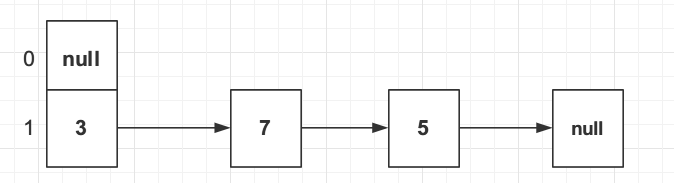
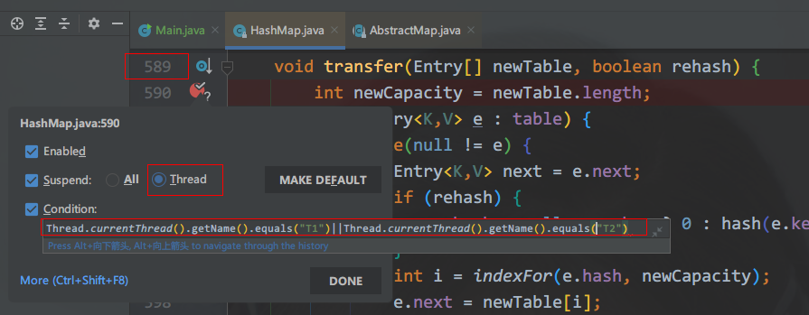
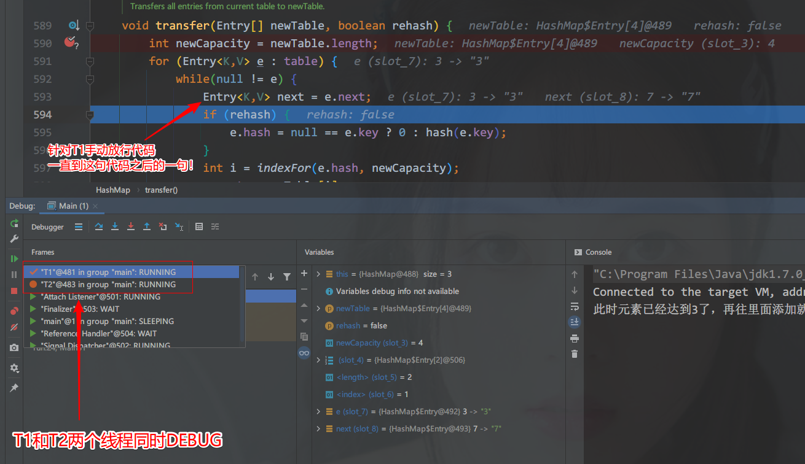
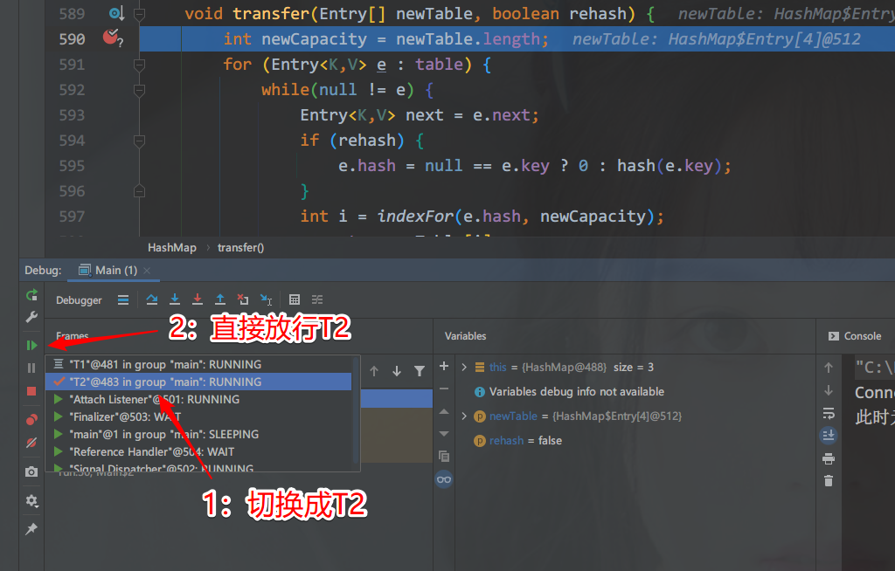
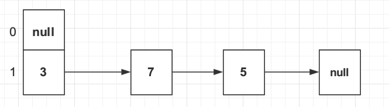
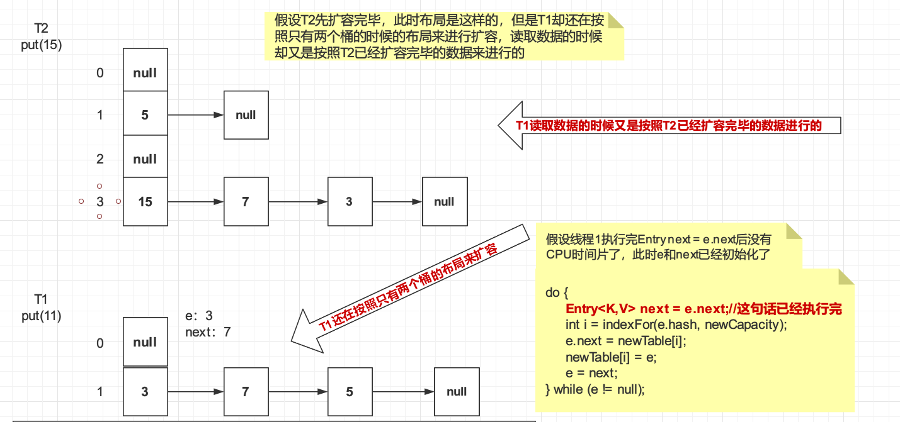
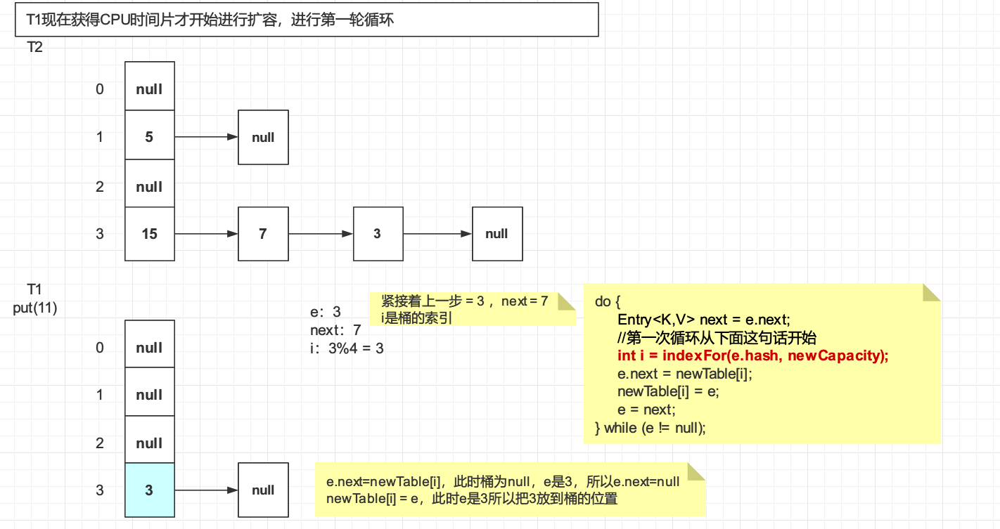
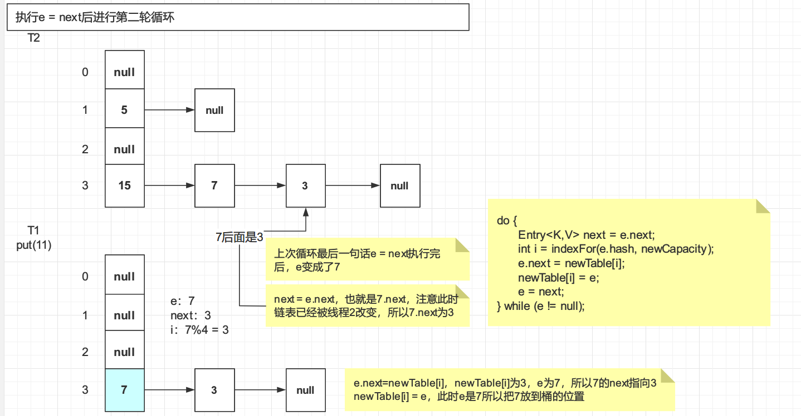
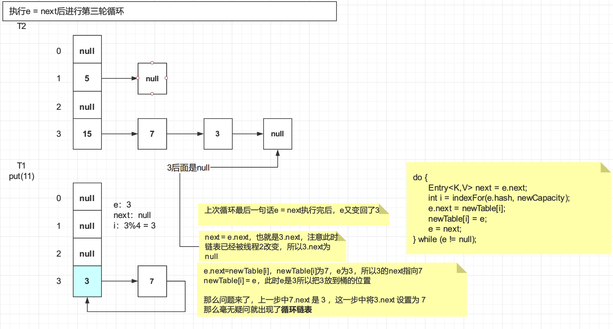
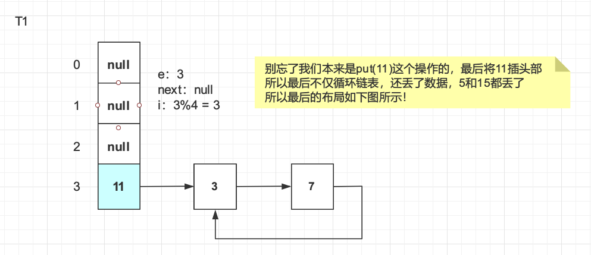

# 5张图讲明白JDK1.7下的HashMap死循环（原理+实战）

# 情景再现

网络上很多文章说`HashMap`死循环都是理论分析，其一是没有自己实验过，甚至给出的实验程序都是错误的，不能再现死循环的BUG，其二是给出的示意图不够详细，很多细节忽略了让人难以理解，本文在前人总结的基础上摸索出了实现死循环的方法，记录成文。

## 死循环原因

我们首先思考一下在什么样的情况下`HashMap`会死循环，死循环的原因不外乎是在多线程的同时扩容，在`JDK 1.7`的`HashMap`中，当hash冲突时，采用头插法拉链表，所谓头插法，即在每次都在链表头部（即桶中）插入最后添加的数据

当触发扩容阈值准备扩容的时候，会循环旧桶中的每个元素，重新计算hash值然后再次分配到新的桶中，这个过程如果产生hash冲突，那也会采用头插法拉链表，循环的时候是从头到尾，而头插法插入的时候，尾巴上的元素反而会变成头元素，相当于逆序了

当一个线程A在扩容还未完成的时候，不巧的是失去了CPU时间片，不能获得执行机会，另外一个线程B抢先扩容完毕了，并且链表变成了逆序，而线程A还在按照顺序操作，造成指针混乱，于是出现死循环，当然这么说过于笼统也说不清楚，后文讲解原理的时候会详细到每个步骤！

## 实验环境

`IDEA` + `JDK 1.7`，自从Oracle改版以后需要登录才能下载，而且链接不是很好找，这里推荐一个下载站点：http://java.sousou88.com/spec/oraclejdk.html

## 实验思路

既然要多线程才会实现，那么可以利用`IDEA`的多线程`DEBUG`操作将两个线程同时停在扩容操作处，然后让其中一个线程先扩容完，另外一个线程再次扩容造成死循环

## 程序代码

```java

import java.io.IOException;
import java.util.HashMap;


/**
 * 测试在JDK 1.7中 HashMap出现死循环
 */
public class Main {


    /**
     * 这个map 桶的长度为2，当元素个数达到  2 * 1.5 = 3 的时候才会触发扩容
     */
    private static HashMap<Integer,String> map = new HashMap<Integer,String>(2,1.5f);

    public static void main(String[] args) throws IOException, InterruptedException {
        map.put(5,"5");
        map.put(7,"7");
        map.put(3,"3");
        System.out.println("此时元素已经达到3了，再往里面添加就会产生扩容操作：" + map);
        new Thread("T1") {
            public void run() {
                map.put(11, "11");
                System.out.println(Thread.currentThread().getName() + "扩容完毕 " );
            };
        }.start();
        new Thread("T2") {
            public void run() {
                map.put(15, "15");
                System.out.println(Thread.currentThread().getName() + "扩容完毕 " + map);
            };
        }.start();

        Thread.sleep(10000);//时间根据debug时间调整
        
        //死循环后打印直接OOM，思考一下为什么？
        //因为打印的时候回调用toString回遍历链表，但此时链表已经成环状了
        //那么就会无限拼接字符串
//        System.out.println(map);
        System.out.println(map.get(5));
        System.out.println(map.get(7));
        System.out.println(map.get(3));
        System.out.println(map.get(11));
        System.out.println(map.get(15));

    }
}

```

注意环境是`JDK 1.7`，首先分析一下程序，我们创建了一个桶长度为2，负载因子为1.5的`HashMap`，也就是说这个`Map`在实际元素数量达到2 * 1.5 = 3之后，也就是放入第4个元素的时候会触发扩容，最开始我们放入了3个元素5、7、3，那么根据hash布局如下



此时我们开启线程T1和T2同时再往map里面put值，超过3个了，要扩容了！如果两个线程在并行，那么这两个线程都会引发扩容操作！此时我们可以通过`DEBUG`手动做一些手脚，最后再分别取出我们put的值看看是什么，下面就是我们做的手脚！

## 操作步骤

### 定义断点

在`HashMap`源码第589行`transfer`方法第一句话打一个条件断点



条件如下，意为当线程是T1或者T2的时候停住，其他放行

```java
Thread.currentThread().getName().equals("T1")||Thread.currentThread().getName().equals("T2")
```

需要注意的一点是`Suspend`选择`Thread`，表示是多线程`DEBUG`，多个线程会同时停住

然后以DEBUG的模式启动程序`main`方法

### 线程T1操作

不用意外将会在此处停住，左下角可以看到T1和T2同时都在DEBUG，也就是同时在扩容！然后手动放行T1到图示位置，也就是在这句代码之下！

```java
Entry<K,V> next = e.next;
```

很重要！否则可能造成不了死循环，因为这句话给e和next两个变量赋值了，才会造成后面的指针混乱！



### 线程T2操作

T2的操作就比较简单了，选择T2线程，直接放行即可，让T2先进行扩容！



线程T2放行以后会再次停留在T1线程`DEBUG`处，因为T1线程我们只做了赋值还没进行后续扩容操作，直接放行T1即可！

### 看结果

如果DEBUG时间操作太长main线程已经执行完毕，可以将main线程里面的时间改长一点

```java
        Thread.sleep(10000);//时间根据debug时间调整


```

不出意外，会输出下面的值，我们put的5、7、3、11、15结果只有7、3、11，5和15已经不见了！并且程序卡住不动了，说明已经死循环了，再看看电脑CPU占用是否不正常！

```properties
此时元素已经达到3了，再往里面添加就会产生扩容操作：{3=3, 7=7, 5=5}
T2扩容完毕 {5=5, 15=15, 7=7, 3=3}
T1扩容完毕 
null
7
3
11

```

# 原理分析

大概原理之前已经提到过：多个线程同时对`HashMap`做扩容操作可能会导致一个线程以另一个线程扩容完的逆序链表进行顺序操作，导致循环链表的产生，那么我们来看看具体是怎么产生的

## 基本条件构造

```java
private static HashMap<Integer,String> map = new HashMap<Integer,String>(2,1.5f);
...
map.put(5,"5");
map.put(7,"7");
map.put(3,"3");
```

这几句代码就是我们的基本条件构造，桶长度为2，扩容阈值为 2*1.5=3，5、3、7设计的很巧妙刚好hash冲突并在一条链表上，在put一个值就会产生扩容操作，基本内存布局如下



那么为什么要这么构造？桶长度为2那么下次扩容肯定是4，3%4 = 7%4，而5%4=1不再一个桶上了，所以扩容后至少会有3和7两个元素还在一个链条上，这样才有产生死循环的机会

## T2扩容完毕

T2扩容完后布局如下（上面一个图），而此时T1因为只执行了`Entry<K,V> next = e.next`（初始化了e和next指针），并不知道T2已经扩容完毕了，所以还在按照只有两个桶的布局来扩容，但是T1读取数据的时候又是按照T2已经扩容完毕的数据进行读取的！

初始化的两个指针值为（按照只有两个桶的时候初始化的指针，因为此时T2还未扩容）

```
e：3
next：7
```




## T1扩容第一轮循环

第一轮循环毫无疑问将3放到了桶上，然后循环体最后一句话 `e = next;`将`next`赋值给`e`让`e`指向了7



## T1扩容第二轮循环

上轮循环将`e`指向了7，本次循环的第一句话 `Entry<K,V> next = e.next;`，`e.next`是谁？这是关键，`e.next`已经被T2扩容的时候改成了3！但是3我们上面第一轮循环已经处理过了啊！这里势必会出问题，不过将在下轮循环中出问题，本轮循环`e`为7，直接将7插入到头部（桶中），那么这里就有一个`7 > 3`的引用



## T1扩容第三轮循环

问题就来了，上轮循环将`e`指向了3，3后面是`null`（T2扩容处理的），但是3我们已经在第一轮处理过了，并且在第二轮有个`7 > 3`的引用，本轮循环又会将3放到头部（桶中），3.next将会指向7产生一个`3 > 7`的引用，这不就循环引用产生循环链表了？问题就这么产生了！



最后别忘了T1的原本意图是要将11放入map，最后将11放入头部（桶中），所以最后的内存布局如下：



当我们分别取拿5、7、3、11、15的值的时候，对比上面布局就应该知道能不能拿到

```java
System.out.println(map.get(5));//没有了，拿不到
System.out.println(map.get(7));//可以拿到
System.out.println(map.get(3));//可以拿到
System.out.println(map.get(11));//可以拿到
System.out.println(map.get(15));//死循环！！！
```

和我们的输出结果一模一样

```properties
null
7
3
11
...死循环中
```

# 总结

希望通过上面的图示你能理解JDK1.7中死循环产生的原因，那么如何避免呢？答案当然是采用线程安全的`ConcurrentHashMap`，而且`HashMap`的实现在JDK1.8中有很多优化，并且也采用尾插法解决了死循环问题