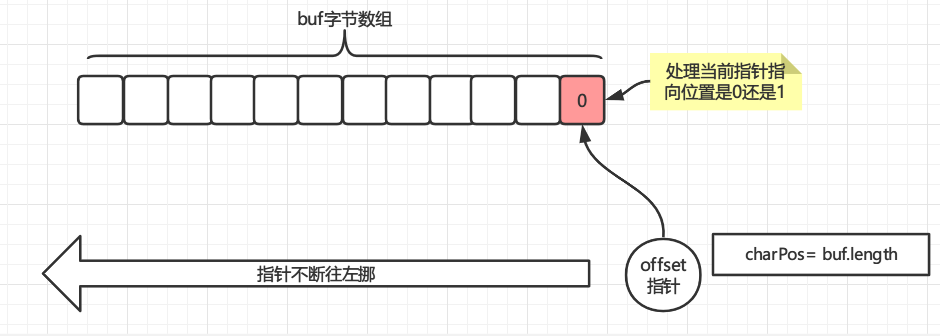

# 你以为你真的了解二进制吗？详解JDK中的二进制骚操作！

要求十进制转二进制，首先我们想到的是除2求余法，比如数字15，如下，不断的除以2，一直到0为止，最后将余数**倒序**排列就是该数的二进制表示

```properties
15/2 = 7 --------余1
7/2  = 3 --------余1
3/2  = 1 --------余1
1/2  = 0 --------余1
```

所以15的二进制表示就是`1111`，再举一例，520的二进制表示

```properties
520/2 = 260 -------余0
260/2 = 130 -------余0
130/2 = 65 --------余0
65/2  = 32 --------余1
32/2  = 16 --------余0
16/2  = 8  --------余0
8/2   = 4  --------余0
4/2   = 2  --------余0
2/2   = 1  --------余0
1/2   = 0  --------余1
```

余数倒序排列就是`1000001000`，所以520的二进制表示就是`1000001000`，那么把上述的算法用作代码写出来是怎么样的呢？

# 第一个版本

Java代码将上述过程表达出来如下

```java
public static String toBinary(int i){
    StringBuilder sb = new StringBuilder();
    while (i > 0){
        //i%2求余 比如15%2=1
        sb.append(i % 2);
        //求余之后除以2再赋值给i
        //注意，i是整型，所以小数会抹去，比如15/2=7，而不是7.5
        i = i / 2;
    }
    //将最后的结果逆序后再返回
    return sb.reverse().toString();
}
```

验证一下

```java
System.out.println(toBinary(520));//我们自己写的
System.out.println(Integer.toBinaryString(520));//JDK自带的
```

看看结果，输出是一样的说明验证通过

```properties
1000001000
1000001000
```

但是对于追求极致性能的我们来说并不满足上面的转换，因为求余操作符`%`的性能并没有位运算高，所以我们改成位运算，所以就出现了下面的第二个版本

# 第二个版本

第二个版本主要引入位运算为后面JDK的实现做好基础。

```java
public static String toBinary1(int i){
    StringBuilder sb = new StringBuilder();
    while (i > 0){
        //任何数与1做与运算，
        // 结果是0说明是偶数，任何偶数与2相除都余0
        // 结果是1说明是奇数，任何奇数与2相除都余1
        sb.append(i & 1);
        //求余之后除以2再赋值给i，i >> 1 表示 i / 2^1，
        //注意，i是整型，所以小数会抹去，比如15/2=7，而不是7.5
        i = i >> 1;//也可以写成 i >>= 1
    }
    return sb.reverse().toString();
}
```

## 重点说明`i & 1`

我们知道 `i % 2` 是除以2后的求余操作，比如 `15 % 2 = 1` ，那么`i & 1`运算又是什么鬼？从上文可知，那么我们来证明下面的公式

```properties
i % 2 = i & 1
```

对不熟悉位运算的同学可能一头雾水，这都是些啥符号，`&`表示二进制与运算，运算法则为**全1得1，有0得0**，举个例子

```properties
# 15 的二进制位1111 ， 1的二进制位0001
15 & 1 = 1111 & 0001 = 1
```

`i & 1`只能说明奇偶性，只看`i`的最后一位，如果最后一位是1说明是奇数，是0说明是偶数，这个怎么证明？先看二进制**量表**，所有的整数都可以从量表中的数字加起来表示，比如`15 = 8+4+2+1`，每位上都有，所以15的二进制是`1111`，二进制就是这么神奇，无论什么整数你都可以从下面的量表中找出数字加起来表示


扯远了，回来看一下量表，只有最低位`2^0=1`这个数字是奇数是吧，其他所有的数字全都是偶数，那么偶数加偶数还是偶数，偶数加1就是奇数，奇数加1？根本不存在这种情况，因为只有一个1，偶数变成奇数已经用掉了，比如`3 = 2 + 1 = 011 (二进制)` ，`4 = 4 = 100(二进制)`，看看是不是二进制最低位为1表示奇数，为0表示偶数，那么就证明了

```properties
i & 1 = 1 说明i是奇数
i & 1 = 0 说明i是偶数
```

那么奇数偶数和取余有啥关系？那么刚好碰巧，偶数除以2能除清余数为0，奇数除以2余1，所以就能证明

```properties
i % 2 = i & 1
```

`i = i >> 1`就没那么复杂了，`>>`表示右移 `>> 1`表示右移1位，`>> 2`表示右移2位，右移就是除法，`x >> y = x / 2^y`，所以`i >> 1 = i / 2^1`，因为位运算比`/`运算效率高，所以用此代替，下面证明一下

```properties
# 右移1位会把1111最低位的1往右边移动一下，就没有了，高位用0填充所以变成0111等于7，和15/2=7运算结果相同
15 >> 1 = 1111(15的2进制) >> 1 = 0111(二进制) = 7 

```

# 引出JDK自带的二进制转换运算

我们自己写的二进制转换和JDK自带的二进制转换比较一下效率，测试代码如下

```java
public static void main(String[] args) {
    int len = 10;
    List<Integer> randomNum = new ArrayList<>();
    for (int i = 0;i<len;i++)
        randomNum.add(new Random().nextInt(1000));

    long s = System.currentTimeMillis();
    for (int i : randomNum) toBinary(i);
    System.out.println("toBinary 耗时"+ (System.currentTimeMillis() - s +
                        /*赋值*/( (s = System.currentTimeMillis()) - s)  ) +"ms" );
    for (int i : randomNum) toBinary1(i);
    System.out.println("toBinary1 耗时"+ (System.currentTimeMillis() - s +
                        /*赋值*/( (s = System.currentTimeMillis()) - s)  ) +"ms" );
    for (int i : randomNum) Integer.toBinaryString(i);
    System.out.println("toBinaryString 耗时"+ (System.currentTimeMillis() - s +
                        /*赋值*/( (s = System.currentTimeMillis()) - s)  ) +"ms" );
}
```

每次都生成`len`个1000以内的随机数字，然后用我们自己的转换方法和JDK自带的转换方法做对比，通过控制`len`长度可以得到下表结果

| 次数  | toBinary(单位ms) | toBinary1(单位ms) | toBinaryString(单位ms) |
| ----- | ---------------- | ----------------- | ---------------------- |
| 10    | 1                | 0                 | 0                      |
| 100   | 1                | 1                 | 0                      |
| 1000  | 2                | 2                 | 0                      |
| 10000 | 7                | 4                 | 4                      |
| 十万  | 25               | 19                | 11                     |
| 百万  | 118              | 124               | 37                     |
| 千万  | 1163             | 1031              | 350                    |
| 一亿  | 9896             | 7773              | 2455                   |

可以看到，我们自己写的`toBinary`和`toBinary1`效率相差不大，使用位运算后的`toBinary1`效率相对好一点，但是JDK自带的`toBinaryString`效率完全吊打我们自己写的，效率至少是好几倍以上，那么JDK自带的进制转换是怎么实现的呢？

首先把代码贴出来

- `toBinaryString`和`toUnsignedString0`

```java
public static String toBinaryString(int i) {
    return toUnsignedString0(i, 1);
}

private static String toUnsignedString0(int val, int shift) {
    // assert shift > 0 && shift <=5 : "Illegal shift value";
    int mag = Integer.SIZE - Integer.numberOfLeadingZeros(val);
    int chars = Math.max(((mag + (shift - 1)) / shift), 1);
    char[] buf = new char[chars];

    formatUnsignedInt(val, shift, buf, 0, chars);

    // Use special constructor which takes over "buf".
    return new String(buf, true);
}
```

JDK实现的基本思路是首先通过`numberOfLeadingZeros`找出待转换的十进制数在二进制里面最高位的1在什么位置，即该数字要占多长的空间，然后分配固定的字节数组`char[] buf`，通过`formatUnsignedInt`填充字节数组，最后返回，这里主要是`numberOfLeadingZeros`和`formatUnsignedInt`这两个方法的实现，我们一个一个来分析

## numberOfLeadingZeros

```java
public static int numberOfLeadingZeros(int i) {
    // HD, Figure 5-6
    if (i == 0)
        return 32;
    int n = 1;
    if (i >>> 16 == 0) { n += 16; i <<= 16; }
    if (i >>> 24 == 0) { n +=  8; i <<=  8; }
    if (i >>> 28 == 0) { n +=  4; i <<=  4; }
    if (i >>> 30 == 0) { n +=  2; i <<=  2; }
    n -= i >>> 31;
    return n;
}
```

这个方法做的事情是找出`i`里面最高位的1是在哪个位置，然后返回高位的所有的0的长度，即找最高位有多少个0，比如15在Java中的二进制表示为

```properties
00000000 00000000 00000000 00001111
```

那么该方法返回的值就是28，因为高位一共28个0，知道了这个长度用最大长度32减去此长度，那么就知道字节数字长度是`32 - 28 = 4`

这个方法网上有很多解释，但是只是将运行过程贴出来了，没有将思想性的东西说明白，此处我尝试将思想层面的东西表述出来

如果换做是你来实现这个方法你会怎么做？你可以把每个数字从高位开始拿出来挨个和1做与运算，找到一个1的就返回位置，如下

```properties
  00000000 00000000 00000000 00001111
& 1
--------------------------------------
  0(是0没找到)
  
.....省略...
  00000000 00000000 00000000 00001111
&                                1
--------------------------------------
                                 1(是1，找到了！)
```

这样的时间复杂度是`O(N)`，得挨个循环查看，那么来看看JDK是怎么做的

方法`numberOfLeadingZeros`中，看到这么多写死的参数(里面的`16、24、28、30`)第一件事应该思考什么呢？什么情况下参数能写死呢？此时应该想到肯定和一些固定的属性或者说很难变动的属性有关系，比如Java中`int`整型的长度为4字节共32位。16是32的一半，24是16到32的一半，28是24到32的一半，30又是28到32的一半，这有点像啥？没错就是二分查找法，下面我们演示一下如何用2分法查找数字15在高位有多少个0

### 第一轮右移16位

15的二进制表示如下，通过肉眼观察我们可以知道前面有28个0，我们以此来验证

```properties
00000000 00000000 00000000 00001111
```

首先将32位中间砍断分成两个16位，然后执行操作 `15>>>16`右移16位，如果右移后的结果是0，即 `15 >>> 16 = 0`，说明`15`至少在高位有16个0了，直接看图就明白了为啥是至少16个0了


最后，再将15左移16位，将15左移16位的目的是什么？因为我们上面确认了有16个0了，但是还不止16个，所以要继续查找，为下次二分法做准备，所以现在的数字已经变成了 `15 << 16 = 15 * 2^16`，如下图


### 第二轮右移24位

依然如法炮制，注意现在的中间位置变成了第24位了，即32位的中间的中间


通过右移24位我们得知此轮二分法中至少在高位有8个0，在加上第一轮中的16个0，所以目前为止就是16+8=24个0，最后别忘了左移8位为下一轮二分做准备，为啥是左移8位？因为高8位我们已经处理了，但是低8位的情况还未知，所以要左移8位为下一轮做准备，如下图


### 第三轮右移28位

依然如法炮制，注意现在的中间位置变成了第28位了，即32位的中间的中间的中间


通过右移28位我们得知此轮二分法中至少在高位有4个0，在加上上一轮中的24个0，所以目前为止就是24+4=**28**个0，最后别忘了左移4位为下一轮二分做准备，如下图


### 第四轮右移30位

依然如法炮制，注意现在的中间位置变成了第30位了，即32位的中间的中间的中间的中间


此时需要注意了，因为右移30位后并不等于0，所以说明现在至少已经碰到原始数字（15）的第一个高位为1的位置了，说明此时可以终止查找，当然也可以继续在左移2位进行最后一次二分法，但是在本例中是没有意义的，但是如果你给的数字足够小的话（比如1）可能就会进行最后一次二分法查找。为了本例完整，我还是将最后一次二分法的过程画出来，如下图左移2位


### 第五轮右移31位

依然如法炮制，注意现在的中间位置变成了第31位了，即32位的中间的中间的中间的中间的中间


此时已经不满足右移31位为0的条件了，并且此时已经是最后一次二分查找，所以整个过程到此结束！

通过上面的五轮二分查找（准确应该是四轮）我们得到了最终的结果，15这个数字的最高位有28个0，和我们肉眼观察的一致！

当然上面只是一种二分法的思想，和JDK自带的处理可能不尽相同，但是思想是一致的，感兴趣的可以自己多debug一下，下面这几句代码，虽然不多，但每句都是精华，可见JDK的设计质量是非常不错的。

```java
public static int numberOfLeadingZeros(int i) {
    // HD, Figure 5-6
    if (i == 0)
        return 32;
    int n = 1;
    if (i >>> 16 == 0) { n += 16; i <<= 16; }
    if (i >>> 24 == 0) { n +=  8; i <<=  8; }
    if (i >>> 28 == 0) { n +=  4; i <<=  4; }
    if (i >>> 30 == 0) { n +=  2; i <<=  2; }
    n -= i >>> 31;
    return n;
}
```

之前我们挨个查找的时间复杂度为线性的`O(N)`，现在通过二分法查找，时间复杂度减少为
$$
O(\log_2N)
$$

简而言之挨个查找最坏的情况下要找32次，而二分查找法最坏只需要查找5次，查找效率直接翻倍！

## formatUnsignedInt

```java
static int formatUnsignedInt(int val, int shift, char[] buf, int offset, int len) {
    int charPos = len;
    int radix = 1 << shift;
    int mask = radix - 1;
    do {
        buf[offset + --charPos] = Integer.digits[val & mask];
        val >>>= shift;
    } while (val != 0 && charPos > 0);

    return charPos;
}
```

这个方法相对而言就很简单了，功能就是填充字节数组，几个参数的含义分别是

- `val`：待转换的整数
- `shift`：可以理解成一个转换类型系数，1表示二进制，3表示八进制，4表示十六进制
- `buf`：待填充字节数组
- `offset`：偏移量，即指明数组从哪里开始
- `len`：往数组里面写的最大位置+1，可以简单理解成数组的长度`buf.length`

​    `int radix = 1 << shift;`这句话可以看出来`radix`表示的就是进制，下面说明了`shift`为1、3、4时的情况和`mask`的取值情况

```properties
1 -> radix  = 1 << 1 = 2^1 = 2  -> mask=2 - 1=1=0001
3 -> radix  = 1 << 3 = 2^3 = 8  -> mask=8 - 1=7=0111
4 -> radix  = 1 << 4 = 2^4 = 16 -> mask=16-1=15=1111
```

当`shift`为1时，`radix`为2，`mask`为1即二进制的`0001`所以`val & mask`就是取`val`的最低位，整个过程如下图



注意，填充是逆序的

# 比JDK还快的二进制转换

那么可以写出比JDK自带的更快的二进制转换吗？答案是否定的，至少我目前没找到，问题在于字符串的构建上，JDK是这样构建最终字符串的

```java
String(char[] value, boolean share) {
    // assert share : "unshared not supported";
    this.value = value;
}
```

`char[] value`直接做了一个赋值，相当于是共享的，而这个构造方法只有JDK自己能调，不是`public`的，而我们自己构建字符串是调用的下面这个方法

```java
public String(char value[]) {
	this.value = Arrays.copyOf(value, value.length);
}
```

这里其实多了一个`char`数组复制的开销，所以是干不过JDK自带的，但是有一个偏方，就是通过反射来调用第一个构造方法，但是又会存在反射的开销，效率肯定比不上JDK自带的，所以无论如何是干不过JDK的，最多只能接近，下面我提供了通过反射构建字符串的案列，感兴趣的同学自行研究

```java
public static char[] BINARY = new char[]{'0','1'};
//获取String类的字节码对象
public static Class<String> STRING = String.class;
//调用getDeclaredConstructor()方法,可获取到类的私有构造器(包括带有其他修饰符的构造器）
public static Constructor<String> STRING_CLAZZ;
//静态初始化
static {
    try {
        STRING_CLAZZ = STRING.getDeclaredConstructor(char[].class,boolean.class);
        STRING_CLAZZ.setAccessible(true);
    } catch (NoSuchMethodException e) {
        e.printStackTrace();
    }
}

public static String toBinary1(int i) throws IllegalAccessException, InvocationTargetException, InstantiationException {
    /*计算最高位有多少个0填充*/
    int j = i;
    int n = 1;
    if (j == 0)
        n = 32;
    else {
        //二分法查找最高位的0的个数
        if (j >>> 16 == 0) { n += 16; j <<= 16; }
        if (j >>> 24 == 0) { n +=  8; j <<=  8; }
        if (j >>> 28 == 0) { n +=  4; j <<=  4; }
        if (j >>> 30 == 0) { n +=  2; j <<=  2; }
        n -= j >>> 31;
    }


    char[] buf = new char[32 - n];/*定义数组长度*/
    int tmp = 0;
    while (i > 0){
        //任何数与1做与运算，
        // 结果是0说明是偶数，任何偶数与2相除都余0
        // 结果是1说明是奇数，任何奇数与2相除都余1
        buf[buf.length - 1 - tmp++] = BINARY[i & 1];
        //求余之后除以2再赋值给i，i >> 1 表示 i / 2^1，
        //注意，i是整型，所以小数会抹去，比如15/2=7，而不是7.5
        i >>= 1;//也可以写成 i >>= 1
    }
    //通过反射调用String的共享char数组构造方法
    return  STRING_CLAZZ.newInstance(buf,true);
}
```

# 总结

JDK中很多设计都是通过位操作提高效率，所以要多熟悉一下位操作才不至于在看JDK源码的时候懵逼