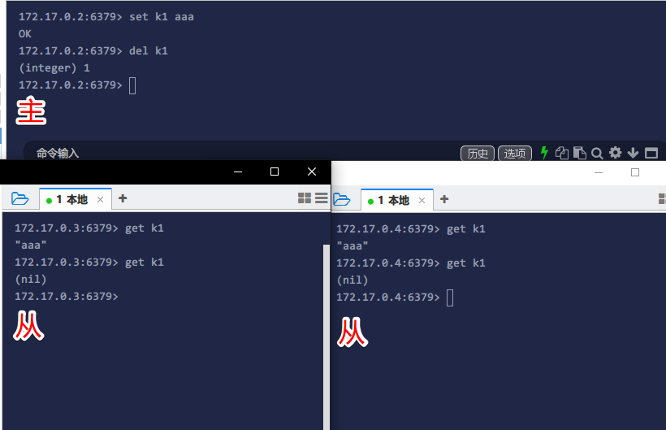
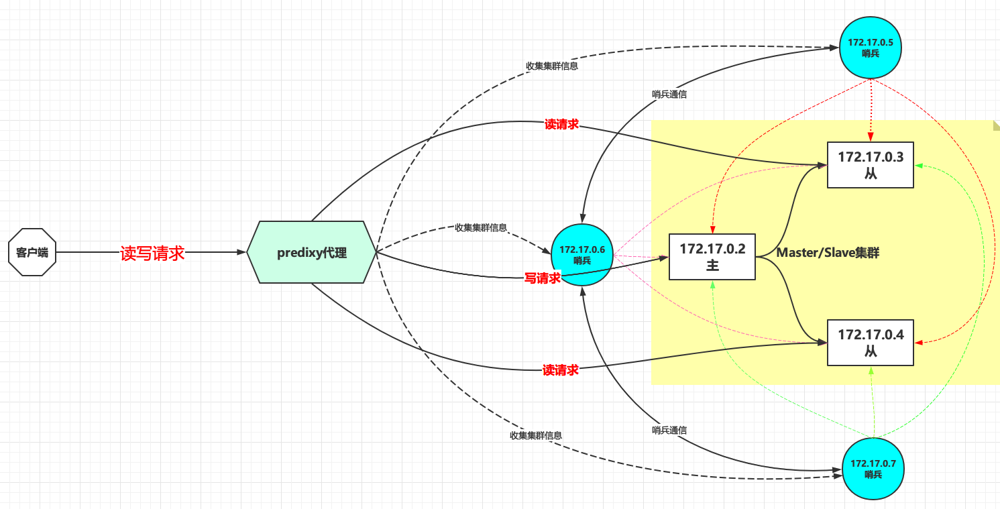
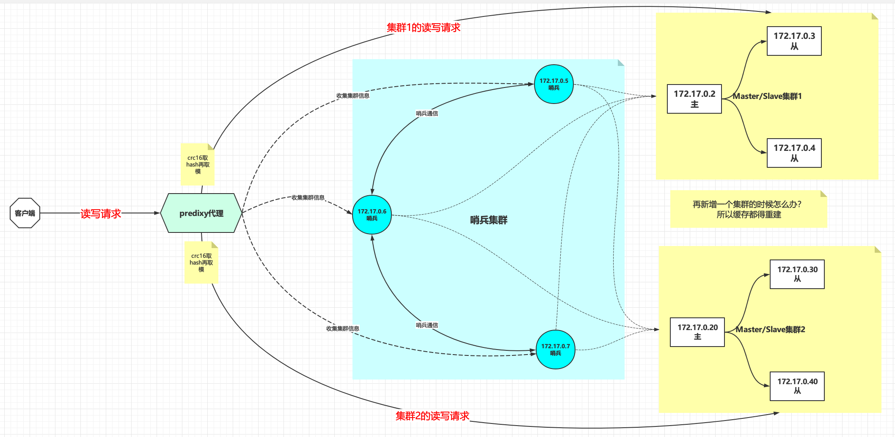

# Redis主从集群+哨兵搭建实战

# 背景

当请求量逐渐变大，单机Redis可能撑不住请求的时候就要考虑将Redis做集群，入门级别的Redis集群就是主从集群，利用读写分离的特性提供高可用，引入新的技术就会带来新的问题，当然引入集群也是有很多坏处的，比如

- 业务逻辑变复杂，需要读写分离和负载均衡（redis代理解决）
- 网络复杂，有可能节点之间由于网络不可达产生分区风险（CAP理论）
- 一主多从，主宕机集群部分不可用（哨兵模式解决）
- 需要更多硬件资源支持（废话）

当然带来的这些问题就有相应的解决方案，下面一步一步带你入坑。

# 主从集群搭建

## 环境准备

```bash
docker run -dit  --name r2 --privileged centos /usr/sbin/init
docker run -dit  --name r3 --privileged centos /usr/sbin/init
docker run -dit  --name r4 --privileged centos /usr/sbin/init
```

它们的IP分别如下，我们的规划是r2作为主，其余为从

```properties
r2 172.17.0.2 # 主
r3 172.17.0.3 # 从
r4 172.17.0.4 # 从
```

docker查看容器ip的命令为

```bash
docker inspect --format '{{ .NetworkSettings.IPAddress }}'  r2
```

## 安装Redis

进入容器命令`docker exec -it r2 bash`

每台分别安装Redis，采用源码编译安装的方式，安装版本为5.0.5，可自定义

```bash
REDIS_VERSION=5.0.5
# 编译环境安装和一些常用工具
yum install -y wget gcc make telnet
# 创建文件夹
cd ~ && mkdir soft && cd soft
# 下载软件
wget http://download.redis.io/releases/redis-$REDIS_VERSION.tar.gz
# 解压
tar xf redis-$REDIS_VERSION.tar.gz && cd redis-$REDIS_VERSION
# 看README.md 执行出错看缺什么就先装什么，装完之后clean一下(make distclean)再次make 
# 生产环境做好执行一下测试 make test
# 可以查看一下生成的可执行程序xxx.o ls -lh src 
make
# 安装
make install PREFIX=/opt/redis$REDIS_VERSION
# 添加环境变量
cat >> /etc/profile <<EOF
export REDIS_HOME=/opt/redis$REDIS_VERSION
export PATH=$PATH:\$REDIS_HOME/bin
EOF
echo  'source /etc/profile' >> ~/.bashrc && source ~/.bashrc
cd utils
# 可以执行—次或多次，需要手动确定参数
# a)一个物理机中可以有多个redis实例(进程)，通过port区分
# b)可执行程序就一份在目录，但是内存中未来的多个实例需要各自的配置文件，持久化目录等资源
# c) service redis_6379 start/stop/stauts>linux /etc/init.d/****
# d)脚本还会帮你启动!
./install_server.sh
ps -fe | grep redis
```

- 更改配置文件中的ip

```bash
sed -i 's/bind 127.0.0.1/bind 0.0.0.0/g'  /etc/redis/6379.conf
```

配置文件位置在`/etc/redis/6379.conf`，如果要在内网访问，需要修改配置文件的`bind 127.0.0.1`中的ip为`0.0.0.0`，意为允许任何连接，否则在局域网中是连不上的，这也是用docker进行网络隔离的好处，可以更贴合生产环境，发现更多问题。

- 设置非守护进程，让redis在前台阻塞运行，测试时方便观察输出，当然生产环境中不建议关闭

```bash
# 关闭守护进程
sed -i 's/daemonize yes/daemonize no/g'  /etc/redis/6379.conf

# 关掉日志
# logfile /var/log/redis_6379.log
sed -i 's|logfile /var/log/redis_6379.log|#logfile /var/log/redis_6379.log|g'  /etc/redis/6379.conf
```

- 重启下redis

```bash
# -15优雅的杀掉
kill -15 `ps aux | grep -v grep | grep redis | awk '{ print $2 }'`
# 重启
redis-server /etc/redis/6379.conf
```

- 客户端连接，新开shell窗口连接一下看看是否能连接成功

```bash
# 查看帮助
redis-cli -h
# 指定主机端口连接
redis-cli -h 127.0.0.1 -p 6379
```

## 启动主从集群

上一步每台都安装了redis并且验证了可以启动，那么现在来设置主从集群启动，`172.17.0.2`为主，可以不用管它，`172.17.0.3`和`172.17.0.4`是从，启动的时候需要用`replicaof`命令指定是从`172.17.0.2`的复制，在3和4上分别执行如下命令即可

```bash
redis-server  /etc/redis/6379.conf --replicaof 172.17.0.2 6379
```

看到输出如下，说明从机已经连上主机了，随时准备接受请求

```properties
... * Connecting to MASTER 172.17.0.2:6379
... * MASTER <-> REPLICA sync started
... * Non blocking connect for SYNC fired the event.
... * Master replied to PING, replication can continue...
... * Partial resynchronization not possible (no cached master)
... * Full resync from master: 3c1b294dd75b88d62a9f6be85593b51264f68970:0
... * MASTER <-> REPLICA sync: receiving 175 bytes from master
... * MASTER <-> REPLICA sync: Flushing old data
... * MASTER <-> REPLICA sync: Loading DB in memory
... * MASTER <-> REPLICA sync: Finished with success

```

## 测试

首先，在主上设置一个键，在从上试试能否获取即可

```bash
# 主
set k1 aaa
# 从
get k1
```

如下图，发现主设置值之后从也有值，主删除之后从也获取不到了，说明我们的主从集群搭建成功！



并且是读写分离的，从只能读，主读写都可以，在从上设置值会报错，但是也可以通过配置开启从机的写权限`slave-read-only no`，这样意义并不是很大，因为从机的任务就是数据备份和负载均衡的

```properties
set k2 bash
(error) READONLY You can't write against a read only replica.
```

当然这样的集群是有问题，假如现在主宕机了，那么整个集群就是只读的，并且一部分流向主的读请求也会失败（除非读请求全部流向从机），主挂了之后发现从机一直连不上主

```properties
... # Connection with master lost.  # 和主的连接丢失
... * Caching the disconnected master state. # 缓存一下状态
... * Connecting to MASTER 172.17.0.2:6379   # 一直在尝试连接主
... * MASTER <-> REPLICA sync started
... # Error condition on socket for SYNC: Connection refused
... * Connecting to MASTER 172.17.0.2:6379
... * MASTER <-> REPLICA sync started
... # Error condition on socket for SYNC: Connection refused

```

那么有没有解决该问题的办法呢？答案是有的，那就是哨兵机制！哨兵可以监控整个集群的健康状态，当主宕机之后可以将从提升为主，从而实现**故障转移**！

## 引入哨兵

哨兵一般都是奇数个，因为需要过半数表决，这就是CAP理论的知识了，这里不再赘述；哨兵一定不要和Redis服务器在同一台机器上，因为Redis宕机了那么哨兵也就宕机了，起不到监控作用，所以我们新建三个容器用来作为哨兵的角色。

一套哨兵是可以监控多个Redis主从集群的

### 哨兵环境准备

```bash
docker run -dit  --name s1 --privileged centos /usr/sbin/init
docker run -dit  --name s2 --privileged centos /usr/sbin/init
docker run -dit  --name s3 --privileged centos /usr/sbin/init
```

各节点ip如下

```properties
s1 172.17.0.5
s2 172.17.0.6
s3 172.17.0.7
```

### 安装

哨兵也是Redis服务器，只不过只是具有发布/订阅功能的Redis服务器，所以所有哨兵都需要先安装Redis，参考最上面Redis的安装章节

### 配置并启动

新增哨兵配置文件

```bash
# port 此哨兵工作的port
# 语法 sentinel monitor <master-name> <ip> <redis-port> <quorum>
# <master-name> 取个名字，一套哨兵可能监控很多redis集群
# <ip> 目标集群主的那台机器的IP
# <redis-port> 目标集群主的那台机器的端口
# <quorum> 比如3个哨兵，有2个意见达成一致产生群体效应，这个quorum就写2
cat > /etc/redis/sentinel7380.conf<<EOF
port 7380 
sentinel monitor mymaster 172.17.0.2 6379 2
EOF
```

`sentinel monitor mymaster 172.17.0.2 6379 2`解释

- `mymaster` ：随便取个名字，一套哨兵是可以监控多个Redis集群的
- `172.17.0.2`：指定主的IP
- `6379`：指定主的端口
- `2`：`quorum`，表示有2个意见达成一致就可以产生群体效应，做表决动作

在三台上分别启动哨兵

```bash
redis-server  /etc/redis/sentinel7380.conf --sentinel
```

当第一台哨兵启动后他也能知道目前集群中有哪些机器，因为主知道

```properties
... # +monitor master mymaster 172.17.0.2 6379 quorum 2
... * +slave slave 172.17.0.3:6379 172.17.0.3 6379 @ mymaster 172.17.0.2 6379
... * +slave slave 172.17.0.4:6379 172.17.0.4 6379 @ mymaster 172.17.0.2 6379
```

启动剩余的哨兵，发现最先启动的哨兵知道后面两个哨兵上线了

```properties
...  +sentinel sentinel 98a51b9a5cf9964b7d17325c58ef6408dfddef20 172.17.0.6 7380 @ mymaster 172.17.0.2 6379
... * +sentinel sentinel 6aca27450e49ee7de6b5358ab0e91c64dba62d24 172.17.0.7 7380 @ mymaster 172.17.0.2 6379

```

后启动的哨兵也知道目前存在哪些哨兵和集群中有哪些机器

```properties
..... +slave slave 172.17.0.3:6379 172.17.0.3 6379 @ mymaster 172.17.0.2 6379
... * +slave slave 172.17.0.4:6379 172.17.0.4 6379 @ mymaster 172.17.0.2 6379
...  +sentinel sentinel 98a51b9a5cf9964b7d17325c58ef6408dfddef20 172.17.0.6 7380 @ mymaster 172.17.0.2 6379
...* +sentinel sentinel 8b36fa769b82d9131f3b33c4ef941864fbe36481 172.17.0.5 7380 @ mymaster 172.17.0.2 6379
```

他们是通过什么通信的呢？答案是**发布/订阅**，可以登录主订阅消息`PSUBSCRIBE *`，可以知道哨兵在“聊”些什么，如下，你可以看到哨兵之间在"聊天"，实际上：**客户端可以将 Sentinel 看作是一个只提供了订阅功能的 Redis 服务器**

```properties
3) "__sentinel__:hello"
4) "172.17.0.5,7380,8b36fa769b82d9131f3b33c4ef941864fbe36481,0,mymaster,172.17.0.2,6379,0"
1) "pmessage"
2) "*"
3) "__sentinel__:hello"
4) "172.17.0.6,7380,98a51b9a5cf9964b7d17325c58ef6408dfddef20,0,mymaster,172.17.0.2,6379,0"
1) "pmessage"
2) "*"
3) "__sentinel__:hello"
4) "172.17.0.7,7380,6aca27450e49ee7de6b5358ab0e91c64dba62d24,0,mymaster,172.17.0.2,6379,0"
1) "pmessage"

```

### 测试

现在强行停掉主，然后发现从一直在说主挂了，我连不上

```properties
... * MASTER <-> REPLICA sync started
... # Error condition on socket for SYNC: Connection refused
... * Connecting to MASTER 172.17.0.2:6379
... * MASTER <-> REPLICA sync started
... # Error condition on socket for SYNC: Connection refused
```

过了好一会儿（因为网络有延迟，有可能是主网络不通了，所以要等一个时间窗），看一下第一个启动的哨兵在干嘛，它说主挂了，通过投币选择了一个新的主，新的主是`172.17.0.3`，此时可以测试一下主从数据是否同步

```properties
... # +odown master mymaster 172.17.0.2 6379 #quorum 2/2 # 哨兵发现主挂了
... # +new-epoch 1                                       # 开启新纪元
...                                                      # 省略选举过程
...# +switch-master mymaster 172.17.0.2 6379 172.17.0.3 6379 # 将主从172.17.0.2切换到172.17.0.3
...* +slave slave 172.17.0.4:6379 172.17.0.4 6379 @ mymaster 172.17.0.3 6379
...* +slave slave 172.17.0.2:6379 172.17.0.2 6379 @ mymaster 172.17.0.3 6379
```

此时再次启动原先的主`172.17.0.2`，过了一会儿，可以看到某个哨兵的输出，原来的主变成了从机了！此时新的主依旧是`172.17.0.3`

```properties
+convert-to-slave slave 172.17.0.2:6379 172.17.0.2 6379 @ mymaster 172.17.0.3 6379
```

看一下sentinel的配置文件：`cat /etc/redis/sentinel7380.conf`，发现也发生了变化

```bash
port 7380
sentinel myid 8b36fa769b82d9131f3b33c4ef941864fbe36481
# Generated by CONFIG REWRITE
dir "/root/soft/redis-5.0.5/utils"
protected-mode no
sentinel deny-scripts-reconfig yes
sentinel monitor mymaster 172.17.0.3 6379 2 # 新的主，被重写了
sentinel config-epoch mymaster 1
sentinel leader-epoch mymaster 1
sentinel known-replica mymaster 172.17.0.2 6379
sentinel known-replica mymaster 172.17.0.4 6379
sentinel known-sentinel mymaster 172.17.0.6 7380 98a51b9a5cf9964b7d17325c58ef6408dfddef20
sentinel known-sentinel mymaster 172.17.0.7 7380 6aca27450e49ee7de6b5358ab0e91c64dba62d24
sentinel current-epoch 1

```

总结：哨兵可以进行故障转移，如果主宕机了，会投票选出一个新的主，然后原来的主上线后自动变成从机，保证服务的**高可用**

## 代理

现在主从集群+哨兵都已经搭建好了，对外可以提供高可用的服务了，但是对于客户端来说要连接集群的那台服务器呢？写的请求是要连接的主的，读请求可以连接到主或者从，这个逻辑要在客户端来控制吗？读请求负载均衡到那台redis服务器，这个负载均衡的逻辑还是要客户端来实现吗？

我们发现，虽然Redis集群对外可以提供高可用服务了，但是却增加了客户端的连接成本，作为客户端来讲，我希望Redis集群对外是透明的，只需要一个IP和端口就可以连接整个集群，那么有没有解决方案呢？有的，那就是Redis代理！当然Redis代理有很多，下面是各个Redis代理的比较

目前市面上主流的代理包含：`predixy`、`twemproxy`、`codis`、`redis-cerberus`四款，这四款各有各的优势，我们逐个对比进行对比分析。

| **特性**               | **predixy**                                           | **twemproxy** | **codis**      | **redis-cerberus**      |
| ---------------------- | ----------------------------------------------------- | ------------- | -------------- | ----------------------- |
| 高可用                 | Redis Sentinel或Redis Cluster                         | 一致性哈希    | Redis Sentinel | Redis Cluster           |
| 可扩展                 | Key哈希分布或Redis Cluster                            | Key哈希分布   | Key哈希分布    | Redis Cluster           |
| 开发语言               | C++                                                   | C             | GO             | C++                     |
| 多线程                 | 是                                                    | 否            | 是             | 是                      |
| 事务                   | Redis Sentinel模式单Redis组下支持                     | 不支持        | 不支持         | 不支持                  |
| BLPOP/BRPOP/BLPOPRPUSH | 支持                                                  | 不支持        | 不支持         | 支持                    |
| Pub/Sub                | 支持                                                  | 不支持        | 不支持         | 支持                    |
| Script                 | 支持load                                              | 不支持        | 不支持         | 不支持                  |
| Scan                   | 支持                                                  | 不支持        | 不支持         | 不支持                  |
| Select DB              | 支持                                                  | 不支持        | 支持           | Redis Cluster只有一个DB |
| Auth                   | 支持定义多个密码，给予不同读写及管理权限和Key访问空间 | 不支持        | 同redis        | 不支持                  |
| 读从节点               | 支持，可定义丰富规则读指定的从节点                    | 不支持        | 支持，简单规则 | 支持，简单规则          |
| 多机房支持             | 支持，可定义丰富规则调度流量                          | 不支持        | 有限支持       | 有限支持                |
| 统计信息               | 丰富                                                  | 丰富          | 丰富           | 简单                    |

在功能的对比上，`predixy`相比另外三款代理更为全面，基本可以完全适用原生`redis`的使用场景。

在性能上，`predixy`在各轮测试中都以较大优势领先，参考：https://github.com/joyieldInc/predixy/wiki/Benchmark

对各代理的总结如下：

- `predixy`：功能全面，既可以使用单个主从`redis`，也可使用`Redis Cluster`；性能优异。
- `twemproxy`：高可用依赖一致性哈希，仅在缓存场景下适用，不适用存储使用；性能中等。
- `codis`：适用`redis`集群使用；性能一般。
- `cerberus`：适用使用`Redis Cluster`；在数据量较小且`pipeline`使用情况下性能尚可，否则性能较差。

因此，我们选择`predixy`作为我们Redis集群的代理，`predixy`项目地址：https://github.com/joyieldInc/predixy

### 环境准备

```bash
docker run -dit  --name p1 --privileged centos /usr/sbin/init
```

它的ip是`172.17.0.8`

### 编译安装

根据README进行编译安装，编译的过程如果报错就根据提示安装相应的编译环境，比如`make[1]: g++: Command not found`那就安装`c++`编译器 `gcc-c++`

注意`libstdc++-static` `yum`可能安装不上，如果是`CnetOS8`则可以用如下命令安装

```bash
# 参考https://centos.pkgs.org/8/centos-powertools-x86_64/libstdc++-static-8.3.1-5.1.el8.x86_64.rpm.html
dnf --enablerepo=PowerTools install libstdc++-static
```

编译安装脚本

```bash
# 安装编译环境，各种工具等，注意libstdc++-static可能安装不上
yum install -y git wget gcc gcc-c++ libstdc++-static make telnet
# 创建文件夹
cd ~ && mkdir soft && cd soft
# clone代码到本地
git clone https://github.com/joyieldInc/predixy.git
# 编译安装
cd predixy && make 
# 拷贝
mkdir -p /opt/predixy && cp src/predixy /opt/predixy
# 添加环境变量
cat >> /etc/profile <<EOF
export PATH=$PATH:/opt/predixy
EOF
echo  'source /etc/profile' >> ~/.bashrc && source ~/.bashrc
# 帮助命令
predixy -h
```

### 配置代理

```bash
# 拷贝一份配置文件
mkdir -p /etc/predixy && cp -r ~/soft/predixy/conf /etc/predixy
```

`predixy`的配置类似redis, 具体配置项的含义在配置文件里有详细解释，请参考下列配置文件：

- `predixy.conf`：整体配置文件，会引用下面的配置文件
- `cluster.conf`：用于Redis Cluster时，配置后端redis信息
- `sentinel.conf`：用于Redis Sentinel时，配置后端redis信息
- `auth.conf`：访问权限控制配置，可以定义多个验证密码，可每个密码指定读、写、管理权限，以及定义可访问的健空间
- `dc.conf`：多数据中心支持，可以定义读写分离规则，读流量权重分配
- `latency.conf`： 延迟监控规则定义，可以指定需要监控的命令以及延时时间间隔

 提供这么多配置文件实际上是按功能分开了，所有配置都可以写到一个文件里，也可以写到多个文件里然后在主配置文件里引用进来。

具体配置可以参考官方文档：https://github.com/joyieldInc/predixy/blob/master/README_CN.md

开启日志、引入`sentinel.conf`配置文件

```bash
#predixy 默认运行在7617端口
# 开启日志
sed -i 's|# Log ./predixy.log|Log ./predixy.log|g' /etc/predixy/conf/predixy.conf
# 引入sentinel.conf
sed -i 's|# Include sentinel.conf|Include sentinel.conf|g' /etc/predixy/conf/predixy.conf
# 注释测试 try.conf
sed -i 's|Include try.conf|# Include try.conf|g' /etc/predixy/conf/predixy.conf
```

因为我们的集群就是主从集群+`sentinel`监控，所以主要配置`sentinel.conf`

```bash
# 备份一下
cp /etc/predixy/conf/sentinel.conf /etc/predixy/conf/sentinel.conf.bak
# 写入配置
cat > /etc/predixy/conf/sentinel.conf <<EOF
SentinelServerPool {
    # 没有密码
    # Password 
    # 主从都是全量的，并且只有一组集群，不涉及到hash分片
    # Hash crc16
    # HashTag "{}"
    # Distribution modula
    Databases 16
    MasterReadPriority 0 # master禁止读
    StaticSlaveReadPriority 50 
    DynamicSlaveReadPriority 50 
    RefreshInterval 1
    ServerTimeout 1
    ServerFailureLimit 10
    ServerRetryTimeout 1
    KeepAlive 120
    Sentinels {
        # 配置哨兵的ip
        + 172.17.0.5:7380
        + 172.17.0.6:7380
        + 172.17.0.7:7380
    }
    # Group后面的名字必须和哨兵配置的名字相同，比如上面配置的是mymaster，这里也应该是mymaster
    Group mymaster {
        # 配置redis主从集群IP，配置了就是静态，对应StaticSlaveReadPriority
        # 不配置就是动态，对用DynamicSlaveReadPriority
        + 172.17.0.2:6379
        + 172.17.0.3:6379
        + 172.17.0.4:6379
    }
}
EOF
```

一定要注意`Group`后面的参数一定是哨兵中定义的名字，否则会报错`(error) ERR no server avaliable`，Group里面配置了的IP读优先级对应为`StaticSlaveReadPriority`，否则通过哨兵发现的节点的优先级对应`DynamicSlaveReadPriority`

如果把主从都配置成静态的，`StaticSlaveReadPriority`设置成0，而`DynamicSlaveReadPriority`设置成100猜猜会发生什么情况？配置的静态但是没有优先级？那么也会报错`(error) ERR no server avaliable`

参数说明

- `Password`: 指定连接redis实例默认的密码，不指定的情况下表示redis不需要密码
- `Databases`: 指定redis db数量，不指定的情况下为1
- `Hash`: 指定对key算哈希的方法，当前只支持`atol`和`crc16`
- `HashTag`: 指定哈希标签，不指定的话为{}
- `Distribution`: 指定分布key的方法，当前只支持`modula`和`random`
- `MasterReadPriority`: 读写分离功能，从redis master节点执行读请求的优先级，为0则禁止读redis master，不指定的话为50
- `StaticSlaveReadPriority`: 读写分离功能，从静态redis slave节点执行读请求的优先级，所谓静态节点，是指在本配置文件中显示列出的redis节点，不指定的话为0
- `DynamicSlaveReadPolicy`: 功能见上，所谓动态节点是指在本配置文件中没有列出，但是通过redis sentinel动态发现的节点，不指定的话为0
- `RefreshInterval`: predixy会周期性的请求redis sentinel以获取最新的集群信息，该参数以秒为单位指定刷新周期，不指定的话为1秒
- `ServerTimeout`: 请求在predixy中最长的处理/等待时间，如果超过该时间redis还没有响应的话，那么predixy会关闭同redis的连接，并给客户端一个错误响应，对于blpop这种阻塞式命令，该选项不起作用，为0则禁止此功能，即如果redis不返回就一直等待，不指定的话为0
- `ServerFailureLimit`: 一个redis实例出现多少次才错误以后将其标记为失效，不指定的话为10
- `ServerRetryTimeout`: 一个redis实例失效后多久后去检查其是否恢复正常，不指定的话为1秒
- `KeepAlive`: predixy与redis的连接tcp keepalive时间，为0则禁止此功能，不指定的话为0
- `Sentinels`: 里面定义redis sentinel实例的地址
- `Group`: 定义一个redis组，Group的名字应该和redis sentinel里面的名字一致，Group里可以显示列出redis的地址，列出的话就是上面提到的静态节点

### 启动并测试

启动代理

```bash
# 启动
predixy /etc/predixy/conf/predixy.conf &

# 查看日志
tail -f /etc/predixy/conf/predixy.log 
```

日志输出如下，说明已经启动

```properties
... N Proxy.cpp:112 predixy listen in 0.0.0.0:7617
... N Proxy.cpp:143 predixy running with Name:PredixyExample Workers:1
... N Handler.cpp:456 h 0 create connection pool for server 172.17.0.5:7380
...
```

随便找一台有redis-cli的机器测试一下

```bash
# 连接代理
redis-cli -h 172.17.0.8 -p 7617

# 设置值
set k1 aaa

# 获取值
get k1
```

`set k1 aaa`的时候通过日志可以看到`predixy`是懒加载的，set的时候才去创建主的连接池

```properties
...ConnectConnectionPool.cpp:42 h 0 create server connection 172.17.0.3:6379 10
```

`get k1`的时候观察日志输出，当第一次get操作的时候创建了从`172.17.0.2`的连接池

```properties
...ConnectConnectionPool.cpp:42 h 0 create server connection 172.17.0.2:6379 11
```

后续的某次get操作会创建从`172.17.0.4`的连接池

```properties
...ConnectConnectionPool.cpp:42 h 0 create server connection 172.17.0.4:6379 12
```

可见写请求都是走主。读请求都是走从并且自带负载均衡！

整体的架构如下图



### 代理单点故障

聪明的你肯定想到了，这`predixy`就只有一个，那么当他挂了怎么办？这里其实存在一个单点故障，那么可以用`keepalived`技术做一个高可用，关于`keepalived`之前的文章已有项目描述，此处不再赘述，感兴趣的同学可以翻翻之前的文章或者谷歌一下

# 水平扩容

如果我们有多组Master/Slave集群，就可以进行水平扩容，将业务主键通过Hash算法后分布在不同的集群下，那么`predixy`就可以这样配置

```bash
cat > /etc/predixy/conf/sentinel.conf <<EOF
SentinelServerPool {
    # 没有密码
    # Password 
    # 主从都是全量的，有2组集群，可以Hash进行数据分片
    Hash crc16
    HashTag "{}"
    Distribution modula
    Databases 16
    MasterReadPriority 0 # master禁止读
    StaticSlaveReadPriority 50 
    DynamicSlaveReadPriority 50 
    RefreshInterval 1
    ServerTimeout 1
    ServerFailureLimit 10
    ServerRetryTimeout 1
    KeepAlive 120
    Sentinels {
        # 配置哨兵的ip
        + 172.17.0.5:7380
        + 172.17.0.6:7380
        + 172.17.0.7:7380
    }
    # Group后面的名字必须和哨兵配置的名字相同，比如上面配置的是mymaster，这里也应该是mymaster
    Group mymaster {
        # 配置redis主从集群IP，配置了就是静态，对应StaticSlaveReadPriority
        # 不配置就是动态，对用DynamicSlaveReadPriority
        + 172.17.0.2:6379
        + 172.17.0.3:6379
        + 172.17.0.4:6379
    }
    Group mymaster-slave {
        + 172.17.0.20:6379
        + 172.17.0.30:6379
        + 172.17.0.40:6379
    }
}
EOF
```

以上配置有`mymaster`和`mymaster-slave`两组Master/Slave集群，通过`crc16`算法计算业务主键的hash值，并且通过`modula`也就是取模的办法得出应该在哪个集群里面去读写。

这样看似不错，但是有一个问题，如果再增加一个集群，那么大部分缓存取模的值就不一样了，意为着大量缓存都需要重建！这当然是不利于水平扩展的，架构图如下



所以怎么解决这个问题呢？答案是一致性Hash环算法和Hash槽，即Hash Slot，Redis自带的Cluster集群模式自带Hash Slot算法，我们下篇文章将会讲Redis Cluster的搭建。

# 参考

- https://github.com/joyieldInc/predixy