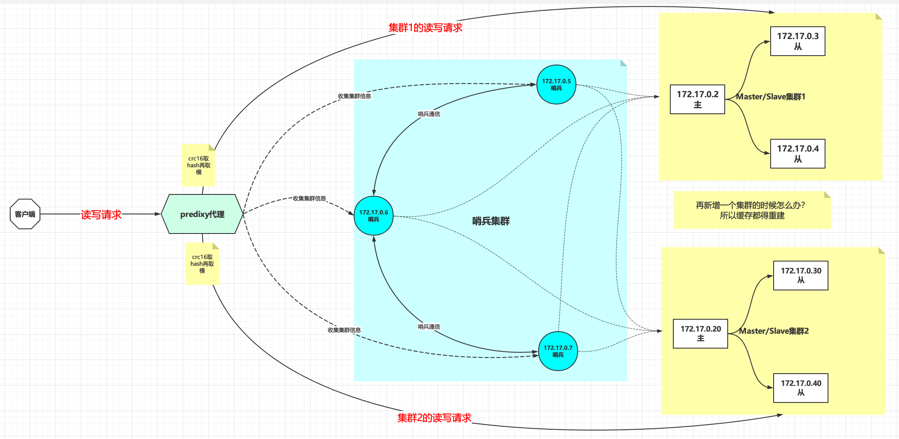
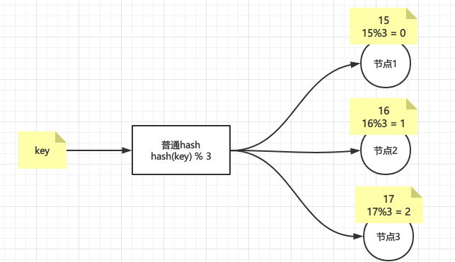

# Redis Cluster集群原理+实战

# 背景

之前我们介绍过Redis主从集群+哨兵的搭建，架构如下图所示



这种集群模式下水平扩容和垂直扩容都可以实现，并且可以实现高可用性和易用性

- 水平扩容：比如增加一套主从集群，在predixy代理处配置hash寻址，让部分数据可以被新加入的主从集群存储，水平扩容的实现强烈**依赖于predixy代理**。
- 垂直扩容：比如增加某个集群的内存，提升单机/单集群的处理能力
- 高可用性：一套哨兵集群监控多套redis主从集群，高可用的实现依赖于哨兵
- 易用性：指的是客户端的易用性，也是依赖于predixy代理来实现

但是此架构下还是有缺陷的：

- 水平扩容问题：水平扩容依赖于predixy实现既是优点也是缺点，因为predixy的实现是根据`crc16`计算key的哈希值，然后通过modula也就是求模的办法将key分布到不同的集群中去，所以说当水平扩容的时候会涉及到大量缓存重建
- 可用性问题：集群的高可用性是建立在哨兵集群之上的，假设哨兵集群全部宕机，那么整个集群的故障转移功能将会丧失，也不能动态发现新加入的集群，最终导致集群的可用性受到影响。

那么redis cluster又是怎么解决上面两个问题的呢？

- 针对水平扩容问题：redis使用hash槽算法，默认分配16384个hash槽位，然后将槽位均匀分配到不同的redis实例中去，找数据的时候通过`crc16(key) % 16384`找到对应的槽位，再看槽位在哪台实例上，最后去实例上取数据，使用槽位将具体的数据与redis实例解耦，当新增或者减少redis实例的时候自动将槽位均匀迁移到其他可用的redis实例上去。
- 针对可用性问题：redis使用流行病协议，即`Gossip/ˈɡɒsɪp/ Protocol` ，每台redis主机即使客户端也是服务端，随时都在向整个集群扩散自己的可用性状态，实际上就是基于`P2P`的 **去中心化网络拓扑架构**，没有中心节点，所有节点通过`Gossip`协议通信，所有节点既是数据存储节点，也是控制节点。

下面就针对水平扩容问题的hash寻址算法和针对可用性问题的流行病协议详细讨论

# hash寻址算法

## 普通hash

普通hash也就是最简单的hash算法，即

```java
index = hash(key) % N
```

`index`表示机器的索引，`N`表示机器的数量，假设有三台机器，即N=3，那么普通hash结果如下图，很简单是吧



那如果现在增加了一台机器呢？


情况似乎变得复杂起来，因为新增加了一个节点4，即N=4，那么所有key取模的结果都变了，导致所有的数据都要重新迁移一遍，如果节点4下线了呢？那么毫无疑问所有数据都要还原回去，就redis而言，这就叫大量缓存的重建，那么有没有新增/删除节点影响不那么大的hash算法呢？答案肯定是有，下面轮到一致性hash出场。

## 一致性hash

> 一致哈希由MIT的[Karger](https://zh.wikipedia.org/w/index.php?title=David_Karger&action=edit&redlink=1)及其合作者提出，现在这一思想已经扩展到其它领域。在这篇1997年发表的学术论文中介绍了“一致哈希”如何应用于用户易变的分布式Web服务中。哈希表中的每一个代表分布式系统中一个节点，在系统添加或删除节点只需要移动`K/n` （方法K是总key的个数，n是节点个数）

一致性hash的特性

- **平衡性**：尽可能让数据尽可能分散到所有节点上，避免造成极其不均匀
- **单调性**：要求在新增或者减少节点的时候，原有的结果绝大部分不受影响，而新增的数据尽可能分配到新加的节点
- **分散性**：好的算法在不同终端，针对相同的数据的计算，得到的结果应该是一样的，一致性要很强
- **负载**：针对相同的节点，避免被不同终端映射不同的内容
- **平滑性**：对于增加节点或者减少节点，应该能够平滑过渡


### hash环

普通hash算法导致大量数据迁移的根本原因是N的不确定性，有没有在N变化的时候影响范围更小的算法呢？有人提出了**环**的概念

> 一致性哈希算法在1997年由麻省理工学院的Karger等人在解决分布式Cache中提出的，设计目标是为了解决因特网中的热点(Hot spot)问题，初衷和CARP十分类似。一致性哈希修正了CARP使用的简单哈希算法带来的问题，使得DHT可以在P2P环境中真正得到应用

hash环通过构建环状的hash空间代替线性hash空间的方法解决了上面的问题，假设将`0~2^32-1`的hash空间分布到一个环上

- 节点加入环：将节点通过`hash(节点的信息如ip端口等) % 2^32-1`取节点在环上位置
- 数据读写：读写数据时同样取key的hash，即`hash(key) % 2^32-1`落到环上的某一位置，再**顺时针**找到离环最近的那个节点进行读写

整个过程如下图


假设现在新增一个节点4，只会影响到节点2到节点4之间的数据，其他的数据不会被影响到，这也是**一致性**的体现


删除一个节点也是同样的道理，假设删除节点4，也只是会影响到节点2到原节点4之间的数据，总之不管新增还是删除线路都只会影响到变动节点到变动节点逆时针找到的最近一个节点的数据。

当然hash环也不是没有问题的，假设节点分布不均匀（hash算法并不能保证绝对的平衡性），那么大部分数据都会落在一个节点上，导致请求和数据倾斜，这样就不能很好的保证负载均衡。


那么解决办法就是增加虚拟节点（注意，此时环上**全部都是虚拟节点**），对每一个节点计算多个hash，尽量保证环上的节点是均匀的，如下图


### hash槽

hash槽（hash slot）是redis中一致性hash的实现，很多文章将一致性hash环和hash槽分开来讲，其实hash槽也是一致性hash的一种实现。

redis默认分配16384个hash槽位，然后将槽位均匀分配到不同的redis实例中去，找数据的时候通过`CRC16`算法计算后再取模找到对应的槽位（`CRC16`我们应该不陌生，这个winrar里面使用的`CRC32`是一样的，只是校验长度不一样而已），算法如下

```
CRC16(key) % 16384
```

再看槽位在哪台实例上，最后去实例上取数据，如下图所示


如果该槽位不在请求的实例上呢？此时该实例会返回重定向指令：`MOVED 槽位 目标实例`，能这么做的基础是每一台redis实例上都有全量的hash槽的映射表，如下图所示为重定向的例子


使用槽位将具体的数据与redis实例解耦，当新增或者减少redis实例的时候用redis cluster总线通过Ping/Pong报文进行广播，告知整个redis集群新节点上线/下线，并迁移槽位和更新集群中的槽位映射表，整个过程尽量保证hash槽的平均分布，下面借用一张动图展示这个过程，原链接：https://xie.infoq.cn/article/794a8167dbd4293e7070b64ea


- 那么是基于什么样的考虑，redis的作者没有用hash环呢？

redis的作者认为他的`CRC16(key) mod 16384`的效果已经不错了，虽然没有一致性hash灵活，但实现很简单，节点增删时处理起来也很方便

当然还有个原因是hash槽的分布更加均匀，如果有N个节点，那么每个节点都负载`1/N`，此处引用一句话总结

>无论是hash槽还是一致性hash，本质上都是通过增加一层来解决依赖性问题。未使用时，key的分配依赖于节点个数，当节点个数变化时，key映射的节点也就改变了。增加了一个稳定层（hash槽），hash槽的个数是固定的，这样key分配到的hash槽也就是固定的。从而实现key与节点个数的解耦。hash槽与节点映射，当增加一个节点时，我们可以自己控制迁移哪些槽到新节点。

- 那为什么hash槽是16384个呢？

实际上是因为`CRC16`会输出16bit的结果，可以看作是一个分布在`0~2^16-1`之间的数，redis的作者测试发现这个数对`2^14`求模的会将key在`0-2^14-1`之间分布得很均匀，`2^14`即16384

还有个说法是为了节省存储空间，每个节点用一个Bitmap来存放其对应的槽，`2k = 2*1024*8 = 16384`，也就是说，每个节点用2k的内存空间，总共16384个比特位，就可以存储该结点对应了哪些槽。然后这2k的信息，通过Gossip协议，在节点之间传递

# Gossip协议(流行病协议)

所谓流行病协议，其实就是**Gossip/ˈɡɒsɪp/协议**

> Gossip协议又被称为流行病协议（Epidemic Protocol），也有人叫它反熵（Anti-Entropy）。Gossip协议于1987年在ACM上发表的论文 《Epidemic Algorithms for Replicated Database Maintenance》中被提出，主要用在分布式数据库系统中各个副本节点间的数据同步，这种场景的一个最大特点就是组成网络的节点都是对等的（**去中心化P2P**），网络中即使有的节点因宕机而重启，或有新节点加入，但经过一段时间后，这些节点的状态也会与其他节点达成一致，也就是说，Gossip天然具有分布式容错的优点（**容错性**）。
>
> （**一致性收敛**）这个主要从信息同步的速度来讲的。假设网络中有N个节点，那信息同步到全网络的速度理论上仅需为`O(log(N))`次（具体每个节点一次同步的节点数由fanout参数决定）。还记得高数吗？这种对数函数的收敛速度是很快的。
>
> 它是一个带冗余的容错算法，是一个最终一致性算法。虽然无法保证在某个时刻所有节点状态一致，但可以保证在”最终“所有节点一致，”最终“是一个现实中存在，但理论上无法证明的时间点。
>
>  大名鼎鼎的 Bitcoin 则是使用了 Gossip 协议来传播交易和区块信息，实际上Gossip可以用于众多能接受“最终一致性”的领域：失败检测、路由同步、Pub/Sub、动态负载均衡。 
>
> 但Gossip的缺点也很明显，冗余通信会对网路带宽、CPU资源造成很大的负载，而这些负载又受限于通信频率，该频率又影响着算法收敛的速度，因此，针对不同的应用场景，也有很多的优化方法。

Gossip协议具有天然的容错性、一致性收敛、去中心化等特征，它主要用途就是**信息传播和扩散**：即把一些发生的事件传播到全世界。它们也被用于数据库复制，信息扩散，集群成员身份确认，故障探测等。

既然是流行病协议，那么以新冠为例，假设现在有一个人感染了新冠，一个人会感染给两个人，一共有40个人，那么理论上最多经过5.32轮传播所有人都会被感染，实际上会大于理论数的，因为被感染的人也有可能已经感染过了，如下动图演示，最顶端红色的表示第一个被感染的人，感兴趣的同学可以参考Gossip模拟器：https://flopezluis.github.io/gossip-simulator/


基于Gossip协议的一些有名的系统：Apache Cassandra，Redis（Cluster模式），Consul等。

redis cluster正是通过Gossip协议在节点之间同步数据的，所有节点都是对等的，既是数据存储节点，也是控制节点。redis cluster启动的时候会开两个端口，一个是常规的6379端口，另外一个端口一般是（6379+ **10000**），这个就是所谓的Cluster总线，这个端口的作用就是就是利用Gossip协议进行节点之间的通信。


这里顺便提一下**反熵**（Anti-Entropy），熵描述的是一个系统的混乱程度，大名鼎鼎的**熵增定律**指的是一个有序系统在无外力的作用下，会慢慢转化到无序的状态，所谓反熵就是需要借助外力来减少系统的混乱程度，redis通过Gossip协议传播节点之间的可用信息，使得整个系统有序可用，是反熵行为，假设redis集群奉行无为而治，那么整个集群会随着各种不确定性（比如内存满了、网络抖动等）变得越来越无序，可用性降低，符合熵增定律。

# 实战

终于来到了实战环节，依然是用docker创建CentOS容器

```bash
# 主从1
docker run -dit  --name r2 --privileged centos /usr/sbin/init
docker run -dit  --name s1 --privileged centos /usr/sbin/init

# 主从2
docker run -dit  --name r3 --privileged centos /usr/sbin/init
docker run -dit  --name s2 --privileged centos /usr/sbin/init

# 主从3
docker run -dit  --name r4 --privileged centos /usr/sbin/init
docker run -dit  --name s3 --privileged centos /usr/sbin/init

# predixy代理
docker run -dit  --name p1 --privileged centos /usr/sbin/init
```

ip以及主从规划如下，我们以为经典的三主三从为例

```properties
# 主从1
r2 172.17.0.2
s1 172.17.0.5

# 主从2
r3 172.17.0.3
s2 172.17.0.6

# 主从3
r4 172.17.0.4
s3 172.17.0.7

# predixy代理
p1 172.17.0.8

```

## 安装redis

进入容器命令`docker exec -it r2 bash`

每台分别安装Redis，采用源码编译安装的方式，安装版本为5.0.5，可自定义

```bash
REDIS_VERSION=5.0.5
# 编译环境安装和一些常用工具
yum install -y wget gcc make telnet
# 创建文件夹
cd ~ && mkdir soft && cd soft
# 下载软件
wget http://download.redis.io/releases/redis-$REDIS_VERSION.tar.gz
# 解压
tar xf redis-$REDIS_VERSION.tar.gz && cd redis-$REDIS_VERSION
# 看README.md 执行出错看缺什么就先装什么，装完之后clean一下(make distclean)再次make 
# 生产环境做好执行一下测试 make test
# 可以查看一下生成的可执行程序xxx.o ls -lh src 
make
# 安装
make install PREFIX=/opt/redis$REDIS_VERSION
# 添加环境变量
cat >> /etc/profile <<EOF
export REDIS_HOME=/opt/redis$REDIS_VERSION
export PATH=$PATH:\$REDIS_HOME/bin
EOF
echo  'source /etc/profile' >> ~/.bashrc && source ~/.bashrc
cd utils
# 可以执行—次或多次，需要手动确定参数
# a)一个物理机中可以有多个redis实例(进程)，通过port区分
# b)可执行程序就一份在目录，但是内存中未来的多个实例需要各自的配置文件，持久化目录等资源
# c) service redis_6379 start/stop/stauts>linux /etc/init.d/****
# d)脚本还会帮你启动!
./install_server.sh
ps -fe | grep redis
```

- 更改配置文件中的ip

```bash
sed -i 's/bind 127.0.0.1/bind 0.0.0.0/g'  /etc/redis/6379.conf
```

配置文件位置在`/etc/redis/6379.conf`，如果要在内网访问，需要修改配置文件的`bind 127.0.0.1`中的ip为`0.0.0.0`，意为允许任何连接，否则在局域网中是连不上的，这也是用docker进行网络隔离的好处，可以更贴合生产环境，发现更多问题。

- 设置非守护进程，让redis在前台阻塞运行，测试时方便观察输出，当然生产环境中不建议关闭

```bash
# 关闭守护进程
sed -i 's/daemonize yes/daemonize no/g'  /etc/redis/6379.conf

# 关掉日志
# logfile /var/log/redis_6379.log
sed -i 's|logfile /var/log/redis_6379.log|#logfile /var/log/redis_6379.log|g'  /etc/redis/6379.conf

```

- 启动集群配置

```bash
# 启动cluster，重要！！！
sed -i 's|# cluster-enabled yes|cluster-enabled yes|g'  /etc/redis/6379.conf

# 启用集群配置文件
sed -i 's|# cluster-config-file nodes-6379.conf|cluster-config-file nodes-6379.conf|g'  /etc/redis/6379.conf

# 集群不需要所有槽都被映射也能提供服务
sed -i 's|# cluster-require-full-coverage yes|cluster-require-full-coverage no|g'  /etc/redis/6379.conf
```

如果不启用cluster的话即（`cluster-enabled yes`）会报错

```properties
[ERR] Node 172.17.0.2:6379 is not configured as a cluster node.
```

重点解释一下参数`cluster-require-full-coverage yes`：这个参数的意思是如果此时某集群master-slave都宕机了，slot将不能完全的被映射，此时是否要提供服务？yes是需要完整的slot映射，集群不会提供服务，会报错

```properties
(error) CLUSTERDOWN The cluster is down
```

如果是no，表明集群在slot映射不完整的情况下也能提供服务，根据实际情况调整这个值，**默认是yes**

- 重启下redis

```bash
# -15优雅的杀掉
kill -15 `ps aux | grep -v grep | grep redis | awk '{ print $2 }'`
sleep 1
# 重启
redis-server /etc/redis/6379.conf
```

- 客户端连接，新开shell窗口连接一下看看是否能连接成功

```bash
# 查看帮助
redis-cli -h
# 指定主机端口连接
redis-cli -h 127.0.0.1 -p 6379
```

- 测试，分别试一下每台redis是否能正常连接

如果各个节点有数据，最好先清除（`flushdb`）一下，否则会报错：

```properties
[ERR] Node 172.17.0.2:6379 is not empty. Either the node already knows other nodes (check with CLUSTER NODES) or contains some key in database 0.
```

```properties
# 主从1
redis-cli -h 172.17.0.2 -p 6379
redis-cli -h 172.17.0.5 -p 6379

# 主从2
redis-cli -h 172.17.0.3 -p 6379
redis-cli -h 172.17.0.6 -p 6379

# 主从3
redis-cli -h 172.17.0.4 -p 6379
redis-cli -h 172.17.0.7 -p 6379
```

### 重置配置

如果需要恢复redis到初始状态，执行下面命令

```bash
# 删除持久化文件
rm -rf /var/lib/redis/6379/dump.rdb

# 清除配置
rm -rf /etc/redis/*
rm -rf /var/lib/redis/6379/nodes-6379.conf

# 重新生成
~/soft/redis-5.0.5/utils/install_server.sh

##################上面和下面的分开执行##################

# 手动配置
sed -i 's/bind 127.0.0.1/bind 0.0.0.0/g'  /etc/redis/6379.conf
sed -i 's/daemonize yes/daemonize no/g'  /etc/redis/6379.conf
sed -i 's|logfile /var/log/redis_6379.log|#logfile /var/log/redis_6379.log|g'  /etc/redis/6379.conf
sed -i 's|# cluster-config-file nodes-6379.conf|cluster-config-file nodes-6379.conf|g'  /etc/redis/6379.conf
sed -i 's|# cluster-enabled yes|cluster-enabled yes|g'  /etc/redis/6379.conf
sed -i 's|# cluster-require-full-coverage yes|cluster-require-full-coverage no|g'  /etc/redis/6379.conf


# -15优雅的杀掉
kill -15 `ps aux | grep -v grep | grep redis | awk '{ print $2 }'`
sleep 0.5
# 重启
redis-server /etc/redis/6379.conf


```


## 创建cluster

### 自动指定

一条命令即可搞定，redis会自动分配N主N从以及一致性hash的slot分布，直接输入yes即可

```bash
redis-cli --cluster create 172.17.0.2:6379 172.17.0.3:6379 172.17.0.4:6379 172.17.0.5:6379 172.17.0.6:6379 172.17.0.7:6379 --cluster-replicas 1
```

执行过程

```properties
[root@192 ~]# redis-cli --cluster create 172.17.0.2:6379 172.17.0.3:6379 172.17.0.4:6379 172.17.0.5:6379 172.17.0.6:6379 172.17.0.7:6379 --cluster-replicas 1
>>> Performing hash slots allocation on 6 nodes...
Master[0] -> Slots 0 - 5460
Master[1] -> Slots 5461 - 10922
Master[2] -> Slots 10923 - 16383
Adding replica 172.17.0.6:6379 to 172.17.0.2:6379
Adding replica 172.17.0.7:6379 to 172.17.0.3:6379
Adding replica 172.17.0.5:6379 to 172.17.0.4:6379
M: 593eb613862dc6130635fd489b542a632e5c70b3 172.17.0.2:6379
   slots:[0-5460] (5461 slots) master
M: 0e575f3751e5f580af057531d71e792fc5cb7013 172.17.0.3:6379
   slots:[5461-10922] (5462 slots) master
M: fae59a110c4267f5d2cd0198ae86c0c74b37b585 172.17.0.4:6379
   slots:[10923-16383] (5461 slots) master
S: 142c7cc4450a82d3b95751a99bcaf5fe06f7707b 172.17.0.5:6379
   replicates fae59a110c4267f5d2cd0198ae86c0c74b37b585
S: 4c5c5d1064c3f32bfc0d2864f1571e6ebe160290 172.17.0.6:6379
   replicates 593eb613862dc6130635fd489b542a632e5c70b3
S: 59eb7b3fe33afd2338eefdc43ac8e28d1ea333d1 172.17.0.7:6379
   replicates 0e575f3751e5f580af057531d71e792fc5cb7013
Can I set the above configuration? (type 'yes' to accept): yes # 此处输入yes
>>> Nodes configuration updated
>>> Assign a different config epoch to each node
>>> Sending CLUSTER MEET messages to join the cluster
Waiting for the cluster to join
....
>>> Performing Cluster Check (using node 172.17.0.2:6379)
M: 593eb613862dc6130635fd489b542a632e5c70b3 172.17.0.2:6379
   slots:[0-5460] (5461 slots) master
   1 additional replica(s)
S: 59eb7b3fe33afd2338eefdc43ac8e28d1ea333d1 172.17.0.7:6379
   slots: (0 slots) slave
   replicates 0e575f3751e5f580af057531d71e792fc5cb7013
S: 4c5c5d1064c3f32bfc0d2864f1571e6ebe160290 172.17.0.6:6379
   slots: (0 slots) slave
   replicates 593eb613862dc6130635fd489b542a632e5c70b3
S: 142c7cc4450a82d3b95751a99bcaf5fe06f7707b 172.17.0.5:6379
   slots: (0 slots) slave
   replicates fae59a110c4267f5d2cd0198ae86c0c74b37b585
M: fae59a110c4267f5d2cd0198ae86c0c74b37b585 172.17.0.4:6379
   slots:[10923-16383] (5461 slots) master
   1 additional replica(s)
M: 0e575f3751e5f580af057531d71e792fc5cb7013 172.17.0.3:6379
   slots:[5461-10922] (5462 slots) master
   1 additional replica(s)
[OK] All nodes agree about slots configuration.
>>> Check for open slots...
>>> Check slots coverage...
[OK] All 16384 slots covered.

```

可以看到我们的集群创建成功了，可以发现集群主从和hash槽(slot)都给我们分配好了，但是仔细查看日志会发现 `172.17.0.7`成了`172.17.0.3`的slave了，这和我们预期的不一样，所以我们可以手动指定slave

### 手动指定

首先创建主，注意参数`--cluster-replicas 0`

```bash
redis-cli --cluster create 172.17.0.2:6379 172.17.0.3:6379 172.17.0.4:6379 --cluster-replicas 0
```

执行过程

```properties
[root@192 ~]# redis-cli --cluster create 172.17.0.2:6379 172.17.0.3:6379 172.17.0.4:6379 --cluster-replicas 0
>>> Performing hash slots allocation on 3 nodes...
Master[0] -> Slots 0 - 5460
Master[1] -> Slots 5461 - 10922
Master[2] -> Slots 10923 - 16383
M: 14d129294d95867777a91d29b708413baa8a276c 172.17.0.2:6379
   slots:[0-5460] (5461 slots) master
M: 8a7b1a4cf2980c031c0e5e912cf366981588e3c9 172.17.0.3:6379
   slots:[5461-10922] (5462 slots) master
M: 46623a0b2ec8abb8a0688769337e91268df3c73f 172.17.0.4:6379
   slots:[10923-16383] (5461 slots) master
Can I set the above configuration? (type 'yes' to accept): yes
>>> Nodes configuration updated
>>> Assign a different config epoch to each node
>>> Sending CLUSTER MEET messages to join the cluster
Waiting for the cluster to join
.
>>> Performing Cluster Check (using node 172.17.0.2:6379)
M: 14d129294d95867777a91d29b708413baa8a276c 172.17.0.2:6379
   slots:[0-5460] (5461 slots) master
M: 8a7b1a4cf2980c031c0e5e912cf366981588e3c9 172.17.0.3:6379
   slots:[5461-10922] (5462 slots) master
M: 46623a0b2ec8abb8a0688769337e91268df3c73f 172.17.0.4:6379
   slots:[10923-16383] (5461 slots) master
[OK] All nodes agree about slots configuration.
>>> Check for open slots...
>>> Check slots coverage...
[OK] All 16384 slots covered.
```

可以看到三台master已经创建完毕，接下来我们手动指定slave，输入如下命令，第一个ip是将要指定的slave，第二个ip指定master

```properties
redis-cli --cluster add-node --slave 172.17.0.5:6379 172.17.0.2:6379 --cluster-slave
redis-cli --cluster add-node --slave 172.17.0.6:6379 172.17.0.3:6379 --cluster-slave
redis-cli --cluster add-node --slave 172.17.0.7:6379 172.17.0.4:6379 --cluster-slave
```

执行过程如下，可以看到slave添加成功，如果炮制，其他两台节点也这么操作

```properties
[root@192 ~]# redis-cli --cluster add-node --slave 172.17.0.5:6379 172.17.0.2:6379 --cluster-slave
>>> Adding node 172.17.0.5:6379 to cluster 172.17.0.2:6379
>>> Performing Cluster Check (using node 172.17.0.2:6379)
M: 14d129294d95867777a91d29b708413baa8a276c 172.17.0.2:6379
   slots:[0-5460] (5461 slots) master
M: 8a7b1a4cf2980c031c0e5e912cf366981588e3c9 172.17.0.3:6379
   slots:[5461-10922] (5462 slots) master
M: 46623a0b2ec8abb8a0688769337e91268df3c73f 172.17.0.4:6379
   slots:[10923-16383] (5461 slots) master
[OK] All nodes agree about slots configuration.
>>> Check for open slots...
>>> Check slots coverage...
[OK] All 16384 slots covered.
Automatically selected master 172.17.0.2:6379
>>> Send CLUSTER MEET to node 172.17.0.5:6379 to make it join the cluster.
Waiting for the cluster to join

>>> Configure node as replica of 172.17.0.2:6379.
[OK] New node added correctly.

```

### 查看集群信息

登录集群中的任意一台节点，输入`cluster info`查看集群信息

```properties
[root@192 ~]# redis-cli -c -h 172.17.0.2 -p 6379 
172.17.0.2:6379> cluster info
cluster_state:ok
cluster_slots_assigned:16384
cluster_slots_ok:16384
cluster_slots_pfail:0
cluster_slots_fail:0
cluster_known_nodes:6
cluster_size:3
cluster_current_epoch:3
cluster_my_epoch:1
cluster_stats_messages_ping_sent:49
cluster_stats_messages_pong_sent:51
cluster_stats_messages_sent:100
cluster_stats_messages_ping_received:46
cluster_stats_messages_pong_received:49
cluster_stats_messages_meet_received:5
cluster_stats_messages_received:100


```

### 查看集群节点

登录集群中的任意一台节点，输入`cluster nodes`查看集群节点信息

```properties
f9e78f563314a1d88796ec0ca2b13e4ac3cae75f 172.17.0.7:6379@16379 slave 46623a0b2ec8abb8a0688769337e91268df3c73f 0 1617453836000 3 connected
e4b010d6b895e3955375b2e71e0701bdd6539ab7 172.17.0.6:6379@16379 slave 8a7b1a4cf2980c031c0e5e912cf366981588e3c9 0 1617453835000 2 connected
14d129294d95867777a91d29b708413baa8a276c 172.17.0.2:6379@16379 myself,master - 0 1617453834000 1 connected 0-5460
46623a0b2ec8abb8a0688769337e91268df3c73f 172.17.0.4:6379@16379 master - 0 1617453837840 3 connected 10923-16383
8a7b1a4cf2980c031c0e5e912cf366981588e3c9 172.17.0.3:6379@16379 master - 0 1617453836836 2 connected 5461-10922
b65a4798e2de04f5804074eb2614d487a0a7f2b3 172.17.0.5:6379@16379 slave 14d129294d95867777a91d29b708413baa8a276c 0 1617453836000 1 connected

```

仔细查看可以看到结果和预期一致

### 删除节点

如果有slave，先删除slave或者将slave转移到其他master下

#### 删除slave

```bash
redis-cli --cluster del-node 172.17.0.7:6379 'f9e78f563314a1d88796ec0ca2b13e4ac3cae75f'

>>> Removing node f9e78f563314a1d88796ec0ca2b13e4ac3cae75f from cluster 172.17.0.7:6379
>>> Sending CLUSTER FORGET messages to the cluster...
>>> SHUTDOWN the node.

```

#### 转移slot

因为master上面有slot，所以首先reshard转移slot，假设将`172.17.0.4`上面的slot转移到`172.17.0.2`和`172.17.0.3`上

```bash
redis-cli --cluster reshard  172.17.0.4:6379
```

执行完毕后会让输入slot的来源节点id和目标节点id，看下面注释

```properties
[root@192 ~]# redis-cli --cluster reshard  172.17.0.4:6379
>>> Performing Cluster Check (using node 172.17.0.4:6379)
M: 46623a0b2ec8abb8a0688769337e91268df3c73f 172.17.0.4:6379
   slots:[10923-16383] (5462 slots) master
S: e4b010d6b895e3955375b2e71e0701bdd6539ab7 172.17.0.6:6379
   slots: (0 slots) slave
   replicates 8a7b1a4cf2980c031c0e5e912cf366981588e3c9
S: b65a4798e2de04f5804074eb2614d487a0a7f2b3 172.17.0.5:6379
   slots: (0 slots) slave
   replicates 14d129294d95867777a91d29b708413baa8a276c
M: 14d129294d95867777a91d29b708413baa8a276c 172.17.0.2:6379
   slots:[0-5460] (5462 slots) master
   1 additional replica(s)
M: 8a7b1a4cf2980c031c0e5e912cf366981588e3c9 172.17.0.3:6379
   slots:[5461-10922] (5462 slots) master
   1 additional replica(s)
[OK] All nodes agree about slots configuration.
>>> Check for open slots...
>>> Check slots coverage...
[OK] All 16384 slots covered.
How many slots do you want to move (from 1 to 16384)? 2500
# 这里是让填写接收slot的节点，此处填写172.17.0.2所在的id
What is the receiving node ID? 14d129294d95867777a91d29b708413baa8a276c
Please enter all the source node IDs.
  Type 'all' to use all the nodes as source nodes for the hash slots.
  Type 'done' once you entered all the source nodes IDs.
  # 这里填写slot的来源节点，这里填写172.17.0.4所在的id
Source node #1: 46623a0b2ec8abb8a0688769337e91268df3c73f
# 填写完毕后输入done，回车后就是slot转移操作
Source node #2: done

```

当然，上面的交互式操作可以用一条命令表达

```bash
 redis-cli --cluster reshard 172.17.0.4:6379 --cluster-from '46623a0b2ec8abb8a0688769337e91268df3c73f' --cluster-to '14d129294d95867777a91d29b708413baa8a276c' --cluster-slots 2500 --cluster-yes
 
 
 redis-cli --cluster reshard host:port --cluster-from <arg> --cluster-to <arg> --cluster-slots <arg> --cluster-yes --cluster-timeout <arg> --cluster-pipeline <arg>

# 参数说明：
# host：port：必传参数，集群内任意节点地址，用来获取整个集群信息。
# --cluster-from：制定源节点的id，如果有多个源节点，使用逗号分隔，如果是all源节点变为集群内所有主节点，在迁移过程中提示用户输入。
# --cluster-to：需要迁移的目标节点的id，目标节点只能填写一个，在迁移过程中提示用户输入。
# --cluster-slots：需要迁移槽的总数量，在迁移过程中提示用户输入。
# --cluster-yes：当打印出reshard执行计划时，是否需要用户输入yes确认后再执行reshard。
# --cluster-timeout：控制每次migrate操作的超时时间，默认为60000毫秒。
# --cluster-pipeline：控制每次批量迁移键的数量，默认为10。
```

然后将剩余的slot转移到`172.17.0.3`上，执行下面一条命令即可，还剩余2962个slot

```bash
 redis-cli --cluster reshard 172.17.0.4:6379 --cluster-from '46623a0b2ec8abb8a0688769337e91268df3c73f' --cluster-to '8a7b1a4cf2980c031c0e5e912cf366981588e3c9' --cluster-slots 2962 --cluster-yes
```

#### 删除master

待转移slot完毕后，开始删除节点

```bash
redis-cli --cluster del-node 172.17.0.4:6379 '46623a0b2ec8abb8a0688769337e91268df3c73f'
```


最后看一下cluster nodes

```properties
172.17.0.2:6379> cluster nodes
e4b010d6b895e3955375b2e71e0701bdd6539ab7 172.17.0.6:6379@16379 slave 8a7b1a4cf2980c031c0e5e912cf366981588e3c9 0 1617454851942 5 connected
14d129294d95867777a91d29b708413baa8a276c 172.17.0.2:6379@16379 myself,master - 0 1617454851000 4 connected 0-5460 10923-13422
8a7b1a4cf2980c031c0e5e912cf366981588e3c9 172.17.0.3:6379@16379 master - 0 1617454850935 5 connected 5461-10922 13423-16383
b65a4798e2de04f5804074eb2614d487a0a7f2b3 172.17.0.5:6379@16379 slave 14d129294d95867777a91d29b708413baa8a276c 0 1617454852950 4 connected

```

发现`172.17.0.4`和`172.17.0.7`都不见了并且slot也完整的转移到了其他master上

### 添加节点

下面我们把`172.17.0.4`和`172.17.0.7`添加回来，添加之前记得重置下配置，参考上文**重置配置**章节，因为上面还有旧的集群信息，直接强制添加添加不了的，必须是干净的节点

#### 添加master

```bash
redis-cli --cluster add-node 172.17.0.4:6379 172.17.0.2:6379
# 172.17.0.4:6379 是新增的节点
# 172.17.0.2:6379 集群任一个节点用于发现集群信息
```

回显如下表明添加成功

```properties
[root@192 ~]# redis-cli --cluster add-node 172.17.0.4:6379 172.17.0.2:6379
>>> Adding node 172.17.0.4:6379 to cluster 172.17.0.2:6379
>>> Performing Cluster Check (using node 172.17.0.2:6379)
M: 14d129294d95867777a91d29b708413baa8a276c 172.17.0.2:6379
   slots:[0-5460],[10923-13422] (7961 slots) master
   1 additional replica(s)
S: e4b010d6b895e3955375b2e71e0701bdd6539ab7 172.17.0.6:6379
   slots: (0 slots) slave
   replicates 8a7b1a4cf2980c031c0e5e912cf366981588e3c9
M: 8a7b1a4cf2980c031c0e5e912cf366981588e3c9 172.17.0.3:6379
   slots:[5461-10922],[13423-16383] (8423 slots) master
   1 additional replica(s)
S: b65a4798e2de04f5804074eb2614d487a0a7f2b3 172.17.0.5:6379
   slots: (0 slots) slave
   replicates 14d129294d95867777a91d29b708413baa8a276c
[OK] All nodes agree about slots configuration.
>>> Check for open slots...
>>> Check slots coverage...
[OK] All 16384 slots covered.
>>> Send CLUSTER MEET to node 172.17.0.4:6379 to make it join the cluster.
[OK] New node added correctly.

```

#### 添加slave

```bash
redis-cli --cluster add-node --slave 172.17.0.7:6379 172.17.0.4:6379 --cluster-slave
```

此时查看cluster nodes信息

```properties
e4b010d6b895e3955375b2e71e0701bdd6539ab7 172.17.0.6:6379@16379 slave 8a7b1a4cf2980c031c0e5e912cf366981588e3c9 0 1617455162837 5 connected
14d129294d95867777a91d29b708413baa8a276c 172.17.0.2:6379@16379 myself,master - 0 1617455162000 4 connected 0-5460 10923-13422
34639cdddc716119137ee46ca39e9554b26dd046 172.17.0.4:6379@16379 master - 0 1617455163844 0 connected
8a7b1a4cf2980c031c0e5e912cf366981588e3c9 172.17.0.3:6379@16379 master - 0 1617455162000 5 connected 5461-10922 13423-16383
606b2427bff12d162e63ba30f4d128b7095b317c 172.17.0.7:6379@16379 slave 34639cdddc716119137ee46ca39e9554b26dd046 0 1617455163000 0 connected
b65a4798e2de04f5804074eb2614d487a0a7f2b3 172.17.0.5:6379@16379 slave 14d129294d95867777a91d29b708413baa8a276c 0 1617455161000 4 connected
```

发现已经添加上去了

#### 分配slot

虽然节点已经添加，但是上面还没有slot，需要分配slot，参考上面的**转移slot**章节

```bash

# 将172.17.0.2上的slot转移2500个到172.17.0.4
redis-cli --cluster reshard 172.17.0.4:6379 --cluster-from '14d129294d95867777a91d29b708413baa8a276c' --cluster-to '34639cdddc716119137ee46ca39e9554b26dd046' --cluster-slots 2500 --cluster-yes

# 将172.17.0.3上的slot转移2962个到172.17.0.4
redis-cli --cluster reshard 172.17.0.4:6379 --cluster-from '8a7b1a4cf2980c031c0e5e912cf366981588e3c9' --cluster-to '34639cdddc716119137ee46ca39e9554b26dd046' --cluster-slots 2962 --cluster-yes
```

再看下cluster nodes，发现`172.17.0.4`上已经有分配的slot了，符合预期

```properties
e4b010d6b895e3955375b2e71e0701bdd6539ab7 172.17.0.6:6379@16379 slave 8a7b1a4cf2980c031c0e5e912cf366981588e3c9 0 1617455359000 5 connected
14d129294d95867777a91d29b708413baa8a276c 172.17.0.2:6379@16379 myself,master - 0 1617455358000 4 connected 2500-5460 10923-13422
34639cdddc716119137ee46ca39e9554b26dd046 172.17.0.4:6379@16379 master - 0 1617455360006 6 connected 0-2499 5461-8422
8a7b1a4cf2980c031c0e5e912cf366981588e3c9 172.17.0.3:6379@16379 master - 0 1617455360000 5 connected 8423-10922 13423-16383
606b2427bff12d162e63ba30f4d128b7095b317c 172.17.0.7:6379@16379 slave 34639cdddc716119137ee46ca39e9554b26dd046 0 1617455361011 6 connected
b65a4798e2de04f5804074eb2614d487a0a7f2b3 172.17.0.5:6379@16379 slave 14d129294d95867777a91d29b708413baa8a276c 0 1617455358000 4 connected

```

### 故障转移

上面的删除节点都是在已经情况下操作的，假设现在在未知情况下宕机了，那么会发生什么？

#### master宕机

假设master宕机，让`172.17.0.4`宕机，过了一会儿，看cluster nodes信息发现`172.17.0.4`有fail标志

```properties
# fail标志
.... 172.17.0.4:6379@16379 master,fail - 1617455560009 1617455558197 6 disconnected 0-2499 5461-8422
...  172.17.0.7:6379@16379 slave 34639cdddc716119137ee46ca39e9554b26dd046 0 1617455616000 6 connected
```

稍等片刻之后发现`172.17.0.7`变成了master

```properties
... 172.17.0.4:6379@16379 master,fail - 1617455560009 1617455558197 6 disconnected
# 172.17.0.7变成了master
... 172.17.0.7:6379@16379 master - 0 1617455678000 8 connected 0-2499 5461-8422
```

在看看`172.17.0.7`的日志输出有下面这句话

```properties
5890:S 03 Apr 2021 13:13:58.215 # Failover election won: I'm the new master.
```

也就是说当集群内的mater宕机后，slave被选举一个出来当做master，集群依然可用，假设原来的master恢复了，那么它将变成slave追随现在的master

#### master-slave宕机

假如master和slave双双宕机了呢？此时将都变成fail

```properties
... 172.17.0.4:6379@16379 master,fail - 1617455560009 1617455558197 6 disconnected
... 172.17.0.7:6379@16379 master,fail - 1617455896660 1617455894000 8 disconnected 0-2499 5461-8422
```

默认情况下此时集群将变得不可用，执行get指令时会报错

```properties
(error) CLUSTERDOWN The cluster is down
```

但是如果配置了`cluster-require-full-coverage`，那么集群依然**部分可用**，所谓部分可用即宕机的slot不可用，其他的slot还是可用的，参考：https://stackoverflow.com/questions/53594257/clusterdown-the-cluster-is-down-in-redis

```properties
cluster-require-full-coverage no
```

很多文章都说此时slot会自动转移，但是我测试时并不会自动转移，仔细想一想，master-slave双双都在不可抗力下宕机了，那么里面的数据肯定是拿不出来的，怎么转移slot呢？

## 代理

仍然采用predixy作为前置代理

### 编译安装

根据README进行编译安装，编译的过程如果报错就根据提示安装相应的编译环境，比如`make[1]: g++: Command not found`那就安装`c++`编译器 `gcc-c++`

注意`libstdc++-static` `yum`可能安装不上，如果是`CnetOS8`则可以用如下命令安装

```bash
# 参考https://centos.pkgs.org/8/centos-powertools-x86_64/libstdc++-static-8.3.1-5.1.el8.x86_64.rpm.html
dnf --enablerepo=PowerTools install libstdc++-static
```

编译安装脚本

```bash
# 安装编译环境，各种工具等，注意libstdc++-static可能安装不上
yum install -y git wget gcc gcc-c++ libstdc++-static make telnet
# 创建文件夹
cd ~ && mkdir soft && cd soft
# clone代码到本地
git clone https://github.com/joyieldInc/predixy.git
# 编译安装
cd predixy && make 
# 拷贝
mkdir -p /opt/predixy && cp src/predixy /opt/predixy
# 添加环境变量
cat >> /etc/profile <<EOF
export PATH=$PATH:/opt/predixy
EOF
echo  'source /etc/profile' >> ~/.bashrc && source ~/.bashrc
# 帮助命令
predixy -h
```

### 配置代理

具体配置可以参考官方文档：https://github.com/joyieldInc/predixy/blob/master/README_CN.md

开启日志、引入`cluster.conf`配置文件

```bash
#predixy 默认运行在7617端口
# 开启日志
sed -i 's|# Log ./predixy.log|Log ./predixy.log|g' /etc/predixy/conf/predixy.conf
# 引入cluster.conf
sed -i 's|# Include cluster.conf|Include cluster.conf|g' /etc/predixy/conf/predixy.conf
# 注释测试 try.conf
sed -i 's|Include try.conf|# Include try.conf|g' /etc/predixy/conf/predixy.conf
```

配置`cluster.conf`

```bash
# 备份一下
cp /etc/predixy/conf/cluster.conf /etc/predixy/conf/cluster.conf.bak
# 写入配置
cat > /etc/predixy/conf/cluster.conf <<EOF
ClusterServerPool {
    #这个是主节点访问权重，如果是只把备节点用作备份不去做读写分离，直接将这个配置成100只去读主节点就好了。
    MasterReadPriority 100
    # redis实例的访问密码
    # Password sjwkk123456
    # 读写分离功能，从静态redis slave节点执行读请求的优先级，所谓静态节点，是指在本配置文件中显示列出的redis节点，不指定的话为0
    StaticSlaveReadPriority 50 
    # 功能见上，所谓动态节点是指在本配置文件中没有列出，但是通过redis sentinel动态发现的节点，不指定的话为0
    DynamicSlaveReadPriority 50
    # predixy会周期性的请求redis sentinel以获取最新的集群信息，该参数以秒为单位指定刷新周期，不指定的话为1秒
    RefreshInterval 1
    # 请求在predixy中最长的处理/等待时间，如果超过该时间redis还没有响应的话，那么predixy会关闭同redis的连接，并给客户端一个错误响应，对于blpop这种阻塞式命令，该选项不起作用，为0则禁止此功能，即如果redis不返回就一直等待，不指定的话为0
    ServerTimeout 1
    # 一个redis实例出现多少次才错误以后将其标记为失效，不指定的话为10
    ServerFailureLimit 10
    # 一个redis实例失效后多久后去检查其是否恢复正常，不指定的话为1秒
    ServerRetryTimeout 1
    #predixy与redis的连接tcp keepalive时间，为0则禁止此功能，不指定的话为0
    KeepAlive 120
    Servers {
        # 配置所有节点地址
        + 172.17.0.2:6379
        + 172.17.0.5:6379
        + 172.17.0.3:6379
        + 172.17.0.6:6379
        + 172.17.0.4:6379
        + 172.17.0.7:6379
    }
}
EOF
```

### 启动并测试

启动代理

```bash
# 启动
predixy /etc/predixy/conf/predixy.conf &

# 查看日志
tail -f /etc/predixy/conf/predixy.log 
```

随便找一台有redis-cli的机器测试一下

```bash
# 连接代理
redis-cli -h 172.17.0.8 -p 7617

# 设置值
set k1 aaa

# 获取值
get k1
```

## 架构图

整体架构如下图所示


# 参考

- https://flopezluis.github.io/gossip-simulator/
- https://xie.infoq.cn/article/794a8167dbd4293e7070b64ea

