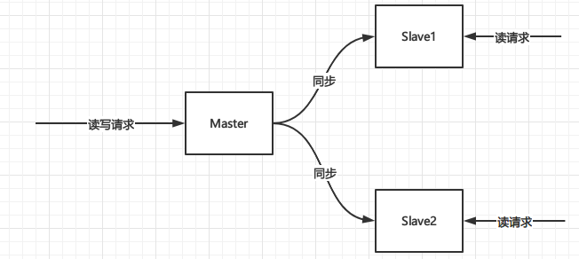
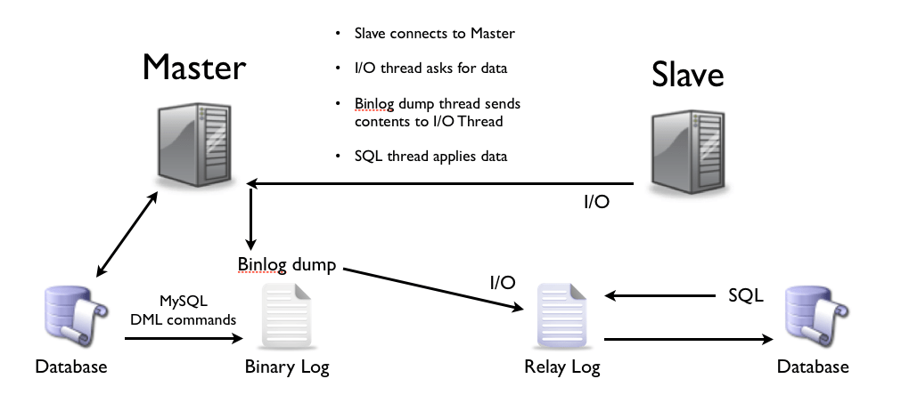
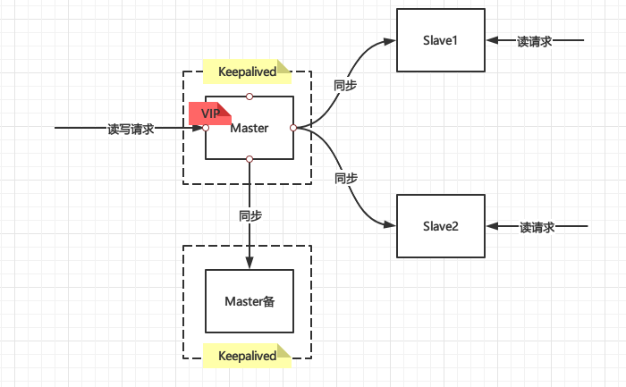
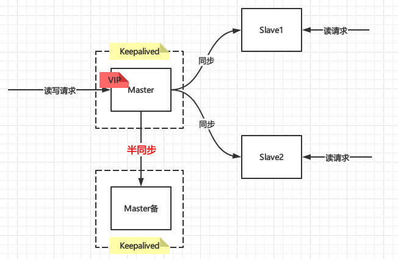
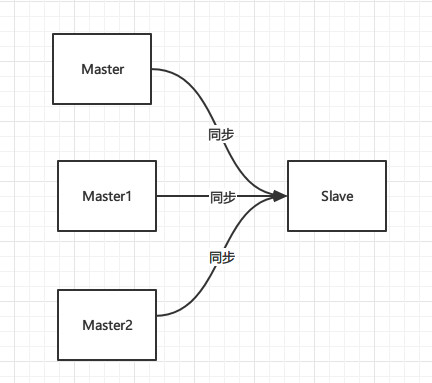
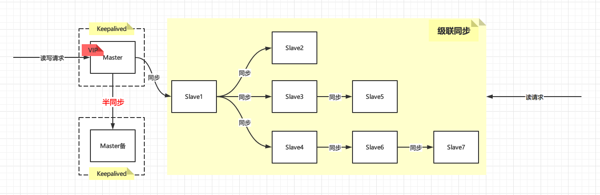
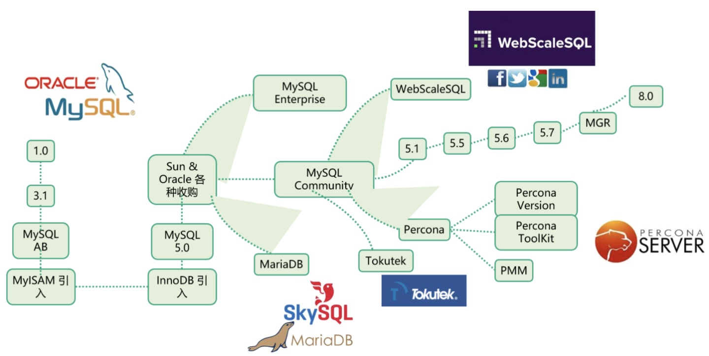
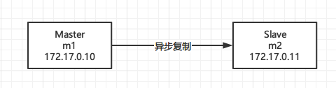
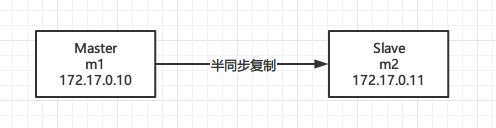
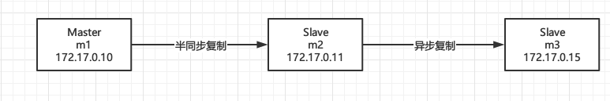

# MySQL主从集群原理+实战

# 背景

随着公司业务的发展，对数据库的要求越来越高，以前的单机MySQL肯定是玩不转了，亟需升级成MySQL集群，这是一个公司在业务发展时不得不面临的问题

> 就单机MySQL而言，自己玩玩可以，运用到实际项目中，那肯定要挨批的。一方面数据不安全，万一数据库的电脑磁盘坏了，就坑了。另一方面数据库的并发能力是有限的，一般并发数200～500就差不多了，当然你要继续往上增，也是可以的，那就影响整体Mysql的响应时间。

那么有哪些集群方案呢？
# 集群方案
在初期，由于MySQL官方提供的集群方案并不成熟，但由于业务的发展又需要集群技术，所以涌现了很多非官方的集群技术

## 主从复制

主从复制也叫**MySQL Replication**，是MySQL的原生功能，这也是最简单最有效的方式，既然单点MySQL扛不住，那多来几台不就完事了，主从复制说的就是这种方案，如下图，一主两从，主接收写请求后同步给从，这种方案天生就是读写分离的



那么同步的原理是什么呢？大致就是下面这个过程，Master在写数据时（DML命令）会产生一个bin log(Binary Log)，Slave开一个IO线程从指定偏移处去读取bin log，读回来后生成Relay Log，再开一个SQL线程"重放"数据来完成同步。



不难看出，这种方式天生就是**异步**的，Master只需要写入Binary Log就不管了，不用等待Slave的确认。

优点：

- 读写分离，增加整体性能
- 部署简单，维护方便，需要资源少，成本低，最少两台即可搞

缺点：

- 无故障转移，Master挂了整个集群只能读取不能写入，需要引入其他的高可用机制
- 数据存在一致性问题，因为异步，所以Slave的数据一定不是最新的，需要等待一个时间窗后才能读取
- Slave过多时Slave对Master的负载以及网络带宽都会成为一个严重的问题

## 主从复制+Keepalived

既然简单主从复制无故障转移，那么加个Keepalived作为备用Master可以不？答案当然是可以滴，如下：



这样就没问题了吗？如果各种不可抗力的网络原因导致Keepalived两台主机不能通信，互相抢主，争着做VIP，那么肯定有问题的嘛，这种现象我们称之为**脑裂**，这也是这种模式下最严重的问题，所谓网络原因，比如下面这些

> 1.高可用服务器对之间心跳线链路发生故障，导致无法正常通信。
> 2.因心跳线坏了（包括断了，老化）。
> 3.因网卡及相关驱动坏了，ip配置及冲突问题（网卡直连）。
> 4.因心跳线间连接的设备故障（网卡及交换机）。
> 5.因仲裁的机器出问题（采用仲裁的方案）。
> 6.高可用服务器上开启了 iptables防火墙阻挡了心跳消息传输。
> 7.高可用服务器上心跳网卡地址等信息配置不正确，导致发送心跳失败。
> 8.其他服务配置不当等原因，如心跳方式不同，心跳广插冲突、软件Bug等。
> 9.Keepalived配置里同一 VRRP实例如果`virtual_router_id`两端参数配置不一致也会导致裂脑问题发生。

优点：

- 可以进行故障转移，当Master挂掉以后备用Master自动顶上来，充当VIP

缺点：

- 闹裂问题
- 数据一致性问题，两台Master都是异步复制的，无法保证完全的一致
- 多出一台Master备机，增加成本，这是不可避免的

对于脑裂问题，可以进行人工干预， 思路很简单，正常情况下keepalived的VIP地址是在主节点上的，如果在从节点上发现了VIP，就通过各种方式（短信，邮件）告警相关人员，核实现在是否是Master挂了，样例脚本如下，在备用Master上执行

```bash
vim split-brainc_check.sh

#!/bin/bash
# 检查脑裂的脚本，在备节点上进行部署 
LB01_VIP=192.168.1.229
LB01_IP=192.168.1.129
LB02_IP=192.168.1.130
 
while true
do
  ping -c 2 -W 3 $LB01_VIP &>/dev/null
    if [ $? -eq 0 -a `ip add|grep "$LB01_VIP"|wc -l` -eq 1 ];then
        echo "ha is brain."
    else
        echo "ha is ok"
    fi
    sleep 5
done
```

那么数据一致性问题怎么保证呢？Slave上的数据一致性暂且不论，但是备用Master上的呢？如果Master突然宕机来不及写bin log或者备用Master来不及同步bin log那么备用Master上的数据依然不是一致的，针对这个问题，**半同步**登上舞台

## 主从复制(半同步)+Keepalived

所谓半同步，指的是

> 主库只需要等待至少一个从库节点收到并且Flush Binlog到Relay Log文件即可，主库不需要等待所有从库给主库反馈。同时，这里**只是一个收到的反馈**，而不是已经完全完成并且提交的反馈，如此，节省了很多时间。

半同步的本质上牺牲数据写数据的性能来换取数据的一致性，但不能完全确保数据一致性，因为它认为Slave将数据Flush到Relay Log就算同步成功，如果此时Slave挂了，那么数据依然不能保持同步，算是一种折中，兼顾了数据一致性和性能。

半同步也会超时，由`rpl_semi_sync_master_timeout`控制，默认是10s，也就是说10s后还收不到确认信息就退化成异步复制

所以只需要在Master与Master备机之间使用**半同步**，如下图



要想使用半同步复制，必须满足以下几个条件：

- MySQL 5.5及以上版本，从MySQL5.5开始，MySQL以插件的形式支持半同步复制
- 变量`have_dynamic_loading`为YES
- 异步复制已经存在

半同步总结

> - 在一主多从的架构中，如果要开启半同步复制，并不要求所有的从都是半同步复制。
> - MySQL 5.7极大的提升了半同步复制的性能。
> - 5.6版本的半同步复制，dump thread 承担了两份不同且又十分频繁的任务：传送bin log 给Slave ，还需要等待Slave反馈信息，而且这两个任务是**串行**的，dump thread 必须等待Slave返回之后才会传送下一个events 事务。dump thread 已然成为整个半同步提高性能的瓶颈。在高并发业务场景下，这样的机制会影响数据库整体的TPS 。
> - 5.7版本的半同步复制中，独立出一个 ack collector thread ，专门用于接收Slave的反馈信息。这样Master上有两个线程独立工作，可以同时发送bin log到Slave和接收Slave的反馈。
>

 当然，主从复制还可以玩出花，比如主主复制、级联复制和多源复制

- 主主复制

两台MySQL互为主从，任何一方有变更，都会复制对方的数据到自己的数据库，这种双写模式下问题比较大， 假设在不同的库并发写一个表，就会造成数据混乱。一般不建议主主复制，如果真要用双写，建议从表级分开，比如某个节点只操作某张表

- 多源复制

所谓多源复制，即是多主一从，MySQL 5.7 开始支持多主一从的模式，将多个库的数据备份到一个库中存储。



- 级联复制

正好可以解决主从复制中Slave过多对Master的负载以及网络带宽造成的问题，将其他Salve挂载在在它上一级的Salve上，解决了多个Slave对Master的压力，但是缺点也是显而易见的，使得Slave的延迟更高，对于追求最终一致性的场景比较合适，结合主从复制+Keepalived方案，架构如下图



当然集群方案还有很多，比如MMM（已淘汰）、MHA、PXC、MGR等，这些方案我们后面再讲

# 主从集群

## 编译安装MySQL

### MySQL版本选择

MySQL版本较为混乱，目前业界的MySQL主流分支版本有Oracle官方版本的MySQL、Percona Server、MariaDB。

- 如果是自己搭建维护，建议使用MySQL官方分支【 MySQL Community Server】，推荐版本MySQL 5.7.30
- 如果是阿里云和腾讯云，建议选择云数据库 MySQL 5.7版

#### Oracle MySQL
> 目前官网最新的GA版就是MySQL 8.0.20，这个版本可能是MySQL数据库又一个时代的开始，迄今为止，MySQL 8.0无论在功能还是性能（整体上），都是目前最好的MySQL版本，但是为了支持大量的新功能特性，这个版本调整的太大了，稳定性、可靠性还需要一定周期才能保证。目前使用官方版求稳定仍然建议5.7系列，如果想尝鲜直接上车8.0.
>
> 另外从长期来看，官方版本的MySQL，目前在Oracle公司里有实力雄厚的开发团队支持，产品迭代速度稳定，基本是每三个月发布一个小版本，另外依赖早期Oracle数据库优秀的产品、开发经验，官方MySQL前景看好。

- 官网：https://www.mysql.com/
#### Percona Server
> Percona Server是MySQL重要的分支之一，是由原MySQL性能测试团队Peter发起成立。它基于官方版本优化进行了性能提升以及管理增强，并集成了TokuDB、审计、PAM、线程池、审计等功能，所以Percona Server也可以称为增强的MySQL与开源的插件的结合。由于官方版本的MySQL在一些特性的使用上有一定的局限性，需要收费。所以Percona Server就有了一定的市场占有比例，也比较受大家的欢迎。像一些常用的工具包xtrabackup、percona-toolkit等，在生产环境中是DBA的必备武器。而且Percona还收购了TokuDB公司，TokuDB存储引擎支持数据压缩，满足了不少特定场景下需求。

- 官网：https://www.percona.com
####  MariaDB
> Mariadb是由MySQL创始人Monty创建的，是一款高度兼容的MySQL产品，主要由开源社区维护，采用GPL授权许可。在当年Oracle把MySQL收购之后，为避免MySQL在开源社区力度上的下降【比如担忧Oracle将MySQL给闭源了】，MariaDB由此而生。它不仅仅是MySQL的一个替代品，还创新与提高了MySQL原有的技术。比如Server层的改进，引入hash join【官方8.0也支持了】，还最早引入了线程池、审计、PAM认证、多源复制、并行复制等，集成Columnstore、TokuDB等多种引擎，集成maxscale中间件解决方案等。但是随着官方8.0的发布，很多功能官方也都开始覆盖，且官方新版本由于掌握着InnoDB引擎，新的metadata都是用InnoDB存储，MariaDB暂无法兼容。

- 官网：https://www.mariadb.com

一图胜千言



### 环境准备

依然是基于docker，我们以最简单的主从集群为例，一主一从，CentOS版本为8（7也可以）

```bash
docker run -dit  --name m1 --privileged centos /usr/sbin/init
docker run -dit  --name m2 --privileged centos /usr/sbin/init
```

ip地址分别如下，以m1作为Master，m2作为Slave

```properties
m1 172.17.0.10
m2 172.17.0.11
```

### 编译安装

本例以MySQL 5.7.24为例，注意MySQL需要C++库Boost（现在官方已经有带Boost库的源码包了）

- 官网源码下载地址：https://dev.mysql.com/downloads/mysql/

```bash
# 定义路径、定义版本
MYSQL_MAJOR_VERSION=5.7
MYSQL_VERSION=5.7.24
MYSQL_HOME=/usr/local/mysql-$MYSQL_VERSION
BOOST_VERSION=1_59_0
mkdir -p $MYSQL_HOME
O_PATH=`pwd`

# 更新及安装编译所需依赖
yum -y update # 确保所安装的依赖都是新的，避免一些版本不兼容问题
yum install -y gcc gcc-c++ pcre pcre-devel openssl openssl-devel  
yum install -y wget zlib zlib-devel cmake ncurses ncurses-devel
yum install -y libtirpc-devel perl perl-devel autoconf 
# 如果是CentOS8，则执行dnf --enablerepo=PowerTools install bison-devel 安装 bison-devel 
yum install -y bison bison-devel 

# 下载BOOST 如果安装的MySQL5.7及以上的版本，在编译安装之前需要安装boost
# Boost 是一个功能强大、构造精巧、跨平台、开源并且完全免费的 C++ 程序库
cd /usr/local && wget http://www.sourceforge.net/projects/boost/files/boost/1.59.0/boost_$BOOST_VERSION.tar.gz
tar -zxf boost_$BOOST_VERSION.tar.gz
mv boost_$BOOST_VERSION boost


# 安装rpcgen依赖，否则编译的时候会报错如下
# CMake Error at rapid/plugin/group_replication/rpcgen.cmake:93 (MESSAGE):Could not find rpcgen
# rpcgen可以自动生成RPC服务器程序的大多数代码，它的输入为一个规格说明文件，它的输出为一个C语言的源程序
cd /usr/local && wget https://github.com/thkukuk/rpcsvc-proto/releases/download/v1.4/rpcsvc-proto-1.4.tar.gz
tar xf rpcsvc-proto-1.4.tar.gz && cd rpcsvc-proto-1.4
./configure
make && make install

# 创建用户
useradd -s /sbin/nologin -M mysql
# 下载源码
mkdir -p ~/soft && cd ~/soft
wget https://dev.mysql.com/get/Downloads/MySQL-$MYSQL_MAJOR_VERSION/mysql-$MYSQL_VERSION.tar.gz
# 解压
tar -zxf mysql-$MYSQL_VERSION.tar.gz
# 进入目录
cd mysql-$MYSQL_VERSION

# cmake，编译参数参考：https://dev.mysql.com/doc/refman/5.7/en/source-configuration-options.html
# 一些默认参数不用显示指定
cmake -DCMAKE_INSTALL_PREFIX=$MYSQL_HOME \
-DWITH_BOOST=/usr/local/boost \
-DMYSQL_DATADIR=$MYSQL_HOME/data \
-DDEFAULT_CHARSET=utf8mb4 \
-DDEFAULT_COLLATION=utf8mb4_general_ci \
-DWITH_EXTRA_CHARSETS=all \
-DWITH_MYISAM_STORAGE_ENGINE=1 \
-DWITH_INNOBASE_STORAGE_ENGINE=1 \
-DWITH_INNODB_MEMCACHED=1 \
-DENABLED_LOCAL_INFILE=1 \
-DMYSQL_TCP_PORT=3306

# 编译&安装
# 如果make的时候出现下面错误，是软件包版本原因导致
# 执行 yum update尝试解决，参考https://blog.csdn.net/javaanddonet/article/details/113278320
# CMake Error at /root/mysql-5.7.32/cmake/do_abi_check.cmake:86 (MESSAGE):
#  ABI check found difference between
#  /root/mysql-5.7.32/include/mysql/plugin_audit.h.pp and
#  /root/mysql-5.7.32/bld/abi_check.out
make && make install


# 添加到环境变量
echo "PATH=$MYSQL_HOME/bin:\$PATH" >> /etc/profile
echo "PATH=$MYSQL_HOME/bin:$MYSQL_HOME/lib:\$PATH" >> /etc/profile
echo "source /etc/profile" >> ~/.bashrc


# 修改/etc/my.cnf文件，编辑配置文件如下
cat > /etc/my.cnf <<EOF
[mysqld]
user=mysql
character-set-server=utf8mb4
collation-server=utf8mb4_general_ci
datadir=$MYSQL_HOME/data

[mysqld_safe]
log-error=$MYSQL_HOME/logs/mysqld.log
pid-file=$MYSQL_HOME/pids/mysqld.pid

[client]
default-character-set=utf8mb4
EOF


# 创建文件并赋权 
rm -rf $MYSQL_HOME/{data,logs,pids}
mkdir -p $MYSQL_HOME/{data,logs,pids}
touch $MYSQL_HOME/logs/mysqld.log
touch $MYSQL_HOME/pids/mysqld.pid
chown mysql.mysql $MYSQL_HOME/data
chown mysql.mysql $MYSQL_HOME/logs
chown mysql.mysql $MYSQL_HOME/pids
chown mysql.mysql -R $MYSQL_HOME/logs
chown mysql.mysql -R $MYSQL_HOME/pids


# 加入守护进程
cp $MYSQL_HOME/support-files/mysql.server /etc/init.d/mysqld
chmod a+x /etc/init.d/mysqld
chkconfig --add mysqld
chkconfig mysqld on


# 初始化数据库， –initialize 表示默认生成一个安全的密码，–initialize-insecure 表示不生成密码
mysqld --initialize-insecure --user=mysql --basedir=$MYSQL_HOME --datadir=$MYSQL_HOME/data

# 启动MySQL
/etc/init.d/mysqld start

# 回到安装之前的路径
cd $O_PATH

# 查看日志
tail -f $MYSQL_HOME/logs/mysqld.log
```

MySQL启动成功后，需要登录MySQL进行root密码修改，命令如下

```bash
# 安装mysql客户端
yum install -y mysql

# 创建sock软连接，因为mysql unix地址默认是/tmp/mysql.sock
# 而mysql客户端默认读取的是/var/lib/mysql.sock
ln -s /tmp/mysql.sock /var/lib/mysql.sock

# 第一次登陆不需要密码，回车即可
# 如果连不上，说明mysql.sock有问题
# 可以直接指定主机通过TCP/IP连接 mysql -u root -p -h 127.0.0.1
mysql -u root -p

#修改密码
set password for root@localhost = password('root');
```

### 权限配置

默认情况下是只允许本机登录的，如果远程登录报错如下，需要修改权限

```properties
ERROR 1130 (HY000): Host '172.17.0.1' is not allowed to connect to this MySQL server
```

对于特定的IP地址，可以用如下语句指定权限

```sql
CREATE USER 'root'@'ip_address' IDENTIFIED BY 'some_pass';
GRANT ALL PRIVILEGES ON *.* TO 'root'@'ip_address';
flush privileges;
```

如果要放开某用户对于IP权限的限制，将IP地址改成`%`即可

```sql
CREATE USER 'root'@'%' IDENTIFIED BY 'some_pass';
GRANT ALL PRIVILEGES ON *.* TO 'root'@'%';
flush privileges;
```

本例中放开root的所有IP权限，便于测试

```sql
CREATE USER 'root'@'%' IDENTIFIED BY 'root';
GRANT ALL PRIVILEGES ON *.* TO 'root'@'%';
flush privileges;
```

### 提交镜像

整个编译过程得花一两个小时，产生的中间文件得6G左右，编译需要大量内存，如果内存过小会报错，相信你也不想每个容器都编译一遍吧，所以我们将编译过程的中间文件删掉，然后提交镜像，以后需要容器的时候直接从该镜像创建即可

```bash
# 删除编译过程中产生的文件
rm -rf  ~/soft/* /usr/local/boost*
# 提交镜像到本地仓库
docker commit m1 mysql5.7.24
# 查看镜像
docker images
# mysql5.7.24          latest    ba42c436107b   23 seconds ago   3.51GB
```

这里有个坑，提交的镜像产生的所有实例`server_uuid`都是一样的，MySQL 5.6的复制引入了uuid的概念，各个复制结构中的`server_uuid`必须保证不一样，查看`server_uuid`

```sql
show variables like '%server_uuid%';
```

以后从该镜像产生的容器需要新的id，直接删除该文件即可，MySQL会产生一个新的uuid，不要尝试去修改，修改的uuid可能不合法，直接删掉即可！如下

```bash
rm -rf  $MYSQL_HOME/data/auto.cnf
```


## 配置主从集群（异步）

架构如下：



配置过程官方指导文档：https://dev.mysql.com/doc/refman/5.7/en/replication-howto.html

一般情况而言，在实际环境中，我们有可能是主数据库压力过大需要增加从数据库，这就涉及到旧数据的迁移，在配置主从之前就要将两台MySQL的数据同步一下，如果一开始就是两台空白MySQL实例。则不涉及到数据迁移

下面将在Master上创建一些基本测试数据用于演示数据迁移

- 创建测试库

```sql
create database tom;
create database jerry;
```

- 创建`user`表

```sql
use tom;
create table `user`(
    `id` int comment 'id',
    `name` varchar(50) comment '姓名'
);

use jerry;
create table `user`(
    `id` int comment 'id',
    `name` varchar(50) comment '姓名'
);
```

- 往Master上插入测试数据

```sql
use tom;
insert into user values (1,'Tom'),(2,'Jerry');

use jerry;
insert into user values (1,'Tom'),(2,'Jerry');
```

注意下面的命令是基于一下几个变量的，在上面安装MySQL的时候有定义，如果没有定义需要自己再定义一下

```bash
# 定义路径、定义版本
MYSQL_VERSION=5.7.24
MYSQL_HOME=/usr/local/mysql-$MYSQL_VERSION
```

### Master配置

- `log-bin`：指定bin log文件名
- `server-id`：指定server-id，集群中的每台必须不同，值的范围是`1 ~ 2^32-1`

Master配置并启动脚本如下

```bash
# 先用-15优雅杀掉进程
ps aux  | grep -v grep | grep  mysql | awk '{ print $2 }' | xargs kill -15
sleep 1
 
# 修改配置
cat > /etc/my.cnf <<EOF
[mysqld]
user=mysql
character-set-server=utf8mb4
collation-server=utf8mb4_general_ci
datadir=$MYSQL_HOME/data
log-bin=mysql-bin # 启用Binary Log
expire_logs_days=5 # 设置binlog5天后清理，默认不清理
server-id=1       # server id唯一

[mysqld_safe]
log-error=$MYSQL_HOME/logs/mysqld.log
pid-file=$MYSQL_HOME/pids/mysqld.pid

[client]
default-character-set=utf8mb4
EOF

# 启动
/etc/init.d/mysqld start

# 查看启动日志
tail -f $MYSQL_HOME/logs/mysqld.log

```

在Master上创建用户`repl`专门用于数据同步（登录MySQL后操作）

```sql
CREATE USER 'repl'@'%' IDENTIFIED BY 'repl';
GRANT REPLICATION SLAVE ON *.* TO 'repl'@'%';
flush privileges;
```

在Master上加锁，表明Master现在是一个不可读写的状态，等待配置完成后需要解锁，否则不能读写！（登录MySQL后操作）

```sql
FLUSH TABLES WITH READ LOCK;
```

查看Master状态（登录MySQL后操作）

```
SHOW MASTER STATUS;
```

输出如下表示Master已经就绪，注意`File`和`Position`字段的值，Slave配置的时候需要用到

```
+------------------+----------+--------------+------------------+-------------------+
| File             | Position | Binlog_Do_DB | Binlog_Ignore_DB | Executed_Gtid_Set |
+------------------+----------+--------------+------------------+-------------------+
| mysql-bin.000003 |      502 |              |                  |                   |
+------------------+----------+--------------+------------------+-------------------+

```

### Slave配置

Slave只需要配置`server-id`即可，注意集群中的`server-id`需唯一！启动脚本如下（Slave最好是一台干净的MySQL实例，如果上面有数据，需要先删掉）

```bash
# 先用-15优雅杀掉进程
ps aux  | grep -v grep | grep  mysql | awk '{ print $2 }' | xargs kill -15
sleep 1

# 修改配置
cat > /etc/my.cnf <<EOF
[mysqld]
user=mysql
character-set-server=utf8mb4
collation-server=utf8mb4_general_ci
datadir=$MYSQL_HOME/data
server-id=2       # server id唯一
read_only=1       # Slave只读

[mysqld_safe]
log-error=$MYSQL_HOME/logs/mysqld.log
pid-file=$MYSQL_HOME/pids/mysqld.pid

[client]
default-character-set=utf8mb4
EOF

# 启动
/etc/init.d/mysqld start

# 查看启动日志
tail -f $MYSQL_HOME/logs/mysqld.log
```


### 数据迁移至Slave

随便找一台有mysql客户端的机器，在上面可以进行远程导出导入

```bash
# 在Master上导出所有db的数据
mysqldump  -h 172.17.0.10 --all-databases --master-data -u root -p > dbdump.db
 
# 在Slave上导入所有数据
mysql  -h 172.17.0.11 -u root -p  < dbdump.db
```


### Slave连接Master

- 连接Master

登录Slave，执行如下命令，`MASTER_LOG_FILE`和`MASTER_LOG_POS`的值参考上面`MASTER STAUS`中`File`和`Position`的值，表明Slave需要从某个bin log的某个位置开始读取

```sql
CHANGE MASTER TO
MASTER_HOST='172.17.0.10',
MASTER_USER='repl',
MASTER_PASSWORD='repl',
MASTER_LOG_FILE='mysql-bin.000003',
MASTER_LOG_POS=502;
```

- 启动Slave

```sql
START SLAVE;
```

- 查看Slave状态

```sql
SHOW SLAVE STATUS\G;
```

有如下两个Yes说明Slave配置成功

```
mysql> SHOW SLAVE STATUS\G;
*************************** 1. row ***************************
...
             Slave_IO_Running: Yes
            Slave_SQL_Running: Yes
...
```

### Master解锁

最后需要在Master上解锁，否则不能读写！（登录MySQL后操作）

```sql
UNLOCK TABLES;
```

### 测试

- 在Master上执行写入

```sql
use tom;
insert into user values (3,'Tom1'),(4,'Jerry1');

use jerry;
insert into user values (3,'Tom1'),(4,'Jerry1');
```

- 在Slave上查看是否有Master写入的数据

```sql
use tom;
select * from user;

use jerry;
select * from user;
```

那么Slave可以写入不呢？我们知道Redis主从中只有Master可以写，从默认是不能写的，那么MySQL Slave能写不呢？

在没设置`read_only=1`的情况下，亲测MySQL Slave是可以写入的，而且不影响数据同步，但是一般不允许Slave写入，会有主键冲突的问题，所以我们需要设置Slave只读，很简单，登录Slave，执行如下命令，该命令表示为**普通用户**设置只读模式，但是对super权限的账号是不生效的，所以在授权账号的时候尽量避免添加super权限

```sql
set global read_only=1; 
```

### 重置配置

当整个过程中配置错误或者测试需要等可能需要重置配置文件，重置配置如下

```bash
# 定义变量
MYSQL_VERSION=5.7.24
MYSQL_HOME=/usr/local/mysql-$MYSQL_VERSION

# 清除所有的db
mysql -uroot -p  -e "show databases" | grep -vE 'mysql|information_schema|performance_schema|test|sys|Database' | awk '{ print "drop database "$1";" }' > drop.sql && cat drop.sql
mysql -uroot -p < drop.sql


# 先用-15优雅杀掉进程
ps aux  | grep -v grep | grep  mysql | awk '{ print $2 }' | xargs kill -15
sleep 5
 
# 修改配置
cat > /etc/my.cnf <<EOF
[mysqld]
user=mysql
character-set-server=utf8mb4
collation-server=utf8mb4_general_ci
datadir=$MYSQL_HOME/data

[mysqld_safe]
log-error=$MYSQL_HOME/logs/mysqld.log
pid-file=$MYSQL_HOME/pids/mysqld.pid

[client]
default-character-set=utf8mb4
EOF

# 启动
/etc/init.d/mysqld start

# 查看启动日志
tail -f $MYSQL_HOME/logs/mysqld.log
```

如果是Slave还需要执行：`STOP SLAVE` 

## 配置主从集群（半同步）

架构如下：



半同步配置可参考官方文档：https://dev.mysql.com/doc/refman/5.7/en/replication-semisync.html

要想使用半同步复制，必须满足以下几个条件：

1. MySQL 5.5及以上版本

2. 变量`have_dynamic_loading`（动态插件）为YES，查看是否支持动态插件命令（需登录MySQL）： `show variables like 'have_dynamic_loading';`

3. 异步复制已经存在（上面我们做的就是异步复制）

### Master配置

在原来Master配置的基础上启用插件`semisync_master.so`

```bash
# 先用-15优雅杀掉进程
ps aux  | grep -v grep | grep  mysql | awk '{ print $2 }' | xargs kill -15
sleep 1
 
# 修改配置
cat > /etc/my.cnf <<EOF
[mysqld]
user=mysql
character-set-server=utf8mb4
collation-server=utf8mb4_general_ci
datadir=$MYSQL_HOME/data
log-bin=mysql-bin
expire_logs_days=5
server-id=1
# 加载插件
plugin-load=rpl_semi_sync_master=semisync_master.so
# 启用插件
rpl_semi_sync_master_enabled=1


[mysqld_safe]
log-error=$MYSQL_HOME/logs/mysqld.log
pid-file=$MYSQL_HOME/pids/mysqld.pid

[client]
default-character-set=utf8mb4
EOF

# 启动
/etc/init.d/mysqld start

# 查看启动日志
tail -f $MYSQL_HOME/logs/mysqld.log

```

在有的高可用架构下，比如Keepalived+MySQL，Master和Slave需同时启动，以便在切换后能继续使用半同步复制，配置如下

```mysql
plugin-load = "rpl_semi_sync_master=semisync_master.so;rpl_semi_sync_slave=semisync_slave.so"
rpl-semi-sync-master-enabled=1
rpl-semi-sync-slave-enabled=1
```

查看插件是否启用

```sql
SELECT PLUGIN_NAME, PLUGIN_STATUS FROM INFORMATION_SCHEMA.PLUGINS  WHERE PLUGIN_NAME LIKE '%semi%';
```

有如下输出表示启用成功

```
+---------------------+---------------+
| PLUGIN_NAME         | PLUGIN_STATUS |
+---------------------+---------------+
| rpl_semi_sync_master | ACTIVE        |
+---------------------+---------------+
```

查看Master半同步是否启用成功的标识

```sql
mysql> show status like 'Rpl_semi_sync_master_status';


+-----------------------------+-------+
| Variable_name               | Value |
+-----------------------------+-------+
| Rpl_semi_sync_master_status | ON    |
+-----------------------------+-------+
```


### Slave配置

在原来Slave配置的基础上启用插件`semisync_slave.so`

```bash
# 先用-15优雅杀掉进程
ps aux  | grep -v grep | grep  mysql | awk '{ print $2 }' | xargs kill -15
sleep 1

# 修改配置
cat > /etc/my.cnf <<EOF
[mysqld]
user=mysql
character-set-server=utf8mb4
collation-server=utf8mb4_general_ci
datadir=$MYSQL_HOME/data
server-id=2
# Slave只读
read_only=1       
# 加载插件
plugin-load=rpl_semi_sync_slave=semisync_slave.so
# 启用插件
rpl_semi_sync_slave_enabled=1


[mysqld_safe]
log-error=$MYSQL_HOME/logs/mysqld.log
pid-file=$MYSQL_HOME/pids/mysqld.pid

[client]
default-character-set=utf8mb4
EOF

# 启动
/etc/init.d/mysqld start

# 查看启动日志
tail -f $MYSQL_HOME/logs/mysqld.log
```

查看是否启用成功和Master类似，这里不再赘述，此时还需要重启Slave上的IO线程，Slave才会在Master上注册成半同步状态（登录MySQL执行）

```sql
STOP SLAVE IO_THREAD;
START SLAVE IO_THREAD;
```

查看错误日志可以看到输出`IO Thread`的信息有`semi-sync`字样

```bash
tail -f $MYSQL_HOME/logs/mysqld.log


[Note] Slave I/O thread killed while reading event for channel ''
[Note] Slave I/O thread exiting for channel '', read up to log 'mysql-bin.000005', position 154
[Note] Slave I/O thread: Start semi-sync replication to master 'repl@172.17.0.10:3306' in log 'mysql-bin.000005' at position 154
```

查看Slave半同步是否启用成功的标识

```sql
mysql > show status like 'Rpl_semi_sync_slave_status';

+----------------------------+-------+
| Variable_name              | Value |
+----------------------------+-------+
| Rpl_semi_sync_slave_status | ON    |
+----------------------------+-------+

```

### 测试

半同步用常规的测试方法看不出来，不好测试，可以换一种思路，半同步其实有一个等待时间，加入Slave挂了Master不可能一直等待Slave是吧，就像调用接口一样有一个超时的概念，那么半同步的默认超时是10s，假设现在Slave挂了，我们在Master上插入数据看看多久会返回

```bash
# 杀掉Slave上的MySQL
ps aux  | grep -v grep | grep  mysql | awk '{ print $2 }' | xargs kill -15
```

在Master上执行`insert`操作

```sql
use tom;
insert into user values (5,'Tom5');
```

会发现Master一直卡住了，等待了10.01s才返回，说明是半同步复制的，如果是异步复制则会立刻返回的

```sql
Database changed
mysql> insert into user values (5,'Tom5');
Query OK, 1 row affected (10.01 sec)

```

### 参数

关于半同步复制的一些环境变量和状态变量（Master上的）

#### 环境变量

```sql
mysql> show variables like '%Rpl%';
+-------------------------------------------+------------+
| Variable_name                             | Value      |
+-------------------------------------------+------------+
| rpl_semi_sync_master_enabled              | ON         |
| rpl_semi_sync_master_timeout              | 10000      |
| rpl_semi_sync_master_trace_level          | 32         |
| rpl_semi_sync_master_wait_for_slave_count | 1          |
| rpl_semi_sync_master_wait_no_slave        | ON         |
| rpl_semi_sync_master_wait_point           | AFTER_SYNC |
| rpl_stop_slave_timeout                    | 31536000   |
+-------------------------------------------+------------+

```

- `rpl_semi_sync_master_timeout`：半同步超时，默认10s
- `rpl_semi_sync_master_wait_for_slave_count`：等待的Slave的数量，默认为1，如果为2则要等待两个Slave返回后才返回
- `rpl_semi_sync_master_wait_no_slave`：退化为异步复制强度的开关，如果为ON，则半同步状态的Slave挂掉一个就会立刻变成异步复制，为OFF则还是半同步复制

#### 状态变量

```sql
mysql> show status like '%Rpl_semi%';
+--------------------------------------------+-------+
| Variable_name                              | Value |
+--------------------------------------------+-------+
| Rpl_semi_sync_master_clients               | 1     |
| Rpl_semi_sync_master_net_avg_wait_time     | 0     |
| Rpl_semi_sync_master_net_wait_time         | 0     |
| Rpl_semi_sync_master_net_waits             | 0     |
| Rpl_semi_sync_master_no_times              | 0     |
| Rpl_semi_sync_master_no_tx                 | 0     |
| Rpl_semi_sync_master_status                | ON    |
| Rpl_semi_sync_master_timefunc_failures     | 0     |
| Rpl_semi_sync_master_tx_avg_wait_time      | 0     |
| Rpl_semi_sync_master_tx_wait_time          | 0     |
| Rpl_semi_sync_master_tx_waits              | 0     |
| Rpl_semi_sync_master_wait_pos_backtraverse | 0     |
| Rpl_semi_sync_master_wait_sessions         | 0     |
| Rpl_semi_sync_master_yes_tx                | 0     |
+--------------------------------------------+-------+

```

- `Rpl_semi_sync_master_clients`：当前半同步复制的Slave个数

每个参数的具体含义可参考：https://dev.mysql.com/doc/refman/5.7/en/server-status-variables.html#statvar_Rpl_semi_sync_master_clients


## 配置主从集群（级联复制)

架构如下：



我们还需要一个m3，ip 为 172.17.0.15

```bash
docker run -dit  --name m3 --privileged mysql5.7.24 /usr/sbin/init
```

现在m1和m2已经配置好了半同步复制，现在需要在m2和m3上做异步复制，相当于m2现在变成了m3的Master，m3是m2的Slave，参考上面配置异步的流程再来一遍

### Master配置

注意此处的Master是m2，原来的Slave

```bash
# 先用-15优雅杀掉进程
ps aux  | grep -v grep | grep  mysql | awk '{ print $2 }' | xargs kill -15
sleep 1

# 修改配置
cat > /etc/my.cnf <<EOF
[mysqld]
user=mysql
character-set-server=utf8mb4
collation-server=utf8mb4_general_ci
datadir=$MYSQL_HOME/data
server-id=2
plugin-load=rpl_semi_sync_slave=semisync_slave.so
rpl_semi_sync_slave_enabled=1
# 启用Binary Log
log-bin=mysql-bin 
# 设置binlog5天后清理，默认不清理
expire_logs_days=5
# 重要!!!这个参数告知MySQL将本机收到的更新写入到自己的Binary Log中
log-slave-updates=1


[mysqld_safe]
log-error=$MYSQL_HOME/logs/mysqld.log
pid-file=$MYSQL_HOME/pids/mysqld.pid

[client]
default-character-set=utf8mb4
EOF

# 启动
/etc/init.d/mysqld start

# 查看启动日志
tail -f $MYSQL_HOME/logs/mysqld.log
```

需要注意的是此处的Master是一个承上启下的角色，既要读取m1的bin log更新自己的库，又要写入自己的bin log让m3感知到变化，所以需要设置参数`log-slave-updates=1`让MySQL在更新数据库时同时去更新自己的bin log，这样m3才能读取！

在Master上创建用户`repl2`专门用于数据同步（登录MySQL后操作）

```sql
CREATE USER 'repl2'@'%' IDENTIFIED BY 'repl2';
GRANT REPLICATION SLAVE ON *.* TO 'repl2'@'%';
flush privileges;
```

在Master上加锁，表明Master现在是一个不可读写的状态，等待配置完成后需要解锁，否则不能读写！（登录MySQL后操作）

```sql
FLUSH TABLES WITH READ LOCK;
```

查看Master状态（登录MySQL后操作）

```
SHOW MASTER STATUS;
```

输出如下表示Master已经就绪，注意`File`和`Position`字段的值，Slave配置的时候需要用到

```
+------------------+----------+--------------+------------------+-------------------+
| File             | Position | Binlog_Do_DB | Binlog_Ignore_DB | Executed_Gtid_Set |
+------------------+----------+--------------+------------------+-------------------+
| mysql-bin.000001 |      749 |              |                  |                   |
+------------------+----------+--------------+------------------+-------------------+
```


### Slave配置

Slave在此处是m3，首先定义下环境变量

```bash
# 定义路径、定义版本
MYSQL_VERSION=5.7.24
MYSQL_HOME=/usr/local/mysql-$MYSQL_VERSION
```

Slave只需要配置`server-id`即可，注意集群中的`server-id`需唯一！启动脚本如下（Slave最好是一台干净的MySQL实例，如果上面有数据，需要先删掉）

```bash
# 先用-15优雅杀掉进程
ps aux  | grep -v grep | grep  mysql | awk '{ print $2 }' | xargs kill -15
sleep 1

# 修改配置
cat > /etc/my.cnf <<EOF
[mysqld]
user=mysql
character-set-server=utf8mb4
collation-server=utf8mb4_general_ci
datadir=$MYSQL_HOME/data
server-id=3       # server id唯一
read_only=1       # Slave只读

[mysqld_safe]
log-error=$MYSQL_HOME/logs/mysqld.log
pid-file=$MYSQL_HOME/pids/mysqld.pid

[client]
default-character-set=utf8mb4
EOF

# 启动
/etc/init.d/mysqld start

# 查看启动日志
tail -f $MYSQL_HOME/logs/mysqld.log
```

### 数据迁移至Slave

随便找一台有mysql客户端的机器，在上面可以进行远程导出导入

```bash
# 在Master上导出所有db的数据
mysqldump  -h 172.17.0.11 --all-databases --master-data -u root -p > dbdump.db
 
# 在Slave上导入所有数据
mysql  -h 172.17.0.15 -u root -p  < dbdump.db
```


### Slave连接Master

- 连接Master

登录Slave，执行如下命令，`MASTER_LOG_FILE`和`MASTER_LOG_POS`的值参考上面`MASTER STAUS`中`File`和`Position`的值，表明Slave需要从某个bin log的某个位置开始读取

```sql
CHANGE MASTER TO
MASTER_HOST='172.17.0.11',
MASTER_USER='repl2',
MASTER_PASSWORD='repl2',
MASTER_LOG_FILE='mysql-bin.000001',
MASTER_LOG_POS=749;
```

- 启动Slave

```sql
START SLAVE;
```

- 查看Slave状态

```sql
SHOW SLAVE STATUS\G;
```

有如下两个Yes说明Slave配置成功

```
mysql> SHOW SLAVE STATUS\G;
*************************** 1. row ***************************
...
             Slave_IO_Running: Yes
            Slave_SQL_Running: Yes
...
```

设置只读模式

```sql
set global read_only=1; 
```

### Master解锁

最后需要在Master上解锁，否则不能读写！（登录MySQL后操作）

```sql
UNLOCK TABLES;
```

### 测试

现在在m1上，即最开始的Master上插入值，看一下m2和m3上是否有值

```sql
use tom;
insert into user values (7,'TOM7'),(8,'TOM8'),(9,'TOM9'),(10,'TOM10');
```

在m2和m3上查看，如果有刚才插入的数据，那么恭喜你，级联复制你也会了！

```sql
use tom;
select * from user;
```

# 总结

上面我们介绍了几种简单的入门级别的集群方案，包括简单集群复制、集群复制+Keepalived双机热备、还有MMM、MHA等高可用集群方案，这些方案下读能力是水平扩展了，但是写能力本质上依旧是单点提供，是一种AP的架构，这种架构适合于读多写少/注重高可用的场景下，比如点赞数、评论数等、商品、日志、通知、购物车等数据

那么有AP就有CP，CP注重强一致性，比如PXC、MGR这两种都是强一致的集群方案，这种架构适合高价值数据，比如订单、支付、交易等数据

我们还搭建了主从异步复制、半同步复制和级联复制三种集群，可以根据实际的业务场景将这三种集群任意组合，限于篇幅，本章到止为止，下一篇我们将讨论Keepalived + 级联复制高可用的集群

# 参考

- https://www.cnblogs.com/itbsl/p/10076303.html
- https://zhuanlan.zhihu.com/p/144457223
- https://zhuanlan.zhihu.com/p/76893131
- https://www.zhihu.com/question/21307639
- https://dbaplus.cn/news-11-1127-1.html
- https://blog.csdn.net/laogouhuli/article/details/92591386
- https://www.geek-share.com/detail/2771748705.html
- https://www.cnblogs.com/ivictor/p/5735580.html
- https://www.cnblogs.com/rickiyang/p/13856388.html
- https://colobu.com/2019/12/02/How-to-Setup-MySQL-Master-Master-Replication/

