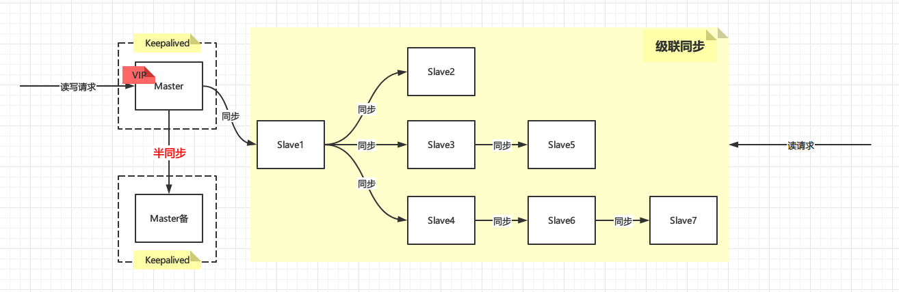
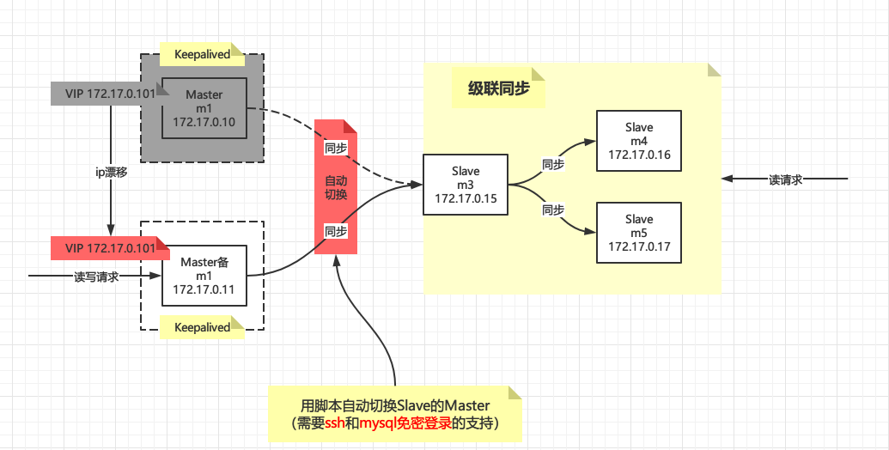

# MySQL+Keepalived主从高可用集群原理+实战

# 背景

随着公司业务的发展，对数据库的要求越来越高，以前的单机MySQL肯定是玩不转了，亟需升级成MySQL集群，这是一个公司在业务发展时不得不面临的问题

> 就单机MySQL而言，自己玩玩可以，运用到实际项目中，那肯定要挨批的。一方面数据不安全，万一数据库的电脑磁盘坏了，就坑了。另一方面数据库的并发能力是有限的，一般并发数200～500就差不多了，当然你要继续往上增，也是可以的，那就影响整体Mysql的响应时间。

那么有哪些集群方案呢？
# 集群方案

集群方案之前已经讨论过了，可以参考之前的【MySQL主从集群原理+实战】，今天我们来实现这种Keepalived+双主热备级联复制集群



优点：

- 读写分离，增加整体性能
- Master有故障转移（采用Keepalived实现），当Master宕机时，备用Master自动顶上去，且IP无变化（VIP）
- Master和备用Master之间采用半同步机制，最大程度上保证数据一致性

缺点：

- Master故障转移时，Slave需要用脚本手动切换，增加复杂度

- 数据存在一致性问题，因为异步，所以Slave的数据一定不是最新的，需要等待一个时间窗后才能读取
- Slave过多时Slave对Master的负载以及网络带宽都会成为一个严重的问题

# Keepalived双主热备级联复制集群

m1和m2作为双主，**互为主从**且同步方式为**半同步**，为什么呢？因为这样在Master主机宕机恢复，对Master备机写入的数据也能重新同步到Master主，此时的主备角色正好颠倒过来，所以要设置互为主从且半同步。

m3作为级联复制的中间节点，新增加m4和m5作为新的Slave，正常情况下架构如下


当发生故障时，VIP自动漂移到Master备机上面，且通过Keepalived的状态脚本自动切换Slave，即m3到Master备机上，当Master主机（m1）恢复时，VIP又会自动漂移到m1上并且m3也会自动切换到m1上！

Keepalived状态切换脚本需要ssh和mysql免密登录的支持，其原理就是m1或者m2检测到自己成为Master角色时，通过ssh登录到m3上执行MySQL的切换命令



## 环境准备

```bash
docker run -dit  --name m1 --privileged mysql5.7.24 /usr/sbin/init
docker run -dit  --name m2 --privileged mysql5.7.24 /usr/sbin/init
docker run -dit  --name m3 --privileged mysql5.7.24 /usr/sbin/init
docker run -dit  --name m4 --privileged mysql5.7.24 /usr/sbin/init
docker run -dit  --name m5 --privileged mysql5.7.24 /usr/sbin/init
```

各个IP如下：

```properties
VIP 172.17.0.101
m1  172.17.0.10
m2  172.17.0.11
m3  172.17.0.15
m4  172.17.0.16
m5  172.17.0.17
```

`MYSQL_HOME`变量定义，每台都定义下，后面的命令都依赖`MYSQL_HOME`

```bash
# 定义变量
MYSQL_VERSION=5.7.24
MYSQL_HOME=/usr/local/mysql-$MYSQL_VERSION
```

需要注意的是每台上要重置一下`server_uuid`，否则后面的主从复制会出错，直接删掉`auto.cnf`让MySQL自动生成即可

```bash
rm -rf  $MYSQL_HOME/data/auto.cnf
```

由于是在docker里面，可能没有ssh，每台都装上ssh服务，后面的从机自动切换需要用到

```bash
yum install -y openssh-server openssh-clients passwd
```

## 双主配置

### 重置配置

如果哪个步骤出问题了，需要重新来，可以通过下面的方法重置

- 删除所有的库，分开执行

```bash
mysql -uroot -p  -e "show databases" | grep -vE 'mysql|information_schema|performance_schema|test|sys|Database' | awk '{ print "drop database "$1";" }' > drop.sql && cat drop.sql

mysql -uroot -p < drop.sql
```

- 重置Slave

```
STOP SLAVE;
RESET SLAVE;
```

- 重置Master，binlog将会重新开始

```
RESET MASTER;
```

### Master主机

```bash
# 先用-15优雅杀掉进程
ps aux  | grep -v grep | grep  mysql | awk '{ print $2 }' | xargs kill -15
sleep 1
 
# 修改配置
cat > /etc/my.cnf <<EOF
[client]
user=root
password=root

[mysqld]
user=mysql
character-set-server=utf8mb4
collation-server=utf8mb4_general_ci
datadir=$MYSQL_HOME/data
log-bin=mysql-bin-master
expire_logs_days=5
server-id=1
log-slave-updates=1

plugin-load = "rpl_semi_sync_master=semisync_master.so;rpl_semi_sync_slave=semisync_slave.so"
rpl-semi-sync-master-enabled=1
rpl-semi-sync-slave-enabled=1

[mysqld_safe]
log-error=$MYSQL_HOME/logs/mysqld.log
pid-file=$MYSQL_HOME/pids/mysqld.pid

[client]
default-character-set=utf8mb4
EOF

# 启动
/etc/init.d/mysqld start

# 查看启动日志
tail -f $MYSQL_HOME/logs/mysqld.log

```

- `log-slave-updates=1`：这个参数需要注意下，互为主从的时候两台都需要写入自己从对方取到的数据到binlog里面

- ```bash
  plugin-load = "rpl_semi_sync_master=semisync_master.so;rpl_semi_sync_slave=semisync_slave.so"
  rpl-semi-sync-master-enabled=1
  rpl-semi-sync-slave-enabled=1
  ```

  主从半同步都需开启，因为是互为主从

- `[client]`：需要注意下，配置了可以免密执行`SQL`，方便后面实现自动切换从机脚本！

执行完毕后登陆MySQL创建同步用户

```sql
DROP USER 'repl'@'%' ;
CREATE USER 'repl'@'%' IDENTIFIED BY 'repl';
GRANT REPLICATION SLAVE ON *.* TO 'repl'@'%';
flush privileges;
```

看一下Master状态

```sql
SHOW MASTER STATUS;

+-------------------------+----------+--------------+------------------+-------------------+
| File                    | Position | Binlog_Do_DB | Binlog_Ignore_DB | Executed_Gtid_Set |
+-------------------------+----------+--------------+------------------+-------------------+
| mysql-bin-master.000001 |      154 |              |                  |                   |
+-------------------------+----------+--------------+------------------+-------------------+

```

### Master备机

```bash
# 先用-15优雅杀掉进程
ps aux  | grep -v grep | grep  mysql | awk '{ print $2 }' | xargs kill -15
sleep 1
 
# 修改配置
cat > /etc/my.cnf <<EOF
[client]
user=root
password=root

[mysqld]
user=mysql
character-set-server=utf8mb4
collation-server=utf8mb4_general_ci
datadir=$MYSQL_HOME/data
log-bin=mysql-bin-master
expire_logs_days=5
server-id=2
log-slave-updates=1

plugin-load = "rpl_semi_sync_master=semisync_master.so;rpl_semi_sync_slave=semisync_slave.so"
rpl-semi-sync-master-enabled=1
rpl-semi-sync-slave-enabled=1

[mysqld_safe]
log-error=$MYSQL_HOME/logs/mysqld.log
pid-file=$MYSQL_HOME/pids/mysqld.pid

[client]
default-character-set=utf8mb4
EOF

# 启动
/etc/init.d/mysqld start

# 查看启动日志
tail -f $MYSQL_HOME/logs/mysqld.log

```

Master备机和主机如出一辙，主要区别的`server-id`字段不能一样，集群中的每台机器`server-id`都不能一样！

接下来就是创建同步用户，**最好和Master主机创建成一样的**，如果不一样，后面自动切换Slave的脚本就要针对Master主机和Master备机做调整，比较麻烦！

```sql
DROP USER 'repl'@'%' ;
CREATE USER 'repl'@'%' IDENTIFIED BY 'repl';
GRANT REPLICATION SLAVE ON *.* TO 'repl'@'%';
flush privileges;
```

看一下Master状态

```sql
SHOW MASTER STATUS;

+-------------------------+----------+--------------+------------------+-------------------+
| File                    | Position | Binlog_Do_DB | Binlog_Ignore_DB | Executed_Gtid_Set |
+-------------------------+----------+--------------+------------------+-------------------+
| mysql-bin-master.000001 |      154 |              |                  |                   |
+-------------------------+----------+--------------+------------------+-------------------+

```

可以看到，两台干净的MySQL实例创建出来的Master File和Position都是一致的，两台Master角色都配置好了，接下来就是相互挂载成为对方的Slave

### 互为主从

其实很简单，互相指定下即可，将Master主挂载成为Master备机的从机

```sql
STOP SLAVE;
RESET SLAVE;

CHANGE MASTER TO
MASTER_HOST='172.17.0.10',
MASTER_USER='repl',
MASTER_PASSWORD='repl',
MASTER_LOG_FILE='mysql-bin-master.000001',
MASTER_LOG_POS=154;

START SLAVE;

SHOW SLAVE STATUS\G;
```

将Master备机挂载成为Master主机的从机，改下IP即可，其他的地方我们都配置成了一样的

```sql
STOP SLAVE;
RESET SLAVE;

CHANGE MASTER TO
MASTER_HOST='172.17.0.11',
MASTER_USER='repl',
MASTER_PASSWORD='repl',
MASTER_LOG_FILE='mysql-bin-master.000001',
MASTER_LOG_POS=154;


START SLAVE;

SHOW SLAVE STATUS\G;
```

分别查看下是否挂载成功

```sql
mysql> SHOW SLAVE STATUS\G;
*************************** 1. row ***************************
...
             Slave_IO_Running: Yes
            Slave_SQL_Running: Yes
...
```

再分别看下半同步是否开启

```
show status like 'Rpl_semi_sync_master_status';


+-----------------------------+-------+
| Variable_name               | Value |
+-----------------------------+-------+
| Rpl_semi_sync_master_status | ON    |
+-----------------------------+-------+


show status like 'Rpl_semi_sync_slave_status';

+----------------------------+-------+
| Variable_name              | Value |
+----------------------------+-------+
| Rpl_semi_sync_slave_status | ON    |
+----------------------------+-------+

```

最后在自行测试下载Master主机上面写数据Master备机能否同步，反过来再测试下，这里限于篇幅就不做测试了，实际上我做了很多次测试都是可以的。

在某一台宕机后另外一台第一次插入会等10s左右，说明半同步复制也是开启的，第二次插入就会退化了异步复制了，并且在宕机机器恢复后会自动同步缺失的数据。

### 配置Keepalived

#### 编译安装

```bash
# 定义路径、定义版本
KEEPALIVED_HOME=/usr/local/keepalived
KEEPALIVED_VERSION=2.1.5

mkdir -p $KEEPALIVED_HOME
O_PATH=`pwd`
# 安装依赖
yum install -y wget make cmake gcc gcc-c++ openssl-devel net-tools
# 下载并解压
cd $KEEPALIVED_HOME && \
wget https://www.keepalived.org/software/keepalived-$KEEPALIVED_VERSION.tar.gz && \
tar -zxf keepalived-$KEEPALIVED_VERSION.tar.gz
# 编译安装
cd keepalived-$KEEPALIVED_VERSION
./configure --prefix=$KEEPALIVED_HOME
make && make install
# 软连
ln -s $KEEPALIVED_HOME/sbin/keepalived /sbin/
# 拷贝配置文件，默认路径为/etc/keepalived
mkdir /etc/keepalived
\cp -rf $KEEPALIVED_HOME/etc/keepalived/keepalived.conf /etc/keepalived/
# 添加环境变量
echo "export KEEPALIVED_HOME=$KEEPALIVED_HOME" >> ~/.bashrc
. ~/.bashrc
cd $O_PATH
```

编译安装过程如上，就不赘述了

#### Master主机配置

```bash
# 备份一下配置文件
cp /etc/keepalived/keepalived.conf /etc/keepalived/keepalived.conf.bak

# 重新编辑配置文件
echo '' > /etc/keepalived/keepalived.conf && vi /etc/keepalived/keepalived.conf
```

Master主机上的配置文件如下：

```bash
! Configuration File for keepalived

global_defs {
    router_id HA-M1
}

vrrp_script chk_mysql {
    script /etc/keepalived/chk_mysql.sh    #健康监测脚本路径
    interval 2
    fall 3
    rise 2
}

vrrp_instance VI_MYSQL {
    state MASTER
    interface eth0       # 监听网卡
    virtual_router_id 100  # 虚拟路由编号，同一实例可以一致，但是其权重一定不能一致
    priority 100           # 权重，两个节点不能一样
    advert_int 1
    mcast_src_ip 172.17.0.10
    
    authentication {
        auth_type PASS
        auth_pass 1111
    }
    
    virtual_ipaddress {
        172.17.0.101  dev  eth0  label  eth0:vip    # 虚拟IP地址
        # 240C::1234/64       # 支持IPv6
    }
    notify /etc/keepalived/kpad_notify.sh     # keep状态传入脚本，通过该脚本可得知当前keep运行状态
    
    track_script {
        chk_mysql            # 健康检查配置
    }
}
```

- `router_id`：标识，两台需不一样
- `state MASTER`：表明这台是Master角色
- `priority`：优先级，MASTER角色比BACKUP高！
- `virtual_router_id`：虚拟路由编号，两台需要一致
- `172.17.0.101  dev  eth0  label  eth0:vip`：这就是我们配置的VIP：`172.17.0.101`
- `script /etc/keepalived/chk_mysql.sh`：MySQL的检测脚本，定时去检测MySQL进程是否挂掉，如果挂掉，在脚本里面重启之，定时通过`interval`配置，上面配置的是2s检测一次
- `notify /etc/keepalived/kpad_notify.sh`：当Keepalived状态发生变化时，会调用该脚本，这也是我们实现Slave（m3）自动挂载Master的关键！！

> **当Keepalived从BACKUP提升为MASTER时，那么VIP就会漂移到自己身上，这个时候我们只需要将Slave挂载在自己身上即可**

Slave的自动挂载Master，我们只需要实现上面这句话的逻辑即可！

下面是两个脚本文件，Master主机和Master备机都是一样的。分别创建脚本文件

#### MySQL状态监测脚本

在Master主机和Master备机上都要创建该脚本

```bash
touch /etc/keepalived/chk_mysql.sh
chmod +x /etc/keepalived/chk_mysql.sh
vi /etc/keepalived/chk_mysql.sh

# 创建个日志文件
mkdir -p /var/log/keepalived && touch /var/log/keepalived/chk_mysql.log
```

`chk_mysql.sh`内容如下，可以看到可以根据当前Keepalived的状态分别处理，但是此处的处理都是启动MySQL（如果MySQL进程已退出）

```bash
#!/bin/bash

STATE=`cat /tmp/keepalived-state`
log_file="/var/log/keepalived/chk_mysql.log"
service_name="mysqld"
service_cmd="/etc/init.d/mysqld"
get_pid=`pidof $service_name`

log() {
echo "$(date +"%Y-%m-%d %H:%M:%S.%4N") [$STATE] $1" >> $log_file
}

case $STATE in
    "MASTER")
        if [ "${get_pid}" == "" ]; then
            log "$service_name service isn't exist."
            log "Try to restart $service_name service."
            $service_cmd start
            if [ $? -eq 0 ]; then
                log "restart $service_name service successfully."
            else
                log "restart $service_name service failed."
                exit 1
            fi
        fi
        exit 0
        ;;
    "BACKUP")
        if [ "${get_pid}" == "" ]; then
            log "$service_name service isn't exist."
            log "Try to restart $service_name service."
            $service_cmd start
            if [ $? -eq 0 ]; then
                log "restart $service_name service successfully."
            else
                log "restart $service_name service failed."
                exit 1
            fi
        fi
        exit 0
        ;;
    "FAULT")
        exit 0
        ;;
       *)
        exit 1
        ;;
esac
```


#### Keepalived状态变更脚本

在Master主机和Master备机上都要创建该脚本

```bash
touch /etc/keepalived/kpad_notify.sh
chmod +x /etc/keepalived/kpad_notify.sh
vi /etc/keepalived/kpad_notify.sh

# 创建个日志文件
mkdir -p /var/log/keepalived && touch /var/log/keepalived/kpad_notify.log
```

`kpad_notify.sh`内容如下：

```bash
#!/bin/bash

TYPE=$1
NAME=$2
STATE=$3

log_file="/var/log/keepalived/kpad_notify.log"

log() {
echo "$(date +"%Y-%m-%d %H:%M:%S.%4N") [$STATE] $1" >> $log_file
}

case $STATE in
    "MASTER")
        echo 'MASTER' > /tmp/keepalived-state
        # Slave自动切换Master
        /etc/keepalived/chg_master.sh >> $log_file
        log "changed master status  $STATE"
        exit 0
        ;;
    "BACKUP")
        echo 'BACKUP' > /tmp/keepalived-state
        log "do nothing  $STATE"
        exit 0
        ;;
    "FAULT")
        echo 'FAULT' > /tmp/keepalived-state
        log "keepalived status is fault."
        exit 0
        ;;
    *)
        log "unknown keepalived status. $STATE"
        exit 1
        ;;
esac
```

#### Slave自动切换Master脚本


> **当Keepalived从BACKUP提升为MASTER时，那么VIP就会漂移到自己身上，这个时候我们只需要将Slave挂载在自己身上即可**


```
touch /etc/keepalived/chg_master.sh
vi /etc/keepalived/chg_master.sh
```

这句话的实现如下：`chg_master.sh`

```bash
#!/bin/bash

echo '====================================start master change===============================================' 
# 目标IP，指的是Slave的IP，可以是多个
target_ip=(172.17.0.15)

# 本机IP
local_ip=`ifconfig eth0 | sed -n '2p' | awk '{ print $2 }'`
# 获取本机master信息，mysql免密登录
status=`mysql -uroot -e "show master status" | sed -n '2p'`
# binlog文件名字
binlog_file=`echo $status | awk '{ print $1 }'`
# binlog同步偏移量
binlog_pos=`echo $status | awk '{ print $2 }'`
echo "Got local ip is $local_ip and binary log is $binlog_file and binary log position is $binlog_pos"


# 循环执行转移Slave到自己身上
for t_ip in $target_ip
do
	echo "start change slave for $t_ip to $local_ip"
	# ssh远程到slave上执行切换master操作，需要ssh免密登录
	ssh $t_ip <<SOF
mysql -uroot  <<EOF
STOP SLAVE;
RESET SLAVE;
CHANGE MASTER TO
MASTER_HOST='$local_ip',
MASTER_USER='repl',
MASTER_PASSWORD='repl',
MASTER_LOG_FILE='$binlog_file',
MASTER_LOG_POS=$binlog_pos;
START SLAVE;
EOF
sleep 0.1
mysql -uroot  -e "SHOW SLAVE STATUS\G";
SOF
    
done
echo '====================================end master change===============================================' 

```

这个脚本用到了`mysql -uroot`免密登录和ssh免密登录，所以这里需要配置一下

- mysql免密登录，在Master主机和Master备机上已经配置过了，这里无需配置，另外Slave（m3）上面也需要配置，这里讲到m3在说
- ssh免密登录，上面已经安装过ssh服务端/客户端了，现在需要在Slave（m3）上配置ssh让Master主机/Master备机能登录上来操作

m3上执行下面两句话

```bash
# 启动ssh服务
systemctl start sshd
# 修改root密码，随便改个即可，后面要用到
passwd root

```

重点来了，需要在Master主机和Master备机上实现免密登录到m3，在Master主机和Master备机行执行下面操作

```bash
# 生成密钥
ssh-keygen -t rsa -f ~/.ssh/id_rsa
# 拷贝到目标主机，即m3
ssh-copy-id  -p 22 172.17.0.15
# 试下下面的命令是否能直接登录，如果能说明免密登录成功
ssh 172.17.0.15
```


#### Master备机配置

```bash
# 备份一下配置文件
cp /etc/keepalived/keepalived.conf /etc/keepalived/keepalived.conf.bak

# 重新编辑配置文件
echo '' > /etc/keepalived/keepalived.conf && vi /etc/keepalived/keepalived.conf
```

Master备机上的配置文件如下：

```bash
! Configuration File for keepalived

global_defs {
    router_id HA-M2
}

vrrp_script chk_mysql {
    script /etc/keepalived/chk_mysql.sh    #健康监测脚本路径
    interval 2
    fall 3
    rise 2
}

vrrp_instance VI_MYSQL {
    state BACKUP
    interface eth0       # 监听网卡
    virtual_router_id 100  # 虚拟路由编号，同一实例可以一致，但是其权重一定不能一致
    nopreempt
    priority 50           # 权重，两个节点不能一样
    advert_int 1
    mcast_src_ip 172.17.0.11
    
    authentication {
        auth_type PASS
        auth_pass 1111
    }
    
    virtual_ipaddress {
        172.17.0.101  dev  eth0  label  eth0:vip     # 虚拟IP地址
        # 240C::1234/64       # 支持IPv6
    }
    notify /etc/keepalived/kpad_notify.sh     # keep状态传入脚本，通过该脚本可得知当前keep运行状态
    track_script {
        chk_mysql            # 健康检查配置
    }
}
```

注意`router_id`需要不一样，`state BACKUP`表明是备机，`virtual_router_id`需要一致，`priority`要比MASTER低！

#### 启动Keepalived

最后在Master主机和Master备机上分别启动Keepalived

```bash
$KEEPALIVED_HOME/sbin/keepalived
```

不出意外的话在Master主机上执行`ifconfig`将会看到VIP，在Master备机上却看不到！

```
eth0:vip: flags=4163<UP,BROADCAST,RUNNING,MULTICAST>  mtu 1500
        inet 172.17.0.101  netmask 255.255.255.255  broadcast 0.0.0.0
        ether 02:42:ac:11:00:0a  txqueuelen 0  (Ethernet)

```

#### 测试

测试的时候可以先把`kpad_notify.sh`中的`/etc/keepalived/chg_master.sh >> $log_file`这句话注释掉再测试，因为现在我们还没有引入Slave（m3）

经过我的测试，有如下测试结论：

杀掉Master主机上的Keepalived和mysql：

- VIP会漂移到Master备机上，`ifconfig`能看到VIP信息
- 通过`/tmp/keepalived-state`和日志`kpad_notify.log`观察Keepalived是从BACKUP状态转换为了MASTER状态
- Master备机上做写操作，第一次写会发生半同步等待（10s左右），第二次写会退化成异步复制

启动Master上的Keepalived和mysql：

- `ifconfig`看下VIP会漂移回来，并且Master备机上的VIP会消失
- 刚才在Master备机上写入的数据同步过来了
- Keepalived的状态是从FAULT转变为BACKUP，最后变成MASTER

测试SQL

```sql
show databases;
create database tom;
use tom;
create table `user`(
    `id` int comment 'id',
    `name` varchar(50) comment '姓名'
);
insert into user values (1,'Tom'),(2,'Jerry');

select*from  user;


insert into user values (3,'Tom3'),(4,'Jerry4');
```


## 配置Slave（m3）

接下来的配置都是一些常规的配置了，将m3配置成级联复制的中间节点，起到承上启下的作用，主要配置`log-bin`和`log-slave-updates`这两个参数！

```bash
# 先用-15优雅杀掉进程
ps aux  | grep -v grep | grep  mysql | awk '{ print $2 }' | xargs kill -15
sleep 1

# 修改配置
cat > /etc/my.cnf <<EOF
[client]
user=root
password=root

[mysqld]
user=mysql
character-set-server=utf8mb4
collation-server=utf8mb4_general_ci
datadir=$MYSQL_HOME/data
# 启用Binary Log
log-bin=mysql-bin 
# server id唯一
server-id=3
# 重要!!!这个参数告知MySQL将本机收到的更新写入到自己的Binary Log中
log-slave-updates=1


[mysqld_safe]
log-error=$MYSQL_HOME/logs/mysqld.log
pid-file=$MYSQL_HOME/pids/mysqld.pid

[client]
default-character-set=utf8mb4
EOF

# 启动
/etc/init.d/mysqld start

# 查看启动日志
tail -f $MYSQL_HOME/logs/mysqld.log
```

### 异步复制配置

将Slave（m3）挂载到Master主机上（即m1上）

（注意，经过上面Master双主的测试后，可能binlog文件和偏移量已经变了，需要重置一下配置，请看开篇的重置配置）

```sql
STOP SLAVE;
RESET SLAVE;

CHANGE MASTER TO
MASTER_HOST='172.17.0.10',
MASTER_USER='repl',
MASTER_PASSWORD='repl',
MASTER_LOG_FILE='mysql-bin-master.000001',
MASTER_LOG_POS=154;

START SLAVE;

SHOW SLAVE STATUS\G;
```

### 创建同步用户

这里的同步用户是给m4和m5用的，没有什么特殊要求，简单起见Master主机/Master备机一致

```sql
DROP USER 'repl'@'%' ;
CREATE USER 'repl'@'%' IDENTIFIED BY 'repl';
GRANT REPLICATION SLAVE ON *.* TO 'repl'@'%';
flush privileges;
```

### 测试

这才是本篇中最重要的一个测试，一定要放开`kpad_notify.sh`中的`/etc/keepalived/chg_master.sh >> $log_file`这句话，因为上面测试双主的时候关闭了

1. 首先模拟Master主机宕机，杀掉Master主机上的Keepalived和mysql，查看Master备机上状态切换日志文件：`/var/log/keepalived/kpad_notify.log`，发现有如下输出

```properties
====================================start master change===============================================
Got local ip is 172.17.0.11 and binary log is mysql-bin-master.000001 and binary log position is 1598
start change slave for 172.17.0.15 to 172.17.0.11
*************************** 1. row ***************************
                  Master_Host: 172.17.0.11
                  Master_User: repl
                  Master_Port: 3306
                Connect_Retry: 60
              Master_Log_File: mysql-bin-master.000001
          Read_Master_Log_Pos: 1598
               Relay_Log_File: bbc1b4097f24-relay-bin.000002
                Relay_Log_Pos: 327
        Relay_Master_Log_File: mysql-bin-master.000001
             Slave_IO_Running: Yes
            Slave_SQL_Running: Yes
              .....
====================================end master change===============================================
2021-04-10 06:15:12.2084 [MASTER] changed master status  MASTER
```

这不就是我们Slave自动切换脚本输出的内容吗，说明自动切换生效了，通过`Master_Host: 172.17.0.11`就能看出来是Master备机的IP，在m3上执行`SHOW SLAVE STATUS\G;`看看是否和输出的一样，此时再在Master备机上进行写操作，Slave也是能同步过去的


2. 然后模拟Master主机恢复，启动Master主机上的Keepalived和mysql，查看Master主机上状态切换日志文件：`/var/log/keepalived/kpad_notify.log`，发现有如下输出

```properties
====================================start master change===============================================
Got local ip is 172.17.0.10 and binary log is mysql-bin-master.000002 and binary log position is 412
start change slave for 172.17.0.15 to 172.17.0.10
*************************** 1. row ***************************
               Slave_IO_State: Waiting for master to send event
                  Master_Host: 172.17.0.10
                  Master_User: repl
                  Master_Port: 3306
                Connect_Retry: 60
              Master_Log_File: mysql-bin-master.000002
          Read_Master_Log_Pos: 412
               Relay_Log_File: bbc1b4097f24-relay-bin.000002
                Relay_Log_Pos: 327
        Relay_Master_Log_File: mysql-bin-master.000002
             Slave_IO_Running: Yes
            Slave_SQL_Running: Yes
            ...
====================================end master change===============================================
2021-04-10 06:15:59.5336 [MASTER] changed master status  MASTER

```

此时无需多言，聪明人一眼就能看出来Slave又自动切换回到了Master主机上，在m3上执行`SHOW SLAVE STATUS\G;`也可以看到和输出的一致

### 多个Slave？

多个Slave的情况也考虑到了，Slave自动切换Master脚本（`chg_master.sh`的目标IP：`target_ip=(172.17.0.15)`是个数组形式，多个Slave直接追加在后面，用空格隔开即可，当然Slave越多切换越慢，看实际情况而定！

## 级联复制

### 配置多个Slave

m4和m5作为m3的Slave，只需配置常规的异步复制即可，在m4和m5上分别执行，注意`server-id`集群中的实例必须唯一！`server-id`需自行更改

```bash
# 先用-15优雅杀掉进程
ps aux  | grep -v grep | grep  mysql | awk '{ print $2 }' | xargs kill -15
sleep 1

# 修改配置
cat > /etc/my.cnf <<EOF
[mysqld]
user=mysql
character-set-server=utf8mb4
collation-server=utf8mb4_general_ci
datadir=$MYSQL_HOME/data
server-id=4       # server id唯一
#server-id=5      # server id唯一

[mysqld_safe]
log-error=$MYSQL_HOME/logs/mysqld.log
pid-file=$MYSQL_HOME/pids/mysqld.pid

[client]
default-character-set=utf8mb4
EOF

# 启动
/etc/init.d/mysqld start

# 查看启动日志
tail -f $MYSQL_HOME/logs/mysqld.log
```

### 异步复制配置

注意：此时如果有数据的话需要将m1/m2/m3上的数据同步至m4和m5，**总之要保证挂载之前m1到m5的数据是一致的！**

先在m3上查看一下Master信息

```sql
show master status;

+------------------+----------+--------------+------------------+-------------------+
| File             | Position | Binlog_Do_DB | Binlog_Ignore_DB | Executed_Gtid_Set |
+------------------+----------+--------------+------------------+-------------------+
| mysql-bin.000001 |     1185 |              |                  |                   |
+------------------+----------+--------------+------------------+-------------------+

```

然后在m4和m5上执行下面命令分别挂载到m3上

```sql
STOP SLAVE;
RESET SLAVE;

CHANGE MASTER TO
MASTER_HOST='172.17.0.15',
MASTER_USER='repl',
MASTER_PASSWORD='repl',
MASTER_LOG_FILE='mysql-bin.000001',
MASTER_LOG_POS=1185;

START SLAVE;

SHOW SLAVE STATUS\G;
```

### 测试

这个测试基本没啥技术含量，在m1或者m2上任意进行写入操作，然后查看m1到m5的数据是否一致即可，当然经过上面的一番操作，数据肯定是一致的，但是级联复制链路越长，延迟就越大，这个需要结合实际情况。


# 总结

经过一顿操作，我们发现要实现MySQL的高可用整个过程还是比较复杂，特别是针对写节点，目前我们能实现的也是单点写，多点读，不过单点写有一台Master备机作为热备，那么有没有多点写呢？答案是有的，如果有时间，我们将来搭建一下PXC（Percona XtraDB Cluster）和MGR（MySQL Group Replication）

上面的架构中，Slave的切换需要通过脚本来实现，强烈依赖于keepalived的状态变化，那么我们能不能指定VIP作为m3的Master呢？答案是不能，因为指定Master除了指定IP还有binlog文件和偏移量，即使这三者都相同，也是不行的，每台MySQL都有一个`server_uuid`作为全局唯一标识，是不能简单的通过VIP欺骗MySQL Replication组件的（别问我怎么知道，因为我试过了不行最后才选择了脚本实现）

# 参考

- https://www.cnblogs.com/kevingrace/p/6710136.html
- http://ylong.net.cn/mysql-ha.html
- https://blog.51cto.com/superleedo/1897966