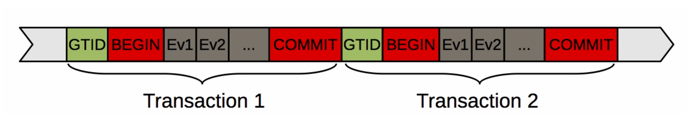
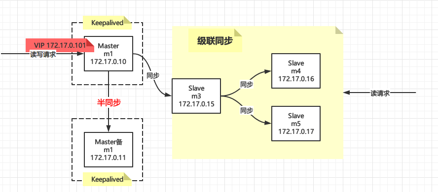
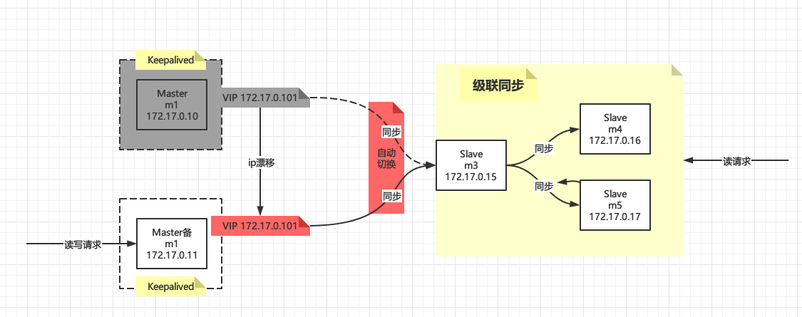

# MySQL 5.6新特性：基于GTID的同步方式

# 背景

在我们之前的文章中，无论是【MySQL主从集群原理+实战】还是【MySQL+Keepalived主从高可用集群原理+实战】采用的都是MySQL的传统复制方式：基于binlog文件名和偏移量的方式，即形如如下命令：

```sql
CHANGE MASTER TO
MASTER_HOST='172.17.0.11',
MASTER_USER='repl',
MASTER_PASSWORD='repl',
MASTER_LOG_FILE='mysql-bin-master.000001',
MASTER_LOG_POS=154;
```

其中`MASTER_LOG_FILE`就是我们所说的binlog文件名，`MASTER_LOG_POS`就是binlog偏移量

假设Master宕机以后，选一个Slave作为新的Master，那么原来的Master变成了Slave，它要挂载在现在新的Master上，那么`MASTER_LOG_FILE`和`MASTER_LOG_POS`应该咋填？不可能填现在的吧，因为新的Master还在接受写请求，数据已经超过了原来的Master了

如果填小了可能会出现数据重复，填大了可能出现数据丢失，这个工作应该让MySQL自己来做，那么这就是GTID做的事情。

# GTID是什么？

GTID全称为Global Transaction Identifier，即全局事务标识，它在整个集群中都是唯一的，表现形式为

```
GTID = server_uuid:transaction_id
```

`server_uuid`即我们之前提到的`$MYSQL_HOME/data/auto.cnf`，集群中的每台实例都是唯一的，删掉该文件后会重新生成，`transaction_id`就是一个整型数字

如下表示的是Master为`3E11FA47-71CA-11E1-9E33-C80AA9429562`、事务id为23的一个GTID

```
3E11FA47-71CA-11E1-9E33-C80AA9429562:23
```

还可以范围表示，如下表示1到100的事务

```
3E11FA47-71CA-11E1-9E33-C80AA9429562:1-100
```

GTID也是基于binlog的，在binlog中的表现形式如下，每一个GTID都表示一个已经被提交的事务




这样Slave就可以通过GTID来标识哪些事务是同步过的，哪些是没同步过的，具体的做法是Salve把自己同步过的GTID放到`gtid_executed`中，然后比较新来的GTID是否在`gtid_executed`中，如果在，说明已经同步过了，不需要再次同步，否则需要进行同步。

Slave也可以通过`COM_BINLOG_DUMP_GTID`协议将自己的执行过的GTID发送给Master，Master再返回Slave没有同步过的GTID集合，总之，比较这个动作可以在Slave上进行，也可以在Master上进行。

## 局限性

因为GTID是基于事务的，所以MySQL只允许能够保障事务安全，并且能够被日志记录的SQL语句被执行，像`create table … select` 和 `create temporary table`语句，以及同时更新事务表和非事务表的SQL语句或事务都不允许执行，这个如下，on表示开启GTID事务的一致性，即上面的非事务一致性的语句执行会报错！

```
enforce-gtid-consistency = on
```

# 简单主从同步

## 环境准备

我们以为之前设置过的简单主从为例，环境为

```bash
docker run -dit  --name m1 --privileged centos /usr/sbin/init
docker run -dit  --name m2 --privileged centos /usr/sbin/init
```

ip地址分别如下，以m1作为Master，m2作为Slave

```properties
m1 172.17.0.10
m2 172.17.0.11
```

`MYSQL_HOME`变量定义，每台都定义下，后面的命令都依赖`MYSQL_HOME`

```bash
# 定义变量
MYSQL_VERSION=5.7.24
MYSQL_HOME=/usr/local/mysql-$MYSQL_VERSION
```

## 重置配置

如果哪个步骤出问题了，需要重新来，可以通过下面的方法重置

- 删除所有的库，分开执行

```bash
mysql -uroot -p  -e "show databases" | grep -vE 'mysql|information_schema|performance_schema|test|sys|Database' | awk '{ print "drop database "$1";" }' > drop.sql && cat drop.sql

mysql -uroot -p < drop.sql
```

- 重置Slave

```
STOP SLAVE;
RESET SLAVE;
```

- 重置Master，binlog将会重新开始

```
RESET MASTER;
```

## Master配置

主要关注`gtid`和`binlog`的配置

```bash
# 先用-15优雅杀掉进程
ps aux  | grep -v grep | grep  mysql | awk '{ print $2 }' | xargs kill -15
sleep 1
 
# 修改配置
cat > /etc/my.cnf <<EOF
[mysqld]
user=mysql
character-set-server=utf8mb4
collation-server=utf8mb4_general_ci
datadir=$MYSQL_HOME/data
server-id=1       # server id唯一

# gtid
gtid_mode=on                 #开启gtid模式
enforce_gtid_consistency=on  #强制gtid一致性，开启后对于特定create table不被支持

# binlog
log-bin=master-mysql-bin   # 启用Binary Log
expire_logs_days=5  # 设置binlog5天后清理，默认不清理
log-slave-updates=1 # 作为slave时，记录slave的日志到binlog中   
binlog_format=row   #强烈建议，其他格式可能造成数据不一致


[mysqld_safe]
log-error=$MYSQL_HOME/logs/mysqld.log
pid-file=$MYSQL_HOME/pids/mysqld.pid

[client]
default-character-set=utf8mb4
EOF

# 启动
/etc/init.d/mysqld start

# 查看启动日志
tail -f $MYSQL_HOME/logs/mysqld.log

```

创建同步用户

```sql
DROP USER 'repl'@'%';
CREATE USER 'repl'@'%' IDENTIFIED BY 'repl';
GRANT REPLICATION SLAVE ON *.* TO 'repl'@'%';
flush privileges;
```


## Slave配置

主要关注`gtid`和`binlog`的配置

```bash
# 先用-15优雅杀掉进程
ps aux  | grep -v grep | grep  mysql | awk '{ print $2 }' | xargs kill -15
sleep 1

# 修改配置
cat > /etc/my.cnf <<EOF
[mysqld]
user=mysql
character-set-server=utf8mb4
collation-server=utf8mb4_general_ci
datadir=$MYSQL_HOME/data
server-id=2       # server id唯一
read_only=1       # Slave只读

# gtid
gtid_mode=on                 #开启gtid模式
enforce_gtid_consistency=on  #强制gtid一致性，开启后对于特定create table不被支持

# binlog
log-bin=slave-mysql-bin   # 启用Binary Log
expire_logs_days=5  # 设置binlog5天后清理，默认不清理
log-slave-updates=1 # 作为slave时，记录slave的日志到binlog中   
binlog_format=row   #强烈建议，其他格式可能造成数据不一致

[mysqld_safe]
log-error=$MYSQL_HOME/logs/mysqld.log
pid-file=$MYSQL_HOME/pids/mysqld.pid

[client]
default-character-set=utf8mb4
EOF

# 启动
/etc/init.d/mysqld start

# 查看启动日志
tail -f $MYSQL_HOME/logs/mysqld.log
```

## 设置主从同步

挂载Slave到Master上，如果Master上已经有数据了，需要先同步数据到Slave上，需要注意的是此时要锁住Master避免写操作，具体参考【MySQL主从集群原理+实战】的【配置主从集群（异步）】章节，此处不再赘述

```sql
STOP SLAVE;
RESET SLAVE;

CHANGE MASTER TO
MASTER_HOST='172.17.0.10',
MASTER_USER='repl',
MASTER_PASSWORD='repl',
MASTER_AUTO_POSITION = 1;

START SLAVE;

SHOW SLAVE STATUS\G;
```

我们对比下和以前的设置语句有什么不同

```sql
CHANGE MASTER TO
MASTER_HOST='172.17.0.10',
MASTER_USER='repl',
MASTER_PASSWORD='repl',
MASTER_LOG_FILE='mysql-bin-master.000001',
MASTER_LOG_POS=154;
```

主要是不用指定`MASTER_LOG_FILE`和`MASTER_LOG_POS`参数了，不要找点了，找点的事情给MySQL自己去做吧，他可以帮你准确的找到正确的点！

## 测试

随便给点SQL测试下，在Master上执行DML语句，在Slave上如果能看到同步的数据说明主从同步设置成功！

```sql
-- Master执行
create database tom;
use tom;
create table `user`(
    `id` int comment 'id',
    `name` varchar(50) comment '姓名'
);
insert into user values (1,'Tom'),(2,'Jerry');

-- Slave执行
use tom;
select*from  user;
```

如果Master宕机了，一部分数据没有同步到，如果是经典的主从复制的话需要去Master上找点，重新挂载Slave上去，因为此时binlog已经更新了，如下图，binlog从`000002`开始了

```
mysql> show master status;
+-------------------------+----------+--------------+------------------+-------------------------------------------+
| File                    | Position | Binlog_Do_DB | Binlog_Ignore_DB | Executed_Gtid_Set                         |
+-------------------------+----------+--------------+------------------+-------------------------------------------+
| master-mysql-bin.000002 |      194 |              |                  | 66918ffa-9810-11eb-b5c9-0242ac11000a:1-11 |
+-------------------------+----------+--------------+------------------+-------------------------------------------+

```

如果是GTID则不用管，因为MySQL会自动找点！

# Keepalived+MySQL+GTID集群配置

我们之前配置过这种架构的，最好先参考下【MySQL+Keepalived主从高可用集群原理+实战】，本篇文章中省略了很多步骤，否则有些地方可能看不懂，正常情况下：



Master主机发生故障时


现在我们用GTID的配置方式重新改造

## 环境准备

```bash
docker run -dit  --name m1 --privileged mysql5.7.24 /usr/sbin/init
docker run -dit  --name m2 --privileged mysql5.7.24 /usr/sbin/init
docker run -dit  --name m3 --privileged mysql5.7.24 /usr/sbin/init
docker run -dit  --name m4 --privileged mysql5.7.24 /usr/sbin/init
docker run -dit  --name m5 --privileged mysql5.7.24 /usr/sbin/init
```

各个IP如下：

```properties
VIP 172.17.0.101
m1  172.17.0.10
m2  172.17.0.11
m3  172.17.0.15
m4  172.17.0.16
m5  172.17.0.17
```

`MYSQL_HOME`变量定义，每台都定义下，后面的命令都依赖`MYSQL_HOME`

```bash
# 定义变量
MYSQL_VERSION=5.7.24
MYSQL_HOME=/usr/local/mysql-$MYSQL_VERSION
```

需要注意的是每台上要重置一下`server_uuid`，否则后面的主从复制会出错，直接删掉`auto.cnf`让MySQL自动生成即可

```bash
rm -rf  $MYSQL_HOME/data/auto.cnf
```

由于是在docker里面，可能没有ssh，每台都装上ssh服务，后面的从机自动切换需要用到

```bash
yum install -y openssh-server openssh-clients passwd
```

## 双主配置

## 重置配置

如果哪个步骤出问题了，需要重新来，可以通过下面的方法重置

- 删除所有的库，分开执行

```bash
mysql -uroot -p  -e "show databases" | grep -vE 'mysql|information_schema|performance_schema|test|sys|Database' | awk '{ print "drop database "$1";" }' > drop.sql && cat drop.sql

mysql -uroot -p < drop.sql
```

- 重置Slave

```
STOP SLAVE;
RESET SLAVE;
```

- 重置Master，binlog将会重新开始

```
RESET MASTER;
```

### Master主机

```bash
# 先用-15优雅杀掉进程
ps aux  | grep -v grep | grep  mysql | awk '{ print $2 }' | xargs kill -15
sleep 1
 
# 修改配置
cat > /etc/my.cnf <<EOF
[client]
user=root
password=root

[mysqld]
user=mysql
character-set-server=utf8mb4
collation-server=utf8mb4_general_ci
datadir=$MYSQL_HOME/data
server-id=1

# gtid
gtid_mode=on                 #开启gtid模式
enforce_gtid_consistency=on  #强制gtid一致性，开启后对于特定create table不被支持

# binlog
log-bin=master-mysql-bin   # 启用Binary Log
expire_logs_days=5  # 设置binlog5天后清理，默认不清理
log-slave-updates=1 # 作为slave时，记录slave的日志到binlog中   
binlog_format=row   #强烈建议，其他格式可能造成数据不一致

# 半同步
plugin-load = "rpl_semi_sync_master=semisync_master.so;rpl_semi_sync_slave=semisync_slave.so"
rpl-semi-sync-master-enabled=1
rpl-semi-sync-slave-enabled=1

[mysqld_safe]
log-error=$MYSQL_HOME/logs/mysqld.log
pid-file=$MYSQL_HOME/pids/mysqld.pid

[client]
default-character-set=utf8mb4
EOF

# 启动
/etc/init.d/mysqld start

# 查看启动日志
tail -f $MYSQL_HOME/logs/mysqld.log

```

执行完毕后登陆MySQL创建同步用户

```sql
DROP USER 'repl'@'%' ;
CREATE USER 'repl'@'%' IDENTIFIED BY 'repl';
GRANT REPLICATION SLAVE ON *.* TO 'repl'@'%';
flush privileges;
```

### Master备机

Master备机和主机如出一辙，主要区别的`server-id`字段不能一样，集群中的每台机器`server-id`都不能一样！

```bash
# 先用-15优雅杀掉进程
ps aux  | grep -v grep | grep  mysql | awk '{ print $2 }' | xargs kill -15
sleep 1
 
# 修改配置
cat > /etc/my.cnf <<EOF
[client]
user=root
password=root

[mysqld]
user=mysql
character-set-server=utf8mb4
collation-server=utf8mb4_general_ci
datadir=$MYSQL_HOME/data
server-id=2

# gtid
gtid_mode=on                 #开启gtid模式
enforce_gtid_consistency=on  #强制gtid一致性，开启后对于特定create table不被支持

# binlog
log-bin=master-mysql-bin   # 启用Binary Log
expire_logs_days=5  # 设置binlog5天后清理，默认不清理
log-slave-updates=1 # 作为slave时，记录slave的日志到binlog中   
binlog_format=row   #强烈建议，其他格式可能造成数据不一致

# 半同步
plugin-load = "rpl_semi_sync_master=semisync_master.so;rpl_semi_sync_slave=semisync_slave.so"
rpl-semi-sync-master-enabled=1
rpl-semi-sync-slave-enabled=1

[mysqld_safe]
log-error=$MYSQL_HOME/logs/mysqld.log
pid-file=$MYSQL_HOME/pids/mysqld.pid

[client]
default-character-set=utf8mb4
EOF

# 启动
/etc/init.d/mysqld start

# 查看启动日志
tail -f $MYSQL_HOME/logs/mysqld.log

```

接下来就是创建同步用户，**最好和Master主机创建成一样的**，如果不一样，后面自动切换Slave的脚本就要针对Master主机和Master备机做调整，比较麻烦！

```sql
DROP USER 'repl'@'%' ;
CREATE USER 'repl'@'%' IDENTIFIED BY 'repl';
GRANT REPLICATION SLAVE ON *.* TO 'repl'@'%';
flush privileges;
```

### 互为主从

以为GTID的方式挂载

```sql
STOP SLAVE;
RESET SLAVE;

CHANGE MASTER TO
MASTER_HOST='172.17.0.10',
MASTER_USER='repl',
MASTER_PASSWORD='repl',
MASTER_AUTO_POSITION = 1;

START SLAVE;

SHOW SLAVE STATUS\G;
```

将Master备机挂载成为Master主机的从机，改下IP即可，其他的地方我们都配置成了一样的

```sql
STOP SLAVE;
RESET SLAVE;

CHANGE MASTER TO
MASTER_HOST='172.17.0.11',
MASTER_USER='repl',
MASTER_PASSWORD='repl',
MASTER_AUTO_POSITION = 1;


START SLAVE;

SHOW SLAVE STATUS\G;
```

分别查看下是否挂载成功

```sql
mysql> SHOW SLAVE STATUS\G;
*************************** 1. row ***************************
...
             Slave_IO_Running: Yes
            Slave_SQL_Running: Yes
...
```

再分别看下半同步是否开启

```
show status like 'Rpl_semi_sync_master_status';


+-----------------------------+-------+
| Variable_name               | Value |
+-----------------------------+-------+
| Rpl_semi_sync_master_status | ON    |
+-----------------------------+-------+


show status like 'Rpl_semi_sync_slave_status';

+----------------------------+-------+
| Variable_name              | Value |
+----------------------------+-------+
| Rpl_semi_sync_slave_status | ON    |
+----------------------------+-------+

```

最后在自行测试下载Master主机上面写数据Master备机能否同步，反过来再测试下，这里限于篇幅就不做测试了，实际上我做了很多次测试都是可以的。

在某一台宕机后另外一台第一次插入会等10s左右，说明半同步复制也是开启的，第二次插入就会退化了异步复制了，并且在宕机机器恢复后会自动同步缺失的数据。

### 配置Keepalived

安装这些就不说了，见之前的文章，这里主要变化的是Slave切换脚本，因为现在是以GTID的方式在挂载Slave了

#### Slave自动切换Master脚本

Master主机和Master备机都要配置

> **当Keepalived从BACKUP提升为MASTER时，那么VIP就会漂移到自己身上，这个时候我们只需要将Slave挂载在自己身上即可**

```bash
touch /etc/keepalived/chg_master.sh
vi /etc/keepalived/chg_master.sh
```

这句话的实现如下：`chg_master.sh`

```bash
#!/bin/bash

echo '====================================start master change===============================================' 
# 目标IP，指的是Slave的IP，可以是多个
target_ip=(172.17.0.15)

# 本机IP
local_ip=`ifconfig eth0 | sed -n '2p' | awk '{ print $2 }'`
echo "Got local ip is $local_ip "


# 循环执行转移Slave到自己身上
for t_ip in $target_ip
do
	echo "start change slave for $t_ip to $local_ip"
	# ssh远程到slave上执行切换master操作，需要ssh免密登录
	ssh $t_ip <<SOF
mysql -uroot  <<EOF
STOP SLAVE;
RESET SLAVE;
CHANGE MASTER TO
MASTER_HOST='$local_ip',
MASTER_USER='repl',
MASTER_PASSWORD='repl',
MASTER_AUTO_POSITION = 1;
START SLAVE;
EOF
sleep 0.1
mysql -uroot  -e "SHOW SLAVE STATUS\G";
SOF
    
done
echo '====================================end master change===============================================' 

```

这个脚本用到了`mysql -uroot`免密登录和ssh免密登录，所以这里需要配置一下

- mysql免密登录，在Master主机和Master备机上已经配置过了，这里无需配置，另外Slave（m3）上面也需要配置，这里讲到m3在说
- ssh免密登录，上面已经安装过ssh服务端/客户端了，现在需要在Slave（m3）上配置ssh让Master主机/Master备机能登录上来操作

m3上执行下面两句话

```bash
# 启动ssh服务
systemctl start sshd
# 修改root密码，随便改个即可，后面要用到
passwd root

```

重点来了，需要在Master主机和Master备机上实现免密登录到m3，在Master主机和Master备机行执行下面操作

```bash
# 生成密钥
ssh-keygen -t rsa -f ~/.ssh/id_rsa
# 拷贝到目标主机，即m3
ssh-copy-id  -p 22 172.17.0.15
# 试下下面的命令是否能直接登录，如果能说明免密登录成功
ssh 172.17.0.15
```

#### 启动Keepalived

最后在Master主机和Master备机上分别启动Keepalived

```bash
$KEEPALIVED_HOME/sbin/keepalived
```

不出意外的话在Master主机上执行`ifconfig`将会看到VIP，在Master备机上却看不到！

```
eth0:vip: flags=4163<UP,BROADCAST,RUNNING,MULTICAST>  mtu 1500
        inet 172.17.0.101  netmask 255.255.255.255  broadcast 0.0.0.0
        ether 02:42:ac:11:00:0a  txqueuelen 0  (Ethernet)

```


## 配置Slave（m3）

m3也要开启GTID

```bash
# 先用-15优雅杀掉进程
ps aux  | grep -v grep | grep  mysql | awk '{ print $2 }' | xargs kill -15
sleep 1

# 修改配置
cat > /etc/my.cnf <<EOF
[client]
user=root
password=root

[mysqld]
user=mysql
character-set-server=utf8mb4
collation-server=utf8mb4_general_ci
datadir=$MYSQL_HOME/data
# server id唯一
server-id=3
read_only=1       # Slave只读

# gtid
gtid_mode=on                 #开启gtid模式
enforce_gtid_consistency=on  #强制gtid一致性，开启后对于特定create table不被支持

# binlog
log-bin=master-mysql-bin   # 启用Binary Log
expire_logs_days=5  # 设置binlog5天后清理，默认不清理
log-slave-updates=1 # 作为slave时，记录slave的日志到binlog中   
binlog_format=row   #强烈建议，其他格式可能造成数据不一致


[mysqld_safe]
log-error=$MYSQL_HOME/logs/mysqld.log
pid-file=$MYSQL_HOME/pids/mysqld.pid

[client]
default-character-set=utf8mb4
EOF

# 启动
/etc/init.d/mysqld start

# 查看启动日志
tail -f $MYSQL_HOME/logs/mysqld.log
```

### 异步复制配置

将Slave（m3）挂载到Master主机上（即m1上）

```sql
STOP SLAVE;
RESET SLAVE;

CHANGE MASTER TO
MASTER_HOST='172.17.0.10',
MASTER_USER='repl',
MASTER_PASSWORD='repl',
MASTER_AUTO_POSITION = 1;


START SLAVE;

SHOW SLAVE STATUS\G;
```

### 创建同步用户

这里的同步用户是给m4和m5用的，没有什么特殊要求，简单起见Master主机/Master备机一致

```sql
DROP USER 'repl'@'%' ;
CREATE USER 'repl'@'%' IDENTIFIED BY 'repl';
GRANT REPLICATION SLAVE ON *.* TO 'repl'@'%';
flush privileges;
```

### 测试

这才是本篇中最重要的一个测试，一定要放开`kpad_notify.sh`中的`/etc/keepalived/chg_master.sh >> $log_file`这句话，因为上面测试双主的时候关闭了

1. 首先模拟Master主机宕机，杀掉Master主机上的Keepalived和mysql，查看Master备机上状态切换日志文件：`/var/log/keepalived/kpad_notify.log`，发现有如下输出

```properties
====================================start master change===============================================
Got local ip is 172.17.0.11 
start change slave for 172.17.0.15 to 172.17.0.11
*************************** 1. row ***************************
               Slave_IO_State: Waiting for master to send event
                  Master_Host: 172.17.0.11
                  Master_User: repl
                  Master_Port: 3306
                Connect_Retry: 60
              Master_Log_File: master-mysql-bin.000001
          Read_Master_Log_Pos: 2304
               Relay_Log_File: bbc1b4097f24-relay-bin.000002
                Relay_Log_Pos: 435
        Relay_Master_Log_File: master-mysql-bin.000001
             Slave_IO_Running: Yes
            Slave_SQL_Running: Yes
            ...
====================================end master change===============================================
2021-04-11 03:03:47.0242 [MASTER] change master status  MASTER

```

这不就是我们Slave自动切换脚本输出的内容吗，说明自动切换生效了，通过`Master_Host: 172.17.0.11`就能看出来是Master备机的IP，在m3上执行`SHOW SLAVE STATUS\G;`看看是否和输出的一样，此时再在Master备机上进行写操作，Slave也是能同步过去的


2. 然后模拟Master主机恢复，启动Master主机上的Keepalived和mysql，查看Master主机上状态切换日志文件：`/var/log/keepalived/kpad_notify.log`，发现有如下输出

```properties
====================================start master change===============================================
Got local ip is 172.17.0.10 
start change slave for 172.17.0.15 to 172.17.0.10
*************************** 1. row ***************************
               Slave_IO_State: Waiting for master to send event
                  Master_Host: 172.17.0.10
                  Master_User: repl
                  Master_Port: 3306
                Connect_Retry: 60
              Master_Log_File: master-mysql-bin.000004
          Read_Master_Log_Pos: 234
               Relay_Log_File: bbc1b4097f24-relay-bin.000002
                Relay_Log_Pos: 381
        Relay_Master_Log_File: master-mysql-bin.000004
             Slave_IO_Running: Yes
            Slave_SQL_Running: Yes
            ...
====================================end master change===============================================
2021-04-11 03:04:38.4951 [MASTER] change master status  MASTER

```

此时无需多言，聪明人一眼就能看出来Slave又自动切换回到了Master主机上，在m3上执行`SHOW SLAVE STATUS\G;`也可以看到和输出的一致

## 级联复制

### 配置多个Slave

将m4和m5也配置成GTID的模式

m4和m5作为m3的Slave，只需配置常规的异步复制即可，在m4和m5上分别执行，注意`server-id`集群中的实例必须唯一！`server-id`需自行更改

```bash
# 先用-15优雅杀掉进程
ps aux  | grep -v grep | grep  mysql | awk '{ print $2 }' | xargs kill -15
sleep 1

# 修改配置
cat > /etc/my.cnf <<EOF
[mysqld]
user=mysql
character-set-server=utf8mb4
collation-server=utf8mb4_general_ci
datadir=$MYSQL_HOME/data
server-id=4       # server id唯一
#server-id=5      # server id唯一
read_only=1       # Slave只读

# gtid
gtid_mode=on                 #开启gtid模式
enforce_gtid_consistency=on  #强制gtid一致性，开启后对于特定create table不被支持

# binlog
log-bin=master-mysql-bin   # 启用Binary Log
expire_logs_days=5  # 设置binlog5天后清理，默认不清理
log-slave-updates=1 # 作为slave时，记录slave的日志到binlog中   
binlog_format=row   #强烈建议，其他格式可能造成数据不一致


[mysqld_safe]
log-error=$MYSQL_HOME/logs/mysqld.log
pid-file=$MYSQL_HOME/pids/mysqld.pid

[client]
default-character-set=utf8mb4
EOF

# 启动
/etc/init.d/mysqld start

# 查看启动日志
tail -f $MYSQL_HOME/logs/mysqld.log
```

### 异步复制配置

注意：此时如果有数据的话需要将m1/m2/m3上的数据同步至m4和m5，**总之要保证挂载之前m1到m5的数据是一致的！**

然后在m4和m5上执行下面命令分别挂载到m3上，采用GTID的方式

```sql
STOP SLAVE;
RESET SLAVE;

CHANGE MASTER TO
MASTER_HOST='172.17.0.15',
MASTER_USER='repl',
MASTER_PASSWORD='repl',
MASTER_AUTO_POSITION = 1;

START SLAVE;

SHOW SLAVE STATUS\G;
```

### 测试

这个测试基本没啥技术含量，在m1或者m2上任意进行写入操作，然后查看m1到m5的数据是否一致即可，当然经过上面的一番操作，数据肯定是一致的，但是级联复制链路越长，延迟就越大，这个需要结合实际情况。

## 遇到的问题

注意，如果m3设置为m1的Slave或者m4/m5设置为m3的Slave的过程之中出现错误，比如下面错误之类

```
Slave has more GTIDs than the master has...
```

最简单粗暴的办法就是在**每个节点**上都执行

```
RESET MASTER;
```

它会执行以下操作

- 全局系统变量`gtid_purged`会被置空。

- 全局系统变量`gtid_executed`会被置空。

- 系统表`mysql.gtid_executed`会被清空。

- 若启用了二进制日志，二进制日志会和日志索引文件会被清理。

相当于重置了GTID

# 真Keepalived+MySQL+GTID集群

真Keepalived+MySQL+GTID集群？？难道上面的是假的集群？倒不是这个意思，我们在之前的一篇文章【MySQL+Keepalived主从高可用集群原理+实战】中有下面这段话

> 上面的架构中，Slave的切换需要通过脚本来实现，强烈依赖于keepalived的状态变化，那么我们能不能指定VIP作为m3的Master呢？答案是不能，因为指定Master除了指定IP还有binlog文件和偏移量，即使这三者都相同，也是不行的，每台MySQL都有一个`server_uuid`作为全局唯一标识，是不能简单的通过VIP欺骗MySQL Replication组件的（**别问我怎么知道，因为我试过了不行最后才选择了脚本实现**）

我们知道经典MySQL主从复制需要指定binlog文件和偏移量来实现"找点"操作，现在我们是用GTID来实现"找点"了，那么能不能实现指定VIP作为m3的Master呢？（虽然每台主机有`server_uuid`作为全局唯一标识，集群内也是唯一的，VIP仍然是欺骗不了MySQL Replication组件的，我们暂时不考虑这个），我们现在就来试一下

## 回顾

再来回顾一下我们之前的架构在Master主机宕机后的效果


我们现在要实现下面这种效果，即实现真正的自动切换，使用的是VIP（172.17.0.101）

而不是Master主机或Master备机的真实IP（172.17.0.10、172.17.0.11）



## 配置

假设现在m1和m2的双主配置和Keepalived都已经配置好了，在这个基础之上要**关掉自动切换脚本**，如下

### 关掉自动切换脚本

在`/etc/keepalived/kpad_notify.sh`中注释掉下面这句话，很重要，避免对实验产生影响！

```
/etc/keepalived/chg_master.sh >> $log_file
```

最后`kpad_notify.sh`内容如下：

```bash
#!/bin/bash

TYPE=$1
NAME=$2
STATE=$3

log_file="/var/log/keepalived/kpad_notify.log"

log() {
echo "$(date +"%Y-%m-%d %H:%M:%S.%4N") [$STATE] $1" >> $log_file
}

case $STATE in
    "MASTER")
        echo 'MASTER' > /tmp/keepalived-state
        # Slave自动切换Master，注释掉！！！！！！注释掉下面这句话，很重要，避免对实验产生影响！
        # /etc/keepalived/chg_master.sh >> $log_file
        log "changed master status  $STATE"
        exit 0
        ;;
    "BACKUP")
        echo 'BACKUP' > /tmp/keepalived-state
        log "do nothing  $STATE"
        exit 0
        ;;
    "FAULT")
        echo 'FAULT' > /tmp/keepalived-state
        log "keepalived status is fault."
        exit 0
        ;;
    *)
        log "unknown keepalived status. $STATE"
        exit 1
        ;;
esac
```

### 配置Slave（m3）

其他的地方不用变化，主要是在配置Slave（m3）的Master的时候**使用VIP**：`172.17.0.101`，而不是Master主机或者Master备机的IP，如下

```sql
STOP SLAVE;
RESET SLAVE;

CHANGE MASTER TO
MASTER_HOST='172.17.0.101',
MASTER_USER='repl',
MASTER_PASSWORD='repl',
MASTER_AUTO_POSITION = 1;


START SLAVE;

SHOW SLAVE STATUS\G;
```

### 测试

测试思路：同时强制关掉Master主机（m1）上的keepalived和mysql进程，注意要强杀，`kill -9`，这样才能模拟出突然宕机的情况，命令如下

```bash
ps aux | grep -E 'keepalived|mysql' |  grep -v grep | awk '{ print $2 }' | xargs kill -9
```

然后在Master备机（m2）上执行插入语句，观察Slave（m3）上是否有数据，通过我的测试Slave（m3）上是能同步到数据的！！！也就是说，现在我们不需要切换Master的脚本了！！也不需要ssh那些东西了，我们设置的VIP也生效了，同时观察Slave（m3）的错误日志（命令：`tail -f $MYSQL_HOME/logs/mysqld.log`）如下：

```properties
# 这句话是说和Master连接丢失了
2021-04-16T14:05:07.521235Z 5 [ERROR] Error reading packet from server for channel '': Lost connection to MySQL server during query (server_errno=2013)
# 这句话是说在重试，位置在master-mysql-bin.000004这个文件的1021处
2021-04-16T14:05:07.524325Z 5 [Note] Slave I/O thread: Failed reading log event, reconnecting to retry, log 'master-mysql-bin.000004' at position 1021 for channel ''
# 这句话说重试失败了，错误代码2003，需要等待60s后重试
2021-04-16T14:05:07.528171Z 5 [ERROR] Slave I/O for channel '': error reconnecting to master 'repl@172.17.0.101:3306' - retry-time: 60  retries: 1, Error_code: 2003
# 这句话就是重点了！！！Slave经过60s后又重新和现在的Master备机连上了！
2021-04-16T14:06:07.531595Z 5 [Note] Slave for channel '': connected to master 'repl@172.17.0.101:3306',replication resumed in log 'master-mysql-bin.000004' at position 1021
# MySQL Repliacation组件其实已经发现server_uuid发生变化了，它说除非是手动调整否则不会发生变化，成功欺骗了MySQL
2021-04-16T14:06:07.532336Z 5 [Warning] The master's UUID has changed, although this should not happen unless you have changed it manually. The old UUID was 66918ffa-9810-11eb-b5c9-0242ac11000a.
```

通过日志发现，当Master主机宕机以后，Slave（m3）需要等待60s才会去重试！这个时间是不是有点长了？

Keepalived默认会每隔1s广播一次VRRP消息，也就是说VIP从Master主机漂移到Master备机理论上在1s多一点的时间，而Slave（m3）却等待了60s中在去重连，有没有办法让重连的动作更快一点呢？当然是有的

## master-connect-retry参数

`master-connect-retry`参数就是干这个事的，引用解释如下：http://bjerkeset.com/mysql/replication.html

> After the slave has been set up with a copy of the master's data, it connects to the master and waits for updates to process. If the master fails, or the slave loses connectivity with your master, the slave keeps trying to connect periodically until it is able to resume listening for updates. The retry interval is controlled by the `--master-connect-retry` option. The default is 60 seconds.

在Slave设置成Master的从机后，它会连上Master来更新本地的数据，如果Master宕机，或者Slave丢失和Master的连接，Slave会周期性的去尝试连接Master，这个周期由`master-connect-retry`参数控制，默认是60s，也就是说，当Master宕机后，Slave默认会每隔60s去重连一下！


所以很简单，我们在指定连接Master的参数上增加这个时间即可，新的命令如下，主要是新增加参数：`MASTER_CONNECT_RETRY=5`，这里设置的是5s，具体值可根据实际情况来调整。

````sql
STOP SLAVE;
RESET SLAVE;

CHANGE MASTER TO
MASTER_HOST='172.17.0.101',
MASTER_USER='repl',
MASTER_PASSWORD='repl',
MASTER_CONNECT_RETRY=5,
MASTER_AUTO_POSITION = 1;


START SLAVE;

SHOW SLAVE STATUS\G;
````

## 测试

设置成5s后，关掉Master主机，再恢复Master主机，Slave（m3）的错误日志如下：

```properties
# 连接丢失
2021-04-16T14:25:06.983073Z 7 [ERROR] Error reading packet from server for channel '': Lost connection to MySQL server during query (server_errno=2013)
# 尝试重连
2021-04-16T14:25:06.983094Z 7 [Note] Slave I/O thread: Failed reading log event, reconnecting to retry, log 'master-mysql-bin.000001' at position 807 for channel ''
# 重连失败，5s后重试
2021-04-16T14:25:06.983165Z 7 [ERROR] Slave I/O for channel '': error reconnecting to master 'repl@172.17.0.101:3306' - retry-time: 5  retries: 1, Error_code: 2003
# 5s后自动重连，连上了，14:25:06到14:25:11恰好是5s，和我们预期的一致
2021-04-16T14:25:11.985253Z 7 [Note] Slave for channel '': connected to master 'repl@172.17.0.101:3306',replication resumed in log 'master-mysql-bin.000001' at position 807
# 警告server_uuid发生了变化，正常的，因为现在是Master备机了嘛
2021-04-16T14:25:11.985737Z 7 [Warning] The master's UUID has changed, although this should not happen unless you have changed it manually. The old UUID was 66918ffa-9810-11eb-b5c9-0242ac11000a.
# 隔了一段时间后，我们重启Master主机
# 现在只会提示server_uuid发生了变化，主从集群依然正常工作
2021-04-16T15:13:18.284480Z 7 [Warning] The master's UUID has changed, although this should not happen unless you have changed it manually. The old UUID was a3254f2c-980e-11eb-b36e-0242ac11000b.
```

我们发现其实Slave在Master连不上的时候会立即尝试先重连一下，如果连不上，那就会根据我们设置的`master-connect-retry`参数周期性的重连，这句警告很有意思

> [Warning] The master's UUID has changed, although this should not happen unless you have changed it manually. The old UUID was a3254f2c-980e-11eb-b36e-0242ac11000b.

大意是说，MySQL Repliacation组件其实已经发现server_uuid发生变化了，有两种情况

- 另外一台除了`server_uuid`不一样之外，其他地方都一模一样的Master备机接管了服务
- Master主机恢复，VIP自动漂移到Master主机上，导致`server_uuid`发生了变化

它说**除非是手动调整否则`server_uuid`不会发生变化**，但是我们并非手动调整，所以在某种程度上成功"欺骗"了MySQL Replication组件，这是我们在经典主从复制（非GTID方式）中所做不到的！

## 完整的配置

基于Keepalived+MySQL+GTID的完整配置

### Master主机（m1）

```bash
# 先用-15优雅杀掉进程
ps aux  | grep -v grep | grep  mysql | awk '{ print $2 }' | xargs kill -15
sleep 1
 
# 修改配置
cat > /etc/my.cnf <<EOF

[mysqld]
user=mysql
character-set-server=utf8mb4
collation-server=utf8mb4_general_ci
datadir=$MYSQL_HOME/data
server-id=1

# gtid
gtid_mode=on                 #开启gtid模式
enforce_gtid_consistency=on  #强制gtid一致性，开启后对于特定create table不被支持

# binlog
log-bin=master-mysql-bin   # 启用Binary Log
expire_logs_days=5  # 设置binlog5天后清理，默认不清理
log-slave-updates=1 # 作为slave时，记录slave的日志到binlog中   
binlog_format=row   #强烈建议，其他格式可能造成数据不一致

# 半同步
plugin-load = "rpl_semi_sync_master=semisync_master.so;rpl_semi_sync_slave=semisync_slave.so"
rpl-semi-sync-master-enabled=1
rpl-semi-sync-slave-enabled=1

[mysqld_safe]
log-error=$MYSQL_HOME/logs/mysqld.log
pid-file=$MYSQL_HOME/pids/mysqld.pid

[client]
default-character-set=utf8mb4
EOF

# 启动
/etc/init.d/mysqld start

# 查看启动日志
tail -f $MYSQL_HOME/logs/mysqld.log

```

创建用户

```sql
DROP USER 'repl'@'%' ;
CREATE USER 'repl'@'%' IDENTIFIED BY 'repl';
GRANT REPLICATION SLAVE ON *.* TO 'repl'@'%';
flush privileges;
```

指定Slave

```sql
STOP SLAVE;
RESET SLAVE;

CHANGE MASTER TO
MASTER_HOST='172.17.0.11',
MASTER_USER='repl',
MASTER_PASSWORD='repl',
MASTER_AUTO_POSITION = 1;


START SLAVE;

SHOW SLAVE STATUS\G;
```

### Master备机（m2）

```bash
# 先用-15优雅杀掉进程
ps aux  | grep -v grep | grep  mysql | awk '{ print $2 }' | xargs kill -15
sleep 1
 
# 修改配置
cat > /etc/my.cnf <<EOF

[mysqld]
user=mysql
character-set-server=utf8mb4
collation-server=utf8mb4_general_ci
datadir=$MYSQL_HOME/data
server-id=2

# gtid
gtid_mode=on                 #开启gtid模式
enforce_gtid_consistency=on  #强制gtid一致性，开启后对于特定create table不被支持

# binlog
log-bin=master-mysql-bin   # 启用Binary Log
expire_logs_days=5  # 设置binlog5天后清理，默认不清理
log-slave-updates=1 # 作为slave时，记录slave的日志到binlog中   
binlog_format=row   #强烈建议，其他格式可能造成数据不一致

# 半同步
plugin-load = "rpl_semi_sync_master=semisync_master.so;rpl_semi_sync_slave=semisync_slave.so"
rpl-semi-sync-master-enabled=1
rpl-semi-sync-slave-enabled=1

[mysqld_safe]
log-error=$MYSQL_HOME/logs/mysqld.log
pid-file=$MYSQL_HOME/pids/mysqld.pid

[client]
default-character-set=utf8mb4
EOF

# 启动
/etc/init.d/mysqld start

# 查看启动日志
tail -f $MYSQL_HOME/logs/mysqld.log

```

创建用户

```sql
DROP USER 'repl'@'%' ;
CREATE USER 'repl'@'%' IDENTIFIED BY 'repl';
GRANT REPLICATION SLAVE ON *.* TO 'repl'@'%';
flush privileges;
```

指定Slave

```sql
STOP SLAVE;
RESET SLAVE;

CHANGE MASTER TO
MASTER_HOST='172.17.0.10',
MASTER_USER='repl',
MASTER_PASSWORD='repl',
MASTER_AUTO_POSITION = 1;

START SLAVE;

SHOW SLAVE STATUS\G;
```

### Keepalived配置

Keepalived配置在Master主机和Master备机上都需要创建

Keepalived状态变更脚本

```bash
touch /etc/keepalived/kpad_notify.sh
chmod +x /etc/keepalived/kpad_notify.sh
vi /etc/keepalived/kpad_notify.sh

# 创建个日志文件
mkdir -p /var/log/keepalived && touch /var/log/keepalived/kpad_notify.log
```

`kpad_notify.sh`内容如下：

```bash
#!/bin/bash

TYPE=$1
NAME=$2
STATE=$3

log_file="/var/log/keepalived/kpad_notify.log"

log() {
echo "$(date +"%Y-%m-%d %H:%M:%S.%4N") [$STATE] $1" >> $log_file
}

case $STATE in
    "MASTER")
        echo 'MASTER' > /tmp/keepalived-state
        log "changed master status  $STATE"
        exit 0
        ;;
    "BACKUP")
        echo 'BACKUP' > /tmp/keepalived-state
        log "do nothing  $STATE"
        exit 0
        ;;
    "FAULT")
        echo 'FAULT' > /tmp/keepalived-state
        log "keepalived status is fault."
        exit 0
        ;;
    *)
        log "unknown keepalived status. $STATE"
        exit 1
        ;;
esac
```

MySQL状态监测脚本

```bash
touch /etc/keepalived/chk_mysql.sh
chmod +x /etc/keepalived/chk_mysql.sh
vi /etc/keepalived/chk_mysql.sh

# 创建个日志文件
mkdir -p /var/log/keepalived && touch /var/log/keepalived/chk_mysql.log
```

`chk_mysql.sh`内容如下

```bash
#!/bin/bash

STATE=`cat /tmp/keepalived-state`
log_file="/var/log/keepalived/chk_mysql.log"
service_name="mysqld"
service_cmd="/etc/init.d/mysqld"
get_pid=`pidof $service_name`

log() {
echo "$(date +"%Y-%m-%d %H:%M:%S.%4N") [$STATE] $1" >> $log_file
}

case $STATE in
    "MASTER")
        if [ "${get_pid}" == "" ]; then
            log "$service_name service isn't exist."
            log "Try to restart $service_name service."
            $service_cmd start
            if [ $? -eq 0 ]; then
                log "restart $service_name service successfully."
            else
                log "restart $service_name service failed."
                exit 1
            fi
        fi
        exit 0
        ;;
    "BACKUP")
        if [ "${get_pid}" == "" ]; then
            log "$service_name service isn't exist."
            log "Try to restart $service_name service."
            $service_cmd start
            if [ $? -eq 0 ]; then
                log "restart $service_name service successfully."
            else
                log "restart $service_name service failed."
                exit 1
            fi
        fi
        exit 0
        ;;
    "FAULT")
        exit 0
        ;;
       *)
        exit 1
        ;;
esac
```

### Slave配置（m3）

```bash
# 先用-15优雅杀掉进程
ps aux  | grep -v grep | grep  mysql | awk '{ print $2 }' | xargs kill -15
sleep 1

# 修改配置
cat > /etc/my.cnf <<EOF
[client]
user=root
password=root

[mysqld]
user=mysql
character-set-server=utf8mb4
collation-server=utf8mb4_general_ci
datadir=$MYSQL_HOME/data
# server id唯一
server-id=3
read_only=1       # Slave只读

# gtid
gtid_mode=on                 #开启gtid模式
enforce_gtid_consistency=on  #强制gtid一致性，开启后对于特定create table不被支持

# binlog
log-bin=master-mysql-bin   # 启用Binary Log
expire_logs_days=5  # 设置binlog5天后清理，默认不清理
log-slave-updates=1 # 作为slave时，记录slave的日志到binlog中   
binlog_format=row   #强烈建议，其他格式可能造成数据不一致


[mysqld_safe]
log-error=$MYSQL_HOME/logs/mysqld.log
pid-file=$MYSQL_HOME/pids/mysqld.pid

[client]
default-character-set=utf8mb4
EOF

# 启动
/etc/init.d/mysqld start

# 查看启动日志
tail -f $MYSQL_HOME/logs/mysqld.log
```

Slave设置

```bash
STOP SLAVE;
RESET SLAVE;

CHANGE MASTER TO
MASTER_HOST='172.17.0.101',
MASTER_USER='repl',
MASTER_PASSWORD='repl',
MASTER_CONNECT_RETRY=5,
MASTER_AUTO_POSITION = 1;


START SLAVE;

SHOW SLAVE STATUS\G;
```

### 级联复制

Slave（m4）和Slave（m5），只需要更改`server-id`即可，其他不变

```bash
# 先用-15优雅杀掉进程
ps aux  | grep -v grep | grep  mysql | awk '{ print $2 }' | xargs kill -15
sleep 1

# 修改配置
cat > /etc/my.cnf <<EOF
[client]
user=root
password=root

[mysqld]
user=mysql
character-set-server=utf8mb4
collation-server=utf8mb4_general_ci
datadir=$MYSQL_HOME/data
# server id唯一
server-id=4
# server-id=5
read_only=1       # Slave只读

# gtid
gtid_mode=on                 #开启gtid模式
enforce_gtid_consistency=on  #强制gtid一致性，开启后对于特定create table不被支持

# binlog
log-bin=master-mysql-bin   # 启用Binary Log
expire_logs_days=5  # 设置binlog5天后清理，默认不清理
log-slave-updates=1 # 作为slave时，记录slave的日志到binlog中   
binlog_format=row   #强烈建议，其他格式可能造成数据不一致


[mysqld_safe]
log-error=$MYSQL_HOME/logs/mysqld.log
pid-file=$MYSQL_HOME/pids/mysqld.pid

[client]
default-character-set=utf8mb4
EOF

# 启动
/etc/init.d/mysqld start

# 查看启动日志
tail -f $MYSQL_HOME/logs/mysqld.log
```

Slave设置

```bash
STOP SLAVE;
RESET SLAVE;

CHANGE MASTER TO
MASTER_HOST='172.17.0.15',
MASTER_USER='repl',
MASTER_PASSWORD='repl',
MASTER_AUTO_POSITION = 1;


START SLAVE;

SHOW SLAVE STATUS\G;
```


# 总结

GTID是对经典MySQL Replication的一种改进，解决了运维故障恢复中令人头疼的"找点"问题

在Keepalived+MySQL的高可用架构中，我们主要在MySQL的配置文件启用了GTID，以及更改了Slave自动切换脚本适应GTID的同步方式，其余地方未变化，并且通过GTID实现了**真正的Slave自动切换**，不需要ssh执行脚本，整个升级过程还是十分流畅。

# 参考

- https://dev.mysql.com/doc/refman/5.6/en/replication-gtids-concepts.html
- https://www.unixso.com/MySQL/Last_IO_Error.html
- https://www.sundayle.com/mysql-gtid-relication/
- https://cloud.tencent.com/developer/article/1183600
- https://keithlan.github.io/2016/06/23/gtid/