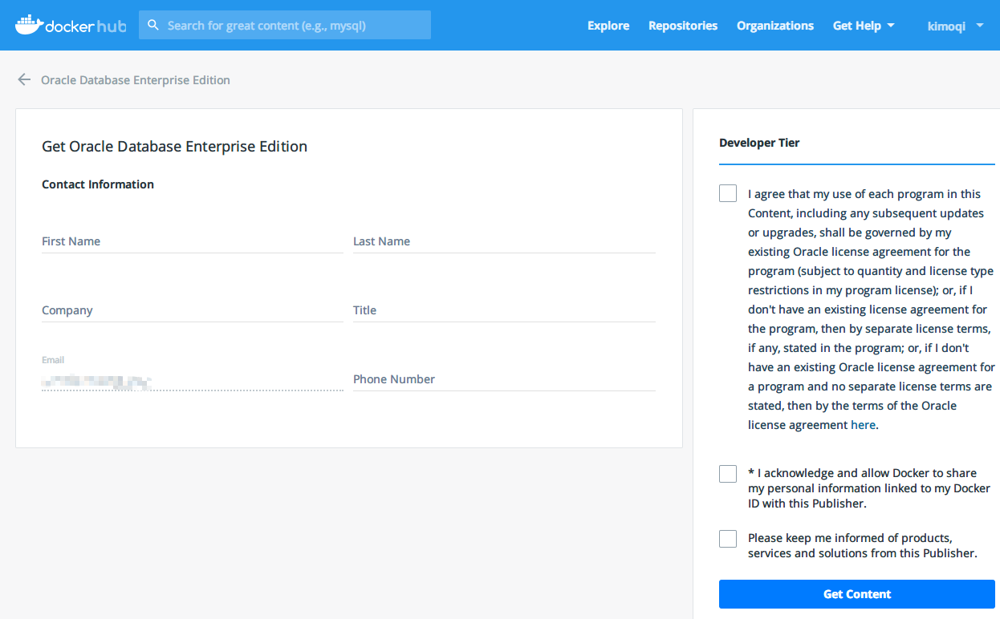

# 秒级搭建各类数据库测试环境
## 背景
试想一下这种情况，你负责的某个项目数据源有SQL Server、Oracle和MySQL，假设现在不让你访问生产库，也没有测试库给你用，你就只有一台开发电脑，要你做开发你怎么做？

你肯定会说，这问题还不简单吗？在开发电脑上安装这些数据库不就行了？答案是可以，但是偏题了嘛，你要在一台电脑上同时装SQL Server、Oracle和MySQL，能做到秒级？起码得废半天劲儿吧

话说n年前我也遇到过这种需求，必须得在我那破笔记本上装个SQL Server，装完占用硬盘10G多，用了一上午才装完，都不用干活儿了，等就完事，卸载还可能卸载不干净

我们的核心需求是搭建个测试环境，或者临时用一下，就不用过多优化，一个字，快就完事了，那么有秒级搭建的方法么？

有，下面docker上场，docker是什么就不用过多介绍了，以前写了很多篇文章介绍，注意，docker是全平台支持的，但是如果是在非Linux环境下，我建议先装个Linux虚拟机，然后在虚拟机里面装docker，这么做的原因是非Linux环境下发行的docker desktop其实也是自己内置了一个Linux虚拟机，一个手动挡，一个自动挡的区别，我建议你用自动挡，这样更清楚原理一些

如果你还没有安装docker，先装一个吧，我以前写过一篇全平台安装docker的文章【史上最全（全平台）docker安装方法！】，可以作为参考

- Windows：https://docs.docker.com/docker-for-windows/install/
- Mac OS：https://docs.docker.com/docker-for-mac/install/
- Linux：https://docs.docker.com/engine/install/

在docker下搭建至少有两个好处

- 快速启动
- 资源隔离

## SQLServer

dockerhub参考：https://hub.docker.com/_/microsoft-mssql-server

这是微软官方出品的基于Ubuntu的SQL Server docker镜像，看下最新版镜像大小（2021-04-30），1.49G，真香

```properties
mcr.microsoft.com/mssql/server   latest              62c72d863950        3 weeks ago         1.49GB
```

秒级启动命令：

```bash
# 启动SQL Server，如果是Docker Desktop要把单引号改成双引号
docker run -e 'ACCEPT_EULA=Y' -e 'SA_PASSWORD=yourStrong(!)Password' -e 'MSSQL_PID=Developer' -p 1433:1433 -d --name MSSQL_1433 mcr.microsoft.com/mssql/server

# 进入容器内
docker exec -it MSSQL_1433 /opt/mssql-tools/bin/sqlcmd -S localhost -U sa -P yourStrong(!)Password

# 创建数据库
CREATE DATABASE testDB
go
```

然后就可以用下面这套参数连接数据库了

```properties
主机：127.0.0.1
端口：1433
数据库：testDB
用户名：sa
密码：yourStrong(!)Password
```

下面是环境变量的解释

- `ACCEPT_EULA`：全称Accept End-User Licensing Agreement，接收最终用户许可证协议，必须得接收嘛，不然微软不给你用
- `SA_PASSWORD`：全称System Administrator Password，系统管理员密码，密码必须是8位以上的大小写字母和数字/特殊符号的组合。
- `MSSQL_PID`：全称Microsoft SQL Server Product Id，SQL Server的产品ID，默认是`Developer`

产品ID还可以是以下这些值

- Developer : 默认值，以开发版运行
- Express : 以学习版运行
- Standard : 以标准版运行
- Enterprise : 以企业版运行
- EnterpriseCore : 以企业核心版运行

完整的环境变量可以参考此处：https://docs.microsoft.com/en-us/sql/linux/sql-server-linux-configure-environment-variables?view=sql-server-2017


## Oracle

Oracle数据库有Express Edition（精简版，简称xe）和Enterprise Edition（企业版，简称ee），xe版本我没找到任何官方的镜像，ee倒是有Oracle官方镜像，但是要使用的话必须填下面这玩意儿，emmmm，还是算了吧，这一点也不符合我们的题意：**秒级**



搜索大法好，找个评分高的镜像

```bash
docker search Oracle
NAME                            STARS
oraclelinux                     756  
jaspeen/oracle-11g              172  
oracleinanutshell/oracle-xe-11g 155
wnameless/oracle-xe-11g-r2      59
absolutapps/oracle-12c-ee       48
```

通过搜索发现`jaspeen/oracle-11g` 和`oracleinanutshell/oracle-xe-11g`评分高，前者我看过了比较繁琐，也不符合我们的题意，那就`oracleinanutshell/oracle-xe-11g`吧

dockerhub参考：https://hub.docker.com/r/oracleinanutshell/oracle-xe-11g

看下下载的镜像有多大，2.13G，体积还是挺大的

```properties
oracleinanutshell/oracle-xe-11g   latest              ad13c30ec346        2 years ago         2.13GB
```

秒级启动命令：

```bash
# 启动Oracle 11g xe，如果是Docker Desktop要把单引号改成双引号
# ORACLE_ALLOW_REMOTE表示允许远程连接
docker run -d --name ORACLE_1521 -p 1521:1521 -e 'ORACLE_ALLOW_REMOTE=true' oracleinanutshell/oracle-xe-11g
```

然后就可以用下面这套参数连接数据库了

```properties
主机：127.0.0.1
端口：1521
sid：xe
用户名：system
密码：oracle
```

当然，一般而言不能用system账号连数据库，下面是创建账号一把梭流程

```sql
-- 创建用户myuser，密码password
create user myuser identified by password; 
-- 分配表空间权限
grant create table,unlimited tablespace to myuser;
-- 分配查询权限
grant select any table to myuser;
-- 分配增删改权限
grant update any table,drop any table,insert any table to myuser;
-- 分配创建session权限（登陆）
grant create session to myuser;
```


## MySQL

MySQL就好说多了，官方镜像一堆一堆的，任君挑选，5.X和8.X都有

dockerhub参考：https://hub.docker.com/_/mysql

看下下载的镜像有多大，447M和556M，不大不小

```properties
mysql                             5.7.34              87eca374c0ed        10 days ago         447MB
mysql                             8.0.24              0627ec6901db        10 days ago         556MB
```

秒级启动命令：

```bash
# 启动MySQL 5，如果是Docker Desktop要把单引号改成双引号
docker run --name MYSQL_3306 -p 3306:3306 -e 'MYSQL_ROOT_PASSWORD=my-secret-pw' -d mysql:5.7.34
```

如果需要MySQL 8.X，直接改tag就可以了

```bash
# 启动MySQL 8，如果是Docker Desktop要把单引号改成双引号
docker run --name MYSQL_3306 -p 3306:3306 -e 'MYSQL_ROOT_PASSWORD=my-secret-pw' -d mysql:8.0.24
```

然后就可以用下面这套参数连接数据库了

```properties
主机：127.0.0.1
端口：3306
数据库：(可为空)
用户名：root
密码：my-secret-pw
```

## PostgreSQL

dockerhub参考：https://hub.docker.com/_/postgres

秒级启动命令：

```bash
# 启动PostgreSQL，如果是Docker Desktop要把单引号改成双引号
docker run --name POSTGRES_5432 -p 5432:5432 -e 'POSTGRES_PASSWORD=mysecretpassword' -d postgres
```

然后就可以用下面这套参数连接数据库了

```properties
主机：127.0.0.1
端口：5432
数据库：(可为空)
用户名：postgres
密码：mysecretpassword
```