# 背景

- 随着程序功能的日益复杂，程序的配置日益增多：各种功能的开关、参数的配置、服务器的地址……

- 对程序配置的期望值也越来越高：配置修改后实时生效，灰度发布，分环境、分集群管理配置，完善的权限、审核机制……
- 并且随着采用分布式的开发模式，项目之间的相互引用随着服务的不断增多，相互之间的调用复杂度成指数升高，每次投产或者上线新的项目时苦不堪言，因此需要引用配置中心治理。

在这样的大环境下，传统的通过配置文件、数据库等方式已经越来越无法满足开发人员对配置管理的需求。

## 目前已存在的配置中心

配置中心应运而生，目前配置中心有

- **[spring-cloud-config](https://github.com/spring-cloud/spring-cloud-config)**：spring出品，可以和spring cloud无缝配合
- **[淘宝 diamond](https://github.com/takeseem/diamond)**：已经不维护。
- **[disconf](https://github.com/knightliao/disconf)**：java开发，蚂蚁金服技术专家发起，业界使用广泛。
- **[ctrip apollo](https://github.com/ctripcorp/apollo/)**：Apollo（阿波罗）是携程框架部门研发的开源配置管理中心，具备规范的权限、流程治理等特性。

## 对比

为什么选择Apollo？下面是一个对比表

### 功能

几个配置中心在功能上的对比

| **功能点**       | **优先级** | **spring-cloud-config**     | **ctrip apollo**                 | **disconf**                                               | **备注**                                                     |
| ---------------- | ---------- | --------------------------- | -------------------------------- | --------------------------------------------------------- | ------------------------------------------------------------ |
| 静态配置管理     | 高         | 基于file                    | 支持                             | 支持                                                      |                                                              |
| 动态配置管理     | 高         | 支持                        | 支持                             | 支持                                                      |                                                              |
| 统一管理         | 高         | 无，需要github              | 支持                             | 支持                                                      |                                                              |
| 多环境           | 中         | 无，需要github              | 支持                             | 支持                                                      |                                                              |
| 本地配置缓存     | 高         | 无                          | 支持                             | 支持                                                      |                                                              |
| 配置锁           | 中         | 支持                        | 不支持                           | 不支持                                                    | 不允许动态及远程更新                                         |
| 配置校验         | 中         | 无                          | 无                               | 无                                                        | 如：ip地址校验，配置                                         |
| 配置生效时间     |            | 重启生效，或手动refresh生效 | 实时                             | 实时                                                      | 需要结合热加载管理， springcloudconfig需要 git webhook+rabbitmq 实时生效 |
| 配置更新推送     | 高         | 需要手工触发                | 支持                             | 支持                                                      |                                                              |
| 配置定时拉取     | 高         | 无                          | 支持                             | 配置更新目前依赖事件驱动， client重启或者server端推送操作 |                                                              |
| 用户权限管理     | 中         | 无，需要github              | 支持                             | 支持                                                      | 现阶段可以人工处理                                           |
| 授权、审核、审计 | 中         | 无，需要github              | 支持                             | 无                                                        | 现阶段可以人工处理                                           |
| 配置版本管理     | 高         | Git做版本管理               | 界面上直接提供发布历史和回滚按钮 | 操作记录有落数据库，但无查询接口                          |                                                              |
| 配置合规检测     | 高         | 不支持                      | 支持（但还需完善）               |                                                           |                                                              |
| 实例配置监控     | 高         | 需要结合springadmin         | 支持                             | 支持，可以查看每个配置在哪些机器上加载                    |                                                              |
| 灰度发布         | 中         | 不支持                      | 支持                             | 不支持部分更新                                            | 现阶段可以人工处理                                           |
| 告警通知         | 中         | 不支持                      | 支持，邮件方式告警               | 支持，邮件方式告警                                        |                                                              |
| 依赖关系         | 高         | 不支持                      | 不支持                           | 不支持                                                    | 配置与系统版本的依赖系统运行时的依赖关系                     |

### 兼容性

几个配置中心和其他开发框架的对比

| **功能点**      | **优先级** | **spring-cloud-config** | **ctrip apollo** | **disconf**                 |
| --------------- | ---------- | ----------------------- | ---------------- | --------------------------- |
| SpringBoot支持  | 高         | 原生支持                | 支持             | 与spring boot无相关         |
| SpringCloud支持 | 高         | 原生支持                | 支持             | 与spring cloud无相关        |
| 客户端支持      | 低         | Java                    | Java、.Net       | java                        |
| 业务系统侵入性  | 高         | 侵入性弱                | 侵入性弱         | 侵入性弱，支持注解及xml方式 |
| 依赖组件        | 高         | Eureka                  | Eureka           | zookeeper                   |

### 可用性与易用性

|                  |            |                         |                            |                                   |
| ---------------- | ---------- | ----------------------- | -------------------------- | --------------------------------- |
| **功能点**       | **优先级** | **spring-cloud-config** | **ctrip apollo**           | **disconf**                       |
| 单点故障（SPOF） | 高         | 支持HA部署              | 支持HA部署                 | 支持HA部署，高可用由zookeeper保证 |
| 多数据中心部署   | 高         | 支持                    | 支持                       | 支持                              |
| 配置获取性能     | 高         | unkown                  | unkown（官方说比spring快） |                                   |
| 配置界面         | 中         | 无，需要通过git操作     | 统一界面（ng编写）         | 统一界面                          |

综上，ctrip applo是较好的选择方案，最终选择applo。

- 支持不同环境（开发、测试、生产）、不同集群
- 完善的管理系统，权限管理、发布审核、操作审计
- SpringBoot集成友好 ，较小的迁移成本
- 配置修改实时生效（热发布）
- 版本发布管理

# 设计

搭建之前，我们需要了解一下Apollo的设计思想，不至于搭建的时候像一个无头苍蝇

## 基本概念

既然定位是配置中心，那么直接作用的对象就是应用（Application），应用又可以在几个维度来观察

比如运行环境（Environment），开发、测试和生产不同环境的同一个应用的配置是不一样的

比如机房，或者叫做集群（Cluster），上海机房和北京机房的同一个应用配置也是不同的

比如配置的归类，某些配置是一些共性应用都需要的，可以集中管理起来，这叫做命名空间（Namespace）

说白了这些概念都是对应用的配置做**隔离**或者**复用**！

### 应用

- 这个很好理解，就是实际使用配置的应用，Apollo客户端在运行时需要知道当前应用是谁，从而可以去获取对应的配置
- 每个应用都需要有唯一的身份标识 - appId，我们认为应用身份是跟着代码走的，所以需要在代码中配置，具体信息请参见[Java客户端使用指南](https://github.com/ctripcorp/apollo/wiki/Java客户端使用指南)。

### 环境

- 配置对应的环境，Apollo客户端在运行时需要知道当前应用处于哪个环境，从而可以去获取应用的配置
- 我们认为环境和代码无关，同一份代码部署在不同的环境就应该能够获取到不同环境的配置
- 所以环境默认是通过读取机器上的配置（server.properties中的env属性）指定的，不过为了开发方便，我们也支持运行时通过System Property等指定，具体信息请参见[Java客户端使用指南](https://github.com/ctripcorp/apollo/wiki/Java客户端使用指南)。

### 集群

- 一个应用下不同实例的分组，比如典型的可以按照数据中心分，把上海机房的应用实例分为一个集群，把北京机房的应用实例分为另一个集群。
- 对不同的cluster，同一个配置可以有不一样的值，如zookeeper地址。
- 集群默认是通过读取机器上的配置（server.properties中的idc属性）指定的，不过也支持运行时通过System Property指定，具体信息请参见[Java客户端使用指南](https://github.com/ctripcorp/apollo/wiki/Java客户端使用指南)。

### 命名空间

- 一个应用下不同配置的分组，可以简单地把namespace类比为文件，不同类型的配置存放在不同的文件中，如数据库配置文件，rpc配置文件，应用自身的配置文件等
- 应用可以直接读取到公共组件的配置namespace，如DAL，RPC等
- 应用也可以通过继承公共组件的配置namespace来对公共组件的配置做调整，如DAL的初始数据库连接数

## 架构

### V1

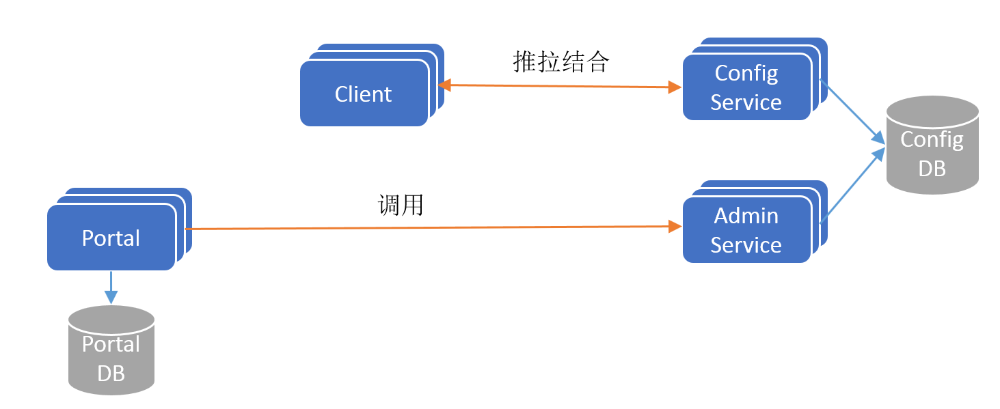

这是最简单的一个架构，Apollo 分为AdminService、Portal、ConfigService与Client

- ConfigService：既然叫配置中心，这个ConfigService就是核心，它和客户端交互，有配置变更就通过长连接把最新的配置推送给客户端，考虑的推送失败的情况，客户端默认每隔5分钟就会去配置中心拉取最新的配置（客户端也可以通过在运行时指定System Property: `apollo.refreshInterval`来覆盖，单位为分钟），这就叫推拉结合，最大程度保证客户端的配置是最新的。
- AdminService：看名字大概能猜到一二，这是服务于管理员的，管理员在界面上操作各种配置，配置就会通过它写到ConfigDB里面，然后ConfigService通过每秒去轮询ConfigDB获取最新的配置推送给客户端，此处是一个典型的消费-生产场景，没有引入消息队列是为了尽量减少外部依赖！
- Portal：统一门户，就是管理员操作的前端界面，PortalDB用于保存Portal的用户权限角色等信息。

### V2

V1版架构有一个问题，假设ConfigService挂了，那么客户端的配置就得不到更新，这个问题可以通过部署多个无状态的ConfigService来解决，但是引入了多个ConfigService服务发现就成为了一个新问题，客户端怎么才能知道当前有哪些ConfigService，它们的IP是多少？所以引入了注册中心Eureka！这样客户端就可以去Eureka获取服务列表！

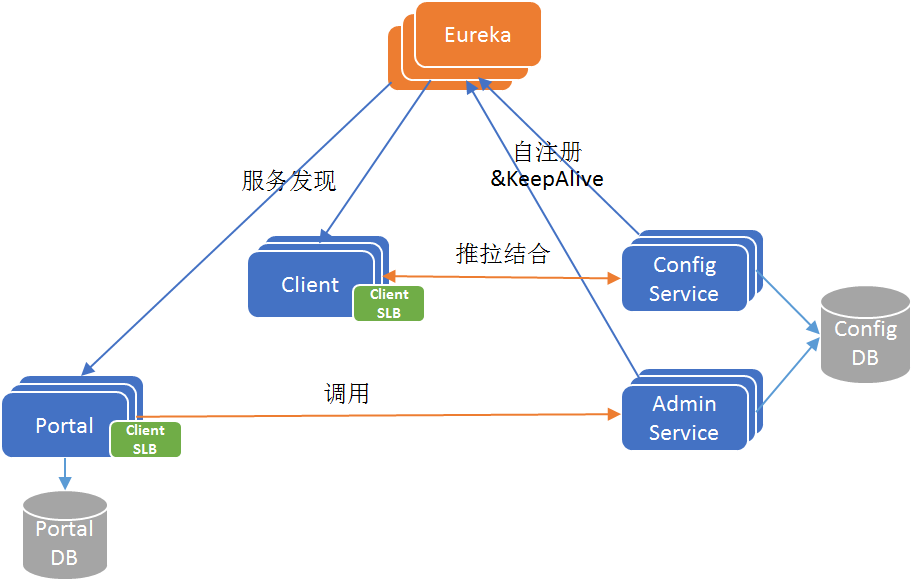

为啥选择Eureka？作者给了回答

> 为什么我们采用Eureka作为服务注册中心，而不是使用传统的zk、etcd呢？我大致总结了一下，有以下几方面的原因：
>
> - 它提供了完整的Service Registry和Service Discovery实现
>   - 首先是提供了完整的实现，并且也经受住了Netflix自己的生产环境考验，相对使用起来会比较省心。
> - 和Spring Cloud无缝集成
>   - 我们的项目本身就使用了Spring Cloud和Spring Boot，同时Spring Cloud还有一套非常完善的开源代码来整合Eureka，所以使用起来非常方便。
>   - 另外，Eureka还支持在我们应用自身的容器中启动，也就是说我们的应用启动完之后，既充当了Eureka的角色，同时也是服务的提供者。这样就极大的提高了服务的可用性。
>   - **这一点是我们选择Eureka而不是zk、etcd等的主要原因，为了提高配置中心的可用性和降低部署复杂度，我们需要尽可能地减少外部依赖。**
> - Open Source
>   - 最后一点是开源，由于代码是开源的，所以非常便于我们了解它的实现原理和排查问题。

### V3

V2版引入了一个新问题，Eureka是只支持Java客户端的，那么.NET咋办？因为携程一些服务是.NET的，需要考虑了.NET的接入，所以增加了一个MetaServer的角色屏蔽掉，通过HTTP的方式获取服务列表，还可以增加一个网关用于负载均衡，这样只用访问网关就可以了，如下图


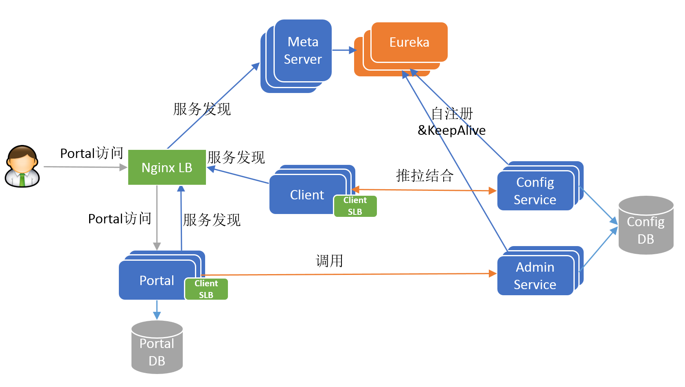

实际上，MetaServer和Eureka在Apollo中都集成在ConfigService中，跑在同一个JVM进程上，端口也是同一个，后面搭建的时候就需要关心到这一点！

# 搭建

采用docker搭建

## 数据库环境(5.6.5+)

```bash
docker run --name apl-mysql -p 3306:3306 -e MYSQL_ROOT_PASSWORD=123456 -d mysql:5.7.24
```

查看下IP，此处是`172.17.0.2`

```bash
docker inspect -f '{{range .NetworkSettings.Networks}}{{.IPAddress}}{{end}}'  apl-mysql
```

以下操作是在容器内操作，登录MySQL，给数据库用户授权下

```sql
grant all privileges on *.* to root@"%" identified by "123456";
```

导入SQL

- ConfigDB：https://github.com/ctripcorp/apollo/blob/master/scripts/sql/apolloconfigdb.sql
- PortalDB：https://github.com/ctripcorp/apollo/blob/master/scripts/sql/apolloportaldb.sql

登录MySQL命令行，用`source`命令导入即可

## Java环境
```bash
docker run -dit  --name apl-java --privileged centos /usr/sbin/init
```

查看下IP，此处是`172.17.0.3`

```bash
docker inspect -f '{{range .NetworkSettings.Networks}}{{.IPAddress}}{{end}}'  apl-java
```

以下是在容器内操作，安装常用软件工具

```bash
yum install -y wget unzip 
```

安装java环境

```bash
yum -y install java-1.8.0-openjdk java-1.8.0-openjdk-devel which
cat > /etc/profile.d/java8.sh <<EOF
export JAVA_HOME=$(dirname $(dirname $(readlink $(readlink $(which javac)))))
export PATH=\$PATH:\$JAVA_HOME/bin
export CLASSPATH=.:\$JAVA_HOME/jre/lib:\$JAVA_HOME/lib:\$JAVA_HOME/lib/tools.jar
EOF
source /etc/profile.d/java8.sh
```

去github发布页下载包：https://github.com/ctripcorp/apollo/releases，当前最新版本是1.8.1，我们需要的文件为

- AdminService：[apollo-adminservice-1.8.1-github.zip](https://github.com/ctripcorp/apollo/releases/download/v1.8.1/apollo-adminservice-1.8.1-github.zip)
- ConfigService：[apollo-configservice-1.8.1-github.zip](https://github.com/ctripcorp/apollo/releases/download/v1.8.1/apollo-configservice-1.8.1-github.zip)
- Portal：[apollo-portal-1.8.1-github.zip](https://github.com/ctripcorp/apollo/releases/download/v1.8.1/apollo-portal-1.8.1-github.zip)

下载好解压到你喜欢的文件夹即可，然后开始配置数据库

### 配置ConfigService

- 配置数据库

```bash
vi config/application-github.properties
```

注意要把SSL关闭，否则可能连不上MySQL

```properties
spring.datasource.url = jdbc:mysql://172.17.0.2:3306/ApolloConfigDB?characterEncoding=utf8&useSSL=false
spring.datasource.username = root
spring.datasource.password = 123456
```

- 启动

启动ConfigService，执行命令脚本，主要要在解压后的当前目录下，其他几个也是

```bash
./scripts/startup.sh
```

启动日志文件在：` /opt/logs/100003171/apollo-configservice.log`，中间的数字可能不一样，以实际为准

启动成功后默认跑在8080端口，打开浏览器看一下是否能访问注册中心

提示：

由于是在容器里面，容器的端口不一定能被外部访问到，可以添加iptables DNAT规则

```bash
iptables -t nat -A DOCKER -p tcp --dport 8080 -j DNAT --to-destination 172.17.0.3:8080
```

这句话的意思就是把172.17.0.3:8080端口和宿主机的8080端口映射起来，这样在外部才能访问，需要删除此条规则可以将`-A`换成`-D`即可

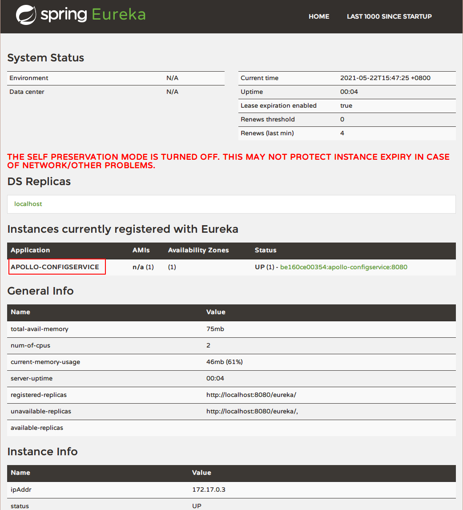

可以看到ConfigService已经注册好了

### 配置AdminService

- 配置数据库，和ConfigService配置文件一致

```bash
vi config/application-github.properties
```

- 启动

启动AdminService，执行命令脚本，主要要在解压后的当前目录下，其他几个也是

```bash
./scripts/startup.sh
```

启动成功后默认跑在8090端口，可以在Eureka看到

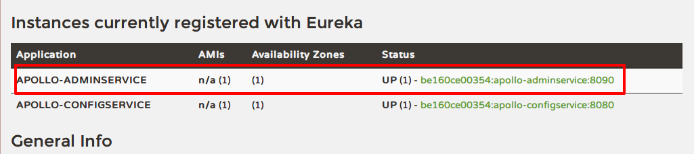

### 配置Portal

- 配置数据库，和ConfigService配置文件一致

```bash
vi config/application-github.properties
```

#### 配置环境

注意，Portal需要配置环境，文件位置在：`config/apollo-env.properties`，我们就配个开发环境，指向Eureka（上面解释过ConfigService和Eureka在一个JVM进程上），其他注释掉即可

```properties
#local.meta=http://localhost:8080
dev.meta=http://172.17.0.3:8080
#fat.meta=http://fill-in-fat-meta-server:8080
#uat.meta=http://fill-in-uat-meta-server:8080
#lpt.meta=${lpt_meta}
#pro.meta=http://fill-in-pro-meta-server:8080

```

这里解释下这个环境是什么意思，一个Portal可以管理多套环境，此处我们设置`dev.meta`标识这是开发环境。

环境的标识通过以下几种方式（针对客户端而言）

> Environment可以通过以下3种方式的任意一个配置：
>
> 1. 通过Java System Property
>
>    - 可以通过Java的System Property `env`来指定环境
>
>    - 在Java程序启动脚本中，可以指定
>
>      ```
>      -Denv=YOUR-ENVIRONMENT
>      ```
>
>      - 如果是运行jar文件，需要注意格式是`java -Denv=YOUR-ENVIRONMENT -jar xxx.jar`
>
>    - 注意key为全小写
>
> 2. 通过操作系统的System Environment
>
>    - 还可以通过操作系统的System Environment `ENV`来指定
>    - 注意key为全大写
>
> 3. 通过配置文件
>
>    - 最后一个推荐的方式是通过配置文件来指定`env=YOUR-ENVIRONMENT`
>    - 对于Mac/Linux，文件位置为`/opt/settings/server.properties`
>    - 对于Windows，文件位置为`C:\opt\settings\server.properties`
>
> 文件内容形如：
>
> ```
> env=DEV
> ```
>
> 目前，`env`支持以下几个值（大小写不敏感）：
>
> - DEV
>   - Development environment
> - FAT
>   - Feature Acceptance Test environment
> - UAT
>   - User Acceptance Test environment
> - PRO
>   - Production environment


#### 启动

启动AdminService，执行命令脚本，主要要在解压后的当前目录下，其他几个也是

```bash
./scripts/startup.sh
```

启动成功后默认跑在8070端口，同样访问不了指定下DNAT规则

```bash
iptables -t nat -A DOCKER -p tcp --dport 8070 -j DNAT --to-destination 172.17.0.3:8070
```

访问http://{虚拟机IP}:8070，默认登录用户名为apollo，密码为admin

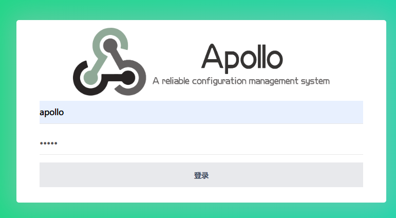

## 客户端准备

此处以Java客户端为例，需要引入Apollo Client依赖（以Maven构建）

```xml
<dependency>
    <groupId>com.ctrip.framework.apollo</groupId>
    <artifactId>apollo-client</artifactId>
    <version>1.1.0</version>
</dependency>`
```

- 指定`app.id`，这是这个应用的唯一标识，不可重复
- 指定`apollo.meta`，指定获取元数据的地方，此处即为MetaServer：http://172.17.0.3:8080

这两个指定的配置文件为`/META-INF/app.properties`

一个最简单的Apollo客户端如下

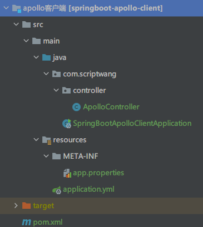

文末有代码清单

## 测试

### 部署项目

将项目打包并执行，注意设置环境为DEV

```bash
mkdir -p /opt/settings/
echo 'env=DEV' > /opt/settings/server.properties
```

然后访问一下

```bash
curl 'http://127.0.0.1:9000/apollo/getConfig'
```

值默认为default，下面我们通过Apollo，看这个值会不会动态改变

### 新增一个应用

登录Portal，新增一个应用，注意AppId要和配置的一样

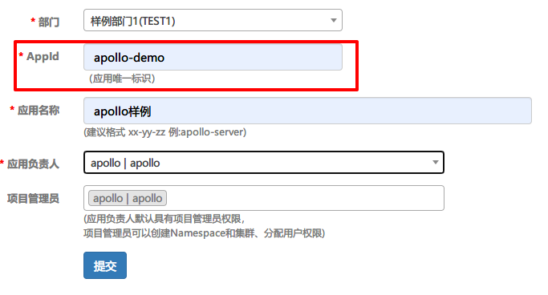

点击提交后，进入刚才新建的应用，有一个默认的application的命名空间，然后点击右边新增配置，新增一个

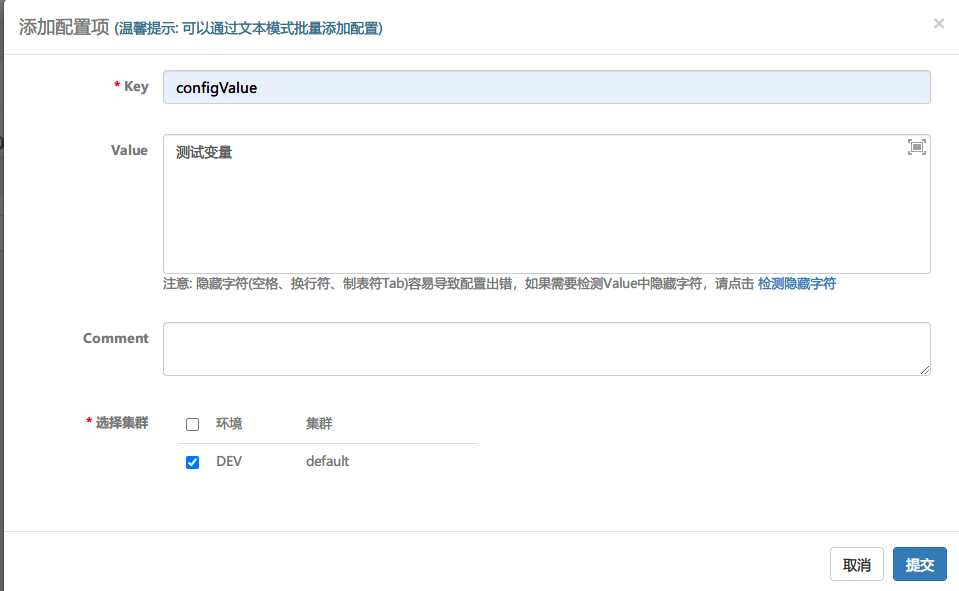

点击提交后再点击发布

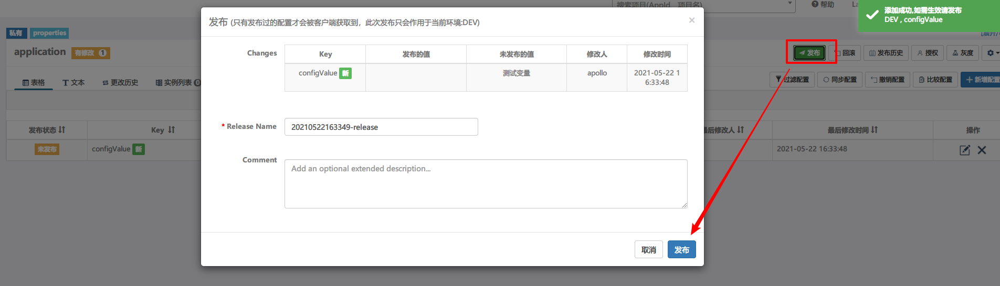

再访问一下

```bash
curl 'http://127.0.0.1:9000/apollo/getConfig'
```

如果返回的是`测试变量`说明动态更改成功！

再看看SpringBoot的日志

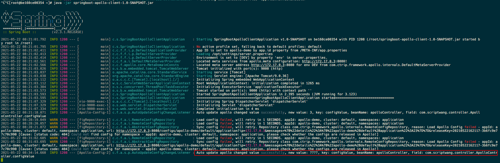

也打印出了相关提示

## 代码清单

#### ApolloController

```java
@RestController
public class ApolloController {
    //冒号后面的是默认值
    @Value("${configValue:default}")
    private String configValue;

    @RequestMapping("/apollo/getConfig")
    public String getConfig() {
        return configValue;
    }
}

```

#### SpringBootApolloClientApplication

```java
@SpringBootApplication
//开启apollo配置
@EnableApolloConfig
public class SpringBootApolloClientApplication {

    private static Logger logger = LoggerFactory.getLogger(SpringBootApolloClientApplication.class);

    public static void main(String[] args) {
        SpringApplication.run(SpringBootApolloClientApplication.class, args);
        logger.info("=============================="+ SpringBootApolloClientApplication.class.getSimpleName()+" started==============================");
    }

}
```

#### app.properties

```properties
# 应用的唯一标识，后面创建工程需要用到
app.id=apollo-demo
apollo.meta=http://172.17.0.3:8080
```

#### application.yml

```yml
server:
  port: 9000

spring:
  application:
    name: springboot-apollo-client

```

#### pom.xml

````xml
<?xml version="1.0" encoding="UTF-8"?>
<project xmlns="http://maven.apache.org/POM/4.0.0"
         xmlns:xsi="http://www.w3.org/2001/XMLSchema-instance"
         xsi:schemaLocation="http://maven.apache.org/POM/4.0.0 http://maven.apache.org/xsd/maven-4.0.0.xsd">
    <modelVersion>4.0.0</modelVersion>

    <groupId>com.scriptwang</groupId>
    <artifactId>springboot-apollo-client</artifactId>
    <version>1.0-SNAPSHOT</version>


    <!--spring boot parent 最小依赖(parent)-->
    <parent>
        <groupId>org.springframework.boot</groupId>
        <artifactId>spring-boot-starter-parent</artifactId>
        <version>2.3.1.RELEASE</version>
    </parent>

    <dependencies>
        <!--最小依赖(Spring MVC Tomcat等)-->
        <dependency>
            <groupId>org.springframework.boot</groupId>
            <artifactId>spring-boot-starter-web</artifactId>
        </dependency>

        <dependency>
            <groupId>com.ctrip.framework.apollo</groupId>
            <artifactId>apollo-client</artifactId>
            <version>1.1.0</version>
        </dependency>

    </dependencies>

    <build>
        <plugins>
            <plugin>
                <groupId>org.springframework.boot</groupId>
                <artifactId>spring-boot-maven-plugin</artifactId>
            </plugin>
        </plugins>
    </build>


</project>
````

# 参考

- https://www.cnblogs.com/xiaoqi/p/configserver-compair.html

- https://www.bookstack.cn/read/apollo-1.7-zh/cc8342e164e6c09c.md

- https://cloud.tencent.com/developer/article/1063232

- https://nobodyiam.com/2016/07/09/introduction-to-apollo/

- https://www.infoq.cn/article/ctrip-apollo-configuration-center-architecture

