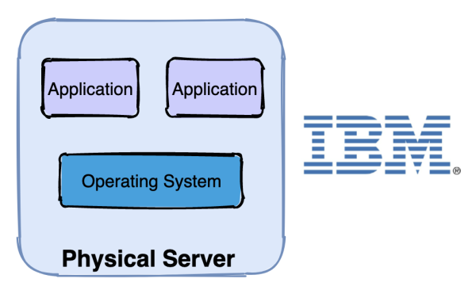

# K8S原理架构与实战（基础篇）

## 背景

### 容器时代的到来

在介绍K8S之前，先来看看服务器的演变过程：物理机时代、虚拟机时代、容器化时代

**物理机时代**的缺点：

- **部署慢** ：每台服务器都要安装操作系统、相关的应用程序所需要的环境，各种配置

- **成本高**：物理服务器的价格十分昂贵

- **资源浪费**：硬件资源不能充分利用

- **扩展和迁移成本高**：扩展和迁移需要重新配置一模一样的环境




**虚拟机时代**很好的解决了物理机时代的缺点，虚拟机时代的特点是：

- **易部署**：每台物理机可部署多台虚拟机，且可以通过模板，部署快，成本低
- **资源池**：开出来的虚拟机可作为资源池备用，充分压榨服务器性能
- **资源隔离**：每个虚拟机都有独立分配的内存磁盘等硬件资源，虚拟机之间不会互相影响
- **易扩展**：随时都能在一个物理机上创建或销毁虚拟机

虚拟机的缺点是：每台虚拟机都需要安装操作系统


**容器化时代**解决了虚拟机时代的缺点，容器化时代在继承了虚拟机时代优点的基础之上，还有以下优势

- **更高效的利用硬件资源**：所有容器共享主机操作系统内核，不需要安装操作系统。
- **一致的运行环境**：相同的镜像产生相同的行为
- **更小**：较虚拟机而言，容器镜像更小，因为不需要打包操作系统
- **更快**：容器能达到秒级启动，其本质是主机上的一个进程


### 容器编排的需要

容器技术的代表就是docker，关于docker可以参考之前的文章《都9102年了，还没听过docker？5分钟带你了解docker的前世今生！》，此处不再赘述，docker在单机上使用方便快捷，但在集群中表现如何呢？假设现在有5个节点，每个节点中都装有docker，现在要部署一个应用，要求要10个副本，有如下做法：

- 在5个节点上随机分配
- 平均分配，每台节点分配2个
- 根据不同节点的负载状态分配，负载低的优先分配

无论选择哪种方法都需要执行相同`docker run`命令10遍，如果是最后一种做法还需要挨个检查每个节点的负载，这种问题叫做不利于**自动装箱**

如果以后增加了1个副本还需要再重复上面的动作，如果增加10个呢？增加100个呢？人为去操作那就有点难受了，这种问题叫做不利于水平扩容与缩容，简称**水平扩缩**

如果现在要变更版本，更新或者回滚，需要停止容器，然后替换新版本镜像，再启动，这样的操作每个副本都要来一次，如果副本太多，简直是噩梦，这种问题叫做不利于**自动化上线和回滚**

如果现在一个容器停止运行了，docker的重启策略会将它拉起来继续运行，这没什么问题，如果节点宕机了呢？上面的所有容器都停止了，docker重启策略就没用了，这样副本的数量就会减少，这个问题叫做不能**自我修复**

假设需要负载均衡，那么得新增一个节点安装负载均衡器，并且配置5个节点的IP和端口，前提是容器的端口要映射到主机端口，而且容器之前网络是隔离的，不能相互访问，维护成本高，这个问题叫不利于**服务发现与负载均衡**

上面的这些操作，就是容器编排，既然存在如上问题，那么就需要一个技术进行自动化编排，这个技术就是K8S，K8S即**kubernetes**   /kjubɚ’nɛtɪs/

> [Kubernetes](https://baike.baidu.com/item/kubernetes/22864162?fr=aladdin)，是一个工业级的容器编排平台。Kubernetes 这个单词是希腊语，它的中文翻译是“舵手”或者“飞行员”。在一些常见的资料中也会看到“ks”这个词，也就是“K8s”，它是通过将 8 个字母“ubernete ”替换为“8”而成为的一个缩写。

官网：https://kubernetes.io/zh/

项目Github地址：https://github.com/kubernetes/kubernetes

根据官网描述，它有如下功能

| 功能               | 描述                                                         |
| ------------------ | ------------------------------------------------------------ |
| 自动化上线和回滚   | Kubernetes 会分步骤地将针对应用或其配置的更改上线，同时监视应用程序运行状况以确保你不会同时终止所有实例。如果出现问题，Kubernetes 会为你回滚所作更改。你应该充分利用不断成长的部署方案生态系统。 |
| 服务发现与负载均衡 | 无需修改你的应用程序即可使用陌生的服务发现机制。Kubernetes 为容器提供了自己的 IP 地址和一个 DNS 名称，并且可以在它们之间实现负载均衡。 |
| 存储编排           | 自动挂载所选存储系统，包括本地存储、诸如 GCP 或 AWS 之类公有云提供商所提供的存储或者诸如 NFS、iSCSI、Gluster、Ceph、Cinder 或 Flocker 这类网络存储系统。 |
| Secret 和配置管理  | 部署和更新 Secrets 和应用程序的配置而不必重新构建容器镜像，且 不必将软件堆栈配置中的秘密信息暴露出来。 |
| 自动装箱           | 根据资源需求和其他约束自动放置容器，同时避免影响可用性。将关键性工作负载和尽力而为性质的服务工作负载进行混合放置，以提高资源利用率并节省更多资源。 |
| 批量执行           | 除了服务之外，Kubernetes 还可以管理你的批处理和 CI 工作负载，在期望时替换掉失效的容器。 |
| IPv4/IPv6 双协议栈 | 为 Pod 和 Service 分配 IPv4 和 IPv6 地址                     |
| 水平扩缩           | 使用一个简单的命令、一个 UI 或基于 CPU 使用情况自动对应用程序进行扩缩。 |
| 自我修复           | 重新启动失败的容器，在节点死亡时替换并重新调度容器，杀死不响应用户定义的健康检查的容器，并且在它们准备好服务之前不会将它们公布给客户端。 |
| 为扩展性设计       | 无需更改上游源码即可扩展你的 Kubernetes 集群。               |

### 为什么是K8S

当然容器编排不止有K8S，还有Docker Swarm、Apache Mesos、AWS ECS，下面是几个平台简单的比较：

|                      | Swarm                    | Kubernetes                                             | Mesos                  | ECS                            |
| -------------------- | ------------------------ | ------------------------------------------------------ | ---------------------- | ------------------------------ |
| 基本功能             | Docker原生的集群管理工具 | 开源的容器集群工具，提供应用级别的部署，维护和扩张功能 | 基于数据中心的操作系统 | 基于云的高可用，高扩展容器集群 |
| 高层次抽象           | 无                       | Pod Job Service                                        | 无                     | Task Service                   |
| 应用扩展性           | 无                       | 支持                                                   | Framework 支持         | 支持                           |
| 应用高可用性         | 无                       | 支持                                                   | Framework 支持         | 支持                           |
| 集群协调和服务发现   | etcd ZooKeeper Consul    | etcd                                                   | ZooKeeper              | ／                             |
| 调度策略（Schedule） | 内置，可扩展             | 内置                                                   | 两级别，可扩展         | 可扩展                         |
| 监控                 | Logging Driver           | Heapter，ELK Addon                                     | 内置                   | CloudWatch                     |
| 用户界面             | CLI API UCP UI           | CLI API UI                                             | API UI                 | CLI API AWS Console            |
| 开发语言             | Go                       | Go                                                     | Java                   | NA                             |
| 开源                 | 是                       | 是                                                     | 是                     | 否                             |
| 最大支持管理节点数   | 官方1000 非官方5000      | 官方1000 非官方2000                                    | 10000                  | ／                             |

那为什么是K8S，主要基于以下几点：

- Google、RedHat等开源基础设施公司共同发起了CNCF基金会，以Kubernetes为基础，建立一个由开源基础设施领域厂商主导、按照独立基金会方式运营的平台社区，来对抗以Docker公司为核心的容器商业生态
- Kubernetes脱胎于Google内部久负盛名的大规模集群管理系统Borg，是Google在容器化基础设施领域十余年实践经验的沉淀和升华

- Kubernetes采用了非常优雅的软件工程设计和开源开放的态度，使得用户可以根据自己的使用场景、通过灵活插拔的方式，采用自定义的网络、存储、调度、监控、日志等模块

## 架构

在K8S中，由Master控制节点和Worker节点共同构成一个集群，如下图所示：


### Master节点


- etcd：分布式KV数据库，使用Raft协议，用于保存集群中的相关数据，项目地址：https://github.com/etcd-io/etcd
- API Server：集群统一入口，以restful风格进行操作，同时交给etcd存储（是唯一能访问etcd的组件）；提供认证、授权、访问控制、API注册和发现等机制，可以通过kubectl命令行工具，dashboard可视化面板，或者sdk等访问
- Scheduler：节点的调度，选择node节点应用部署
- Controller Manager：处理集群中常规后台任务，一个资源对应一个控制器，同时监控集群的状态，确保实际状态和最终状态一致

### Worker节点


- kubelet：相当于Master派到node节点代表，管理本机容器，上报数据给API Server
- Container Runtime：容器运行时，K8S支持多个容器运行环境：Docker、Containerd、CRI-O、Rktlet以及任何实现Kubernetes CRI (容器运行环境接口) 的软件

- kube-proxy：实现服务（Service）抽象组件，屏蔽PodIP的变化和负载均衡

### 流程样例


1. 通过kubectl命令行工具向API Server发送一个请求：创建ReplicaSet，API Server会将此请求存储在etcd中
2. Controller Manager会接受到一个通知
3. Controller Manager发现现在的集群状态和预期的状态不一致，因此需要创建Pod，此信息会通知到Scheduler
4. Scheduler会选择空闲的Worker节点，然后通过API Server更新Pod的定义
5. API Server会通知到Worker节点的上的kubelet
6. kubelet指示当前节点上的Container Runtime运行对应的容器
7. Container Runtime下载镜像并启动容器

### 总体架构


### 核心概念

#### Pod

- Pod是最小调度单元
- Pod里面会包含一个或多个容器（Container）
- Pod内的容器共享存储及网络，可通过localhost通信


Pod本意是豌豆荚的意思，此处指的是K8S中资源调度的最小单位，豌豆荚里面的小豆子就像是Container，豌豆荚本身就像是一个Pod


#### Deployment

Deployment 是在 Pod 这个抽象上更为上层的一个抽象，它可以定义一组 Pod 的副本数目、以及这个 Pod 的版本。一般大家用 Deployment 这个抽象来做应用的真正的管理，而 Pod 是组成 Deployment 最小的单元

- 定义一组Pod的副本数量，版本等
- 通过控制器维护Pod的数目
- 自动恢复失败的Pod
- 通过控制器以指定的策略控制版本


#### Service

Pod是不稳定的，IP是会变化的，所以需要一层抽象来屏蔽这种变化，这层抽象叫做Service

- 提供访问一个或者多个Pod实例稳定的访问地址
- 支持多种访问方式
  - ClusterIP（对集群内部访问）
  - NodePort（对集群外部访问）
  - LoadBalancer（集群外部负载均衡）


#### Volume

Volume就是存储卷，在Pod中可以声明卷来问访问文件系统，同时Volume也是一个抽象层，其具体的后端存储可以是本地存储、NFS网络存储、云存储（阿里云盘、AWS云盘、Google云盘等）、分布式存储（比如说像 ceph、GlusterFS ）

- 声明在Pod中容器可以访问的文件系统
- 可以被挂载在Pod中一个或多个容器的指定路径下
- 支持多种后端储存


#### Namespace

Namespace（命令空间）是用来做资源的逻辑隔离的，比如上面的Pod、Deployment、Service都属于资源，不同Namespace下资源可以重名。同一Namespace下资源名需唯一

- 一个集群内部的逻辑隔离机制（鉴权、资源等）
- 每个资源都属于一个Namespace
- 同一个Namespace中资源命名唯一
- 不同Namespace中资源可重名


## 实战

### 安装

具体的安装教程可以参考：https://kuboard.cn/install/install-k8s.html，里面写的很详细了，此处不再赘述，简化过程如下

1. 创建虚拟机，2个或者2个以上
2. 操作系统为 CentOS 7.8 或者 CentOS Stream 8
3. 每个节点CPU 内核数量大于等于 2，且内存大于等于 4G（实测2G也可以）
4. 修改网络配置文件：`/etc/sysconfig/network-scripts/ifcfg-ens33` 改成固定IP
5. [安装containerd/kubelet/kubeadm/kubectl](https://kuboard.cn/install/install-k8s.html#安装containerd-kubelet-kubeadm-kubectl)，注意教程中使用的容器运行时为containerd，如果需要使用docker，可以先安装docker然后跳过脚本中安装containerd的部分
6. [初始化-master-节点](https://kuboard.cn/install/install-k8s.html#初始化-master-节点)
7. [初始化-worker节点](https://kuboard.cn/install/install-k8s.html#初始化-worker节点)
8. 验证：在Master节点上执行`kubectl get nodes -o wide`，能看到添加的worker节点即安装成功

我的环境情况如下

```properties
NAME        STATUS   ROLES                  AGE   VERSION   INTERNAL-IP       
my-master   Ready    control-plane,master   27h   v1.21.0   192.168.108.101
my-node     Ready    <none>                 27h   v1.21.0   192.168.108.102
```

`192.168.108.101`是Master角色，名字为my-master；`192.168.108.102`是Worker角色，名字为my-node

### kubectl命令行工具

>  kubectl controls the Kubernetes cluster manager.

意为K8S集群管理的控制器，`kubectl --help`可以打印帮助命令，下面列举了一部分，比如`kubectl create`表示从标准输入或者文件创建一个资源

```properties
asic Commands (Beginner):
  create        Create a resource from a file or from stdin.
  expose        Take a replication controller, service, deployment or pod and expose it...
  run           Run a particular image on the cluster
  set           Set specific features on objects

Basic Commands (Intermediate):
  explain       Documentation of resources
  get           Display one or many resources
  edit          Edit a resource on the server
  delete        Delete resources by filenames, stdin, resources and names, or by resources and label selector

Deploy Commands:
  rollout       Manage the rollout of a resource
  scale         Set a new size for a Deployment, ReplicaSet or Replication Controller
  autoscale     Auto-scale a Deployment, ReplicaSet, StatefulSet, or ReplicationController

```

`kubectl create --help`还会显示二级帮助菜单

```properties
[root@my-master ~]# kubectl create --help
Create a resource from a file or from stdin.

 JSON and YAML formats are accepted.

Examples:
  # Create a pod using the data in pod.json.
  kubectl create -f ./pod.json

  # Create a pod based on the JSON passed into stdin.
  cat pod.json | kubectl create -f -

```

#### 资源类型

`kubectl api-resources`可以显示K8S支持的资源类型，下面列举了一些常用的资源类型

```properties
NAME                              SHORTNAMES   APIVERSION                             NAMESPACED   KIND
namespaces                        ns           v1                                     false        Namespace
nodes                             no           v1                                     false        Node
persistentvolumeclaims            pvc          v1                                     true         
persistentvolumes                 pv           v1                                     false        PersistentVolume
pods                              po           v1                                     true         Pod
statefulsets                      sts          apps/v1                                true        
services                          svc          v1                                     true         Service
deployments                       deploy       apps/v1                                true         Deployment
```

注意，`SHORTNAMES`表示资源简写，在命令行中可以使用，比如下面两个命令其实是等价的

```bash
kubectl get pods
# 等价于
kubectl get po
```

下面我们来实战K8S的几个核心功能

### 水平扩缩

> 使用一个简单的命令、一个 UI 或基于 CPU 使用情况自动对应用程序进行扩缩。

#### 部署第一个应用

为什么先实战水平扩缩？因为这个最简单，首先来部署一个喜闻乐见的nginx

```bash
kubectl create deployment web --image=nginx:1.14
```

这句话表示创建一个资源，啥资源呢？是一个`deployment`（可以简写为`deploy`），取名叫`web`，指定了镜像为`nginx`的1.14版本，但是先别执行这句话，我们一般不这么部署应用，因为不好复用，一般通过`yaml`文件来部署，如下

```bash
kubectl create deployment web --image=nginx:1.14 --dry-run -o yaml > web.yaml
```

- `--dry-run`表示试运行，试一下看行不行，但是不运行

- `-o yaml`表示以yaml格式输出
- `> web.yaml`表示将输出的内容重定向到`web.yaml`文件中

这句话可以放心执行了，执行之后看看`web.yaml`文件里面有些啥

```yaml
apiVersion: apps/v1        # 表示资源版本号为apps/v1 
kind: Deployment           # 表示这是一个Deployment
metadata:                  # 一些元数据信息
  creationTimestamp: null
  labels:                  # 标签，可以随便定义
    app: web
  name: web                # 这个资源的名字
spec:                      # 资源的描述或者规格
  replicas: 1              # 副本数量
  selector:                # 选择器
    matchLabels:           # 需要匹配的标签
      app: web             # 标签的具体键值对
  strategy: {}
  template:                # 模板。表示Pod的生成规则
    metadata:
      creationTimestamp: null
      labels:
        app: web
    spec:                  
      containers:
      - image: nginx:1.14  #指定镜像文件
        name: nginx
        resources: {}
status: {}
```

用下面的命令应用`web.yaml`，`web.yaml`声明了一个Deployment和一个Pod

```bash
kubectl apply -f web.yaml
```

执行完后以后可以通过以下命令查看Deployment和Pod

```bash
kubectl get deploy,po -o wide
```

结果如下

```properties
NAME                  READY   UP-TO-DATE   AVAILABLE   AGE     CONTAINERS   IMAGES       SELECTOR
deployment.apps/web   1/1     1            1           2m40s   nginx        nginx:1.14   app=web

NAME                       READY   STATUS    RESTARTS   AGE     IP               NODE    ...
pod/web-5bb6fd4c98-lg555   1/1     Running   0          2m40s   10.100.255.120   my-node ...

```

可以看到资源已经建立起来了，运行在Worker节点中，尝试访问一下Pod的IP

```
curl 10.100.255.120
```

有如下nginx的标准返回说明应用已经部署完毕

````html
<!DOCTYPE html>
<html>
<head>
<title>Welcome to nginx!</title>
...
</html>
````

有没有感觉这一路下来挺麻烦的，yaml文件还那么长，还不如无脑`docker run`呢，别急，在后面扩缩容的时候就可以看到它的威力了，当然也可以用最开始的命令来执行`kubectl create deployment web --image=nginx:1.14`，测试可以，在生产环境中强烈不建议这么做。

#### 扩容

假设现在需求来了，需要部署同样的nginx副本10个，该怎么做？在K8S中很简单，直接告诉K8S我要10个副本即可，其他的细节不用关心。

具体的做法是修改上面的web.yaml文件，将`replicas: 1`声明成`replicas: 10`，最后再应用一下

```bash
kubectl apply -f web.yaml
```

此时快速的执行`kubectl get po`，可以看到一些容器已经开始运行了，一些在创建中，一些还在挂起

```properties
NAME                       READY   STATUS              RESTARTS   AGE
pod/web-5bb6fd4c98-52qmf   0/1     ContainerCreating   0          1s
pod/web-5bb6fd4c98-5sp5l   0/1     Pending             0          1s
pod/web-5bb6fd4c98-9t2hm   0/1     ContainerCreating   0          1s
pod/web-5bb6fd4c98-lg555   1/1     Running             0          11m
...
```

稍等片刻可以看到所有Pod都是Running状态了！当然也可以偷懒一键扩容

```bash
kubectl scale deploy web --replicas=10
```

#### 缩容

缩容就不用说了，逆操作即可，最简单一键操作即可

```bash
kubectl scale deploy web --replicas=1
```

执行后，可以看到一些Pod正在终止状态中（Terminating）

```properties
pod/web-5bb6fd4c98-52qmf   0/1     Terminating   0          3m19s
pod/web-5bb6fd4c98-5sp5l   0/1     Terminating   0          3m19s
```

咋样，第一个功能扩缩容是否还满意

### 自动装箱

> 根据资源需求和其他约束自动放置容器，同时避免影响可用性。将关键性工作负载和尽力而为性质的服务工作负载进行混合放置，以提高资源利用率并节省更多资源。

#### 节点污点

Taint 污点：节点不做普通分配调度，是节点属性，属性值有三个

- `NoSchedule`：一定不被调度
- `PreferNoSchedule`：尽量不被调度（也有被调度的几率）
- `NoExecute`：不会调度，并且还会驱逐Node已有Pod

也就是说，给节点打上污点，那么调度的时候就会根据上面的属性来进行调度，一般来说Master节点的污点值是`NoSchedule`，查看Master污点值

```bash
kubectl describe node my-master | grep Taints
```

可以看到如下输出

```properties
Taints:             node-role.kubernetes.io/master:NoSchedule
```

这表明无论如何，Pod都不会被调度到Master节点上，也可以用上面弹性伸缩的列子来证明，无论副本多少个，都是在Worker节点上，现在将Master节点上的污点给去掉，用下面的命令

```bash
kubectl taint node my-master node-role.kubernetes.io/master:NoSchedule-
```

回显如下，说明污点已经去掉

```
node/my-master untainted
```

再来扩容一下，为了大概率调度到Master节点上，可以将副本设置多一点

```bash
kubectl scale deploy web --replicas=20
```

在查看Pod：`kubectl get po -o wide`

```properties
web-5bb6fd4c98-9rrp2   1/1     Running   0          5m19s   10.100.255.108   my-node     <none> ...
web-5bb6fd4c98-fgsfn   1/1     Running   0          5m19s   10.100.0.200     my-master   <none> ...
web-5bb6fd4c98-g7p4w   1/1     Running   0          5m19s   10.100.255.112   my-node     <none> ...

```

可以看到，一部分节点调度到Master上面去了

先缩容，将污点加回去（用下面的命令）再扩容试试看，可以发现新增加的节点都在Worker节点上了

```bash
kubectl taint node my-master node-role.kubernetes.io/master:NoSchedule
```

#### Pod调度策略

Pod调度策略会影响到Pod最终被调度到哪个节点上，Pod调度策略有三类

- Pod声明的`requests`和`limits`，前者就是Pod需要多少资源，后者表示Pod最多用多少资源，资源比如CPU内存等
- 节点标签选择器，会选择符合标签的节点进行调度
- 节点亲和性，分为硬亲和和软亲和，前者必须满足，后者尝试满足，不强制

下面我们分别试下这三种策略

##### requests和limits

还是以最开始的web.yaml为例：

先将之前部署的deploy删掉

```bash
kubectl delete deploy web
```

然后新增`resources`声明

```yaml
apiVersion: apps/v1
kind: Deployment
metadata:
  labels:
    app: web
  name: web
spec: 
  replicas: 1
  selector: 
    matchLabels:
      app: web             
  strategy: {}
  template:                
    metadata:
      labels:
        app: web
    spec:                  
      containers:
      - image: nginx:1.14
        name: nginx
        # 下面是新增的内容
        resources: 
          requests: 
            memory: "3Gi"  # 声明需要3G内存
          limits:
            memory: "4Gi"  # 声明最大4G内存
status: {}
```

最后应用

```bash
kubectl apply -f web.yaml
```

查看Pod，发现Pod一直在挂起状态中

```properties
web-7d87594d99-fmdfd   0/1     Pending   0          3m48s
```

这是为什么？因为我声明的需要3G内存，而我的虚拟机最多就2G内存，所以资源不满足，影响了Pod调度，更多详细内容请参考官方文档：[Pod 和 容器的资源请求和约束](https://kubernetes.io/zh/docs/concepts/configuration/manage-resources-containers/)

##### 节点标签选择器

首先删除deploy：`kubectl delete deploy web`

给master节点打上标签`test123_env=prod`，标签就是键值对，随便起名儿

```bash
kubectl label node my-master test123_env=prod
```

然后在`web.yaml`中新增`nodeSelector`声明

```yaml
apiVersion: apps/v1
kind: Deployment
metadata:
  labels:
    app: web
  name: web
spec: 
  replicas: 10 # 副本改多一点
  selector: 
    matchLabels:
      app: web             
  strategy: {}
  template:                
    metadata:
      labels:
        app: web
    spec:
      containers:
      - image: nginx:1.14
        name: nginx
      # 新增的内容
      nodeSelector:
        test123_env: prod
status: {}
```

最后执行，理论上所有Pod都应该被调度到Master节点上，但是发现所有的Pod都被挂起了，没有被调度

```properties
web-6897865b86-sp6fh   0/1     Pending   0          30s   <none>   <none>   <none>           <none>
web-6897865b86-vkcx2   0/1     Pending   0          30s   <none>   <none>   <none>           <none>
web-6897865b86-wvdk6   0/1     Pending   0          30s   <none>   <none>   <none>           <none>

```

这是什么原因呢？这是污点在作祟，别忘记了，Master节点的污点值默认是`NoSchedule`，不允许被调度的，查看一下Master节点的污点值

```bash
[root@my-master ~]# kubectl describe node my-master | grep Taints
Taints:             node-role.kubernetes.io/master:NoSchedule
```

果然是`NoSchedule`，先去掉污点值

```bash
kubectl taint node my-master node-role.kubernetes.io/master:NoSchedule-
```

机器突然有点卡，这应该是在调度Pod了，查看一下果不其然，节点都被调度到了Master上

```properties
web-6897865b86-sp6fh   1/1     Running   0          4m2s   10.100.0.208   my-master   <none> ...
web-6897865b86-vkcx2   1/1     Running   0          4m2s   10.100.0.209   my-master   <none> ...
web-6897865b86-wvdk6   1/1     Running   0          4m2s   10.100.0.213   my-master   <none> ...
```

这里还可以得出一个结论，在Pod被调度的时候，**节点污点值的优先级是高于节点标签的**！

最后还原现场

```bash
# 删除deploy
kubectl delete deploy web

# 删掉标签
kubectl label node my-master test123_env-

# 恢复污点
kubectl taint node my-master node-role.kubernetes.io/master:NoSchedule
```

##### 节点亲和性

亲和性和节点选择器类似，多了操作符表达式：In、NotIn、Exists、Gt、Lt、DoesNotExists，此处就不再演示了，感兴趣的同学自行尝试一下

```yaml
apiVersion: apps/v1
kind: Deployment
metadata:
  labels:
    app: web
  name: web
spec: 
  replicas: 10 # 副本改多一点
  selector: 
    matchLabels:
      app: web             
  strategy: {}
  template:                
    metadata:
      labels:
        app: web
    spec:
      containers:
      - image: nginx:1.14
        name: nginx
      # 新增的内容
      affinity:
        nodeAffinity:
          requiredDuringSchedulingIgnoredDuringExecution:
            nodeSelectorTerms:
            - matchExpressions:
              - key: test123_env
                operator: In
                values:
                - dev
                - test
          preferreDuringSchedulingIgnoredDuringExecution:
          - weight: 1
            preference:
            - matchExpressions:
              - key: group
                operator: In
                values:
                - ttttest   
status: {}
```

上面的亲和性表示如下含义

- `requiredDuringSchedulingIgnoredDuringExecution`：硬亲和，`test123_env`等于`dev`或者`test`，必须满足
- `preferreDuringSchedulingIgnoredDuringExecution`：软亲和，`group`等于`ttttest`，非必须满足

K8S搞这么多策略有啥用呢？又是节点污点、节点标签、Pod调度策略之类的，目的当然是提供最大的灵活性，最终提高整体资源利用率，这就是自动装箱

### Secret和配置管理

> 部署和更新 Secrets 和应用程序的配置而不必重新构建容器镜像，且 不必将软件堆栈配置中的秘密信息暴露出来。

#### Secret

Secret意为秘密，那在K8S中是啥意思呢？在K8S中表示一个存储在etcd中的配置，这个配置是秘密的，是安全的，通常用Base64编码，此配置可以通过挂载卷或者环境变量的方式供Pod访问，首先定义一个Secret

首先将明文转换成base64编码

```bash

# 首先将明文转换成base64编码
echo -n 'root' | base64   # 结果是cm9vdA==
echo -n '123456' | base64 # 结果是MTIzNDU2
```

通过下面的`secret.yaml`声明创建一个Secret，通过`kubectl get secret`可以查看刚才创建的Secret

```yaml
apiVersion: v1
kind: Secret
metadata:
  name: test-secret
data:
  username: cm9vdA==
  password: MTIzNDU2
```

##### 挂载卷的方式

声明文件如下

```yaml
apiVersion: apps/v1
kind: Deployment
metadata:
  labels:
    app: web
  name: web
spec: 
  replicas: 1
  selector: 
    matchLabels:
      app: web             
  strategy: {}
  template:                
    metadata:
      labels:
        app: web
    spec:                  
      containers:
      - image: nginx:1.14
        name: nginx
        # 挂载到容器内
        volumeMounts:
          - name: secret-volume
            mountPath: /etc/secret-volume
      # 卷声明      
      volumes:
      - name: secret-volume
        secret:
          secretName: test-secret
status: {}
```

创建之后进入容器，下面是进入容器命令，和docker一致，你创建出来的Pod不一定是这个名`web-66d9b4684b-dvwtm`，根据实际情况进入

```bash
kubectl exec -it web-66d9b4684b-dvwtm bash
```

查看一下挂载的内容

```bash
cat /etc/secret-volume/username  # 显示root
cat /etc/secret-volume/password  # 显示123456
```

##### 环境变量的方式

声明文件如下

```yaml
apiVersion: apps/v1
kind: Deployment
metadata:
  labels:
    app: web
  name: web
spec: 
  replicas: 1
  selector: 
    matchLabels:
      app: web             
  strategy: {}
  template:                
    metadata:
      labels:
        app: web
    spec:                  
      containers:
      - image: nginx:1.14
        name: nginx
        # 环境变量声明
        env:
        - name: SECRET_USERNAME
          valueFrom:
            secretKeyRef:
              name: test-secret
              key: username
status: {}
```

执行后再容器内部查看该环境变量是否符合预期值，打印出来的值应该是root，即我们设置的Secret

```bash
kubectl exec -it web-848bb777bc-x5mh4 -- /bin/sh -c 'echo $SECRET_USERNAME'
```

更多细节可以参考官方文档：https://kubernetes.io/zh/docs/tasks/inject-data-application/distribute-credentials-secure/

这里有一个疑问，既然是Base64的编码方式（不是加密方式），为什么说Secret是安全的呢？此处的安全是K8S提供的，主要是以前几点

- 传输安全（K8S中与API Server的交互都是HTTPS的）
- 存储安全（Secret被挂载到容器时存储在tmpfs中，只存在于内存中而不是磁盘中，Pod销毁Secret随之消失）
- 访问安全（Pod间的Secret是隔离的，一个Pod不能访问另一个Pod的Secret）

参考：https://blog.csdn.net/kunyus/article/details/94392696

https://kubernetes.io/zh/docs/tasks/inject-data-application/distribute-credentials-secure/

#### ConfigMap

ConfigMap可以看做是不需要加密，不需要安全属性的Secret，也是和配置相关的，创建ConfigMap的过程如下，首先创建一个配置文件，比如`redis.properties`，包含如下内容

```properties
redis.port=127.0.0.1
redis.port=6379
redis.password=123456
```

以下命令从文件`redis.properties`创建了一个名为`redis-config`的ConfigMap

```bash
kubectl create configmap redis-config --from-file=redis.properties
```

使用命令`kubectl get configmap`可以查看刚才创建的ConfigMap，当然ConfigMap也有挂载卷和设置环境变量的方式供Pod调用，感兴趣的同学自己试一下，此处不再赘述

### 存储编排

> 自动挂载所选存储系统，包括本地存储、诸如 GCP 或 AWS 之类公有云提供商所提供的存储或者诸如 NFS、iSCSI、Gluster、Ceph、Cinder 或 Flocker 这类网络存储系统。

提到存储就不得不说K8S中的PV和PVC了，解释如下

- PV：`PersistentVolume`，持久化卷
- PVC：`PersistentVolumeClaim`，持久化卷声明

PV说白了就是一层存储的抽象，底层的存储可以是本地磁盘，也可以是网络磁盘比如NFS、Ceph之类，既然有了PV那为什么又要搞一个PVC呢？

PVC其实在Pod和PV之前又增加了一层抽象，这样做的目的在于将Pod的存储行为于具体的存储设备解耦，试想一下，假设哪天NFS网络存储的IP地址变化了，如果没有PVC，就需要每个Pod都改一下IP的声明，那得多累，有PVC来屏蔽这些细节之后只用改PV即可！

#### 本地存储

本地存储即对应K8S中的hostPath

##### PV

首先声明一个`PV.yaml`，内容如下，声明的本地存储路径为`/data/hostpath`

```yaml
apiVersion: v1
kind: PersistentVolume
metadata:
  name: my-pv
  labels:
    type: local
spec:
  storageClassName: manual
  capacity:
    storage: 1Gi
  accessModes:
    - ReadWriteMany
  hostPath: # 声明本地存储
    path: /data/hostpath
```

`kubectl apply -f PV.yaml`创建之并通过`kubectl get pv`查看

```bash
kubectl get pv
NAME    CAPACITY   ACCESS MODES   RECLAIM POLICY   STATUS     ...
my-pv   1Gi        RWX            Retain           Available  ...

```

可以看到创建成功，并且状态是Available，说明还没有被PVC绑定，注意声明的hostPath并不是只有Master节点才有，所有的节点都有！

- Capacity（存储能力）：一般来说，一个 PV 对象都要指定一个存储能力，通过 PV 的 `capacity` 属性来设置的，目前只支持存储空间的设置，就是我们这里的 `storage=1Gi`，不过未来可能会加入 `IOPS`、吞吐量等指标的配置。
- AccessModes（访问模式）：用来对 PV 进行访问模式的设置，用于描述用户应用对存储资源的访问权限，访问权限包括下面几种方式：
  - ReadWriteOnce（RWO）：读写权限，但是只能被单个节点挂载
  - ReadOnlyMany（ROX）：只读权限，可以被多个节点挂载
  - ReadWriteMany（RWX）：读写权限，可以被多个节点挂载

##### PVC

再声明一个`PVC.yaml`，内容如下

```yaml
apiVersion: v1
kind: PersistentVolumeClaim
metadata:
  name: my-pvc
spec:
  storageClassName: manual
  accessModes:
  - ReadWriteMany
  resources:
    requests:
      storage: 1Gi
```

`kubectl apply -f PVC.yaml`创建之并通过`kubectl get pv,pvc`查看

```bash
kubectl get pv,pvc
NAME                     CAPACITY   ACCESS MODES   RECLAIM POLICY   STATUS   CLAIM                 
persistentvolume/my-pv   1Gi        RWX            Retain           Bound    default/my-pvc

NAME                           STATUS   VOLUME   CAPACITY   ACCESS MODES
persistentvolumeclaim/my-pvc   Bound    my-pv    1Gi        RWX         

```

可以看到PV的状态变成了Bound，说明PV被PVC绑定了（注意：创建 PVC 之后，Kubernetes 就会去查找满足我们声明要求的 PV，比如 `storageClassName`、`accessModes` 以及容量这些是否满足要求，如果满足要求就会将 PV 和 PVC 绑定在一起，目前 PV 和 PVC 之间是一对一绑定的关系，也就是说一个 PV 只能被一个 PVC 绑定）

最后通过如下`web.yaml`声明创建deploy

```yaml
apiVersion: apps/v1
kind: Deployment
metadata:
  labels:
    app: web
  name: web
spec: 
  replicas: 1
  selector: 
    matchLabels:
      app: web             
  strategy: {}
  template:                
    metadata:
      labels:
        app: web
    spec:                  
      containers:
      - image: nginx:1.14
        name: nginx
        # 挂载到容器内
        volumeMounts:
          - name: wwwroot
            mountPath: /usr/share/nginx/html
      # PVC声明     
      volumes:
      - name: wwwroot
        persistentVolumeClaim:
          claimName: my-pvc
status: {}
```

此声明将Pod内的`/usr/share/nginx/html`绑定到主机的`/data/hostpath`（通过PV声明的），如果此时访问一下nginx会报**403 Forbidden**错误，因为主机内的`/data/hostpath/index.html`并没有，先创建一个（注意：Pod在哪个节点上就在哪个节点上创建）

```bash
# 创建文件夹
mkdir -p /data/hostpath

# 写入index.html
cat > /data/hostpath/index.html <<EOF
Hello World
EOF

```

此时在访问Pod如果出现`Hello World`说明挂载成功！

访问方式如下

```bash
[root@my-master ~]# kubectl get po -o wide
NAME                   READY   STATUS    RESTARTS   AGE   IP            ...
web-77bb65c568-cnpqb   1/1     Running   0          17m   10.100.255.78 ...
[root@my-master ~]# curl 10.100.255.78
Hello World
```

#### NFS网络存储

一般来讲，不会通过本地存储来持久化数据，因为Pod的调度不是固定的，一般会通过网络的方式来存储数据，比如NFS，这里我们新增加一台虚拟机（192.168.108.100）来充当NFS服务器，安装NFS命令如下

```bash
# 安装nfs
yum install -y nfs-utils
# 创建共享目录
mkdir -p /data/nfs
# 配置共享目录
cat >  /etc/exports <<EOF
/data/nfs *(rw,no_root_squash)
EOF
# 启动nfs服务
systemctl start nfs
# 查看服务是否启动成功
ps aux | grep nfs 
```

如果有如下回显，说明启动成功

```
root      109523  0.0  0.0      0     0 ?        S<   08:19   0:00 [nfsd4_callbacks]
root      109529  0.0  0.0      0     0 ?        S    08:19   0:00 [nfsd]
...
```

接下来就是改PV，只需要改动挂载类型即可，如下

- `PV.yaml`

```yaml
apiVersion: v1
kind: PersistentVolume
metadata:
  name: my-pv
  labels:
    type: remote
spec:
  storageClassName: manual
  capacity:
    storage: 1Gi
  accessModes:
    - ReadWriteMany
  nfs: # 声明nfs存储
    path: /data/nfs
    server: 192.168.108.100
```

PVC和web.yaml都不用改，然后应用

```
kubectl apply -f PV.yaml
kubectl apply -f PVC.yaml
kubectl apply -f web.yaml
```

然后在NFS服务器端写入文件

```bash
cat > /data/nfs/index.html <<EOF
Hello World
EOF
```

最后访问一下是否符合预期，访问方式同上面的本地存储

### 服务发现与负载均衡

> 无需修改你的应用程序即可使用陌生的服务发现机制。Kubernetes 为容器提供了自己的 IP 地址和一个 DNS 名称，并且可以在它们之间实现负载均衡。

到目前为止，我们的Pod已经可以实现水平扩缩、自动装箱、配置管理、存储编排了，但是访问还是个大问题，扩容后这么多Pod应该访问哪一个？如果能够自动将流量分配到不同的Pod上（负载均衡）；并且当扩容或者缩容的时候能够动态的将Pod添加或者剔除出负载均衡的范围，简而言之就是服务发现。

那么在K8S中有没有东西可以做到服务发现和负载均衡呢？答案是有，这就是Service（还记得前面提到过的核心概念吗），Service有三种类型：

- ClusterIp：集群内部访问（默认）
- NodePort：集群外部访问（包含了ClusterIp）
- LoadBalancer：对外访问应用使用，公有云

下面我们主要演示第二种，首先应用`web.yaml`创建Pod，副本数量可以多一点

```yaml
apiVersion: apps/v1
kind: Deployment
metadata:
  labels:
    app: web
  name: web
spec: 
  replicas: 5
  selector: 
    matchLabels:
      app: web             
  strategy: {}
  template:                
    metadata:
      labels:
        app: web
    spec:
      containers:
      - image: nginx:1.14
        name: nginx
status: {}
```

每个Pod设置一下显示的内容，这样才能看出负载均衡的效果，根据实际的名字来

```bash
kubectl exec -it web-5bb6fd4c98-5b42z -- bash -c 'echo 1 >  /usr/share/nginx/html/index.html'
kubectl exec -it web-5bb6fd4c98-p78xf -- bash -c 'echo 2 >  /usr/share/nginx/html/index.html'
kubectl exec -it web-5bb6fd4c98-qqlhw -- bash -c 'echo 3 >  /usr/share/nginx/html/index.html'
kubectl exec -it web-5bb6fd4c98-r72xf -- bash -c 'echo 4 >  /usr/share/nginx/html/index.html'
kubectl exec -it web-5bb6fd4c98-stf57 -- bash -c 'echo 5 >  /usr/share/nginx/html/index.html'
```

那么怎么创建一个Service呢？如下一条命令即可

```bash
kubectl expose deployment web --port=8080 --target-port=80 --type=NodePort
```

- `expose`：指定这是要暴露一个deployment，后面的web是将要暴露服务的名字
- `--port`：指定**集群内部**访问的端口
- `--target-port`：指定**容器本身**端口，比如nginx是80，所以这里指定80
- `--type`：表明这是NodePort类型，可以被集群外部访问

当然先不慌创建，依然老套路`--dry-run`，试运行生成yaml后再应用

```bash
kubectl expose deployment web --port=8080 --target-port=80 --type=NodePort --dry-run -o yaml > service.yaml
```

查看一下生成的内容

```yaml
apiVersion: v1
kind: Service
metadata:
  creationTimestamp: null
  labels:
    app: web
  name: web
spec:
  ports:
  - port: 8080
    protocol: TCP
    targetPort: 80
  selector:
    app: web
  type: NodePort
status:
  loadBalancer: {}
```

应用`service.yaml`

```bash
kubectl apply -f service.yaml
```

查看刚才创建的Service

```bash
kubectl get svc -o wide
NAME         TYPE        CLUSTER-IP     EXTERNAL-IP   PORT(S)          AGE   SELECTOR
web          NodePort    10.96.112.254  <none>        8080:31755/TCP   72s   app=web
```

- 集群内部访问的地址：`10.96.112.254:8080`
- 集群外部访问的地址：`192.168.108.101:31755`，端口31755是K8S随机生成的

写个脚本访问一下

```bash
while true;do curl 10.96.112.254:8080;sleep 1;done
1
5
2
4
3
4
3
2
...
```

可以看到负载均衡已经生效，当然此时如果将副本的数量增加或者减少Service也是能感知到的，比如将副本的数量减少为1，可以看到如下效果

```bash
while true;do curl 10.96.112.254:8080;sleep 1;done
...
3
1
1
1
1
4
1
5
5
5
5
5
5
...
```


### 自我修复

>   重新启动失败的容器，在节点死亡时替换并重新调度容器，杀死不响应用户定义的健康检查的容器，并且在它们准备好服务之前不会将它们公布给客户端。

#### Pod重启机制

当Pod异常停止时，就会触发Pod的重启机制，根据重启策略会表现出不同的行为。

重启策略主要分为以下三种

- Always：当容器终止退出后，总是重启容器，**默认策略**
- OnFailure：当容器异常退出（退出状态码非0）时，才重启
- Never：当容器终止退出，从不重启容器

实战思路：准备一个多个副本的Deployment和一个Service，不断访问Service，然后尝试停止Pod，看两个事情，第一个是被停止的Pod是否按照restartPolicy指定的策略执行，第二个事情是不停的访问Service看是否受到影响。

- `web.yaml`

```yaml
apiVersion: apps/v1
kind: Deployment
metadata:
  labels:
    app: web
  name: web
spec: 
  replicas: 3
  selector: 
    matchLabels:
      app: web             
  strategy: {}
  template:                
    metadata:
      labels:
        app: web
    spec:                  
      containers:
      - image: nginx:1.14
        name: nginx
      # 重启策略  
      restartPolicy: Always
status: {}
```

- `svc.yaml`

```yaml
apiVersion: v1
kind: Service
metadata:
  labels:
    app: web
  name: web
spec:
  ports:
  - port: 8080
    protocol: TCP
    targetPort: 80
  selector:
    app: web
status:
  loadBalancer: {}
```

应用上面两个资源

```bash
kubectl apply -f web.yaml,svc.yaml
# 查看生成的资源
kubectl get deploy,po,svc
```

更改每个Pod返回内容用以区分

```bash
kubectl exec -it web-5bb6fd4c98-6lvgh -- bash -c 'echo 1 >  /usr/share/nginx/html/index.html'
kubectl exec -it web-5bb6fd4c98-b8qmh -- bash -c 'echo 2 >  /usr/share/nginx/html/index.html'
kubectl exec -it web-5bb6fd4c98-fn848 -- bash -c 'echo 3 >  /usr/share/nginx/html/index.html'
```

新开一个session不停的访问Service开出来的IP

```bash
while true;do curl 10.96.25.116:8080; sleep 0.2;done

# 可以看到输出如下
3
2
3
2
2
1
3
2
1
2
...
```

到部署的节点上面随机停掉一个容器（根据具体的容器ID来）

```bash
docker stop 179958b79665
```

观看Pod状态，重点看RESTARTS字段，可以看到有一个Pod的值为1，并且该Pod是Running状态，说明重启了

```bash
kubectl get po
NAME                       READY   STATUS    RESTARTS   AGE
pod/web-5bb6fd4c98-6lvgh   1/1     Running   0          6m17s
pod/web-5bb6fd4c98-b8qmh   1/1     Running   1          6m17s
pod/web-5bb6fd4c98-fn848   1/1     Running   0          6m17s

```

在看看访问的输出

```properties
1
3
curl: (7) Failed connect to 10.96.25.116:8080; Connection refused
1
1
1
3
<!DOCTYPE html>
<html>
<head>
...
</head>
<body>
<h1>Welcome to nginx!</h1>
...
</body>
</html>
...
```

怎么回事，还有访问失败的？这符合自我修复的功能描述吗？答案是符合的，试想一下刚才的操作是强制停止容器，假设停止容器的同时正在访问容器，容器停止之后自然无法访问，但是容器被重启之后就可以接入服务正常访问了，后面输出的`Welcome to nginx!`可以证明已经被重启过了，对客户的感知就是刚才网“卡"了一下，再次刷新就可以访问了。

其他的策略感兴趣的同学可自行尝试

#### Pod健康检查

健康检查顾名思义就是检查Pod是否健康，怎么来定义健康呢？假设这么一种情况，当程序内部发生了错误已经不能对外提供服务了，但此时主程序仍在运行，这种情况就是不健康的，或者当容器主进程已经启动了，但是服务还没有准备好，这种情况也是不健康的，这就需要从应用层面来检查，K8S中定义了两种检查机制

- `livenessProbe`：存活检查，如果检查失败，将杀死容器，根据Pod的restartPolicy来操作
- `readinessProbe`：就绪检查，如果检查失败，Kubernetes会把Pod从Service endpoints中剔除，也就是让客户流量不打到`readinessProbe`检查失败的Pod上

具体的检查方式支持三种

- http Get：发送HTTP请求，返回200 - 400 范围状态码为成功
- exec：执行Shell命令返回状态码是0为成功
- tcpSocket：发起TCP Socket建立成功

实战思路：准备一个多个副本的Deployment和一个Service，在Pod容器里面准备一个`/tmp/healthy`用于响应就绪检查和存活检查，其中一个副本设置为不健康（exec方式命令执行失败），检查两个事情：一是检查非健康容器是否根据restartPolicy重启，二是检查通过Service是否能访问到非就绪的容器。

- `web.yaml`

```yaml
apiVersion: apps/v1
kind: Deployment
metadata:
  labels:
    app: web
  name: web
spec: 
  replicas: 3
  selector: 
    matchLabels:
      app: web             
  strategy: {}
  template:                
    metadata:
      labels:
        app: web
    spec:                  
      containers:
      - image: nginx:1.14
        name: nginx
        # 就绪检查
        readinessProbe:
          exec:
            command:
            - cat
            - /tmp/healthy
          # 初始化检查延迟时间  
          initialDelaySeconds: 90
          # 隔多少秒检查一次
          periodSeconds: 5
        # 存活检查
        livenessProbe:
          exec:
            command:
            - cat
            - /tmp/healthy
          # 初始化检查延迟时间，一般设置比就绪检查的该时间大一点
          initialDelaySeconds: 95
          # 隔多少秒检查一次
          periodSeconds: 5  
      # 重启策略  
      restartPolicy: Always  
status: {}
```

- `svc.yaml`

```yaml
apiVersion: v1
kind: Service
metadata:
  labels:
    app: web
  name: web
spec:
  ports:
  - port: 8080
    protocol: TCP
    targetPort: 80
  selector:
    app: web
status:
  loadBalancer: {}
```

应用上面两个资源

```bash
kubectl apply -f web.yaml,svc.yaml
# 查看生成的资源
kubectl get deploy,po,svc
```

`initialDelaySeconds: 90`，初始化检查延迟时间设置成比较长，是因为在此期间执行下面的命令将健康检查的值设进去，此时快速访问一下Service暴露出来的内网IP是访问不到的，因为应用还没准备好。

下面设置健康检查的状态，注意第二个Pod不健康，因为`/tmp/healthy`文件不存在，`cat /tmp/healthy`会返回非0,

```bash
# 健康的
kubectl exec -it web-559cb8cb85-89q6g -- bash -c 'echo 1 >  /usr/share/nginx/html/index.html && echo 0 > /tmp/healthy'
# 不健康，因为没有/tmp/healthy文件
kubectl exec -it web-559cb8cb85-jtdbq -- bash -c 'echo 2 >  /usr/share/nginx/html/index.html'
# 健康的
kubectl exec -it web-559cb8cb85-wrh78 -- bash -c 'echo 3 >  /usr/share/nginx/html/index.html && echo 0 > /tmp/healthy'
```

访问一下Service，没有返回2，说明符合预期

```bash
while true;do curl 10.96.82.126:8080; sleep 1;done
3
3
3
1
1
3
```

看一下不健康Pod的信息，看到Readiness和Liveness都失败，并且该Pod在不停的重启中，也符合预期

```properties
kubectl describe po web-559cb8cb85-jtdbq

...Readiness probe failed: cat: /tmp/healthy: No such file or directory
...Liveness probe failed: cat: /tmp/healthy: No such file or directory
...Container nginx failed liveness probe, will be restarted
```

更多详细内容参考官网：https://kubernetes.io/zh/docs/tasks/configure-pod-container/configure-liveness-readiness-startup-probes/

### 自动化上线与回滚

> Kubernetes 会分步骤地将针对应用或其配置的更改上线，同时监视应用程序运行状况以确保你不会同时终止所有实例。如果出现问题，Kubernetes 会为你回滚所作更改。你应该充分利用不断成长的部署方案生态系统。

#### 升级

实战思路：创建一个多副本的Deployment和一个Service，不断的访问Service，然后更改镜像版本，查看Service是否停止服务

- `web.yaml`

```yaml
apiVersion: apps/v1
kind: Deployment
metadata:
  labels:
    app: web
  name: web
spec: 
  replicas: 1
  selector: 
    matchLabels:
      app: web             
  strategy: {}
  template:                
    metadata:
      labels:
        app: web
    spec:                  
      containers:
      - image: nginx:1.14 # 指定镜像版本为1.14
        name: nginx
status: {}
```

- `svc.yaml`

```yaml
apiVersion: v1
kind: Service
metadata:
  labels:
    app: web
  name: web
spec:
  ports:
  - port: 8080
    protocol: TCP
    targetPort: 80
  selector:
    app: web
status:
  loadBalancer: {}
```

应用

```bash
kubectl apply -f web.yaml,svc.yaml
# 查看生成的资源
kubectl get deploy,po,svc
```

新开一个session不断访问

```bash
while true;do curl 10.96.214.224:8080; sleep 0.1;done
```

将版本更新为1.15，`nginx:1.14`变更为`nginx:1.15`，再次应用`web.yaml`

```yaml
kubectl apply -f web.yaml
```

查看Service发现并没有停止服务，符合预期，快速查看一下Pod，发现新启动了一个Pod在Running，之前的Pod在Terminating了，说明是滚动发布的，还可以再node上查看一下镜像版本是不否是1.15

```properties
kubectl get po
NAME                       READY   STATUS        RESTARTS   AGE
pod/web-5bb6fd4c98-rqqcw   0/1     Terminating   0          2m
pod/web-f686c9cdf-xvdh5    1/1     Running       0          5s
```

查看升级版本与历史版本

```bash
# 查看升级版本
[root@my-master ~]# kubectl rollout status deploy web
deployment "web" successfully rolled out

# 查看历史版本
[root@my-master ~]# kubectl rollout history deployment web
deployment.apps/web
REVISION  CHANGE-CAUSE
1         <none>
2         <none>
```

#### 回滚

回滚就比较简单了，回滚到上一个版本用下面命令，回滚和升级一样也是滚动的，Service端无感知

```bash
kubectl rollout undo deploy web
```

查看回滚状态

```bash
[root@my-master ~]# kubectl rollout status deploy web
deployment "web" successfully rolled out
```

回滚到指定版本命令如下：

```bash
kubectl rollout undo deploy web --to-revision=2
```


## 参考

- https://xie.infoq.cn/article/be0e4785f5b478a09dd64a80d

- https://my.oschina.net/u/4395108/blog/3317460

- https://zhuanlan.zhihu.com/p/144452103

- https://developer.aliyun.com/article/718798

- https://kuboard.cn/learning/

- https://www.qikqiak.com/k8strain/storage/local/

  