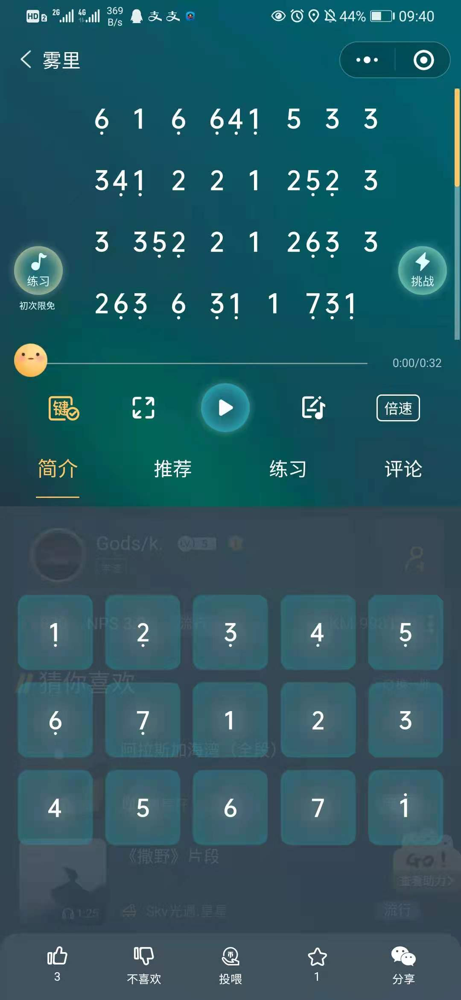
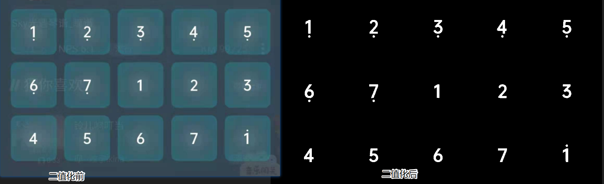
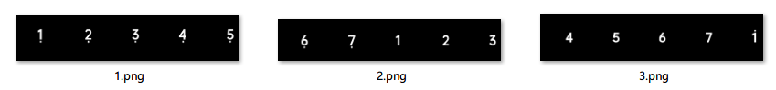
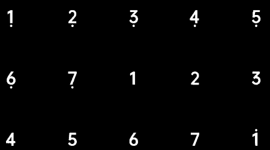
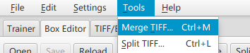
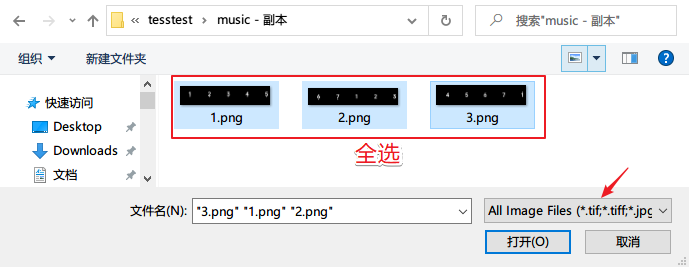
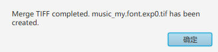
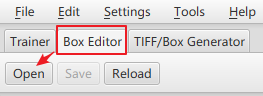
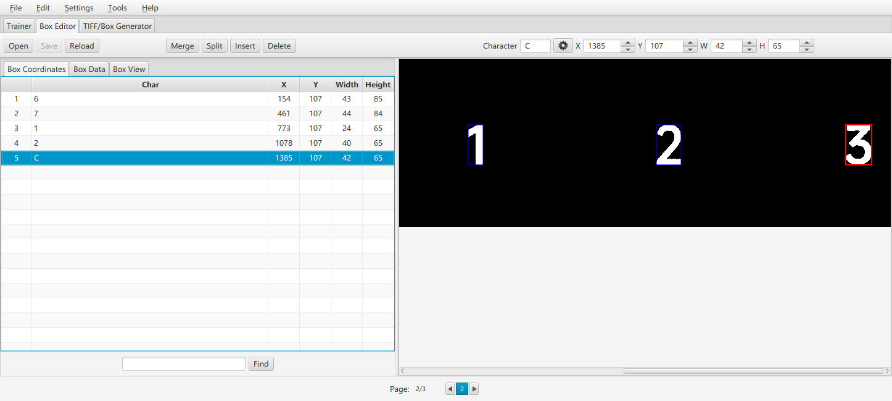
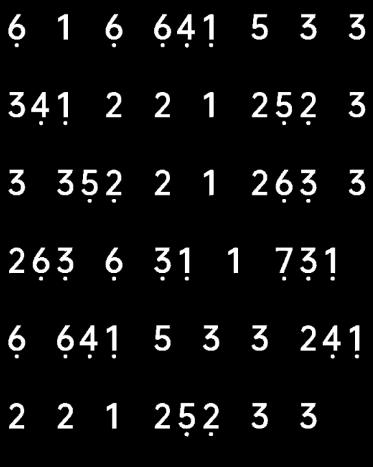

# Windows下Tesseract训练音符识别

## 背景



开局一张图：现在有这么一个需求，要将数字简谱中的数字带点的内容识别出来做进一步的处理，比如

```properties
6 1 6 641 533
.   . ...
```

识别成

```properties
F 1 F FDA 5 3 3
```

其实就是通过下面的映射关系识别

```properties
# 原简谱
                            .
1 2 3 4 5 6 7 1 2 3 4 5 6 7 1
. . . . . . .

# 映射
A B C D E F G 1 2 3 4 5 6 7 a
```

识别成什么无所谓，只要能区分带点的数字和不带点的数字即可，带点的这种数字是简谱的特殊字符，纯字符是打不出来的，这也是难点，有以下思路

1. 打开调试工具，观察dom结构，用js来区分，但是上面的截图是小程序，小程序目前还不能用chrome打开，因为微信小程序的浏览器封装了很多浏览器没有的功能，所以这个方案暂时放弃
2. 通过OCR文字识别，识别曲谱中的数字，但是带点的数字识别不了，可以通过训练样本，然后制作成字库文件进行识别，将带点的数字用英文表示（上面的映射关系）


## 准备工作

### 素材准备

首先需要找到样本，上面截图中的键盘很不错，字符很全，就拿这个当做训练样本，首先进行二值化（Binarization）操作，二值化可参考维基百科:https://zh.wikipedia.org/zh-hans/%E4%BA%8C%E5%80%BC%E5%8C%96

二值化的目的主要是为了简化背景，提供识别度，下面是Java的二值化代码

```java
public void binaryImage(String in,String out) throws IOException{
        File file = new File(in);
        BufferedImage image = ImageIO.read(file);

        int width = image.getWidth();
        int height = image.getHeight();

        BufferedImage grayImage = new BufferedImage(width, height, BufferedImage.TYPE_BYTE_BINARY);//重点，技巧在这个参数BufferedImage.TYPE_BYTE_BINARY
        for(int i= 0 ; i < width ; i++){
            for(int j = 0 ; j < height; j++){
                int rgb = image.getRGB(i, j);
                grayImage.setRGB(i, j, rgb);
            }
        }

        File newFile = new File(out);
        ImageIO.write(grayImage, "png", newFile);
    }
```

调用方式如下，输出一个图片文件，输出二值化后的图片文件

```java
public static void main(String[] args) throws IOException {
    ImageBinaryzation demo = new ImageBinaryzation();
    demo.binaryImage("D:\\20210626102826.jpg","D:\\20210626102826二值化.png");
}
```

二值化前后对比如下



用PS等工具把它水平切分成三个文件备用，如下



### Tesseract软件准备

> **Tesseract**是一个[光学字符识别](https://zh.wikipedia.org/wiki/光学字符识别)引擎，支持多种操作系统。[[1\]](https://zh.wikipedia.org/wiki/Tesseract#cite_note-Kay01Jul07-1)Tesseract是基于[Apache许可证](https://zh.wikipedia.org/wiki/Apache许可证)的[自由软件](https://zh.wikipedia.org/wiki/自由软件)[[2\]](https://zh.wikipedia.org/wiki/Tesseract#cite_note-UbuntuDoc-2)，自2006 年起由[Google](https://zh.wikipedia.org/wiki/Google)赞助开发[[3\]](https://zh.wikipedia.org/wiki/Tesseract#cite_note-3)。

Tesseract读音为 /ˈtesəˌrækt/，为啥用它？因为它开源，教程多

首先安装Tesseract 4.0，安装地址如下，一路next即可

- http://digi.bib.uni-mannheim.de/tesseract/tesseract-ocr-setup-4.00.00dev.exe

然后添加环境变量

- 将`C:\Program Files (x86)\Tesseract-OCR`添加到`PATH`，方便调用里面的命令
- 将`C:\Program Files (x86)\Tesseract-OCR\tessdata`添加到`TESSDATA_PREFIX`（新建一个），方便第三方调用（比如Java）的时候直接取里面训练好的字库文件

命令行验证

- 打开cmd命令行，输入`tesseract -v`查看版本，有回显说明安装成功

```bash
tesseract -v
tesseract 4.00.00alpha
 leptonica-1.74.1
  libgif 4.1.6(?) : libjpeg 8d (libjpeg-turbo 1.5.0) : libpng 1.6.20 : libtiff 4.0.6 : zlib 1.2.8 : libwebp 0.4.3 : libopenjp2 2.1.0
```

下载字库文件（本例不需要，因为只识别数字）

- 默认是不带中文字库的，如果需要下载训练好的中文字库，可以去github下载（`chi_sim.traineddata`是简体中文包）：https://github.com/tesseract-ocr/tessdata/find/master

#### 简单实验

下面来简单识别一下：在有键盘二值化图片的文件夹打开cmd命令行，输入如下命令

```bash
tesseract 键盘二值化.png output -l eng --psm 6
```

- `键盘二值化.png`是输入图片
- `output`是输出结果文本
- `--psm 6` 表示这是一个文本块，不是一个字符也不是一行，`--psm 7` 表示一行，这个很重要，训练的时候生成基础box文件的时候会用到，需要告诉它这是一行还是一块，否则可能会报`Page Empty`错误

其他`--psm`参数还有

```properties
0 Orientation and script detection (OSD) only.
1 Automatic page segmentation with OSD.
2 Automatic page segmentation, but no OSD, or OCR.
3 Fully automatic page segmentation, but no OSD. (Default)
4 Assume a single column of text of variable sizes.
5 Assume a single uniform block of vertically aligned text.
6 Assume a single uniform block of text.
7 Treat the image as a single text line.
8 Treat the image as a single word.
9 Treat the image as a single word in a circle.
10 Treat the image as a single character.
11 Sparse text. Find as much text as possible in no particular order.
12 Sparse text with OSD.
13 Raw line. Treat the image as a single text line,
```

看看识别的结果

```
L. 2 3 4 e
6 7 I 2 3
4 s 6 7 1
```

对比下原图



识别结果乱七八糟，压根不满足需求，5竟然识别成了s....

### 训练矫正工具准备

这个工具叫做`jTessBoxEditor` ，中文翻译大概是基于java的Tesseract的盒子编辑器，所谓盒子可以理解成需要识别的字符，这个字符的边界框起来就是一个盒子（矩形），这个软件就是矫正这个边界，所以叫盒子编辑器。（个人理解），既然是基于Java的，所以Java环境也是需要的

- JDK：[嗖嗖下载java jdk镜像](http://java.sousou88.com/spec/oraclejdk.html)
- jTessBoxEditor：https://sourceforge.net/projects/vietocr/files/jTessBoxEditor/，这玩意不是很好用，但是对于本例的需求足够用了，**带FX的版本**才支持中文，本例中不涉及中文，还是可以下载新版，因为支持的图片格式更多

打开后双击里面的`jTessBoxEditorFX.jar`即可打开界面

## 字库训练

### 合并训练样本

这个步骤的目的是将多张训练样本进行合并，在矫正的时候可以分页一起矫正

打开`jTessBoxEditorFX.jar`，点击Tools -> Merge TIFF



选择刚才我们准备的三张样本图片，注意选择下文件格式，默认格式是选择TIFF


此时会再次弹出文件框让保存文件，输入`music_my.font.exp0.tif`然后保存，出现下图内容说明保存成功，如果不是下图内容需要根据提示排错（比如本来是jpg图后缀是png就会报错）



### 生成基础识别box文件

在当前文件夹cmd进入命令行窗口，输入

```bash
tesseract music_my.font.exp0.tif music_my.font.exp0 -l eng --psm 7 batch.nochop makebox
```

- `music_my.font.exp0.tif`：我们刚才生成的合并文件
- `eng`：用英文字库识别
- `--psm 7` ：指定待识别的图片为一行内容，上面已经说过了

执行之后会生成`music_my.font.exp0.box`文件，这样做的目的：既然我们要校正数据，得先生成一个基础的数据识别是吧，这就是生成的基础识别数据，我们在这个box文件的基础之上识别

### 校正

打开`jTessBoxEditorFX.jar`，点击Box Editor-> Open，打开第一步生成的`music_my.font.exp0.tif`，会带第二步的识别基础数据（box文件）



打开之后的效果



左边列表就是识别的基础数据，右边就是我们的样本，下面page有三页，因为我们的样本是三张，将左边列表的数据与右边的样本图片进行校正，包括位置和内容，比如3识别成了C就需要校正，最后Ctrl + S保存

到这一步生成的文件列表如下

```properties
1.png
2.png
3.png
music_my.font.exp0.box
music_my.font.exp0.tif
```

### 训练

这里包括了很多步骤，此处合到一起了，简称训练

#### 生成字体特征文件

在当前文件夹新建一个`font_properties`文件，输入内容

```
font 0 0 0 0 0
```

表示字体 font 的粗体、倾斜等共计5个属性全都设置为0，注意 ： 这里输入的 `font` 名称必须与 `music_my.font.exp0.box` 中两个点号之间的 `font` 名称保持一致，还有编码必须为UTF-8不带BOM，所以不能用记事本

现在有以下这些文件了

```properties
1.png
2.png
3.png
music_my.font.exp0.box
music_my.font.exp0.tif
font_properties
```

#### 生成训练的tr文件

```bash
tesseract music_my.font.exp0.tif music_my.font.exp0 --psm 7 nobatch box.train
```

注意这里也有`--psm 7`，执行结果

```properties
Tesseract Open Source OCR Engine v4.00.00alpha with Leptonica
Page 1
Warning. Invalid resolution 1 dpi. Using 70 instead.
APPLY_BOXES:
   Boxes read from boxfile:       5
   Found 5 good blobs.
Generated training data for 5 words
Page 2
Warning. Invalid resolution 1 dpi. Using 70 instead.
APPLY_BOXES:
   Boxes read from boxfile:       5
   Found 5 good blobs.
Generated training data for 5 words
Page 3
Warning. Invalid resolution 1 dpi. Using 70 instead.
APPLY_BOXES:
   Boxes read from boxfile:       5
   Found 5 good blobs.
Generated training data for 5 words
```

类似于`Found 5 good blobs.`的输出说明是成功的，这一步会生成`music_my.font.exp0.tr`文件，此时文件列表如下

```properties
1.png
2.png
3.png
music_my.font.exp0.box
music_my.font.exp0.tif
font_properties
music_my.font.exp0.tr
```

#### 提取字符集文件

执行下面命令

```
unicharset_extractor music_my.font.exp0.box
```

执行结果如下

```properties
Extracting unicharset from music_my.font.exp0.box
Wrote unicharset file ./unicharset.
```

这一步生成了`unicharset`文件，文件列表如下

```properties
1.png
2.png
3.png
music_my.font.exp0.box
music_my.font.exp0.tif
font_properties
music_my.font.exp0.tr
unicharset
```

#### 生成字典数据

```bash
mftraining -F font_properties -U unicharset -O music_my.unicharset music_my.font.exp0.tr
cntraining music_my.font.exp0.tr
```

输出分别如下

```bash
# mftraining -F font_properties -U unicharset -O music_my.unicharset music_my.font.exp0.tr
Warning: no protos/configs for Joined in CreateIntTemplates()
Warning: no protos/configs for |Broken|0|1 in CreateIntTemplates()
Done!


# cntraining music_my.font.exp0.tr
Reading music_my.font.exp0.tr ...
Clustering ...

Writing normproto ...
```

这两步生成了4个文件

```properties
inttemp
normproto
pffmtable
shapetable
```

将这4个文件重命名一下，加上前缀`music_my.`，如果cmd没有mv命令可以在powershell中执行或者手动重命名

```bash
mv inttemp music_my.inttemp
mv normproto music_my.normproto
mv pffmtable music_my.pffmtable
mv shapetable music_my.shapetable
```

此时生成的文件列表为

```properties
Mode                 LastWriteTime         Length Name
----                 -------------         ------ ----
-a----         2021/6/26     15:12           3421 1.png
-a----         2021/6/26     15:12           3262 2.png
-a----         2021/6/26     15:12           3347 3.png
-a----         2021/6/27     11:00             14 font_properties
-a----         2021/6/27     10:42            310 music_my.font.exp0.box
-a----         2021/6/27     10:38          12221 music_my.font.exp0.tif
-a----         2021/6/27     10:57          27152 music_my.font.exp0.tr
-a----         2021/6/27     11:00         134536 music_my.inttemp
-a----         2021/6/27     11:00           1382 music_my.normproto
-a----         2021/6/27     11:00            110 music_my.pffmtable
-a----         2021/6/27     11:00            184 music_my.shapetable
-a----         2021/6/27     11:00            677 music_my.unicharset
-a----         2021/6/27     10:58            665 unicharset
```

#### 生成字库文件

最后一条命令

```bash
combine_tessdata music_my.
```

执行完输出如下

```properties
Combining tessdata files
Output music_my.traineddata created successfully.
1:unicharset:size=677, offset=168
3:inttemp:size=134536, offset=845
4:pffmtable:size=110, offset=135381
5:normproto:size=1382, offset=135491
13:shapetable:size=184, offset=136873
```

size和offset这些项没有-1表示成功，最后生成了一个`music_my.traineddata`文件，这就是最终的字库文件，将此文件拷贝到文初提到的默认字库文件夹`C:\Program Files (x86)\Tesseract-OCR\tessdata`就可以直接调用

## 测试

最后再次测试我们的识别效果，在有键盘二值化.png文件的目录里执行

```bash
tesseract 键盘二值化.png output -l music_my --psm 6
```

看下输出结果

```
A B C D E
F G 1 2 3
4 5 6 7 a
```

非常完美，说明已经识别出来了，符合预期

其实我们用样本去测试字库文件这肯定是符合预期的，因为字库文件就是用样本的校正然后制作的，所以测试的时候应该用待识别的（非样本）图片作为测试，会发现，其实识别成功率还不是100%，本例中大概有90%左右的识别成功率，因为真实的曲谱二值化后可能长下面这样



所以需要一个重复训练的过程，将未识别的数据标记出来，然后在之前的基础之上重复训练，越训练得多越精准，是不是有大数据内味儿了~

## 重复训练

重复训练是要在之前的基础之上来训练，这里我给一个思路，将要识别的图片放到之前第一次训练的那个目录里：

- merge的时候可以选择之前的`music_my.font.exp0.tif`文件和本次新增的图片，因为`music_my.font.exp0.tif`已经包含之前的图片了，所以不需要选择之前的图片，然后生成一个新的tif文件，比如`music1_my.font.exp0.tif`
- 生成box基础识别数据的时候可以用之前我们训练好的字库`music_my`，这样就不用重复校正了，只用校正本次新增的

接下来的步骤和之前都是一样的，步骤很多很杂，其实无非就是合并 > 校正 > 训练 > 生成字典而已，下面将这些命令统一到一个地方，以后训练的时候只需要将`music_my.`前缀批量替换一下就行

```bash
# 生成box文件
tesseract music_my.font.exp0.tif music_my.font.exp0 -l eng --psm 7 batch.nochop makebox

# 此处需要用jTessBoxEditorFX进行校正....
....校正中....

# 生成字体特征文件（注意编码一定要是UTF-8无BOM）
echo 'font 0 0 0 0 0'>font_properties


# 训练
tesseract music_my.font.exp0.tif music_my.font.exp0 --psm 7 nobatch box.train
# 提取字符集
unicharset_extractor music_my.font.exp0.box

# 生成字典
mftraining -F font_properties -U unicharset -O music_my.unicharset music_my.font.exp0.tr
cntraining music_my.font.exp0.tr

# 更名为统一的前缀
mv inttemp music_my.inttemp
mv normproto music_my.normproto
mv pffmtable music_my.pffmtable
mv shapetable music_my.shapetable

# 合并文件，生成字库文件
combine_tessdata music_my.
```


## Java调用Tesseract

java中调用Tesseract只需要引入Tesseract依赖即可，在maven中引入依赖

```xml
<dependency>
    <groupId>net.sourceforge.tess4j</groupId>
    <artifactId>tess4j</artifactId>
    <version>4.4.0</version>
</dependency>
```

从图片识别的代码demo

```java
public class TestOCR {


    private  Logger logger = LoggerFactory.getLogger(this.getClass());

    ITesseract instance;

    String path = "D:\\22222.png";


    @Before
    public void init(){
        
        instance = new Tesseract();
        //如果没有设置TESSDATA_PREFIX环境变量下面需要设置字库文件位置
        //String lagnguagePath = "D:";
        //instance.setDatapath(lagnguagePath);
        //chi_sim ：简体中文， eng    根据需求选择语言库
        instance.setLanguage("eng");
        //白名单，只识别成数字
        instance.setTessVariable("tessedit_char_whitelist", "1234657890");

    }


    @Test
    public void test1(){
        String path = "C:\\Users\\Desktop\\o\\test.png";
        System.out.println(path);
        // 识别图片的路径（修改为自己的图片路径）
        File file = new File(path);

        String result = null;
        try {
            long startTime = System.currentTimeMillis();
            result =  instance.doOCR(file);
            long endTime = System.currentTimeMillis();
            System.out.println("Time is：" + (endTime - startTime) + " 毫秒");
        } catch (TesseractException e) {
            e.printStackTrace();
        }

        System.out.println("result: ");
        System.out.println(result);

    }
}
```

Tess4J API 提供的功能：
1、直接识别支持的文件
2、识别图片流
3、识别图片的某块区域
4、将识别结果保存为 TEXT/ HOCR/ PDF/ UNLV/ BOX
5、通过设置取词的等级，提取识别出来的文字
6、获得每一个识别区域的具体坐标范围
7、调整倾斜的图片
8、裁剪图片
9、调整图片分辨率
10、从粘贴板获得图像
11、克隆一个图像（目的：创建一份一模一样的图片，与原图在操作修改上，不相 互影响）
12、图片转换为二进制、黑白图像、灰度图像
13、反转图片颜色

更多案列请参考：https://blog.csdn.net/weixin_30906185/article/details/99802837

源码参考：https://gitee.com/zhaohuihbwj/Tess4JDemo/blob/master/src/test/java/per/zh/tess4j/Tess4JTest.java

# 参考

- https://blog.csdn.net/dcrmg/article/details/78233459
- https://blog.csdn.net/weixin_30906185/article/details/99802837

