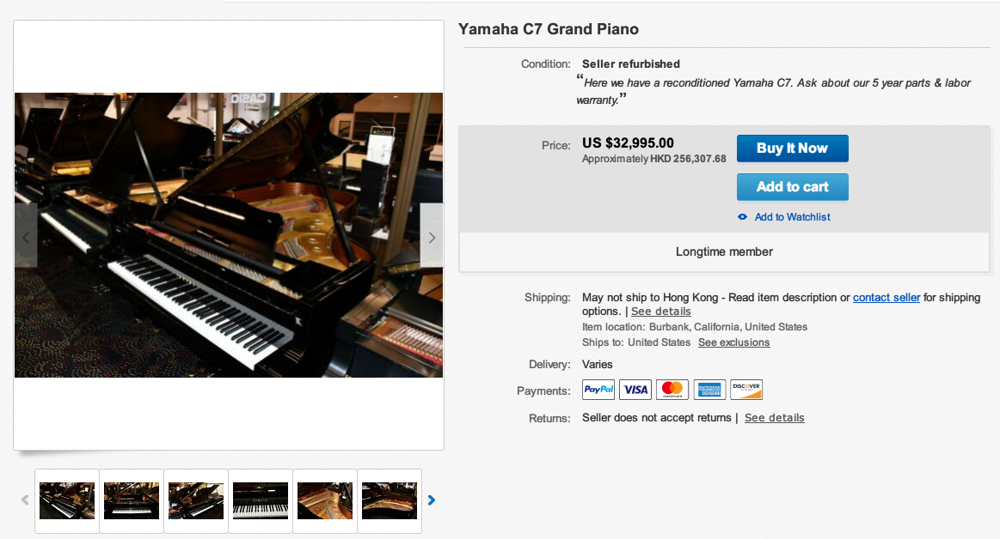
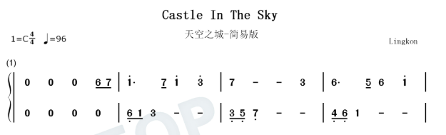

# 如何用五千块的电脑弹奏出价值十万钢琴的效果


**免责声明：本文所涉及资源包括采样器，音源等仅供个人学习交流，商业用途请自行购买正式版本，否则后果自负，本文概不承担一切责任**

五千块的电脑？不用纠结，这里是一个泛指，泛指一台办公级别的或者叫入门级别的Windows操作系统的台式或者笔记本电脑。

价值十万的钢琴？不用纠结，这个不是泛指，这里是针对**YAMAHA C7 GRAND PIANO**（雅马哈C7三角钢琴），这货大概长下面这样


这款钢琴黑色的价格大约是4.2W美元，约合人民币27W；白色的价格是5W美元，约合人民币32W，参考地址：http://www.piano-play-it.com/yamaha-grand-piano.html，参考内容如下

> Yamaha C7 in Black Polyester costs about $ 42,000 while the same piano in White Polyester costs around $ 50,000.
>
> YAMAHA C7 Grand Piano - Length: 7' 6" (227 cm). Price: $48,000-55,000.

上面是全新的价格，在ebay上也有二手在卖，价格在3.2W美元，烧钱传送门：https://www.ebay.com/itm/203074406408?hash=item2f482d8808:g:QskAAOSwl~hfMyBc




那么五千块的电脑怎么弹奏这个钢琴？这个问题得分两部分来回答

- 电脑上可以弹钢琴吗？怎么弹奏？
- 电脑可以弹钢琴了，怎么弹奏雅马哈C7三角钢琴？


## 电脑上可以弹钢琴吗？

答案是当然可以的，不然就没有这篇文章了，原理也很简单，将电脑键盘映射成钢琴上的按键，按不同的按键发出不同的音调的声音，所以涌现出了一大堆钢琴模拟器，有在线网页的，有软件的，下面随便瞄几个

### 在线钢琴模拟器

地址：https://www.xiwnn.com/piano/

长下面这样

一看就知道怎么玩吧，可以编辑键盘映射，中央C调的位置也给标出来了，如果是平板电脑或手机，还可以直接触摸钢琴按键发声，手机屏幕太小体验不好，有平板的可以试试

吐槽专区有牛人留下了不少曲谱，照着曲谱按就行了，然后多按几遍找感觉找节奏，刚开始发现这个玩意的时候我玩了一下午:)，如果你只是随便玩玩，本文看到这里也就够了，如果你有更多高阶的需求，比如弹奏雅马哈C7三角钢琴，请继续往下:)


比较高级的功能是MIDI播放，将mid的曲子拖进来播放会显示对应的按键，像下面这样，下面播放的是一首HITA的《赤伶》，（PS：很多年前就有这首歌了，最近抖音上面很火，只是很多人不知道曲名），键盘会自动动起来，可以参考练习，不过最开始建议练习一些简单单手弹奏的没有和弦的曲子，因为最开始两只手弹奏会很不协调，需要慢慢练习磨合


还有一个高级功能是可以对接MIDI键盘作为输入，MIDI键盘类似于下面这样，大的小的都有，全尺寸的88键类似于钢琴键盘，某宝上便宜的几百米贵的上千米的都有，当然，如果你需要这，说明已经是高级玩家了，也不需要我过多介绍

参考：https://zhuanlan.zhihu.com/p/27037951?refer=netcmcc?refer=netcmcc

> 一个全尺寸的88键的电子键盘长度约为1.4米，大概是一般小轿车后排车座的宽度。


当然，除了这个钢琴模拟器，还有各式各样的模拟器，比如自由钢琴：https://www.autopiano.cn/post/3579，长下面这样，也有一些练习曲谱


这个网站还是一个开源项目，地址：https://github.com/AutoPiano/AutoPiano，感兴趣的可以复刻或参与开发，下面是引用的项目介绍

> Hate 996? Come Here & Relax~
>
> 最近用Vue + Tone.js做了一款钢琴类web应用，名字定为自由钢琴（AutoPiano），人生如音乐，欢快且自由。
>
> 此文权当作该项目的总结和分享~
>
> ## 项目简介
>
> 自由钢琴（AutoPiano）是利用HTML5技术开发的在线钢琴应用，致力于为钢琴爱好者、音乐爱好者以及其他所有的创造者提供一个优雅、简洁的平台，在学习工作之余可以享受钢琴、音乐的美好。就类似于多年前Flash开发的钢琴游戏，自由钢琴只是换了H5的技术，同时支持了钢琴曲的**自动播放**功能。
>
> AutoPiano支持键盘按键和鼠标点击播放，同时琴键上会有按键和音名提示。另外，AutoPiano还有教学的功能，一种方式是`快速入门`，通过简易的谱子按键进行演奏，另一种是`演奏示例`，通过钢琴曲的自动播放来达到演示的目的。目前这两个功能都在持续完善中

第一句话 **Hate 996? Come Here & Relax~**，讲出了众多码农的心声...


### 软件版钢琴模拟器FreePiano

软件版就太多了，各种奇奇怪怪的安卓APK，IOS端自带的《库乐队》，Windows上也有许多，Microsoft store里面一搜索就有许多

这里只介绍一款：**FreePiano**，中文译名免费钢琴，是个人开发软件，官网（自备梯子）：https://freepiano.tiwb.com/cn/

那为啥介绍这款？因为简单且相对专业，虽然样子丑了一点（N年前的软件了，最后一次更新是在2015年），并且很重要的是有团队基于它做了一些商业行为：https://www.baozoupiano.cn/，并且还说过要美化界面（经过原作者同意），有人付费了说明**FreePiano**满足了一类人的需求还是值得被肯定。

第一次知道这个软件是在youtube看到一个台湾人用它弹奏《Flower dance》：https://www.youtube.com/watch?v=VJa-z67HQLg&t=100s&ab_channel=%E8%B6%99%E5%BB%A3%E7%90%B3

在官网有下载地址。下载安装的过程就不说了，下载后打开钢琴图标就可以，长下面这样


基本功能就不过了，下面介绍一下高级功能

- 可以录音和回放
- **可以加载自定义VSTi音源**（这是弹奏十万级效果的关键）
- 自带节拍器
- 可接入MIDI键盘输入，可自定义音频输出（比如输出到扬声器或者耳机）
- 可以调整钢琴按键的随机力度与力度范围（说白了就是让演奏显得更加真实）

弹奏十万级效果下个目录讲，这里讲一下怎么弹奏一首曲谱

#### 找简谱

比如《天空之城》，上网随便百度一下，找到简谱，如下



有两排，上面一排是右手弹奏（主旋律），下面一排是左手弹奏（和弦），最开始弹上面一排就可以

#### 看简谱

简谱太复杂的这里不讲，只讲最基本的，简谱一共七个数字，相信以前读书的时候音乐课都学过

**音符：１２３４５６７**

**唱名：do re mi fa sol la si**

**汉字：多来米发梭拉西**

0 是**休止符**，不发音

对应钢琴键盘上的 CDEFGAB


数字上面有点的叫高音，有两个点叫倍高音，数字下面有点的叫低音，有两个点的叫倍低音，如下


如果想了解更多简谱的知识，可以参考

- https://bbs.huaweicloud.com/blogs/241123
- [如何看懂音乐简谱](https://www.jianshu.com/p/11c988a75af7)

#### 弹奏

看到这里其实弹奏就很简单了，比如天空之城第一段是

```
     .   . .
6 7  1 7 1 3 7
```

找到键盘上对应的位置按照顺序弹奏就可以了，试一下，找到感觉没


## 电脑上怎么弹奏十万级钢琴效果？

有了上面的基础操作后，下面来讲讲怎么演奏十万级钢琴效果

其核心就一句话：**用FreePiano通过VSTi的方式加载雅马哈C7三角钢琴音源**

首先了解一下VSTi技术

> ### VSTi
>
> **VSTi**（VST instrument），即**VST乐器**，是VST家族中用于生成音频的一类VST插件。它们作为[音源](https://zh.wikipedia.org/wiki/音源)来使用，一般都是虚拟的[合成器](https://zh.wikipedia.org/wiki/合成器)或[采样器](https://zh.wikipedia.org/wiki/采样器)。其中合成器通过软件[算法](https://zh.wikipedia.org/wiki/算法)和[DSP](https://zh.wikipedia.org/wiki/DSP)，模拟真实乐器、硬件合成器或独创性地生成乐音；而采样器则是**采样真实乐器的声音**，并通过VST插件播放出来。值得一提的是，一些VSTi插件能够通过软件合成媲美真实乐器的声音，效果堪比真实乐器，却拥有比采样音源小的多的体积[[注 1\]](https://zh.wikipedia.org/wiki/VST#cite_note-3)。

大概原理是这样的：

**我们的双手弹奏   >>  键盘或者MIDI键盘  >> 音乐软件(Cubase或者FreePiano等等) >> VSTi接口 >> 合成器或者采样器 >> 发出声音**

FreePiano是处于音乐软件的一环，这一环其实还有很多音乐软件（也叫宿主），比如Cubase，IOS上的Logic等等等，这里不再展开，具体到我们要演奏的雅马哈C7三角钢琴，其流程是这样的

**我们的双手弹奏   >> 键盘 >> FreePiano >> VSTi接口 >> 采样器(Kontakt)加载雅马哈C7三角钢琴音源 >> 发出声音**

所以现在我们只需要采样器**Kontakt**和**雅马哈C7三角钢琴音源**

### 采样器Kontakt

- 采样器

> 采样器是一种录制、修改和回放数字音频的电子设备。它使用的是真实乐器的数字音频样本、歌曲片段或音效来创作音乐，并因此得名。
>
> 采样器的声音是被存储在数字存储器中的，因此可以直接调用，可以实现实时表演。您可以把声音分配在键盘上，然后以不同的音调回放，以此来模仿原声和电子钢琴、风琴和合成器等一系列键盘类乐器

- Kontakt：https://www.native-instruments.com/zh/products/komplete/samplers/kontakt-6/

下面是一些官网的介绍

> ## 权威可靠的采样平台
>
> - 业界标准：KONTAKT 为许多最大型的采样乐器音源提供了引擎动力
> - 其内置的原厂库就包含了 55+ GB 充满细节、创意与表现力的乐器音源
> - 只需将采样拖放入乐器音源界面之中，即可随意玩转属于你的声音
> - 以及使用强大的采样编辑与乐器制作选项来制作属于自己的乐器音源
>
> ## 不仅仅是采样器
>
> 使用内含大量采样乐器音源的 KONTAKT 6 ，您可以创作出听起来像军鼓、交响乐，或者介于两者之间的任何音色。当您需要一个简单的采样器，它如您所愿，当您有更多声音需求时，它是一个深度声音脚本实验室。世界上最受欢迎的新一代采样平台，为您提供了新的乐器音源和新功能——您可以按照您需要的方式对声音进行分层、连接、拉伸和塑形。

说白了Kontakt不仅能采样乐器制作成音源，还能加载采样过后音源，这货是付费软件：¥ 3199，当然个人使用和谐版即可，商业行为须购买正式版

和谐版：http://www.opdown.com/soft/244096.html

亲测可用，按照教程来，注意替换里面的`Kontakt.exe`和`Kontakt.dll`，32bit还是64bit根据自己的实际情况选择

如果一路默认安装的话，VSTi插件的路径应该是，记住这个FreePiano正是通过这个来调用它

- `C:\Program Files\Native Instruments\VSTPlugins 64 bit\Kontakt.dll`

### 雅马哈C7三角钢琴音源

这款音源全称：**Production Voices - Production Grand 2 Platinum**，中文得搜索关键词**制作人钢琴白金版**或者**白金制作人钢琴**

购买地址：https://www.productionvoices.com/product/production-grand-2-2/，介绍如下

> # Production Grand 2
>
> $329.00
>
> **Production Grand 2** is an exceptionally high-quality piano sample library for NI Kontakt 5.7 and above, consisting of eight microphone perspectives and over **120,000 samples** of a Yamaha C7 grand piano recorded in a world-class recording studio. The library is **437.5 GB** in size*!

大意是说这款钢琴音源是录制的**雅马哈C7三角钢琴**，适用于采样器Kontakt 5.7版本以上（我们下载的是6），包括在**世界级**录音室录制的超过120,000多个声音样本，总大小**437.5GB**，当然这一切不是免费的，需要329美元即可拥有

还是那句话，非商用找和谐版，商用自行购买之，和谐版这里提供一套110G多的（开个百度夜间会员8块钱一晚上就可以下载好）

> 链接：https://pan.baidu.com/s/13hvj1hRUWO0SmX9cgLrrHA 
> 提取码：e0e8

下载好后是100多个压缩包，全选解压后`Samples`文件夹里面是音源样本，这就是那100多G的大家伙，`PG Platinum Singles`文件夹里面是乐器文件，Kontakt通过加载这些乐器文件从而加载音源样本

### 加载音源

打开宿主软件FreePiano，点击音源选择浏览，选择Kontakt的VSTi插件并且打开，即上文提到的`C:\Program Files\Native Instruments\VSTPlugins 64 bit\Kontakt.dll`


然后会默认打开Kontakt的界面，选择刚才的`PG Platinum Singles`目录，然后随便选一个乐器文件，我选的是`PG Platinum Modern Inside v1_1_16.nki`，然后慢慢等加载，加载完成后在FreePiano上试一下如果有声音说明加载成功！


上面有很多参数可以调整的，这个自行研究，为啥每次都加载这么慢？因为样本比较大，每个乐器文件包含的样本15G左右，所以疯狂读硬盘，有没有快一点的方法？有的，如下图另存为，选择`Patch Only`和`Absolute Path`，然后在`Quick-Load`面板打开就很快


### 效果

虽然现在我们发出的声音是雅马哈C7三角钢琴的了，实际上最大的感觉是可以调整的参数变多了，因为FreePiano有丰富的参数可以调整，特效啊、音调啊啥的；但是声音的效果好像感觉并不大， 或者是因为你需要一个好一点的音响或耳机:)，所以你五千的电脑里面得拿出一部分预算整个雅马哈音响（笑）

当然Kontakt不止是可以加载钢琴音源，还有很多音源，比如古风类的、打击乐的、吉他的，就像把一个乐队搬回了家，更多玩法等待高端玩家自行发挥...

# 参考


- http://www.piano-play-it.com/yamaha-grand-piano.html
- https://www.ebay.com/itm/203074406408?hash=item2f482d8808:g:QskAAOSwl~hfMyBc
- https://bbs.huaweicloud.com/blogs/241123
- https://www.jianshu.com/p/11c988a75af7