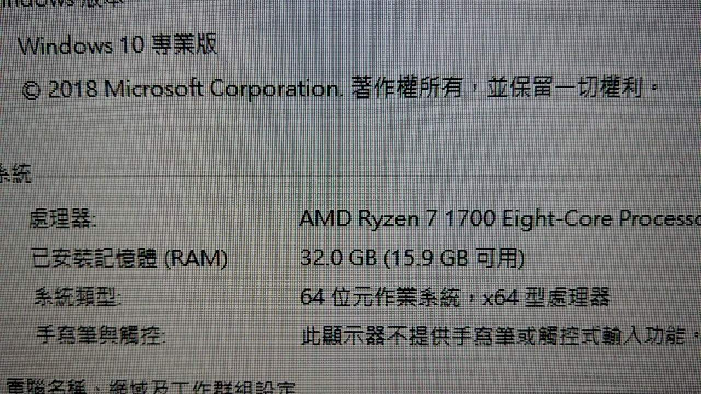

# 内存条玄学之四槽插满就这么难么？

## 背景

最近准备折腾下虚拟机搭OpenShift集群，内存不够使了，本来是两条8G共16G，想要扩展到32G，于是咸鱼入手了2根8G，频率也是2400（其中一根是宽版，颗粒和窄版不相同），情况如下

| 序号            | 频率 | 规格 | 颗粒       | 大小 |
| --------------- | ---- | ---- | ---------- | ---- |
| 1（自己的）     | 2400 | DDR4 | 8颗粒      | 8G   |
| 2（自己的）     | 2400 | DDR4 | 8颗粒      | 8G   |
| 3（咸鱼入手的） | 2400 | DDR4 | 8颗粒      | 8G   |
| 4（咸鱼入手的） | 2400 | DDR4 | **16颗粒** | 8G   |

1和2我自己的能组成双通道，一共16G；3和4我咸鱼上入手的能组成双通道，一共也是16G，**唯一的不同是第4条颗粒不同**，是宽版的，直观感受下

四槽插满指的是主板上的四个槽位插满，即4 * 8G =32G，其他信息如下

- 主板：华硕 B350 PLUS
- CPU：AMD  2600X
- 系统：WIndows10专业版，版本号19042.746

下文是一些详细过程，如果很不幸你也遇到了内存兼容性问题，建议做以下尝试

- 保证内存条金手指和插槽清洁，插槽清下灰，金手指用橡皮擦擦一下之类

- 保证内存和插槽都是好的，可以控制变量法挨个试
- 内存条编号，然后排列组合各种尝试，能不能识别内存和内存条的**顺序**有关系
- 大力出奇迹，主板没那么容易坏，可能只是你没插紧而已
- 升级BIOS版本
- 在BIOS手动调整内存频率（比如Auto改成2333）
- 在BIOS超频选项中开启xmp
- 在BIOS调整内存时序
- 如果以上尝试后都不行，建议退货。。

如果你想升级没存又不想被兼容性折腾，建议购入**套条**，详细请看本文最后建议部分

本来以为插上开机就完事，结果我错了，下面是折腾开始

## 从点不亮到能点亮

一开始四条槽都插上点不亮（开机之后屏幕不亮），这个时候第一反应要么是其中一根内存条坏了，要么是其中一个插槽坏了，于是控制变量法挨根内存条，挨个插槽试

- 同一个插槽，四根内存条挨个插上试下，观察是否能开机，发现都能开机且主板和系统能正确识别，说明内存条没问题
- 同一根内存，每次插一个槽位，分别插四个插槽，观察是否能开机，发现都能开机且主板和系统能正确识别，说明插槽也没问题

这时候傻眼了，内存条插槽都没问题，一起插上就点不亮，于是开始各种擦内存条金手指，内存槽各种清灰擦擦擦，发现并没有卵用，不亮依旧不亮。

那就没啥办法了，只能排列组合各种乱试了，四个插槽，4根内存条，第一根有4个插槽可选择，插好之后，插第二根，第二根有三个插槽可选择，以此类推，也就是`4 x 3 x 2 x 1 = 24`种情况。

这么一试，发现某种组合下能点亮，也能进入系统，你还别说，**这玩意就和顺序有关系，这个顺序能点亮，交换顺序后它就是不亮，玄不玄？**

兴奋了一阵进入系统后傻眼了，卧槽，为硬件保留16G，就图中的位置，图是网上搜的，把那个8换成16就行了

关于系统那里显示已安装32G（15.9G可用）

主板也只能识别到16G，但是又能识别到四个插槽都有8G，类似下面这样

有时候三根一起插只能识别出8G（主板和系统），为硬件保留也是16G，主板也能识别到三根插槽都有内存条

## 能不能释放为硬件保留内存？

既然为硬件保留内存，那能不能释放？于是网上各种搜，搜索到的方法都是操作系统软件层面的，比如

- 常规的msconfig两步重启法

> win+R输入msconfig调最大内存然后重启，重启后再msconfig把最大内存取消在重启就好了。
>
> 参考：
>
> - https://www.zhihu.com/question/330429549
> - https://jingyan.baidu.com/article/76a7e409b35b3bfc3a6e1576.html

微软Q&A论坛也有人在问

> 您好，任务管理器中显示的“为硬件保留的内存”是**无法释放**的。
>
> 参考：
>
> https://answers.microsoft.com/zh-hans/windows/forum/windows_10-performance-winpc/win10%E4%B8%BA%E7%A1%AC%E4%BB%B6%E4%BF%9D%E7%95%99/71a979ad-a91e-43c1-b1db-e7e311de5203

也就是说，这玩意是无法释放的，我的理解是操作系统层面出问题的概率是微乎其微的，一定是硬件上面的变动导致操作系统无法使用。

遂果断放弃，这里注意重装需谨慎，因为不一定是系统原因

## 出现转机

上面提到，主板虽然能识别到每个卡槽都有个8G内存条，但是也只能识别到16G而不是32G，既然主板都识别不全那操作系统能识别全了？答案肯定是否定的，那从主板下手，唯一能做的就是升级下BIOS了

这块主板**华硕 B350 PLUS**买回来几年就没有升级过BIOS，去官网看看最新版的BIOS

官网BIOS发布链接：https://www.asus.com/Motherboards-Components/Motherboards/PRIME/PRIME-B350-PLUS/HelpDesk_BIOS/

最新的版本如下图，2020/07/31是最新的版本

更新内容中有这句话**Improve DRAM stability**：提升内存稳定性！我靠这不正是我现在需要的么，那我要来检验检验华硕的工程师**提升内存稳定性**这块工作做得好不好了，升级BIOS的过程不赘述了，大致流程如下

- 下载包，解压到随便一个盘，是个CAP文件
- 开机F2进入UEFI，现在新版的BISO叫UEFI，找到一个叫EZ Flash Tool的东西，选择刚才的CAP文件，升级即可

详细参考如下：https://jingyan.baidu.com/article/19020a0aff06d4129d2842e9.html

那升级以后再来试试`4 x 3 x 2 x 1 = 24`种排列组合，发现某种组合的3条能点亮并且能正确识别到3*8=24G！！！但是四槽还是点不亮。。。。后来通过主板强制降频到2133，四槽插满也能识别！！！！

但是经过测试发现在降频工作下，系统不稳定，经常性的各种蓝屏，每次蓝屏的原因都不一样。。详细情况如下

- 三槽，频率自动（能识别成2400），正常开关机5次，没有问题，符合预期
- 四槽，频率手动设置成2333，正常开关机5次，第2次或者第3次就会蓝屏，强制断电后多启动几次又会进入系统

上面两种情况反复测试多次，证明降频后确实系统变得不稳定。。。

所以最后的结果是咸鱼的2条+我的其中1条共三条一共24G，另外一条再挂咸鱼。。。

## 建议

说白了上面的折腾都是因为兼容性没得到保证，如果想升级内存，最好买**套条**，所谓套条，一般是指**两根生产日志、颗粒、时序都是一样的**，**兼容性相对于非套条更好的内存条**，目前大部分主板内存走线都是菊花链，**建议插24槽**，**不建议插满** 

对于我的情况，升级32G正确的办法是卖掉手上的2x8G套条，在入手2x16G套条，插上就能使，否则准备折腾吧。。

下面是一些有用的连接，这里引用了过来：

- https://nga.178.com/read.php?tid=21890410&rand=609

> **[硬件求助]主板bios识别四根内存但只能用2根的容量**
>
> 
>
> 一根一根插上去试，每试完一根再加一根，有时候就是接触不良而已。
>
> 四槽太玄学了，我估计内存问题，用另外一台电脑的2*16@3000和2*8@2133，进系统正常识别48可用48@2133。但无论是用这4根还是两根3000的插主槽(2和4)，然后任意两根插1或3槽都不正常，不是不能过自检就是进系统识别64，可用32或者识别48可用16!太tm玄学了。申请退货，还是32g*2吧

---

- https://forum.gamer.com.tw/C.php?bsn=60030&snA=507000

> **【問題】新裝32G記憶體卻顯示可用16G（已解決）**
>
> 我當初發文的情況，後面是我自己記憶體沒插好，重插後就好了，你看你的是不是這問題
>
> 請問，我也遇到跟樓主一樣問題，後來也是全部記憶體重新拔插才正常

---

- https://www.chiphell.com/thread-621911-1-1.html

> **卧槽！出大事了。。主板无法识别4条内存了，只能识别2条**
>
> 我之前的经验是cpu散热器压太紧了 松一松就好了
>
> 看看cpu 座 针脚有无 歪了的？实在不行，也可以把内存左右压下。可能接触不良……
>
> 

---

- https://nga.178.com/read.php?tid=24806153

> **纠结差不插满内存**
>
> 开XMP之后自己加电压。 试出来是没问题，只是这要是翻车成本就高了。。
>
> 一说主板厂家没法测全所有的内存，所以QVL列表里面有许多支持的组合被遗漏，而内存厂家可以专注测试自家的内存，所以内存厂家的QVL列表会全一点。不过我也没试过，不好下定论，还是等大佬来解释解释。
>
> 那应该没什么大问题，最好买4套装的而不是2套，保证兼容性 
>
> 目前大部分主板内存走线都是菊花链，建议插24槽，不建议插满 