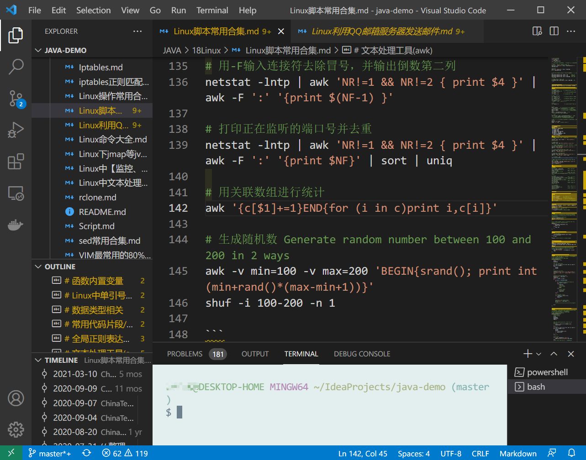
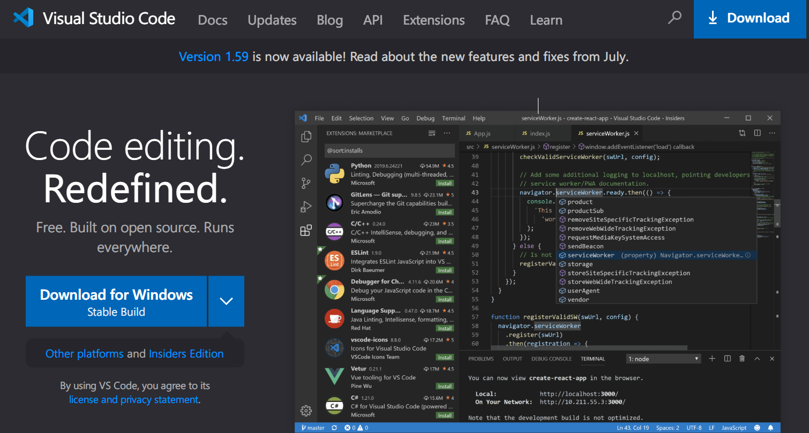
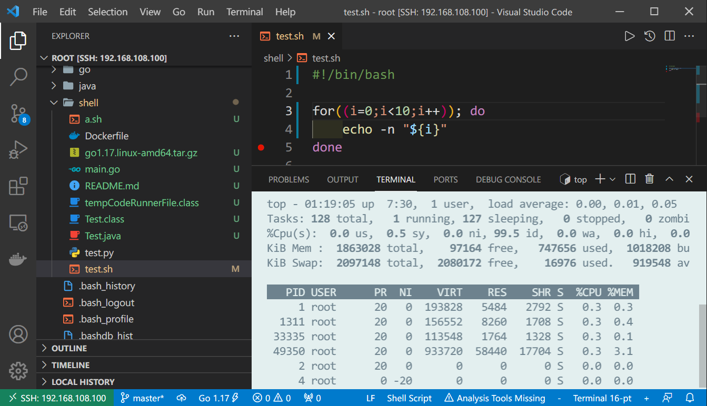
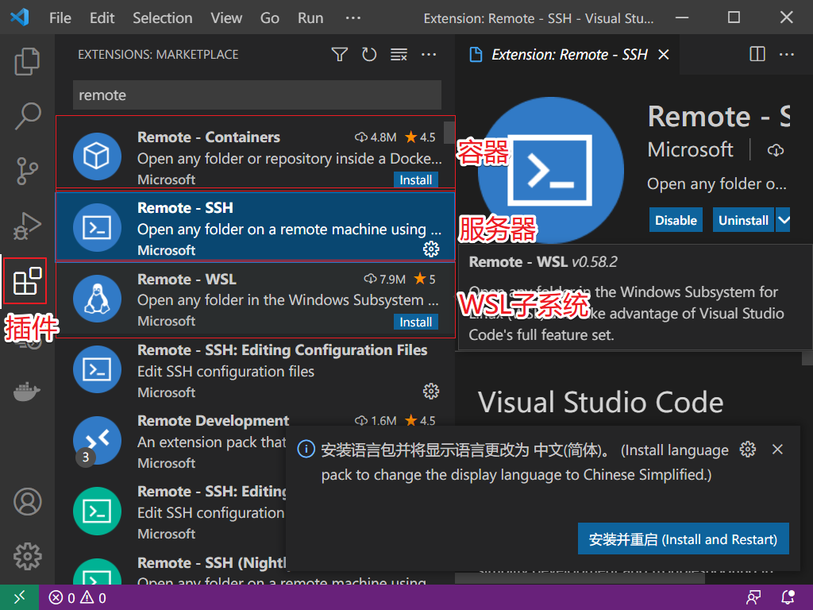
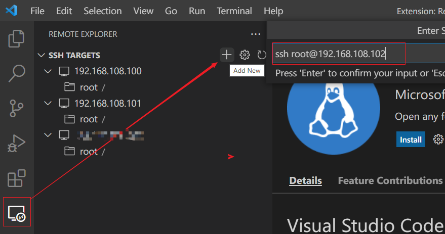
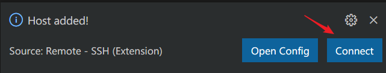
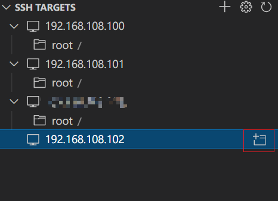
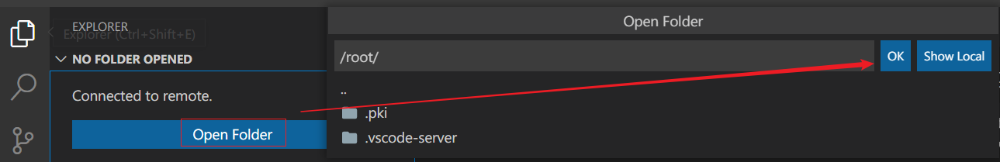
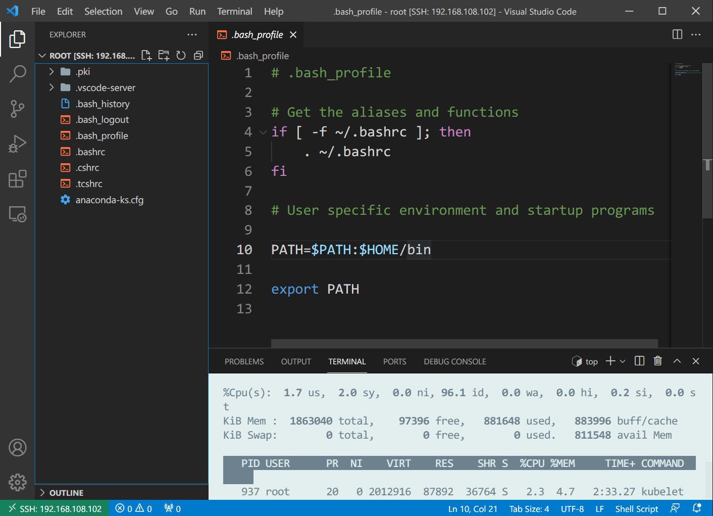
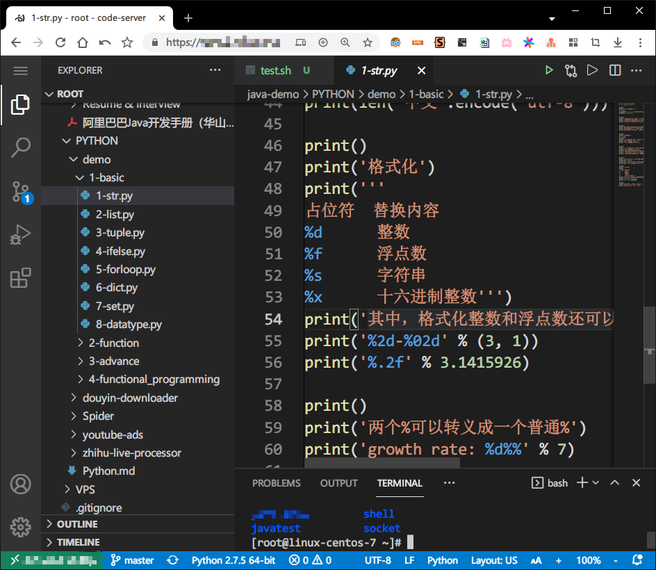

# Vscode远程开发初体验

Vscode相信搞开发的同学都不会陌生，特别是前端开发，官网：https://code.visualstudio.com/

大概长下面这样



官网宣传是下面这样的，响亮的口号：**重新定义代码编辑器**，可见官网给的定位是代码编辑器，它的强大特性是提供一些列插件可由使用者自行组装成支持各种语言（Java、Python、Golang、Shell等）的IDE。




## 远程开发？

当然如果是Java开发我是不会用这货的，IDEA不香么，好歹IDEA也是个配套设施齐全的IDE，打开就能开发业务，而Vscode还需要自己去配置环境（因为它的定位是编辑器，不是专门给Java准备的），等Vscode环境配置好，IDEA那边已经把业务开发好准备下班了。。。

那啥时候需要Vscode？远程开发的时候需要，所谓远程开发狭义上说指的是在Windows上安装的Vscode上对远程Linux（minimal 没有图形化界面那种）系统进行开发，目前我在IDEA上还没发现类似功能，虽然IDEA可以将开发好的软件包推送到远程Linux执行但是和远程开发本质上是不同的。

试想一下这种场景，需要开发一些列shell脚本，在shell中还调用了python和一些其他的语言或者命令，最终将这些shell脚本封装成一个个的命令，然后在bash下直接可以执行，这个场景下，**最适合的执行环境肯定是在Linux上**，不可能指望在WIndows上执行吧（当然git bash也可以，但是那太麻烦，说不定还有一些环境不一致导致的bug），这种场景下有以下解决方案：

1. 直接在Linux上用vi/vim等编辑器开发，如果你不是深耕Linux好多年的大佬，不建议这样用，因为vi/vim对于普通开发者的使用体验那是相当的糟糕，第一次使用时怎么退出保存可能都需要费半天劲，更别提高效开发提前下班了。。

2. 在Windows上用各种IDE开发，开发好后将项目上传到Linux在执行，这不失为一种好办法，至少开发体验和效率提升了很多，但是这种方案最麻烦的在于**上传**这个动作，哪怕改了一句话也要重新上传覆盖再执行验证，当然大佬可以把上传这个动作自动化。

3. 使用Vscode远程开发，在Windows电脑上装好Vscode，然后连接远程主机，**打开的文件都是远程主机上的文件，直接对远程主机文件进行操作，这就是所谓的远程开发！**，类似下面这样

   

- 左边打开的文件都是远程主机的哦，不是本地的文件，看左下角IP就知道是一台局域网的主机
- 带有终端，终端也是远程的终端，而不是本地的。
- 整个执行环境都是远程主机上的，和本地唯一的关系就是这个编辑器的本地的，所有的目录、文件、终端、运行环境全部都是远程Linux
- 远程开发和本地开发体验一致，本地有的特性远程开发也有。

原理如下图，Vscode第一次连接上远程主机后会在远程主机上安装Vscode Server，提供源代码系列功能、终端进程等功能并通过SSH隧道和本地的Vscode通信，带来的好处就是和本地开发体验一致，而不用关心代码到底托管在哪里。


- 参考：https://code.visualstudio.com/docs/remote/ssh

## 如何配置远程开发？

- 一台WIndows电脑（MacOS、Linux都可以）
- 一台Linux服务器（虚拟机也可以、甚至可以是容器或者Windows的WSL）

既然看到这里了，那上面两个东西应该都是有的

### 下载安装Vscode

- https://code.visualstudio.com/

直接去官网根据不同平台下载安装即可，基本配置

1. 文本编辑区域鼠标滑轮滚动字体缩放：`Ctrl+,`打开设置，搜索 `Mouse Wheel Zoom`并勾选
2. 终端选中文件自动复制：`Ctrl+,`打开设置，搜索 `Copy On Selection`并勾选

### 安装插件Remote SSH

根据不同需求安装该插件

- Remote Containers：支持在容器里进行远程开发，这个功能可以玩出花，容器里面可劲儿造，玩坏了重建一个就好。
- Remote SSH：支持在远程主机上开发（不仅限于远程Linux）
- Remote WSL：支持在WIndows的WSL子系统进行远程开发

根据实际情况安装，后面的列子都以Remote SSH为例



### 连接远程主机

安装好插件后，点击左边的主机图标，点击加号新增一个主机，会在顶部弹出ssh命令登录远程主机

```shell
ssh user@remote_ip
```

如下图所示



之后会让选择一个配置文件，随便选择一个即可，然后右下角显示添加成功，点击Connect



如果没啥反应，可以看到左边列表栏刚才的主机已经添加上去了，点击IP右侧加号连接



此时会新开一个Vscode窗口，依次会让用户选择平台（Linux MacOS Windows） >  选择是否连接 > 输入密码

密码输出无误成功连接后Vscode会自动在远程主机上安装Vscode Server，所谓Vscode Server就是一个目录，如下所示

```shell
du -sh  ~/.vscode-server/
147M    /root/.vscode-server/


tree ~/.vscode-server/ -L 1
/root/.vscode-server/
├── bin        # Vscode Server数据
├── data       # 用户数据，缓存数据等
└── extensions # 扩展插件
```

最后选择一个目录点击ok会再次输入密码，第一次会让你选择是否信任远程主机，选择信任可以体验所有特性。



最后看到的文件系统就是远程主机上的了，修改也是在远程主机上生效



到现在为止，就可以愉快的进行远程开发了。

### 插件推荐

由于我们是shell脚本开发， 所以我们通过插件的方式将Vscode打造成shell脚本的IDE，只需要安装下面几个插件即可

- shellman：shell脚本自动补全
- shell-format：shell脚本格式化
- shellCheck：shell脚本语法错误检查
- Code Runner：选中即可运行，或者直接右键运行
- Bash Debug：当然还少不了shell脚本的debug

以下是一些推荐插件

- Eclipse Keymap：Eclipse按键映射，由于第一个接触的IDE是Eclipse，所以按键习惯改不过来了
- Docker：添加对Docker的支持，包括仓库，镜像，容器等的查看与操作
- Git History：查看git提交历史
- indent-rainbow：缩进区域颜色化，便于分清楚代码层级
- Local History：本地修改历史记录，可以将文件恢复到指定时间点
- Rainbow Brackets：彩虹括号，便于分清楚括号层级
- Terminal Zoom：对终端进行缩放
- YAML：Yaml文件格式检查，自动补全等

注意远程开发时插件是安装在远程主机上而不是本地主机，如果一个插件在本地和远程同时安装了，那么在远程开发时会自动禁用本地同一插件，并且远程插件是专门为远程适配的，本地插件需要改造才能成为远程插件，所以一部分没有改造的插件只能在本地安装，比如shellman。


远程主机插件的迁移方式，将`/root/.vscode-server/extensions`下的文件复制到另外一台远程主机即可拥有这些插件，不用挨个重新安装一遍。或者简单粗暴在Vscode第一次连接之前直接将`/root/.vscode-server/`整个目录复制到对应主机。

## 远程开发的另一种形式 WEB IDE？

现在这个远程开发体验还是需要在本地安装Vscode的，那有没有不用安装Vscode，打开一个网页，这个网页就是Vscode呢？答案是有的，这就是WEB版的VScode（Code Server），或者叫做Vscode服务器，在服务器端安装Vscode服务器版本，然后只要有一台能联网的电脑打开一个网页就是Vscode


Code Server是Coder这家公司开发的用于适配WEB版的服务端Vscode，并不会微软官方推出的，这点还是需要注意一下，其官网地址为：https://coder.com/

项目githab地址：https://github.com/cdr/code-server

安装步骤根据github上面的步骤来即可

```shell
curl -fsSL https://code-server.dev/install.sh | sh
```

注意如果是用nignx反向代理需要开启websocket

```nginx
server {
    listen 80;
    listen [::]:80;
    server_name mydomain.com;

    location / {
      proxy_pass http://127.0.0.1:8080/;
      proxy_set_header Host $host;
      proxy_set_header Upgrade $http_upgrade;
      proxy_set_header Connection upgrade;
      proxy_set_header Accept-Encoding gzip;
    }
}
```

当然我也安装体验了一下，效果图下图



从界面上来看和桌面版的Vscode区别不是太大，但是根据我的使用体验发现，很多插件都没有效果，安装倒是可以安装，但是装好也用不了，比如Code Runner和一些Debug插件之类，总之可以算是一个基本功能的网页版Vscode，包括基本的编辑器、git版本控制、终端等功能。

## 参考

- https://code.visualstudio.com/docs/remote/ssh