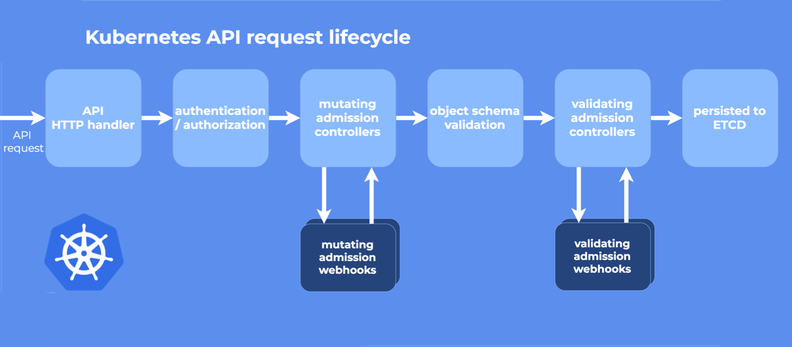
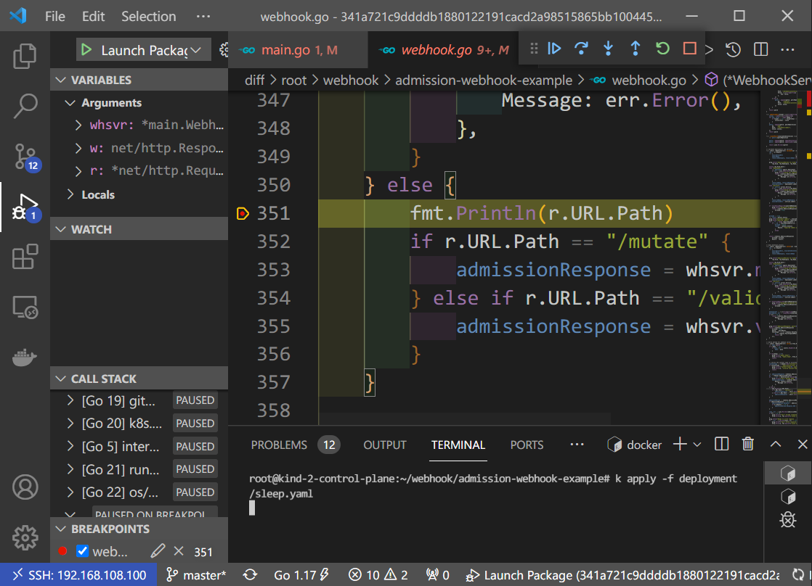

# 从0到1开发K8S_Webhook最佳实践


## 介绍

Webhook就是一种HTTP回调，用于在某种情况下执行某些动作，Webhook不是K8S独有的，很多场景下都可以进行Webhook，比如在提交完代码后调用一个Webhook自动构建docker镜像

K8S中提供了**自定义资源类型**和**自定义控制器**来扩展功能，还提供了**动态准入控制**，其实就是通过Webhook来实现准入控制，分为两种：[验证性质的准入 Webhook （Validating Admission Webhook）](https://kubernetes.io/zh/docs/reference/access-authn-authz/admission-controllers/#validatingadmissionwebhook) 和 [修改性质的准入 Webhook （Mutating Admission Webhook）](https://kubernetes.io/zh/docs/reference/access-authn-authz/admission-controllers/#mutatingadmissionwebhook)

Admission Webhook有哪些使用场景？如下

- 在资源持久化到ETCD之前进行**修改**（Mutating Webhook），比如增加init Container或者sidecar Container
- 在资源持久化到ETCD之前进行**校验**（Validating Webhook），不满足条件的资源直接拒绝并给出相应信息

现在非常火热的的 [Service Mesh](https://www.qikqiak.com/post/what-is-service-mesh/) 应用`istio`就是通过 mutating webhooks 来自动将`Envoy`这个 sidecar 容器注入到 Pod 中去的：https://istio.io/docs/setup/kubernetes/sidecar-injection/。

更多详情介绍可参考：https://kubernetes.io/zh/docs/reference/access-authn-authz/extensible-admission-controllers/

### Admission Webhook

上面提到K8S的**动态准入控制**是通过Webhook来实现的，那么它到底是在哪个环节执行的？请看下图



Webhook可以理解成Java Web开发中的Filter，每个请求都会经过Filter处理，从图中可以看到，先执行的是Mutating Webhook，它可以对资源进行修改，然后执行的是Validating Webhook，它可以拒绝或者接受请求，但是它不能修改请求

K8S中有已经实现了的Admission Webhook列表，详情参考[每个准入控制器的作用是什么？](https://kubernetes.io/zh/docs/reference/access-authn-authz/admission-controllers/#每个准入控制器的作用是什么)

## 从0到1开发K8S Webhook最佳实践

我们以一个简单的Webhook作为例子，该Webhook会在创建Deployment资源的时候检查它是否有相应的标签，如果没有的话，则加上（Mutating Webhook），然后在检验它是否有相应的标签（Validating Webhook），有则创建该Deployment，否则拒绝并给出相应错误提示

所有代码都在：https://github.com/scriptwang/admission-webhook-example

### 环境准备

K8S中Webhook的调用原理为首先向K8S集群中注册一个Admission Webhook（Validating / Mutating），所谓注册是向K8S集群注册一个地址，而实际Webhook服务可能跑在Pod里，也可能跑在开发机上；当创建资源的时候会调用这些Webhook进行修改或验证，最后持久化到ETCD中。

既然是开发，那么debug就很重要了，如果Webhook跑在Pod中，那么debug是一件很困难的事情，当然也有相应的Pod中debug的工具：[Squash](https://www.solo.io/blog/squash-microservices-debugger/)，此处不推荐（上次更新还是2019年而且文档少），有没有办法可以方便的debug呢？答案是有的，将Webhook服务跑在K8S集群的Master节点上提供端口给K8S调用即可，或者跑在K8S集群外部，然后使用ssh的端口转发功能，将端口转发到Master上，也可以。

所以此处推荐的环境是

Windows + Linux虚拟机 + docker环境 + Kind（在docker中运行K8S集群） +  Vscode远程开发（便于使用Linux工具链） + ssh端口转发

因为Webhook是跑在Linux虚拟机上，所以需要使用ssh进行**网络打通**，转发端口到K8S集群的Master节点上

当然也不用打通网络直接在Master上debug，这样需要单独在宿主机上部署K8S集群而不是通过Kind在容器里创建，搭建销毁重新集群等没有那么方便，而且需要的资源更多。

既然是从0到1，那么下面都会给出每个环境的安装使用教程以及选择该环境的理由，当然也列出了其他的选择。

#### 搭建K8S集群环境

首先得有个K8S集群，K8S集群搭建有下面几种方式

1. 创建多个虚拟机，然后使用kubeadm将多个虚拟机中，详情参考[**安装 Kubernetes**](https://kuboard.cn/install/install-k8s.html#文档特点)

2. 创建容器环境（可以是Docker Desktop或者虚拟中安装docker），在容器环境中快速搭建K8S集群，可以使用Kind，详情参考[Kind Quick Start](https://kind.sigs.k8s.io/docs/user/quick-start/)

第二种方式优点在于搭建十分快速，本质上K8S集群是跑在docker容器里面，K8S集群和宿主机共用docker守护进程，十分适合开发相关的场景，这里推荐第二种方式，并且是在Linux虚拟机中搭建docker环境，后文会提到，因为Linux虚拟机可以使用Vscode进行远程开发，可以很方便的使用Linux系统下的工具链，既然是从0到1，那么所有的安装步骤都准备好了

建议在Vmware中安装Linux CentOS，然后再安装Docker环境

1. 安装Vmware，请参考之前的文章：**2020-12-27_2021年Windows10装机必做的五件事**
2. 安装Linux虚拟机和docker环境，配置网络等，请参考之前的文章：**2021-01-05_5分钟在虚拟机中搭建Linux开发环境**
3. docker环境准备好之后，使用Kind创建K8S集群，命令如下

```bash
# 安装Kind
curl -Lo ./kind https://kind.sigs.k8s.io/dl/v0.11.1/kind-linux-amd64
chmod +x ./kind
mv ./kind /usr/local/bin/kind


# 创建一个集群，名字为kind，默认参数--name kind
kind create cluster 
```

它会下载镜像，然后启动K8S集群，`docker ps`看一下，如果有类似如下输出，说明集群启动成功

```
CONTAINER ID   IMAGE                   NAMES
416e3f1ccc55   kindest/node:v1.21.1    kind-control-plane
```

因为Kind方式搭建的K8S集群是使用的Ubuntu，所以使用`apt-get`安装一些常用软件

```bash
# 进入容器
docker exec -it kind-control-plane bash

# 更新仓库
apt-get update 
apt-get upgrade

# 安装常用软件
apt-get install -y telnet  # 测试端口
apt-get install -y net-tools # netstat
apt-get install -y ssh  # ssh工具，端口转发
apt-get install -y vim  # 编辑器
apt-get install -y jq   # 解析json
apt-get install -y iputils-ping   # ping
```

目前发现可能是由于iptables规则没有自动保存的原因，Kind创建的集群重启后Service资源链接不上，所以最好加一个开机自动加载iptables的脚本

```bash
# 保存规则
iptables-save > /etc/iptables.rules

# 开机自动加载
cat >/etc/network/if-pre-up.d/iptables-load.sh <<EOF
#!/bin/bash
iptables-restore < /etc/iptables.rules
EOF

# 赋予执行权限
chmod +x /etc/network/if-pre-up.d/iptables-load.sh
```

##### 检查是否开启了动态准入控制

查看APIServer是否开启了`MutatingAdmissionWebhook`和`ValidatingAdmissionWebhook`

````bash
# 获取apiserver pod名字
apiserver_pod_name=`kubectl get --no-headers=true po -n kube-system | grep kube-apiserver | awk '{ print $1 }'`
# 查看api server的启动参数plugin
kubectl get po $apiserver_pod_name -n kube-system -o yaml | grep plugin
````

如果输出如下，说明已经开启

```
- --enable-admission-plugins=NodeRestriction,MutatingAdmissionWebhook,ValidatingAdmissionWebhook
```

否则，需要修改启动参数，请不然直接修改Pod的参数，这样修改不会成功，请修改配置文件`/etc/kubernetes/manifests/kube-apiserver.yaml`，加上相应的插件参数后保存，APIServer的Pod会监控该文件的变化，然后重新启动。

#### 搭建开发环境

K8S是用Go语言写的，当然Webhook也应该使用GO语言开发，所以需要搭建GO语言的开发环境，此处IDE也有如下几种选择

1. 使用IDEA，在本地开发机上搭建GO开发环境
2. 使用Vscode远程开发功能，在第一步创建的Linux虚拟机中搭建GO开发环境（推荐）

此处推荐第二种方式，配置VScode远程开发详情参考之前的文章：**2021-08-21_Vscode远程开发初体验**，在Vscode中搭建GO语言开发环境步骤如下

1. 安装GO语言扩展，参考：https://marketplace.visualstudio.com/items?itemName=golang.Go
2. 鉴于国内网络环境，所以需要配置代理，打开`setting.json`，加上如下配置，这个很重要，否则GO的Debug环境是搞不定的

```json
// 配置工具环境的代理，让Vscode能通过代理下载必须的Go包
"go.toolsEnvVars": {
    "GOPROXY": "https://goproxy.io,direct",
    "GO111MODULE": "on"
},

//给linux终端默认配置上代理
"terminal.integrated.env.linux": {
    "GOPROXY": "https://goproxy.io,direct",
    "GO111MODULE": "on",
},
```

### webhook简单实例

下载代码：https://github.com/scriptwang/admission-webhook-example

文件列表如下

```bash
|-- Dockerfile
|-- LICENSE
|-- README.md
|-- build
|-- debug               # debug相关K8S配置
|   |-- mutatingwebhook.yaml
|   |-- service.yaml
|   |-- sleep-no-validation.yaml
|   |-- sleep-with-labels.yaml
|   |-- sleep.yaml
|   |-- sshportforward.sh
|   |-- validatingwebhook.yaml
|   |-- webhook-create-signed-cert.sh
|   `-- webhook-patch-ca-bundle.sh
|-- deployment           # 部署相关K8S配置
|   |-- deployment.yaml
|   |-- mutatingwebhook.yaml
|   |-- rbac.yaml
|   |-- service.yaml
|   |-- sleep-no-validation.yaml
|   |-- sleep-with-labels.yaml
|   |-- sleep.yaml
|   |-- validatingwebhook.yaml
|   |-- webhook-create-signed-cert.sh
|   `-- webhook-patch-ca-bundle.sh
|-- go.mod
|-- go.sum
|-- main.go     # webhook核心文件，启动server，监听端口
|-- mod.sh
|-- webhook.go  # webhook核心文件，处理业务逻辑

```

其中`main.go`和`webhook.go`是整个webhook的核心，前者用于启动Server，监听端口，后者用于实现核心业务逻辑

##### `webhook.go`

其核心在serve方法，根据传进来的path判断是mutate还是validate，然后执行相应的操作，这个path是自己在MutatingWebhookConfiguration或者ValidatingWebhookConfiguration中定义的

````go

// 定义WebhookServer
type WebhookServer struct {
	server *http.Server
}

// 核心业务逻辑实现
func (whsvr *WebhookServer) serve(w http.ResponseWriter, r *http.Request) {
	//拿到Apiserver传进来的body
    var body []byte
	if r.Body != nil {
		if data, err := ioutil.ReadAll(r.Body); err == nil {
			body = data
		}
	}
	....

    //根据传进来的path判断是mutate还是validate
	var admissionResponse *v1beta1.AdmissionResponse
	ar := v1beta1.AdmissionReview{}
	if r.URL.Path == "/mutate" {
        admissionResponse = whsvr.mutate(&ar)
    } else if r.URL.Path == "/validate" {
        admissionResponse = whsvr.validate(&ar)
    }

    //回写response
	glog.Infof("Ready to write reponse ...")
	if _, err := w.Write(resp); err != nil {
		glog.Errorf("Can't write response: %v", err)
	}
}


//mutate处理
func (whsvr *WebhookServer) mutate(ar *v1beta1.AdmissionReview) *v1beta1.AdmissionResponse {
	//根据不同的资源类型做处理
	switch req.Kind.Kind {
	case "Deployment":
		...
	case "Service":
		...
	}

	
}

//validate处理
func (whsvr *WebhookServer) validate(ar *v1beta1.AdmissionReview) *v1beta1.AdmissionResponse {
    //根据不同的资源类型做处理
	switch req.Kind.Kind {
	case "Deployment":
		...
	case "Service":
		...
	}
}
````


##### `main.go`

启动服务，监听在443端口

```go
func main() {

	//启动httpserver
	whsvr := &WebhookServer{
		server: &http.Server{
			Addr:      fmt.Sprintf(":%v", parameters.port),
			TLSConfig: &tls.Config{Certificates: []tls.Certificate{pair}},
		},
	}

	// 注册handler
	mux := http.NewServeMux()
	mux.HandleFunc("/mutate", whsvr.serve)
	mux.HandleFunc("/validate", whsvr.serve)
	whsvr.server.Handler = mux

	// 启动协程来处理
	go func() {
		if err := whsvr.server.ListenAndServeTLS("", ""); err != nil {
			glog.Errorf("Failed to listen and serve webhook server: %v", err)
		}
	}()

	glog.Info("Server started")

	// listening OS shutdown singal
	signalChan := make(chan os.Signal, 1)
	signal.Notify(signalChan, syscall.SIGINT, syscall.SIGTERM)
	<-signalChan

	glog.Infof("Got OS shutdown signal, shutting down webhook server gracefully...")
	whsvr.server.Shutdown(context.Background())
}
```


### webhook简单实例部署

所谓部署，是将webhook服务编译好并创建镜像，然后推送到远程仓库，再将这个镜像部署成Pod，当然镜像这里已经准备好了，不需要创建，这里想表达的是先部署起来看看能不能跑，能跑在说后面的创建镜像和debug等

部署流程如下

#### 1. 创建RBAC

由于我们的webhook会对资源进行修改，所以需要单独给一个ServiceAccount，在K8S集群中直接创建即可

```bash
kubectl apply -f deployment/rbac.yaml
```

#### 2. 证书认证

K8S集群默认是HTTPS通信的，所以APiserver调用webhook的过程也是HTTPS的，所以需要进行证书认证，证书认证相当于是给Service的域名进行认证（Service后面会创建），将Service域名放到认证请求`server.csr`文件中，然后创建一个K8S证书签署请求资源CertificateSigningRequest，APIServer签署该证书后生成`server-cert.pem`，再将最初创建的私钥`server-key.pem`和签署好的证书`server-cert.pem`放到Secret中供Deployment调用，详细过程看脚本`webhook-create-signed-cert.sh`

认证很简单，执行该脚本即可，会创建一个名为`admission-webhook-example-certs`的Secret

```
./deployment/webhook-create-signed-cert.sh
```

这一步顺便把Service创建了，因为证书是给该Service的域名颁发的

```
kubectl apply -f deployment/service.yaml
```

#### 3. 部署Deployment

看一下Deployment的编排文件，serviceAccount和secret依次是上面两步创建的

```yaml
apiVersion: apps/v1
kind: Deployment
metadata:
  name: admission-webhook-example-deployment
  labels:
    app: admission-webhook-example
spec:
  replicas: 1
  selector:
    matchLabels:
      app: admission-webhook-example
  template:
    metadata:
      labels:
        app: admission-webhook-example
    spec:
      # 之前在RBAC中创建的serviceAccount
      serviceAccount: admission-webhook-example-sa
      containers:
        - name: admission-webhook-example
          # 该镜像已经存在
          image: kimoqi/admission-webhook-example:v1
          imagePullPolicy: Always
          args:
            - -tlsCertFile=/etc/webhook/certs/cert.pem
            - -tlsKeyFile=/etc/webhook/certs/key.pem
            - -alsologtostderr
            - -v=4
            - 2>&1
          volumeMounts:
            - name: webhook-certs
              mountPath: /etc/webhook/certs
              readOnly: true
      volumes:
        - name: webhook-certs
          secret:
            # 第二步中创建的Secret，用于证书认证
            secretName: admission-webhook-example-certs

```

部署Deployment

```
kubectl apply -f deployment/deployment.yaml
```

稍等片刻如果有类似如下输出说明Pod已经运行

```bash
kubectl get po 
NAME                                       READY   STATUS 
admission-webhook-example-deployment-xxx   1/1     Running
```

可以新开一个窗口查看对应日志配合验证

```bash
kubectl logs -f admission-webhook-example-deployment-xxx
```


#### 4. 部署ValidatingWebhook

首先包含一个`namespaceSelector`，表示此webhook只针对有`admission-webhook-example`标签的namespace生效，当然也可以去掉

```yaml
  namespaceSelector:
      matchLabels:
        admission-webhook-example: enabled
```

查看编排文件`deployment/validatingwebhook.yaml`，里面有一个占位符`${CA_BUNDLE}`

```yaml
lientConfig:
    service:
    name: admission-webhook-example-svc
    namespace: default
    path: "/validate"  # Path是我们自己定义的
    caBundle: ${CA_BUNDLE}
```

这个是什么呢？webhook是APIServer调用的，此时APIServer相当于是一个客服端，webhook是一个服务端，可以对比下平时上网，打开https网站时是谁在验证域名的证书？是内置在浏览器里面的根证书在做验证，所以这里的`CA_BUNDLE`就类似于APIServer调用webhook的根证书，它去验证webhook证书。

所以先填充这个`CA_BUNDLE`后再执行

```bash
# 填充占位符
cat deployment/validatingwebhook.yaml | ./deployment/webhook-patch-ca-bundle.sh > /tmp/validatingwebhook.yaml

# 部署
kubectl apply -f /tmp/validatingwebhook.yaml
```

#### 5. 验证

1. 给default namespace添加label

```bash
kubectl label namespace default admission-webhook-example=enabled
```

2. 部署`sleep.yaml`

```bash
kubectl apply -f deployment/sleep.yaml
```

会发现有报错，如下

```
rror from server (required labels are not set): error when creating "deployment/sleep.yaml": admission webhook "required-labels.qikqiak.com" denied the request: required labels are not set
```

这正是我们webhook中的逻辑，说明验证成功

还有两个测试用的编排文件，下面一一说明

- `sleep-no-validation.yaml`：加上了`admission-webhook-example.qikqiak.com/validate: "false"`标签，所以能创建成功，这是我们webhook中的逻辑
- `sleep-with-labels.yaml`：加上了对应的标签，所以能创建成功，这是我们webhook中的逻辑

#### 6. 部署MutatingWebhook

部署流程和ValidatingWebhook一致，需要注意的是validate的逻辑上没有对应的标签拒绝创建，而mutate的逻辑没有对应的标签会加上对应的标签，而且执行顺序是先执行mutate再执行validate，所以有以下情况

- 只部署`ValidatingWebhook`：没有对应标签的资源会被拒绝创建
- 只部署`MutatingWebhook`：没有对应标签的资源会加上对应标签，然后成功创建
- 两者都部署：没有对应标签的资源会加上对应标签，也会通过`ValidatingWebhook`的验证，最终成功创建

### webhook简单实例调试

每次更改代码后，需要重新编译二进制，重新创建镜像，然后推送到镜像仓库，详情请参考`build`文件中的内容，最后重新部署，然后执行测试用例，那有没有办法进行调试呢？答案是有的

在我们现在的环境下（Vscode远程开发，远程Linux是虚拟机，K8S跑在docker中），可以在远程Linux机器上以debug的形式运行该webhook服务，然后通过ssh端口转发将端口转发到K8S的Master节点上进行调用，下面详细说明

#### 1. 创建RBAC

**如果在上面部署的时候创建过，此处不需要创建**，当然也可以给debug单独创建一个ServiceAccount，此处直接用之前创建的

> 由于我们的webhook会对资源进行修改，所以需要单独给一个ServiceAccount，在K8S集群中直接创建即可
>
> ```bash
> kubectl apply -f deployment/rbac.yaml
> ```

#### 2. 证书认证

详细的认证过程这里不再赘述，参考上一步骤中证书认证相关章节，此处需要说明的是，证书认证是和Service绑定在一起的，所以此处新认证一个证书专门用来debug

```
./debug/webhook-create-signed-cert.sh
```

注意debug下面的`webhook-create-signed-cert.sh`脚本最后将证书保存到了`/etc/webhook/certs/`目录下，如下

```bash
kubectl get secret ${secret} -o json | jq -r '.data."key.pem"' | base64 -d > /etc/webhook/certs/key.pem
kubectl get secret ${secret} -o json | jq -r '.data."cert.pem"' | base64 -d > /etc/webhook/certs/cert.pem
```

但是这个脚本是在K8S集群（也就是docker容器中）执行的，所以`/etc/webhook/certs/`这个目录是存在是容器中，现在webhook服务在Linux虚拟机上执行的，所以要把相应的证书目录进行更改

容器中的目录在宿主机上也能找到（在宿主机上执行），如下，`kind-control-plane`为容器的名字，请根据实际修改

```bash
merged_dir=`docker inspect kind-control-plane | jq -r '.[].GraphDriver.Data.MergedDir'`
```

修改`main.go`中的证书目录，将`merged_dir`替换成上面得到的值

```go
flag.StringVar(&parameters.certFile, "tlsCertFile", 
"$merged_dir/etc/webhook/certs/cert.pem",
"File containing the x509 Certificate for HTTPS.")

flag.StringVar(&parameters.keyFile, "tlsKeyFile",
"$merged_dir/etc/webhook/certs/key.pem",
"File containing the x509 private key to --tlsCertFile.")
```

---

创建Service，请注意，其中一个占位符`K8S_MASTER_IP`，请修改成K8S Master的IP，可通过如下命令获取，`kind-control-plane`为容器的名字，请根据实际修改

```bash
K8S_MASTER_IP=`docker inspect -f '{{range .NetworkSettings.Networks}}{{.IPAddress}}{{end}}' kind-control-plane`
```

最后创建Service，注意，当K8S集群重启后可能K8S集群Master IP会变化，所以连不上上检查此IP是否发生了变化

```
kubectl apply -f debug/service.yaml
```

#### 3. 运行webhook

证书修改好以后才能在运行webhook，首先要在LInux虚拟机上以debug的形式运行webhook，在VSCode中（Run And Debug）添加如下debug配置，注意是`Launch Package`，然后在必要的地方添加断点

```json
{
    "name": "Launch Package",
    "type": "go",
    "request": "launch",
    "mode": "auto",
    "program": "${fileDirname}"
}
```

然后打开`main.go`文件，然后在`Run And Debug`窗口顶部中点击三角形图标进行debug，此时debug console应该有类似输出

```
Detaching and terminating target process
dlv dap (215232) exited with code: 0
Starting: /home/go/bin/dlv-dap dap --listen=127.0.0.1:46002 --log-dest=3
DAP server listening at: 127.0.0.1:46002

```

然后可以测试下端口是否通

```
telnet 127.0.0.1 443
```

此时程序已经准备就绪，现在就差向K8S注册Webhook了

#### 4. 打通网络

目前webhook服务是跑在集群外面的，集群里面连不到，所以需要将端口进行转发，此处使用ssh进行端口转发

注意`K8S_MASTER_IP`和在证书认证创建Service的证书是一致的

```
K8S_MASTER_IP=`docker inspect -f '{{range .NetworkSettings.Networks}}{{.IPAddress}}{{end}}' kind-control-plane`
```

利用ssh进行端口转发，将127.0.0.1（也就是Linux虚拟机）的443端口转发到K8S集群中（也就是容器里），注意此处一定不能监听的K8S Master节点的127.0.0.1上，因为Service的EndPoint的目标Port不能设置为127.0.0.1

```bash
ssh -N -f -R0.0.0.0:443:127.0.0.1:443 root@${K8S_MASTER_IP}
```

查看是否监听成功，监听在0.0.0.0上表示本机上所有的IPv4地址，注意，当K8S集群重启后需要重新打通网络，而且目前有可能K8S集群Master IP会变化

```
netstat -antp | grep LISTEN | grep 443

tcp        0      0 0.0.0.0:443             0.0.0.0:*               LISTEN      7451/sshd: root     
tcp6       0      0 :::6443                 :::*                    LISTEN      570/kube-apiserver  
```

如果没有安装SSH（容器中默认没有安装ssh服务），请参考如下步骤安装

1. 安装ssh服务

```bash
apt-get install -y ssh  # ssh工具，端口转发
```

2. 修改配置，注意一定要加上`GatewayPorts`和`PermitRootLogin`的配置

```bash
vim /etc/ssh/sshd_config

# 主要加上下面两句
GatewayPorts clientspecified # 监听的端口让客户端来指定
PermitRootLogin yes          # 允许root登录
```

3. 启动ssh服务

```bash
/etc/init.d/ssh start
```

4. 修改密码

```bash
passwd
```

关于ssh转发后监听在目标主机的127.0.0.1而不是eth0上有两种办法

1. 编辑`sshd_config`配置，添加`GatewayPorts clientspecified`

2. 曲线救国，先监听在127.0.0.1，然后在目标主机上在转发监听到eth0上

   1. 先将本地443转发到转发到192.168.1.5的444端口：`ssh -N -f -R192.168.1.5:444:127.0.0.1:444 root@192.168.1.5`，此时远端没设置`GatewayPorts clientspecified`的话只会监听的127.0.0.1上

   2. 在192.168.1.5上再执行`ssh -g -L 443:localhost:444root@192.168.1.5`，将本机的444端口再转发到443端口上，监听在`0.0.0.0`，也就是所有网卡设备上

      ```
                      Remote         
      --------         |-------------------------------------------------
      |client|-------->| Port 444 ----    // (127.0.0.1:444  LISTEN)
      --------         |                |
                       | Port 443 <---    // (0.0.0.0:443    LISTEN)
                       |--------------------------------------------------
      ```

参考：https://serverfault.com/questions/997124/ssh-r-binds-to-127-0-0-1-only-on-remote

#### 5. 部署ValidatingWebhook

ValidatingWebhook或MutatingWebhook的部署和之前类似，不过注意部署时候需要修改成debug目录中的资源，因为Service名字已经变化了

```bash
# 填充占位符
cat debug/validatingwebhook.yaml | ./debug/webhook-patch-ca-bundle.sh > /tmp/validatingwebhook.yaml

# 部署
kubectl apply -f /tmp/validatingwebhook.yaml
```

#### 5. 验证

1. 给default namespace添加label

```bash
kubectl label namespace default admission-webhook-example=enabled
```

2. 部署`sleep.yaml`

```bash
kubectl apply -f deployment/sleep.yaml
```

如果能进入断点说明成功，如下图所示



debug中最关键的是要将K8S集群内外的网络打通

# 参考

- https://serverfault.com/questions/997124/ssh-r-binds-to-127-0-0-1-only-on-remote
- https://kind.sigs.k8s.io/docs/user/quick-start/#creating-a-cluster
- https://www.qikqiak.com/post/k8s-admission-webhook/
- http://www.iceyao.com.cn/2019/06/05/%E7%8E%A9%E8%BD%ACK8s-AdmissionWebhook/

