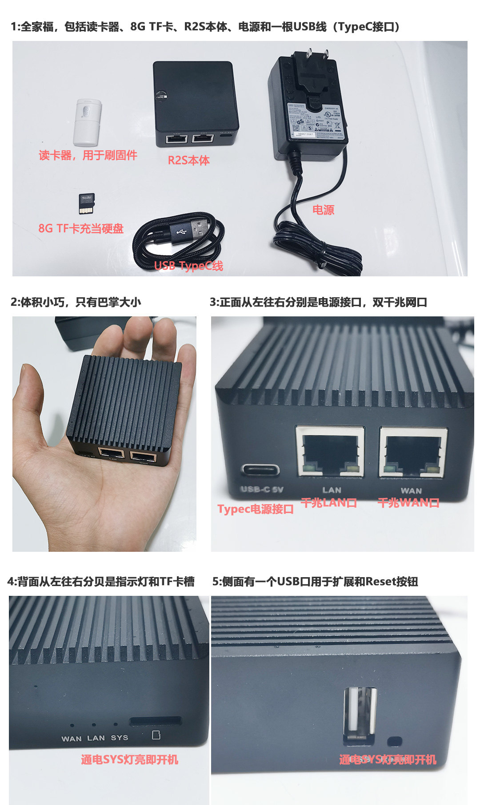
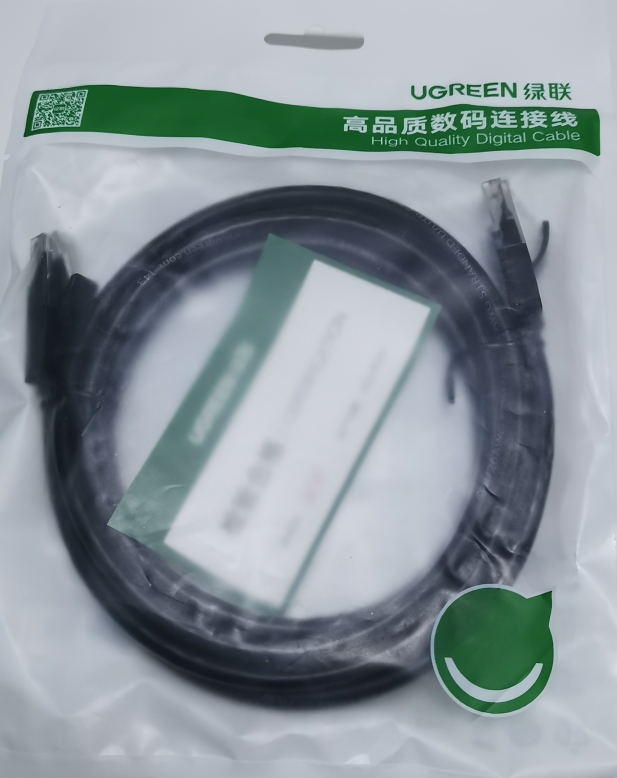
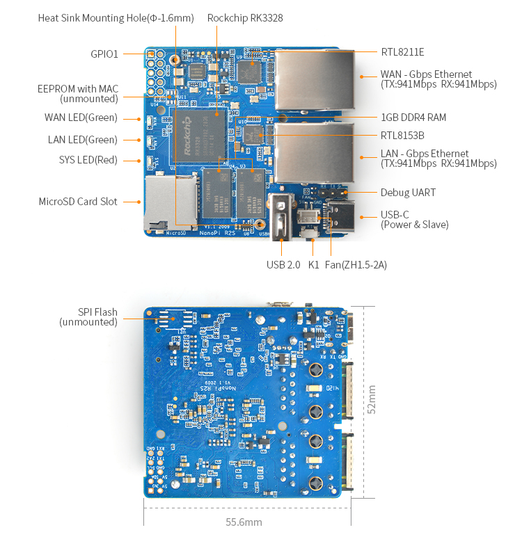
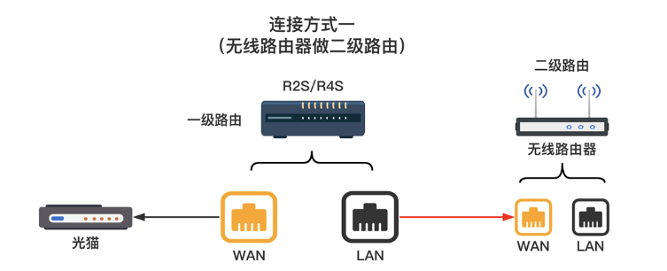
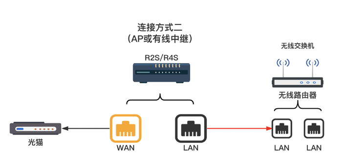
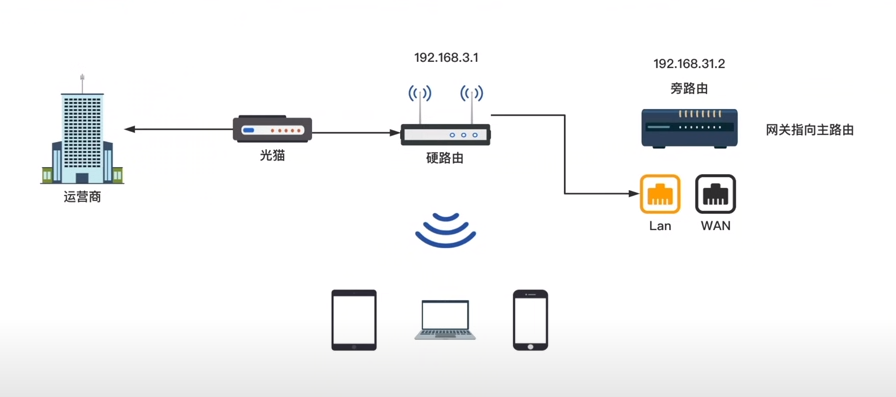
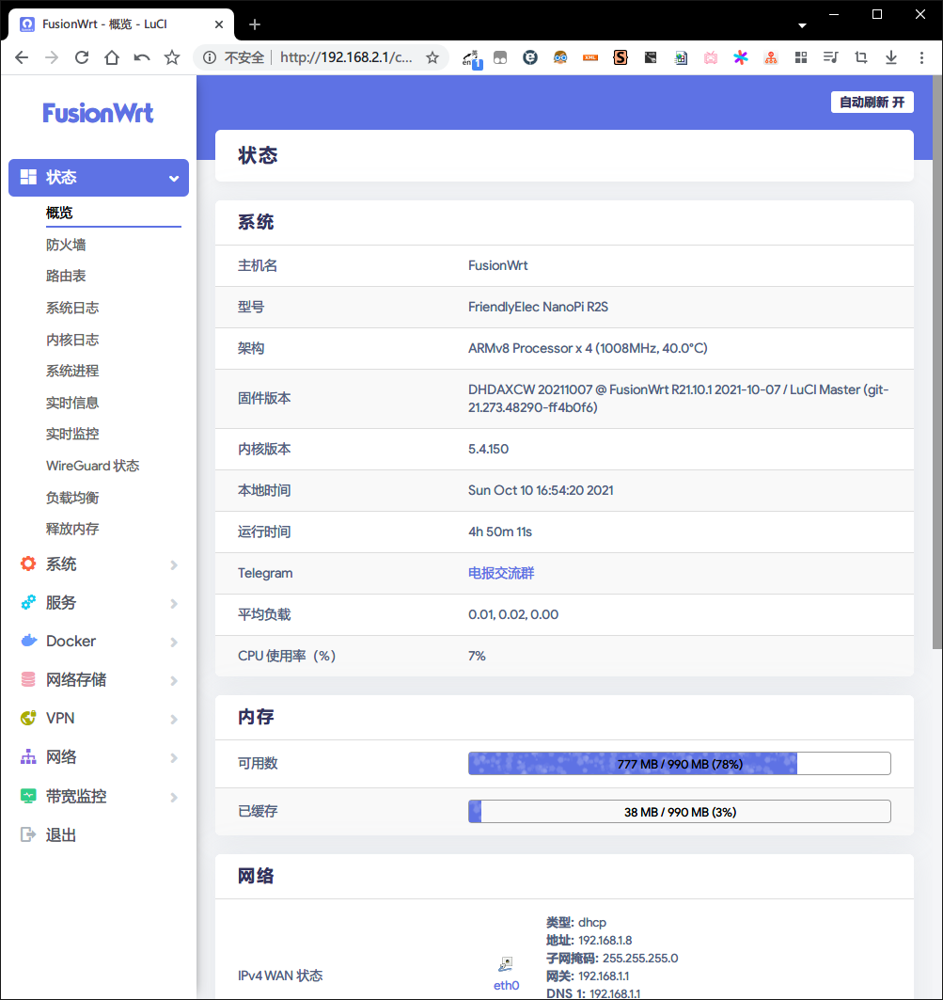
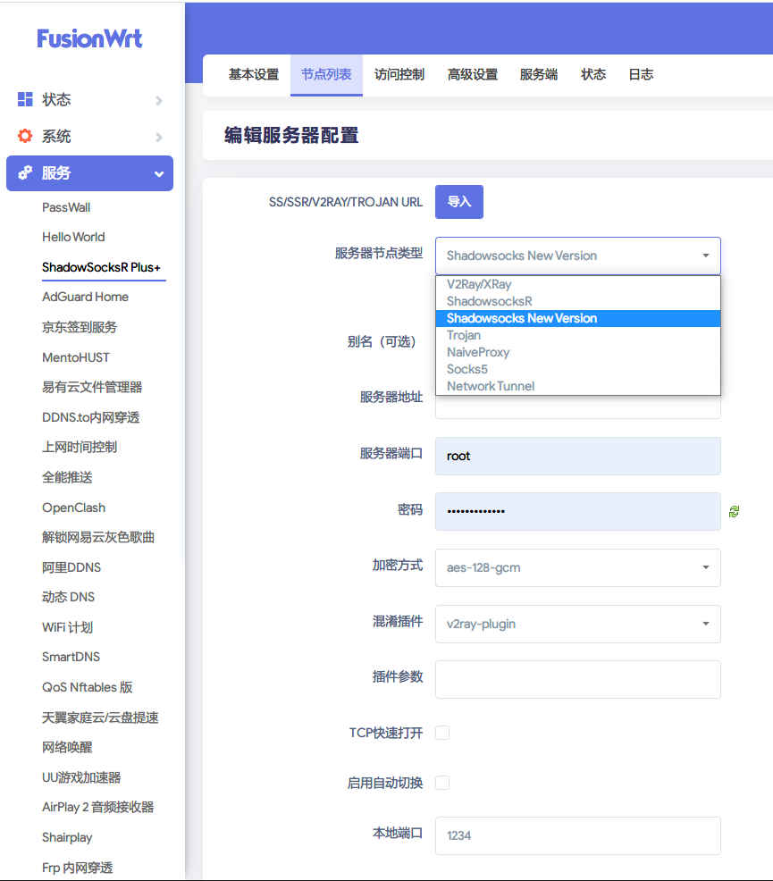

# 【好物评测】家庭必备上网神器——最小双千兆入门级软路由R2S

想看评测的朋友直接跳到后面**为什么是R2S**章节

## 软路由是什么

软路由是什么？首先引用百科

> 软路由是指利用台式机或服务器配合软件形成路由解决方案，主要靠软件的设置，达成[路由器](https://baike.baidu.com/item/路由器/108294)的功能；而[硬路由](https://baike.baidu.com/item/硬路由/6801739)则是以特有的硬设备，包括处理器、电源供应、[嵌入式软件](https://baike.baidu.com/item/嵌入式软件/5345503)，提供设定的路由器功能。

说人话就是首先它是一个路由器，是一个纯靠软件来武装的路由器，而这个软件本身也是开源的，任何人都可以按照自己的需求进行定制化，这是软路由很具有可玩性的原因。

软路由在十年前的情况是，因为当时主流是使用海外路由固件，使用者需要基本一定的网络知识和动手能力，通过论坛、QQ讨论问题，硬件一般选择二手PC改造，十年后的现在，也有专门针对软路由通过定制硬件的厂家和提供服务的个人或团体，一些传统硬路由厂家，也有发布过软件固件，得益于X86架构的性能和市场普及，用户觉得CPU不行可以换，内存不够可以加，电源坏了可以换，硬盘不够再上一块，软路由性能取决于选择的硬件性能。

相反，硬路由就是我们普遍使用的路由器，由厂家提供整体的解决方案，包括路由器的硬件和软件，那么就不存在所谓的个人定制化了，见过哪个厂商为你的禾斗学X上网需求做定制化的么？鉴于国内环境，做了也是件政治不正确的事情。

当然硬路由也不是一无是处，软路由优势是定制化，一堆的插件，弱势是没有硬转发芯片和硬NAT，硬路由反之，在一些企业级的数据中心还是得靠硬路由（因为软路由是基于通用硬件架构的，没有给特殊场景特殊硬件优化，好比现在苹果的M1芯片在图像处理方面的特殊优化，拿弱势和别人的强势比比不过也很正常）

既然软路由的核心在于软件，那么这个神秘的软件是什么？软路由大多使用OpenWRT或者基于OpenWRT衍生和修改的系统，例如LEDE（2018年1月与OpenWRT又宣布合并），koolshare，Merlin（梅林），ikuai（爱快）等。

### OpenWRT简介

项目官网：https://openwrt.org/

> **OpenWrt**是适合于[嵌入式](https://zh.wikipedia.org/wiki/嵌入式)设备的一个[Linux](https://zh.wikipedia.org/wiki/Linux)发行版。
>
> 相对原厂固件而言，OpenWrt不是一个单一、静态的[固件](https://zh.wikipedia.org/wiki/固件)，而是提供了一个可添加软件包的可写的[文件系统](https://zh.wikipedia.org/wiki/文件系统)。这使用户可以自由的选择应用程序和配置，而不必受设备提供商的限制，并且可以使用一些适合某方面应用的软件包来定制你的设备。
>
> 对于开发者来说，OpenWrt是一个框架，开发者不必麻烦地构建整个固件就能得到想要的[应用程序](https://zh.wikipedia.org/wiki/应用程序)；对于用户来说，这意味着完全定制的能力，与以往不同的方式使用设备，OPKG包含超过3500个软件。 默认使用LuCI作为web交互界面。

其实OpenWRT本质上就是一个完整内核的Linux系统

## 哪些场景需要软路由

- 禾斗学X上网：这其实是大多数人使用软路由的场景（这其实也是我的**核心需求**），现在禾斗学X上网有几种方式，第一种是终端设备下载客户端然后导入对应线路，设备少还好，如果家庭设备太多，而且OS还不同的话那么导入就很麻烦了，所以将软路由作为家庭所有设备的接入点，软路由能科学了，那么家庭里面挂在软路由下面的设备都能科学，一劳永逸，而且软路由还带有丰富的功能如线路异常切换，定时更新网站列表，客户端访问规则等一系列的功能。
- 文件共享：软路由本质上就是一台Linux服务器，所以可以挂个大硬盘在上面供所有局域网设备进行文件功能，文件功能的协议就太多了，Samba、NFS、FTP、HTTP，还有各种网盘之类。
- 挂机下载BT/PT：比如迅雷、百度网盘、BT、PT之类挂机上传下载，因为软路由就和家里面的光猫一样，不怎么关机，常年开着，对于挂机下载场景尤其合适（当然，其他终端设备也可以挂机，只是功耗太高）
- 上网行为精细化控制：特别适合家里有小孩的场景，软路由可以直接限定对某个设备（通过设备MAC地址）指定时间开放网络，指定某些网站不能访问，并且还可以指定QoS（限速）
- 上网数据监控/统计：在软路由下挂着的设备流量都要经过软路由，所以理论上软路由是可以监控所有设备的数据。
- 远程唤醒：所谓远程唤醒即远程开机，因为软路由常年不关机，可以通过内网穿透等方式在Internet上给软路由发送指令，发送给指定MAC地址的网卡设备，网卡设备将唤醒对应终端设备（需要相关设置）
- ...

那么哪些场景不适合软路由呢？假如你的需求只是能连个wifi上个国内网就行，没啥其他的特殊需求，那其实不适合上软路由，因为毕竟也是需要折腾的。

## 为什么是R2S

软路由这么多，为什么是R2S？RS2全称**友善NanoPi R2S** ，是友善电子团队最新推出的一款实现满速率双千兆的、完全开源的Iot应用神器。NanoPi R2S 使用RK3328 CPU，有两个千兆网络，1G DDR4内存，友善电子团队为NanoPi R2S专门移植了OpenWrt系统，支持Docker CE, 完全开源，用于企业物联网二次开发，个人定制NAS，家庭物联网网关等

R2S的特点

- 价格便宜（裸机269），入门首选
- 体积小，巴掌大小
- ARM架构，低功耗
- 被动散热，无风扇，无噪音
- 硬盘可扩展，内置USB（USB2.0）

R2S太适合入门了, X86软路由大多数是一些工控机良莠不齐, 往往需要花很多时间来找满意的机器, 而R2S是一个真正为软路由设计的产品, 有官方的OpenWRT固件支持, 相比X86体验一点不差, 说到刷机体验, 那也是相当友好

## 开箱

### 外观




另外需准备两条千兆网线，如下图这种，几块到几十块不等




### 硬件结构与配置



配置详情

- CPU: Rockchip RK3328, Quad-core Cortex-A53
- DDR4 RAM: 1GB
- Network：
  - 10/100/1000M以太网口 x 1
  - USB3.0转10/100/1000M以太网口 x 1
- USB2.0 Host: Type-A x1
- MicroSD Slot x 1
- MicroUSB: 供电和Slave功能
- Debug Serial Port: 3.3V TTL电平，3Pin 2.54mm间距排针
- LED: LED x 3
- KEY: KEY x 1 用户自定义功能
- PC Size: 55.6 x 52mm
- Power Supply: DC 5V/2A
- Temperature measuring range: 0℃ to 80℃
- OS/Software: U-boot，Ubuntu-Core，OpenWrt

官方wiki参考：https://wiki.friendlyarm.com/wiki/index.php/NanoPi_R2S/zh

## 使用方法

### 网络拓扑

拿到R2S后第一件事情就是思考怎么接线，网络拓扑是怎样的，由于R2S只有一个WAN口一个LAN口并且没有无线网卡，所以还需要另购置一个路由器用于局域网设备接入（如果没有现成的路由器），目前有三种玩法

1. R2S直接接在光猫后，做**主路由**，原来的路由器WAN口接在R2S LAN口做二级路由，如下图所示，优点是接线即可用（要确R2S和原来的路由器不再一个网段，因为两个路由器管两个网段的设备，处于同一个网段就冲突了），缺点也很明显，需要多一次路由转发



2. R2S直接接在光猫后，做**主路由**，原来的路由器LAN口接在R2S 的LAN口并设置为AP模式，此时路由器相当于一个**交换机**，扩充了R2S的网络接口，而且还有无线功能，需要保证原来的路由器和R2S在一个网段，并且不需要多一次路由转发，**推荐这种方式**

   

3. R2S做旁路由，原来的组网方式不变，光猫连着主路由器，把R2S的LAN口接在路由器的LAN口，R2S和主路由在同一个网段，并且R2S的网关指向主路由，优点是原来的组网方式不变，局域网中出现两个网关，根据自己的需求进行设置，想走主路由网关就设置成主路由，想走R2S网关就设置成R2S的IP



我这里选择的是第二种方式

### 固件

2020 年 7 月 28 日，OpenWrt 官方主线加入了对 NanoPi R2S 的正式支持，使用 Longterm Kernel 5.4 内核。

固件分为 Ext4 版和 SquashFS 版，除了新人启动 SquashFS 的固件一直失败，实在没办法启动，才建议使用 Ext4 固件。Ext4 固件不能使用 firstboot 等操作，误操作后无法重置系统，大部分原生固件都为 SquashFS，部分为并存。

选择固件主要看源码来源，更新频率，使用人数，稳定性和普遍性等因素，在使用了几个固件后（骷髅头、小朋友编译、404等）此处推荐骷髅头编译的固件，地址如下

- https://github.com/DHDAXCW/NanoPi-R2S-2021

刷固件方法：

1. 登录R2S后台（前提是R2S已经有了可以正常使用的固件），一般IP为`192.168.2.1`，用户`root`，密码`password`，登录后以此选择系统 > 备份/升级 > 刷写新固件，选择下载`xxxx-sysupgrade.img.gz`的文件后，点击刷新固件，R2S会将固件上传然后刷写，等待几分钟即可，推荐这种方法，简单快捷，但有时候出问题的话就需要用到第二种办法了
2. 通过[balenaEtcher](https://www.balena.io/etcher/?ref=etcher_footer)工具，将TF卡从R2S取出插入读卡器连接电脑，打开balenaEtcher，然后选择固件 > 选择磁盘（TF卡） > 开始刷写，刷写完后将TF卡插入R2S通电即可进入开机流程

骷髅头的固件刷完之后长这样，一般IP为`192.168.2.1`，用户`root`，密码`password`，登录后第一件事情改密码，我刷的是带docker版本的，有时候需要玩玩docker，如果只是禾斗学X上网可以刷一个精简版（stable），安全稳定



## 功能列表

我刷的是全插件版，功能实在太多了，我把左侧栏的功能全部列了出来，如下

```
状态
	概览
	防火墙
	路由表
	系统日志
	内核日志
	系统进程
	实时信息
	实时监控
	WireGuard 状态
	负载均衡
	释放内存
系统
	Web 管理
	系统
	管理权
	软件包
	TTYD 终端
	启动项
	计划任务
	挂载点
	磁盘管理
	LED 配置
	备份/升级
	自定义命令
	定时重启
	文件传输
	重启
	Argon 主题设置
	CPU Freq
服务 
	PassWall
	Hello World
	SS..R Plus+
	AdGuard Home
	京东签到服务
	MentoHUST
	易有云文件管理器
	DDNS.to内网穿透
	上网时间控制
	全能推送
	OpenClash
	解锁网易云灰色歌曲
	阿里DDNS
	动态 DNS
	WiFi 计划
	SmartDNS
	QoS Nftables 版
	天翼家庭云/云盘提速
	网络唤醒
	UU游戏加速器
	AirPlay 2 音频接收器
	Shairplay
	Frp 内网穿透
	UPnP
	Frps
	KMS 服务器
	HAProxy
	udpxy
	Nps 内网穿透
	Tinyproxy
	迅雷快鸟
	MWAN3 分流助手
Docker
	概览
	容器
	镜像
	网络
	存储卷
	事件
	配置
网络存储
	文件助手
	文件浏览器
	可道云
	NFS 管理
	储存同步
	微力同步
	PS3 NET 服务器
	USB 打印服务器
	硬盘休眠
	网络共享
	PCHiFi 数字转盘遥控
	GoWebDav
	MJPG-streamer
	Rclone
	miniDLNA
	FTP 服务器
	Aria2 配置
	Transmission
	挂载 SMB 网络共享
	qBittorrent
	BaiduPCS Web
网络
	接口
	访客网络
	DHCP/DNS
	主机名
	IP/MAC绑定
	静态路由
	诊断
	防火墙
	SQM QoS
	Socat
	UDP工具
	多线多拨
	负载均衡
	Turbo ACC 网络加速
宽带监控
	显示
	配置
	备份
	实时流量监测
```


### 禾斗学X上网

以前担心软路由不支持ss+v兔ray插件的方式，现在看来是我多虑了，SS..R Plus+基本支持全协议了，甚至包括v兔ray插件或者自定义插件的方式，总之完全能满足我透明代X理的需求，还带有丰富的功能如线路异常切换，定时更新网站列表，客户端访问规则等。当然还有Pass Wall Hello World Open Clash等也集成了进来，姿势可谓十分丰富，感兴趣的可以深入研究



### 文件共享

```
服务 
	易有云文件管理器
网络存储
	文件助手
	文件浏览器
	可道云
	NFS 管理
	网络共享
	FTP 服务器
	挂载 SMB 网络共享
	
```

文件共享姿势就太多了，上面列表挨个试试吧，Windows直接Samba协议完事

### 文件挂机下载

```
网络存储
	Aria2 配置
	Transmission
	qBittorrent
	BaiduPCS Web
```

BT挂机，百度挂机，可以试试以上功能

### 上网控制

```
服务 
	上网时间控制
```

### 远程开机

```
服务
	网络唤醒
```

### 内网穿透

```
服务 
	DDNS.to内网穿透
	Frp 内网穿透
```

### 解锁网易云

原理是通过其他音源（如酷我）替代网易云里面灰色的音源

```
服务 
	解锁网易云灰色歌曲
```

### 动态DNS

```
服务 
	阿里DDNS
	动态 DNS
```

### 游戏加速

```
服务
    UU游戏加速器
```

### KMS服务器

```
服务
    KMS 服务器
```

### 宽带监控

```
宽带监控
	显示
	配置
	备份
	实时流量监测
```


