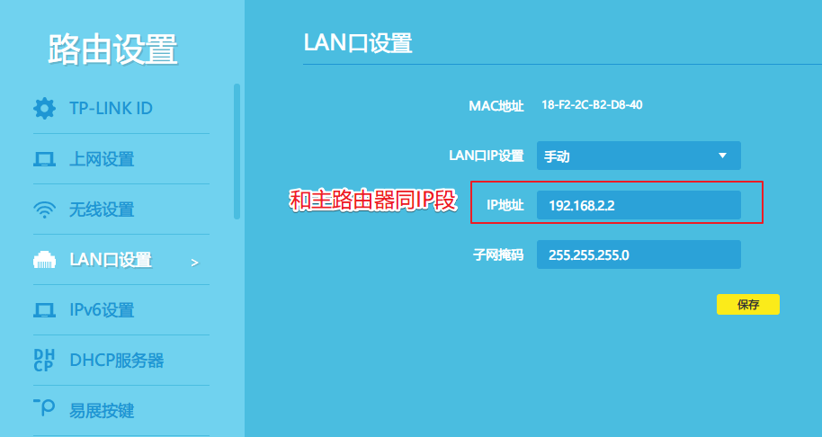

# 【好物评测】家庭千兆局域网组建神器——TP-LINK AC1900M路由器


## 开箱

包装就不展示了，直接展示内容，包装清单

- 路由器本体
- 电源线
- 原装千兆网线一根
- 用户手册（没啥用，手册上连个配置参数都找不到）


拍的不好将就看，来张官网渲染图，看起来像个异形.....


尾部左边是三个千兆LAN口，右边一个千兆WAN口


这款路由器一般商家都会给这样一个标题：**双频全千兆分布式大户型智能**无线路由器

- 双频？双频啥意思，有什么作用能作为卖点？
- 千兆？千兆自不用说，因为接口是千兆的
- 分布式大户型？路由器能加上分布式标签？分布式有啥用？分布式了就能适配大户型？
- 智能？到底哪里智能了？

后面一一纤细解释

## 配置参数

首先参考一下官方配置参数，简介直接参考官方：https://www.tp-link.com.cn/product_1254.html

- #### 协议标准

  支持下面这些WIFI协议，主流标准最高支持到IEEE802.11ac，所以这玩意叫AC1900M，其实它真正的名字叫WDR7660

  IEEE802.11a、IEEE802.11b、IEEE802.11g、IEEE802.11n、IEEE802.11ac、IEEE802.3、IEEE802.3u、IEEE802.3ab、

  ---

- #### 无线速率

  两个频段：2.4GHz和5GHz，这不就是所谓**双频**么，可以看到两个频段加起来的速率刚好是600+1300=1900，所以这玩意叫AC1900M，其实它真正的名字叫WDR7660

  2.4GHz频段：600Mbps

  5GHz频段：1300Mbps

  ---

- #### 接口

  接口速率自适应，有那么点**智能**的味道了

  3个10/100M/1000M自适应LAN口，支持自动翻转（Auto MDI/MDIX）

  1个10/100M/1000M自适应WAN口，支持自动翻转（Auto MDI/MDIX）

  ---

- #### 按钮

  游戏重启必备

  Reset按钮

  ---

- #### LED

  SYS系统指示

  各端口Link/Act指示

  ---

- #### 尺寸

  `253.5mm*253mm*67.5mm`

  ---

- #### 功能清单

  功能看起来挺多，虽然比不上软路由，但是普通家用不geek、不折腾的话完全足够用了

  无线设置、访客网络设置、WAN口网络状态、LAN口网络状态、设备信息、实时网速、速度限制、上网时间管理、禁用设备、无线桥接、访客网络、信号调节、IP与MAC地址绑定、管理员身份限定、AP隔离、虚拟服务器、DMZ主机、DDNS、无线设备接入控制、无线定时开关、自动清理、TP-LINKID信息、上网设置、无线设置、LAN口设置、软件升级、修改管理员密码、备份和载入配置、重启和恢复出厂、系统日志

## 硬核测速

终于来到喜闻乐见的测速环节，买个路由器不测测速度那和没买有啥区别，说到局域网测速，首先想到的是Samba协议（Windows系统自带的网络邻居），这样测速固然好，而且也符合平时的使用场景，但是又两个缺点

- 测速不准确，测试依赖于本地磁盘IO磁能，如果磁盘IO太差，可能会严重影响测试结果
- 全平台支持不够好，因为测速不一定都是在Windows上，安卓手机也需要测一测，但是目前安卓上还没有一个像样的Samba客户端，而且，据说移动设备上Samba协议测速不准确

> 参考：https://zhuanlan.zhihu.com/p/137958252
>
> SMB 在非 windows 平台上有很大的效率问题，不同的 app 里能跑出来的速度都不一样，毫无参考性。比如说 nPlayer 这款很有名的播放器，不管是 iOS 还是安卓，我测试下来都只能最高跑到 60M/s 出头的速度，但 iperf 测试会发现实际带宽远不止这点。

- 当然Samba也不是完全没用，可以作为主观测速，可以看看实际使用场景中离最高带宽的差距

所以我们实际上需要一个测速工具，它不受到本地磁盘IO性能影响，纯纯粹粹是测试网络带宽，而且需要全平台支持，能支持各种参数微调，它就是[iPerf ](https://docs.azure.cn/zh-cn/articles/azure-operations-guide/virtual-network/aog-virtual-network-iperf-bandwidth-test)，一个测速命令行工具，各平台下载安装（到如下站点根据平台下载，目前提供Windows、安卓、iOS、macOS、各类LInux发行版包括Ubuntu、Fedora、openSUSE、ArchLinux、FreeBSD）

- https://iperf.fr/iperf-download.php

iPerf使用方法很简单

服务端跑如下命令，`-s`表示服务端（server），默认监听在5201端口

```shell
iperf3 -s 
```

客户端跑如下命令，`-c`表示客户端（client），然后指定服务端的ip

```shell
iperf3 -c 192.168.2.5
```

测试结果如下，默认会跑10秒钟，每秒钟打印测速当前测速结果

```shell
Connecting to host 192.168.2.5, port 5201
[  4] local 192.168.2.5 port 2267 connected to 192.168.2.5 port 5201
[ ID] Interval           Transfer     Bandwidth
[  4]   0.00-1.00   sec   266 MBytes  2.22 Gbits/sec
...
[  4]   9.00-10.01  sec   334 MBytes  2.79 Gbits/sec
- - - - - - - - - - - - - - - - - - - - - - - - -
[ ID] Interval           Transfer     Bandwidth
[  4]   0.00-10.01  sec  4.08 GBytes  3.50 Gbits/sec                  sender
[  4]   0.00-10.01  sec  4.08 GBytes  3.50 Gbits/sec                  receiver

iperf Done.
```

**最终测速结果看客户端的receiver左侧的Bandwidth结果**，由于我是本地环回接口，所以能达到3.50 Gbits/sec

几个重要参数

- `-R`：由于默认是由客户端往服务端发送数据，如果想让服务端往客户端发送数据则加上`-R`参数表示反向数据流向
- `-w`：TCP滑动窗口大小，太小会导致带宽下降厉害，一般指定较大数，比如`-w 64M`
- `-P`：线程数，经过多次测试一般指定10个线程能压榨出极限速率

所以最终的测速命令可以抄以下作业

```shell
# 客户端上传数据到服务端
iperf3 -c 192.168.2.5 -P 10 -w 64M

# 客户端从服务端下载数据
iperf3 -c 192.168.2.5 -P 10 -w 64M -R
```

### 千兆有线

测速思路也很简单：

- 首先测试有线千兆，2根千兆网线接入路由器LAN口，另外两头分别接电脑，然后跑`iPerf`，数据会经过路由器发送给对方（其实此时的路由器只起到了**交换机**的作用，**测局域网带宽其实就是在测交换机的数据吞吐性能**）
- 接入有线千兆的一台作为服务器，然后无线设备接入，分别测试双频（2.4G和5G）的性能

怎么知道一定是千兆有线？得保证以下三点

- 路由器是千兆路由器
- 网线是千兆网线
- 电脑的网卡是千兆网卡

最后Windows打开控制面板，找到更改适配器设置，找到有线网络设备，右键，状态，如下图，查看速度是否是1.0 Gbps，如果是则说明已经是千兆接入


测试结果如下：**（单位换算 1Gbps = 1024 Mbps = (1024/8)MB/s即128MB/s ）**

实测上传下载基本能跑满带宽

| 连接策略 | 网络接口 | 理论最大速度 | 实际上传速度 | 实际下载速度 |
| -------- | -------- | ------------ | ------------ | ------------ |
| 有线连接 | 1Gbps    | 128MB/s      | 119.75MB/s   | 115.2MB/s    |

局域网Samba协议拷贝个文件试试，如下图，这个速度还是很舒服


### 千兆无线

一说到无线速率，首先想到的就是速度不稳定，受影响的因素太多，协议协商，信号衰减等等，首先看看WIFI标准

#### WIFI标准

如下是近20年发布的WIFI标准，WIFI标准以前一直叫  802.11xxx，自从802.11ax出来以后，终于改口叫WIFI6了，以前的依次改名

跑个题：WIFI 标准的指定从来都不是为了满足当时的需求，而是为了在接下来的几年内网络和硬件的提升铺路，2003年的时候，也就是WIFI 3，直到07 08年依然是主流，2009的WIFI 4直到2015年还是主流，2013年的WIFI 5 直到现在依然是主流。

**IEEE 802.11 Wi-Fi 协议摘要**

| 发布年份 | **协议**                 | **频率**    | **通道宽度**       | MIMO             | **理论最大速率 Mbps** | 理论最大速率 MB/s |
| -------- | ------------------------ | ----------- | ------------------ | ---------------- | --------------------- | ----------------- |
| 2019     | 802.11ax（WiFi 6）       | 2.4 或 5GHz | 20, 40, 80, 160MHz | 多用户 (MU-MIMO) | 2.4 Gbps              | 307.2MB/s         |
| 2013     | 802.11ac wave2（WiFi 5） | 5 GHz       | 20, 40, 80, 160MHz | 多用户 (MU-MIMO) | 1.73 Gbps             | 221.44MB/s        |
| 2013     | 802.11ac wave1（WiFi 5） | 5 GHz       | 20, 40, 80MHz      | 单用户 (SU MIMO) | 866.7 Mbps            | 108.25MB/s        |
| 2009     | 802.11n（WiFi 4）        | 2.4/5 GHz   | 20、40MHz          | 单用户 (SU MIMO) | 288Mbps / 600Mbps     | 36/75 MB/s        |
| 2003     | 802.11g（WiFi 3）        | 2.4 GHz     | 20 MHz             | 不适用           | 54 Mbps               | 6.75MB/s          |
| 1999     | 802.11a（WiFi 2）        | 5 GHz       | 20 MHz             | 不适用           | 54 Mbps               | 6.75MB/s          |
| 1999     | 802.11b（WiFi 1）        | 2.4 GHz     | 20 MHz             | 不适用           | 11 Mbps               | 1.375MB/s         |

反应WIFI标准发展很直观的一张图


首先了解两个概念

- 理论速率：该标准下能达到的最大带宽
- 协商速率：WIFI速度收到天线、发射功率、距离、干扰、障碍物等等各种因素的影响，受木桶效应的影响，协商速率总是以最低支持标准运行（向前兼容），比如一台支持802.11b的设备去连802.11ax的路由器，双方一合计只能以11 Mbps的速度运行，所以这种情况下买再贵的路由器都等于0

- 实际速率：设备传输的实际速度，协商速率常常达不到理论速率的一半，因为无线通讯就是会被很多外接因素干扰，广义上来说协商速率如果能够达到理论速率的一半或者以上说明WIFI速度很不错了

AC1900M路由器参数如下

2.4GHz频段：600Mbps

5GHz频段：1300Mbps

也就是说协商速率能达到一半说明成绩很不错了

2.4GHz频段：600/2=300Mbps

5GHz频段：1300/2=650Mbps

#### 测速

找来了家里所有的带无线的设备用iPerf进行了测速（在路由器旁，无其他干扰），分别测试了2.4G和5G频段（注意在路由器设置中将多频合一关闭），结果如下

常见终端的无线速率（协商速率）及查看方法：https://service.tp-link.com.cn/detail_article_3889.html

| 设备        | 连接策略       | 网络接口  | 理论最大速度 | 实际上传速度 | 实际下载速度 |
| ----------- | -------------- | --------- | ------------ | ------------ | ------------ |
| WIN10笔记本 | 5G    WiFi连接 | 433.3Mbps | 54.16MB/s    | 38MB/s       | 34.25MB/s    |
| WIN10笔记本 | 2.4G WiFi连接  | 150Mbps   | 18.75MB/s    | 10.8MB/s     | 7.3MB/s      |
| 华为P30     | 5G    WiFi连接 | 866Mbps   | 108.25MB/s   | 71.25MB/s    | 89.37MB/s    |
| 华为P30     | 2.4G WiFi连接  | 300Mbps   | 37.5MB/s     | 10.28MB/s    | 13MB/s       |
| IPAD 第八代 | 5G    WiFi连接 | 无法查看  |              | 63.12MB/s    | 66.75MB/s    |
| IPAD 第八代 | 2.4G WiFi连接  | 无法查看  |              | 3.88MB/s     | 6.88MB/s     |
| IPhone SE   | 5G    WiFi连接 | 无法查看  |              | 28MB/s       | 34MB/s       |
| IPhone SE   | 2.4G WiFi连接  | 无法查看  |              | 2.88MB/s     | 3MB/s        |

实测华为P30在5G频段下上传峰值能达到71.25MB/s，下载峰值能达到89.37MB/s，这个结果完全出乎我的意料，这无线速度比一些劣质U盘快多了，甚至比八代IPAD速度还快（63.12MB/s、66.75MB/s），这个速度下局域网干点啥网络都应该不是瓶颈。

查询了华为P30和八代IPAD的WIFI技术规格参数

- [华为P30](https://product.pconline.com.cn/mobile/huawei/1074469_detail.html)，双频段、最高支持到802.11 ac

```
2.4G/5G双频,IEEE 802.11 b/g/n/ac,MIMO
```

- [八代IPAD](https://support.apple.com/kb/SP822?locale=zh_HK)，双频段，最高支持到802.11 ac

```
Wi-Fi (802.11a/b/g/n/ac)；雙頻 (2.4GHz 及 5GHz)；支援 HT80 的 MIMO 技術
```

这规格参数无论怎么看都是一样的，但是实测WIFI速度差距还是很大，所以很多时候还是靠实测，不能光看参数

### 总结

- 千兆是实打实的千兆，有线只要保证网卡和网线都是千兆即可，无线保证接入设备支持到802.11 ac即可
- 基本覆盖家庭基本使用场景，对局域网有要求的如视频剪辑、媒体处理、家庭影院等等
- 如果千兆（即最多100+MB/s的数据传输速度）满足不了需求，请上万兆局域网，同时保证路由器、网线、网卡都是万兆

## 接线策略

一般而言，普通接线光猫接在WAN口，其他设备接在LAN口可，路由器同时充当DHCP服务器给接入设备分配IP

### AP模式

所谓AP模式本质是将路由器作为一个**交换机**使用，一般适合在有一个主路由器（比如软路由，可以参考之前的文章：2021-10-10_【好物评测】家庭必备上网神器——R2S软路由 ）并且主路由接口太少或者没有无线功能的时候，相当于把路由和交换功能分开（解耦合），这就是AP模式，这样设置后所有经过该路由器接入的设备和主路由器都属于同一个局域网

一些路由器支持一键AP模式，一些不支持，其核心设置是

1. 将路由器设置成和主路由同一个IP段，作为当前IP段中的一个交换机设备
2. 关闭DHCP功能，因为DHCP由主路由器接管

具体到AC1900M，以上两个步骤如下图（假设主路由器的IP段为192.168.2.0/24）

1. 设置IP段



2. 关闭DHCP


# 参考

- https://zhuanlan.zhihu.com/p/137958252
- https://docs.azure.cn/zh-cn/articles/azure-operations-guide/virtual-network/aog-virtual-network-iperf-bandwidth-test
- https://service.tp-link.com.cn/detail_article_3889.html
- https://product.pconline.com.cn/mobile/huawei/1074469_detail.html
- https://support.apple.com/kb/SP822?locale=zh_HK