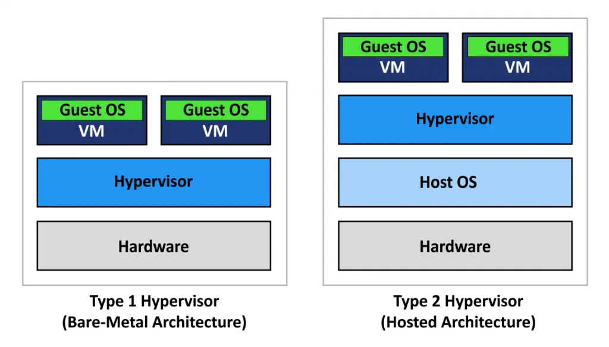
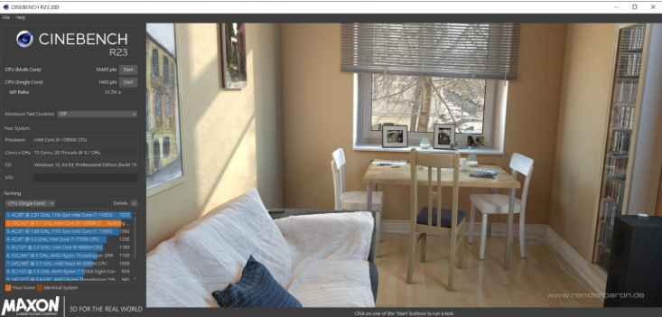
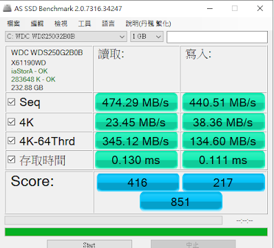
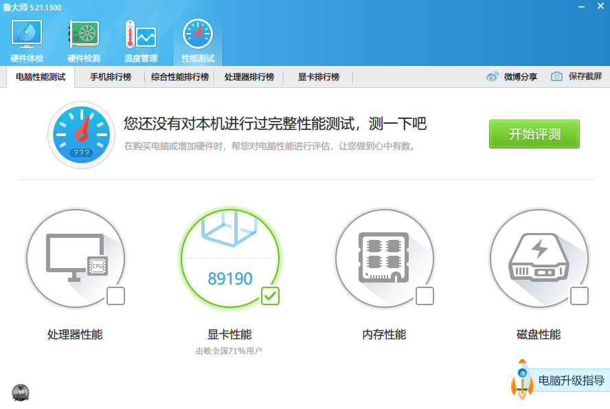
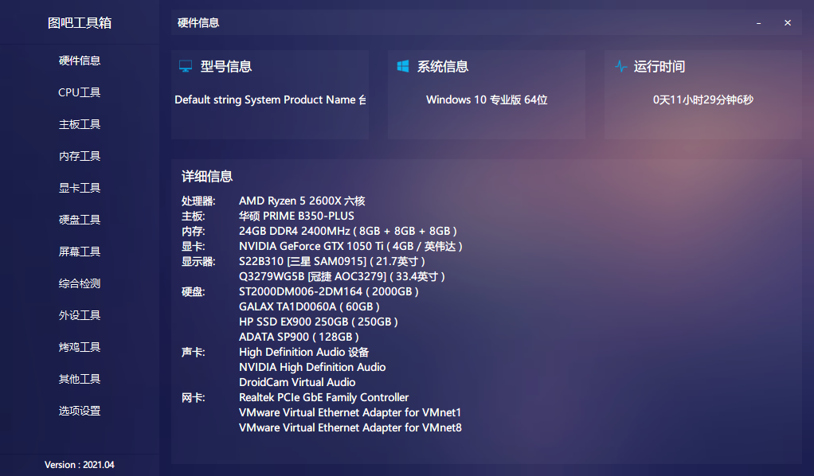
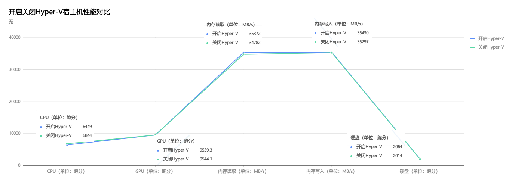
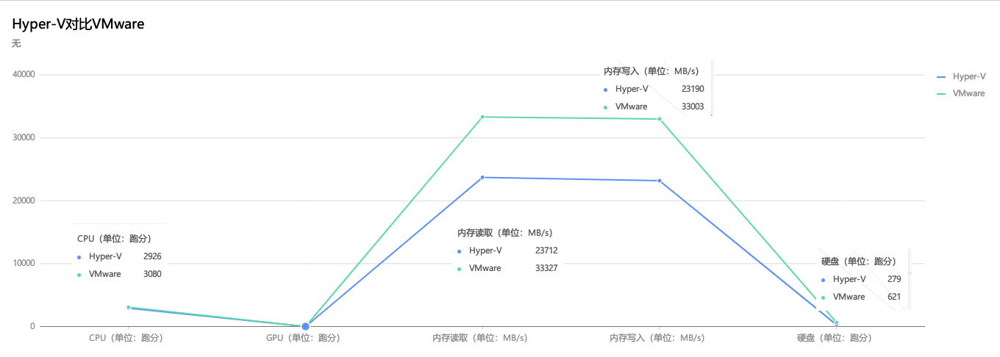

# 微软亲儿子Hyper-V与虚拟化巨头VMware Workstation性能大比拼

**Hyper-V  VS VMware**

1：Hyper-V为Windows10自带，不需要下载安装，开启后重启即可，而Vmware需要下载安装
2：Hyper-V虚拟硬盘采用vhdx格式，宿主机可直接读取虚拟机文件，而Vmware需要自行映射
3：Hyper-V内存动态分配，当虚拟机处于后台运行时，自动降低内存使用率，而Vmware则是固定内存
4：Hyper-V挂起虚拟机比较快，且可在不考虑虚拟系统运行的情况下直接关机，而Vmware挂起虚拟机较慢，需要等到虚拟内存释放掉才能关机
5：Hyper-V开启后宿主机性能稍下降，而Vmware则不会
6：Hyper-V只能显示固定大小（Linux），这导致我直接弃用Hyper-V，而Vmware在安装vm-tools之后可以跟随窗口动态调整大小
7：Hyper-V默认不能连接外网，且只有虚拟交换机的网络方案，Vmware默认NAT网络模式能连接外网，且有三种网络模式
8：Hyper-V USB外设不能直接连接虚拟机，而Vmware可以
9：Hyper-V 支持的操作系统更少，对Windows支持更好，对Linux支持较差，如果要使用Linux虚拟机（如Ubuntu），不推荐Hyper-V，而Vmware支持更多的操作系统
10：Hyper-V默认是用CPU来模拟显示，性能较低，但可以通过手段对GPU进行虚拟化，而VMware安装完Vmware-tool后直接可以利用GPU提升显示性能

## 前言

相信各位机友对VMware Workstation（以下简称Vmware）不会陌生，狭义讲就是虚拟机，广义来说是一个硬件虚拟化平台，最常见的就是在VMware中装各种操作系统，游戏玩家会在Vmware中游戏多开与挂机、码农会在Vmware中装Linux系统开发编译软件、黑客会在虚拟机中测试病毒程序、普通用户可能会在虚拟中装一些国产流氓软件

十多年前拥有了人生中的第一台笔记本电脑后才知道有虚拟机这种东西，当时惊为天人！Windows中还能装Windows，不仅能装Windows还能安装其他的非Windows系统，系统套系统，母鸡生小鸡，从那时开始，虚拟机便是我电脑中必备工具之一！当然，那时VMware Workstation就已经出道了，但不知Hyper-V为何物，Hyper-V近些年才进入人们视野，Hyper-V 发布在Windows Server 2008，但是直到Windows8发布后Hyper-V才被内置，现在普遍使用的Windows10当然也内置了Hyper-V。

Hyper-V和VMware Workstation有什么区别呢？目前地表存在两种虚拟化架构分别是Type 1和Type 2，分别对应下图左边和右边，Type 1直接跑在**裸金属**上（就是直接跑在裸机上的意思，可能大家觉得**裸金属**听起来更酷，所以都这么叫），Type 2需要一个托管的操作系统，它跑在托管的操作系统之上，本质上只是操作系统上的一个软件



Hyper-V就是Type 1，当开启之后原本的Windows系统便成了Hyper-V的一个虚拟机，所以开启了Hyper-V的Windows性能也会稍降，而VMware Workstation属于Type 2，是Windows上的一个软件，理论上讲Type 1少了一层，性能更高。

那么问题来了，在开启了Hyper-V的Windows上能跑VMware Workstation吗？这不两层套娃了吗？对，这确实是个问题，在某个版本之前的确是不兼容的，开启了Hyper-V后就不能使用VMware Workstation，但在202005开始兼容

> Vmware workstation升级到15.5.5版本后就可以兼容Hyper-V了,但有限制:必须为Windows 10 20H1(也叫2004版)或更高版本

## 性能对比


思路：控制变量大法好

1. 首先关闭Hyper-V（Windows默认就是关闭的），然后测试宿主机CPU、GPU、硬盘、网络四大件，再在Vmware中安装WIndows，再次测试四大件

2. 然后开启Hyper-V，然后测试宿主机CPU、GPU、硬盘、网络四大件，再在Hyper-V中安装相同版本的WIndows，再次测试四大件

把上面的两种情况结果直接拿出来做对比

### 测试工具

鉴于这次测试，我专门搜罗了一些测试工具

#### CPU跑分：Cinebench

Cinebench 是 MAXON Computer 推出的一款测试 CPU 渲染能力的软件。MAXON Computer 公司推出的另一款更为人熟知的软件其实是一款三维动画渲染和制作软件：Cinema 4D。通过 Cinebench 跑分测试就可以让用户方便地评价自己的 PC 在运行 Cinema 4D 时的表现。

界面长这样，其实就是通过CPU单线程或多线程来渲染进行跑分

[Cinebench点此官网下载](https://www.maxon.net/en/downloads/cinebench-r23-downloads)



#### 内存测试：AIDA64

AIDA64是一个运行在Microsoft Windows操作系统上的系统信息、诊断和审计程序，用于显示计算机的组件的详细信息，性能测试是它的功能之一，可以测试内存写入和读取速度

AIDA64是一个收费软件，免费试用30天，对于我们的测试已经够用了

[AIDA64点此下载](http://www.aida64.com.cn/html/downloads.html)

#### 硬盘IO跑分：AS SSD Benchmark

AS SSD Benchmark是一款来自德国的SSD专用测试软件，可以测试连续读写、4K对齐、4KB随机读写和响应时间的表现，并给出一个综合评分。

SSD固态硬盘刚上市时一般就是用这个工具跑分



[AS SSD Benchmark点此下载](http://www.dayanzai.me/as-ssd-benchmark.html)

#### 显卡跑分：娱乐大师

显卡没找到适合的工具，要么就是3DMark这种巨无霸，想找一个免安装的小跑分工具，无意间发现娱乐大师很适合，可以单独选择显卡进行跑分




[娱乐大师绿色免安装下载](https://www.ghxi.com/ludashi.html)

#### 图吧工具箱

在搜寻工具的过程中了解到图吧大屌开发的集大成的图吧工具箱，功能很多很全，绿色免安装，非营利性，感兴趣的可自行测试

- 官网：http://www.tbtool.cn/




### 硬件信息

本次测试涉及的硬件信息

- CPU：AMD Ryzen 5 2600X 6核 12线程
- 主板：华硕B350-PLUS
- 内存：威刚DDR4 2400MHz 3 x 8 = 24GB
- 显卡：NVIDIA GeForce  GTX 1050Ti
- 硬盘：联想HP EX900 SSD （宿主机） / 威刚 SP900 （虚拟机）

### 软件信息

- 宿主机Windows版本：Windows10 64bit 19042.746  20H2
- 宿主机Hyper-V版本：10.0.19041.746
- 宿主机VMware Workstation版本：16.1.0 build-17198959
- 虚拟机Windows版本：WIndows10 64bit 19042.631 20H2

备注：

- Hyper-V版本查看命令

```shell
wmic datafile where name="c:\\windows\\system32\\vmms.exe" get version
```

## 评测结果

### 宿主机性能对比



如上图所示，其中

- CPU：开启Hyper-V CPU约有5.7%的性能损失，实测过程中Cinebench跑分最久，多次跑分结果趋向一致，因此该项数据受环境影响小，可信度高。
- GPU：娱乐大师跑分结果，几乎一致，关闭Hyper-V分值略高，多次跑分数据差别大，数据可能受环境影响，不是Hyper-V导致
- 内存读写：开启与关闭Hyper-V，速度几乎一致，内存读写受环境影响大
- 硬盘：开启与关闭Hyper-V，速度几乎一致

结论：开启Hyper-V与关闭Hyper-V宿主机性能几乎一致，**CPU性能略有损失**，性能不会受到太大影响，平时使用几乎无感知


### Hyper-V对比VMware

Hyper-V装Windows虚拟机对比 VMware装虚拟机，其中VMware测试时已关闭Hyper-V



如上图所示（注意，以上测试仅供娱乐），其中

- CPU：VMware略高，因为是2核心4线程下测试，所以比宿主机下跑分低
- GPU：GPU没对比跑分，因为Hyper-V默认是用不了GPU，画面是用CPU来模拟的，而VMware 16默认是可以使用到GPU的；后来才发现可以用过打patch的方式强制让Hyper-V虚拟化GPU，后文有介绍
- 内存读取：Hyper-V比VMware低太多，应该受环境因素影响（**后来发现开的程序不同对内存读取影响很大，所以测试的时候应该尽量不打开其他程序**）
- 硬盘：硬盘跑分情况也显示Hyper-V低于VMware

结论：上述跑分仅供娱乐，反映不出Hyper-V与VMware的极限性能差别，但可以确定的是Hyper-V虚拟化GPU需要打patch，整体易用性不如VMware


Hyper-V给虚拟机打Patch虚拟化GPU教程：

1. 创建虚拟机，并创建检查点（恢复使用）
2. 关闭检查点功能
3. 打开powershell，执行以下命令

```shell
# win10为虚拟机名字
$vm = "Win10"

Add-VMGpuPartitionAdapter -VMName $vm

Set-VMGpuPartitionAdapter -VMName $vm -MinPartitionVRAM 80000000 -MaxPartitionVRAM 100000000 -OptimalPartitionVRAM 100000000 -MinPartitionEncode 80000000 -MaxPartitionEncode 100000000 -OptimalPartitionEncode 100000000 -MinPartitionDecode 80000000 -MaxPartitionDecode 100000000 -OptimalPartitionDecode 100000000 -MinPartitionCompute 80000000 -MaxPartitionCompute 100000000 -OptimalPartitionCompute 100000000

Set-VM -GuestControlledCacheTypes $true -VMName $vm

Set-VM -LowMemoryMappedIoSpace 1Gb -VMName $vm

Set-VM -HighMemoryMappedIoSpace 32GB -VMName $vm
```


