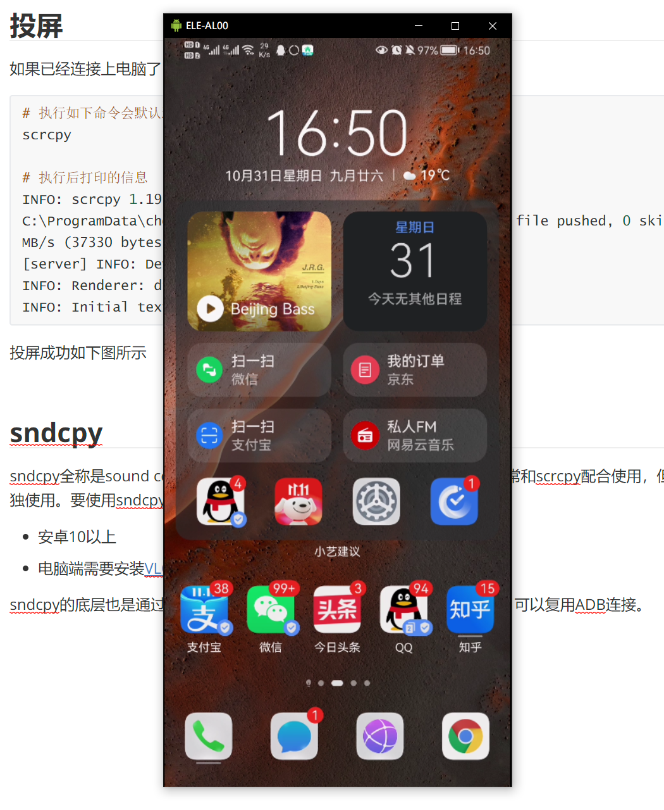

# 摸鱼直播录教程必备，手机一键投屏到电脑开源实现

如果你有以下需求

- 在电脑上刷抖音，刷闲鱼，又不想打开手机（比如上班摸鱼）
- 远程教学录屏，需要在将手机投屏到电脑，并且点击的时候会显示点击位置
- 直播手机打游戏，将手机投屏到电脑端

那么你可能需要scrcpy（转发手机屏幕和控制）+ sndcpy（转发音频），市面上很多安卓手机投屏软件都是scrcpy套壳。

## scrcpy

scrcpy全称叫做screen copy，顾名思义拷贝了一个屏幕，它可以显示并控制通过 USB (或 TCP/IP) 连接的安卓设备，且不需要任何 *root* 权限。本程序支持 *GNU/Linux*, *Windows* 和 *macOS*。

它有以下特性

- **轻量** (原生，仅显示设备屏幕)
- **性能** (30~60fps)
- **质量** (分辨率可达 1920×1080 或更高)
- **低延迟** ([35~70ms](https://github.com/Genymobile/scrcpy/pull/646))
- **快速启动** (最快 1 秒内即可显示第一帧)
- **无侵入性** (不会在设备上遗留任何程序)

它是一个开源项目，项目地址：https://github.com/Genymobile/scrcpy

scrcpy有以下功能

- 录屏
- 双向控制
- 双向剪贴板复制

### ADB介绍

scrcpy底层是通过ADB连接安卓设备的，ADB全称为Android debug bridge（Android 调试桥），ADB是一种功能多样的命令行工具，可让您与设备进行通信。adb 命令可用于执行各种设备操作（例如安装和调试应用），并提供对 Unix shell（可用来在设备上运行各种命令）的访问权限。

简而言之，通过ADB可以直接控制安卓手。

### 下载安装scrcpy

去发布页面下载scrcpy-win64-v1.19.zip：https://github.com/Genymobile/scrcpy/releases

解压后文件列表如下，可以看到里面包含了`adb.exe`和`scrcpy.exe`，将解压后的文件放到喜欢的位置加入到环境变量即可。意味着可以执行执行`adb`或者`scrcpy`命令

```
|-- AdbWinApi.dll
|-- AdbWinUsbApi.dll
|-- SDL2.dll
|-- adb.exe
|-- avcodec-58.dll
|-- avformat-58.dll
|-- avutil-56.dll
|-- scrcpy-console.bat
|-- scrcpy-noconsole.vbs
|-- scrcpy-server
|-- scrcpy.exe
|-- swresample-3.dll
`-- swscale-5.dll
```


### 手机连接电脑

用数据线连接手机与电脑，然后打开安卓手机的USB调试模式，一般在开发者选项里面，如果没有开发者选项，可以打开手机设置，找到**关于手机**，然后疯狂点击**版本号**，就可以打开**开发者选项**

打开USB调试模式后，手机会提示**是否允许USB调试**的选项，选择是即可，此时输入`adb devices`命令会显示已经连接上的设备，如下

```
$ adb devices
List of devices attached
8KE0219425029458        device
```

如果是有线连接到此步已经完成，如果需要无线连接，请继续下面步骤。**无线连接的前提是手机和电脑在同一个局域网**。

---

此时手机已经和电脑有线连接上了，需要无线连接，思路是通过有线连接打开手机的网络监听，然后adb通过网络连接手机，最后拔掉数据线，关闭有线连接。

1. 确认手机的IP地址

```shell
# 首先查看手机的局域网IP，便于后面adb连接手机使用
adb shell ip route | awk '{print $9}'

# 如果是windows的cmd，执行下面命令后最后的信息即为IP
adb shell ip route
```

2. 打开手机的网络监听，监听在5555端口

```shell
adb tcpip 5555

# 输出如下
restarting in TCP mode port: 5555
```

3. 通过IP和端口用adb连接手机

```shell
adb connect  <第一步中返回的手机IP>:5555
```

如果是git bash 或者其他shell 可以通过如下命令一步到位

```shell
# 睡2s的目的是因为手机启监听需要时间
adb tcpip 5555 && sleep 2 && adb connect `adb shell ip route | awk '{print $9}'`:5555
```

如果最后有如下输出说明连接成功

```
connected to 192.168.2.6:5555
```

此时看看连接的设备，有线和无线都已经连接上了，此时拔掉数据线在观察输出看看是否只剩下一个设备

```shell
$ adb devices
List of devices attached
8KE0219425029458        device
192.168.2.6:5555        device
```

如果拔掉数据线发现设备offline，如下所示，华为手机需要开启**“仅充电”模式下允许ADB调试**，其他设备自行尝试，应该大同小异，开启后再次用数据线连接电脑

```
$ adb devices
List of devices attached
192.168.2.6:5555        offline
```

如果最后输出如下说明连接成功！

```
$ adb devices
List of devices attached
192.168.2.6:5555        device
```

---

最后总结，如果需要无线连接ADB，开启**“仅充电”模式下允许ADB调试**和USB调试模式，数据线连接手机，然后执行下面命令一步到位，稍等片刻后再把数据线拔掉即可。

```shell
# 睡2s的目的是因为手机启监听需要时间
adb tcpip 5555 && sleep 2 && adb connect `adb shell ip route | awk '{print $9}'`:5555
```


### 投屏

如果已经连接上电脑了，投屏就很简单了，一条命令搞定

```shell
# 执行如下命令会默认连接adb devices返回的设备
scrcpy

# 执行后打印的信息
INFO: scrcpy 1.19 <https://github.com/Genymobile/scrcpy>
C:\ProgramData\chocolatey\lib\scrcpy\tools\scrcpy-server: 1 file pushed, 0 skipped. 33.9 MB/s (37330 bytes in 0.001s)
[server] INFO: Device: HUAWEI ELE-AL00 (Android 10)
INFO: Renderer: direct3d
INFO: Initial texture: 1080x2336
```

投屏成功如下图所示，而且是实现了双向控制的，不仅仅是简单的投屏



当然还可以执行多次scrcpy可以有多个投屏，内容都是一样的，任何一个都可以控制


但这样手机屏幕没有熄灭，而且会自动锁屏，使用如下命令即可保持手机不锁屏并且手机屏幕熄灭（电脑端不熄灭），实现在电脑端玩手机

```
scrcpy -wS
```

#### 错误排查

如果执行scrcpy报如下错

```shell
$ scrcpy
INFO: scrcpy 1.19 <https://github.com/Genymobile/scrcpy>
adb: error: failed to get feature set: more than one device/emulator
ERROR: "adb push" returned with value 1
```

说明adb devices返回的设备不止一个，可能是有线和无线同时连接一个设备，两种解决办法，要么保持`adb devices`只返回一个设备，要么scrcpy的时候指定设备

```shell
# 指定TCP/IP连接
scrcpy -s 192.168.2.6:5555

# 指定序列号
scrcpy -s 8KE0219425029458
```


在电脑端百度输入法无法正常工作，如果遇到此问题，请更换为**搜狗输入法**

#### 常用功能

以下内容参考：https://github.com/Genymobile/scrcpy/blob/master/README.zh-Hans.md

1. 禁止锁屏

默认投屏有个问题，手机锁屏后就不能投屏了，可以在执行`scrcpy`命令的时候指定参数`-w`禁止锁屏

```
-w, --stay-awake
        Keep the device on while scrcpy is running, when the device
        is plugged in.
```

命令如下

```
scrcpy -w
```

2. 录屏

可以在镜像的同时录制视频：

```shell
scrcpy --record file.mp4
scrcpy -r file.mkv
```

仅录制，不显示镜像：

```shell
scrcpy --no-display --record file.mp4
scrcpy -Nr file.mkv
# 按 Ctrl+C 停止录制
```

3. 关闭设备屏幕

可以通过以下的命令行参数在关闭设备屏幕的状态下进行镜像：

```shell
scrcpy --turn-screen-off
scrcpy -S
```

4. 键盘控制

在以下列表中, MOD 是快捷键的修饰键。 默认是 (左) Alt 或 (左) Super。*[Super](https://en.wikipedia.org/wiki/Super_key_(keyboard_button)) 键通常是指 Windows 或 Cmd 键。*

| 操作                              | 快捷键               |
| --------------------------------- | -------------------- |
| 全屏                              | MOD+f                |
| 向左旋转屏幕                      | MOD+← *(左箭头)*     |
| 向右旋转屏幕                      | MOD+→ *(右箭头)*     |
| 将窗口大小重置为1:1 (匹配像素)    | MOD+g                |
| 将窗口大小重置为消除黑边          | MOD+w \| *双击¹*     |
| 点按 `主屏幕`                     | MOD+h \| *鼠标中键*  |
| 点按 `返回`                       | MOD+b \| *鼠标右键²* |
| 点按 `切换应用`                   | MOD+s                |
| 点按 `菜单` (解锁屏幕)            | MOD+m                |
| 点按 `音量+`                      | MOD+↑ *(上箭头)*     |
| 点按 `音量-`                      | MOD+↓ *(下箭头)*     |
| 点按 `电源`                       | MOD+p                |
| 打开屏幕                          | *鼠标右键²*          |
| 关闭设备屏幕 (但继续在电脑上显示) | MOD+o                |
| 打开设备屏幕                      | MOD+Shift+o          |
| 旋转设备屏幕                      | MOD+r                |
| 展开通知面板                      | MOD+n                |
| 收起通知面板                      | MOD+Shift+n          |
| 复制到剪贴板³                     | MOD+c                |
| 剪切到剪贴板³                     | MOD+x                |
| 同步剪贴板并粘贴³                 | MOD+v                |
| 注入电脑剪贴板文本                | MOD+Shift+v          |
| 打开/关闭FPS显示 (在 stdout)      | MOD+i                |

一般使用就是**关闭设备屏幕** (但继续在电脑上显示)、然后**禁止锁屏**，实现在电脑上玩手机，类似于华为的**多屏协同**

## sndcpy

scrcpy 只是解决了画面和双向控制的问题，但是比较蠢的是声音还是从手机里面发出来的，所以需要sndcpy来转发声音到电脑上。

sndcpy全称是sound copy，它可以将安卓设备的声音转发到电脑上，它通常和scrcpy配合使用，但是它也可以单独使用。要使用sndcpy，至少需要满足以下条件

- 安卓10以上
- 电脑端需要安装[VLC](https://www.videolan.org/)播放器

sndcpy的底层也是通过ADB与设备进行通信，如果scrcpy已经连接了设备，可以复用ADB连接。

项目地址：https://github.com/rom1v/sndcpy

### 安装

1. 安装VLC，在官网根据平台下载安装即可：https://www.videolan.org/

2. 去项目发布页下载zip包：https://github.com/rom1v/sndcpy/releases/tag/v1.0

解压后文件如下，将解压后的文件添加到环境变量，可以删掉`adb.exe`，因为在scrcpy中已经有了

```
|-- AdbWinApi.dll
|-- AdbWinUsbApi.dll
|-- adb.exe
|-- sndcpy
|-- sndcpy.apk
`-- sndcpy.bat

```

### 转发音频

执行如下命令，执行完成后会在手机上安装`sndcpy.apk`，安装完成后需要在手机上授权

```shell
$ sndcpy.bat

# 回显如下
Waiting for device...
Performing Streamed Install
Success
28200
Starting: Intent { act=android.intent.action.MAIN cat=[android.intent.category.LAUNCHER] cmp=com.rom1v.sndcpy/.MainActivity }
Press Enter once audio capture is authorized on the device to start playing...
#  然后按一下Enter键

Playing audio...

```

此时，手机上的音频已经可以转发到电脑上，音频传输和手机本身的音量无关。即可以在手机静音的情况下传输音频到电脑端。


但是每次执行`sndcpy.bat`的时候都会自动安装`sndcpy.apk`，即使已经安装过了，感觉有点蠢，解决这个问题的办法是注释掉`sndcpy.bat`中通过adb往手机中安装apk的脚本，在脚本内容前面添加`::`注释，如下

```bat
::%ADB% %serial% install -t -r -g %SNDCPY_APK% || (
::    echo Uninstalling existing version first...
::    %ADB% %serial% uninstall com.rom1v.sndcpy || goto :error
::    %ADB% %serial% install -t -g %SNDCPY_APK% || goto :error
::)
```

以后要进行音频转发的时候直接执行`sndcpy.bat`即可。

如果感觉每次都要按Enter键觉得烦人，可以把下面两行注释掉

```bat
::echo Press Enter once audio capture is authorized on the device to start playing...
::pause >nul
```


## 总结

下面准备了一键脚本，把下面脚本保存成"**手机投屏电脑.sh**"脚本文件，手机连接电脑，打开USB调试，稍等片刻双击该脚本，当出现`pls pull up your phone！`拔掉数据线

```shell

# 无线连接
echo 'try to connect phone...'
adb tcpip 5555 && \
sleep 2 && \
adb connect `adb shell ip route | awk '{print $9}'`:5555

# 拔掉数据线
echo 'pls pull up your phone！'
sleep 5

# 转发视频
echo 'forwarding screen...'
nohup scrcpy -wS &

sleep 2

# 转发音频
echo 'forwarding sound...'
sndcpy.bat
```

关闭的时候首先在脚本窗口Ctrl+C，按Y结束掉音频进程，然后手动关掉投屏窗口，投屏进程结束，以上脚本可重复执行，第二次执行的时候不需要连接数据线

---

上面是无线版，下面是有线版：手机连接电脑，打开USB调试，稍等片刻，执行下面脚本即可，关闭方式和无线一致

```shell
# 转发视频
echo 'forwarding screen...'
nohup scrcpy -wS &

sleep 2

# 转发音频
echo 'forwarding sound...'
sndcpy.bat
```


当然还有一款商业版的投屏的软件：`Vysor`，详细可参考：https://joynaruto.com/archives/1029

# 参考

- https://github.com/Genymobile/scrcpy
- https://github.com/rom1v/sndcpy
- https://joynaruto.com/archives/1029


