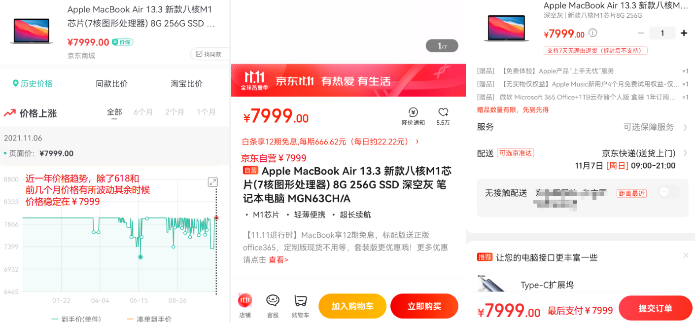

# 【好物评测】苹果笔记本M1芯片京东双11直降￥1350

一直想拥有一台MacBook码代码、写WIKI、剪视频、修图片；流畅的UI交互，圆润饱满的字体渲染，漂亮的界面设计，ARM架构高性能低耗电，无不显示出MacOS的与众不同与杰出的生产力！奈何苹果的产品死贵，去年发布的MacBook Air M1芯片￥7999的价格一直很坚挺，不过现在机会来了，2021京东双十一教你直省￥1350！！！这差价都可以抵一个低端安卓手机了

## 订单优惠截图

首先说明我不是标题党，下面祭出订单截图，一共支付了￥5549.9，除去礼品卡、红包、金豆、支付有礼的优惠（因为这些优惠不是每个人都有的），一共支付￥6649，如果你按照我的渠道来，那么就是￥6649这个价格！

## 原价￥7999

首先说明一下，原价确实是￥7999，如果实打实的从京东自营购买最后确实要支付￥7999，如下图所示，￥7999的价格自从发布以来除了2021年618（价格￥7184）和前几个月有所波动外，其实时候都基本稳定在￥7999

## 薅羊毛

那为何是￥6649，这就要学会薅苹果和京东的羊毛了：

- 薅苹果羊毛：苹果提供了学生认证，如果是学生身份（**学信网可查**），那么可以便宜￥800，从￥7999降至￥7199
- 薅京东羊毛：京东双11满减一共可优惠￥400（满500减400）+￥150（满2000减150）=￥550（参考第一张订单图）

如下图所示，教育优惠减￥800、京东减￥400+￥150=￥550，一共是￥1350！

但是京东双十一减免是和教育优惠捆绑在一起的，所以无论如何首先搞个**教育优惠**

## 教育优惠

如果没有认证过教育优惠，那么是无法下订单的，如下图所示，显示需要必购码才能购买

所以首先你要进行学生认证才有条件下单，学生认证该页面也有入口，需要在学信网进行认证获得学信网验证码即可，如下图

那么关键就在这里，需要的是**学信网验证码**，而你的身份不一定非要是一个学生！亲测可行，京东不会过多验证（因为教育优惠是苹果给的，京东不会做过多处理），只要是未使用过的学信网验证码即可，验证码哪里来？当然不可能免费获得（需要学信网验证码的朋友加QQ咨询：**一零七三八五零五二五**），羊毛出在羊身上，那学信网验证码就是那些不需要苹果设备的同学们贡献的。

## 总结

感兴趣的朋友们赶紧下手，双十一每天价格变化比较大，优惠随时都不一样，教育认证能省一千多还是很有诱惑力的！如果你最近手头比较紧可以尝试，如果你不差钱建议还是不要装学生薅学生羊毛了！

明天MacBook到手，到时候会出一系列文章，包括不限于开箱评测、Windows转MacOS使用技巧、ARM架构下开发环境搭建、ARM架构与X86架构对比、MacOS在图像视频处理方面的优势等等....