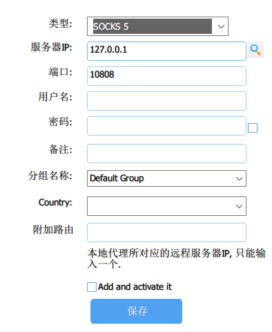

# 2021-11-21_5分钟了解游戏加速器的原理与搭建


## 背景

一般来讲，国内运营商都有QoS

>百度百科：QoS （ Quality of Service，服务质量）指一个网络能够利用各种基础技术，为指定的网络通信提供更好的服务能力，是网络的一种安全机制， 是用来解决网络延迟和阻塞等问题的一种技术。

说白了就是在网络拥堵的时候运营商会直接把一些不重要的流量包丢掉，至于啥是“不重要的”就要去问运营商了（看人下菜碟）。对被 QoS的用户来说，表现就是、网速降低、丢包、ping 值极不稳定，给钱越多的网络质量越好，例如带宽更高，丢包更少，延迟更低。

当然QoS是不区分TCP和UDP的，对于UDP而言，除了常规QoS，还有更严格的限制甚至在某些极端情况下会屏蔽掉UDP，主要原因是UDP无连接、无状态、支持广播、最大努力送达等特性让运营商控制UDP的成本太高


来一张喜闻乐见的对比图

![r/MoeMorphism - [OC] Internet runs on two Packet Protocols: TCP is used to reliably exchange data while UDP is preferred when speed is more important than information integrity (I know it’s so specific, but I hope you’ll like it!)](assets/2021-11-21_5分钟了解游戏加速器的原理与搭建/rs6z0ff7yht51.jpg)

一般游戏为了保证实时性，都会采用UDP进行网络传输，比如玩射击游戏角色正在行走的时候，网络卡了一下，但是一秒不到游戏角色已经移动到下一个位置了，这是UDP的表现，它尽最大努力送达，允许丢包；假设是TCP，网络卡一下，你会发现游戏画面暂停了，角色向卡幻灯片一样的往前行走，因为TCP是面向连接的，丢包会重发，到达会确认。

当然游戏不全是UDP，TCP甚至更上层的HTTP也有，这完全取决于游戏对延迟的要求。

> 那么游戏中到底是用UDP还是TCP呢？
>
> - 如果是由客户端间歇性的发起无状态的查询，并且偶尔发生延迟是可以容忍，那么使用**HTTP/HTTPS**吧。
> - 如果客户端和服务器都可以独立发包，但是偶尔发生延迟可以容忍（比如：在线的纸牌游戏，许多MMO类的游戏），那么可考虑使用**TCP长连接**
> - 如果客户端和服务器都可以独立发包，而且无法忍受延迟（比如：大多数的多人动作类游戏，一些MMO类游戏），那么考虑使用**UDP**

在玩一些外服游戏（游戏服务器在国外）的时候，直连效果差，需要加一层代理也就是加速器，实现加速效果，因为游戏一般为UDP传输但运营商对UDP干扰严重，所以需要将游戏客户端到代理服务器之间的连接做一些处理。

## UDP QoS

下面详细说一下针对UDP的QoS，UDP socket每次发包都换一个不同的源端口，如果一个设备疯狂发送UDP包，将会在短时间内创造大量的五元组。传统的状态防火墙，状态NAT会用一个 五元组来追踪一条 连接 。**如果连接过多，就会对这些保存状态的设备造成很大的压力**，这种压力主要体现在两个方面：

- 存储压力：设备不得不配置大量的内存来保存大量的连接。
- 处理器压力：设备不得不在数据包到来的时候花更多的时间来匹配到一条连接。

由于UDP的无状态特征，没有任何报文指示一条连接什么时候该创建什么时候该销毁，设备必须有能力自行老化已经创建的UDP连接，且不得不在权衡中作出抉择：

- 如果老化时间过短，将会破坏正常通信但通信频率很低的UDP连接。
- 如果老化时间过长，将会导致已经无效的UDP连接消耗大量的内存，这将为DDoS攻击创造一个攻击面。

攻击者只需要用不同的UDP五元组构造报文使其经过状态设备即可，由于UDP报文没有任何指示连接创建销毁的控制信息，状态设备不得不平等对待任何新来的五元组，即为它们创建连接，并且指定相同的老化时间。TCP与此完全不同，由于存在syn，fin，rst等控制信息，状态设备便可以针对不同状态的TCP连接指定不同的老化时间，ESTABLISHED状态的连接显然要比其它状态的连接老化时间长得多。

这导致使用TCP来实施同样的攻击会困难很多。为什么快速构造不同的TCP五元组达不到UDP同样的效果？如果你只是盲目的用不同源端口发送syn，在没有真正的对端回应的情况下，这种状态的连接将会很快老化掉(10秒以内，甚至更短)。

如果你构造使用不同端口的大量真正的TCP连接，那么在状态设备受到伤害的同时，你自己也必须付出巨大的代价来维持住这些连接。你发起一个TCP连接，为了让状态设备保存这条连接，你自己也不得不保存这条连接，除非你通过海量的反射主机同时发起真连接，否则在单台甚至少量的主机上，这种攻击很难奏效。

对于无状态设备，我们便不必再纠结五元组连接的保持了。但是UDP短期构造海量五元组的能力仍然会影响无状态设备包分类算法的正常运行。基于包分类算法的优先级队列，缓存管理几乎也是通过五元组计算来完成的，UDP的特征将会使无状态设备对其做流量管控变得困难。其结果就是，眼睁睁任凭UDP流量挤满各级队列缓存却没有办法将其精确识别出来，即便是BBR遇到了UDP流量，也只能自降pacing rate而兴叹。

**运营商对TCP更加友好，对UDP不友好，但却无力深度检测TCP连接的真实性。**

一个简单的例子就是将正常TCP数据的protocol字段改成UDP，丢包率大大增加了，甚至根本无法通信！

```c++
if (iph->protocol == IPPROTO_TCP) {
	iph->protocol = IPPROTO_UDP;
	ip_send_check(iph);
	udph->check = 0;
} else if (iph->protocol == IPPROTO_UDP) {
	iph->protocol = IPPROTO_TCP;
	ip_send_check(iph);
}
```

## 加速器原理

加速器的原理很简单，就是UDP代理，主要难在两点，其一是怎么处理游戏客户端到加速器服务器之间的UDP连接，其二是怎么让游戏客户端去连接这个加速器（一般游戏客户端是没有设置代理服务器的功能的）

### 处理UDP

处理UDP有两种思路，一种是协议套娃，将游戏的UDP包外面套一层TCP（UDP over TCP ），到了目的地再把TCP解包成UDP，最后在发送到游戏服务器，返回的数据包也做同样处理；另外一种是伪造TCP（FakeTCP），对UDP数据包加上伪造的TCP包头，让其看起来像是TCP协议，欺骗运营商。

#### UDP over TCP  

UDP over TCP  或者 UDP in TCP都是一回事，就是把UDP协议封装到TCP协议里。其缺点是会影响UDP传输的速率和实时性，因为TCP有可靠传输、拥塞控制、按序到达等特性，这些特性都是会牺牲速率和实时性且无法避免掉的：

1. 如果网络很好不丢包，那么UDP in TCP方案会工作得很好；如果网路稍微有一点丢包，数据包的延迟会极大得增加。 （按序到达造成的副作用）
2. 如果带宽充足，UDP in TCP方案也会工作得很好；如果UDP数据发送的数据一但超过了TCP的带宽，连接就会卡住一段时间，有时候会造成超过10秒的时间无法发送数据。（可靠传输、拥塞控制造成的副作用）

原理如下图所示


常见项目：

- https://github.com/mullvad/udp-over-tcp
- $$R中的udp in tcp选项
- v2ray中的VMess协议也是支持ucp over tcp

#### FakeTCP

用raw socket给UDP协议直接加上伪造的TCP包头，把UDP伪装成TCP；本质上还是UDP，不需要经过系统的TCP协议栈，所以不会有UCP over TCP引入的问题。但是伪装成TCP的UDP流量可以骗过运营商的防火墙，可以避免UDP断流。这就是FakeTCP。原理如下图


FakeTCP跟UDP over TCP方案相比的缺点是无法穿透TCP代理（包括反向TCP代理），比如Haproxy。

常见项目：

- udp2raw：https://github.com/wangyu-/udp2raw


### 游戏客户端连接加速器

#### SSTap

SSTap全称SOCKSTap, 是一款使用虚拟网卡在网络层实现的转发工具。 SSTap能在网络层拦截全部连接并转发给HTTP、SOCKS4/5。 而无需对被代办的应用程序做任何修改或设置。 它能同时转发TCP、UDP数据包。


SSTap会在电脑中安装一个虚拟网卡，配合网络规则（比如哪些IP走这个虚拟网卡，哪些不走）


然后在配置路由表中添加如下规则（cmd中`netstat -nr`可查看）

```
网络目标        网络掩码          网关                接口        跃点数
0.0.0.0        0.0.0.0       10.198.75.61     10.198.75.60      2
0.0.0.0        128.0.0.0     10.198.75.61     10.198.75.60      2
```

10.198.75.60即为上面设置的虚拟网卡的IP，如果网络规则设置的全局，那就是真全局（接管系统中所有程序的UDP/TCP流量），包括系统CMD命令都会被代理到，如下实测，当不开启SStap时，百度能ping通，开启时，全部超时（因为我的梯子屏蔽了百度）

```shell
C:\Users\xxx>ping www.baidu.com

正在 Ping www.a.shifen.com [110.242.68.4] 具有 32 字节的数据:
来自 110.242.68.4 的回复: 字节=32 时间=36ms TTL=53
来自 110.242.68.4 的回复: 字节=32 时间=36ms TTL=53
来自 110.242.68.4 的回复: 字节=32 时间=36ms TTL=53
来自 110.242.68.4 的回复: 字节=32 时间=36ms TTL=53

110.242.68.4 的 Ping 统计信息:
    数据包: 已发送 = 4，已接收 = 4，丢失 = 0 (0% 丢失)，
往返行程的估计时间(以毫秒为单位):
    最短 = 36ms，最长 = 36ms，平均 = 36ms

# 开启SStap之后ping百度
C:\Users\xxx>ping www.baidu.com

正在 Ping www.baidu.com [110.242.68.3] 具有 32 字节的数据:
请求超时。
请求超时。
请求超时。
请求超时。

110.242.68.3 的 Ping 统计信息:
    数据包: 已发送 = 4，已接收 = 0，丢失 = 4 (100% 丢失)，
```

然后在2017年，作者声称硬盘损坏，数据丢失，现已停止开发。所以后续不会再有更新了，未来也许会不可用。但是现在（2021）依然可用

- 各历史版本收藏：https://github.com/solikethis/SSTap-backup
- 备用链接： https://sabrinathings.lanzous.com/b01hin52h
- 官网：https://www.sockscap64.com/sstap-享受游戏-使用sstap/

#### Netch 

一款可代替SStap的开源网游加速工具，众所周知的游戏加速工具SStap已于2017年年11月19日停止开发及维护，虽然停止了维护与开发，时至今日，其依然是一款热门的游戏加速工具。但是由于年久失修，已经难以适应部分新出的网络游戏，可能会被新出的游戏认定为外挂程序。

不同于SSTap那样需要通过添加规则来实现黑名单代理，Netch原理更类似Sockscap64，通过扫描游戏目录获得需要代理的进程名进行代理。与此同时Netch避免了SSTap的NAT问题，使用SSTap加速部分P2P联机，对NAT类型有要求的游戏时，可能会因为NAT类型严格遇到无法加入联机，或者其他影响游戏体验的情况。

- 项目地址：https://github.com/netchx/netch

## 实现

实现主要说明基于UDP over TCP的实现，主要原因为在已有nginx + websocket的环境下改动最小，不用打开额外UDP端口，因为其本质是TCP，保证现存环境的稳定性，如果引入FakeTCP，则必须打开新的UDP端口，引入新的不确定性。

### 基于UDP over TCP的实现

主要方案为nginx + tls + websocks + vmess，整个连接过程如下图所示


环境概述：

- 服务端已配置好标准https站点（nginx接入，端口为标准443，证书正常未过期）
- 服务端配置v2ray，使用vmess协议，其默认支持UDP over TCP方案
- 客户端使用v2rayN，在本地电脑打开socks代理，供浏览器等使用
- 客户端使用SStap，连接v2rayN开在本地的socks代理，在网络层添加虚拟网卡，供所有联网程序使用

以下为详细步骤

#### 服务端：搭建标准https站点

买域名、买VPS这些过程就不赘述了，主要说明标准https站点的作用是防止流量特征被探测，因为对防火墙来说这就是普通的浏览网站的流量，我们的代理程序藏在https后也会被认为是https流量，每天从防火墙经过的https流量是海量的，所以很安全。

站点使用nginx搭建，证书使用certbot-nginx自动添加免费证书（三个月过期一次）

安装过程不赘述，认证的时候使用如下命令根据提示完成域名认证即可

```shell
/usr/bin/certbot --nginx --register-unsafely-without-email
```

主要说一下nginx的配置，需要将指定路径下的流量转发给v2ray，此处以`/ray`为例，这个路径是随机的，保持客户端和服务端配置一致即可

```nginx
erver {
  listen  443 ssl;
  ssl on;
  ssl_certificate       /etc/v2ray/v2ray.crt;
  ssl_certificate_key   /etc/v2ray/v2ray.key;
  ssl_protocols         TLSv1 TLSv1.1 TLSv1.2;
  ssl_ciphers           HIGH:!aNULL:!MD5;
  server_name           mydomain.me;
        # 与 V2Ray 配置中的 path 保持一致 
        location /ray { 
            proxy_redirect off;
            #假设WebSocket监听在环回地址的10000端口上
            proxy_pass http://127.0.0.1:10000;
            # 升级websocket
            proxy_http_version 1.1;
            proxy_set_header Upgrade $http_upgrade;
            proxy_set_header Connection "upgrade";
            proxy_set_header Host $http_host;

            # Show realip in v2ray access.log
            proxy_set_header X-Real-IP $remote_addr;
            proxy_set_header X-Forwarded-For $proxy_add_x_forwarded_for;
        }
}
```

#### 服务端：配置Vmess

v2ray配置主要参考：https://toutyrater.github.io/advanced/wss_and_web.html

下载v2ray程序后使用如下配置启动：`v2ray -config /path/to/config.json`

- 入站流量：即为Nginx转发过来的流量，此时TLS证书已在Nginx卸载，得到的是明文数据，注意路径`/ray`要和nginx对应
- 出站流量：出站不设限制

```json
{
  "inbounds": [
    {
      "port": 10000,
      "listen":"127.0.0.1",//只监听 127.0.0.1，避免除本机外的机器探测到开放了 10000 端口
      "protocol": "vmess",
      "settings": {
        "clients": [
          {
            "id": "b831381d-6324-4d53-ad4f-8cda48b30811",
            "alterId": 64
          }
        ]
      },
      "streamSettings": {
        "network": "ws",
        "wsSettings": {
        "path": "/ray"
        }
      }
    }
  ],
  "outbounds": [
    {
      "protocol": "freedom",
      "settings": {}
    }
  ]
}
```

此时，如果访问https://mydomain.me/ray得到一个Bad Request说明服务端成功

#### 客户端：配置v2rayN

- https://github.com/2dust/v2rayN/releases

v2rayN是v2ray一个HUI客户端，v2ray本身即可作为服务端也可作为客户端，所以这这是套壳，并且这种模式下，客户端程序会有很多，都是套壳而已，客户端参考：https://www.v2ray.com/awesome/tools.html

客户端配置

- 入站流量：监听本地1080端口，所有使用该端口的流量都转发给outbounds
- 出站流量：以https的形式转发给上文配置的服务端，注意路径`/ray`需和上文一致

```json
{
  "inbounds": [
    {
      "port": 10808,
      "listen": "127.0.0.1",
      "protocol": "socks",
      "sniffing": {
        "enabled": true,
        "destOverride": ["http", "tls"]
      },
      "settings": {
        "auth": "noauth",
        "udp": false
      }
    }
  ],
  "outbounds": [
    {
      "protocol": "vmess",
      "settings": {
        "vnext": [
          {
            "address": "mydomain.me",
            "port": 443,
            "users": [
              {
                "id": "b831381d-6324-4d53-ad4f-8cda48b30811",
                "alterId": 64
              }
            ]
          }
        ]
      },
      "streamSettings": {
        "network": "ws",
        "security": "tls",
        "wsSettings": {
          "path": "/ray"
        }
      }
    }
  ]
}
```

如果手动填写参考如下，特别需要注意红框中的字段需要与服务端一致！


此时，在127.0.0.1接口10808端口上已经启动监听，将浏览器代理设置成这个端口可以禾目学上网了，注意VMess协议要求客户端和服务端的时间相差不能超过90s，如果连不上，请先检查下时间是否一致。

#### 客户端：配置SStap

打开SStap，手动添加一个SOCKS5代理，如下图所示



点击下方小齿轮设置勾选掉不转发UDP和代理DNS服务器


然后打开游戏，**最后在进入游戏界面以后点击链接**，点击右侧闪电图标测试，右侧如果现实TCP和UDP通过说明连接成功（图中接收包失败是因为我的服务器屏蔽了百度，而SStap会用百度作为链接测试）


最后如果能顺利进入游戏说明加速成功！下图右侧为游戏服务器IP检测程序输出结果，左侧为v2rayN日志，结合起来可以看出游戏服务器无论TCP协议还是UDP协议都已经被代理了！

游戏服务器IP检测程序：https://github.com/oooldtoy/SSTAP_ip_crawl_tool


#### 客户端：SStap规则配置

由于SStap年久失修，很多新出的游戏规则没有，所以需要自行制作，可以通过工具：SSTAP_ip_crawl_tool，原理也很简单，通过指定进程，然后检测该进程的所有对外部发出的TCP和UDP连接，取出服务器IP，然后自动生成SStap规则

项目地址：https://github.com/oooldtoy/SSTAP_ip_crawl_tool

源码是由python写成，嫌麻烦可以直接使用打包好的exe版本：

- https://github.com/oooldtoy/SSTAP_ip_crawl_tool/releases/download/v4.0/ip_crawl_tool.v4.0.exe

输入相关信息后多玩一会儿游戏即可抓取IP


最后生成的规则在程序所在目录，如下生成为ItTakesTwo.exe游戏的规则，最后将规则添加到SStap即可

```
#none,['ItTakesTwo.exe'],0,0,1,0,1,0,By-ip_crawl_tool
239.255.255.0/24
159.153.36.0/24
159.153.42.0/24
109.200.221.0/24
109.200.215.0/24
185.50.104.0/24
52.88.180.0/24
255.255.255.0/24
```


#### Vless

早在2020一月份的时候Vmess就爆出严重漏洞，几乎要重新设计Vmess协议

> **Update： 我们构造出了更具杀伤性的PoC，仅需16次探测即可准确判定vmess服务，误报可能性几乎为0，校验的缓解措施均无效。唯一的解决方案是禁用vmess或者重新设计协议。我们决定提高issue的严重性等级。**
>
> **Update：v4.23.4及以后已经采取随机读取多个字节的方式阻止P的侧信道泄漏，目前下面的PoC（16次探测）以及概率探测（暴力发包探测）的PoC已经失效，无法准确探测vmess服务。但是，由于这是协议设计层面的问题，彻底解决问题需要引入AEAD等无法向下兼容的设计。好消息是，这一缓解可以为我们讨论制订新协议争取非常多的时间。vmess+tcp的组合仍然存在一定风险，不建议使用。**

但是这个漏洞对TLS + Vmess其实并不影响（不影响我们上文的方案），影响的是Vmess + TCP，区别就是是否将加密机制交由TLS来做，不交给TLS则需要自己实现一套加密机制，Vmess就是这样做的。

所以社区重新设计了Vless协议，下面这段话我觉得很有意义，所以全部贴过来了

> ### 什么是 “基于 TLS 设计” ？
>
> 指的是将 TLS 作为新协议的**必要底层传输方式**，但千万不要理解成要改造 TLS 本身
>
> 不一定是直接基于 TLS，**可以选择性加一层 Websocket/Http2/Http3**
>
> ### 相对于现在的方案，新协议有什么优点？
>
> 与时俱进的安全性：大多数安全性问题已由 TLSv1.3 解决，且 TLS 不会止步 1.3 —— 每当有新的潜在安全性问题出现时，TLS 将会升级，而新协议几乎无需做出改变就可以从中受益。
> 此外，服务端都有路径分流，可以彻底解决被主动探测的问题。
>
> 简单与纯粹：协议本身只需设计身份认证等功能，以及在一定程度上混淆流量以防止基于机器学习的流量分类（所以不能直接用明文/Socks5）。而不用像现在的 VMess 一样绞尽脑汁防攻击、额外加密。比起来重新设计 VMess，设计这个新协议会简单很多。
>
> 长期隐蔽：如今互联网上 TLS 已成为主流，新协议的流量可以混于其中，而不像裸 VMess、SS 等特立独行 —— 长期以来这些协议无论怎么设计/修复，始终是在“创造特征”，而墙早已学会了识别特征并封锁。继续这样你来我往毫无意义，远不如直接用 TLS 作底层，相对一劳永逸。
>
> 自己在 TCP 上设计协议，注重加密和防各种攻击是少不了的（这部分性能始终要损失），而 TLSv1.3 本来就是一种最佳实践（如必须的 AEAD 加密改进），所以不如直接用 TLS 以减少特征、减轻心智负担。
>
> ### 为什么当初没有直接这样设计？
>
> VMess 出现于 2015 年（Shadowsocks 则更早），那时互联网上 TLS 并不普及，TLSv1.3 也未正式推出。但现在是 2020 年，TLS 已成为主流，TLSv1.3 也足够安全并被广泛应用了，所以我认为目前及以后套 TLS 才是最佳选择与长久之计。
>
> 在新协议被设计出来之前，尚有安全的 VMess+WSS 可用，只是多余的特性会损失些性能。
> 当然，VMess+WSS 已经是多数选择了，也证明了基于 TLS 的可靠性。
> 可以先关闭 VMess 自带加密 [v2ray/discussion#686](https://github.com/v2ray/discussion/issues/686)
>
> ### 其它一些话
>
> ~~个人认为，非 TLS 方案都应该被淘汰，不要再浪费时间了。就像我说过的，很多人直到 2020 年都还没有抓住重点：从 SS 到 SSR 再到 VMess，总是想着直接在 TCP 上设计协议，却没有一个能长久。未来不属于自己研究了一个在纯 TCP/UDP 上就多么安全的协议：自创的方案，安全性难以比拟顶级学者设计出的 TLS 不说，不广泛使用，无论怎么设计都容易被针对。就算哪天设计出了密码学上的安全性超越了 TLS 的方案，只有 fq 的人用，也是分分钟被针对/被机器学习特征，没有任何意义。方向错了，做的就是无用功。[v2ray/discussion#711](https://github.com/v2ray/discussion/issues/711)~~
>
> 2020-06-02 更新：
>
> 对于 VMess 2 的设计，不反对，可以同时进行
> 有人觉得基于纯 TCP/UDP 的协议也安全可靠，那想用就用
>
> 希望看到更多基于 TLS 的协议（或者说不同的流量混淆方案
> 其它地方已经有类似的方案，我相信基于 TLS 设计协议正在成为主流方向
>
> V2Ray ≠ VMess，V2Ray 的初衷应该是与时俱进，而不是死守一种方案
> **毕竟，我们为了 fq 而设计的这些土制协议，有非基于纯 TCP 不可的原因吗？**

想要使用Vless很简单，最新版的V2ray已经支持该协议（2021-11-21当前版本4.43.0）

- 服务端如下设置

> VLESS 是一个无状态的轻量传输协议，它分为入站和出站两部分，可以作为 V2Ray 客户端和服务器之间的桥梁。
>
> 与 [VMess](https://www.v2fly.org/config/protocols/vmess.html) 不同，VLESS **不依赖于系统时间**，认证方式同样为 UUID，但不需要 alterId。

```json
{
  "inbounds": [
    {
      "port": 10000,
      "listen":"127.0.0.1",
      "protocol": "vless",
      "settings": {
        //注意加上这句  
	    "decryption":"none",
        "clients": [
          {
            "id": "7b5407b1-e1d9-49f7-a66b-6283deb4eb62",
            //不需要alterId
            "level": 0
          }
        ]
      },
      "streamSettings": {
        "network": "ws",
        "wsSettings": {
        "path": "/ray-vless"
        }
      }
    }
  ],
  "outbounds": [
    {
      "protocol": "freedom",
      "settings": {}
    }
  ]
}
```

- 客户端（v2rayN）设置如下


## 参考

- https://www.cnblogs.com/crazytomato/p/7987332.html
- https://blog.csdn.net/dog250/article/details/113706995
- https://tachyondevel.medium.com/教程-在-windows-上使用-tun2socks-进行全局代理-aa51869dd0d
- https://toutyrater.github.io/advanced/wss_and_web.html
- https://github.com/oooldtoy/SSTAP_ip_crawl_tool