# ESXi裸金属虚拟化体验小记

## 背景

一般情况下家用电脑都装Windows系统，不一般的情况是有些人需要家庭网盘、家庭影院、OpenWrt路由器等等服务，但是又希望安装在一台机器上，这就有了一机多系统的需求，这种情况下可以利用强大的虚拟化技术

- ESXi：虚拟化巨头Vmware开发的商用级别裸金属虚拟化工具，虚拟化下CPU几乎无损耗，教程文档比较多，界面易操作，可和Vmware WorkStation联动（作为客户端）
- PVE：开源的基于Debian的KVM裸金属虚拟化，CPU损耗比ESXi大些，因为本身是一个Linux系统，有系统开销，可忽略不计

上面的是裸金属虚拟化，和Vmware WorkStation等跑在操作系统之上的虚拟化技术不同的是裸金属虚拟化更底层，虚拟化效果更好，裸金属虚拟化下，Windows等操作系统跑在虚拟化层之上，硬件直接归虚拟化软件控制，下面说明ESXi虚拟化技术上下怎么安装Windows10、CentOS7、Windows11等


## 硬件

主要说三大件，无显卡

- CPU：i5-8500，支持硬件虚拟化VT-x，支持硬件直通技术VT-d，带有核心显卡
- 主板：瑞芯微B450M，带有NVME固态接口
- 内存：24G，型号随便

## 方案

ESXi安装在NVME固态，其余硬盘通过板载SATA直通，这样做是因为直通速度更快，而且直通硬盘数据备份恢复更好做，不直通可能面对的就是一堆虚拟磁盘vmdk文件，说白了，直通就相当于没有虚拟化，直接用。

- Win10作为主力系统，系统装在NVME，板载SATA直通给它、核显直通
- CentOS7主要跑一些docker服务，系统装在SSD，硬盘通过WIn10的iSCSI服务供CentOS7使用（通过ESXi的**vmxnet3**网卡连接，走虚拟交换机，10Gbps速度，相当于本地硬盘的速度，不要走路由器，走了路由器速度瓶颈就在路由器）
- Win11：作为尝鲜用，随便装一装

这个方案一路都是坑，稍微不注意就要折腾一整天:)，所以 follow me。坑我已经趟平了。

下面是截图

- 虚拟机

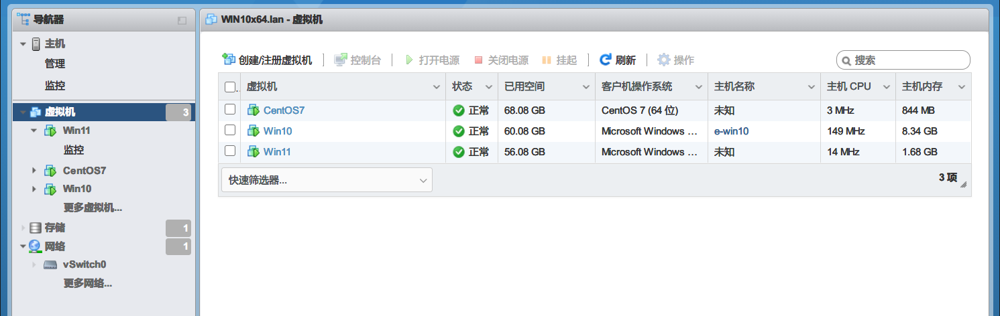


- 网络拓扑，vswitch是ESXi的虚拟交换机，虚拟机内部走虚拟交换机，不过物理网卡到路由器

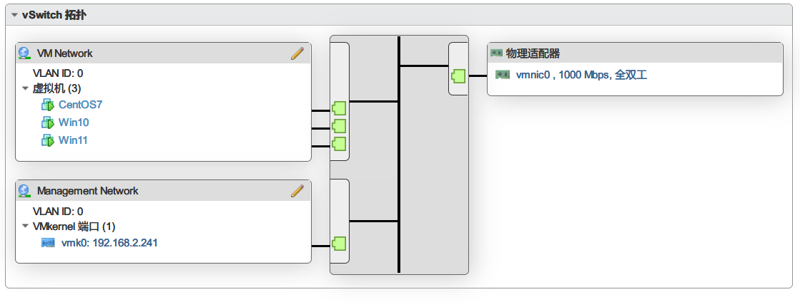

- 和Vmware WorkStation联动

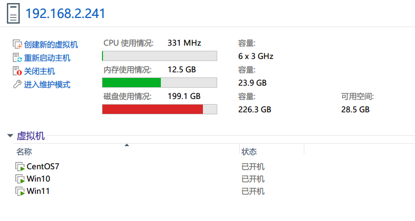

- 三台虚拟机同时工作

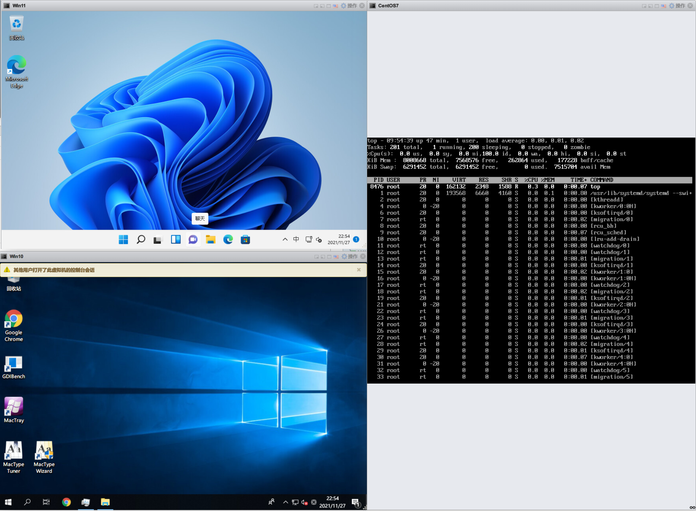

- 同时工作负载

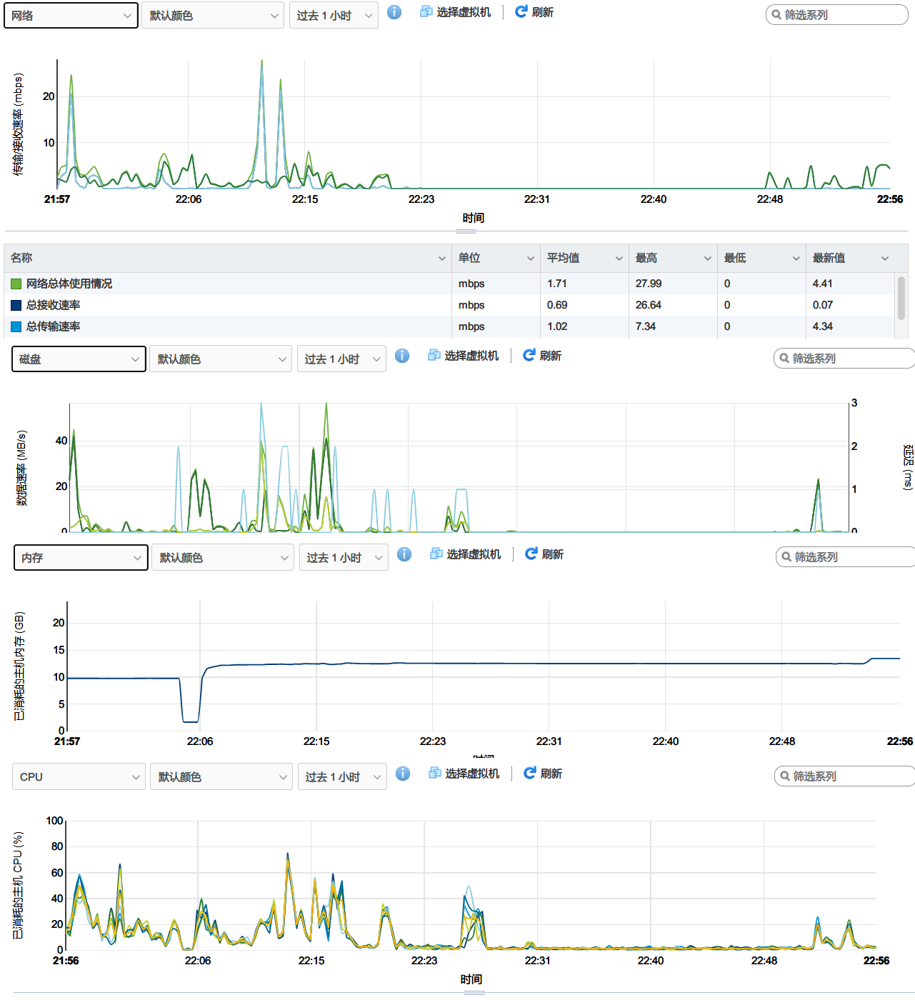

## 安装ESXi

本文主要说思路， 不提供下载

本着一切稳定优先的原则选择了6.7 Update3版本，结果在最后核显直通后启动卡住，信息如下

```
dma_mapper_iommu loaded successful
```

网上检索了下，发现6.7 版本不支持核显直通，或者有问题，最后换成了7.0 Update3版本，安装思路是将ESXi 7.0镜像烧录到U盘，然后U盘启动安装即可，注意，如果想直通，需要先在bios里面将CPU的**VT-d**特性打开！

1. 下载ESXi Update3
2. 下载烧录工具rufus，工具打开的时候会提示联网更新，忽略即可
3. 打开rufus，将ESXi烧录到U盘
4. U盘启动，进行安装接口

注意：

- 如果提示`menu.c32 not a COM32R image`，按下TAB键，然后输入`install hddboot`即可
- ESXi 7默认会占用100+G的空间，缩小该空间在启动倒计时的时候按`Shift + O`输入`autoPartitionOSDataSize=4096`表示只需要4G该空间，可自定义
- 密码要求比较复杂，尽量设置复杂密码，否则一致不通过

装好之后通过Web去连接，所以网线要先插上！

## 直通板载SATA

**板载SATA直通后该接口上的所有硬盘都不会被ESXi识别，所以ESXi不能装在板载SATA的接口上，需要装在NVME固态或者U盘里面，如果装在SATA接口的硬盘上，直通后，ESXi会启动失败！**

之所以ESXi要隐藏板载SATA有可能就是避免上面的问题，所以需要手动开启！

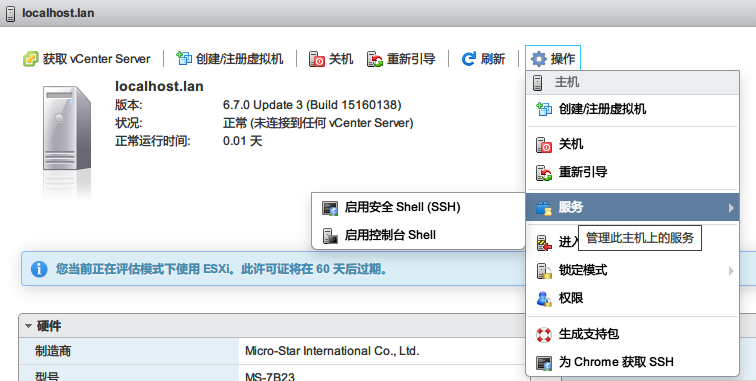

1. 先打开安全shell，如上图（截图的时候是6.7，无所谓，7.0也一样）
2. 进入shell，通过ssh连接，用户root，密码就是安装时候设置的密码
3. 查看板载SATA硬件ID号，如下，我的硬件ID号是a352，8086代表供应商是intel

```shell
lspci -v | grep "Class 0106" -B 1

0000:00:17.0 Mass storage controller SATA controller: Intel Corporation Cannon Lake PCH-H AHCI Controller [vmhba0]
         Class 0106: 8086:a352


```

4. 开启直通配置，注意替换硬件ID号

```shell
# 拷贝
cp /etc/vmware/passthru.map  /etc/vmware/passthru.map.bak
# 添加备注，不加也行
sed -i '$a\# Intel Corporation Cannon Lake PCH-H AHCI Controller' /etc/vmware/passthru.map 
# 添加直通SATA配置，注意替换硬件ID号a352，你的不一定是a352
sed -i '$a\8086 a352 d3d0 false' /etc/vmware/passthru.map 
```

5. 去页面上重启ESXi

重启去管理 >> 硬件，找到AHCI类似字样的设备，切换直通，切换后再次重启，显示为活动说明已直通。

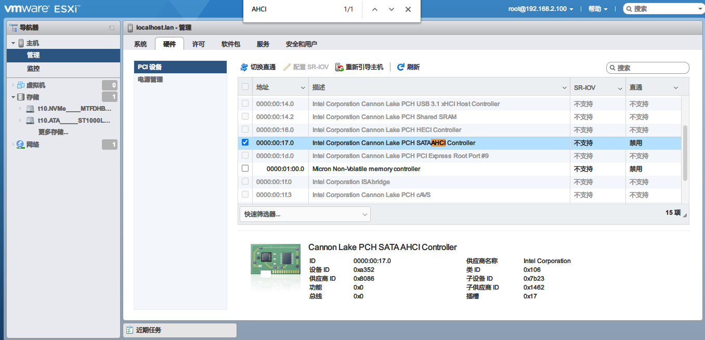

## 直通核显

核显自身支持直通，不需要特别设置，如果切换后发现一直是**“已启用 / 需要重新引导”状态**多重启几下，此处没查出原因。最后显示活动说明直通成功。

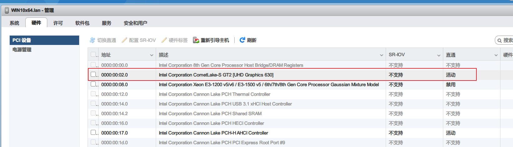

关于直通独显？直通独显后可以直接输出HDMI信号，和使用物理机基本一致，目前我还没有该需求，本身ESXi就是用作服务器，少有连接显示器的需求，等后面有需求了在折腾。

## 安装WIndows10

我安装的版本是Windows 10 LSTC，具体可到MSDN上下载镜像文件，新建虚拟机就不细说了，主要说明网卡需要选择两个

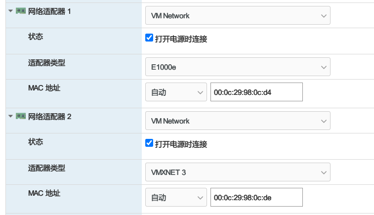

E1000e是1Gbps网卡，用于连外网、VMXNET3是10Gbps网卡，用于内网，也就是虚拟机之间硬盘共享，因为硬盘都给Windows10了，其他虚拟机没有硬盘，所以Win10需要通过提供iSCSI服务让别的虚拟机挂载该虚拟网络硬盘，数据走VMXNET3，否则过路由器速度会很慢！

- iSCSI步骤：Win10打开iSCSI服务，ESXi存储 >> 适配器 >> 软件iSCSI，填入Win10提供的iSCSI服务的IP，如果连接成功，在设备里面会多出网络存储设备，该设备用于其他虚拟机使用

关于Win10使用核显说明：装好之后一定要先设置虚拟机参数`hypervisor.cpuid.v0 = FALSE`（在虚拟机选项 >> 高级 >> 配置参数里面）**该参数会让显卡认为自己不是运行在虚拟机中，而是在物理机中，欺骗网卡驱动，否则会遇到臭名昭著的43错误问题**！

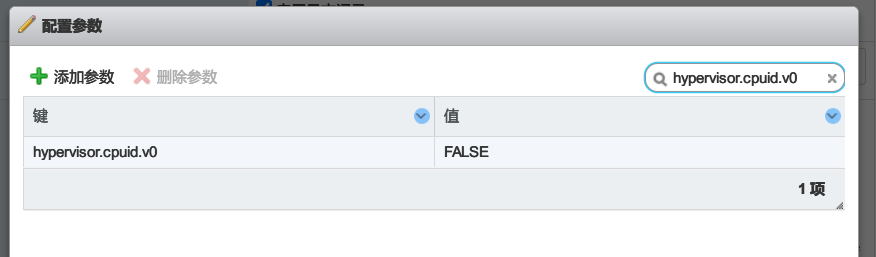

设置好改参数后再进入系统，安装vmware-tools，然后在设备管理器中选中显示设备，右键Microsoft基本显示适配器（大概是这名），选择搜索安装驱动，装好如下图，任务管理器也能看到核显使用情况，如遇到43问题，可能是上面参数没有设置！

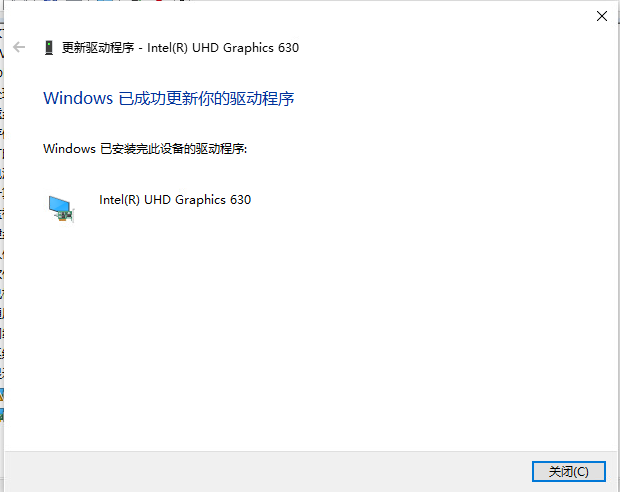

最后虚拟机里面还需要开启3D硬件加速，这样会流畅很多，如下图，默认是没开启的！

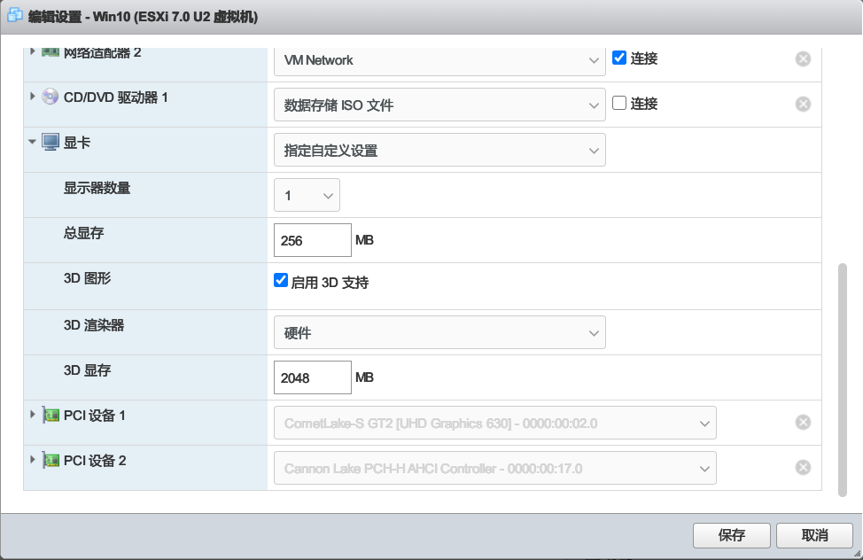

## 安装其他系统

其他系统大同小异，不再细说，主要是主力系统需要直通硬件，会有比较多的坑，其他系统不直通硬件，使用的都是ESXi分配的虚拟硬件，一直下一步就OK


## 参考

- https://blog.irain.in/archives/ESXi_Synology_10G_Passthrough.html
- https://post.smzdm.com/p/a3d4mqdk/
- https://www.chiphell.com/thread-2292749-1-1.html
- https://tieba.baidu.com/p/6362294403
- https://blog.csdn.net/gaokang_1992/article/details/111530671
- https://post.smzdm.com/p/a5k6de9x/
- https://blog.51cto.com/lookingdream/2113902
- https://www.cnblogs.com/rui517hua20/p/13405949.html
- https://blog.csdn.net/tmaccs/article/details/111595474
- https://www.right.com.cn/forum/thread-4045612-1-1.html
- https://blog.csdn.net/qiaohewei/article/details/108622880
- https://www.chiphell.com/thread-2208833-1-1.html


