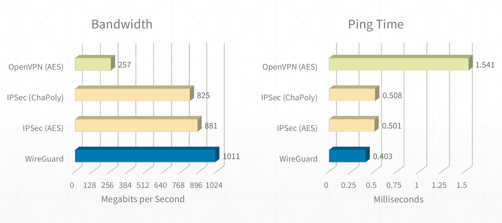
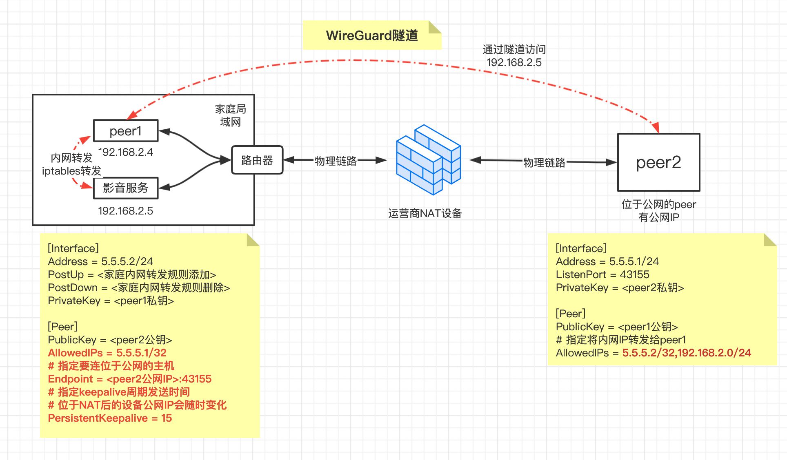
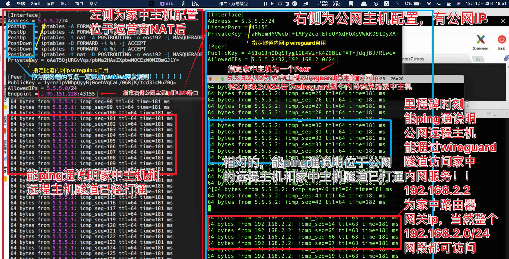
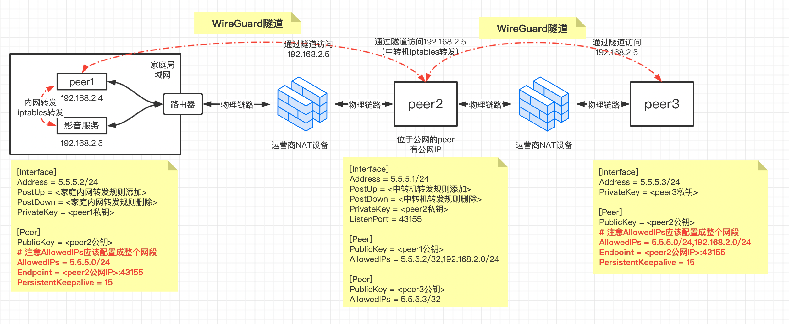
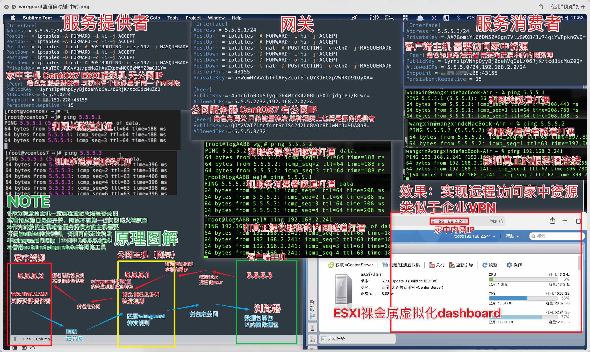
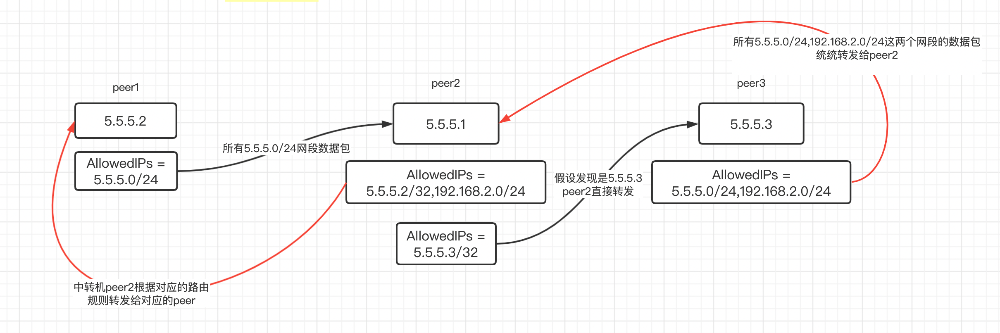

# 2021-12-18_被Linux创始人称做艺术品的组网神器——WireGuard

 

`WireGuard` 是由 `Jason Donenfeld` 等人用 `C` 语言编写的一个开源3层网络隧道工具，被视为下一代 VPN 协议，旨在解决许多困扰 `IPSec/IKEv2`、`OpenVPN` 或 `L2TP` 等其他 VPN 协议的问题。它与 `Tinc` 和 `MeshBird` 等现代 VPN 产品有一些相似之处，即加密技术先进、配置简单。从 2020 年 1 月开始，它已经并入了 Linux 内核的 `5.6` 版本，这意味着大多数 Linux 发行版的用户将拥有一个开箱即用的 WireGuard。

无论你是想破墙而出，还是想在服务器之间组网，WireGuard 都不会让你失望，它就是组网的『乐高积木』，就像 ZFS 是构建文件系统的『乐高积木』一样。

Linux创始人Linus Torvalds在邮件中称其为一件艺术品：`work of art`，邮件原文：https://lists.openwall.net/netdev/2018/08/02/124

> Can I just once again state my love for it and hope it gets merged soon? Maybe the code isn't perfect, but I've skimmed it, and compared to the horrors that are OpenVPN and IPSec, it's a work of art.
>
> **我能再说一次我非常喜欢它并且希望它能尽快并入内核么？或许代码不是最完美的，但是我大致浏览了一下，和OpenVPN、IPSec的恐怖相比，它就是一件艺术品。**

## 特点

WireGuard 与其他 VPN 协议的性能测试对比：



可以看到 WireGuard 直接碾压其他 VPN 协议。再来说说 `OpenVPN`，大约有 10 万行代码，而 WireGuard 只有大概 `4000` 行代码，代码库相当精简。

WireGuard 优点：

- 配置精简，可直接使用默认值
- 只需最少的密钥管理工作，每个主机只需要 1 个公钥和 1 个私钥。
- 就像普通的以太网接口一样，以 Linux 内核模块的形式运行，资源占用小。
- 能够将部分流量或所有流量通过 VPN 传送到局域网内的任意主机。
- 能够在网络故障恢复之后自动重连，戳到了其他 VPN 的痛处。
- 比目前主流的 VPN 协议，连接速度要更快，延迟更低（见上图）。
- 使用了更先进的加密技术，具有前向加密和抗降级攻击的能力。
- 支持任何类型的二层网络通信，例如 `ARP`、`DHCP` 和 `ICMP`，而不仅仅是 TCP/HTTP。
- 可以运行在主机中为容器之间提供通信，也可以运行在容器中为主机之间提供通信。

WireGuard 不能做的事：

- 类似 gossip 协议实现网络自愈。
- 通过信令服务器突破双重 NAT。
- 通过中央服务器自动分配和撤销密钥。
- 发送原始的二层以太网帧。

当然，你可以使用 WireGuard 作为底层协议来实现自己想要的功能，从而弥补上述这些缺憾。

注意

- 关于深度包检测：WireGuard并不关注混淆问题。相反，混淆应该发生在WireGuard之上的一层，WireGuard专注于以简单的实现方式提供坚实的加密技术，可以在上层进行混淆操作。
- UDP协议：WireGuard默认使用UDP协议，由于TCP-over-TCP隧道的网络性能非常糟糕，WireGuard明确地不支持TCP隧道。相反，将WireGuard的UDP数据包转化为TCP是上层混淆的工作，可以由udptunnel和udp2raw等项目完成。

## 安装

- 官方安装手册：https://www.wireguard.com/install/
- docker安装：https://hub.docker.com/r/linuxserver/wireguard

## 牛刀小试

最开始尝试可以在内网中进行，避开互联网不稳定或者防火墙等因素，节点可以是内网中的两台虚拟机或者跑两个docker容器进行尝试。

下面在docker容器中进行最简单的配置，环境信息如下：

- Linux：CentOS Linux release 7.9.2009 (Core)
- docker版本：20.10.11

### 环境准备

创建两个容器wg1和wg2

- `-v /lib/modules:/lib/modules`:指定了共享操作系统lib，否则会安装linux kernel header

```shell
# 创建wg1
docker run --rm -it --entrypoint=bash \
  --name=wg1 \
  --cap-add=NET_ADMIN \
  --cap-add=SYS_MODULE \
  -e PUID=1000 \
  -e PGID=1000 \
  -v /lib/modules:/lib/modules \
  --sysctl="net.ipv4.conf.all.src_valid_mark=1" \
  linuxserver/wireguard 
  
# 同样的方式，新开一个session创建wg2
docker run --rm -it --entrypoint=bash \
  --name=wg2 \
  --cap-add=NET_ADMIN \
  --cap-add=SYS_MODULE \
  -e PUID=1000 \
  -e PGID=1000 \
  -v /lib/modules:/lib/modules \
  --sysctl="net.ipv4.conf.all.src_valid_mark=1" \
  linuxserver/wireguard 
  
# 在新开一个session查看wg1和wg2的ip，记住此IP，后续会用到
docker inspect wg1 | grep IPAddress # 假设是172.17.0.2
docker inspect wg2 | grep IPAddress # 假设是172.17.0.3
```

### 配置生成

在wg1上执行如下命令生成wg1和wg2的配置

```shell

cd ~

# 生成wg1和wg2的公钥私钥配对
wg genkey | tee wg1-prikey | wg pubkey > wg1-pubkey
wg genkey | tee wg2-prikey | wg pubkey > wg2-pubkey

# 分别赋值
WG1_PRIKEY=`cat wg1-prikey`
WG1_PUBKEY=`cat wg1-pubkey`
WG2_PRIKEY=`cat wg2-prikey`
WG2_PUBKEY=`cat wg2-pubkey`
# 此例中以wg1作为服务端，所以endpoint配置成wg1的
WG1_IP=172.17.0.2
WG1_PORT=10240


# 生成适用于wg1的配置
cat > wg1.conf<<EOF
[Interface]
Address = 5.5.5.1/24
ListenPort = ${WG1_PORT}
PrivateKey = ${WG1_PRIKEY}

[Peer]
PublicKey = ${WG2_PUBKEY}
AllowedIPs = 5.5.5.2/32
EOF

# 生成适用于wg2的配置
cat > wg2.conf<<EOF
[Interface]
Address = 5.5.5.2/24
PrivateKey = ${WG2_PRIKEY}

[Peer]
PublicKey = ${WG1_PUBKEY}
Endpoint = ${WG1_IP}:${WG1_PORT}
AllowedIPs = 5.5.5.1/32
EOF


```

生成的配置类似如下，由于wireguard中是不区分服务端于客户端的，只添加peer，谁主动发起连谁就是客户端，因此发起一方必须得知道应该往哪里发，所以至少在发起端配置endpoint，本例中以wg2作为发起端，因此在wg2中配置wg1的endpoint。

注意IP地址的CIRD（Classless Inter-Domain Routing）表示法：

- 首先明确子网掩码的含义：*A subnet mask is a number that defines a range of IP addresses available within a network*，即子网掩码用于表示一个网络中IP地址的范围，如`255.255.255.0`表示该网络中IP地址的最后一位可以变化，因为IP地址点分子节，一个字节表示范围是0~255，一共256个IP地址，其中0表示该网络自身（如192.168.1.0），255表示该网络中的广播地址（如192.168.1.255），其余均表示该网络中主机，一共能表示254个主机。

- `5.5.5.1/24`：表示IP为`5.5.5.1`，`/24`表示子网掩码是`255.255.255.0`，其中255表示一个字节，一个字节有8位，所以`255.255.255.0`的二进制中一共有3*8=24个1，因此是`/24`
- `5.5.5.1/32`：表示IP为`5.5.5.1`，子网掩码位`255.255.255.255`
- `5.5.5.0/24`：不表示具体IP，表示整个IP段（范围），即`5.5.5.0 ~ 5.5.5.255`

`wg1.conf`：

```properties
# 定义网络接口
[Interface]
# 定义wireguard的内网IP
Address = 5.5.5.1/24
# 定义固定监听端口，让主动连接的一方配置
ListenPort = 10240 
PrivateKey = UEoWVGCrF5J54H0ocflf9E+ALfC484Os4GfI0sHxj2E=

# 定义peer
[Peer]
PublicKey = mdiAU//BGJJTSr+fGl/BKByarfHKhQ3Giqp4Pazz4nU=
# 非常重要，AllowedIPs本质上是路由规则，表示目标地址为5.5.5.2的数据包都往该peer发送
# AllowedIPs支持列表，如AllowedIPs = 5.5.5.2/32,192.168.2.0/24
AllowedIPs = 5.5.5.2/32
```

`wg2.conf`：

```properties
[Interface]
Address = 5.5.5.2/24
PrivateKey = IMu5e3LfN75Tx9lwewXH9ZDJBYwb1Kzsg8l7BfBQ7lk=

[Peer]
PublicKey = BlrbMx27LcCqAkRJ485m87ShfTLnJPeei+6COiDTWC4=
# 定义需要链接的服务端的IP和端口
Endpoint = 172.17.0.2:10240
AllowedIPs = 5.5.5.1/32
```

### 启动服务

wireguard默认配置文件路径为`/etc/wireguard`，使用快速配置工具`wg-quick`可快速启停，该工具本质是一个shell脚本

- wg1上操作

```shell l
# 拷贝配置文件到默认目录
$ cp wg1.conf /etc/wireguard

# 启动
$ wg-quick up wg1

[#] ip link add wg1 type wireguard
[#] wg setconf wg1 /dev/fd/63
[#] ip -4 address add 5.5.5.1/24 dev wg1
[#] ip link set mtu 1420 up dev wg1

# 查看
$ wg

interface: wg1
  public key: BlrbMx27LcCqAkRJ485m87ShfTLnJPeei+6COiDTWC4=
  private key: (hidden)
  listening port: 10240

peer: mdiAU//BGJJTSr+fGl/BKByarfHKhQ3Giqp4Pazz4nU=
  allowed ips: 5.5.5.2/32

```

- wg2上操作和wg1操作相同，wg显示信息略有不同

```shell l
$ wg

interface: wg2
  public key: mdiAU//BGJJTSr+fGl/BKByarfHKhQ3Giqp4Pazz4nU=
  private key: (hidden)
  listening port: 49238 # 端口为随机生成的UDP端口

peer: BlrbMx27LcCqAkRJ485m87ShfTLnJPeei+6COiDTWC4=
  endpoint: 172.17.0.2:10240  # 有指定wg1的IP和端口
  allowed ips: 5.5.5.1/32
```


### 测试

此时如果在wg1上ping wg2的内网IP `5.5.5.2`是ping不通的，因为wg1其实不知道wg2应该连接哪个IP和端口

```shell
$ ping 5.5.5.2
PING 5.5.5.2 (5.5.5.2) 56(84) bytes of data.
From 5.5.5.1 icmp_seq=1 Destination Host Unreachable
ping: sendmsg: Destination address required
...
```

但是在wg2上ping wg1的内网IP `5.5.5.1`是可以ping通的，因为配置了相应的endpoint

```shell
$ ping 5.5.5.1
PING 5.5.5.1 (5.5.5.1) 56(84) bytes of data.
64 bytes from 5.5.5.1: icmp_seq=1 ttl=64 time=0.493 ms
64 bytes from 5.5.5.1: icmp_seq=2 ttl=64 time=0.195 ms
```

此时wg1和wg2 peer已经配对，再在wg1上ping wg2可以ping通，至此简单的隧道已搭建完毕。

## 场景一：直连

所谓直连，是指peer的一端位于NAT后，没有公网IP地址，另一端位于公网中，有独立的不变IP地址，通过位于NAT后的peer主动加入位于公网的peer达到组网的目的，假设位于NAT后的peer提供了局域网服务，那么位于公网的peer就可以直接访问NAT后的局域网服务，如下图所示：



假设位于公网主机的IP为3.68.156.128，称为peer2，位于NAT后的主机称为peer1，那么peer2的配置应该如下，注意，以下配置私钥只是举例，请勿照搬，应参考牛刀小试中自行修改。

### peer2配置

```properties
[Interface]
Address = 5.5.5.1/24
# 端口定义，peer1需要指定
ListenPort = 43155
PrivateKey = aHWomHYVWebT+lAPyZcofEfdQYXdFOXpVWRKD91OyXA=

# peer1的配置
[Peer]
PublicKey = 451o6In0DqSTyg1GE4WzrK4Z0BLuFXTrjdqjBJ/RLwc=
# 非常重要，指定将目标IP匹配上5.5.5.2/32或192.168.2.0/24的数据包发送给该peer
AllowedIPs = 5.5.5.2/32,192.168.2.0/24
```

**注意**，如果配置之后连不上，可能是由于防火墙的干扰，如下命令放行UDP端口

```shell
# 放开udp 43155端口
iptables -A INPUT -p udp --destination-port 43155 -j ACCEPT
# 关闭该端口
#iptables -D INPUT -p udp --destination-port 43155 -j ACCEPT

```

### peer1配置

peer1的配置应该如下：

- 其中iptables规则中eth0根据实际情况修改，原则是要将wireguard网卡收到的数据转发给主机网卡发送出去，并且配置了MASQUERADE，源地址将修改成eth0的地址，达到该数据包是peer1产生并发送到内网其他主机的（其实该数据包来源于位于公网的peer2）
- **PersistentKeepalive**参数用于保持链接的存活，默认情况下wireguard在不使用的情况下尽量少发送数据包，但是在对于位于NAT后的peer1来讲，其公网地址随时都在变化，所以我们希望通过定时发送存活包让peer2知晓peer1的公网地址与对应的端口，保持链接的存活性，这就是所谓的IP漫游。

```properties
[Interface]
Address = 5.5.5.2/24
# 内网转发规则，将数据包做MASQUERADE源地址转换，并通过eth0转发出去
# eth0根据实际情况修改，ifconfig可查看
PostUp   = iptables -A FORWARD -i %i -j ACCEPT
PostUp   = iptables -A FORWARD -o %i -j ACCEPT
PostUp   = iptables -t nat -A POSTROUTING -o eth0 -j MASQUERADE
# 在wireguard关闭时清除这些iptables转发规则
PostDown = iptables -D FORWARD -i %i -j ACCEPT
PostDown = iptables -D FORWARD -o %i -j ACCEPT
PostDown = iptables -t nat -D POSTROUTING -o eth0 -j MASQUERADE
PrivateKey = oAaT5OjURGvVqs/pbMa2HAsZXpbwNQCEzW0MZBmGJ1Y=


# 指定peer2
[Peer]
PublicKey = 1yrnzlpVNhpQyyBj0oehVqCaL/06RjK/tcd3icMuZ0Q=
AllowedIPs = 5.5.5.1/32
# 指定peer2的Endpoint，用于隧道外层网络的链接
Endpoint = 3.68.156.128:43155
# 每隔15s发送一个keepalive数据包
# 让位于公网的peer2记住peer1的最新链接地址
PersistentKeepalive = 15
```

在peer2中启动服务，输出如下信息

```shell
$ wg
interface: wg10
  public key: 1yrnzlpVNhpQyyBj0oehVqCaL/06RjK/tcd3icMuZ0Q=
  private key: (hidden)
  listening port: 43155
```

在peer1中启动服务，输出如下信息，可以观察到

- `latest handshake: 3 seconds ago`：最后一次握手在3秒前，配置了PersistentKeepalive会主动握手
- `persistent keepalive: every 15 seconds`：保持链接存储周期，每个15秒发送keepalive包

```shell
$ wg
interface: wg10
  public key: 451o6In0DqSTyg1GE4WzrK4Z0BLuFXTrjdqjBJ/RLwc=
  private key: (hidden)
  listening port: 33807

peer: 1yrnzlpVNhpQyyBj0oehVqCaL/06RjK/tcd3icMuZ0Q=
  endpoint: 3.68.156.128:43155
  allowed ips: 5.5.5.1/32
  latest handshake: 3 seconds ago
  transfer: 92 B received, 180 B sent
  persistent keepalive: every 15 seconds
```

此时，再去peer2中查看wg信息，可以看到peer1的endpoint自动加上了，该endpoint和端口会根据NAT进行变化，这就是所谓IP漫游，而这一点是用户感知不到的，无需关心。

```shell
$ wg
interface: wg10
  public key: 1yrnzlpVNhpQyyBj0oehVqCaL/06RjK/tcd3icMuZ0Q=
  private key: (hidden)
  listening port: 43155

peer: 451o6In0DqSTyg1GE4WzrK4Z0BLuFXTrjdqjBJ/RLwc=
  endpoint: 5.20.222.65:33807
  allowed ips: 5.5.5.2/32, 192.168.2.0/24
  latest handshake: 26 seconds ago
  transfer: 212 B received, 92 B sent
```

尝试在peer2上访问peer1上的内网服务

```shell
# 用于wireguard自身的内网IP
ping 5.5.5.2
PING 5.5.5.2 (5.5.5.2) 56(84) bytes of data.
64 bytes from 5.5.5.2: icmp_seq=1 ttl=64 time=192 ms
...

# 用于真实访问的内网IP，如家庭内网中的影音服务
ping 192.168.2.5
PING 192.168.2.5 (192.168.2.5) 56(84) bytes of data.
64 bytes from 192.168.2.5: icmp_seq=1 ttl=127 time=193 ms
...
```

最后请注意，peer1最好使用Linux系统，因为需要使用iptables进行流量转发，windows系列转发实现较为复杂，可能需要使用powershell来实现相关转发。

如下为测试直连场景时的截图说明



## 场景二：中转

**注意，应该先看直连方案后在看中转方案，中转方案是基于直连方案之上的。**且对wireguard配置文件有一定了解

在现实情况中更多的场景是中转，如两台设备都处于NAT中，一台设备需要访问另外一台设备所处的内网，假设是peer1，peer2仍然是处于公网中的主机（假设IP为3.68.156.128），peer3则是需要访问peer1中内网服务的主机，如下图所示：



### peer1配置

本地使用iptables进行家庭内网转发，指定peer为中转服务器peer2，并配置peer2的endpoint

```properties
[Interface]
Address = 5.5.5.2/24
# 注意eth0应修改为实际的网卡名字
PostUp   = iptables -A FORWARD -i %i -j ACCEPT
PostUp   = iptables -A FORWARD -o %i -j ACCEPT
PostUp   = iptables -t nat -A POSTROUTING -o eth0 -j MASQUERADE
PostDown = iptables -D FORWARD -i %i -j ACCEPT
PostDown = iptables -D FORWARD -o %i -j ACCEPT
PostDown = iptables -t nat -D POSTROUTING -o eth0 -j MASQUERADE
PrivateKey = oAaT5OjURGvVqs/pbMa2HAsZXpbwNQCEzW0MZBmGJ1Y=

# 指定为peer2（即中转服务器）
[Peer]
PublicKey = 1yrnzlpVNhpQyyBj0oehVqCaL/06RjK/tcd3icMuZ0Q=
#AllowedIPs = 5.5.5.1/32
#注意此处配置成网段5.5.5.0/24，而不仅仅是中转机的内网IP 5.5.5.1/32
#因为5.5.5.3也需要发给中转机去做转发，后续配置peer3的时候也是一样
AllowedIPs = 5.5.5.0/24
Endpoint = 3.68.156.128:43155
PersistentKeepalive = 15
```

### peer2配置

中转服务器的配置，中转服务器也需配置iptables转发规则，将peer3的流量转发给peer1

```properties
[Interface]
Address = 5.5.5.1/24
PostUp   = iptables -A FORWARD -i %i -j ACCEPT
PostUp   = iptables -A FORWARD -o %i -j ACCEPT
PostUp   = iptables -t nat -A POSTROUTING -o eth0 -j MASQUERADE
PostDown = iptables -D FORWARD -i %i -j ACCEPT
PostDown = iptables -D FORWARD -o %i -j ACCEPT
PostDown = iptables -t nat -D POSTROUTING -o eth0 -j MASQUERADE
ListenPort = 43155
PrivateKey = aHWomHYVWebT+lAPyZcofEfdQYXdFOXpVWRKD91OyXA=

[Peer]
PublicKey = 451o6In0DqSTyg1GE4WzrK4Z0BLuFXTrjdqjBJ/RLwc=
#注意此处配置成具体的IP而不是IP段：5.5.5.2/32
#192.168.2.0/24配置成IP段是想让所有该网段的流量都流向peer1
AllowedIPs = 5.5.5.2/32,192.168.2.0/24


[Peer]
PublicKey = QOY2VaTZLtof4rtSrTS42d2Ld8vOc8hJwNcJu9DA8h8=
#同理，此处配置为IP
AllowedIPs = 5.5.5.3/32

```

**注意**，如果配置之后连不上，可能是由于防火墙的干扰，如下命令放行UDP端口

```shell
# 放开udp 43155端口
iptables -A INPUT -p udp --destination-port 43155 -j ACCEPT
# 关闭该端口
#iptables -D INPUT -p udp --destination-port 43155 -j ACCEPT

```

### peer3配置

peer3配置最简单，只作为流量接收，不做转发，需要配置peer2的endpoint

```properties
[Interface]
Address = 5.5.5.3/24
PrivateKey = AA7GomiYl60DW5ZAGgn7VlwGWX8/Jw74qiYWPpknGWQ=


[Peer]
PublicKey = 1yrnzlpVNhpQyyBj0oehVqCaL/06RjK/tcd3icMuZ0Q=
# 特别注意，此处应该配置成IP段
# 因为就peer3而言，整个5.5.5.0/24和192.168.2.0/24网段都应该发给中转机处理
AllowedIPs = 5.5.5.0/24,192.168.2.0/24
Endpoint = 3.68.156.128:43155
PersistentKeepalive = 15
```

### 测试

基础的测试是在三台主机上分别ping 5.5.5.1、5.5.5.2、5.5.5.3这三个IP，能ping通说明组网成功，最后在peer3上ping目标内网域名

```shell
$ ping 192.168.2.5
PING 192.168.2.5 (192.168.2.5) 56(84) bytes of data.
64 bytes from 192.168.2.5: icmp_seq=1 ttl=127 time=213 ms
64 bytes from 192.168.2.5: icmp_seq=2 ttl=127 time=213 ms
...
```

如下为测试中转（网关）场景时的截图说明



### IP路由规则

- pee1中，指定peer2为中转机peer，并且所有5.5.5.0/24网段的IP数据都发送给该peer，因此指定`AllowedIPs = 5.5.5.0/24`
- peer2中作为纯流量转发，一个原则就是是谁的数据就发送给相应的peer
- peer3和peer1情况类似，指定peer2作为中转机，并且将所有5.5.5.0/24网段的IP数据都发送给该peer



# 参考

- 官网：https://www.wireguard.com/
- 技术白皮书：https://www.wireguard.com/papers/wireguard.pdf
- WireGuard 搭建和使用折腾小记(terminal 生成二维码)：https://www.10101.io/2018/11/10/wireguard
- Wireguard构建局域网NAT访问：https://huelse.gitee.io/posts/wireguard-nat-lan/
- 通过 Wireguard 构建 NAT to NAT VPN：https://anyisalin.github.io/2018/11/21/fast-flexible-nat-to-nat-vpn-wireguard/
- quickStart：https://www.wireguard.com/quickstart/
- 使用 WiregGuard 更安全的访问内网：https://new.negoces.top/posts/2fcbf547/
- WireGuard 搭建方法与使用教程：https://blog.starryvoid.com/archives/337.html#7
- WireGuard 教程：WireGuard 的搭建使用与配置详解：https://fuckcloudnative.io/posts/wireguard-docs-practice/
- WireGuard 教程：WireGuard 的工作原理：https://fuckcloudnative.io/posts/wireguard-docs-theory/