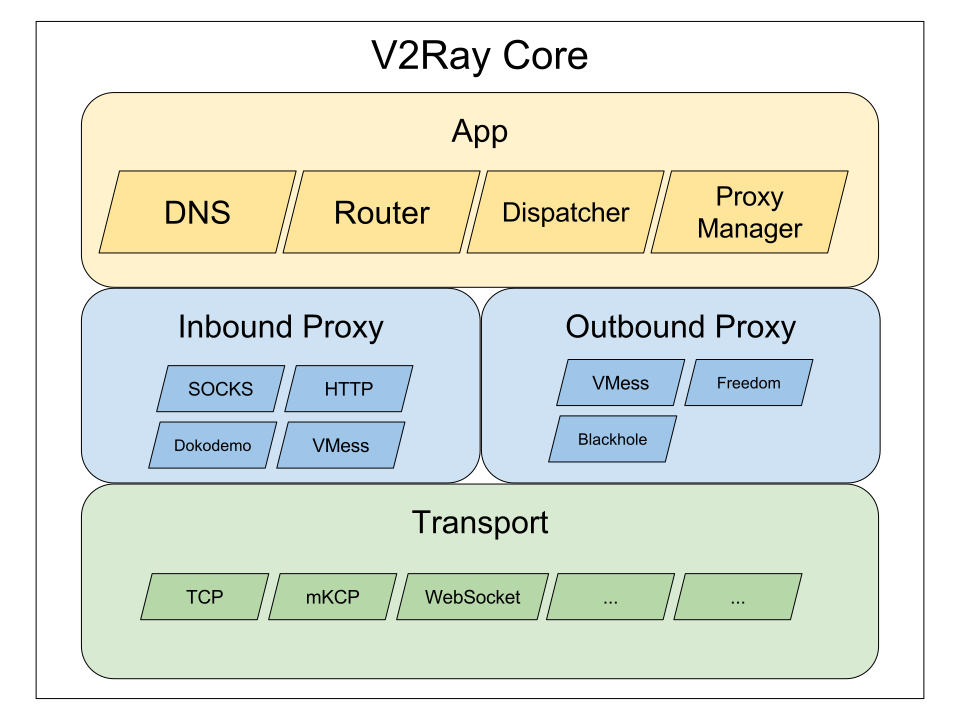
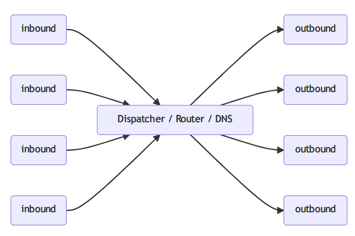
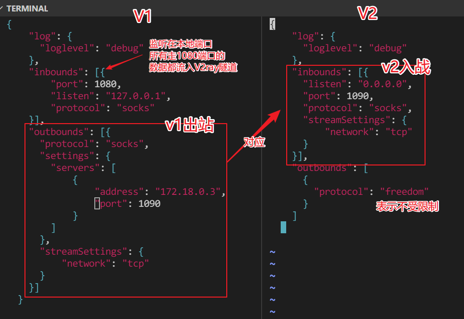
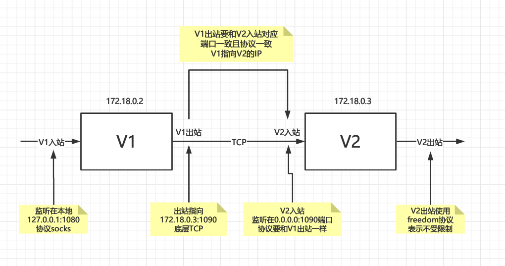
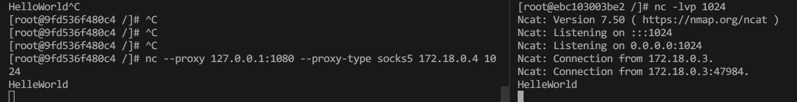
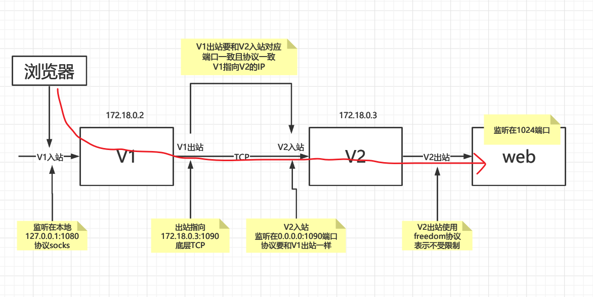
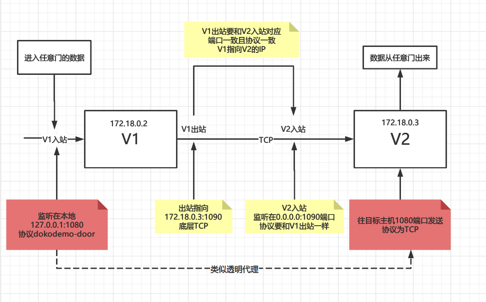
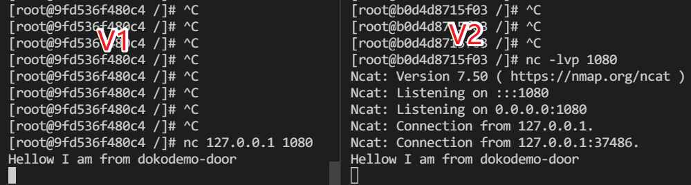
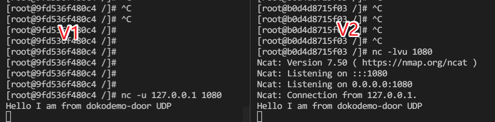
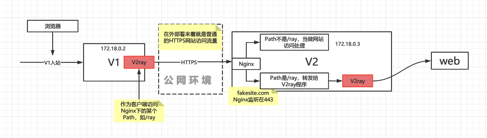

# 一群匿名者打造的强大基础通信网络构建工具——V2ray


Project V 是一个工具集合，它可以帮助你打造专属的基础通信网络。Project V 的核心工具称为`V2Ray`，其主要负责网络协议和功能的实现，与其它 Project V 通信。V2Ray 可以单独运行，也可以和其它工具配合，以提供简便的操作流程。

本站点主要包含了 V2Ray 的使用手册，以及其它 Project V 相关工具的介绍与链接。

## 主要特性

- 多入口多出口: 一个 V2Ray 进程可并发支持多个入站和出站协议，每个协议可独立工作。
- 可定制化路由: 入站流量可按配置由不同的出口发出。轻松实现按区域或按域名分流，以达到最优的网络性能。
- 多协议支持: V2Ray 可同时开启多个协议支持，包括 Socks、HTTP、VMess 等。每个协议可单独设置传输载体，比如 TCP、mKCP、WebSocket 等。
- 隐蔽性: V2Ray 的节点可以伪装成正常的网站（HTTPS），将其流量与正常的网页流量混淆，以避开第三方干扰。
- 反向代理: 通用的反向代理支持，可实现内网穿透功能。
- 多平台支持: 原生支持所有常见平台，如 Windows、Mac OS、Linux，并已有第三方支持移动平台。

> Project V 由谁主导开发?
>
> 我们是一群爱好自由的人们。我们倾向于保持匿名，尽可能地不透露任何身份信息。


## 架构

内核分为三层：从上往下依次是应用层、代理层和传输层。每一层内包含数个模块，模块间互相独立，同类型的模块可无缝替换。



1. 应用层：应用层包含一些代理层中常用的功能，这些功能被抽象出来，以便在不同的代理模块中复用。应用层的模块应为纯软件实现，与硬件或平台相关的技术无关。

- Dispatcher: 用于把入站代理所接收到的数据，传送给出站代理
- Router: 内置路由
- DNS: 内置的 DNS 缓存
- Proxy Manager: 入站代理的管理器
2. 代理层：代理层分为两部分：入站代理（Inbound Proxy）和出站代理（Outbound Proxy）。两部分相互独立，入站代理不依赖于某个特定的出站代理，反之亦然。



- 需要配置至少一个入站代理（Inbound）和一个出站代理（Outbound）才可以正常工作。
- 入站代理通常可以配置用户认证，如 ID 和密码等；
- 入站代理收到数据之后，会交给分发器（Dispatcher）进行分发；
- 出站代理负责将数据发给服务器，如另一台主机上的 V2Ray。
- 当有多个出站代理时，可以配置路由（Routing）来指定某一类流量由某一个出站协议发出。

3. 传输层，传输层提供一些网络数据传输相关的工具模块，支持TCP、mKCP、WebSocket等

V2ray支持的协议列表如下

- [Blackhole](https://www.v2fly.org/config/protocols/blackhole.html)
- [DNS](https://www.v2fly.org/config/protocols/dns.html)
- [Dokodemo-door](https://www.v2fly.org/config/protocols/dokodemo.html)
- [Freedom](https://www.v2fly.org/config/protocols/freedom.html)
- [HTTP](https://www.v2fly.org/config/protocols/http.html)
- [Socks](https://www.v2fly.org/config/protocols/socks.html)
- [VMess](https://www.v2fly.org/config/protocols/vmess.html)
- [Shadowsocks](https://www.v2fly.org/config/protocols/shadowsocks.html)
- [Trojan](https://www.v2fly.org/config/protocols/trojan.html)
- [VLESS](https://www.v2fly.org/config/protocols/vless.html)
- [Loopback](https://www.v2fly.org/config/protocols/loopback.html)

支持的传输方式如下

- [TCP](https://www.v2fly.org/config/transport/tcp.html)
- [mKCP](https://www.v2fly.org/config/transport/mkcp.html)
- [WebSocket](https://www.v2fly.org/config/transport/websocket.html)
- [HTTP/2](https://www.v2fly.org/config/transport/h2.html)
- [QUIC](https://www.v2fly.org/config/transport/quic.html)
- [DomainSocket](https://www.v2fly.org/config/transport/domainsocket.html)
- [gRPC](https://www.v2fly.org/config/transport/grpc.html)

在一个V2ray里，这些协议列表和传输方式可以自由组合，多个V2ray可以负载均衡或者以链式的方式连接，不区分客户端与服务端，谁主动连接谁就是客户端，并且可以配合相应路由策略，这也正是V2ray的强大所在，但是也有缺点，那就是配置文件过于复杂，对于新手不太友好，考虑到这点，也有对应的[配置样例](https://github.com/v2fly/v2ray-examples)，这些样例列出了常见的协议和传输方式的组合，参考性极佳。

## 基础入门

本文重点不讲V2ray的配置字段，这些字段官网有文档可以查询：https://www.v2fly.org/config/overview.html

本文重点在于从实战中了解和掌握V2ray的多样与强大，不然怎么能称之为基础通信网络的打造工具呢？

### 环境准备

本文不以公网的服务器作为环境，网络过于复杂，实战成本太高，而是选择在docker中进行实战，以多个centos容器作为节点，成本更低且由于在容器中，进程和网络连接会少很多，便于观察。

首先准备依然Linux服务器，并且安装docker，然后创建三个容器，分贝是v1、v2和web，v1作为客户端，v2作为服务器端，web作为v1需要访问的第三方服务（假设v1不能访问web，但是v2可以访问，于是通过v2ray就可以实现v1访问web，这是最基础的需求）。

- v1： 172.18.0.2
- v2：172.18.0.3
- web：172.18.0.4

```shell
# 首先创建一个桥接网络，在自己的桥接网络上才能实现ip自定义
docker network create --subnet=172.18.0.0/16 mynet

# 创建三个容器，分别是v1、v2、web
# 注意需要在三个session中操作
docker run --name v1 --network mynet --ip 172.18.0.2 -it centos:7 bash 
docker run --name v2 --network mynet --ip 172.18.0.3 -it centos:7 bash 
docker run --name web --network mynet --ip 172.18.0.4 -it centos:7 bash 


# 如要重建或删除，命令如下
# docker stop v1 v2 web && docker rm v1 v2 web
```

在每个容器中安装如下工具

- `nc`：netcat，用于验证V2ray是否生效
- `tcpdump`：用于抓包观察

```shell
yum install -y unzip wget nc net-tools tcpdump
```

### 安装

V2ray由Go语言编写而成，最终是一个二进制文件，给与执行权限即可。如下为安装脚本，在v1和v2中执行

- github发布页：https://github.com/v2fly/v2ray-core/releases

```shell
# 定义版本，截止2021-12-24，最新版本为v4.44.0
VERSION=v4.44.0
# 创建目录
mkdir -p /usr/local/sbin/v2ray
# 下载
wget https://github.com/v2fly/v2ray-core/releases/download/$VERSION/v2ray-linux-64.zip
# 解压到指定目录
unzip v2ray-linux-64.zip -d /usr/local/sbin/v2ray && rm -rf v2ray-linux-64.zip
# 添加到环境变量
cat >> ~/.bashrc<<EOF
export PATH=$PATH:/usr/local/sbin/v2ray
EOF
# 使环境变量生效
. ~/.bashrc
```

安装完成后执行`v2ray`，有正确输出说明成功。

### Socks over TCP

开局一张图



- V1配置

```json
{
    "log": {
      "loglevel": "debug"
    },
    "inbounds": [{
        "port": 1080,
        "listen": "127.0.0.1",
        "protocol": "socks"
    }],
    "outbounds": [{
      "protocol": "socks",
      "settings": {
        "servers": [
            {
                "address": "172.18.0.3",
                "port": 1090
            }
        ]
      },
      "streamSettings": {
          "network": "tcp"
      }
    }]
  }
```

- V2配置

```json
{
    "log": {
      "loglevel": "debug"
    },
    "inbounds": [{
      "listen": "0.0.0.0",
      "port": 1090,
      "protocol": "socks",
      "streamSettings": {
          "network": "tcp"
      }
    }],
    "outbounds": [
      {
        "protocol": "freedom"
      }
    ]
  }
```

上面这些配置就是表达下图含义



- V1入战在本地监听1080端口，以本地1080端口为代理的程序数据都将流入V2ray，被其处理
- V1出站使用socks协议，并且传输层使用TCP，指向V2
- V2入战在本地监听1090端口，接收来自V1的出站流量
- V2出站为freedom，表示不设限制

将上面的配置保存成文件，然后分别在v1和v2上启动v2ray，启动命令如下：

```shell
# config.json为配置文件
v2ray -c config.json
```

启动后可以看到如下输出说明启动成功：

```properties
V2Ray 4.44.0 (V2Fly, a community-driven edition of V2Ray.) Custom (go1.17.3 linux/amd64)
A unified platform for anti-censorship.
2021/12/24 13:01:35 [Info] main/jsonem: Reading config: c-sock2sock.json
2021/12/24 13:01:35 [Debug] app/log: Logger started
2021/12/24 13:01:35 [Debug] app/proxyman/inbound: creating stream worker on 127.0.0.1:1080
2021/12/24 13:01:35 [Info] transport/internet/tcp: listening TCP on 127.0.0.1:1080
2021/12/24 13:01:35 [Warning] V2Ray 4.44.0 started
```

现在终于来到了激动人心的测试环节，测试思路为在v1上对web进行访问，看看web那边识别到的是v1的IP还是v2的IP，如果是v2的IP，说明链路搭建成功；同时在v2上进行抓包，观察v1到v2和v2到web的数据流量

0. 新开一个session进入v2（`docker exec -it v2 bash`），进行抓包，抓包eth0网卡上的TCP流量，输出详细信息。

```shell
$ tcpdump -nn -vv -XX tcp
tcpdump: listening on eth0, link-type EN10MB (Ethernet), capture size 262144 bytes
```

1. 在web上执行如下命令，进行监听，监听在1024端口

```shell
$ nc -lvp 1024
Ncat: Version 7.50 ( https://nmap.org/ncat )
Ncat: Listening on :::1024
Ncat: Listening on 0.0.0.0:1024
```

2. 新开一个session进入v1（`docker exec -it v1 bash`），使用代理对web进行访问

```
nc --proxy 127.0.0.1:1080 --proxy-type socks5 172.18.0.4 1024
```

此时观察web的控制台，会发现有如下输出，表示`172.18.0.3`连接上来了，这不正好验证了我们的猜想么，我们是用v1访问的，结果web感知到是v2连接上来了

```
Ncat: Connection from 172.18.0.3.
Ncat: Connection from 172.18.0.3:47984.
```

在观察一下v2ray的日志作为辅助验证。

v1上的

```
2021/12/24 13:05:37 [Info] [3396642808] transport/internet/tcp: dialing TCP to tcp:172.18.0.3:1090
2021/12/24 13:05:37 tcp:127.0.0.1:37462 accepted tcp:172.18.0.4:1024
```

v2上的

```
[Info] [1092654943] proxy/socks: TCP Connect request to tcp:172.18.0.4:1024
2021/12/24 13:05:37 [Info] [1092654943] app/dispatcher: default route for tcp:172.18.0.4:1024
2021/12/24 13:05:37 [Info] [1092654943] proxy/freedom: opening connection to tcp:172.18.0.4:1024
2021/12/24 13:05:37 [Info] [1092654943] transport/internet/tcp: dialing TCP to tcp:172.18.0.4:1024
2021/12/24 13:05:37 tcp:172.18.0.2:52538 accepted tcp:172.18.0.4:1024
```

在v1上发送一个HelloWorld，web可以立马收到，如下图所示



在观察一下抓包的结果（技巧：**找length不为0的包**）

```shell

# v1在给v2发送数据，数据为HelleWorld
172.18.0.2.52544 > 172.18.0.3.1090: Flags [P.], cksum 0x585b (incorrect -> 0xfff9), seq 14:25, ack 13, win 229, options [nop,nop,TS val 27415461 ecr 27408941], length 11
        0x0000:  0242 ac12 0003 0242 ac12 0002 0800 4500  .B.....B......E.
        0x0010:  003f e3ee 4000 4006 fea0 ac12 0002 ac12  .?..@.@.........
        0x0020:  0003 cd40 0442 d7a1 d9d3 2331 e661 8018  ...@.B....#1.a..
        0x0030:  00e5 585b 0000 0101 080a 01a2 53a5 01a2  ..X[........S...
        0x0040:  3a2d 4865 6c6c 6557 6f72 6c64 0a         :-HelleWorld.
13:11:24.500964 IP (tos 0x0, ttl 64, id 40897, offset 0, flags [DF], proto TCP (6), length 63)
....省略若干行
....省略若干行
# v3再把数据发送给web，数据是HelleWorld
172.18.0.3.47984 > 172.18.0.4.1024: Flags [P.], cksum 0x585d (incorrect -> 0xccbc), seq 1:12, ack 1, win 229, options [nop,nop,TS val 27415461 ecr 27408941], length 11
        0x0000:  0242 ac12 0004 0242 ac12 0003 0800 4500  .B.....B......E.
        0x0010:  003f 9fc1 4000 4006 42cc ac12 0003 ac12  .?..@.@.B.......
        0x0020:  0004 bb70 0400 7d95 a593 c08e 1c9e 8018  ...p..}.........
        0x0030:  00e5 585d 0000 0101 080a 01a2 53a5 01a2  ..X]........S...
        0x0040:  3a2d 4865 6c6c 6557 6f72 6c64 0a         :-HelleWorld.
...
```

抓包结果也印证了猜想。最终的访问路径如下图



### HTTP over TCP

当然底层协议也可以是HTTP，相对于Socks而言，直接修改协议即可，其他无任何变化，关于http认证相关的配置参考官网，此处不再赘述

- v1配置

```json
{
    "log": {
      "loglevel": "debug"
    },
    "inbounds": [{
        "port": 1080,
        "listen": "127.0.0.1",
        "protocol": "socks"
    }],
    "outbounds": [{
      "protocol": "http", //只修改协议
      "settings": {
        "servers": [
            {
                "address": "172.18.0.3",
                "port": 1090
            }
        ]
      },
      "streamSettings": {
          "network": "tcp"
      }
    }]
  }
```

- v2配置

```json
{
    "log": {
      "loglevel": "debug"
    },
    "inbounds": [{
      "listen": "0.0.0.0",
      "port": 1090,
      "protocol": "http",//只修改协议
      "streamSettings": {
          "network": "tcp"
      }
    }],
    "outbounds": [
      {
        "protocol": "freedom"
      }
    ]
  }
  
```

### Vless over TCP

Vless还是较为常用，但是一般不配合纯TCP，一般配合TLS或者WebSockets传输，如下为Vless配合纯TCP（Vmess由于在公网中爆出漏洞已不建议使用，如果将Vmess隐藏于TLS之后那为何不用Vless？毕竟Vmess本身还多一次加密，TLS自身的加密已经够强了，不需要额外的加密）

- v1配置

```json
{
    "log": {
      "loglevel": "debug"
    },
    "inbounds": [{
        "port": 1080,
        "listen": "127.0.0.1",
        "protocol": "socks"
    }],
    "outbounds": [{
      "protocol": "vless",
      "settings": {
        "vnext": [
          {
            "address": "172.18.0.3",
            "port": 1090,
            "users": [{
              "id": "27848739-7e62-4138-9fd3-098a63964b6b",
              "encryption": "none",
              "level": 0
            }]
          }
        ]
      },
      "streamSettings": {
          "network": "tcp"
      }
    }]
  }
```

- v2配置

```json
{
    "log": {
      "loglevel": "debug"
    },
    "inbounds": [{
        "listen": "0.0.0.0",
        "port": 1090,
        "protocol": "vless",
        "settings": {
            "clients": [
                {
                    "id": "27848739-7e62-4138-9fd3-098a63964b6b",
                    "level": 0
                }
            ],
            "decryption": "none"
        },
        "streamSettings": {
            "network": "tcp"
        }
    }],
    "outbounds": [{
      "protocol": "freedom"
    }]
  }
```

### 任意门协议

任意门来源哆啦A梦中的任意门，表示从一个端口进去的流量会从另一个主机的端口流出来，如果有程序去接收，那么就能接收到原始流量，而不用关心传输层具体如何实现，如何隐匿。

以下以Vless Over TCP演示任意门协议，任意门主要在客户端，也就是流量发起端配置

- v1配置

```json
{
    "log": {
      "loglevel": "debug"
    },
    "inbounds": [{
        //任意门配置，监听在本地1080端口
        "port": 1080,
        "listen": "127.0.0.1",
        "protocol": "dokodemo-door",
        "settings":{
          //任意门远程主机的配置
          //从本地1080端口进入的流量都会发送到outbounds主机的1080端口
          "address": "127.0.0.1",
          "port": 1080,
          "network": "tcp"
        }
    }],
    "outbounds": [{
      "protocol": "vless",
      "settings": {
        "vnext": [
          {
            "address": "172.18.0.3",
            "port": 1090,
            "users": [{
              "id": "27848739-7e62-4138-9fd3-098a63964b6b",
              "encryption": "none",
              "level": 0
            }]
          }
        ]
      },
      "streamSettings": {
          "network": "tcp"
      }
    }]
  }
  
```

- v2配置（和Vless Over TCP一致）

```json
{
    "log": {
      "loglevel": "debug"
    },
    "inbounds": [{
        "listen": "0.0.0.0",
        "port": 1090,
        "protocol": "vless",
        "settings": {
            "clients": [
                {
                    "id": "27848739-7e62-4138-9fd3-098a63964b6b",
                    "level": 0
                }
            ],
            "decryption": "none"
        },
        "streamSettings": {
            "network": "tcp"
        }
    }],
    "outbounds": [{
      "protocol": "freedom"
    }]
  }
```

整体流程如下图所示



- 流量从v1的1080端口进入，从v1的1090端口出站发送到v2的1090端口，v2在将该数据发往v2的1080端口，被监听在v2 1080端口的程序接收

那可能有人要问了，为何不在v1直接往v2发？为啥要从1090端口绕一圈？答案是显而易见的

- 在安全要求较高的场景下，往任意门发的数据可以是明文，因为加密可以由底层来做，使用任意门可以**不用关心如何加密**
- **复用现有的信道**，假设v2上已经有一条现成的加密隧道（如HTTPS协议的网站），那么任意门可以直接复用，不用新开端口，因为在公网上随意新开端口可能导致不安全。
- **可结合其他网络工具**，如WireGuard，因为WireGuard本身是UDP，在公网中会被QoS，因此外面套一层TCP隧道可以明显减少干扰

测试，那么任意门如何测试呢？

首先需要在v2上开启对1080的TCP端口监听

```
nc -lvp 1080
```

其次在v1上连接127.0.0.1的1080端口，输入数据，如果在v2中能看到，说明成功，如下图所示



那么怎么转发UDP呢？只需要将任意门中的配置`"network": "tcp"`改成`"network": "udp"`即可，事实上，可以TCP禾UDP一起监听，用逗号隔开即可：`"network": "tcp,udp"`

UDP如何测试呢？当然要监听UDP的端口（`nc -lvu 1080`），连接也需要使用UDP端口连接，如下图所示



### 路由分流策略

V2ray中每个入站和出站都是数组，可以配置多个，并且可以配置tag标签，便于路由策略进行入站出站的选择（一定要配置tag标签），下面的配置实现了分流功能

- 国内IP、国内常见域名、私有网段（如192.168.1.0/24）不转发到v2，直接出站（freedom），相当于直连
- 其他未匹配到的IP或者域名走出站（outbounds）中的第一个出站协议

配置如下

- v1配置

```json
{
    "log": {
      "loglevel": "debug"
    },
    "inbounds": [{
        "port": 1080,
        "listen": "127.0.0.1",
        "protocol": "socks"
    }],
    "outbounds": [{
      "protocol": "socks",
      "settings": {
        "servers": [{
          "address": "172.18.0.3",
          "port": 1090
        }]
      },
      "streamSettings": {
          "network": "tcp"
      },
      "tag": "server1"
    },
    {
      "protocol": "freedom",
      "settings": {},
      //如果要使用路由，这个 tag 是一定要有的
      //在这里 direct 就是 freedom 的一个标号，在路由中说 direct V2Ray 就知道是这里的 freedom 了
      "tag": "direct"
    }
   ],
    "routing":{
      //表示碰到IP规则的时候先将域名解析成IP
      "domainStrategy": "IPOnDemand", 
      "rules": [
      {
        "type": "field",
        "outboundTag": "direct",
        "domain": ["geosite:cn"] // 中国大陆主流网站的域名
      },
      {
        "type": "field",
        "outboundTag": "direct",
        "ip": [
          "geoip:cn",     // 中国大陆IP段
          "geoip:private" // 私有地址IP段，如192.168.1.0/24
        ]
      }
    ]
    }
  }
  
```

- v2配置

```json
{
    "log": {
      "loglevel": "debug"
    },
    "inbounds": [{
      "listen": "0.0.0.0",
      "port": 1090,
      "protocol": "socks",
      "streamSettings": {
          "network": "tcp"
      }
    }],
    "outbounds": [
      {
        "protocol": "freedom"
      }
    ]
  }
```

## Vless over Websocke over HTTPS

Websocke over TLS可以说是目前最隐秘的组合，本质上是将V2ray的流量隐藏在正常的HTTPS网站访问流量之下，这不是混淆也不是伪装，这就是真真正正的HTTPS流量

> 长期隐蔽：如今互联网上 TLS 已成为主流，新协议的流量可以混于其中，而不像裸 VMess、SS 等特立独行 —— 长期以来这些协议无论怎么设计/修复，始终是在“**创造特征**”，而墙早已学会了识别特征并封锁。继续这样你来我往毫无意义，远不如直接用 TLS 作底层，相对一劳永逸。

整体流程如下图所示



1. 浏览器首先访问监听在v1的v2ray
2. v1的v2ray作为客户端访问位于公网v2上的nginx，带上一个path，在外部看来这个行为和访问v2上的普通网站没有什么区别
3. nginx上用location做路径匹配，匹配到了v1上v2ray给的path，则将HTTP访问（此时已经解密成HTTP，不再是HTTPS了）升级成Websocket协议
4. 位于v2上的Nginx再将数据扔给位于v2上的v2ray（提前配置好），然后再去访问目标站点

其实整体就是在纯V2ray外面套了一层HTTPS，下面来实战这套方案

### v2上搭建HTTPS站点

首先，在v2上安装nginx

```shell
yum -y install epel-release
yum -y install nginx
```

其次生成自签名证书，在v2上执行（因为是在本地环境，所以使用自签名证书模拟，如果是在公网上，需要申请域名，也需要申请证书，如果使用nginx可安装certbox-nginx，参考：https://jimmysong.io/blog/free-certificates-with-certbot/）

```shell
mkdir /root/certificate && cd /root/certificate


# 定义域名
DOMAIN=fakesite.com
# 生成CA
openssl genrsa -out ca.key 2048
openssl req -new -x509 -days 365 -key ca.key -subj "/C=CN/ST=GD/L=SZ/O=Acme, Inc./CN=Acme Root CA" -out ca.crt

# 用该CA签名自己的证书
openssl req -newkey rsa:2048 -nodes -keyout server.key -subj "/C=CN/ST=GD/L=SZ/O=Acme, Inc./CN=$DOMAIN" -out server.csr
openssl x509 -req -extfile <(printf "subjectAltName=DNS:$DOMAIN,DNS:$DOMAIN") -days 365 -in server.csr -CA ca.crt -CAkey ca.key -CAcreateserial -out server.crt

# 最后文件列表如下，我们只需要其中的server.crt和server.key
.
|-- ca.crt
|-- ca.key
|-- ca.srl
|-- server.crt
|-- server.csr
`-- server.key
```

然后建立站点，域名为`fakesite.com`，在v2上执行如下操作，注意此处需要引用上一步生成的证书

```nginx
cat > /etc/nginx/conf.d/fakesite.com.conf<<EOF
server {
    server_name  fakesite.com;

   
    access_log  /etc/nginx/fakesite.com.log  main;

    location / {
        root   /usr/share/nginx/html;
        index  index.html index.htm;
    }

    # 这是v1上的v2ray需要携带的path，越复杂越好
    location /someRandomPathHere {
        proxy_redirect off;
        # 注意，这是转发给v2ray的
        proxy_pass http://127.0.0.1:1090;
        proxy_http_version 1.1;
        proxy_set_header Upgrade \$http_upgrade;
        proxy_set_header Connection "upgrade";
        proxy_set_header Host \$http_host;
    }


    error_page   500 502 503 504  /50x.html;
    location = /50x.html {
        root   /usr/share/nginx/html;
    }

    listen 443 ssl;
    # 引用上一步生成的证书
    ssl_certificate /root/certificate/server.crt;
    ssl_certificate_key /root/certificate/server.key;
}
EOF
```

启动nginx，在v2上操作

```shell
# 启动nginx
nginx

# 查看是否启动
ps aux | grep nginx
```

更新v1和v2上的根证书，因为CA是我们自己生成的，所以需要先信任该CA，在v1和v2上进行如下操作

```shell
# v2上操作
cp /root/certificate/ca.crt  /etc/pki/ca-trust/source/anchors/ca.crt

# v1上需要将v2的ca.crt拷贝过去，可docker cp或者docker inspect查看在宿主机上的路径
...

# 更新根证书
update-ca-trust
```

添加hosts，让主机识别域名，在v1和v2上操作

```shell
cat >> /etc/hosts<<EOF
172.18.0.3 fakesite.com
EOF
```

最后试下能不能访问，能访问说明站点搭建成功

```shell
curl https://fakesite.com
```

### 配置v2ray

- v1的配置，有2点需要注意
  - `security": "tls"`：**需要启用tls**，因为是作为客户端去访问https站点！
  - `"path": "/someRandomPathHere"`：此处的path要和nginx上面location中配置的一致

```json
{
    "log": {
      "loglevel": "debug"
    },
    "inbounds": [{
        "port": 1080,
        "listen": "127.0.0.1",
        "protocol": "socks"
    }],
    "outbounds": [{
      "protocol": "vless",
      "settings": {
        "vnext": [
          {
            "address": "fakesite.com",
            "port": 443,
            "users": [{
              "id": "27848739-7e62-4138-9fd3-098a63964b6b",
              "encryption": "none",
              "level": 0
            }]
          }
        ]
      },
      //重点在stream的配置
      "streamSettings": {
          "network": "ws",
          //需要启用tls
          "security": "tls",
          "wsSettings": {
            //注意此处的path需要和nginx的一致
            "path": "/someRandomPathHere"
          }
      }
    }]
  }
  
```

- v2的配置，有三点需要注意
  - `"port": 1090`：入站的监听端口需要和nginx proxy_pass保持一致，才能让nginx转发给v2ray
  - `// "security": "tls"`：不能启用tls，因为流量到v2ray上时，已经是解密之后的状态了（nginx解密的），所以是明文状态，不需要加tls
  - `"path": "/someRandomPathHere"`：和v1一样，path需要和nginx保持一致。

```json
{
    "log": {
      "loglevel": "debug"
    },
    "inbounds": [{
        "listen": "127.0.0.1",
        //入站的监听端口需要和nginx proxy_pass保持一致
        "port": 1090,
        "protocol": "vless",
        "settings": {
            "clients": [
                {
                    "id": "27848739-7e62-4138-9fd3-098a63964b6b",
                    "level": 0
                }
            ],
            "decryption": "none"
        },
        "streamSettings": {
          "network": "ws",
          //不能启用tls，因为流量到v2ray上时，已经是解密之后的状态了（nginx解密的），所以是明文状态，不需要加tls
         // "security": "tls",
          "wsSettings": {
            "path": "/someRandomPathHere"
          }

        }
    }],
    "outbounds": [{
      "protocol": "freedom"
    }]
  }
```

首先在v2上启动v2ray。然后访问下面路径，如果得到一个**Bad Request**说明在v2上V2ray成功配置，然后将v1上v2ray也启动

```shell
$ curl https://fakesite.com/someRandomPathHere
Bad Request
```

测试和Socks over TCP一样，在web上启监听，然后在v1上访问并且发送数据`Hello I am from v1 and with TLS encypt`

v1上的输出

```
$ nc --proxy 127.0.0.1:1080 --proxy-type socks5 172.18.0.4 1024
Hello I am from v1 and with TLS encypt

```

web上的输出

```
[root@ebc103003be2 /]# nc -lvp 1024
Ncat: Version 7.50 ( https://nmap.org/ncat )
Ncat: Listening on :::1024
Ncat: Listening on 0.0.0.0:1024
Ncat: Connection from 172.18.0.3.
Ncat: Connection from 172.18.0.3:48058.
Hello I am from v1 and with TLS encypt
```

在v2上观察抓包输出

```properties
# v1向v2上发送的数据经过HTTPS加密，获取不到真实内容
# 并且长度为74
172.18.0.2.41492 > 172.18.0.3.443: Flags [P.], cksum 0x589a (incorrect -> 0xc097), seq 664:738, ack 1565, win 271, options [nop,nop,TS val 33191901 ecr 33188760], length 74
        0x0000:  0242 ac12 0003 0242 ac12 0002 0800 4500  .B.....B......E.
        0x0010:  007e e22a 4000 4006 0026 ac12 0002 ac12  .~.*@.@..&......
        0x0020:  0003 a214 01bb a08f 8bc0 32af c931 8018  ..........2..1..
        0x0030:  010f 589a 0000 0101 080a 01fa 77dd 01fa  ..X.........w...
        0x0040:  6b98 1703 0300 4500 0000 0000 0000 036a  k.....E........j
        0x0050:  16d0 02a9 fa6e a26b 61a0 99e9 8212 391f  .....n.ka.....9.
        0x0060:  912d fc1e 667a ebc2 8e02 68e2 e337 f871  .-..fz....h..7.q
        0x0070:  5e7b d7db ca24 10f0 cd8c f1de 181a 38a3  ^{...$........8.
        0x0080:  e1d8 acf6 b622 8a70 dbb0 5af2            .....".p..Z.
# ...省略若干

# v2向web发送的数据已经被nginx解密了，可以看到真实的内容
# 并且长度为39
172.18.0.3.48066 > 172.18.0.4.1024: Flags [P.], cksum 0x5879 (incorrect -> 0x62b5), seq 1:40, ack 1, win 229, options [nop,nop,TS val 33191901 ecr 33188721], length 39
        0x0000:  0242 ac12 0004 0242 ac12 0003 0800 4500  .B.....B......E.
        0x0010:  005b 2f85 4000 4006 b2ec ac12 0003 ac12  .[/.@.@.........
        0x0020:  0004 bbc2 0400 7c07 44f3 9938 094e 8018  ......|.D..8.N..
        0x0030:  00e5 5879 0000 0101 080a 01fa 77dd 01fa  ..Xy........w...
        0x0040:  6b71 4865 6c6c 6f20 4920 616d 2066 726f  kqHello.I.am.fro
        0x0050:  6d20 7631 2061 6e64 2077 6974 6820 544c  m.v1.and.with.TL
        0x0060:  5320 656e 6379 7074 0a                   S.encypt.

```


# 参考

- https://github.com/v2fly/v2ray-examples

- https://www.v2ray.com/chapter_00/workflow.html

- https://www.v2fly.org/developer/intro/design.html

- https://guide.v2fly.org/

