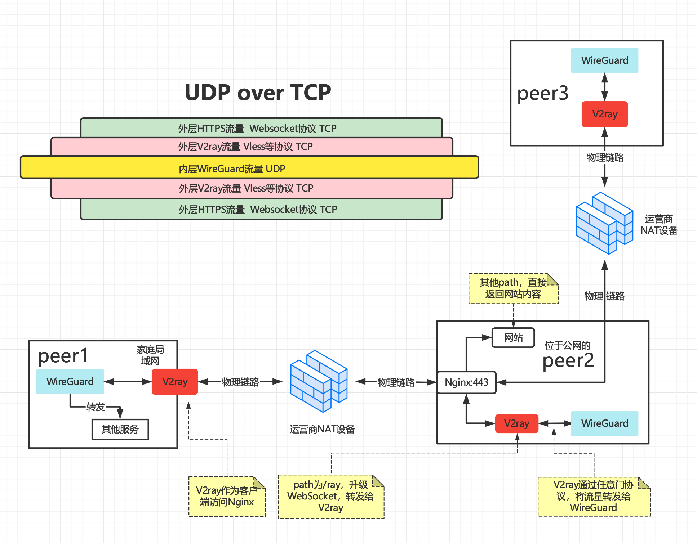
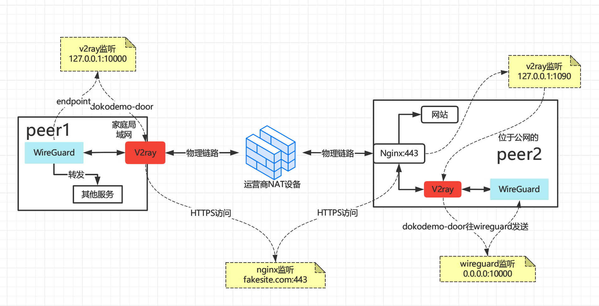
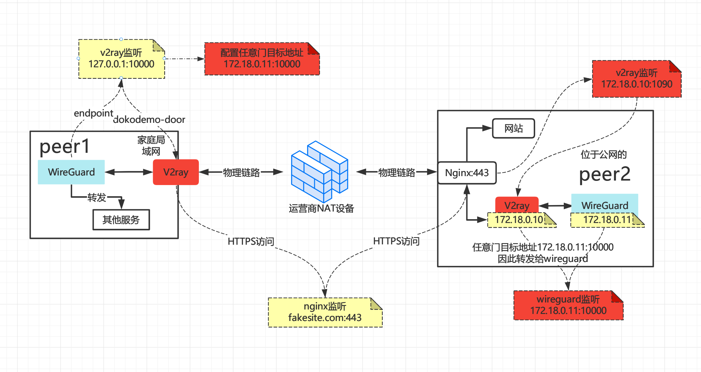

# WireGuard+V2ray打造史上最安全隐匿且高速的内网穿透隧道


首先讲一下需求，其实需求简单无比，**那就是无论身处何时何地，只要有互联网，就可以访问内网资源**，说得具体点，比如出差在外想访问家里NAS存储的文件，通过直接访问NAS的内网IP（比如192.168.2.10）就可以实现访问，就好像自己坐在家里一样

## 时代背景

传统的内网穿透方案只能实现某个端口的穿透，想换个端口又需要重新配置，而在本方案中，整个内网资源都是共享的，只需配置一次即可。缺点是需要一个**大带宽公网服务器**做转发（如果流量使用不大也可使用小带宽公网服务器），不做转发也需要一个公网服务器作为**信令服务器**交换各自IP做NAT打洞操作，但TCP打洞难度太大（需要**三次握手**），一般是UDP打洞，但是UDP又会被**QoS**，而且打洞成功率还需要受NAT类型影响（Full Cone NAT打洞成功率高，且需要NAT两边都是该类型，简而言之该类型NAT会**记住内网主机出去的端口**，如果NAT不记住，则端口全靠猜），所以话题绕回来了，想要稳定还是需要一个大带宽公网服务器做转发。

该方案简单来讲就是**WireGuard over WebSocket over HTTPS** ，也是一种**UDP over TCP**的方案。那为什么这么简单的需求需要这么复杂的实现呢？因为需要大带宽公网服务器做转发，就牵扯出一些列问题，这里简单说一下时代背景：

1. **国内商用带宽贵**：因为国家政策要求民用带宽量大价低，所以运营商普遍用高价商宽补贴家庭带宽。首先，宽带是运营商管的，就是那三家垄断，国内网络基础设施只有三大运营商有资质建设，阿里云、腾讯云、华为云等数据中心都必须要跟运营商买带宽，价格没法谈，偏贵。所以想想为什么百度云要限速了吧，你下载1G的小电影所支持给运营商的带宽费用和百度支付的根本不在一个数量级。其次IP资源受美国控制，国内独立IP价格更贵。而海外的商用带宽却很便宜，因此大带宽公网服务器一般选择海外服务器，既然出国了，那出国流量都会受到婶查的影响。所以这是第二点背景
2. **网X络X婶X茶**：富强、民主、文明、和谐！@#￥#￥%...，这就需要我们满足**隐匿**的需求，隐匿其实是在安全层面之上的，不安全谈何隐匿。
3. **运营商对UDP实施QoS**：因为WireGuard使用的是UDP，作者也说过使用UDP的一大原因是因为TCP over TCP性能太糟糕，所以作者其实也考虑了UDP over TCP的场景，其次运营商为什么要对UDP实施QoS，在之前的文章**《2021-11-21_5分钟了解游戏加速器的原理与搭建》**中有详细阐述，总之就是**控制UDP的成本高的离谱**，那还不如一刀切，直接QoS掉。

所以这么简单的需求需要这么复杂的实现，背景都是一环套一环的。

## 前置条件

为便于理解本方案，请按顺序阅读之前的文章

- **《2021-12-18_被Linux创始人称做艺术品的组网神器——WireGuard》**
- **《2021-12-24_一群匿名者打造的强大基础通信网络构建工具——V2ray》**

## 开局一张图



如上图所示，peer1和peer3为位于NAT后的主机，peer2为位于公网的主机，peer1和peer3部署wireguard和v2ray，peer2部署wireguard、v2ray和一个常规HTTPS网站（使用nginx作为web服务器），整个服务对外只暴露443端口，非常安全。

名词约束：

- peer1中的wireguard称为w1，v2ray称v1，同理w2，w3分别是peer1和peer3中的wireguard，v2，v3分别是peer1和peer3中的v2ray

本方案整体流程为

1. w3将udp数据发送给监听在本地某端口的v3，此处为内网环境
2. v3作为客户端请求nginx，并携带约定好的path，**此处为公网环境，对外看来就是普通HTTPS流量**
3. nginx接收到v3的请求后，发现其携带约定好的path，通过location配置，将该请求升级为Websocket长连接，并且将请求转发给v2。
4. v2接收到请求后发现是v3发送，并且是dokodemo-door任意门协议，于是将流量发送到指定端口，被w2接收

通过上面4步，建立起了peer3到peer2的连接，同理重复上面4步，建立起peer1到peer2的连接，于是组网成功。

所以它是如何满足安全隐匿且高速的需求？

- 安全：安全自不用说，如今互联网上 TLS 已成为主流，是整个互联网的安全基石。
- 隐匿：在安全的基础之上，在HTTPS流量中包含WireGuard流量，流量经过外层HTTPS加密后在经过WireGuard加密，自然是隐匿的
- 高速：理论上UDP是快于TCP的，但是由于QoS的存在，高速从何谈起？但是将UDP封装在TCP中，相较于被QoS的UDP，那自然是高速的。
- 此方案还有一个好处是服务器故障可自动切换，假设另外一台和peer2配置相同，当peer2故障时，在DNS控制台处将域名指向的IP切换到新IP即可实现故障自愈（自愈时间视DNS更新时间而定）

## 环境准备

- peer1位于运营商NAT后
- peer2位于公网环境，有固定公网IP，假设为`3.68.156.128`
- 一个域名，用于peer2上HTTPS网站搭建，假设为`fakesite.com`
- peer3位于运营商NAT后

假设三台主机均为CentOS操作系统


## peer2配置

### HTTPS站点搭建

首先peer2上需要有一个正常访问的HTTPS网站，如果已经有一台服务器并且配置了HTTPS网站，直接使用即可

1. 在域名控制台将域名DNS添加A记录，指向peer2的公网IP
2. 在peer2安装nginx

```shell
yum -y install epel-release
yum -y install nginx
```

3. 配置网站，写入如下配置

```nginx
cat > /etc/nginx/conf.d/fakesite.com.conf<<EOF
server {
    # 和申请的域名一致
    server_name  fakesite.com;
   
    access_log  /etc/nginx/fakesite.com.log  main;

    location / {
        root   /usr/share/nginx/html;
        index  index.html index.htm;
    }
   
    error_page   500 502 503 504  /50x.html;
    location = /50x.html {
        root   /usr/share/nginx/html;
    }

    listen 80;
}
EOF
```

4. 启动`nginx`（输入`nginx`命令即可）并访问，`curl http://fakesite.com`有返回说明成功
5. 配置HTTPS，使用certbot配置HTTPS，配置好之后`curl https://fakesite.com`有返回说明成功

```shell
# 安装certbot
yum -y install epel-release
yum -y install certbot-nginx

# 配置域名HTTPS，根据提示进行即可
certbot --nginx -d fakesite.com -d www.fakesite.com
```

6. 配置v2ray访问path，在HTTPS配置好之后，配置文件会自动加上证书相关配置

```nginx
server {
    # 和申请的域名一致
    server_name  fakesite.com;
   
    access_log  /etc/nginx/fakesite.com.log  main;

    location / {
        root   /usr/share/nginx/html;
        index  index.html index.htm;
    }
   
    error_page   500 502 503 504  /50x.html;
    location = /50x.html {
        root   /usr/share/nginx/html;
    }

    listen 443 ssl; # managed by Certbot
    ssl_certificate /etc/letsencrypt/live/fakesite.com/fullchain.pem;
    ssl_certificate_key /etc/letsencrypt/live/fakesite.com/privkey.pem;
    include /etc/letsencrypt/options-ssl-nginx.conf;
    ssl_dhparam /etc/letsencrypt/ssl-dhparams.pem;

}
```

在此基础之上，需要配置v2ray访问的特定path，该path越复杂越好，此处以`someRandomPathHere`为例，如下所示：

- 配置后端v2ray的path
- 配置后端v2ray的端口
- 配置后端v2ray监听在**127.0.0.1**，因为不提供外部访问，只供nginx访问

```nginx
server {
  ...  
#=====================此处为增加部分（开始）====
    # 这是v1或者v3需要携带的path，越复杂越好，
    location /someRandomPathHere {
        proxy_redirect off;
        # 注意，这是转发给v2ray的
        proxy_pass http://127.0.0.1:1090;
        proxy_http_version 1.1;
        # 升级成websocket协议
        proxy_set_header Upgrade \$http_upgrade;
        proxy_set_header Connection "upgrade";
        proxy_set_header Host \$http_host;
    }
#=====================此处为增加部分（结束）====
   ...
}
```

### 配置v2ray

v2ray配置如下，几点需要注意

- `"listen": "127.0.0.1"`：监听在`127.0.0.1`
- `"port": 1090`：监听在1090端口，和nginx `proxy_pass`配置一致
- `"path": "/someRandomPathHere"`：path和nginx `location`配置一致

```shell
# 生成配置文件
mkdir -p ~/v2ray-wg
cat > ~/v2ray-wg/config.json <<EOF
{
    "log": {
        "loglevel": "debug"
    },
    "dns": {
        "servers": [
            "1.1.1.1",
            "8.8.8.8",
            "8.8.4.4"
        ]
    },
    "inbounds": [
        {
            "listen": "127.0.0.1",
            "port": 1090,
            "protocol": "vless",
            "settings": {
                "clients": [
                    {
                        "id": "c71c5890-56dd-4f32-bb99-3070ec2f20fa"
                    }
                ],
                "decryption": "none"
            },
            "streamSettings": {
                "network": "ws",
                "wsSettings": {
                  "path": "/someRandomPathHere"
                }
            }
        }
    ],
    "outbounds": [
        {
            "protocol": "freedom",
            "settings": {
                "domainStrategy": "UseIP"
            }
        }
    ]
}
EOF


# 启动v2ray
v2ray -c ~/v2ray-wg/config.json

```

启动v2ray之后，访问该path，如果得到一个**Bad Request**说明在nginx对接v2ray成功

```shell
$ curl https://fakesite.com/someRandomPathHere
Bad Request
```

### 配置wireguard

wireguard配置如下，有几点需要注意

- `Address = 5.5.5.1/24`：指peer2的wireguard自用内网IP
- `ListenPort = 10000`：wireguard监听端口，很遗憾目前wireguard只能监听在`0.0.0.0`即所有网络设备接口上，不能监听在`127.0.0.1`上，但是默认情况下即使监听在了eth0上也需要配合iptables开放端口，所以也是安全的
- iptables规则中的eth0网卡根据实际名称修改

```properties
cat > /etc/wireguard/wg.conf<<EOF
[Interface]
Address = 5.5.5.1/24
PostUp   = iptables -I FORWARD -i %i -j ACCEPT
PostUp   = iptables -I FORWARD -o %i -j ACCEPT
PostUp   = iptables -t nat -I POSTROUTING -o eth0 -j MASQUERADE
PostDown = iptables -D FORWARD -i %i -j ACCEPT
PostDown = iptables -D FORWARD -o %i -j ACCEPT
PostDown = iptables -t nat -D POSTROUTING -o eth0 -j MASQUERADE
ListenPort = 10000
PrivateKey = aHWomHYVWebT+lAPyZcofEfdQYXdFOXpVWRKD91OyXA=

# 配置peer1
[Peer]
PublicKey = 451o6In0DqSTyg1GE4WzrK4Z0BLuFXTrjdqjBJ/RLwc=
AllowedIPs = 5.5.5.2/32,192.168.2.0/24


# 配置peer3
[Peer]
PublicKey = QOY2VaTZLtof4rtSrTS42d2Ld8vOc8hJwNcJu9DA8h8=
AllowedIPs = 5.5.5.3/32
EOF
```

启动wireguard

```shell
wg-quick up wg
```

查看wg信息，此时还没有peer连接上来：

```properties
$ wg
interface: wg
  public key: 1yrnzlpVNhpQyyBj0oehVqCaL/06RjK/tcd3icMuZ0Q=
  private key: (hidden)
  listening port: 10000

peer: 451o6In0DqSTyg1GE4WzrK4Z0BLuFXTrjdqjBJ/RLwc=
  allowed ips: 5.5.5.2/32, 192.168.2.0/24

peer: QOY2VaTZLtof4rtSrTS42d2Ld8vOc8hJwNcJu9DA8h8=
  allowed ips: 5.5.5.3/32

```

## peer1配置


### 配置v2ray

peer1上dev2ray配置有以下注意点

- 在入站中配置任意门协议，且远程主机（即peer2）端口为10000，和peer2中的wireguard监听端口一致，这样才会往wireguard发送数据；且协议一定要是udp，因为wireguard只支持udp协议
- `"address": "fakesite.com"`：指向peer2的网站，端口为443

- `security": "tls"`：**需要启用tls**，因为是作为客户端去访问https站点！上面peer2中不需要启用tls是因为流量已经在**nginx处解密**了，到了v2ray就已是明文流量。

```shell
mkdir -p ~/v2ray-wg
# 创建配置文件
cat > ~/v2ray-wg/config.json <<EOF
{
    "log": {
        "loglevel": "debug"
    },
    "inbounds": [
        {  
            //配置任意门协议
            //本地监听127.0.0.1供wireguard连接
            "listen": "127.0.0.1", 
            //本地监听端口
            "port": 10000,
            //任意门协议
            "protocol": "dokodemo-door",
            "settings": {
                //发送远程主机（即peer2）的IP
                "address": "127.0.0.1",
                //发送给远程主机（即peer2）的端口
                "port": 10000,
                //协议一定要是udp，因为wireguard就是udp的
                "network": "udp"
            }
        }
    ],
    "outbounds": [
        {
            "protocol": "vless",
            "settings": {
                "vnext": [
                    {
                        //指向peer2的网站，端口为443
                        "address": "fakesite.com",
                        "port": 443,
                        "users": [
                            {
                                "id": "c71c5890-56dd-4f32-bb99-3070ec2f20fa",
                                "encryption": "none"
                            }
                        ]
                    }
                ]
            },
            "streamSettings": {
                "network": "ws",
                //需要启用tls
                "security": "tls",
                "wsSettings": {
                  "path": "/someRandomPathHere"
                }
            }
        }
    ]
}
EOF

# 启动v2ray
v2ray -c ~/v2ray-wg/config.json
```

### 配置wireguard

peer1上的wireguard配置如下，有几点需要注意

- `Address = 5.5.5.2/24`：指peer1的wireguard自用内网IP
- iptables规则中的eth0网卡根据实际名称修改
- `Endpoint = 127.0.0.1:10000`：配置peer2的连接为`127.0.0.1:10000`，因为此时流量已经被本地的v2ray接管了，发送给peer1 `127.0.0.1:10000`的流量都将从v2ray的任意门协议到达peer2上的`127.0.0.1:10000`，peer2上已经配置了wireguard去接收该流量。
- `AllowedIPs = 5.5.5.0/24`：整个内网流量全部转发给peer2
- `PersistentKeepalive = 15`：每隔15s就给peer2发送心跳包，保持连接（因为NAT下，peer1的公网IP和端口不定时在变化）

```properties
cat > /etc/wireguard/wg.conf<<EOF
[Interface]
Address = 5.5.5.2/24
PostUp   = iptables -I FORWARD -i %i -j ACCEPT
PostUp   = iptables -I FORWARD -o %i -j ACCEPT
PostUp   = iptables -t nat -I POSTROUTING -o eth0 -j MASQUERADE
PostDown = iptables -D FORWARD -i %i -j ACCEPT
PostDown = iptables -D FORWARD -o %i -j ACCEPT
PostDown = iptables -t nat -D POSTROUTING -o eth0 -j MASQUERADE
PrivateKey = oAaT5OjURGvVqs/pbMa2HAsZXpbwNQCEzW0MZBmGJ1Y=

# 配置peer2
[Peer]
PublicKey = 1yrnzlpVNhpQyyBj0oehVqCaL/06RjK/tcd3icMuZ0Q=
AllowedIPs = 5.5.5.0/24
Endpoint = 127.0.0.1:10000
PersistentKeepalive = 15
EOF
```

启动wireguard

```shell
wg-quick up wg
```

### 测试

查看peer1上wg信息，发现已经连上peer2了

```properties
$ wg
interface: wg
  public key: 451o6In0DqSTyg1GE4WzrK4Z0BLuFXTrjdqjBJ/RLwc=
  private key: (hidden)
  listening port: 37301

peer: 1yrnzlpVNhpQyyBj0oehVqCaL/06RjK/tcd3icMuZ0Q=
  endpoint: 127.0.0.1:10000
  allowed ips: 5.5.5.0/24
  latest handshake: 28 seconds ago
  transfer: 92 B received, 212 B sent
  persistent keepalive: every 15 seconds

```

再去peer2上查看wg信息，发现peer1也已经连上了

```properties
$ wg
interface: wg
  public key: 1yrnzlpVNhpQyyBj0oehVqCaL/06RjK/tcd3icMuZ0Q=
  private key: (hidden)
  listening port: 10000

peer: 451o6In0DqSTyg1GE4WzrK4Z0BLuFXTrjdqjBJ/RLwc=
  endpoint: 127.0.0.1:48832
  allowed ips: 5.5.5.2/32, 192.168.2.0/24
  latest handshake: Now
  transfer: 616 B received, 184 B sent

peer: QOY2VaTZLtof4rtSrTS42d2Ld8vOc8hJwNcJu9DA8h8=
  allowed ips: 5.5.5.3/32
```

在peer1上ping peer2的内网IP，发现可以ping通

```shell
$ ping 5.5.5.1
PING 5.5.5.1 (5.5.5.1) 56(84) bytes of data.
64 bytes from 5.5.5.1: icmp_seq=1 ttl=64 time=220 ms
64 bytes from 5.5.5.1: icmp_seq=2 ttl=64 time=71.5 ms
64 bytes from 5.5.5.1: icmp_seq=3 ttl=64 time=70.4 ms
```

## peer3配置

### 配置v2ray

peer3和pee1 v2ray的配置是一模一样的，实际上，除了peer2，也就是位于公网的主机以外，其他peer的v2ray配置都是相同的，目的都是为了给wireguard搭建好底层隧道，暴露`127.0.0.1:10000`给wireguard，此处就不再赘述，配置好后启动即可。

### 配置wireguard

peer3上的wireguard配置如下，有几点需要注意

- `Address = 5.5.5.3/24`：指peer3的wireguard自用内网IP
- 因为peer3在该场景下指客户端，需要访问peer1的内网资源，所以不需要配置iptables转发规则
- `AllowedIPs = 5.5.5.0/24,192.168.2.0/24`：整个内网流量全部转发给peer2，并且包含`192.168.2.0/24`网段，该网段转发给peer2后peer2再转发给peer1，peer1在转发给和peer1同局域网下的主机，不清除可参考之前的文章：**《2021-12-18_被Linux创始人称做艺术品的组网神器——WireGuard》**
- `PersistentKeepalive = 15`：每隔15s就给peer2发送心跳包，保持连接（因为NAT下，peer3的公网IP和端口不定时在变化）

```properties
cat > /etc/wireguard/wg.conf<<EOF
[Interface]
Address = 5.5.5.3/24
PrivateKey = AA7GomiYl60DW5ZAGgn7VlwGWX8/Jw74qiYWPpknGWQ=


[Peer]
PublicKey = 1yrnzlpVNhpQyyBj0oehVqCaL/06RjK/tcd3icMuZ0Q=
AllowedIPs = 5.5.5.0/24,192.168.2.0/24
Endpoint = 127.0.0.1:10000
PersistentKeepalive = 15
EOF
```

启动wireguard

```
wg-quick up wg
```

### 测试

首先在peer2上看peer3是否连接上了，如下所示为连接上的情况

```shell
$ wg
interface: wg
  public key: 1yrnzlpVNhpQyyBj0oehVqCaL/06RjK/tcd3icMuZ0Q=
  private key: (hidden)
  listening port: 10000

peer: 451o6In0DqSTyg1GE4WzrK4Z0BLuFXTrjdqjBJ/RLwc=
  endpoint: 127.0.0.1:59366
  allowed ips: 5.5.5.2/32, 192.168.2.0/24
  latest handshake: 2 seconds ago
  transfer: 4.27 KiB received, 1.61 KiB sent

peer: QOY2VaTZLtof4rtSrTS42d2Ld8vOc8hJwNcJu9DA8h8=
  endpoint: 127.0.0.1:37201
  allowed ips: 5.5.5.3/32
  latest handshake: 18 seconds ago
  transfer: 424 B received, 184 B sent

```

此时在peer3上分别ping peer1（5.5.5.1）和peer2（5.5.5.2），能ping通说明至少wireguard的内网通了，然后在ping需要peer1转发的内网ip，如192.168.2.5，如果能通说明peer1的转发是没问题的

在保险一点可以telnet端口，在主机192.168.2.5上监听一个tcp端口1024

```shell
nc -lvp 1024
```

然后在peer3上telnet，能通说明隧道通讯成功，如下为成功的输出：

```shell
$ telnet 192.168.2.5 1024
Trying 192.168.2.5...
Connected to 192.168.2.5.
Escape character is '^]'.
```

## 端口梳理

整个连接流程一共涉及到4个端口，如下图所示，**其中暴露在公网的只有443端口！**,虽然wireguard也监听在了`0.0.0.0:10000`，但是一般需要设置iptables规则才能暴露在公网，后续也会介绍到，可以将peer2中运行的v2ray和wireguard关进docker里面，隔离网络。

- v2ray任意门监听在本地10000端口供wireguard连接
- v2ray作为客户端访问nginx监听的443端口
- nginx转发给服务端v2ray监听的1090端口
- 服务端v2ray将流量转发给监听在`0.0.0.0:10000`的wireguard




## 结合docker

其中peer2可以将v2ray和wireguard关进docker中，因为peer2纯做流量转发，不需要共享peer2上的内网资源，而peer1和peer3可将v2ray运行在docker中，但是不建议将wireguard运行在docker中，因为docker实际上有一层网络隔离，如果wireguard运行在docker中，只有该容器本身会接入wireguard的内网中，但是宿主机的网络并没不会接入，但实际场景中peer1一般为家庭内网中的一台linux节点（如路由器等）也可以将wireguard运行在docker中。

总之一句话，需要宿主机加入wireguard网络，则在宿主机上运行，如果只是纯粹做流量转发，则可以在docker中运行wireguard。

将wireguard运行在docker中还有一个好处，正是由于docker的网络隔离，所以wireguard监听在0.0.0.0上而不用担心会不小心暴露在公网！

**下面的例是将peer2中的wireguard和v2ray运行在docker中**

### 创建网桥

创建网桥用于自定义容器IP

```shell
# 首先创建一个桥接网络，在自己的桥接网络上才能实现ip自定义
docker network create --subnet=172.18.0.0/16 mynet
```


### 运行v2ray

容器中v2ray的配置只有监听在`"listen": "0.0.0.0"`这个区别，且一定要监听在`0.0.0.0`，监听在`127.0.0.1`只能在容器内部访问，**容器之间无法访问**。

配置v2ray，需要注意

- `"listen": "0.0.0.0"`：docker内部网络是隔离的，需要监听在0.0.0.0

```shell
mkdir -p ~/v2ray-wg
cat > ~/v2ray-wg/config.json <<EOF
{
    "log": {
        "loglevel": "debug"
    },
    "dns": {
        "servers": [
            "1.1.1.1",
            "8.8.8.8",
            "8.8.4.4"
        ]
    },
    "inbounds": [
        {
            //docker内部网络是隔离的，需要监听在0.0.0.0
            "listen": "0.0.0.0",
            "port": 1090,
            "protocol": "vless",
            "settings": {
                "clients": [
                    {
                        "id": "c71c5890-56dd-4f32-bb99-3070ec2f20fa"
                    }
                ],
                "decryption": "none"
            },
            "streamSettings": {
                "network": "ws",
                "wsSettings": {
                  "path": "/someRandomPathHere"
                }
            }
        }
    ],
    "outbounds": [
        {
            "protocol": "freedom",
            "settings": {
                "domainStrategy": "UseIP"
            }
        }
    ]
}
EOF
```

运行v2ray，指定固定为`172.18.0.10`，此处很重要

- 意味着nginx `location`处配置也需要指定该IP

```bash
docker run -d \
--name v2ray-wg \
--network mynet \
--ip 172.18.0.10 \
--restart=always \
-v ~/v2ray-wg/config.json:/etc/v2ray/config.json \
v2fly/v2fly-core

# 如需删除，使用下面命令
# docker stop v2ray-wg && docker rm v2ray-wg
```

查看日志，有类似于`creating stream worker on 0.0.0.0:1090`的输出说明成功。

```shell
$ docker logs -f v2ray-wg

app/dns: DNS: created UDP client initialized for 1.1.1.1:53
2021/12/26 06:03:37 [Info] app/dns: DNS: created UDP client initialized for 8.8.8.8:53
2021/12/26 06:03:37 [Info] app/dns: DNS: created UDP client initialized for 8.8.4.4:53
2021/12/26 06:03:37 [Debug] app/proxyman/inbound: creating stream worker on 0.0.0.0:1090
2021/12/26 06:03:37 [Info] transport/internet/websocket: listening TCP(for WS) on 0.0.0.0:1090
```

nginx处location配置修改，`proxy_pass`需修改为`http://172.18.0.10:1090`

```nginx
server {
  ...  
#=====================此处为增加部分（开始）====
    # 这是v1或者v3需要携带的path，越复杂越好，
    location /someRandomPathHere {
        proxy_redirect off;
        # 注意，这是转发给v2ray的，此处IP需修改为v2ray容器的固定IP
        proxy_pass http://172.18.0.10:1090;
        proxy_http_version 1.1;
        # 升级成websocket协议
        proxy_set_header Upgrade \$http_upgrade;
        proxy_set_header Connection "upgrade";
        proxy_set_header Host \$http_host;
    }
#=====================此处为增加部分（结束）====
   ...
}
```

### 运行wireguard

wireguard配置和docker外一致

```properties
# 创建目录
mkdir -p ~/wg
# 创建配置
cat > ~/wg/wg.conf<<EOF
[Interface]
Address = 5.5.5.1/24
PostUp   = iptables -I FORWARD -i %i -j ACCEPT
PostUp   = iptables -I FORWARD -o %i -j ACCEPT
PostUp   = iptables -t nat -I POSTROUTING -o eth0 -j MASQUERADE
PostDown = iptables -D FORWARD -i %i -j ACCEPT
PostDown = iptables -D FORWARD -o %i -j ACCEPT
PostDown = iptables -t nat -D POSTROUTING -o eth0 -j MASQUERADE
ListenPort = 10000
PrivateKey = aHWomHYVWebT+lAPyZcofEfdQYXdFOXpVWRKD91OyXA=

# 配置peer1
[Peer]
PublicKey = 451o6In0DqSTyg1GE4WzrK4Z0BLuFXTrjdqjBJ/RLwc=
AllowedIPs = 5.5.5.2/32,192.168.2.0/24


# 配置peer3
[Peer]
PublicKey = QOY2VaTZLtof4rtSrTS42d2Ld8vOc8hJwNcJu9DA8h8=
AllowedIPs = 5.5.5.3/32
EOF
```

运行wireguard，指定固定IP为`172.18.0.11`，此处很重要

- 意味着客户端（即peer1或peer3）v2ray的任意门协议远程IP指定该IP

```shell
docker run -d \
--name=wg \
--cap-add=NET_ADMIN \
--cap-add=SYS_MODULE \
-e PUID=1000 \
-e PGID=1000 \
-v ~/wg/wg.conf:/config/wg0.conf \
-v /lib/modules:/lib/modules \
--network mynet --ip 172.18.0.11  \
--sysctl="net.ipv4.conf.all.src_valid_mark=1" \
--restart always \
linuxserver/wireguard

# 如需删除，使用下面命令
# docker stop wg && docker rm wg
```

查看日志输出，如下输出即为成功。

```
$ docker logs -f wg
....
Warning: `/config/wg0.conf' is world accessible
[#] ip link add wg0 type wireguard
[#] wg setconf wg0 /dev/fd/63
[#] ip -4 address add 5.5.5.1/24 dev wg0
[#] ip link set mtu 1420 up dev wg0
[#] ip -4 route add 192.168.2.0/24 dev wg0
[#] iptables -I FORWARD -i wg0 -j ACCEPT
[#] iptables -I FORWARD -o wg0 -j ACCEPT
[#] iptables -t nat -I POSTROUTING -o eth0 -j MASQUERADE
```

### 客户端v2ray任意门协议修改

因为peer2中wireguard固定IP有所变化，所以客户端（peer1或peer3）中v2ray的任意门协议需要的远程主机IP需要与之一致，即需设置为`172.18.0.11`

以peer1中为例

-                `"address": "172.18.0.11"`：发送远程主机（即peer2）的IP，此IP为peer2容器中wireguard的IP

```shell
mkdir -p ~/v2ray-wg
# 创建配置文件
cat > ~/v2ray-wg/config.json <<EOF
{
    "log": {
        "loglevel": "debug"
    },
    "inbounds": [
        {  
            //配置任意门协议
            //本地监听127.0.0.1供wireguard连接
            "listen": "127.0.0.1", 
            //本地监听端口
            "port": 10000,
            //任意门协议
            "protocol": "dokodemo-door",
            "settings": {
                //发送远程主机（即peer2）的IP，此IP为peer2容器中wireguard的IP
                "address": "172.18.0.11",
                //发送给远程主机（即peer2）的端口
                "port": 10000,
                //协议一定要是udp，因为wireguard就是udp的
                "network": "udp"
            }
        }
    ],
    "outbounds": [
        {
            "protocol": "vless",
            "settings": {
                "vnext": [
                    {
                        //指向peer2的网站，端口为443
                        "address": "fakesite.com",
                        "port": 443,
                        "users": [
                            {
                                "id": "c71c5890-56dd-4f32-bb99-3070ec2f20fa",
                                "encryption": "none"
                            }
                        ]
                    }
                ]
            },
            "streamSettings": {
                "network": "ws",
                //需要启用tls
                "security": "tls",
                "wsSettings": {
                  "path": "/someRandomPathHere"
                }
            }
        }
    ]
}
EOF

# 启动v2ray
v2ray -c ~/v2ray-wg/config.json
```

修改后重启v2ray即可。

### 端口和IP梳理

红色部分即为IP指定变化的部分



## 公网暴露服务

聪明的你应该已经想到，既然我们有https伪装站点，且peer2（搭建站点的节点）共享pee1的内网资源，所以可以暴露peer1的内网服务，如搭建在peer1上的网站

如果peer2上的v2ray和wireguard不在docker中，那么没有网络隔离，直接在nginx中配置反向代理即可，如下

- 注意，peer1上的网站最好加上一个**统一的baseurl**用于设置location，否则需要设置很多location规则去匹配peer1上服务。

```nginx
# location规则
location /website-on-peer1-base-url {
   # 反向代理peer1上的web服务，注意，peer1上的网站最好加上一个统一的baseurl用于设置location
   # 否则需要设置很多location规则去匹配peer1上服务
   proxy_pass http://192.168.2.5:8080;
}
```

然后在公网访问https://fakesite.com/website-on-peer1-base-url相当于访问peer1上的http://192.168.2.5:8080/website-on-peer1-base-url

如果peer1上的服务是公开的，还可在nginx处设置基本认证，这样访问的会让输入预先设置的账号和密码

首先生成密码

```shell
# 生成用户为test密码为123456的用户
printf "test:$(openssl passwd -crypt 123456)\n" >>/etc/pwd/htpasswd
```

nginx配置如下

```nginx
# location规则
location /website-on-peer1-base-url {
   # 反向代理peer1上的web服务，注意，peer1上的网站最好加上一个统一的baseurl用于设置location
   # 否则需要设置很多location规则去匹配peer1上服务
   proxy_pass http://192.168.2.5:8080;
   auth_basic "Please enter your username and password";
   auth_basic_user_file   /etc/pwd/htpasswd;
}
```

### wireguard在docker中

如果peer2上的wg在docker中，那么其实存在网络隔离，只有wireguard的容器本身共享peer1的内网，peer2是不共享的，因此需要在wireguard容器内部进行端口转发

1. 进入wireguard容器安装sshd服务（ssh可以进行端口转发）

```shell
# 安装
apt-get update -y
apt-get install ssh -y


# 创建目录，否则可能会报错
mkdir /run/sshd
# 启动
/etc/init.d/ssh  start

# 打开配置文件，允许密码登录，加上PermitRootLogin yes
vim /etc/ssh/sshd_config
# 重启
/etc/init.d/ssh  restart

# 设置ssh登录密码
passwd
```

2. 进行端口转发（注意一定是`0.0.0.0:8080`，`0.0.0.0`表示会监听在所有网络接口上，因为后续nginx会使用到wireguard的容器IP）

```shell
# 端口转发，将192.168.2.5:8080端口转发到0.0.0.0:8080
# 即往wireguard容器上8080端口发送的数据都往192.168.2.5:8080发送
ssh -fN -L 0.0.0.0:8080:192.168.2.5:8080 root@127.0.0.1


# 可配合telnet  curl 等命令验证
telnet 127.0.0.1 8080
```

3. nginx处配置（**注意172.18.0.11为wireguard容器的IP**）

```nginx
# location规则
location /website-on-peer1-base-url {
   # 反向代理peer1上的web服务，注意，peer1上的网站最好加上一个统一的baseurl用于设置location
   # 否则需要设置很多location规则去匹配peer1上服务
   # 注意172.18.0.11为wireguard容器的IP
   proxy_pass http://172.18.0.11:8080;
}
```


## 注意事项

- 文中v2ray配置中的UUID记得更改，请勿照抄
- 文中v2ray配置中的Path记得更改，请勿照抄
- 文中wireguard公钥私钥记得更改，请勿照抄

如果上面列出的都照抄，那么攻击者只需要知道你的网站域名，就可以访问你的内网资源，精心搭建的HTTPS隧道安全性不攻自破，切记切记。

- 服务器域名切换故障自愈

peer2可配置多个相同节点，当其中一个故障后，在DNS控制台切换到其他节点，但此时需要注意有一个域名请求死循环，这种情况发生在peer3在wireguard中配置了DNS服务器的情况下，如下

```properties
[Interface]
Address = 5.5.5.3/24
PrivateKey = AA7GomiYl60DW5ZAGgn7VlwGWX8/Jw74qiYWPpknGWQ=
# 配置了内网DNS服务器
DNS = 192.168.2.1
...
```

当peer2故障域名切换到另一台相同节点后，v2ray会去请求域名指向的新IP，此时会将域名请求发送给`192.168.2.1`，很明显此时`192.168.2.1`是不通的，因为v2ray连上并且wireguard工作正常后此内网ip才通，所以请求直接超时，解决办法有两种

- 暂时屏蔽掉wireguard的DNS配置，让DNS请求走本来的通道，当和peer2连接上之后再放开该配置
- 每次v2ray启动后主动去请求一下，迫使v2ray先请求域名，然后在启动wireguard

# 参考

- https://hub.docker.com/r/v2fly/v2fly-core
- https://hub.docker.com/r/linuxserver/wireguard

