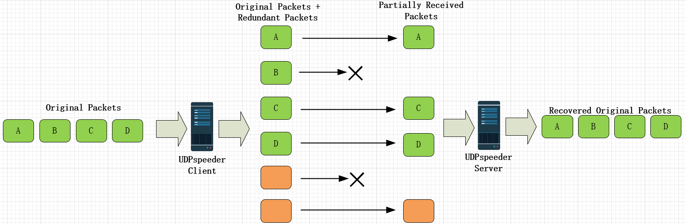
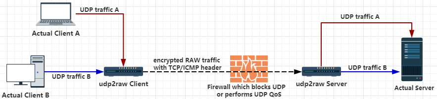

# 2022-01-01_各类双边网络加速软件效果测试

双边加速即在服务端和客户端都需要进行安装，对数据包进行处理，区别于单边加速，如BBR，BBR通过算法改善服务端发包行为，只需在服务端安装，而不用在客户端安装。

通过网络搜索，目前比较流行的双边加速软件大概有如下

- kcptun：https://github.com/xtaci/kcptun
- UDPSpeeder：https://github.com/wangyu-/UDPspeeder
- udp2raw：https://github.com/wangyu-/udp2raw

## kcptun

原理如下图，加速两边通过TCP连接，广域网之间使用KCP协议


### kcp

> #### KCP - A Fast and Reliable ARQ Protocol

**简单理解KCP是在UDP的基础之上加上拥塞控制和超时重传，模拟TCP的行为，在公网上，本质上还是UDP，KCP是在用户态实现拥塞控制和超时重传，而TCP是在内核TCP协议栈中实现的**

KCP是一个快速可靠协议，能以比 TCP 浪费 10%-20% 的带宽的代价，换取平均延迟降低 30%-40%，且最大延迟降低三倍的传输效果。纯算法实现，并不负责底层协议（如UDP）的收发，需要使用者自己定义下层数据包的发送方式，以 callback的方式提供给 KCP。 连时钟都需要外部传递进来，内部不会有任何一次系统调用。

TCP是为流量设计的（每秒内可以传输多少KB的数据），讲究的是充分利用带宽。而 KCP是为流速设计的（单个数据包从一端发送到一端需要多少时间），以10%-20%带宽浪费的代价换取了比 TCP快30%-40%的传输速度。TCP信道是一条流速很慢，但每秒流量很大的大运河，而KCP是水流湍急的小激流。

近年来，网络游戏和各类社交网络都在成几何倍数的增长，不管网络游戏还是各类互动社交网络，交互性和复杂度都在迅速提高，都需要在极短的时间内将数据同时投递给大量用户，因此传输技术自然变为未来制约发展的一个重要因素，而开源界里各种著名的传输协议，如 raknet/enet 之类，一发布都是整套协议栈一起发布，这种形式是不利于多样化的，我的项目只能选择用或者不用你，很难选择 “部分用你”，然而你一套协议栈设计的再好，是非常难以满足不同角度的各种需求的。

因此 KCP 的方式是把协议栈 “拆开”，让大家可以根据项目需求进行灵活的调整和组装，你可以下面加一层 reed solomon 的纠删码做 FEC，上面加一层类 RC4/Salsa20 做流加密，握手处再设计一套非对称密钥交换，底层 UDP 传输层再做一套动态路由系统，同时探测多条路径，选最好路径进行传输。这些不同的 “协议单元” 可以像搭建积木一般根据需要自由组合，保证 “简单性” 和 “可拆分性”，这样才能灵活适配多变的业务需求，哪个模块不好，换了就是。

未来传输方面的解决方案必然是根据使用场景深度定制的，因此给大家一个可以自由组合的 “协议单元” ，方便大家集成在自己的协议栈中。

如果网络永远不卡，那 KCP/TCP 表现类似，但是网络本身就是不可靠的，丢包和抖动无法避免（否则还要各种可靠协议干嘛）。在内网这种几乎理想的环境里直接比较，大家都差不多，但是放到公网上，放到3G/4G网络情况下，或者使用内网丢包模拟，差距就很明显了。公网在高峰期有平均接近10%的丢包，wifi/3g/4g下更糟糕，这些都会让传输变卡。

总的来说, KCP 采用了与 TCP 几乎相同的架构, 在用户态实现了确认、ARQ、流量控制与拥塞控制机制, 但 KCP 一定程度上破坏了公平性, TCP 设计的初衷之一便是在全局角度达到公平, 因此会有慢开始、丢包退让等机制(RFC 5681), 而 KCP 在多处修改了相应的策略, 当网络环境不佳时, KCP 将比 TCP 拥有更好的性能, TCP 经过了这么多年的发展, 本身已经是一个足够完善的协议, 对于拥塞控制也做了大量的工作, 所做的一切就是为了能让全局的平均性能达到最好, 对于 KCP 的争议也有很多, 单一维度无法直接评判 KCP 协议本身, 但可以确定的是当大量客户端都开始采用 KCP 时, 那 KCP 也就失去它的优势了

## UDPSpeeder

> A Tunnel which Improves your Network Quality on a High-latency Lossy Link by using Forward Error Correction, possible for All Traffics(TCP/UDP/ICMP)

工作模式如下图


主要原理是通过冗余数据来对抗网络的丢包，发送冗余数据的方式支持FEC(Forward Error Correction)和多倍发包，其中FEC算法是Reed-Solomon。



简单理解就是通过发送冗余数据包对抗丢包

## udp2raw

> A Tunnel which Turns UDP Traffic into Encrypted UDP/FakeTCP/ICMP Traffic by using Raw Socket,helps you Bypass UDP FireWalls(or Unstable UDP Environment)

工作模式



简单理解就是通过rawSocket模拟TCP的包头和行为迷惑NAT设备

## 测试环境

### 环境准备

三台主机，主机A为被测主机

- 主机A--洛杉矶（数据中心带宽接入，带宽100Mbps）

- 主机B--中国（家庭带宽接入，带宽100Mbps）

- 主机C--洛杉矶（数据中心带宽接入，带宽50Mbps ）

假设A主机公网IP为44.55.66.77

测试内容为

- 时延测试（ping）

---

- 下载速度测试（wget）

准备100M和500M的文件，启HTTP Server

```shell
dd if=/dev/zero bs=100M count=1 > ~/100M
dd if=/dev/zero bs=500M count=1 > ~/500M

cd ~ && python -m SimpleHTTPServer 8388
```

下载测试命令，注意写入到`/dev/null`避免受本地磁盘写入速度影响

```shell
wget -O /dev/null http://127.0.0.1:8388/100M

wget -O /dev/null http://127.0.0.1:8388/500M
```

- kcptun、UDPspeeder、udp2raw安装，进入对应github页面，下载二进制可执行文件到`/usr/bin/`即可

### 裸机测试

首先不安装任何加速，进行时延测试

- B到A：丢包率9%，平均时延201ms

```shell
300 packets transmitted, 271 received, 9% packet loss, time 299310ms
rtt min/avg/max/mdev = 174.219/201.209/293.486/36.907 ms
```

- C到A：丢包率0%，平均时延0.79

```shell
300 packets transmitted, 300 received, 0% packet loss, time 306006ms
rtt min/avg/max/mdev = 0.437/0.793/14.616/1.108 ms
```

---

下载速度测试

- B到A：受丢包和延迟影响，缓慢增长，大概10s到达峰值

```shell
100%[=====================>] 104,857,600 5.42MB/s   in 17s
2022-01-01 21:43:24 (6.01 MB/s) - ‘/dev/null’ saved [104857600/104857600]


100%[=====================>] 524,288,000 9.53MB/s   in 62s
2022-01-01 21:44:49 (8.12 MB/s) - ‘/dev/null’ saved [524288000/524288000]

```

- C到A：无丢包和延迟，速度能立即到达峰值，峰值速度相对的较低，因为C的带宽只有50Mbps

```shell
100%[=======================>] 104,857,600 5.68MB/s   in 18s

2022-01-01 21:46:24 (5.68 MB/s) - ‘/dev/null’ saved [104857600/104857600]


100%[=======================>] 524,288,000 5.68MB/s   in 88s

2022-01-01 21:48:43 (5.68 MB/s) - ‘/dev/null’ saved [524288000/524288000]

```

### kcptun

使用默认参数

```shell
# server端
kcptun_server -t "127.0.0.1:8388" -l ":5201"

# client端
kcptun_client -r "44.55.66.77:5201" -l "127.0.0.1:8388"
```

由于是TCP隧道，无法接入Wireguard，无法测试延迟，只能测试下载速度

下载速度测试

- B到A：立即到达峰值，峰值速度有所增加

```shell
立即到达峰值，峰值速度有所增加，增加了2MB/s+
100%[======================>] 104,857,600 6.05MB/s   in 12s

2022-01-01 21:54:16 (8.32 MB/s) - ‘/dev/null’ saved [104857600/104857600]


立即到达峰值，峰值速度有所增加，增加不大
100%[======================>] 524,288,000 5.60MB/s   in 59s

2022-01-01 21:56:00 (8.41 MB/s) - ‘/dev/null’ saved [524288000/524288000]

```

- C到A：立即到达峰值，**速度爆炸**，突破了C的带宽限制，**看样子使用kcptun确实速度有提升**

```shell
立即到达峰值，速度爆炸，突破了C的带宽限制
100%[======================>] 104,857,600 47.5MB/s   in 2.1s

2022-01-01 21:57:08 (47.5 MB/s) - ‘/dev/null’ saved [104857600/104857600]


立即到达峰值，速度爆炸，突破了C的带宽限制
100%[=======================>] 524,288,000 49.6MB/s   in 10s

2022-01-01 21:58:01 (47.8 MB/s) - ‘/dev/null’ saved [524288000/524288000]
```

### kcptun+udp2raw

```shell
# udp2raw server端
udp2raw -s -l0.0.0.0:5201  -r127.0.0.1:8888   -k "passwd" --raw-mode faketcp   --cipher-mode xor  -a  --fix-gro

# udp2raw client端
udp2raw -c -l127.0.0.1:3333  -r44.55.66.77:5201 -k "passwd" --raw-mode faketcp   --cipher-mode xor  -a --fix-gro

# kcptun server端
kcptun_server -t "127.0.0.1:8388" -l "127.0.0.1:8888" 

# kcptun client端
kcptun_client -r "127.0.0.1:3333" -l "127.0.0.1:8388" 
```

下载速度测试

- B到A：立即到达峰值，峰值速度变化不大

```shell
100%[=========================>] 104,857,600 9.45MB/s   in 11s

2022-01-01 22:05:24 (9.42 MB/s) - ‘/dev/null’ saved [104857600/104857600]


100%[==========================>] 524,288,000 9.37MB/s   in 65s

2022-01-01 22:09:14 (7.71 MB/s) - ‘/dev/null’ saved [524288000/524288000]

```

- C到A：立即到达峰值，峰值速度下降约一半

```shell

100%[=======================================>] 104,857,600 23.5MB/s   in 4.3s

2022-01-01 22:10:05 (23.3 MB/s) - ‘/dev/null’ saved [104857600/104857600]


100%[=======================================>] 524,288,000 26.2MB/s   in 18s

2022-01-01 22:10:37 (27.1 MB/s) - ‘/dev/null’ saved [524288000/524288000]

```

结论：如无明显QoS，可直接使用kcptun，如QoS速度下降甚至端口，可在外套一层udp2raw

### UDPspeeder

```shell
# 在server端运行
speederv2 -s -l0.0.0.0:5201 -r127.0.0.1:8388  -f20:10 -k "passwd" --mode 0

# 在client端运行
speederv2 -c -l127.0.0.1:8388 -r44.55.66.77:5201 -f20:10 -k "passwd" --mode 0
```

由于UDPspeeder监听的是UDP端口，无法直接使用HTTP，因此引入Wireguard，配置如下

```properties
# 服务端
[Interface]
Address = 5.5.5.1/24
ListenPort = 8388
PrivateKey = aHWomHYVWebT+lAPyZcofEfdQYXdFOXpVWRKD91OyXA=

[Peer]
PublicKey = 451o6In0DqSTyg1GE4WzrK4Z0BLuFXTrjdqjBJ/RLwc=
AllowedIPs = 5.5.5.2/32

# 客户端
[Interface]
Address = 5.5.5.2/24
PrivateKey = oAaT5OjURGvVqs/pbMa2HAsZXpbwNQCEzW0MZBmGJ1Y=

[Peer]
PublicKey = 1yrnzlpVNhpQyyBj0oehVqCaL/06RjK/tcd3icMuZ0Q=
AllowedIPs = 5.5.5.1/32
Endpoint = 127.0.0.1:8388
PersistentKeepalive = 15
```


首先进行时延测试

- B到A：丢包率10%，丢包率有所增加

```shell
300 packets transmitted, 268 received, 10% packet loss, time 299307ms
rtt min/avg/max/mdev = 195.482/239.424/319.491/49.255 ms
```

- C到A：本身不丢包，测试无意义

---

下载速度测试

- B到A：速度缓慢增加，20:10似乎发包率不够，速度波动很大

```shell
100%[===========================>] 104,857,600 8.89MB/s   in 12s

2022-01-01 22:21:26 (8.03 MB/s) - ‘/dev/null’ saved [104857600/104857600]

# 速度波动很大，测试几次才测试完
100%[===========================>] 524,288,000 6.31MB/s   in 1m 42s
2022-01-01 22:29:08 (4.92 MB/s) - ‘/dev/null’ saved [524288000/524288000]
```

- C到A：速度下降严重

```shell
100%[=============================>] 104,857,600 2.80MB/s   in 30s
2022-01-01 22:30:43 (3.32 MB/s) - ‘/dev/null’ saved [104857600/104857600]


100%[==============================>] 524,288,000 3.43MB/s   in 2m 32s
2022-01-01 22:33:50 (3.29 MB/s) - ‘/dev/null’ saved [524288000/524288000]
```

结论：不知道是配置参数不对还是因为引入了Wireguard，总体速度达不到kcptun，甚至达不到裸机测试

### UDPspeeder+udp2raw

```shell
# 在server端运行
udp2raw -s -l0.0.0.0:5201  -r127.0.0.1:8888   -k "passwd" --raw-mode faketcp   --cipher-mode xor  -a  --fix-gro

# 在client端运行
udp2raw -c -l127.0.0.1:3333  -r44.55.66.77:5201 -k "passwd" --raw-mode faketcp   --cipher-mode xor  -a --fix-gro


# 在server端运行
speederv2 -s -l0.0.0.0:5201 -r127.0.0.1:8388  -f20:10 -k "passwd" --mode 0

# 在client端运行
speederv2 -c -l127.0.0.1:8388 -r44.55.66.77:5201 -f20:10 -k "passwd" --mode 0
```

由于UDPspeeder监听的是UDP端口，无法直接使用HTTP，因此引入Wireguard，配置如下

```shell
# 服务端
[Interface]
Address = 5.5.5.1/24
ListenPort = 8388
PrivateKey = aHWomHYVWebT+lAPyZcofEfdQYXdFOXpVWRKD91OyXA=

[Peer]
PublicKey = 451o6In0DqSTyg1GE4WzrK4Z0BLuFXTrjdqjBJ/RLwc=
AllowedIPs = 5.5.5.2/32

# 客户端
[Interface]
Address = 5.5.5.2/24
PrivateKey = oAaT5OjURGvVqs/pbMa2HAsZXpbwNQCEzW0MZBmGJ1Y=

[Peer]
PublicKey = 1yrnzlpVNhpQyyBj0oehVqCaL/06RjK/tcd3icMuZ0Q=
AllowedIPs = 5.5.5.1/32
Endpoint = 127.0.0.1:8388
PersistentKeepalive = 15
```

首先进行时延测试

- B到A：同样300个包，丢包率0%，确实有所提升，不清楚是QoS影响还是网络本身波动

```shell
300 packets transmitted, 300 received, 0% packet loss, time 299403ms
rtt min/avg/max/mdev = 200.413/202.806/222.987/2.978 ms
```

- C到A：本身不丢包，测试无意义

---

下载速度测试

- B到A：速度缓慢增加，20:10似乎发包率不够，速度波动很大，达不到裸机

```shell
100%[===============================>] 104,857,600 6.70MB/s   in 16s
2022-01-01 22:51:54 (6.28 MB/s) - ‘/dev/null’ saved [104857600/104857600]


100%[===============================>] 524,288,000 6.08MB/s   in 73s
2022-01-01 22:53:34 (6.81 MB/s) - ‘/dev/null’ saved [524288000/524288000]
```

## 测试结果

- 时延与丢包：`UDPspeeder+udp2raw`组合对丢包有改善，不知是否QoS影响，需自测

| 方向  | 裸机       | UDPspeeder | UDPspeeder+udp2raw |
| ----- | ---------- | ---------- | ------------------ |
| B > A | 9%  201ms  | 10%  239ms | 0%  202ms          |
| C > A | 0%  0.79ms | 无         | 无                 |

- 下载速度
  - 套上kcptun速度确实有提升
  - UDPspeeder反而会使速度下降
  - kcptun+udp2raw速度下降
  - UDPspeeder+udp2raw速度下降

| 方向  | 裸机     | kcptun   | kcptun+udp2raw | UDPspeeder | UDPspeeder+udp2raw |
| ----- | -------- | -------- | -------------- | ---------- | ------------------ |
| B > A | 8.12MB/s | 8.41MB/s | 7.71MB/s       | 4.92MB/s   | 6.81MB/s           |
| C > A | 5.68MB/s | 47.8MB/s | 27.1MB/s       | 3.29MB/s   | 无                 |

建议：如无明显QoS，可直接使用kcptun，如QoS速度下降甚至端口，可在外套一层udp2raw

因网络环境复杂，且各种加速工具参数配置组合较多，稍有不慎则会对速度影响大，故**以上建议和结论仅供参考**

# 参考

- https://github.com/xtaci/kcptun
- https://github.com/skywind3000/kcp
- https://github.com/wangyu-/UDPspeeder
- https://github.com/wangyu-/udp2raw
