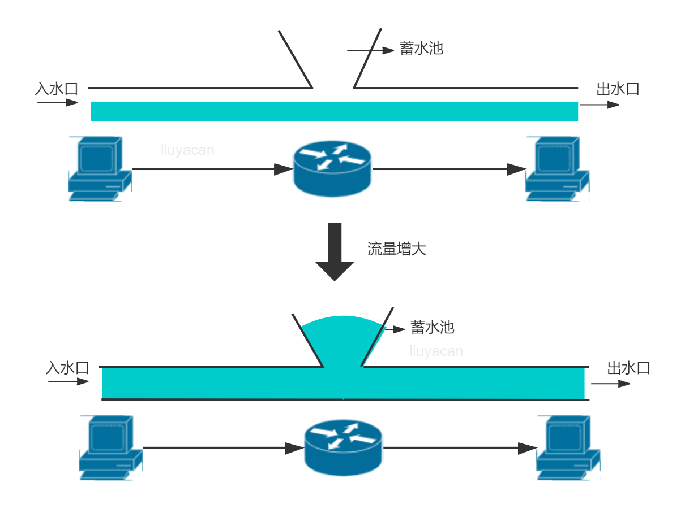

# 2022-01-02_谷歌出品TCP网络拥塞算法BBR效果测试


BBR (Bottleneck Bandwidth and Round-trip propagation time)是 Google 在 2016 年发布的一套拥塞控制算法。它尤其适合在存在一定丢包率的弱网环境下使用，在这类环境下，BBR 的性能远超 CUBIC 等传统的拥塞控制算法。

以下是 Google 公开的的一些资料

- [paper](https://netdevconf.info/1.2/papers/bbr-netdev-1.2.new.new.pdf)

- [video](https://www.youtube.com/watch?v=hIl_zXzU3DA)

- [slides](https://netdevconf.info/1.2/slides/oct5/04_Making_Linux_TCP_Fast_netdev_1.2_final.pdf)

- [github](https://github.com/google/bbr)

## 网络拥塞与控制

网络中的数通设备(交换机路由器)在入方向通常都会有缓存入报文的队列，其目的是为了应付短时间内涌入的大量报文。但如果入方向的报文持续超负荷，缓存队列也一定会被填满，此后的报文就只能被无情丢弃，之后发送端便能感知到报文丢了。



可以把网络链路想象为一根水管，路径上的数通设备会自带一个蓄水池，一般不会使用。而当水流变大时，蓄水池开始蓄水，如果超过蓄水极限，则水流会溢出(报文丢包)。

当发送端**感知到丢包**时，传统的 TCP 拥塞控制算法会减小发送端的拥塞窗口 Cwnd，**限制报文的发送**。这类拥塞控制算法也被称为基于丢包(Loss-based)的拥塞控制算法。

这显然不是最好的时机! 因为使用缓存队列并不能提升整个链路的带宽，反而还会增大报文的 RTT (每个报文的排队时间变长了)。缓存队列只是应急区域，平时是不应该被使用的。

## BBR 的设计思路

**控制时机提前，不再等到丢包时再进行暴力限制，而是控制稳定的发包速度，尽量榨干带宽，却又不让报文在中间设备的缓存队列上累积。**

为了得到稳定的发包速度，BBR 使用 TCP Pacing 进行发包控制，因此 BBR 的实现也需要底层支持 TCP Pacing; 为了榨干带宽，BBR 会周期性地去探测是否链路条件变好了，如果是，则加大发送速率; 为了不让报文在中间设备的缓存队列上累积，BBR 会周期性地探测链路的最小 RTT，并使用该最小 RTT 计算发包速率。

## 测试结果

思路：使用环回网卡进行测试，环回网卡只经过本机内核TCP协议栈，不经过其他设备，去除掉其他设备的影响，配合TC命令模拟丢包，观察下载文件的速度作为测试结果，并且读写都去除掉本地磁盘的速度限制，直接走内存，下表为测试结果（以下载500M文件为例）：

| 丢包率 | 无BBR    | 无BBR下载耗时 | 有BBR    | 有BBR下载耗时 |
| ------ | -------- | ------------- | -------- | ------------- |
| 不丢包 | 1.64GB/s | 0.3s          | 1.66GB/s | 0.3s          |
| 1%     | 418MB/s  | 1.2s          | 680MB/s  | 0.7s          |
| 10%    | 4.13MB/s | 77s           | 20.6MB/s | 24s           |

可以看到

- 在不丢包的时候有无BBR速度基本一致
- 丢包率`1%`的时候，有BBR速度略快，有BBR时速度波动较大，最高能达到1G/s，也有地域400MB/s的时候，表中取值为多次测试后稳定下来的值
- 丢包10%的时候，无BBR速度较慢，有BBR速度是无BBR速度的4.98倍，可见在丢包率很高的时候BBR效果很明显！

结论：建议开启BBR

## 测试步骤

### 环境准备

1. 以HTTP下载文件为例，首先准备一个500M的文件，注意是往`/dev/shm`中写文件，往该目录中写文件等于往内存中写，**避免下载时本地磁盘性能瓶颈**

```shell
$ dd if=/dev/zero bs=500M count=1 > /dev/shm/500M 

1+0 records in
1+0 records out
# 写入速度高达1.6GB/s
524288000 bytes (524 MB) copied, 0.337093 s, 1.6 GB/s
```

2. 准备HTTP服务，默认监听在8000端口

```shell
cd /dev/shm/ && python -m SimpleHTTPServer 
```

3. 下载测试命令，下载时往`/dev/null`中写入，这样在读和写都能避免本地磁盘的干扰

> `/dev/null`类似一个黑洞，写入任何东西都会返回成功，但是实际写入数据随即被丢弃。`/dev/null`的IO只是软件层面的，实际没有存储的IO动作。但是既然是软件层面的，就会有userspace到kernel的system call，会耗费相当多的CPU和内存。因为传入`/dev/null`的数据几乎是在其被从软件传出的同时被丢弃的，所以传输的速度基本没有延迟，CPU占用率基本会迅速被占满。

```shell
wget -O /dev/null http://127.0.0.1:8000/500M
```


### 无BBR

#### 不丢包

```shell
wget -O /dev/null http://127.0.0.1:8000/500M

100%[===============>] 524,288,000 1.64GB/s   in 0.3s

2022-01-02 02:29:39 (1.64 GB/s) - ‘/dev/null’ saved [524288000/524288000]
```

#### 丢包1%

使用tc命令模拟丢包1%

> Linux操作系统中的流量控制器TC（Traffic Control）用于Linux内核的流量控制，主要是通过在输出端口处建立一个队列来实现流量控制。

```shell
# 使用tc命令模拟丢包1%
tc qdisc add dev lo root netem loss 1%
```

- 取消模拟丢包（测试完成后取消）

```
tc qdisc del dev lo root
```

- 测试结果

```shell
wget -O /dev/null http://127.0.0.1:8000/500M


100%[===============>] 524,288,000  418MB/s   in 1.2s

2022-01-02 02:30:48 (418 MB/s) - ‘/dev/null’ saved [524288000/524288000]
```

#### 丢包10%

```shell
tc qdisc add dev lo root netem loss 10%

wget -O /dev/null http://127.0.0.1:8000/500M

100%[===============>] 524,288,000 4.13MB/s   in 77s

2022-01-02 02:32:43 (6.45 MB/s) - ‘/dev/null’ saved [524288000/524288000]
```


### 有BBR

#### 下载安装

下载安装可使用秋水大佬一键脚本，期间需要重启

```shell
wget --no-check-certificate https://github.com/teddysun/across/raw/master/bbr.sh && chmod +x bbr.sh && ./bbr.sh
```

- 检测是否启动

```shell
lsmod | grep bbr
# 有如下输出说明启动
tcp_bbr                20480  7
```

#### 不丢包

```shell
wget -O /dev/null http://127.0.0.1:8000/500M

100%[===============>] 524,288,000 1.66GB/s   in 0.3s

2022-01-02 02:36:18 (1.66 GB/s) - ‘/dev/null’ saved [524288000/524288000]
```


#### 丢包1%

```shell


tc qdisc add dev lo root netem loss 1%

wget -O /dev/null http://127.0.0.1:8000/500M

100%[===============>] 524,288,000  680MB/s   in 0.7s

2022-01-02 02:37:44 (680 MB/s) - ‘/dev/null’ saved [524288000/524288000]
```


#### 丢包10%

```shell
tc qdisc add dev lo root netem loss 10%

wget -O /dev/null http://127.0.0.1:8000/500M

100%[===============>] 524,288,000 28.6MB/s   in 24s

2022-01-02 02:39:36 (20.6 MB/s) - ‘/dev/null’ saved [524288000/524288000]
```


# 参考

- https://switch-router.gitee.io/blog/bbr1/