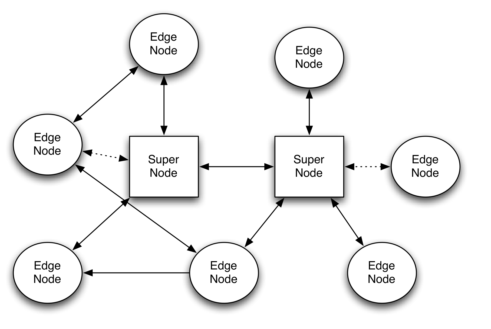
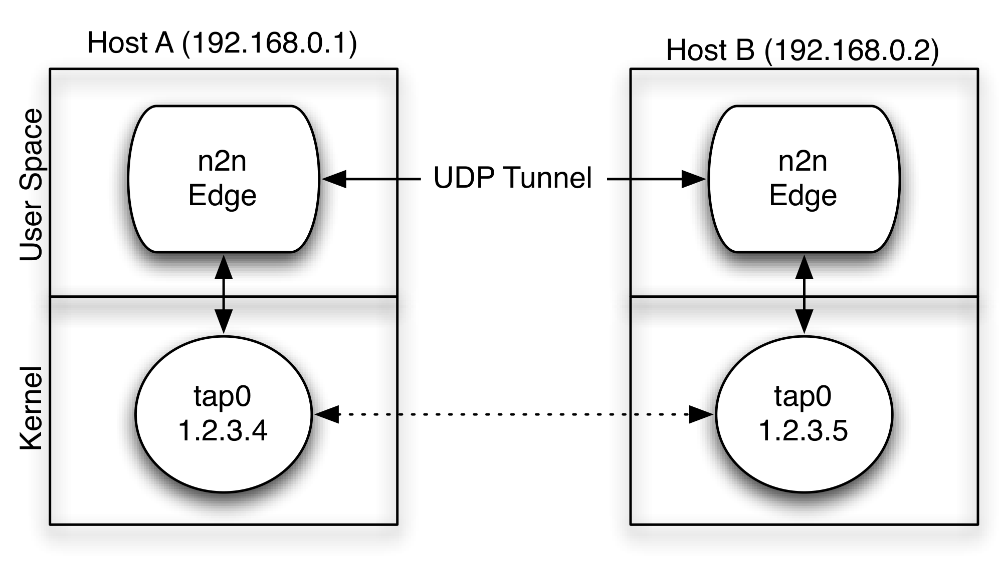
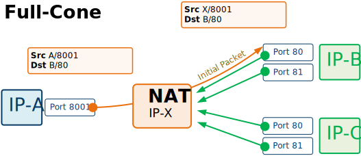
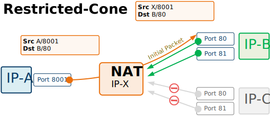
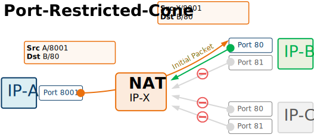
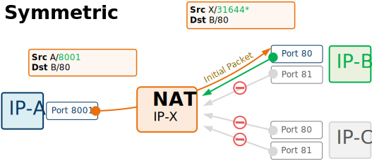
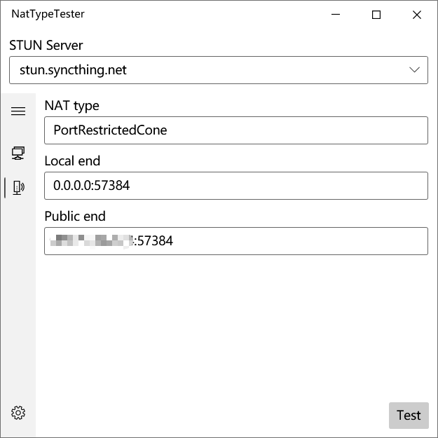

# 2022-01-03_基于P2P的VPN工具n2n——实现二层网络互通


## 基于P2P的VPN

所谓P2P VPN，就是在整个VPN网络中，所有的服务器之间的流量转发，不再需要经过中心服务器，而是直接实现点到点连接。只需在连接中心节点一次后，剩下的流量交换都在节点服务器中完成。

在传统的VPN中，有且只能有一台VPN服务器，所有的客户端都会连接到单点服务器上，并且所有的流量都必须通过单点服务器进行转发；负担过重不说，往往因为中心节点的崩溃导致局域网的分崩离析。

而在P2P VPN中，网络采用和BitTorrent网络（BT下载网络）类似的架构：部署几台信息服务器（Tracker服务器），剩下的客户端作为边缘节点加入网络中即可。只需要通过信息服务器获取各台服务器的信息，即可直接转发数据包到达目标服务器。流量交换的工作将不由中心服务器完成，而是各个边缘节点之间完成。

## n2n

N2N 是一个P2P的开源VPN项目，具有内网穿透成功率高，去中心化，流量加密，使用简单的特点，它工作在第二层，这意味着用户可以获得本地IP可见性（例如，属于同一个n2n网络的两台PC可以相互ping通），并且无论他们当前属于哪个网络，都可以使用相同的网络IP地址访问。

n2n的主要设计功能是：

- n2n是基于P2P协议的加密二层专用网络。
- 使用开放协议和用户定义的加密密钥在边缘节点上执行加密，无需像Skype或Hamachi那样将其委托给公司来控制安全性。
- 每个n2n用户可以同时属于多个网络（又称为**社区**）。
- 能够以反向流量方向（即从外到内）穿越NAT和防火墙，从而即使在专用网络上运行也可以访问n2n个节点。
- n2n网络并非自成一体：可以在n2n和非n2n网络之间路由流量。

一些资料

- 官网：https://www.ntop.org/products/n2n/
- paper：https://luca.ntop.org/n2n.pdf
- github：https://github.com/ntop/n2n

## 两个概念

- **边缘节点（edge node）**：安装在用户PC上的应用程序，允许构建n2n网络。实际上，每个边缘节点创建tun/tap网卡设备，然后该tun/tap网卡设备是n2n网络的入口点。它是我们的边缘节点程序。它相当于网络中的客户端，加入到网络后，即可在中心信息节点的指引下进行信息交换。
- **超级节点（super node）**：它由边缘节点在启动时使用，或用于到达对称防火墙后面的节点。对于那些无法直接通信的节点，此应用程序基本上是目录寄存器和分组路由器；它是我们的中心信息节点程序，它起到了类似BT/PT中Tracker服务器的作用，完成对边缘节点信息的交换，并为无法暴露端口在公网的服务器提供流量转发能力。

在一个P2P VPN的网络中，我们只需要少数几个（1~2个）Supernode即可。Edge可以无限添加。

下图为n2n架构图，每个边缘节点在启动的时候会传入一个或多个超级节点作为参数，并向第一个超级节点发送自己的IP，网络名（社区名）等信息，每隔一段时间边缘节点都会向超级节点发送心跳包更新此信息，如果第一个超级节点不可用，边缘节点会向第二个超级节点注册自己。

在通信过程中，如果边缘节点和超级节点协商后发现能够通过P2P的方式连接，则发起P2P连接，流量不经过超级节点，这样能够降低通信的延时，也能够减轻超级节点的带宽压力，否则经过超级节点中转，速度取决边缘节点和超级节点的带宽最低值。




下图为节点之间的通信， 边缘节点由6字节的MAC地址和16字节的网络名（社区名）作为唯一标识。 边缘节点使用TAP[17]设备作为虚拟以太网设备，它是在操作系统内核层面实现的。 在TAP设备中，以太网驱动程序是在用户空间应用程序中实现的。 N2N提供了这样一个驱动程序实现，它将加密的以太网帧封装在UDP数据包中。

## P2P内网穿透

NAT类型有如下四种

### Full-Cone：锥形NAT

锥形NAT， 当发出一个外部请求时， NAT网关会打开一个端口创建一个公网映射，然后会将传入这个端口的数据全部转发给内部主机。Full Cone NAT是**最宽松**的NAT类型，一旦映射建立，那么只要到公网的映射端口发送数据就可以直接到达后端服务。

如下图所示

- 主机A在NAT设备上开了一个口子（俗称洞）和主机B通信
- 主机B的其他端口可以利用该洞和主机A通信
- 主机C可以利用该洞和主机A通信




### Restricted-Cone：限制锥形NAT

IP受限的锥形NAT， 当发出一个外部请求时，NAT网关会打开一个端口创建一个公网映射， 同时记录外部的主机IP，然后会将已经有记录IP地址并且从这个地址传来的数据转发给内部主机，其他数据会被丢弃。Address Restricted Cone NAT只限制IP不限制端口。

如下图所示

- 主机A在NAT设备上开了一个口子（俗称洞）和主机B通信
- 主机B的其他端口可以利用该洞和主机A通信
- 主机C可以利用该洞**不能**和主机A通信，因为对于NAT设备来讲，主机C的IP地址变化了

想一想，此时NAT设备是要去拆包判断IP地址的，并不仅仅是纯粹转发了




### Port-Restricted-Cone：端口限制型NAT

端口和IP受限的锥形NAT，同时记录外部主机的IP和端口， 然后校验传入端口的数据报文，必须地址和端口和记录的一致才会转发到对应的内部主机，否则会丢弃。Port Restricted Cone NAT**同时校验和限制IP和端口**。

- 主机A在NAT设备上开了一个口子（俗称洞）和主机B通信
- 主机B的其他端口**不能**利用该洞和主机A通信
- 主机C可以利用该洞**不能**和主机A通信

此时NAT设备需要**拆包**判断IP和端口




### Symmetric：对称NAT

每一个来自相同内部IP与端口，到一个特定目的地地址和端口的请求，都映射到一个**随机**的外部IP地址和端口。同一内部IP与端口发到不同的目的地和端口的信息包，都使用不同的映射。只有曾经收到过内部主机数据包的外部主机，才能够把数据包发回。它是**最严格**的NAT类型

- 主机A在NAT设备上开了一个口子（俗称洞）和主机B通信
- 主机B的其他端口**不能**利用该洞和主机A通信
- 主机C可以利用该洞**不能**和主机A通信



乍一看，这行为和Port-Restricted-Cone难道不是一样的？确实大致逻辑是相似的，但是也有区别，网上查询了很多文章都没说明白他们的区别，最终在这里找到了

- https://blog.csdn.net/t46414704152abc/article/details/101064715

> **A symmetric NAT applies restrictions exactly the same way as a port [restricted cone NAT](https://blog.csdn.net/t46414704152abc/article/details/101059665) but handles the NAT translation differently.** All types of NAT discussed so far don’t change the source port when NATing connections. For example when a client accesses the Internet using IP 192.168.0.1 and source port 56723 NAT changes the source IP to say 56.35.67.35 but keeps the port number the same; this is known as **port preservation**. A symmetric NAT NATs ports to new randomly generated ones. This even applies to connections from the same client to different destinations.

- https://doc-kurento.readthedocs.io/en/stable/knowledge/nat.html#symmetric-nat

> This type of NAT behaves in the same way of a Port-Restricted Cone NAT, with an important difference: for each outbound transmission to a different remote transport address (i.e. to a different remote host), the NAT assigns a **new random source port** on the external side. This means that two consecutive transmissions from the same local port to two different remote hosts will have two different external source ports, even if the internal source transport address is the same for both of them.

简而言之，最重要的区别如下

- **映射端口随机化**：和锥形NAT相比，对称型NAT不仅改变了源IP，还**随机**分配了一个端口，而锥形NAT是不会改变端口的，上面四个图结合起来看就能发现这一点；**即使相同的源IP和源端口访问了另外一个外部主机，对称型NAT也会新开一个端口作为映射，而锥形NAT不会有这个行为，它还会利用之前的端口，这也是他被称之为锥形的原因**，相当于，对称性是将源IP、源端口；映射IP、映射端口；目标IP、目标端口这六个信息绑定在一起了。

4种NAT总共有3+2+1+4=10类型（去掉重复的），除了(**对称型--对称型**)和(**对称型,端口限制锥型**)以外都可以通过STUN协议进行穿透。

- 对于锥形NAT来说，supernode节点像是个中介，介绍edge互相认识后，之间的交互直接就是edge与edge的交互了。这也是N2N 最优势与其他中心化方案的地方。流量直连。避免中间转发的开销。
- 对于对称NAT来说， supernode就是个邮局，所有到达对端的数据报文都要由supernode中转。所以两端交互不但会产生额外的消耗，还会受限于supernode节点的带宽。

### 检测NAT类型

参考项目：https://github.com/HMBSbige/NatTypeTester

需要安装.NET6.X，如下为检测结果，可以看到是端口限制型NAT




## 实战

### 安装

参考gitlab进行编译安装

- https://github.com/ntop/n2n

#### Linux

以CentOS为例

```shell
# 安装编译工具
yum install -y automake autoconf libtool
yum install -y gcc g++ cmake make libssl-dev

# 克隆代码
git clone https://github.com/ntop/n2n.git
cd n2n


# 编译安装
./autogen.sh
./configure
make

# optionally install
make install
```

#### MacOS

macos如果是macbook m1芯片稍微费点劲，因为需要安装内核态的Tun设备，参考：https://github.com/ntop/n2n/issues/867

- 首先安装Tunnelblick 3.8.7beta02（不一定是这个版本，其他版本运行，只有要**安装tun和tap系统扩展**选项即可）：https://tunnelblick.net/downloads.html
- 安装完成后屏幕上方有一个图标，右键该图标，找到工具集 >> **安装tun和tap系统扩展**，但此时安装是无效的，因为m1有系统策略
- 关闭macbook m1，一直按住开机键进入恢复模式，找到**安全策略**，修改为第二项，大意是允许安装其他系统扩展之类，总之，降低安全性的哪个选项，只勾选第一项即可，第二项为允许升级之类。
- 重启macbook后，再次进行 **安装tun和tap系统扩展**，即可

上面做完以后再用常规的Linux编译安装即可，可能会用到homebrew，自行百度，注意make install的时候拷贝man手册可能会失败，但此时二进制文件已经拷贝到相关目录，不影响使用。

### 环境准备

以下为测试环境

- 主机A：NAT后的主机，NAT类型为Port-Restricted-Cone，作为边缘节点
- 主机B：公网主机，作为超级节点，假设公网IP为44.55.66.77
- 主机C：公网主机，作为边缘节点
- 主机D：NAT后主机，NAT类型未知，作为边缘节点

### 启动

- 主机B

```shell
# -f 指定前台运行
# -p 指定端口（UDP和TCP都有监听）
# -t 指定管理端口（监听在127.0.0.1）
# -vvv 输出详细日志
supernode -f -p 10000 -t 10001 -vvv
```

- 主机A

```shell
# -c 指定网络名，随意起名，多个边缘节点相同则属同一网络
# -k 设定密码。随意
# -a 指定内网IP
# -f 指定前台运行
# -l 指定超级节点IP和端口
# -vvv打印详细日志
edge -c nw -k pass -a 192.168.100.1 -f -l 44.55.66.77:10000 -vvv
```

- 主机C

```shell
edge -c nw -k pass -a 192.168.100.2 -f -l 44.55.66.77:10000 -vvv
```

- 主机D

```shell
edge -c nw -k pass -a 192.168.100.3 -f -l 44.55.66.77:10000 -vvv
```

有如下显示说明边缘节点启动成功

```
[OK] edge <<< ================ >>> supernode
```

### 测试

经过多次测试发现一下情况可以P2P

- A > C , C > A
- D > C , C > D

以下情况测试多次仍然不能实现P2P，猜测收到D主机NAT类型的影响，有条件的同学可以多找几台主机测试

- A > D , D > A

#### 判断中转还是P2P

- 中转：ping节点，比如A > D，同时查看超级节点的日志，如果日志疯狂刷并且类似如下输出说明在中转

```properties
processing incoming UDP packet [len: 152][sender: 223.104.9.130:35440]
[sn_utils.c:1871] RX PACKET (unicast) 86:89:CB:5F:BA:75 -> 12:89:F8:C8:FA:48 local
[sn_utils.c:569] sent 160 bytes to [119.4.130.244:41163]
```

- P2P：ping节点，比如A > C，同时查看超级节点和边缘节点的日志，如果超级节点没有疯狂刷日志并且发送方边缘节点有如下日志，说明是P2P

```properties
# 198.16.112.182为C的公网IP
found peer's socket 7A:D3:32:96:90:65 [198.16.112.182:41645]
```

也可以在边缘节点Ctrl + C停止掉n2n，会有统计信息，会详细展示通过P2P发送的有多少数据包

```
**********************************
Packet stats:
       TX P2P: 6 pkts
       RX P2P: 4 pkts
       TX Supernode: 3 pkts (3 broadcast)
       RX Supernode: 3 pkts (2 broadcast)
**********************************
```

之前看到有人通过三角理论判断是否是直连，简单而言就是三角形中任意两边之和大于第三边，把ping的延迟毫秒数作为三角形边长，如果任意两个边缘节点的ping值小于这两个边缘节点和超级节点的ping值之和那么就是直连，否则是转发，这个说法有一定道理，但是不准确，能看日志是最准确的，不能看日志的情况也不妨试一试？

## 新思路：通过隧道？

n2n在公网走的是UDP流量，众所周知UDP在公网容易QoS甚至断流，至于QoS的条件那就是玄学了，那么可以在n2n的外层套隧道吗？答案是可以的，比如udp2raw等，**套隧道之后n2n就失去p2p的特性了**，因为**隧道实际上隐藏了边缘节点的真实IP**，超级节点收到的边缘节点IP都是`127.0.0.1`，来自环回节点的流量，所以无论如何都要通过超级节点作为转发！

# 参考

- https://www.ntop.org/products/n2n/
- https://www.networkacademy.io/ccie-enterprise/sdwan/tlocs-and-nat
- https://www.networkacademy.io/ccie-enterprise/sdwan/tlocs-and-nat
- https://doc-kurento.readthedocs.io/en/stable/knowledge/nat.html#symmetric-nat
- https://blog.csdn.net/t46414704152abc/article/details/101064715


