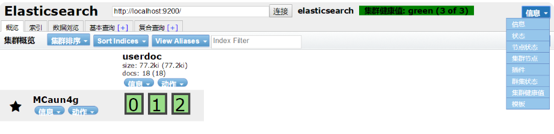
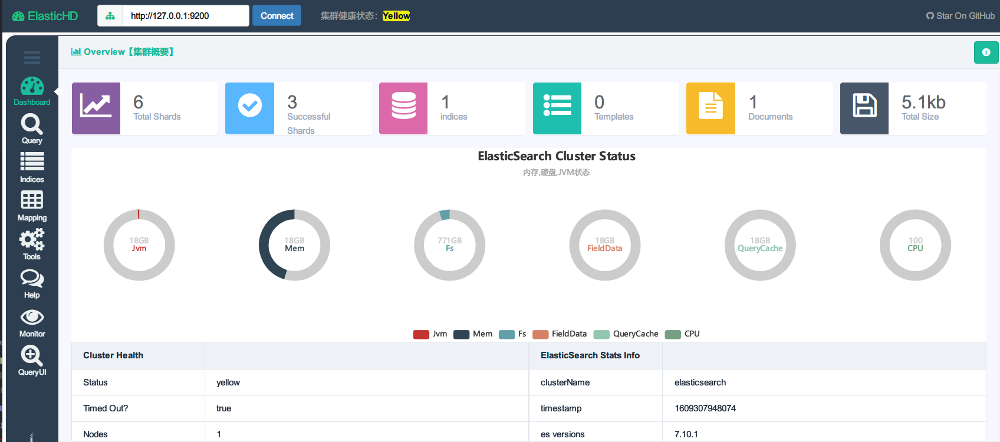
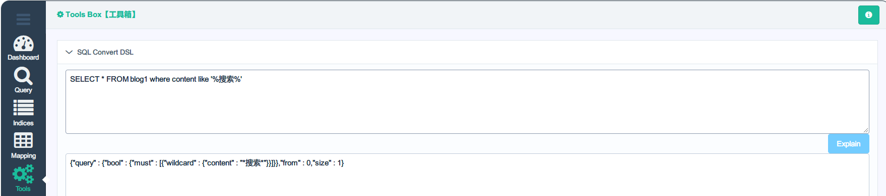
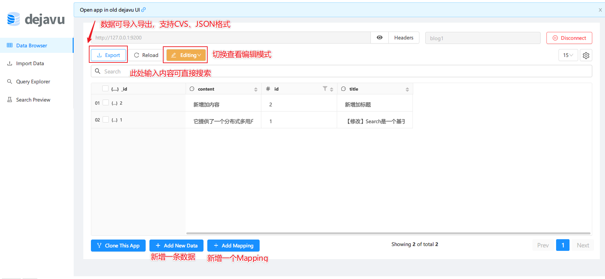
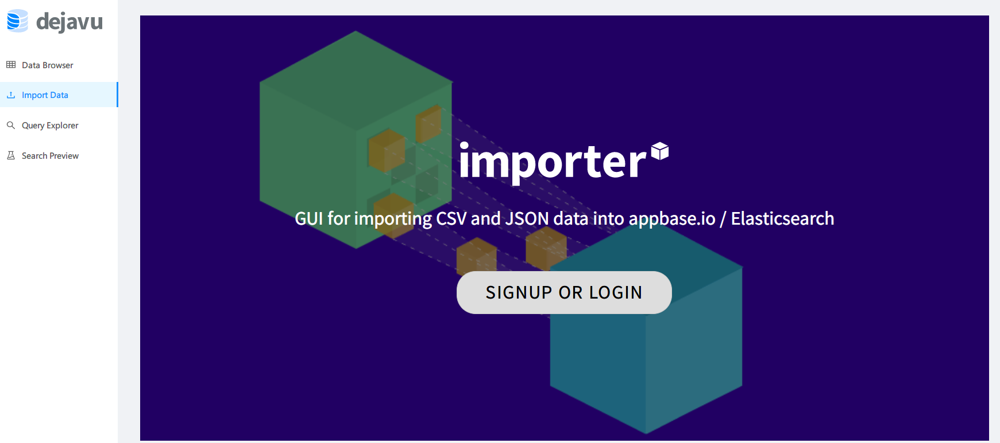
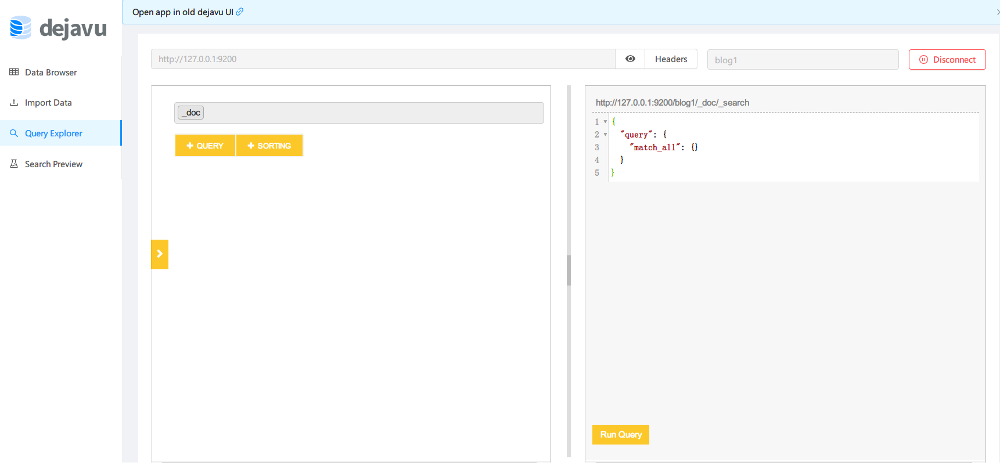
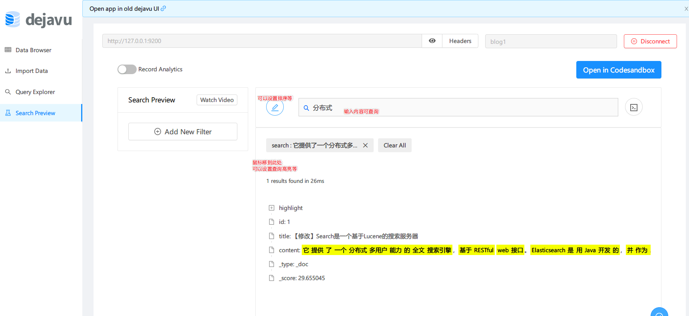

# 5分钟搭建好ElasticSearch开发环境
基于ElasticSearch 7

## ElasticSearch简介
Elaticsearch，简称为es， es是一个开源的高扩展的分布式全文检索引擎，它可以近乎实时的存储、检索数据；本身扩展性很好，可以扩展到上百台服务器，处理PB级别的数据。es也使用Java开发并使用Lucene作为其核心来实现所有索引和搜索的功能，但是它的目的是通过简单的RESTful API来隐藏Lucene的复杂性，从而让全文搜索变得简单。
### 官网
https://www.elastic.co/cn/elasticsearch/

### 使用案列
- 2013年初，GitHub抛弃了Solr，采取ElasticSearch 来做PB级的搜索。 “GitHub使用ElasticSearch搜索20TB的数据，包括13亿文件和1300亿行代码”
- 维基百科：启动以elasticsearch为基础的核心搜索架构
- SoundCloud：“SoundCloud使用ElasticSearch为1.8亿用户提供即时而精准的音乐搜索服务”
- 百度：百度目前广泛使用ElasticSearch作为文本数据分析，采集百度所有服务器上的各类指标数据及用户自定义数据，通过对各种数据进行多维分析展示，辅助定位分析实例异常或业务层面异常。目前覆盖百度内部20多个业务线（包括casio、云分析、网盟、预测、文库、直达号、钱包、风控等），单集群最大100台机器，200个ES节点，每天导入30TB+数据
- 新浪使用ES 分析处理32亿条实时日志
- 阿里使用ES 构建挖财自己的日志采集和分析体系
### 原理
ElasticSearch的底层是Lucene，参考[2020-12-20_5分钟了解搜索引擎Lucene的原理.md](../博客文章/blogs/2020-12-20_5分钟了解搜索引擎Lucene的原理.md)

### 和数据库对比

```
Relational DB -> Databases -> Tables -> Rows -> Columns
Elasticsearch -> Indices   -> Types  -> Documents -> Fields
```


## 安装JDK
注意ElasticSearch最低要求JDK1.8，Oracle下载JDK太麻烦，下载个JDK还让登录，这里推荐个镜像站，各种版本都有：[嗖嗖下载java jdk镜像](http://java.sousou88.com/spec/oraclejdk.html)
  JDK装好后第一件事情是设置环境变量，环境变量的作用是让你在任何目录下都可以调用Java命令：[参考](https://jingyan.baidu.com/article/75ab0bcb91c6ead6874db279.html)

  1. 打开环境变量设置窗口：右键此电脑 > 属性 > 高级系统设置 > 环境变量 > 关注点在于下面的**系统变量**
  2. 新建JAVA_HOME：变量名为`JAVA_HOME`，变量值为你的JDK安装目录，类似于：`C:\Program Files\Java\jdk1.8.0_31`
  3. 找到系统变量里面的Path，点击编辑，新增两条：`%JAVA_HOME%\bin`，`%JAVA_HOME%\jre\bin`
  4. 新建CLASSPATH：变量名为`CLASSPATH`，变量值为：`.;%JAVA_HOME%\lib;%JAVA_HOME%\lib\tools.jar`，注意最前面的一个点表示当前目录，不要遗漏
  5. 验证：WIN+R打开CMD窗口，输入`java`、`java -version`、`javac`均有回显说明环境变量设置成功！

注意一定要设置环境变量，否则ES启动不了！


## 安装ElasticSearch

1. 去官网下载：https://www.elastic.co/cn/downloads/elasticsearch
2. 解压到你喜欢地方，**注意安装文件夹最好不要带有空格，否则后面的IK分词器可能启动不成功**
3. 双击`bin/elasticsearch.bat`
4. 打开浏览器访问`http://localhost:9200/`，如果能访问则安装成功

**设置允许跨域**（一些可视化界面需要）
编辑`conf/elasticsearch.yml`，这是一个空配置文件，里面全是注释，在文件最后增加如下内容

```
http.cors.enabled: true
http.cors.allow-origin: "*"
```


安装IK分词器（中文分词）
1. 下载：https://github.com/medcl/elasticsearch-analysis-ik/releases
2. 解压到`plugins/elasticsearch-analysis-ik-7.10.1`文件夹

IK提供了两个分词算法`ik_smart`和`ik_max_word`，其中`ik_smart`为最少切分`ik_max_word`为最细粒度划分，测试IK安装是否成功
```
GET http://127.0.0.1:9200/_analyze

{
  "analyzer": "ik_smart",
  "text": "我是程序员"
}

```

### 添加测试数据
2020-12-30所使用的版本为`elasticsearch-7.10.1-windows-x86_64`

#### 创建索引
用postman或者任何你喜欢的工具，创建索引的同时设置了mapping、分片数量和复制数量，分片和复制默认数量分别是5和1
```
PUT http://127.0.0.1:9200/blog1

{
    "settings":{
        "number_of_shards":3,
        "number_of_replicas":1
    },
    "mappings": {
        "properties": {
            "id": {
                "type": "long"
            },
            "title": {
                "type": "text",
                "analyzer":"ik_smart"
            },
            "content": {
                "type": "text",
                "analyzer":"ik_smart"
            }
        }
    }
}
```

### 创建文档
```
POST http://127.0.0.1:9200/blog1/_doc/1

{
	"id":1,
	"title":"ElasticSearch是一个基于Lucene的搜索服务器",
	"content":"它提供了一个分布式多用户能力的全文搜索引擎，基于RESTful web接口。Elasticsearch是用Java开发的，并作为Apache许可条款下的开放源码发布，是当前流行的企业级搜索引擎。设计用于云计算中，能够达到实时搜索，稳定，可靠，快速，安装使用方便。"
}
```

### 查询文档
简单查询一下，看看是否创建成功
```
GET http://127.0.0.1:9200/blog1/_doc/1

{
    "_index": "blog1",
    "_type": "_doc",
    "_id": "1",
    "_version": 3,
    "_seq_no": 2,
    "_primary_term": 1,
    "found": true,
    "_source": {
        "id": 1,
        "title": "[xxxxx]ElasticSearch是一个基于Lucene的搜索服务器",
        "content": "它提供了一个分布式多用户能力的全文搜索引擎，基于RESTful web接口。Elasticsearch是用Java开发的，并作为Apache许可条款下的开放源码发布，是当前流行的企业级搜索引擎。设计用于云计算中，能够达到实时搜索，稳定，可靠，快速，安装使用方便。"
    }
}

```

根据query_string查询
```
POST http://127.0.0.1:9200/blog1/_doc/_search
{
    "query": {
        "query_string": {
            "default_field": "title",
            "query": "钢索"
        }
    }
}
```


## 安装可视化界面
ES可视化界面有如下几种
- elasticsearch-head
- ElasticHD
- Dejavu

下面一个一个看

### elasticsearch-head
需要nodejs环境，上古界面，功能单一，不推荐



### ElasticHD
项目地址：https://github.com/360EntSecGroup-Skylar/ElasticHD

特点
- 二进制单文件，安装方便
- 界面炫酷
- SQL转ES查询小工具挺实用
- 目前(2020-12-30)监控还在完善 

安装步骤
其实就是一个单二进制文件
1. 下载压缩包并解压：https://github.com/360EntSecGroup-Skylar/ElasticHD/releases/
2. 启动：`./ElasticHD.exe -p 127.0.0.1:9800`
3. 访问`http://127.0.0.1:9800/`

- Dashboard看着还挺舒服



- 查询界面


- 索引


- SQL转ES查询小工具还挺实用



### Dejavu
项目地址：https://github.com/appbaseio/dejavu/

特点：
- 安装方式多样，支持docker、Chrome扩展、甚至在线体验
- 界面更加现代化
- 有编辑模式，直接能修改内容
- 数据可以导入导出，支持CVS、JSON格式

在线体验地址：https://dejavu.appbase.io，在顶部填入主机`http://127.0.0.1:9200`和上面创建的索引`blog1`点击右边Connect即可连接

- 数据浏览区，界面非常直观



- 数据导入，由于要登陆，没有过多尝试，感兴趣的伙伴可以尝试下



- 通用查询窗口



- 查询预览区




- Dejavu的作者还对目前存在的UI进行了比较

| Features           | dejavu                                                       | [ES-head](https://github.com/mobz/elasticsearch-head)        | [ES-kopf](https://github.com/lmenezes/elasticsearch-kopf)    | [ES-browser](https://github.com/OlegKunitsyn/elasticsearch-browser) | [Kibana](https://github.com/elastic/kibana)                  |
| ------------------ | ------------------------------------------------------------ | ------------------------------------------------------------ | ------------------------------------------------------------ | ------------------------------------------------------------ | ------------------------------------------------------------ |
| Installation       | Chrome extension, Docker image, Hosted app                   | Elasticsearch plugin, static page                            | Elasticsearch plugin, static page                            | Elasticsearch plugin (doesn't work with 2.0+)                | Elasticsearch plugin                                         |
| Modern UI          | React 16.6.                                                  | jQuery 1.6.1, slightly stodgy                                | Angular 1.x                                                  | ExtJs, a bit stodgy                                          | Node.JS, Hapi, Jade                                          |
| Browser features   | [CRUD](https://en.wikipedia.org/wiki/Create,_read,_update_and_delete), data filters | Read data, full-text search                                  | ❌                                                            | Data view for a single type                                  | Read view, visualizations, charting                          |
| Data import/export | ✔️ JSON, CSV                                                  | ❌                                                            | ❌                                                            | ❌                                                            | Only export, no CSV                                          |
| Search preview     | Visually build and test search UI                            | ❌                                                            | ❌                                                            | ❌                                                            | ❌                                                            |
| License            | [MIT](https://github.com/appbaseio/dejavu/blob/dev/LICENSE.md) | [Apache 2.0](https://github.com/mobz/elasticsearch-head/blob/master/LICENCE) | [MIT](https://github.com/lmenezes/elasticsearch-kopf/blob/master/LICENSE) | [Apache 2.0](https://github.com/OlegKunitsyn/elasticsearch-browser/blob/master/LICENSE) | [Apache 2.0](https://github.com/elastic/kibana/blob/master/LICENSE.txt) |


# 参考

- https://www.codesheep.cn/2018/10/30/es-visualization/

