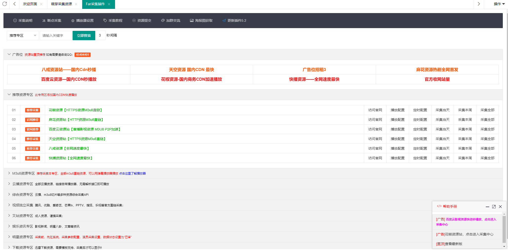
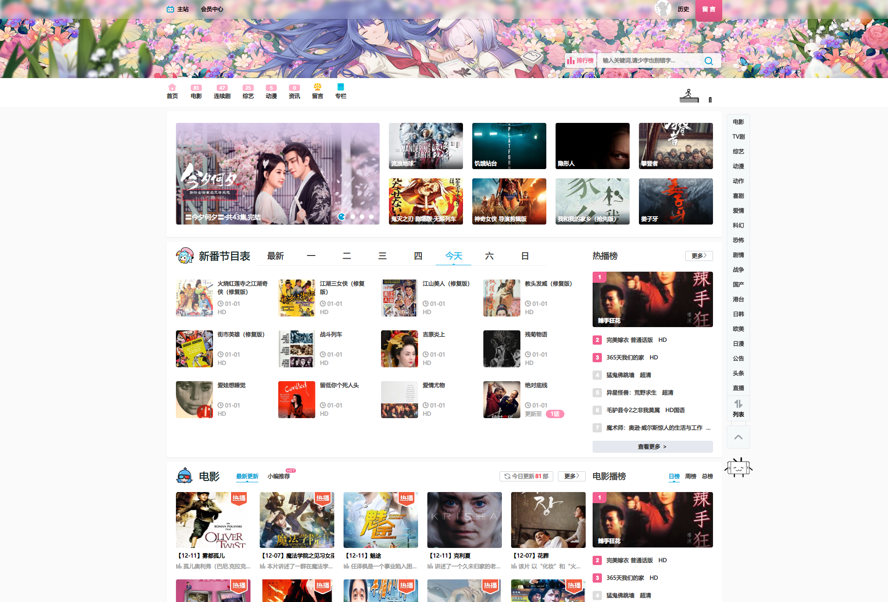

# 介绍

苹果CMS是一套基于PHP的内容管理系统，强大灵活！可以打造影视站、资讯站、漫画站、课程站等，在如今版权意识越来越受到重视，所以本教程强烈建议不要用于商业用途，同时附带一份免责声明

**免责声明**：本教程的所有内容均在网络搜集，仅用于个人学习、研究或欣赏以及其他非商业性或非盈利性用途，否则随之而来的风险与本教程无关。

# 源码下载

这些地方可以找到源码
- https://github.com/magicblack/maccms10
- 官网：http://www.maccms.cn/

# 环境配置
因为苹果cms是基于php的，需要webserver配合php运行，此处采用nginx和php-fpm安装（基于docker容器的）

## 定义参数
```
# 定义苹果cms安装路径
path=/app/maccms
# 源码路径
maccms10=https://blog.moyu123.xyz/usr/uploads/2020/01/2028001228.zip
# 后台登录路径，建议改复杂点
macadmin=admin
# mysql密码，建议改复杂点
mysqlpwd=123456
```

## 配置nginx容器
基于[官方nginx容器](https://hub.docker.com/_/nginx)
```
docker run -d --restart=always --name nginx -p 80:80 -v /etc/localtime:/etc/localtime -v $path:$path nginx:alpine
```
此时访问http://ip:port看能不能访问
## 创建php-fpm容器
此镜像已包含大部分扩展，苹果CMS需要的扩展都有
```
docker run -d --restart=always --name php-fpm-73 -v /etc/localtime:/etc/localtime -v $path:$path kimoqi/php-fpm-all-ext:7.3
```
## 查看php-fpm容器内网ip
```
phpfpmip=`docker inspect -f '{{range .NetworkSettings.Networks}}{{.IPAddress}}{{end}}'  php-fpm-73`
echo $phpfpmip
```
## 创建mysql容器
基于[mysql 5.6官方镜像](https://hub.docker.com/_/mysql)，注意版本选择，mysql版本太新苹果CMS可能会连不上
```
docker run -d --name mysql --restart=always -v /etc/localtime:/etc/localtime  -p 3000:3306 -e MYSQL_ROOT_PASSWORD=$mysqlpwd mysql:5.7
```
## 查看mysql内网ip
```
mysqlip=`docker inspect -f '{{range .NetworkSettings.Networks}}{{.IPAddress}}{{end}}'  mysql`
echo $mysqlip
```
## 准备源码
```
# 下载
curl -o $path/maccms10.zip --create-dirs  $maccms10 
# 解压
unzip -d $path $path/maccms10.zip
# 赋权限
chmod -R 777 $path/*
# 修改后台登录路径
mv $path/admin.php $path/$macadmin.php 
```
## 创建nginx配置文件
```nginx
cat > $(pwd)/maccms.conf <<EOF
server {
    listen       80;
    # server_name  localhost;
    
    # 播放器
    location ~* static/player* {
        root $path;
    }
    
    # 静态资源
    location ~* \.(gif|jpg|jpeg|png|css|js|ico|eot|otf|ttf|woff|svg|swf)$ {
        root $path;
    }
    
    # 苹果CMS伪静态规则，参考https://www.vc99.cn/jishu/48.html
    location / {                                                           
        if (!-e \$request_filename) {                                       
                rewrite ^/index.php(.*)\$ /index.php?s=\$1 last;
                rewrite ^/api.php(.*)\$ /api.php?s=\$1 last;
                rewrite ^/$macadmin.php(.*)\$ /$macadmin.php?s=\$1 last;
                rewrite ^(.*)\$ /index.php?s=\$1 last;                                
                break;                                                              
        }                                                                           
    }
    
    # php-cgi
    location ~ \.php\$ {                                                             
        root           $path;
        fastcgi_pass   $phpfpmip:9000;
        try_files \$uri /index.php=404;
        fastcgi_split_path_info ^(.+\.php)(/.+)\$;
        fastcgi_index  index.php;
        fastcgi_param  SCRIPT_FILENAME  \$document_root\$fastcgi_script_name;
        include        fastcgi_params;
    }
   
    error_page   500 502 503 504  /50x.html;
    location = /50x.html {
        root   /usr/share/nginx/html;
    }
}
EOF
```
## 复制配置文件到nginx容器并重启
```
docker cp $(pwd)/maccms.conf nginx:/etc/nginx/conf.d/maccms.conf && docker restart nginx 
```
## 查看mysql信息
如果已经有mysql，略过，下面安装界面填写已有mysql信息即可
```
echo "mysql内网ip：$mysqlip   mysql密码：$mysqlpwd"
```

## 安装
访问```http://yourip/install.php```进入安装界面，进入安装界面后输入mysql内网ip和密码安装即可

## 删除
清空所有容器和数据
```
docker stop nginx &&docker rm nginx &&docker stop php-fpm-73 &&docker rm php-fpm-73 && docker stop mysql &&docker rm mysql &&rm -rf /app
```


# 采集
苹果CMS原理是从别的资源站采集视频到本地，在配合资源站的播放器进行流媒体播放，所以采集某个资源站的视频就需要该资源站的播放器。
采集可以参考这篇文章采集的部分
- https://www.zhihu.com/question/24199136/answer/578986481
大概步骤是
【添加自定义资源】：登入后台-->> 采集 -->> 自定义资源库 -->> 点击左上角添加 -->> 填入接口名称，地址 -->> 保存
【绑定分类】：点击添加的自定义资源（字段：资源站）-->> 稍等一会会进入分类绑定页面
【添加播放器】：一般资源站都会提供播放器供改站资源播放，点击视频 -->> 找到并点击左边播放器选项 -->> 点击左上角导入 -->> 选择该资源站播放器文件（一般是一个文本文件，里面的内容经过base64编码）
【采集】：返回采集 -->> 自定义资源库 -->> 点击采集当天/采集本周/采集所有按钮开始采集

if you need R18 resource api，check this：
- https://ckplayerx.net/

# 自动采集
【复制采集参数】：登入后台 -->> 采集 -->> 自定义资源库 -->> 鼠标移到目标资源库的采集当天按钮上 -->> 点击右键选择复制链接地址，复制出来的地址类似下面这样
```
http://yourdomain.com/admin.php/collect/api.html?ac=cj&cjflag=c7b3e626c62499607ea6fbb9301dacc8&cjurl=http%3A%2F%2Fcj.yongjiuzyw.com%2Finc%2Fyjm3u8.php&h=24&t=&ids=&wd=&type=1&mid=1&param=
```
以上链接地址只需要取后面的参数，即?ac=后面的所有，包括?ac=，如下
```
?ac=cj&cjflag=c7b3e626c62499607ea6fbb9301dacc8&cjurl=http%3A%2F%2Fcj.yongjiuzyw.com%2Finc%2Fyjm3u8.php&h=24&t=&ids=&wd=&type=1&mid=1&param=
```
【添加采集任务】：系统 -->> 定时任务 -->> 点击左上角添加 -->> 添加规则如下 -->> 添加完成点击保存 -->> 在刚保存的定时任务的测试按钮上右键复制链接 -->> 该条链接即为该定时任务的执行链接，如```http://yourdomain.com/api.php/timming/index.html?name=caiji```
```
状态：启用
名称：输入英文或者拼音，不要有中文，这是唯一标识不能和别的定时任务重复，这里以为caiji为例
执行文件：采集资源库collect
附加参数：填写上面的采集参数
?ac=cj&cjflag=c7b3e626c62499607ea6fbb9301dacc8&cjurl=http%3A%2F%2Fcj.yongjiuzyw.com%2Finc%2Fyjm3u8.php&h=24&t=&ids=&wd=&type=1&mid=1&param=
执行周期与执行时间全部选择
```
【Linux添加定时任务】：上面只是生成了定时任务链接，定时任务还未启动，在bash环境中输入crontab -e添加一条```0 */2 * * * /usr/bin/curl http://yourdomain.com/api.php/timming/index.html?name=caiji```即可每隔两小时定时采集。

其实在别的主机上执行```curl http://yourdomain.com/api.php/timming/index.html?name=caiji```也能采集，相当于远程采集，这提示我们：任务名称尽量复杂点，因为别人猜到你的任务名称也能执行你的采集任务

# 采集插件

- [Far采集插件](https://www.ayuancms.com/)



# 模板

- 京东一只喵(仿B站PC/WAP主题),苹果CMS10主题模板完整修复 https://www.306kan.com/327.html



